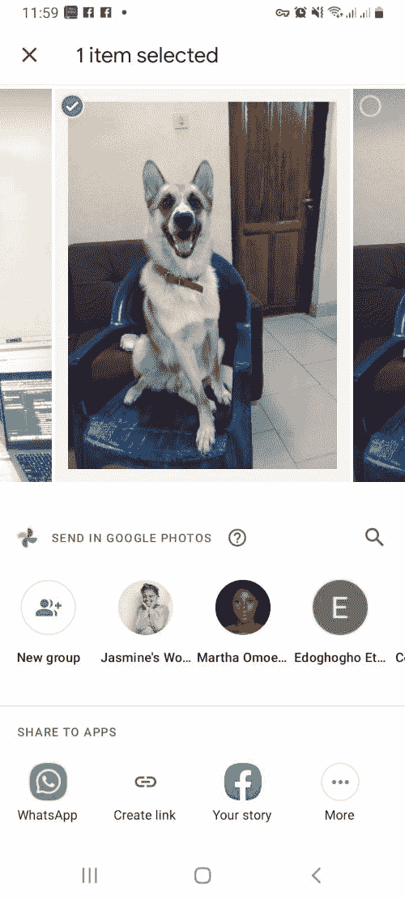
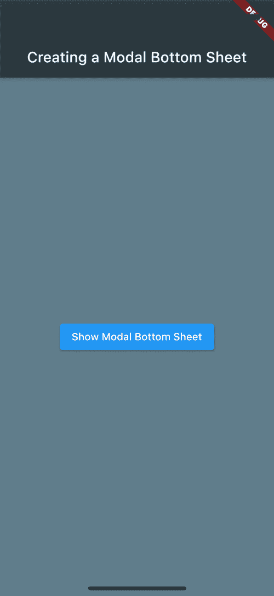
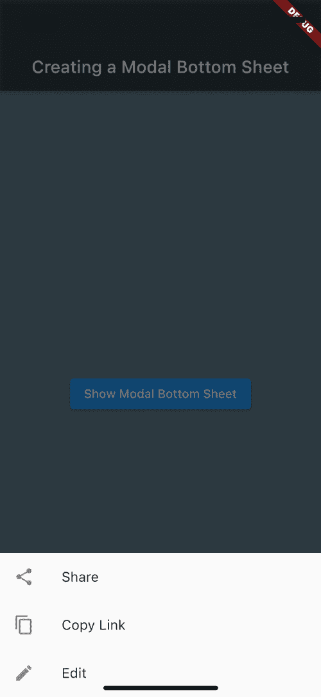

# 颤振模态底板教程示例- LogRocket 博客

> 原文：<https://blog.logrocket.com/flutter-modal-bottom-sheet-tutorial-with-examples/>

在本教程中，我们将通过实际例子演示如何在 Flutter 中创建一个模态底层。

以下是我们将要介绍的内容:

## 颤振中底板的类型

基本上有三种类型的[颤振底片](https://api.flutter.dev/flutter/material/BottomSheet-class.html):标准型、模态型和展开型。

1.  标准底部表单显示补充内容，而不会限制用户在表单可见时与应用程序的主要部分进行交互。标准底板也称为永久底板
2.  模态底部表单显示补充数据，同时限制用户与应用程序的其他部分进行交互。用户必须关闭模态底部表单才能继续与应用程序的主要内容进行交互
3.  扩展底板类似于标准底板和模态底板的混合体。展开的底部表单使用户能够访问标准表单和模式底部表单中显示的信息

对于本教程，我们将重点放在创建一个在颤振模态底部表。

## 什么是模态底板？

一个[模态底层](https://api.flutter.dev/flutter/material/showModalBottomSheet.html)是一个小部件，在材质设计上是 Flutter 应用的核心构建块。

Flutter 中的模态底部表单用于显示补充内容，同时限制用户与应用程序的主要内容进行交互。顾名思义，底部工作表位于屏幕的底部。

比方说，您有一张保存在 Google 相册中的照片，想要与朋友分享。当您点击照片并点击**分享**时，一些附加信息会显示在屏幕底部:



出现在屏幕底部的附加信息是底部表单的一个示例。

## 莫代尔底板有什么用途？

模态底部表单的目的是为应用程序中更多的内容创造空间。模态底层在手机 app 中很常见。它们通常用于在用户的移动设备上显示其他应用程序的链接。

如前所述，对于模态底层表单，与 UI 其他元素的交互是被阻止的。用户只能在取消(关闭)模态底部表单后才能与应用程序 UI 的其他部分进行交互。

一个模态底部表单将会出现以响应一些用户动作，比如点击一个图标。可以通过以下任何用户操作来消除它:

*   轻敲底层内的项目
*   点击应用程序的主用户界面
*   向下滑动

## `showModalBottomSheet`功能

可使用`[showModalBottomSheet](https://api.flutter.dev/flutter/material/showModalBottomSheet.html)`功能创建和显示模态底板。

让我们仔细看看`showModalBottomSheet`函数:

```
Future<T?> showModalBottomSheet<T>(
         {required BuildContext context,
         required WidgetBuilder builder,
         Color? backgroundColor,
         double? elevation,
         ShapeBorder? shape,
         Clip? clipBehavior,
         Color? barrierColor,
         bool isScrollControlled = false,
         bool useRootNavigator = false,
         bool isDismissible = true,
         bool enableDrag = true,
         RouteSettings? routeSettings,
         AnimationController? transitionAnimationController}
)

```

`showModalBottomSheet`有两个必需的属性:`BuildContext`和`WidgetBuilder`。

1.  `BuildContext`接受`context`参数，该参数用于查找底部工作表的`Navigator`和主题。这在调用方法时使用
2.  `WidgetBuilder`是一个函数，它获取当前上下文——在本例中是`builder`——并返回一个小部件。这个小部件是——您猜对了——一个底部表单小部件

## 如何在颤振中创建模态底板

为了展示模态底部表单的作用，我们将构建一个带有按钮的 Flutter 应用程序，单击该按钮将显示一个模态底部表单。

本教程假设了一些用 Flutter 构建应用程序的基本知识和经验[。](https://blog.logrocket.com/pros-and-cons-of-flutter-app-development/)

首先，在 Android Studio(或者你选择的任何 IDE)上启动一个新的 Flutter 项目。将项目命名为`modalbottomdemo`。

清除除了`import` `'package:flutter/material.dart'`之外的代码，我们将用它来导入 app 的材质设计组件和`void main() => runApp(MyApp());`，这是 Flutter 在创建新项目时生成的。我们这样做是因为我们想从头开始。

您的编辑器中应该有这样的内容:

```
import 'package:flutter/material.dart';

void main() {runApp(MyApp());}

```

创建一个由`MyApp()`扩展的`StatefulWidget`。在编辑器上键入`stfu + tab`将自动创建一个有状态的小部件。

```
class MyApp extends StatefulWidget {
  const MyApp({Key? key}) : super(key: key);

  @override
  _MyAppState createState() => _MyAppState();
}

```

接下来，使用 [Scaffold](https://api.flutter.dev/flutter/material/Scaffold-class.html) 小部件构建应用程序的 [AppBar](https://blog.logrocket.com/flutter-appbar-tutorial/) ，它就像一个容器，容纳了你的应用程序的结构(AppBar、body、side 等)。).

代码如下:

```
class _MyAppState extends State<MyApp> {
  @override
  Widget build(BuildContext context) {
    return MaterialApp(
      title: 'Modal Bottom Sheet Demo',
      home: Scaffold(
        backgroundColor: Colors.blueGrey,
        appBar: AppBar(
          title: const Text('Creating a Modal Bottom Sheet'),
          backgroundColor: Colors.black38,
        ),

```

现在是时候创建 body 小部件了，它将包含一个按钮`ElevatedButton`，并带有文本“显示模态底部表单”使用`Center`小部件将按钮放置在应用程序的中心。

如前所述，我们将使用`showModalBottomSheet`小部件来显示一个模态底部表单，它有两个属性:`context`和`builder`。

```
body: Builder(
          builder: (context) {
            return Center(
              child: ElevatedButton(
                child: Text('Show Modal Bottom Sheet'),
                onPressed: () {
                  showModalBottomSheet(
                    context: context,
                    builder: (context) {
                      return Wrap(
                        children: [
                          ListTile(
                            leading: Icon(Icons.share),
                            title: Text('Share'),
                          ),
                          ListTile(
                            leading: Icon(Icons.copy),
                            title: Text('Copy Link'),
                          ),
                          ListTile(
                            leading: Icon(Icons.edit),
                            title: Text('Edit'),
                          ),
                        ],
                      );
                    },
                  );
                },
              ),
            );
          },
        ),
      ),
    );
  }
}

```

在你选择的任何模拟器上运行应用程序。下面是我们的 Flutter 应用程序在 iPhone 12 迷你模拟器上运行的样子:



点击该按钮应调出隐藏菜单:



以下是该演示的完整代码:

```
import 'package:flutter/material.dart';

void main() {
  runApp(MyApp());
}

class MyApp extends StatefulWidget {
  const MyApp({Key? key}) : super(key: key);

  @override
  _MyAppState createState() => _MyAppState();
}

class _MyAppState extends State<MyApp> {
  @override
  Widget build(BuildContext context) {
    return MaterialApp(
      title: 'Modal Bottom Sheet Demo',
      home: Scaffold(
        backgroundColor: Colors.blueGrey,
        appBar: AppBar(
          title: const Text('Creating a Modal Bottom Sheet'),
          backgroundColor: Colors.black38,
        ),
        body: Builder(
          builder: (context) {
            return Center(
              child: ElevatedButton(
                child: Text('Show Modal Bottom Sheet'),
                onPressed: () {
                  showModalBottomSheet(
                    context: context,
                    builder: (context) {
                      return Wrap(
                        children: [
                          ListTile(
                            leading: Icon(Icons.share),
                            title: Text('Share'),
                          ),
                          ListTile(
                            leading: Icon(Icons.copy),
                            title: Text('Copy Link'),
                          ),
                          ListTile(
                            leading: Icon(Icons.edit),
                            title: Text('Edit'),
                          ),
                        ],
                      );
                    },
                  );
                },
              ),
            );
          },
        ),
      ),
    );
  }
}

```

## 结论

Flutter 带有可定制的小部件，可以用来构建 Android、iOS 和 web 的跨平台应用程序。使用`showModalBottomSheet`小部件，您可以创建模态底层表单，为那些在移动设备上访问您的应用程序的用户增强用户体验。

你可以通过浏览我们收集的 [Flutter 文章和教程](https://blog.logrocket.com/tag/flutter/)来了解更多关于 Flutter 的知识。

## 使用 [LogRocket](https://lp.logrocket.com/blg/signup) 消除传统错误报告的干扰

[](https://lp.logrocket.com/blg/signup)

[LogRocket](https://lp.logrocket.com/blg/signup) 是一个数字体验分析解决方案，它可以保护您免受数百个假阳性错误警报的影响，只针对几个真正重要的项目。LogRocket 会告诉您应用程序中实际影响用户的最具影响力的 bug 和 UX 问题。

然后，使用具有深层技术遥测的会话重放来确切地查看用户看到了什么以及是什么导致了问题，就像你在他们身后看一样。

LogRocket 自动聚合客户端错误、JS 异常、前端性能指标和用户交互。然后 LogRocket 使用机器学习来告诉你哪些问题正在影响大多数用户，并提供你需要修复它的上下文。

关注重要的 bug—[今天就试试 LogRocket】。](https://lp.logrocket.com/blg/signup-issue-free)