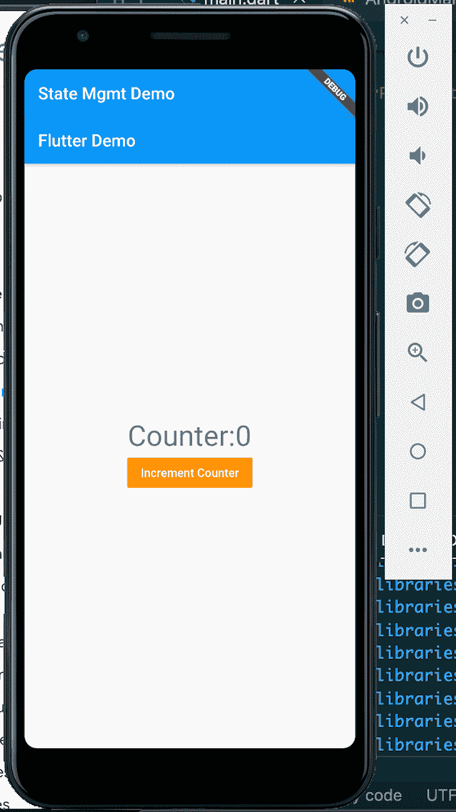
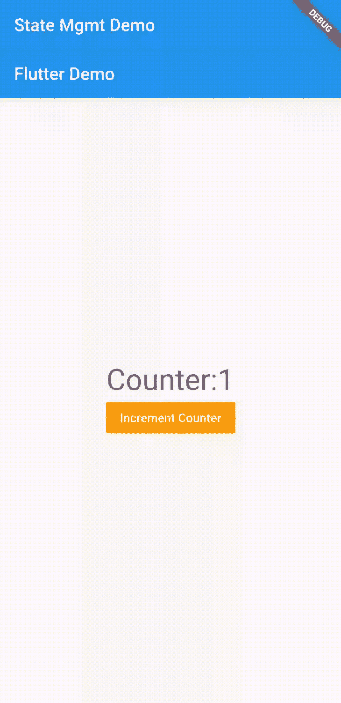
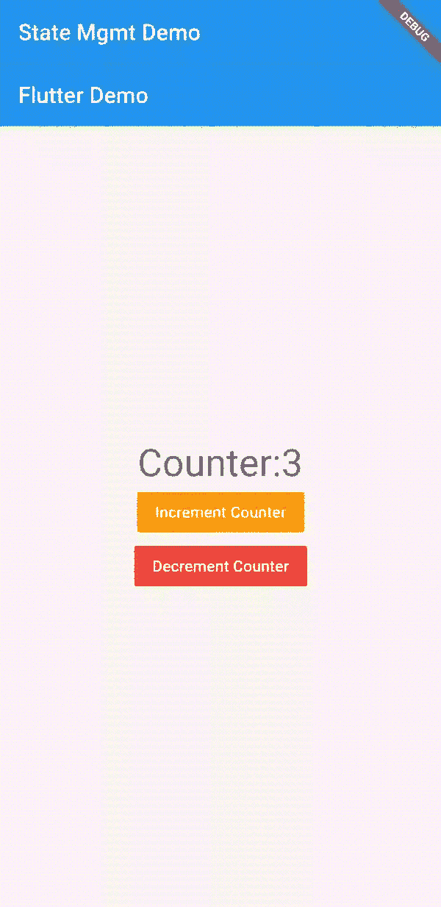
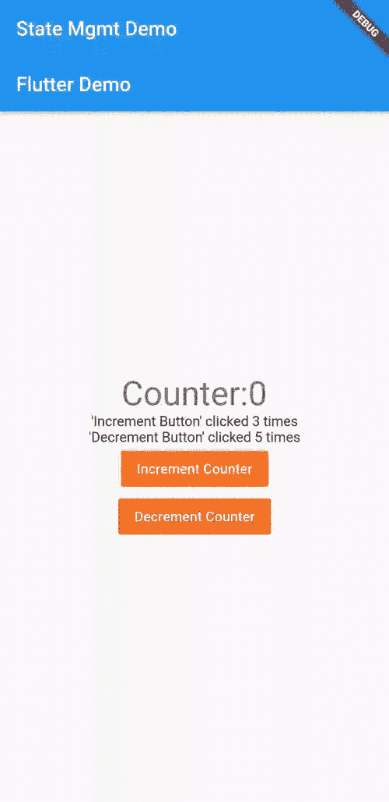
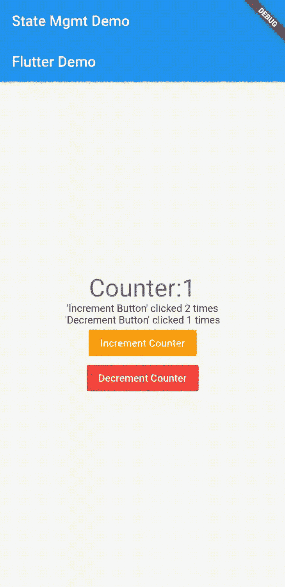
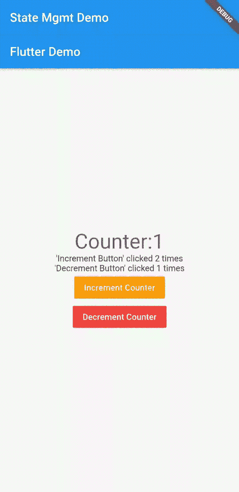

# 颤振状态管理方法:综述

> 原文：<https://blog.logrocket.com/flutter-state-management-methods/>

状态管理是 UI 框架必须实现的关键特性之一——并且要很好地实现。正是因为这个原因，许多开发人员最终构建了专用的状态管理库；内置的解决方案对他们来说还不够，或者他们想根据自己的口味进行调整。

UI 框架已经加快了他们的游戏步伐，使游戏环境更加公平。他们的内置状态管理解决方案现在可以匹配现有外部解决方案的性能。比如 React，[引入了 Hooks 和 Context](https://blog.logrocket.com/use-hooks-and-context-not-react-and-redux/) 与 React-Redux 竞争。

在 Flutter 中也发生了同样的事情:它提供了许多管理应用状态的内置方法。在这篇文章中，我们将看看一些基本而强大的方法，我们可以管理我们的颤振应用程序的状态。

## 在颤振中使用`setState`

如果你来自 React，你会发现这种在 Flutter 中管理状态的方法类似于使用`useState`钩子。

`setState`只管理声明它的小部件中的状态——就像在 React 中一样，其中`useState`钩子只管理创建它的组件中的本地状态。这种类型的状态管理被称为[e](https://flutter.dev/docs/development/data-and-backend/state-mgmt/ephemeral-vs-app#ephemeral-state)状态。这里，这种状态是使用`StatefulWidget`和`setState()`方法控制的。

让我们通过创建一个简单的计数器应用程序来看看`setState`是如何工作的。该应用程序将有一个计数器的数字，我们可以通过点击按钮增加和减少。

首先，通过运行以下命令来搭建一个颤振项目:

```
flutter create myapp

```

这将创建一个名为`myapp`的 Flutter 项目文件夹。现在让我们在服务器上运行项目:

```
flutter run myapp

```

在我们的项目文件夹中，我们应该会看到一个`main.dart`文件。这是主要的 Flutter 应用程序文件。清除文件内容并添加以下代码:

```
import 'package:flutter/material.dart';
void main() {
  runApp(MyApp());
}
class MyApp extends StatelessWidget {
  @override
  Widget build(BuildContext context) {
    return MaterialApp(
        title: 'Flutter Demo',
        theme: ThemeData(
          primarySwatch: Colors.blue,
          visualDensity: VisualDensity.adaptivePlatformDensity,
        ),
        home: Scaffold(
            appBar: AppBar(
              title: Text("State Mgmt Demo"),
            ),
            body: CounterPage(title: 'Flutter Demo')),
        );
  }
}

```

Flutter 中的一切都是小部件。`MyApp`是我们 app 的入口/根小部件。在`body`道具中，注意我们正在渲染一个`CounterPage`小部件。这是一个扩展了`StatefulWidget`类的有状态小部件。

`StatefulWidgets`用于管理小部件中的本地状态。它们创建一个关联的`State`对象，并且它们还保存不可变的变量。

这里有一个例子:

```
class NotificationCounter extends StatefulWidget {
    final String name;
    NotificationCounter({this.name});
    @override
    _NotificationCounterState createState() =&amp;gt; _NotificationCounterState();
}

```

上面的`name`变量是一个不可变的变量。`StatefulWidget`只保存不可变的变量和`State`对象。

让我们看看我们的`CounterPage`代码:

```
class CounterPage extends StatefulWidget {
  CounterPage({Key key, this.title}) : super(key: key);
  final String title;
  @override
  CounterPageState createState() =&amp;gt; CounterPageState();
}

```

`createState`方法从`CounterPageState`创建一个对象并返回它。构建小部件时会调用`createState`方法。

让我们看看`CounterPageState`的代码:

```
class CounterPageState extends State&amp;lt;CounterPage&amp;gt; {
  int _counter = 0;
  void _incrementCounter() {
    setState(() {
      _counter++;
    });
  }
  @override
  Widget build(BuildContext context) {
    return Scaffold(
      appBar: AppBar(
        title: Text(widget.title),
      ),
      body: Center(
        child: Column(
          mainAxisAlignment: MainAxisAlignment.center,
          children: &amp;lt;Widget&amp;gt;[
            Row(
              mainAxisAlignment: MainAxisAlignment.center,
              children: [
                Text(
                  'Counter:',
                  style: Theme.of(context).textTheme.headline4,
                ),
                Text(
                  '$_counter',
                  style: Theme.of(context).textTheme.headline4,
                ),
              ],
            ),
            FlatButton(
              color: Colors.orange,
              child: Text('Increment Counter', style: TextStyle(color: Colors.white)),
              onPressed: _incrementCounter,
            )
          ],
        ),
      )
    );
  }
}

```

`CounterPageState`有一个可变变量`_counter`，它存储计数器的数字，并且可以在小部件的生命周期内改变。

当必须构建小部件时，调用`build`方法。它返回小部件的 UI，`appBar` - > `title`设置页面的应用栏将显示什么。`body`设置小工具主体的 UI。

一般来说，这个小部件会在一行中显示文本**计数器:**、变量`_counter`，在下一行中显示一个按钮。该按钮设置了一个`onPressed`事件，类似于 HTML 中的`onclick`事件。

当按钮被按下时，`_incrementCounter`函数调用`setState`。这个方法调用告诉 Flutter，一个小部件内部的状态已经改变，必须重新绘制这个小部件。`setState`的函数参数增加了`_counter`变量。

```
void _incrementCounter() {
    setState(() {
      _counter++;
    });
  }

```

因此，每当我们点击**递增计数器**按钮时，`_counter`就会递增，并且`setState`会被调用，这告诉 Flutter 重新构建窗口小部件树。调用`CounterPageState`的`build`方法，然后重新构建小部件中的小部件树，并重新呈现在 UI 上(注意，只重新呈现发生变化的部分)。

如果我们在模拟器中启动我们的应用程序，它应该是这样的:



按下按钮时，数字会增加:



现在让我们添加一个减量按钮。此按钮将减少计数器，并将更新反映到屏幕上。我们如何做到这一点？

简单:我们将添加一个带有文本`Decrement Counter`的新`FlatButton`，并在其上设置一个`onPressed`事件。我们将创建一个方法`_decrementCounter`，并将其设置为`onPressed`事件的处理程序。

这个`_decrementCounter`方法在被调用时会将`_counter`减 1，并调用`setState`来更新 UI:

```
class CounterPageState extends State&amp;lt;CounterPage&amp;gt; {
  int _counter = 0;
  void _incrementCounter() {
    setState(() {
      _counter++;
    });
  }
  void _decrementCounter() {
    setState(() {
      _counter--;
    });
  }
  @override
  Widget build(BuildContext context) {
    return Scaffold(
        appBar: AppBar(
          title: Text(widget.title),
        ),
        body: Center(
          child: Column(
            mainAxisAlignment: MainAxisAlignment.center,
            children: &amp;lt;Widget&amp;gt;[
              Row(
                mainAxisAlignment: MainAxisAlignment.center,
                children: [
                  Text(
                    'Counter:',
                    style: Theme.of(context).textTheme.headline4,
                  ),
                  Text(
                    '$_counter',
                    style: Theme.of(context).textTheme.headline4,
                  ),
                ],
              ),
              FlatButton(
                color: Colors.orange,
                child: Text('Increment Counter',
                    style: TextStyle(color: Colors.white)),
                onPressed: _incrementCounter,
              ),
              FlatButton(
                color: Colors.red,
                child: Text('Decrement Counter',
                    style: TextStyle(color: Colors.white)),
                onPressed: _decrementCounter,
              )
            ],
          ),
        ));
  }
}

```

我们给**递减按钮**一个红色背景，放在**递增按钮**的下面。`_decrementCounter`方法被设置为它的`onPressed`事件。每次被调用时，`_decrementCounter`方法减少`_counter`，并且它调用`setState`来触发 UI 更新。

请参见下面的演示:



现在我们已经看到了如何使用小部件本身来管理状态，让我们看看另外两个选项:使用父小部件来管理状态，以及使用混合匹配方法。

在这种方法中，小部件的父部件保存状态变量并管理状态。父部件通过将状态变量传递给子部件来告诉部件何时更新。用于改变状态的方法也被传递给子小部件，小部件可以调用它来改变状态和更新自身。

我们可以重写上面的`counter`例子来使用这种方法。我们将有一个无状态的小部件，它的工作是呈现用户界面。创建一个类`Counter`，并按如下方式填充:

```
class Counter extends StatelessWidget {
  final counter;
  final decrementCounter;
  final incrementCounter;
  Counter(
      {Key key,
      this.counter: 0,
      @required this.decrementCounter,
      @required this.incrementCounter})
      : super(key: key);
  @override
  Widget build(BuildContext context) {
    return Scaffold(
        body: Column(
      mainAxisAlignment: MainAxisAlignment.center,
      children: &amp;lt;Widget&amp;gt;[
        Row(
          mainAxisAlignment: MainAxisAlignment.center,
          children: [
            Text(
              'Counter:',
              style: Theme.of(context).textTheme.headline4,
            ),
            Text(
              '$counter',
              style: Theme.of(context).textTheme.headline4,
            ),
          ],
        ),
        FlatButton(
          color: Colors.orange,
          child:
              Text('Increment Counter', style: TextStyle(color: Colors.white)),
          onPressed: () {
            incrementCounter();
          },
        ),
        FlatButton(
          color: Colors.red,
          child:
              Text('Decrement Counter', style: TextStyle(color: Colors.white)),
          onPressed: () {
            decrementCounter();
          },
        )
      ],
    ));
  }
}

```

同样，这是一个无状态小部件，所以它不保存状态；它只是呈现传递给它的内容。

注意，我们将呈现计数器的工作转移到了这个小部件上。计数器通过`this.counter`传递给它，递减和递增功能分别通过`this.decrementCounter`和`this.incrementCounter`传递给它。所有这些都是从父小部件`CounterPageState`传递过来的。

现在，`CounterPageState`小部件将看起来像这样:

```
class CounterPageState extends State&amp;lt;CounterPage&amp;gt; {
  // ...
  @override
  Widget build(BuildContext context) {
    return Scaffold(
        // ...
        body: Center(
            child: Counter(
                counter: _counter,
                decrementCounter: _decrementCounter,
                incrementCounter: _incrementCounter
            )
        )
    );
  }
}

```

`Counter`现在由`CounterPageState`呈现，它之前呈现的 UI 现在由新的`Counter`小部件处理。

* * *

### 更多来自 LogRocket 的精彩文章:

* * *

这里，`_counter`状态被传递给`counter`道具中的`Counter`小部件。`Counter`小部件将通过其主体中的`counter`访问计数器。

另外，`_decrementCounter`和`_incrementCounter`方法被传递给`Counter`小部件。这些从`Counter`小部件中调用，以更新`CounterPageState`小部件中的状态`_counter`，这将导致`CounterPageState`重建并重新呈现`Counter`以显示新更改的状态。

### 混合匹配状态管理

在这种方法中，父部件管理一些状态，而子部件管理状态的另一个方面。为了演示这一点，我们将让我们的`Counter`小部件保存一个状态，这使它成为一个`StatefulWidget`。

我们将跟踪**递增按钮**和**递减按钮**被点击的次数，并在两种状态下保持该数字。

现在，让我们让`Counter`小部件成为一个有状态的小部件:

```
class Counter extends StatefulWidget {
  final counter;
  final decrementCounter;
  final incrementCounter;
  Counter(
      {Key key,
      this.counter: 0,
      @required this.decrementCounter,
      @required this.incrementCounter})
      : super(key: key);
  @override
  CounterState createState() =&amp;gt; CounterState();
}

```

我们可以看到`createState`方法返回了一个`CounterState`对象。让我们来看看`CounterState`班:

```
class CounterState extends State&amp;lt;Counter&amp;gt; {
  var incrButtonClicked = 0;
  var decreButtonClicked = 0;
  @override
  Widget build(BuildContext context) {
    return Scaffold(
        body: Column(
      mainAxisAlignment: MainAxisAlignment.center,
      children: &amp;lt;Widget&amp;gt;[
        Row(
          mainAxisAlignment: MainAxisAlignment.center,
          children: [
            Text(
              'Counter:',
              style: Theme.of(context).textTheme.headline4,
            ),
            Text(
              widget.counter.toString(),
              style: Theme.of(context).textTheme.headline4,
            ),
          ],
        ),
        Column(
          mainAxisAlignment: MainAxisAlignment.center,
          children: [
            Text("'Increment Button' clicked $incrButtonClicked times"),
            Text("'Decrement Button' clicked $decreButtonClicked times")
          ],
        ),
        FlatButton(
          color: Colors.orange,
          child:
              Text('Increment Counter', style: TextStyle(color: Colors.white)),
          onPressed: () {
            widget.incrementCounter();
            setState(() {
              incrButtonClicked++;
            });
          },
        ),
        FlatButton(
          color: Colors.red,
          child:
              Text('Decrement Counter', style: TextStyle(color: Colors.white)),
          onPressed: () {
            widget.decrementCounter();
            setState(() {
              decreButtonClicked++;
            });
          },
        )
      ],
    ));
  }
}

```

注意，`Counter`小部件的前一个 UI 在这里。我们添加了`incrButtonClicked`和`decreButtonClicked`状态来保存按钮被按下的次数。我们还添加了一个`Column`小部件，在以主轴为中心的列中显示`Text`小部件。这些`Text`小部件将显示每个按钮被点击的次数。

现在，在每个按钮的`onPressed`事件处理程序中，我们通过`widget`对象调用`incrementCounter`或`decrementCounter`方法。我们使用了`widget`对象来访问有状态小部件中的父变量。然后，我们调用`setState`方法，增加或减少状态变量`incrButtonClicked`和`decreButtonClicked`。

因此，我们可以看到我们有一个混合的状态管理方法:父窗口小部件处理`counter`状态，而子窗口小部件处理点击状态。

请参见下面的演示:



这种技术使用父部件和子部件之间的通信方法。数据设置在父部件上，子部件可以从父部件访问数据，这样部件状态可以无缝传递。

这种状态管理类似于在 Angular 中使用`Service`的类，也与 React 的上下文 API 有相似之处。

`InheritedWidget`是 Flutter 中的一个基类，用于沿着窗口小部件树向下传播信息。

它是这样工作的:一个`InheritedWidget`包含了一个小部件树。现在，树中的小部件可以引用`InheritedWidget`来访问其中的公共变量，从而在树中传递数据。由`InheritedWidget`保存的数据通过它的构造函数传递给它。

当我们必须通过一长串小部件传递数据，以便在小部件中使用它时,`InheritedWidget`非常有用。例如，我们有这样的小部件树:

```
  MyApp
    |
    v
CounterPage
    |
    v
DummyContainer1
    |
    v
DummmyContainer2
    |
    v
  Counter

```

`CounterPage`有一个带有`incrementCounter`和`incrementCounter`方法的`counter`状态。我们希望在带有`Counter`小部件的 UI 中显示`counter`。为此，我们必须将`counter`状态和两个方法传递给`Counter`小部件。

首先，从`CounterPage`小部件，我们将呈现`DummyContainer`小部件，将`counter`和两个方法作为参数传递给它的构造函数。接下来，`DummyContainer1`将呈现`DummyContainer2`，并将`counter`状态和两个方法作为参数传递给`DummyContainer2`构造函数。最后，`DummyContainer2`将呈现`Counter`，并将计数器和方法传递给它。

有了`InheritedWidget`，我们可以取消所有这些道具训练。用`InheritedWidget`，我们将在其中设置`counter`和两个方法。`InheritedWidget`将渲染`DummyContainer1`，而`CounterPage`将渲染`InheritedWidget`。`CounterPage`会将`counter`和方法设置为`InheritedWidget`中的数据。

```
  MyApp
    |
    v
CounterPage
    |
    v
MyInheritedWidget
    |
    v
DummyContainer1
    |
    v
DummmyContainer2
    |
    v
  Counter

```

这是包含了`InheritedWidget`的树的样子。

我们来编码吧！我们从`CounterPage`开始:

```
class CounterPage extends StatefulWidget {
  CounterPage({Key key, this.title}) : super(key: key);
  final String title;
  @override
  CounterPageState createState() =&amp;gt; CounterPageState();
  static CounterPageState of(BuildContext context) {
    return context.dependOnInheritedWidgetOfExactType&amp;lt;MyInheritedWidget&amp;gt;().data;
  }
}

```

我们添加了一个`static`方法`of`。这个方法使用`context`通过方法调用`dependOnInheritedWidgetOfExactType<MyInheritedWidget>()`返回一个`InheritedWidget`。该方法返回精确类型的小部件树中最近的`Inherited``W``idget`；在这种情况下，我们想要一个`MyInheritedWidget`类型。

现在，在我们的`CounterPageState`中，我们将渲染`MyInheritedWidget`，在它内部，我们将渲染`DummyContainer1`小部件。

```
class CounterPageState extends State&amp;lt;CounterPage&amp;gt; {
    // ...
  @override
  Widget build(BuildContext context) {
    return Scaffold(
        appBar: AppBar(
          title: Text(widget.title),
        ),
        body: Center(
            child: MyInheritedWidget(
                child: DummyContainer1(),
                data: this
            )
        )
    );
  }
}

```

`data`参数持有`this`，这意味着`CounterPageState`的公共属性可以通过`data`属性被`MyInheritedWidget`访问。我们这样做是因为我们希望`_counter`，以及两个方法`_incrementCounter`和`_decrementCounter`，被一个`InheritedWidget`引用。这样，我们可以使用`InheritedWidget`来访问`counter`状态和小部件树中任何地方的方法。

让我们创建`MyInheritedWidget`、`DummyContainer1`和`DummyContainer2`小部件。

```
class MyInheritedWidget extends InheritedWidget {
  final CounterPageState data;
  MyInheritedWidget({
    Key key,
    @required Widget child,
    @required this.data,
  }) : super(key: key, child: child);
  @override
  bool updateShouldNotify(InheritedWidget oldWidget) {
    return true;
  }
}

```

我们有一个`data`属性和一个对象`CounterPageState`。这就是我们在`CounterPageState`中学过的课的对象。`updateShouldNotify`方法决定了`InheritedWidget`是否会重新构建它下面的窗口小部件树。如果返回 true，将重新构建小部件树；如果返回 false，当状态改变时，将不会重新构建小部件树。

```
class DummyContainer1 extends StatelessWidget {
  const DummyContainer1({Key key}) : super(key: key);
  @override
  Widget build(BuildContext context) {
    return DummyContainer2();
  }
}

```

这个`DummyContainer1`小部件呈现了`DummyContainer2`小部件。

```
class DummyContainer2 extends StatelessWidget {
  const DummyContainer2({Key key}) : super(key: key);
  @override
  Widget build(BuildContext context) {
    return Counter();
  }
}

```

反过来，`DummyContainer2`小部件呈现`Counter`小部件。

现在，让我们看看我们的`Counter`小部件:

```
class Counter extends StatefulWidget {
  @override
  CounterState createState() =&amp;gt; CounterState();
}

```

它只实现了`createState`方法:

```
class CounterState extends State&amp;lt;Counter&amp;gt; {
  var incrButtonClicked = 0;
  var decreButtonClicked = 0;
  var counter;
  CounterPageState data;
  @override
  void didChangeDependencies() {
    super.didChangeDependencies();
    data = CounterPage.of(context);
    counter = data._counter;
  }
  @override
  Widget build(BuildContext context) {
    return Scaffold(
        body: Column(
      mainAxisAlignment: MainAxisAlignment.center,
      children: &amp;lt;Widget&amp;gt;[
        Row(
          mainAxisAlignment: MainAxisAlignment.center,
          children: [
            Text(
              'Counter:',
              style: Theme.of(context).textTheme.headline4,
            ),
            Text(
              counter.toString(),
              style: Theme.of(context).textTheme.headline4,
            ),
          ],
        ),
        Column(
          mainAxisAlignment: MainAxisAlignment.center,
          children: [
            Text("'Increment Button' clicked $incrButtonClicked times"),
            Text("'Decrement Button' clicked $decreButtonClicked times")
          ],
        ),
        FlatButton(
          color: Colors.orange,
          child:
              Text('Increment Counter', style: TextStyle(color: Colors.white)),
          onPressed: () {
            data._incrementCounter();
            setState(() {
              incrButtonClicked++;
            });
          },
        ),
        FlatButton(
          color: Colors.red,
          child:
              Text('Decrement Counter', style: TextStyle(color: Colors.white)),
          onPressed: () {
            data._decrementCounter();
            setState(() {
              decreButtonClicked++;
            });
          },
        )
      ],
    ));
  }
}

```

注意，我们从构造函数中移除了道具。我们使用`CounterPageState data = CounterPage.of(context);`来获得`data`变量中的`MyInheritedWidget`。从那里，我们可以访问`MyInheritedWidget`中的公共属性和方法。注意我们是如何从`data`变量中访问`_counter`、`_incrementCounter`和`_decrementCounter`属性的。

这些是从`CounterPageState`存储在`MyInheritedWidget`中的属性，所以一旦我们引用了`MyInheritedWidget`，我们就可以从部件树中的任何地方获得这些属性。这就是数据如何通过小部件树中任何地方的`InheritedWidget`传递和访问的。

这是演示:



#### `InheritedModel`

`InheritedModel`的工作方式与`InheritedWidget`相同:它管理状态，并在部件树中传播状态。但是`InheritedModel`略有不同，它允许对变更检测触发器和更新通知进行更好的控制，可以设置为在特定数据变更时做出响应。

`InheritedModel`易于实现。让我们重写上面的`Counter`例子来使用`InheritedModel`。令人惊讶的是，代码几乎是一样的。

首先，将`MyInheritedWidget`改为`MyInheritedModel`:

```
class MyInheritedModel extends InheritedModel&amp;lt;String&amp;gt; {
  final CounterPageState data;
  MyInheritedModel({
    Key key,
    @required Widget child,
    @required this.data,
  }) : super(key: key, child: child);
  @override
  bool updateShouldNotify(MyInheritedModel old) {
    return true;
  }
  @override
  bool updateShouldNotifyDependent(MyInheritedModel old, Set&amp;lt;String&amp;gt; aspects) {
    return true;
  }
  static MyInheritedModel of(BuildContext context, String aspect) {
    return InheritedModel.inheritFrom&amp;lt;MyInheritedModel&amp;gt;(context,
        aspect: aspect);
  }
}

```

还是老样子；这里最关键的是`static`方法`of`。它返回自身的一个实例，因此我们可以用它来访问它的公共属性。`final CounterPageState data;`是我们想要公开的属性——它是将由这个`InheritedModel`沿着它的小部件树传播的状态。注意，它的值是由构造函数中的`this.data`参数设置的。

接下来，我们相应地更新我们的`CounterState`:

```
class CounterState extends State&amp;lt;Counter&amp;gt; {
  var incrButtonClicked = 0;
  var decreButtonClicked = 0;
  var counter;
  MyInheritedModel inheritedModel;
  @override
  Widget build(BuildContext context) {
    inheritedModel = MyInheritedModel.of(context, "");
    counter = inheritedModel.data._counter;
    return Scaffold(
        body: Column(
      mainAxisAlignment: MainAxisAlignment.center,
      children: &amp;lt;Widget&amp;gt;[
        Row(
          mainAxisAlignment: MainAxisAlignment.center,
          children: [
            Text(
              'Counter:',
              style: Theme.of(context).textTheme.headline4,
            ),
            Text(
              counter.toString(),
              style: Theme.of(context).textTheme.headline4,
            ),
          ],
        ),
        Column(
          mainAxisAlignment: MainAxisAlignment.center,
          children: [
            Text("'Increment Button' clicked $incrButtonClicked times"),
            Text("'Decrement Button' clicked $decreButtonClicked times")
          ],
        ),
        FlatButton(
          color: Colors.orange,
          child:
              Text('Increment Counter', style: TextStyle(color: Colors.white)),
          onPressed: () {
            inheritedModel.data._incrementCounter();
            setState(() {
              incrButtonClicked++;
            });
          },
        ),
        FlatButton(
          color: Colors.red,
          child:
              Text('Decrement Counter', style: TextStyle(color: Colors.white)),
          onPressed: () {
            inheritedModel.data._decrementCounter();
            setState(() {
              decreButtonClicked++;
            });
          },
        )
      ],
    ));
  }
}

```

这里我们有`MyInheritedModel inheritedModel;`，我们在`build()`方法中调用`inheritedModel = MyInheritedModel.of(context, "");`得到`MyInheritedModel`的实例。

现在，从`inheritedModel`开始，我们可以访问`final CounterPageState data;`属性来获取`CounterPageState`小部件中的`counter`、`_incrementCounter`和`_decrementCounter`属性。

从`counter = inheritedModel.data._counter;`接收计数器状态，然后在显示之前将其转换为字符串。

通过`inheritedModel.data._incrementCounter();`和`inheritedModel.data._decrementCounter();`调用`_incrementCounter`、`_decrementCounter`方法，分别增加和减少按钮点击次数。

这将是`Counter`代码:

```
class Counter extends StatefulWidget {
  @override
  CounterState createState() =&amp;gt; CounterState();
}

```

这里没有什么值得注意的；只需实现`createState`方法并返回一个`CounterState`小部件的实例。

现在，这是我们的`CounterPageState`:

```
class CounterPageState extends State&amp;lt;CounterPage&amp;gt; {
  int _counter = 0;
  void _incrementCounter() {
    setState(() {
      _counter++;
    });
  }
  void _decrementCounter() {
    setState(() {
      _counter--;
    });
  }
  @override
  Widget build(BuildContext context) {
    return Scaffold(
        appBar: AppBar(
          title: Text(widget.title),
        ),
        body: Center(
            child: MyInheritedModel(
                child: DummyContainer1(),
                data: this
            )
        )
    );
  }
}

```

`CounterPageState`挂载`MyInheritedModel`。`CounterPageState`的实例通过`data`参数传递给它的构造函数。这就是我们如何从`MyInheritedModel`访问`CounterPageState`的公共属性。

这是演示:



## 结论

我们已经介绍了使用 Flutter 的内置机制进行状态管理的基础知识。我们首先分析了什么是状态管理，以及它对于任何 UI 框架来说是多么的理想。接下来，我们看了看`setState`和它如何与 React 的`useState`挂钩相比较。我们举例说明了`setState`是如何工作的，以及我们如何用它来构建现实世界的应用程序。

然后我们讨论了`InheritedWidget`,并看到了我们如何声明一个状态并沿着窗口小部件树向下传播它。树中的小部件可以订阅状态，以便在状态改变时获得更新。

类似于`InheritedWidget`，我们看了`InheritedModel`，它沿着部件树向下传播状态。这里的区别在于，我们可以选择在状态改变时希望得到通知的状态。

## 进一步阅读

使用 [LogRocket](https://lp.logrocket.com/blg/signup) 消除传统错误报告的干扰

## [LogRocket](https://lp.logrocket.com/blg/signup) 是一个数字体验分析解决方案，它可以保护您免受数百个假阳性错误警报的影响，只针对几个真正重要的项目。LogRocket 会告诉您应用程序中实际影响用户的最具影响力的 bug 和 UX 问题。

[](https://lp.logrocket.com/blg/signup)

然后，使用具有深层技术遥测的会话重放来确切地查看用户看到了什么以及是什么导致了问题，就像你在他们身后看一样。

LogRocket 自动聚合客户端错误、JS 异常、前端性能指标和用户交互。然后 LogRocket 使用机器学习来告诉你哪些问题正在影响大多数用户，并提供你需要修复它的上下文。

关注重要的 bug—[今天就试试 LogRocket】。](https://lp.logrocket.com/blg/signup-issue-free)

Focus on the bugs that matter — [try LogRocket today](https://lp.logrocket.com/blg/signup-issue-free).