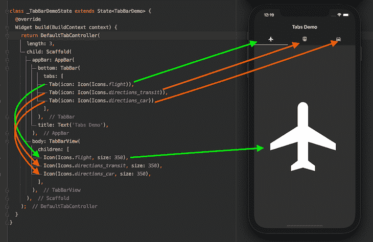
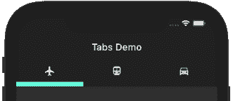
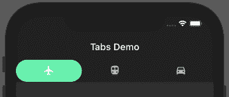
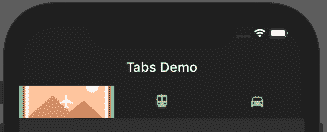
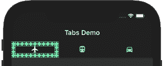
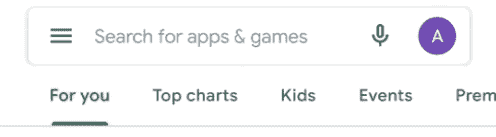
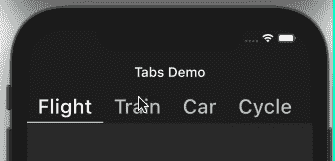
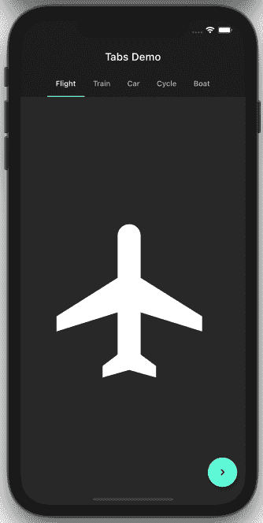
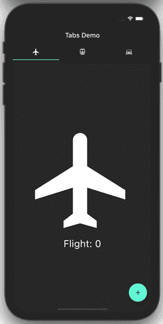

# Flutter TabBar:带示例的完整教程

> 原文：<https://blog.logrocket.com/flutter-tabbar-a-complete-tutorial-with-examples/>

应用程序通常为用户提供不同类别的内容或功能。自然，你希望你的用户能够快速浏览每个选项，并通过简单的滑动在类别之间移动。这就是 Flutter TabBar 类出现的原因。

在本教程中，我们将告诉你所有你需要知道的关于 Flutter 中 TabBar 的事情，向你展示如何在你的 Flutter 应用中实现标签，并浏览一些 TabBar 示例。

我们将详细介绍以下内容:

如果你是视觉学习者，看看这个快速视频教程:

 [https://www.youtube.com/embed/POtoEH-5l40?version=3&rel=1&showsearch=0&showinfo=1&iv_load_policy=1&fs=1&hl=en-US&autohide=2&wmode=transparent](https://www.youtube.com/embed/POtoEH-5l40?version=3&rel=1&showsearch=0&showinfo=1&iv_load_policy=1&fs=1&hl=en-US&autohide=2&wmode=transparent)

视频

在颤振中设置 TabBar

## 下面是启动和运行 TabBar 的最少代码:

要在 Flutter 应用程序中实现 TabBar，请完成以下步骤:

```
DefaultTabController(
  length: 3,
  child: Scaffold(
    appBar: AppBar(
      bottom: TabBar(
        tabs: [
          Tab(icon: Icon(Icons.flight)),
          Tab(icon: Icon(Icons.directions_transit)),
          Tab(icon: Icon(Icons.directions_car)),
        ],
      ),
      title: Text('Tabs Demo'),
    ),
    body: TabBarView(
      children: [
        Icon(Icons.flight, size: 350),
        Icon(Icons.directions_transit, size: 350),
        Icon(Icons.directions_car, size: 350),
      ],
    ),
  ),
);

```

将`Scaffold`小部件包裹在 [`DefaultTabController`](https://api.flutter.dev/flutter/material/DefaultTabController-class.html) 内。这应该用于最简单的用例。如果你想以编程方式控制标签，你应该使用[标签控制器](https://api.flutter.dev/flutter/material/TabController-class.html)并避免这一步

1.  将`TabBar`小工具作为 [`AppBar`](https://api.flutter.dev/flutter/material/AppBar-class.html) 的底部属性
2.  在`AppBar`的正文中提供 [`TabBarView`](https://api.flutter.dev/flutter/material/TabBarView-class.html) 。`TabBarView`类似于 [`PageView`](https://api.flutter.dev/flutter/widgets/PageView-class.html) ，主要与 TabBar 一起使用，因为它根据当前选择的选项卡显示小部件
3.  

如何自定义 TabBar 中的标签指示器

## 您可以修改 TabBar 中的选项卡指示器来定制您的 Flutter 应用程序的外观。

下面是一些方法的例子，你可以修改指标，以改善用户体验和应用程序的整体外观。

选项卡颜色

### 要改变标签的颜色:


```
TabBar(
  indicatorColor: Colors.amberAccent,
  tabs: [],
)

```

标签尺寸

### 以下是更改标签大小的方法:

这使得指示器的大小等于标签的宽度。默认值为`TabBarIndicatorSize.tab`。

```
TabBar(
  indicatorSize: TabBarIndicatorSize.label,            
  tabs: [],
)

```


制表符高度

### 要更改标签的高度:



```
TabBar(
  indicatorWeight: 10,      
  tabs: [],
)

```

改变指标

### 您可以更改指标本身，如下所示:

颤动标签栏背景颜色

```
TabBar(
  indicator: BoxDecoration(
    borderRadius: BorderRadius.circular(50), // Creates border
    color: Colors.greenAccent), //Change background color from here
  tabs: [],
)

```

### 改变标签的背景颜色就像改变`color: Colors.greenAccent`一样简单。



背景图像

### 要使用 TabBar 设定背景图像:



```
indicator: BoxDecoration(
    color: Colors.greenAccent,
    image: DecorationImage(
        image: AssetImage('assets/images/placeholder.png'),
        fit: BoxFit.fitWidth)),

```

创建自定义指示器

### 如果您想用 TabBar 创建一个自定义指示器，请输入以下内容:



```
indicator: CustomDecoration(12.0),

```

由于`indicator`属性接受`Decoration`，您的想象力是唯一的限制。你可以在指示器的位置创建任何东西。

比方说，你正在开发一个有很多类别的应用，类似于 Google Play:



让我们探索一些方法来包含你所有的标签页，并使其可以水平和垂直滚动。

可水平滚动的选项卡

### TabBar 小部件有一个专用于配置水平滚动选项卡的属性。将`isScrollable`设置为`True`，工作完成。你必须显式地设置它，因为它默认为`False`。



带应用栏的垂直滚动标签

```
TabBar(
  isScrollable: true,
  tabs: [
    ...
  ],
)

```

### 你应该一直努力提高你的应用程序的用户体验。如果你让 TabBar 消失，并在不需要的时候隐藏 AppBar，大多数用户会很感激。当用户想要通过向上滚动来查看特定类别中的更多内容时，应用程序栏会被隐藏，从而为内容布局创造更多空间:


你需要做的就是用`[SliverAppBar]([https://api.flutter.dev/flutter/material/SliverAppBar-class.html](https://api.flutter.dev/flutter/material/SliverAppBar-class.html))`替换 AppBar，并把它包在`NestedScrollView`里面。但是为了防止 TabBar 离开屏幕，将`pinned`和`floating`标志设置为`true`。

```
DefaultTabController(
  length: 5,
  child: Scaffold(
      body: NestedScrollView(
    headerSliverBuilder: (BuildContext context, bool innerBoxIsScrolled) {
      return <Widget>[
        new SliverAppBar(
          title: Text('Tabs Demo'),
          pinned: true,
          floating: true,
          bottom: TabBar(
            isScrollable: true,
            tabs: [
              Tab(child: Text('Flight')),
              Tab(child: Text('Train')),
              Tab(child: Text('Car')),
              Tab(child: Text('Cycle')),
              Tab(child: Text('Boat')),
            ],
          ),
        ),
      ];
    },
    body: TabBarView(
      children: <Widget>[
        Icon(Icons.flight, size: 350),
        Icon(Icons.directions_transit, size: 350),
        Icon(Icons.directions_car, size: 350),
        Icon(Icons.directions_bike, size: 350),
        Icon(Icons.directions_boat, size: 350),
      ],
    ),
  )),
);

```

以编程方式更改选项卡

## 大多数时候，我们需要的不仅仅是一个基本的 TabBar。让我们来看一些实际的例子，在这些例子中，以编程方式更改标签以及能够侦听标签更改事件对于应用程序来说是至关重要的。

有时你可能需要点击一个按钮来移动到下一个标签。这是你怎么做的。



创建并分配 [TabController](https://api.flutter.dev/flutter/material/TabController-class.html) :

点击按钮，使用`TabController`移至下一页:

```
TabController _controller;
int _selectedIndex = 0;
@override
void initState() {
  super.initState();
  _controller = TabController(length: 5, vsync: this); 
}
@override
void dispose() {
  _controller.dispose();
  super.dispose();
}
//Assign here
bottom: TabBar(
  controller: _controller,
  isScrollable: true,
  tabs: [... ],
),
// And here
body: TabBarView(
  controller: _controller,
  children: <Widget>[... ],
  //controller: _tabController,
),

```

侦听选项卡更改事件

```
onPressed: () {
  _controller.animateTo(_selectedIndex += 1);
},

```

## 当特定选项卡打开时，您可能希望执行一些操作。当您想在某个标签页打开时再次执行初始化操作，或者在标签页未打开时执行销毁操作时，这个回调函数非常有用。

提示:如果您为 tab change 事件实现了 TabBar 的`onTap`，如下所示:

```
@override
void initState() {
  // TODO: implement initState
  super.initState();
  _controller = TabController(length: 5, vsync: this);

  _controller.addListener(() {
    setState(() {
      _selectedIndex = _controller.index;
    });
    print("Selected Index: " + _controller.index.toString());
  });
}

```

…当你用手指滑动标签栏时，你不会得到回拨。这就是为什么添加一个侦听器来获得通知总是更好的原因。

```
bottom: TabBar(onTap: (){

},

```


没有 AppBar 如何实现 TabBar

## 到目前为止，我们已经看到了带有 TabBar 的 AppBar，但是假设你想完全摆脱 AppBar。以下是如何做到这一点。


您所需要做的就是用`flexibleSpace`替换 AppBar 的`title`和`bottom`属性，并在其中创建一个包含实际 TabBar 的列。

```
DefaultTabController(
  length: 3,
  child: Scaffold(
    appBar: AppBar(
      flexibleSpace: Column(
        mainAxisAlignment: MainAxisAlignment.end,
        children: [
          TabBar(
            tabs: [...],
          )
        ],
      ),
    ),
    body: TabBarView(
      children: [...],
    ),
  ),
);

```

保留选项卡的状态

## 默认情况下，选项卡不保留状态。比如当你滚动移动到下一个标签页再返回时，上一个标签页不会显示你滚动时留下的内容；这要从第一次说起。这导致了糟糕的用户体验。

让我们探索如何解决这个问题(在这个例子中仔细观察计数):



向全班提供混音:

覆盖 getter:

```
class _FlightPageState extends State<FlightPage>
    with AutomaticKeepAliveClientMixin<FlightPage> {

```

就是这样！

```
@override
bool get wantKeepAlive => true;

```

结论

## 在本教程中，我们回顾了 Flutter 中 TabBar 类的所有基础知识。我们学习了什么是 TabBar，它是如何工作的，以及如何解决您在颤振之旅中可能遇到的常见问题。我希望我们在本文中研究的实际例子能够帮助您学习这些重要的概念。

使用 [LogRocket](https://lp.logrocket.com/blg/signup) 消除传统错误报告的干扰

## [LogRocket](https://lp.logrocket.com/blg/signup) 是一个数字体验分析解决方案，它可以保护您免受数百个假阳性错误警报的影响，只针对几个真正重要的项目。LogRocket 会告诉您应用程序中实际影响用户的最具影响力的 bug 和 UX 问题。

[](https://lp.logrocket.com/blg/signup)

然后，使用具有深层技术遥测的会话重放来确切地查看用户看到了什么以及是什么导致了问题，就像你在他们身后看一样。

LogRocket 自动聚合客户端错误、JS 异常、前端性能指标和用户交互。然后 LogRocket 使用机器学习来告诉你哪些问题正在影响大多数用户，并提供你需要修复它的上下文。

关注重要的 bug—[今天就试试 LogRocket】。](https://lp.logrocket.com/blg/signup-issue-free)

Focus on the bugs that matter — [try LogRocket today](https://lp.logrocket.com/blg/signup-issue-free).