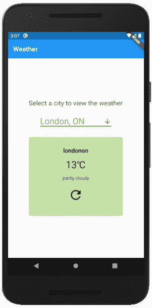
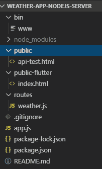
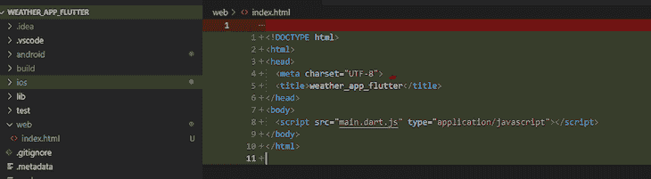
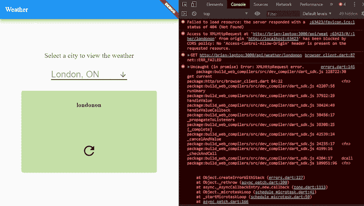
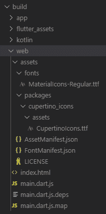
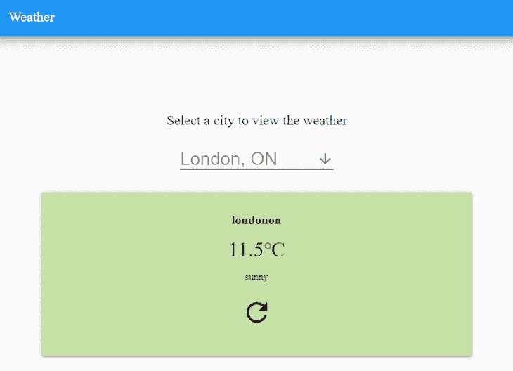

# 在 Node.js - LogRocket 博客上运行 Flutter web 应用程序和 API

> 原文：<https://blog.logrocket.com/flutter-web-app-node-js/>

有太多的跨平台应用程序开发框架允许你一次编写一个应用程序，并在多个平台上运行，如 Android、iOS，甚至是桌面。你可能听说过像 Ionic、 [Xamarin 和 React Native](https://blog.logrocket.com/flutter-vs-react-native-vs-xamarin/) 这样的流行框架。另一个相对较新的框架是 Flutter。

在本文中，您将了解一些关于 Flutter 的知识，特别关注 web 支持，它最近成为 1.9 版本中的技术预览版。您将向现有的 Flutter 应用程序添加 web 支持，并在 Node.js 服务器上与一个简单的 API 一起运行它。

## 匆匆一瞥

Flutter 是 Google 跨平台开发的解决方案之一。虽然它是一个相当新的领域，但它的特性集使它成为这个领域的一个竞争对手。

它将您的应用编译成运行在 iOS 或 Android 上的本机代码，从而带来令人难以置信的最终用户性能和帧速率。它支持开发期间的状态热重新加载，这意味着您可以对代码进行更改，并观察它们在您的仿真器或物理设备上的应用，而无需重新启动您的应用程序或丢失您的应用程序状态。

Flutter 的主要关注点是 iOS 和 Android。在 1.9 版本中，web 支持作为技术预览版被添加进来。它仍处于早期阶段，可能还没有准备好投入生产，但它肯定是令人兴奋和有前途的。您很快就会看到，只需进行很少的更改，就可以将现有的 Flutter 应用程序编译成 HTML、CSS 和 JS 包。

## 为什么要在 Node.js 上运行 Flutter web app？

Flutter web 应用可以在任何 web 服务器上运行。那么，为什么要将 Flutter web 应用程序托管在 Node.js 服务器上呢？好吧，说实话，出于许多与您选择 Node.js 用于其他 web 应用程序和 API 相同的原因:它非常擅长处理大量简单请求，您可以用 JavaScript 编写前端和后端代码，等等。

您可能已经有了一个 Node.js API 来为您的 Flutter iOS 或 Android 应用程序提供数据。将 Flutter 应用程序编译为 web 应用程序，并将其托管在现有的 Node.js 服务器上，这可能是对当前解决方案的合理扩展，不需要增加额外的托管成本。

## 示范

是时候深入代码，看看 Flutter web 是如何工作的了。为了跟随示例，您将需要以下工具:

*   Android Studio (Android SDK 管理器和仿真器)
*   Visual Studio 代码+ Flutter 扩展(或 Android Studio)
*   Node.js 12

Flutter 有很棒的开发者文档。如果这是您第一次开发 Flutter 应用程序，请遵循“[入门](https://flutter.dev/docs/get-started/install)指南来设置您的所有工具。

您将有机会选择想要在哪个编辑器中开发。本文中的示例和说明基于 Visual Studio 代码，但是如果您选择使用 Android Studio，您应该仍然能够理解。

需要 Node.js 12 服务器来运行 web 版本的 Flutter weather 应用程序以及后端天气 API。

### 步骤 1:探索示例代码

为了演示如何向现有的 Flutter 应用程序添加 web 支持，我们将从一个简单的天气应用程序开始，该应用程序已经在 Android 10 (API 级别 29)上进行了测试。



天气应用程序允许用户查看预定义城市列表的当前天气。天气数据是从 Node.js 上运行的后端服务器检索的。

从 GitHub 克隆天气应用程序和服务器的源代码:

> **提示:**`weather-app-nodejs-server`存储库有一个`flutter-web-support`分支，包含复制到启用了 Flutter web 支持的服务器的应用程序的完整版本。

最好在同一个父文件夹中同时克隆两个存储库。将构建`weather_app_flutter`存储库的内容，并将其复制到`weather-app-nodejs-server`存储库中的一个文件夹中。

#### 探索颤振天气应用程序

在编辑器中打开`weather_app_flutter`存储库。让我们仔细看看`main.dart`文件。它包含构成应用程序用户界面的支架和小部件。`Home`小部件类有一个`fetchWeatherData`函数，它调用后端天气 API 来检索数据并更新小部件的状态:

```
  fetchWeatherData({String location}) async {
    var url = WEATHER_API_URL + location;
    final response = await http.get(url);
    if (response.statusCode == 200) {
      var jsonResponse = convert.jsonDecode(response.body);
      setState(() {
        this._weatherData = WeatherData(
          jsonResponse\['weather'\]['location'],
          jsonResponse\['weather'\]['temperature'],
          jsonResponse\['weather'\]['weatherDescription'],
        );
        this._apiError = null;
      });
    } else {
      setState(() {
        this._apiError =
            'Unable to retrieve weather data from API (HTTP ${response.statusCode})';
      });
    }
  }
```

`fetchWeatherData`函数使用 Dart 的`http`包通过 HTTP 连接到服务器。你也可以使用其他的 Dart 包，但是如果你打算给你的 Flutter 应用程序添加 web 支持，这是官方推荐的包。

还要注意`WEATHER_API_URL`常数。在运行应用程序之前更新此常量的值，以便它可以连接到本地 Node.js 服务器上运行的 API。URL 必须包含您的计算机的主机名。Android 模拟器或物理设备将无法访问`localhost` URL。

#### 探索 Node.js 服务器和天气 API

在编辑器中打开`weather-app-nodejs-server`存储库。



有几个重要的文件和文件夹需要查看:

*   `public/api-test.html`文件可用于快速测试您的服务器在启动后是否按预期工作(例如`[http://localhost:3000/api-test.html](http://localhost:3000/api-test.html)`)
*   `routes/weather.js`文件包含一个简单的 GET API，它接受一个路径参数并返回天气数据(例如，`[http://localhost:3000/api/weather/londonon](http://localhost:3000/api/weather/londonon)`)
*   在`public-flutter`文件夹中，您将复制编译好的网页版天气应用程序。Node.js 服务器被设置为从这个目录向根上下文(例如，`[http://localhost:3000](http://localhost:3000)`)提供文件

### 步骤 2:为 Flutter 应用程序添加 web 支持

由于 web 支持仍然是一个技术预览，您需要最新的开发中版本的 Flutter，也称为主通道。在`weather_app_flutter`存储库的根文件夹中，运行以下命令:

```
flutter channel master
flutter upgrade
```

> **提示**:你可能会遇到一个“未知操作系统”。无法安装 Dart SDK。在 Visual Studio 代码中的 bash shell 中运行 Flutter 命令时，Windows 上出现错误。尝试在普通的 Windows 命令 shell 中运行这些命令。

升级过程可能需要几分钟时间。接下来，您需要在您的 Flutter 安装中启用 web 支持，以便它可用于您在此工作站上开发的这个和其他应用程序:

```
flutter config --enable-web
flutter devices
```

一旦启用了网络支持，你会在设备列表中看到一个新的 Chrome 设备。如果在列表中没有看到 Chrome，请在运行这些命令后重新启动 Visual Studio 代码来刷新设备列表菜单。

要向 weather 应用程序添加 web 支持，您需要在`weather_flutter_app`存储库的顶层文件夹中运行这个命令:

```
flutter create .
```

`create`命令将对应用程序做一些修改，你可以在[这个提交](https://github.com/briandesousa/weather_app_flutter/commit/7639c7041614d99a945709be269a7d76b991912a)中看到。最显著的变化是添加了一个包含`index.html`的`web`子文件夹:



通过在`weather-app-nodejs-server`存储库的根目录下运行以下命令来启动 Node.js 服务器:

```
npm start
```

在 Visual Studio 代码中从设备列表中选择 Chrome，然后开始调试。或者，您可以运行以下颤振命令:

```
flutter run -d chrome
```

第一次在 Chrome 中启动该应用程序可能需要较长时间，而 Flutter 会动态下载额外的依赖项。Chrome 最终会打开，你会看到天气应用在浏览器中运行。有些样式会与您在模拟器或物理设备上看到的略有不同。



此时，您会注意到应用程序没有显示任何来自天气 API 的数据。如果你打开 Chrome DevTools，你会看到一个[跨源资源共享](https://en.wikipedia.org/wiki/Cross-origin_resource_sharing)错误。

浏览器不允许从 Flutter web 服务器向 Node.js 服务器发出请求，因为它们运行在不同的端口上。你可以通过在服务器上启用跨源资源共享或者安装一个 Chrome 插件来禁用 CORS 来解决这个问题。

我们现在将忽略这个错误，因为在下一步中，我们将直接在 Node.js 服务器上运行预编译的 Flutter web 代码，从而完全消除跨源请求。

试着修改一下`main.dart`文件中的一些代码，让 Flutter 重新编译你的应用。您会注意到您的更改不会立即出现在浏览器中。这是因为 Flutter web 还不支持热状态重载。希望对这一令人敬畏的功能的支持将很快到来。

> **提示:**在 [flutter.dev](https://flutter.dev/docs/get-started/web) 上可以找到本节中每个颤振命令的详细解释。

### 步骤 3:在 Node.js 上运行 Flutter web 应用程序

现在，您可以使用 Flutter 在浏览器中运行天气应用程序，下一步是构建它并将其复制到 Node.js 服务器，以便与 API 一起运行。

要构建 Flutter web 应用程序包，请运行以下命令:

```
flutter build web
```

build 命令将生成包含构成天气应用程序的所有静态文件的`build/web`文件夹。



将`weather_app_flutter/build/web`的内容复制到`weather-app-nodejs-server/public-flutter`中。如果中的 Node.js 服务器仍在运行，请停止并重新启动它以获取新文件。

在`[http://localhost:3000](http://localhost:3000)`访问浏览器中的 Node.js 服务器，查看在 Node.js 上运行的应用程序。这一次，您的应用程序将显示从 weather API 检索的天气数据，而不会出现跨原点资源共享错误。



## 最后的想法

令人难以置信的是，将一个现有的 Flutter 应用程序编译成一个可以部署到 web 服务器上的 web 应用程序是多么简单。浏览器中呈现的用户界面看起来与 Android 中的用户界面几乎相同。

如果你仅仅因为 Flutter 的 web 支持而考虑将它作为跨平台应用框架，请小心行事。Flutter 团队非常清楚 web 支持缺少特性，有已知的性能问题，并且还没有为生产做好准备。

有一件事是肯定的:web 的 Flutter 前景看好。你可以在这里阅读更多关于 Flutter web support 和 Project Hummingbird [的信息。](https://medium.com/flutter/hummingbird-building-flutter-for-the-web-e687c2a023a8)

## 200 只显示器出现故障，生产中网络请求缓慢

部署基于节点的 web 应用程序或网站是容易的部分。确保您的节点实例继续为您的应用程序提供资源是事情变得更加困难的地方。如果您对确保对后端或第三方服务的请求成功感兴趣，

[try LogRocket](https://lp.logrocket.com/blg/node-signup)

.

[](https://lp.logrocket.com/blg/node-signup)[https://logrocket.com/signup/](https://lp.logrocket.com/blg/node-signup)

LogRocket 就像是网络和移动应用程序的 DVR，记录下用户与你的应用程序交互时发生的一切。您可以汇总并报告有问题的网络请求，以快速了解根本原因，而不是猜测问题发生的原因。

LogRocket 检测您的应用程序以记录基线性能计时，如页面加载时间、到达第一个字节的时间、慢速网络请求，还记录 Redux、NgRx 和 Vuex 操作/状态。

[Start monitoring for free](https://lp.logrocket.com/blg/node-signup)

.