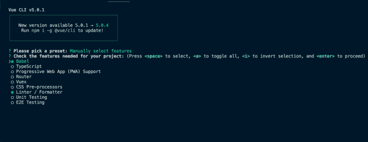
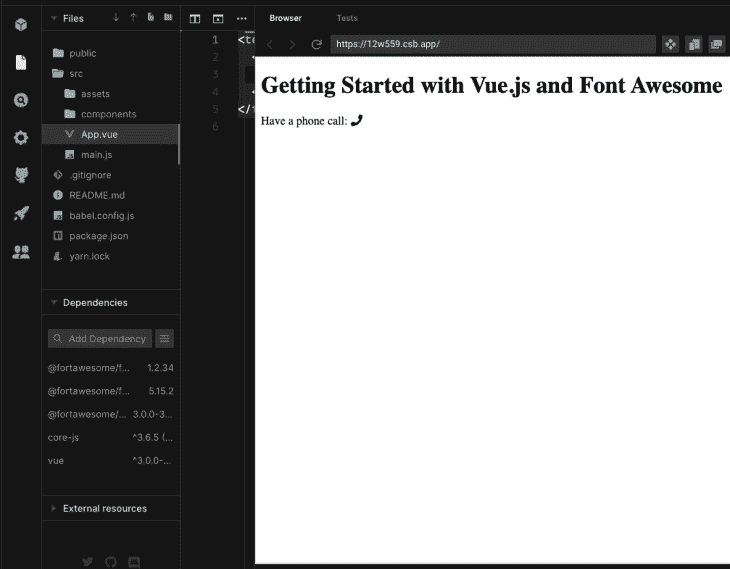
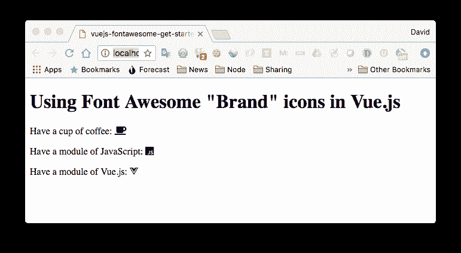
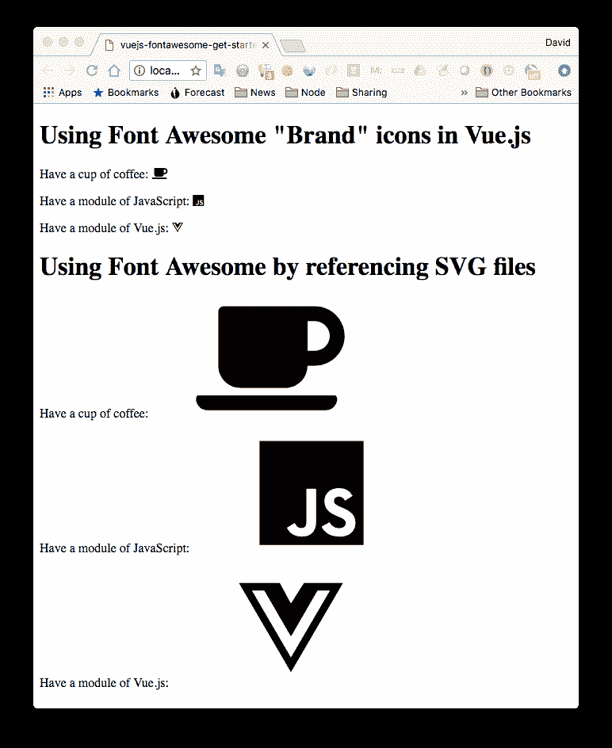
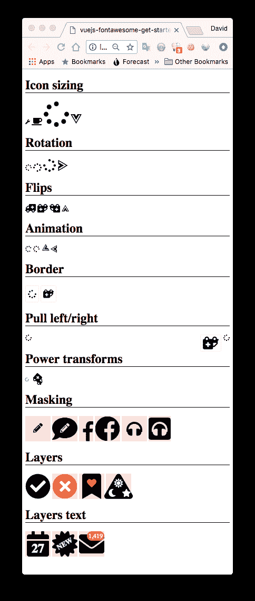
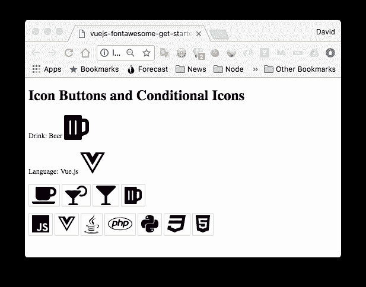

# Vue.js 应用中的字体图标:完整指南

> 原文：<https://blog.logrocket.com/font-awesome-icons-vue-js-complete-guide/>

***编者按:**这篇文章于 2022 年 6 月 30 日更新，包含了更多关于字体 Awesome 和 Vue 的最新信息，以及一个关于将所有字体 Awesome 图标添加到 Vue 应用程序的教程。*

## 什么是字体牛逼？

字体牛逼是一个非常牛逼的图标集合——它包括近 4000 个非常容易使用的图标，其中大约 1300 个是开源的，可以在任何应用程序中免费使用。作为一名 Vue.js 程序员，这个库似乎是一个很好的方式来改进我正在开发的应用程序。

Font Awesome 提供了与 [Vue](https://blog.logrocket.com/tag/vue/) 的良好集成，允许我们在生产应用程序中访问轻量级图标。这使我们可以更少地担心性能和映像加载时间。

在这篇文章中，我们将回顾在 Vue 应用程序中使用字体超棒图标的方法，它们之间的对比，然后回顾一些特定于 Vue 的使用图标的方法。字体 Awesome 同时支持 Vue 2 和 Vue 3。对于这个演示，我们将在 Vue 3 中实现它。

### 内容

## 如何给 Vue.js 添加字体牛逼

在开发 Vue.js 应用程序时，我们最有可能使用 NPM(node . js 的实际包管理器)来组装组件，并为应用程序使用 webpack。这里有一个 GitHub 库，包含了本文中讨论的代码。

作为一名 Vue 程序员，您可能已经安装了 Node 和 npm。如果你不知道，请点击这里获取一个可安装包。

现在，我们安装了 [Vue.js CLI](https://blog.logrocket.com/getting-started-with-the-new-vue-cli-3-43bcbe1ae759/) 工具，因为它可以提供脚手架应用程序供我们使用:

```
npm install -g @vue/cli
# OR
yarn global add @vue/cli

```

一旦安装完毕，你可以输入`vue --version`来验证它的存在。

现在让我们使用 Vue CLI 创建一个新的 Vue 3 项目。进入终端，添加以下命令:

```
vue create vue-font-awesome

```

这将开始创建我们的 Vue 3 样板。我们必须选择某些选项作为预设在其他设置项目。



接下来，让我们导航到项目文件夹:

```
cd vue-font-awesome

```

我们现在可以安装这些字体真棒包:

```
npm install --save @fortawesome/fontawesome-svg-core 
npm install --save @fortawesome/free-solid-svg-icons 
npm install --save @fortawesome/[email protected]

```

接下来，让我们在这个 Vue 项目中设置字体 Awesome。

您可以自己尝试，或浏览互动演示:

在生成的源代码中，首先将`main.js`改为:

```
import { createApp } from "vue";
import App from "./App.vue";
import { library } from "@fortawesome/fontawesome-svg-core";
import { faPhone } from "@fortawesome/free-solid-svg-icons";
import { FontAwesomeIcon } from "@fortawesome/vue-fontawesome";

library.add(faPhone);

createApp(App).component("font-awesome-icon", FontAwesomeIcon).mount("#app");

```

这将获取`library`对象并从`free-solid-svg-icons`包中加载电话图标。这个图标后来被添加到了`library`中。接下来，我们加载`FontAwesomeIcon`，它是 Vue 组件，并向 Vue 注册为全局组件。最后，我们设置应用程序进行渲染。

现在我们需要转向`App.vue`，我们用以下内容替换它:

```
<template>
  <h1>Getting Started with Vue.js and Font Awesome</h1>
  <p>Have a phone call: <font-awesome-icon icon="phone" /></p>
</template>

```

这就是 Vue 所说的单文件模板。它将模板、JavaScript 和 CSS 都包含在一个方便的文件中。这是一个很酷的想法，它的实现隐藏在您将在目录中看到的 webpack 配置中。我们不需要研究 webpack 的配置，简单地使用它就足够了。

现在，当我们运行`npm run dev`时，网络浏览器将自动加载该页面:



这很酷——我们有这个漂亮的定制 HTML 标签，可以很容易地用来加载图标。太好了。如果你浏览一下 Font Awesome 的文档，你会发现可以对图标进行分层并添加各种效果，比如旋转。它保证会很有趣。

## 用牛逼字体显示品牌图标

Font Awesome 项目包括许多品牌图标，如 JavaScript 和 Vue。

当我们创建演示应用程序时，它存储在一个名为`001-start`的目录中。复制该目录，将新目录称为`002-brands`。或者您可以观看互动演示:

在`App.vue`新目录中，将模板更改为如下:

```
<template>
  <div id="app">
    <h1>Using Font Awesome "Brand" icons in Vue.js</h1>
    <p>Have a phone call: <font-awesome-icon icon="phone" /></p>
    <p>Have a module of JavaScript: <font-awesome-icon icon="js" /></p>
    <p>Have a module of Vue.js: <font-awesome-icon icon="vuejs" /></p>
  </div>
</template>

<script>
export default {
  name: 'App'
}
</script>

<style>
</style>

```

第二个是试图加载 JavaScript 图标。字体牛逼网站提供搜索功能。输入“javascript”，你会发现`js`是 JavaScript 图标的代码，同样，Vue 图标也有代码`vuejs`。

现在用`npm run dev`运行这个应用程序，你会看到图标不在那里。在浏览器 JavaScript 控制台中，您会看到一条错误消息，指出没有找到图标。换句话说，这并不都是很棒的，因为我们现在必须学习一些东西。

第一步是查看发行目录:

```
$ ls node_modules/@fortawesome/free-solid-svg-icons/

```

这显示了一长串文件名类似于`faCoffee.js`的文件。看一下这个文件，您会发现一堆数据，包括一个名为`svgPathData`的字符串常量，这显然是为了驱动 SVG 的生成。我们不需要担心细节，只需要知道它在这里。重要的是，这些文件都不包含 JavaScript 或 Vue 图标。

字体牛逼图标库不是一个库而是四个，我们只加载了其中一个。总设置为:

接下来，如果我们研究图标浏览器，我们会在侧边栏中看到一些与这四个组相对应的复选框。试着先点击**自由**选项，然后点击四组，你会看到图标浏览器显示了与选项对应的不同子集。

因为 JavaScript 和 Vue.js 图标位于 Brands 部分，可以使用图标浏览器进行验证，所以我们需要加载这个包:

```
$ npm install — save @fortawesome/free-brands-svg-icons

```

这表明`main.js`应该改为这样:

```
import { library } from ‘@fortawesome/fontawesome-svg-core’;
import { faPhone } from "@fortawesome/free-solid-svg-icons";
import { faJs, faVuejs } from ‘@fortawesome/free-brands-svg-icons’;
import { FontAwesomeIcon } from ‘@fortawesome/vue-fontawesome’;
library.add(faPhone, faJs, faVuejs);

```

但这无助于解决浏览器控制台中的错误信息。在我们描述这个问题的解决方案之前，让我们回顾一下使用字体牛逼图标的其他方法。

## 字体真棒 CSS

在前一节中，我建议为代码创建一个名为`002-brands`的目录。复制该目录以创建`003-css`并做一些修改。或者您可以使用在线演示:

否则，键入以下命令:

这将删除我们刚刚使用的 Vue 支持。

```
npm remove -S @fortawesome/fontawesome-svg-core 
    @fortawesome/free-brands-svg-icons 
    @fortawesome/free-solid-svg-icons 
    @fortawesome/vue-fontawesome
npm install

```

编辑`main.js`这样:

然后，在`App.vue`中，按如下方式更改模板部分:

```
import Vue from 'vue';
import App from './App.vue';
import { createApp } from "vue";

createApp(App).mount("#app");

```

这来自两页:

```
<template>
  <div id="app">
    <link rel="stylesheet" 
        href="https://use.fontawesome.com/releases/v5.2.0/css/all.css" 
        integrity="sha384-hWVjflwFxL6sNzntih27bfxkr27PmbbK/iSvJ+a4+0owXq79v+lsFkW54bOGbiDQ" 
        crossorigin="anonymous">
    <h1>Using Font Awesome "Brand" icons in Vue.js</h1>
    <p>Have a phone call: <i class="fas fa-phone"></i> </p>
    <p>Have a module of JavaScript: <i class="fab fa-js"></i> </p>
    <p>Have a module of Vue.js: <i class="fab fa-vuejs"></i> </p>
  </div>
</template>

<script>
export default {
  name: 'App'
}
</script>

<style>
</style>

```

[基本用途](https://fontawesome.com/how-to-use/on-the-web/referencing-icons/basic-use):包括此处所示的`<i>`元素的使用

1.  [开始](https://fontawesome.com/start):给我们这里显示的`<link>`元素
2.  当然，`<link>`属于 HTML 的`<head>`部分。这个特殊的 CSS 对前面展示的四个字体库都使用图标字体。

注意，对于咖啡图标，使用的是`fas`类，而对于`js`和`vuejs`图标，使用的是`fab`类。这是品牌库和实体库的副作用。

当以这种方式使用时，显示字体牛逼图标使用`<i>`标签，如下所示。字体 Awesome 文档着重于使用这个标签。因此，作为一名 Vue 程序员，您必须熟练地在他们的文档之间切换，并使用提供的 Vue 组件(`<font-awesome-icon>`)。

更多来自 LogRocket 的精彩文章:

* * *

### 对于这个例子，我们完全放弃了 Vue 支持。这意味着我们有一个包含所有图标的大型 CSS 文件。这样做的代价是，只需一个`<link>`元素就可以非常方便地获得整个字体库。

* * *

加载每个图标的缺点是占用内存。我们的应用程序不会使用整个库；更有可能只用一小部分，那么为什么要给浏览器整个库呢？

相比之下，前一个示例中使用的打包脚本确保只打包所需的代码，仅此而已。使用前面的方法对浏览器的影响很小，代价是多写一点代码。



但是，嘿，这很有效。有时工作代码胜过架构的纯粹性。

使用 fontawesome-free 软件包

## [fontawesome-free 包](https://www.npmjs.com/package/@fortawesome/fontawesome-free)在他们的 CDN 上包含相同的文件 fontawesome 主机。

首先，复制`003-css`工作目录来创建一个新的目录`004-fontawesome-free`。如果您希望尝试在线演示，请参见下文，但要注意它不能正常工作——您需要在笔记本电脑上执行此步骤。

First, duplicate the `003-css` working directory to create a new one, `004-fontawesome-free`. If you wish to try the online demo, see below, but be warned that it does not work correctly — you’ll need to perform this step on your laptop.

在该目录中，安装软件包，如下所示:

检查已安装的软件包:

```
$ npm install @fortawesome/fontawesome-free — save

```

你会发现几个目录

```
$ ls node_modules/@fortawesome/fontawesome-free

```

`/js`:所有与字体 Awesome 5 SVG with JS 关联的 JavaScript 文件

*   `/css`:所有使用经典网络字体的 CSS 与 CSS 实现
*   `/sprites` : SVG 图标打包在一个方便的 sprite 中
*   `/scss`和`/less`:使用 CSS 的网页字体的 CSS 预处理文件
*   `/webfonts`:使用 CSS 的 web 字体附带文件
*   `/svg`:SVG 格式的单个图标文件
*   然后，在`App.vue`中，将`<link>`元素改为:

没有更多的变化，图标都像以前一样出现。这是意料之中的，因为我们所做的只是从本地资产中加载相同的文件。

```
<template>
  <div id="app">
    <link rel="stylesheet" 
        href="node_modules/@fortawesome/fontawesome-free/css/all.css">
    <h1>Using Font Awesome "Brand" icons in Vue.js</h1>
    <p>Have a cup of coffee: <i class="fas fa-coffee"></i> </p>
    <p>Have a module of JavaScript: <i class="fab fa-js"></i> </p>
    <p>Have a module of Vue.js: <i class="fab fa-vuejs"></i> </p>
    <h1>Using Font Awesome by referencing SVG files</h1>
    <p>Have a cup of coffee: 
          <svg>
            <use xlink:href="node_modules/@fortawesome/fontawesome-free/sprites/solid.svg#coffee"></use>
          </svg>
    </p>
    <p>Have a module of JavaScript:
          <svg>
            <use xlink:href="node_modules/@fortawesome/fontawesome-free/sprites/brands.svg#js"></use>
          </svg></p>
    <p>Have a module of Vue.js: 
          <svg>
            <use xlink:href="node_modules/@fortawesome/fontawesome-free/sprites/brands.svg#vuejs"></use>
          </svg></p>
  </div>
</template>

<script>
export default {
  name: 'App'
}
</script>

<style>
</style>

```

另一种方法是使用包中的 SVG 精灵。在这个模板中添加了另一个部分来引用原始 SVG 文件。



这是可行的，并且显然需要更多的工作来获得正确的大小。

使用字体 Awesome 的 JavaScript 和 Vue.js

## 前几节，我们留下了一个没有回答的问题:我们如何在 Vue 应用程序中使用字体 Awesome brands 库中的 JavaScript 或 Vue(或任何其他)图标？

如果我们将`002-brands`目录复制到`005-brands-2`，我们可以从我们停止的地方开始。还有一个在线演示:

If we duplicate the `002-brands` directory to `005-brands-2`, we can start from where we left off. There is also an online demo:

通过 Font Awesome 的其他方面的迂回告诉我们一些细节，我们现在可以在这个问题上发挥作用。

我们了解到 JavaScript 和 Vue.js 图标在品牌库中。当[使用`<i>`元素方法论](https://fontawesome.com/how-to-use/with-the-api/setup/importing-icons)时，我们应该使用这些模式:

实心图标有前缀`fas`并使用`<i class=”fas fa-flag”>`

*   常规图标有前缀`far`并使用`<i class=”far fa-flag”>`
*   灯图标有前缀`fal`并使用`<i class=”fal fa-flag”>`
*   品牌图标有前缀`fab`并使用`<i class=”fab fa-font-awesome”>`
*   长期存在的问题是品牌图标没有显示出来，我们在这里看到品牌图标应该使用前缀`fab`。

npm 包有额外的有用文档，这些文档非常有用，人们不禁要问为什么没有出现在 Font Awesome 网站上。在适当的时候，我们将探索这里的许多东西。当务之急是学习如何指定前缀。

也就是说，使用数组语法指定前缀:

前缀是数组中的第一个元素，图标名是第二个元素。在引擎盖下，`FontAwesomeIcon`组件自动将`fa-`添加到图标名称的前面，如果没有指定库前缀，则使用`fas`库(实体)。这解释了为什么 JavaScript 和 Vue.js 图标没有加载:因为我们没有明确使用`fab`前缀。

```
<font-awesome-icon :icon=”[‘fas’, ‘spinner’]” />

```

我们可以通过在`App.vue`中修改以下代码来解决这个问题:

图标会立即弹出:

```
<p>Have a module of JavaScript: 
    <font-awesome-icon :icon=”[ ‘fab’, ‘js’ ]” /></p>
<p>Have a module of Vue.js: 
    <font-awesome-icon :icon=”[ ‘fab’, ‘vuejs’ ]” /></p>

```


除了解决这个特定的问题，我们还有许多特殊的效果要探索。这些特效不仅可以用`<font-awesome-icon>`组件实现，也可以用`<i>`方法实现。

在我们开始探索特效之前，我们必须停下来对比一下这两种方法。

Vue 应用程序的构建过程确保只有所需的代码被打包并发送到浏览器。定义`<font-awesome-icon>`组件并单独导入每个所需图标的方法需要更多一点的代码，但好处是当应用程序到达浏览器时，它不会收到完整的字体图标库。相反，它只接收应用程序声明的代码和图标。

字体 Awesome 的 Vue 集成允许这种快捷方式:

它可以一次性导入品牌库中的每个图标，而不必单独导入每个图标。虽然这很方便，但我们被警告说，“小心使用这种方法，因为它在开始时可能很方便，但您的包大小会很大。”回头参考关于最小化应用程序大小的讨论。

```
import { fab } from ‘@fortawesome/free-brands-svg-icons’;

library.add(fab);

```

我们需要警惕的另一个问题是，这种方法可能行不通:

这是一个 ES6 特性，确保只导入给定模块的请求部分。目前，像 Babel 这样的工具被用来将它转换成等价的 ES5 代码，但并不是所有的工具都支持这个特性。

```
import { faJs, faVuejs } from ‘@fortawesome/free-brands-svg-icons’;

```

因为每个图标在包中存储为一个单独的文件，所以另一种方法是使用:

这将引用包中的单个文件，而不是从聚合包中提取对象。

```
import faJs from ‘@fortawesome/free-brands-svg-icons/faJs’;
import faVuejs from ‘@fortawesome/free-brands-svg-icons/faVuejs’;

```

字体的特殊效果棒极了

## 看着字体 Awesome 文档，我们看到一些诱人的特效正在等待探索。

制作一个名为`006-effects`的`005-brands-2`目录的副本。这一步的在线演示在这里:

Make a duplicate of the `005-brands-2` directory called `006-effects`. An online demo for this step is here:

我们有一个相当大的手术来实现一长串由字体真棒库支持的特效。

在`main.js`中，将导入更改为:

这带来了我们将在演示中使用的图标，以及两个新组件。新组件实现了一种分层组合的形式。确保导入这些组件，以便在我们的组件中使用它们。如果没有，我们会得到这个错误:`failed to resolve component: font-awesome-icon`。

```
import Vue from 'vue';
import App from './App.vue';

import { library } from '@fortawesome/fontawesome-svg-core';
import { 
    faCoffee, faSpinner, faWrench, faAmbulance, faEdit, faCircle, faCheck, faChessQueen,
    faPlus, faEquals, faArrowRight, faPencilAlt, faComment, faHeadphones, faSquare,
    faCalendar, faCertificate, faEnvelope, faTimes, faBookmark, faHeart, faPlay,
    faSun, faMoon, faStar
} from '@fortawesome/free-solid-svg-icons';
import { faJs, faVuejs, faFacebookF } from '@fortawesome/free-brands-svg-icons';
import { FontAwesomeIcon, FontAwesomeLayers, FontAwesomeLayersText } from '@fortawesome/vue-fontawesome'

library.add(
    faCoffee, faSpinner, faWrench, faAmbulance, faSquare,
    faEdit, faCircle, faCheck, faChessQueen, faHeadphones,
    faPlus, faEquals, faArrowRight, faPencilAlt, faComment,
    faCalendar, faCertificate, faEnvelope, faTimes, faBookmark,
    faHeart, faPlay, faSun, faMoon, faStar,
    faJs, faVuejs, faFacebookF);

createApp(App).component("font-awesome-icon", FontAwesomeIcon).component('font-awesome-layers', FontAwesomeLayers).component('font-awesome-layers-text', FontAwesomeLayersText).mount("#app");

```

下一阶段在`App.vue`中，将`<template>`部分改为:

这里有很多。这些示例根据所使用的特效类型分为几个部分。

```
<template>
  <div id="app">

<h1>Icon sizing</h1>
<font-awesome-icon icon="wrench"  size="xs" />
<font-awesome-icon icon="coffee"  size="lg" />
<font-awesome-icon icon="spinner" size="4x" />
<font-awesome-icon :icon="[ 'fab', 'vuejs' ]" size="2x" />

<h1>Rotation</h1>

<font-awesome-icon icon="spinner" rotation="90"  />
<font-awesome-icon icon="spinner" rotation="180" size="lg" />
<font-awesome-icon icon="spinner" rotation="270" size="2x"  />
<font-awesome-icon :icon="[ 'fab', 'vuejs' ]" rotation="270" size="2x"  />

<h1>Flips</h1>

<font-awesome-icon icon="ambulance" flip="horizontal" size="lg"/>
<font-awesome-icon icon="ambulance" flip="vertical" size="lg"/>
<font-awesome-icon icon="ambulance" flip="both" size="lg"/>
<font-awesome-icon :icon="[ 'fab', 'vuejs' ]" flip="vertical" size="lg"/>

<h1>Animation</h1>

<font-awesome-icon icon="spinner" spin />
<font-awesome-icon icon="spinner" pulse />
<font-awesome-icon :icon="[ 'fab', 'vuejs' ]" size="lg" spin />
<font-awesome-icon :icon="[ 'fab', 'vuejs' ]" size="lg" pulse />

<h1>Border</h1>

<font-awesome-icon icon="spinner" border size="lg"/>
<font-awesome-icon icon="ambulance" flip="vertical" border size="lg"/>

<h1>Pull left/right</h1>

<font-awesome-icon icon="spinner" pull="left" />
<font-awesome-icon icon="spinner" pull="right" />
<font-awesome-icon icon="ambulance" flip="vertical" pull="right" border size="lg"/>

<h1 style="clear: both">Power transforms</h1>

<font-awesome-icon icon="spinner" transform="shrink-6 left-4" />
<font-awesome-icon icon="ambulance" size="lg" :transform="{ rotate: 42 }" />

<h1>Masking</h1>

<font-awesome-icon icon="pencil-alt" 
    transform="shrink-10 up-.5" 
    style="background:MistyRose" 
    size="4x" />

<font-awesome-icon icon="pencil-alt" 
    transform="shrink-10 up-.5" 
    mask="comment" 
    style="background:MistyRose" 
    size="4x" />

<font-awesome-icon :icon="[ 'fab', 'facebook-f' ]" 
    transform="shrink-3.5 down-1.6 right-1.25" 
    style="background:MistyRose" 
    size="4x" />

<font-awesome-icon :icon="[ 'fab', 'facebook-f' ]" 
    transform="shrink-3.5 down-1.6 right-1.25" 
    mask="circle" 
    style="background:MistyRose" 
    size="4x" />

<font-awesome-icon icon="headphones" 
    transform="shrink-6" 
    style="background:MistyRose" 
    size="4x" />

<font-awesome-icon icon="headphones" 
    transform="shrink-6" 
    mask="square" 
    style="background:MistyRose" 
    size="4x" />

<h1>Layers</h1>

<font-awesome-layers class="fa-4x">
  <font-awesome-icon icon="circle" />
  <font-awesome-icon icon="check" transform="shrink-6" style="color: white;" />
</font-awesome-layers>

<font-awesome-layers class="fa-4x" style="background:MistyRose">
  <font-awesome-icon icon="circle" style="color:Tomato" />
  <font-awesome-icon icon="times" class="fa-inverse" transform="shrink-6" />
</font-awesome-layers>

<font-awesome-layers class="fa-4x" style="background:MistyRose">
  <font-awesome-icon icon="bookmark" />
  <font-awesome-icon icon="heart" class="fa-inverse" 
        transform="shrink-10 up-2" 
        style="color:Tomato"/>
</font-awesome-layers>

<font-awesome-layers class="fa-4x" style="background:MistyRose">
  <font-awesome-icon icon="play" transform="rotate--90 grow-2" />
  <font-awesome-icon icon="sun" class="fa-inverse" transform="shrink-10 up-2"/>
  <font-awesome-icon icon="moon" class="fa-inverse" transform="shrink-11 down-4.2 left-4"/>
  <font-awesome-icon icon="star" class="fa-inverse" transform="shrink-11 down-4.2 right-4"/>
</font-awesome-layers>

<h1>Layers text</h1>

<font-awesome-layers full-width class="fa-4x" style="background:MistyRose">
  <font-awesome-icon icon="calendar"/>
  <font-awesome-layers-text 
        class="fa-inverse" 
        transform="shrink-8 down-3" 
        value="27" 
        style="font-weight:900"/>
</font-awesome-layers>

<font-awesome-layers full-width class="fa-4x" style="background:MistyRose">
  <font-awesome-icon icon="certificate"/>
  <font-awesome-layers-text 
        class="fa-inverse" 
        transform="shrink-11.5 rotate--30" 
        value="NEW" 
        style="font-weight:900"/>
</font-awesome-layers>

<font-awesome-layers full-width class="fa-4x" style="background:MistyRose">
  <font-awesome-icon icon="envelope"/>
  <span class="fa-layers-counter" style="background:Tomato">1,419</span>
</font-awesome-layers>

  </div>
</template>

<script>
export default {
  name: 'App'
}
</script>

<style>
h1 {
  border-bottom: solid 1px black;
}
</style>

```

使用元素的属性来指定特定的特效。可以用`size=”..”`属性改变图标的大小。正如你所料，`rotation=”..”`属性旋转图标，`flip=”..”`翻转图标，等等。这些属性对于它们的功能来说是非常明显的。

一个不太明显的属性是`pull=”..”`，其效果类似于`float`属性，图标浮动在左边或右边。

组件封装了一组其他图标，将它们层叠在一起。它用于从现有图标合成新图标，以及可用的特效转换。

这是它看起来的样子。



`<font-awesome-icon>`、`<font-awesome-layers>`和`<font-awesome-layers-text>`组件与字体 Awesome 库提供的功能相关。
从这里的[文档开始](https://fontawesome.com/how-to-use/on-the-web/styling/sizing-icons)。

图标按钮和条件呈现

## 最后一个例子，让我们考虑图标的一个常见用例:工具栏按钮。当我们这样做的时候，让我们看看 Vue 条件对选择字体很棒的图标进行渲染的影响。

将目录`002-brands`复制为`007-buttons-conditionals`。或者尝试在线演示:

Duplicate the directory `002-brands` to be `007-buttons-conditionals`. Or try the online demo:

在`main.js`中，将导入更改为:

同样，我们正在导入一些新的字体图标。要使用它们，在`App.vue`中，将`<template>`更改如下:

```
import Vue from 'vue';
import App from './App.vue';

import { library } from '@fortawesome/fontawesome-svg-core';
import { 
  faCoffee, faCocktail, faGlassMartini, faBeer
} from '@fortawesome/free-solid-svg-icons';
import { 
  faJs, faVuejs, faJava, faPhp, faPython, faCss3, faHtml5 
} from '@fortawesome/free-brands-svg-icons';
import { FontAwesomeIcon } from '@fortawesome/vue-fontawesome';

library.add(faCoffee, faCocktail, faGlassMartini, faBeer,
      faJs, faVuejs, faJava, faPhp, faPython, faCss3, faHtml5);

createApp(App).component("font-awesome-icon", FontAwesomeIcon).mount("#app");

```

就有源 Vue 组件而言，这相当简单。我们有一些显示各种字体图标的按钮，当点击时，这些按钮会给一个变量分配一个相应的值。

```
<template>
  <div id="app">
    <h1>Icon Buttons and Conditional Icons</h1>
    <p>Drink: {{ drink }}
        <font-awesome-icon icon="coffee" 
                           size="4x" v-if="drink == 'Coffee'" />
        <font-awesome-icon icon="cocktail" 
                           size="4x" v-if="drink == 'Cocktail'" />
        <font-awesome-icon icon="glass-martini" 
                           size="4x" v-if="drink == 'Martini'" />
        <font-awesome-icon icon="beer" 
                           size="4x" v-if="drink == 'Beer'" />
    </p>
    <p>Language: {{ language }}
        <font-awesome-icon :icon="[ 'fab', 'js' ]" 
                           size="4x" v-if="language == 'JavaScript'"  />
        <font-awesome-icon :icon="[ 'fab', 'vuejs' ]" 
                           size="4x" v-if="language == 'Vue.js'" />
        <font-awesome-icon :icon="[ 'fab', 'java' ]" 
                           size="4x" v-if="language == 'Java'" />
        <font-awesome-icon :icon="[ 'fab', 'php' ]"
                           size="4x" v-if="language == 'PHP'" />
        <font-awesome-icon :icon="[ 'fab', 'python' ]"
                           size="4x" v-if="language == 'Python'" />
        <font-awesome-icon :icon="[ 'fab', 'css3' ]"
                           size="4x" v-if="language == 'CSS 3'" />
        <font-awesome-icon :icon="[ 'fab', 'html5' ]"
                           size="4x" v-if="language == 'HTML 5'" />
    </p>
    <p>
      <button @click="drink = 'Coffee'"> 
        <font-awesome-icon icon="coffee" size="4x" />
      </button>
      <button @click="drink = 'Cocktail'"> 
        <font-awesome-icon icon="cocktail" size="4x" />
      </button>
      <button @click="drink = 'Martini'"> 
        <font-awesome-icon icon="glass-martini" size="4x" />
      </button>
      <button @click="drink = 'Beer'"> 
        <font-awesome-icon icon="beer" size="4x" />
      </button>
    </p>
    <p>
      <button @click="language='JavaScript'">
        <font-awesome-icon :icon="[ 'fab', 'js' ]" size="4x" />
      </button>
      <button @click="language='Vue.js'">
        <font-awesome-icon :icon="[ 'fab', 'vuejs' ]" size="4x" />
      </button>
      <button @click="language='Java'">
        <font-awesome-icon :icon="[ 'fab', 'java' ]" size="4x" />
      </button>
      <button @click="language='PHP'">
        <font-awesome-icon :icon="[ 'fab', 'php' ]" size="4x" />
      </button>
      <button @click="language='Python'">
        <font-awesome-icon :icon="[ 'fab', 'python' ]" size="4x" />
      </button>
      <button @click="language='CSS 3'">
        <font-awesome-icon :icon="[ 'fab', 'css3' ]" size="4x" />
      </button>
      <button @click="language='HTML 5'">
        <font-awesome-icon :icon="[ 'fab', 'html5' ]" size="4x" />
      </button>
    </p>

  </div>
</template>

<script>
export default {
  name: 'App',
  data() {
    return {
      drink: "", language: ""
    }
  }
}
</script>

<style>
</style>

```

在 UI 的另一部分，我们显示所使用的文本代码以及相应的图标。使用 Vue 条件来选择图标。

运行应用程序后，我们可以点击按钮，相应的选择就会显示出来。用户界面可能如下所示:



如何将 Awesome 字体的所有图标添加到 Vue.js

## 在某些情况下，您可能会希望从一种样式中导入所有图标，而不是从这些样式中导入单个图标。然而，我们必须小心，因为这意味着我们要一次导入数千个图标。

您可以将所有字体超赞图标导入到您的 Vue 应用程序，如下所示:

这可能会影响加载时间和性能，所以我们应该只在必要的时候使用它。

```
import { fas } from '@fortawesome/free-solid-svg-icons'
import { createApp } from "vue";
import App from "./App.vue";
import { library } from "@fortawesome/fontawesome-svg-core";
import { FontAwesomeIcon } from "@fortawesome/vue-fontawesome";

library.add(fas)

createApp(App).component("font-awesome-icon", FontAwesomeIcon).mount("#app");

```

运行上面的代码后，我们可以进入我们的`App.js`,像这样使用我们的图标:

结论

```
<template>
  <div id="app">
    <h1>Getting Started with Vue.js and Font Awesome</h1>
    <p>Have a phone call: <font-awesome-icon icon="phone" /></p>
    <p>Have a cup of coffee: <font-awesome-icon icon="coffee" /></p>
  </div>
</template>
<script>
export default {
  name: 'App'
}
</script>
<style>
</style>

```

## 当然，图标为任何图形应用程序增加了很多功能。与文字相比，它们将意义传达给不同层次的人类体验，因此可以成为一种更容易学习的应用。此外，作为符号，很少需要翻译不同语言的用户界面(本地化),因为精心选择的符号是通用的。

通过本教程，我们看到了将字体 Awesome 中的图标添加到 Vue 应用程序中是多么容易，并且我们已经尝试了使用底层字体 Awesome 库。

字体 Awesome Vue 集成建立在底层库的基础上。它的功能以 Vue 组件的形式呈现，公开了大部分功能。

像用户一样体验您的 Vue 应用

## 调试 Vue.js 应用程序可能会很困难，尤其是当用户会话期间有几十个(如果不是几百个)突变时。如果您对监视和跟踪生产中所有用户的 Vue 突变感兴趣，

.

[try LogRocket](https://lp.logrocket.com/blg/vue-signup)

LogRocket 就像是网络和移动应用程序的 DVR，记录你的 Vue 应用程序中发生的一切，包括网络请求、JavaScript 错误、性能问题等等。您可以汇总并报告问题发生时应用程序的状态，而不是猜测问题发生的原因。

[](https://lp.logrocket.com/blg/vue-signup)[https://logrocket.com/signup/](https://lp.logrocket.com/blg/vue-signup)

LogRocket Vuex 插件将 Vuex 突变记录到 LogRocket 控制台，为您提供导致错误的环境，以及出现问题时应用程序的状态。

现代化您调试 Vue 应用的方式- [开始免费监控](https://lp.logrocket.com/blg/vue-signup)。

Modernize how you debug your Vue apps - [Start monitoring for free](https://lp.logrocket.com/blg/vue-signup).