# Python 中的 for 和 while 循环

> 原文：<https://blog.logrocket.com/for-while-loops-python/>

## 什么是循环，什么时候使用循环？

循环是所有编程语言中的基本构造。在循环结构中，程序首先检查条件。如果这个条件为真，则运行一段代码。除非条件无效，否则这段代码将继续运行。

例如，看看下面的伪代码块:

```
IF stomach_empty
  eat_food()
ENDIF
//check if stomach is empty again.
IF stomach_empty
  eat_food()
ENDIF 
//check if stomach is still empty, 
//....

```

这里，我们检查`stomach_empty`变量是否是`true`。如果满足这个条件，程序将执行`eat_food`方法。此外，请注意我们多次键入相同的代码，这意味着这违反了编程的[惯例](https://en.wikipedia.org/wiki/Don%27t_repeat_yourself)。

为了缓解这个问题，我们可以使用这样的循环结构:

```
WHILE stomach_empty //this code will keep on running if stomach_empty is true
  eat_food()
ENDWHILE

```

在这段代码中，我们使用了一个`while`语句。这里，循环首先分析`stomach_empty`布尔值是否为`true`。如果满足该条件，程序继续运行`eat_food`功能，直到条件变为假。我们将在本文后面了解`while`循环。

总而言之，开发人员使用循环多次运行一段代码，直到满足某个条件。因此，这可以节省时间并提高代码的可读性。

### 循环的类型

在 Python 中，有两种循环结构:

*   `for`:迭代预定义的次数。这也称为确定迭代
*   `while`:继续迭代，直到条件为`false`。这就是所谓的无限迭代

在本文中，您将学习以下概念:

## `for`循环

`for`循环是一种运行预设次数的循环。它还能够迭代任何序列的项目，例如列表或字符串。

### 句法

```
for i in <collection>: 
  <loop body>

```

这里，`collection`是对象列表。循环变量`i`在每次循环中采用`collection`中下一个元素的值。`loop body`中的代码一直运行，直到`i`到达集合的末尾。

### 用数字循环

为了演示`for`循环，让我们使用一个数值范围循环:

```
for i in range(10):  # collection of numbers from 0 to 9
    print(i)

```

在这段代码中，我们使用了`range`函数来创建一个从 0 到 9 的数字集合。稍后，我们使用`print`函数记录循环变量`i`的值。因此，这将输出从 0 到 9 的数字列表。

`range(<end>)`方法返回一个 iterable，该 iterable 返回从 0 开始的整数，直到但不包括`<end>`。

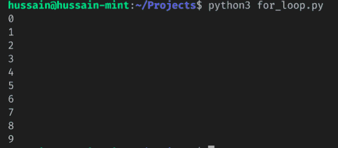

我们甚至可以在循环中使用条件语句，如下所示:

```
for i in range(10):  # numbers from 0-9
    if i % 2 == 0:  # is divsible by 2? (even number)
        print(i) # then print.

```

这段代码将输出从 0 到 9 的所有偶数。


### 列表循环

我们甚至可以使用一个`for`循环来遍历列表:

```
names = ["Bill Gates", "Steve Jobs", "Mark Zuckerberg"] # create our list
for name in names:  # load our list of names and iterate through them
    print(name)

```

在上面的代码片段中，我们创建了一个名为`names`的列表。稍后，我们使用`for`命令遍历`names`数组，然后注销这个列表的内容。

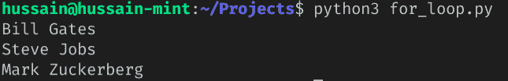

下面的代码片段使用了一个`if`语句来返回所有包含字母“B”的名字:

```
names = ["Bill Gates", "Billie Eilish", "Mark Zuckerberg"]  # create our list
for name in names:  # load our list of names and iterate through them
    if "B" in name:  # does the name include 'B'?
        print(name)

```

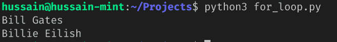

## 列表理解

在某些情况下，您可能希望基于现有列表的数据创建一个新列表。
例如，看下面的代码:

```
names = ["Bill Gates", "Billie Eilish", "Mark Zuckerberg", "Hussain"]
namesWithB = []
for name in names:
    if "B" in name: 
        namesWithB.append(name) # add this element to this array.
print(namesWithB)

```

在这段代码中，我们使用了`for`命令来遍历`names`数组，然后检查是否有任何元素包含字母`B`。如果为真，程序将这个相应的元素附加到`namesWithB`列表中。

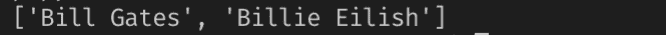

利用列表理解的能力，我们可以在很大程度上缩减这段代码。

### 句法

```
newlist = [<expression> for <loop variable> in <list> (if condition)]

```

这里，`expression`可以是一段返回值的代码，比如一个方法。如果`loop variable`满足`condition`，那么`list`的元素将被追加到`newlist`数组中。

### 列表用法

让我们用列表理解重写我们之前写的代码:

```
names = ["Bill Gates", "Billie Eilish", "Mark Zuckerberg", "Hussain"]
namesWithB = [name for name in names if "B" in name]
print(namesWithB)

```

在这段代码中，我们遍历了`names`数组。根据我们的条件，所有包含字母`B`的元素都将被添加到`namesWithB`列表中。


### 数字用法

我们可以像这样在列表理解中使用`range`方法:

```
numbers = [i for i in range(10)]
print(numbers)

```

注意在这种情况下，我们没有条件语句。这意味着条件是可选的。

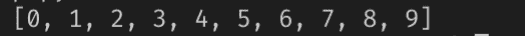

这段代码将使用一个条件来获取 0 到 9 之间的偶数列表:

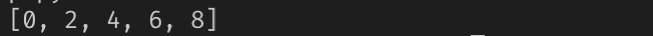

## `while`循环

有了`while`循环，只要`condition`是`true`，我们就可以执行一段代码。

### 句法

```
while <condition>:
  <loop body>

```

在`while`循环中，首先检查`condition`。如果是`true`，则执行`loop body`中的代码。这个过程将重复进行，直到`condition`变为`false`。

### 用数字循环

这段代码打印出`0`和`9`之间的整数。

```
n = 0
while n < 10: # while n is less than 10,
    print(n) # print out the value of n 
    n += 1 # 

```

以下是本例中发生的情况:

*   `n`的初始值为`0`。程序首先检查`n`是否大于`10`。由于这是`true`，循环体运行
*   在循环中，我们首先打印出`n`的值。稍后，我们将它递增`1`。
*   当循环体完成时，程序执行会再次评估条件。因为仍然为真，所以身体再次执行。
*   这一直持续到`n`超过`10`为止。此时，当表达式被测试时，它是`false`，循环停止。

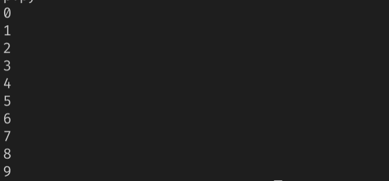

### 列表循环

我们可以使用一个`while`块来遍历列表，如下所示:

```
numbers = [0, 5, 10, 6, 3]
length = len(numbers) # get length of array. 
n = 0
while n < length: # loop condition
    print(numbers[n])
    n += 1

```

这是这个项目的细目分类:

*   `len`函数返回出现在`numbers`数组中的元素数量
*   我们的`while`语句首先检查`n`是否小于`length`变量。由于这是真的，程序将打印出`numbers`列表中的项目。最后，我们增加了`n`变量
*   当`n`超过`length`时，循环停止

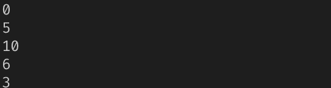

## 循环控制语句

有三种循环控制语句:

*   `break`:满足特定条件时终止循环
*   `continue`:如果满足指定条件，跳过循环的一次迭代，继续下一次迭代。`continue`和`break`的区别在于`break`关键字会“跳出”循环，而`continue`会“跳过”循环的一个周期
*   `pass`:当你不想执行任何命令或代码时。

我们可以在`while`和`for`循环中使用所有这些。

### 1.`break`

如果某个条件为`true`，当您想要退出循环时，`break`语句非常有用。
下面是`break`的关键词:

```
names = ["Bill Gates", "Billie Eilish", "Mark Zuckerberg", "Hussain"]
for name in names:
    if name == "Mark Zuckerberg":  
        print("loop exit here.")
        break  # end this loop if condition is true.
    print(name)
print("Out of the loop")

```

从这段代码中可以得出一些推论:

*   程序首先遍历`names`数组
*   在每个周期中，Python 检查`name`的当前值是否为`Mark Zuckerberg`
*   如果满足上述条件，程序将告诉用户它已经停止了循环
*   但是，如果条件是`false`，程序将打印`name`的值

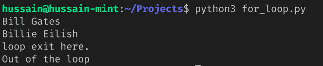

### 2.`continue`

`continue`语句告诉 Python 跳过当前迭代，继续下一次迭代。
下面是一个例子:

```
names = ["Bill Gates", "Billie Eilish", "Mark Zuckerberg", "Hussain"]  
for name in names:
    if name == "Mark Zuckerberg":
        print("Skipping this iteration.")
        continue  # Skip iteration if true.
    print(name)
print("Out of the loop")

```

以下是该脚本的详细内容:

*   浏览`names`数组
*   如果应用程序遇到值为`Mark Zuckerberg`的元素，使用`continue`语句跳过这个迭代
*   否则，打印出循环计数器的值，`name`


### 3.`pass`

如果不想运行任何命令，请使用`pass`语句。换句话说，`pass`允许您执行一个“空”操作。这在你的代码将要去但还没有被编写的地方是至关重要的。

下面是一个简单的`pass`关键字的例子:

```
names = ["Bill Gates", "Billie Eilish", "Mark Zuckerberg", "Hussain"]
for name in names:
    if name == "Mark Zuckerberg":
        print("Just passing by...")
        pass  # Move on with this iteration
    print(name)
print("Out of the loop")

```

这将是输出:

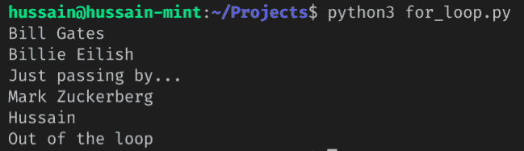

### 4.`else`条款

Python 也允许我们在循环中添加`else`语句。当循环终止时，`else`块中的代码执行。
下面是语法:

```
# for 'for' loops
for i in <collection>: 
  <loop body>
else: 
  <code block> # will run when loop halts.
# for 'while' loops
while <condition>:
  <loop body>
else:
  <code block> # will run when loop halts

```

在这里，有人可能会想，“为什么不把代码放在循环之后的`code` `block`中呢？它不会完成同样的事情吗？”

有一点小小的不同。如果没有`else`，`code block`将在循环终止后运行，无论如何。

然而，使用`else`语句，如果循环通过`break`关键字终止，`code block`将不会运行。

下面是一个正确理解其目的的示例:

```
names = ["Bill Gates", "Billie Eilish", "Mark Zuckerberg", "Hussain"]
print("Else won't run here.")
for name in names:
    if name == "Mark Zuckerberg":
        print("Loop halted due to break")
        break  # Halt this loop
    print(name)
else: # this won't work because 'break' was used. 
    print("Loop has finished")

print(" \n Else statement will run here:")
for name in names: 
    print(name)
else: # will work because of no 'break' statement
    print("second Loop has finished")

```

这将是输出:

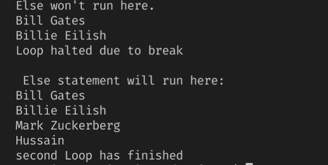

## 结论

在本文中，您学习了如何在 Python 编程中使用`for`和`while`循环。此外，您还了解了列表理解和循环改变语句的基础。这些是帮助您提高 Python 技能的重要概念。

非常感谢您的阅读！

## 使用 [LogRocket](https://lp.logrocket.com/blg/signup) 消除传统错误报告的干扰

[](https://lp.logrocket.com/blg/signup)

[LogRocket](https://lp.logrocket.com/blg/signup) 是一个数字体验分析解决方案，它可以保护您免受数百个假阳性错误警报的影响，只针对几个真正重要的项目。LogRocket 会告诉您应用程序中实际影响用户的最具影响力的 bug 和 UX 问题。

然后，使用具有深层技术遥测的会话重放来确切地查看用户看到了什么以及是什么导致了问题，就像你在他们身后看一样。

LogRocket 自动聚合客户端错误、JS 异常、前端性能指标和用户交互。然后 LogRocket 使用机器学习来告诉你哪些问题正在影响大多数用户，并提供你需要修复它的上下文。

关注重要的 bug—[今天就试试 LogRocket】。](https://lp.logrocket.com/blg/signup-issue-free)