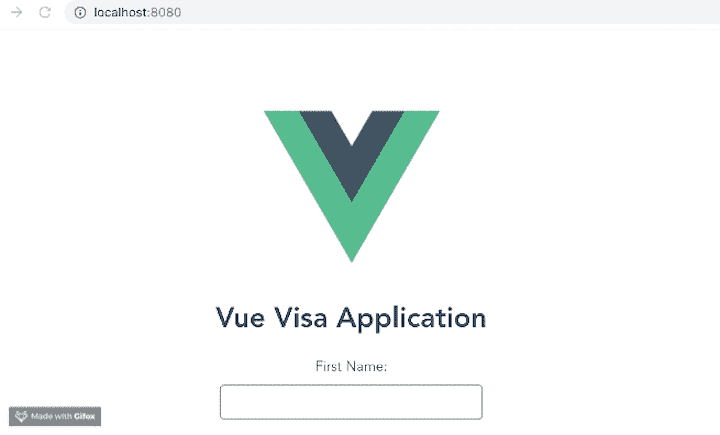
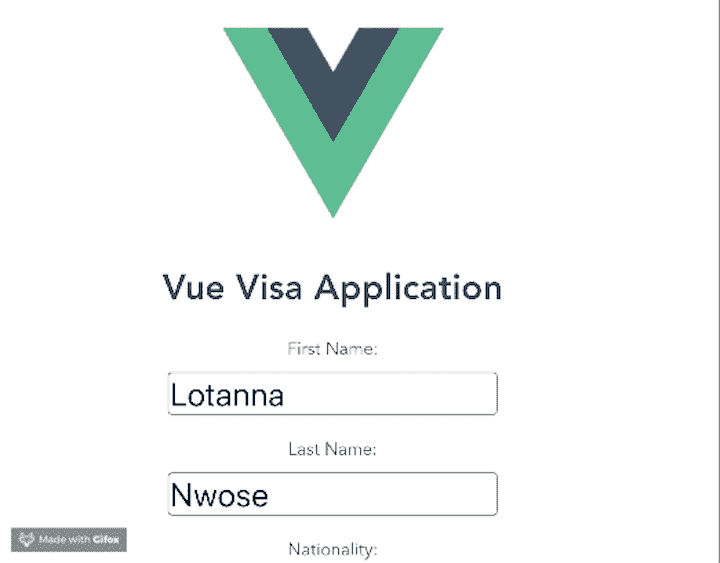
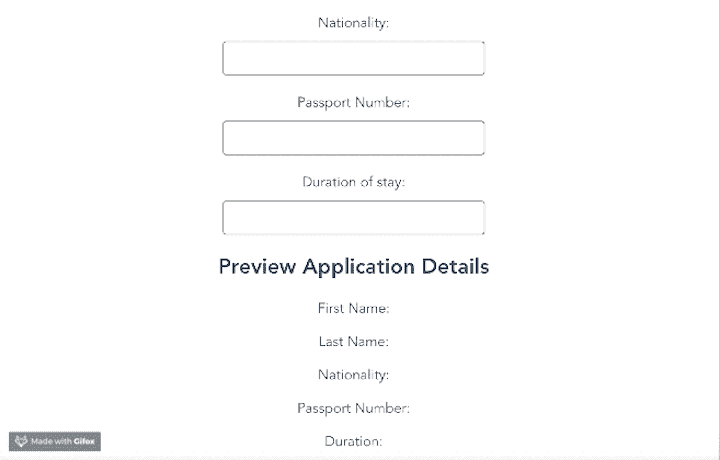

# 在 Vue.js 中使用 v-model 进行表单输入绑定

> 原文：<https://blog.logrocket.com/form-input-binding-in-vue/>

在 Vue.js 中构建表单时，您可能希望利用用户的输入来增强应用程序的使用体验。以电子邮件简讯为例。通常，你会被要求输入你的名字来注册。然后，在您订阅简讯后，您提供的名称将出现在电子邮件的问候语中。这种方法被称为数据绑定。

在本教程中，我们将探索 Vue 中表单输入绑定的概念，并演示它所依赖的 [`v-model`指令](https://v3.vuejs.org/guide/migration/v-model.html)。

本演练适合所有阶段的开发人员，包括初学者。在阅读本教程之前，您应该已经掌握了以下内容。

*   已安装 node . js 10 . x 及以上版本。您可以通过在终端/命令提示符下运行以下命令来验证您是否做到了:

    ```
    node -v
    ```

*   代码编辑器，如 Visual Studio 代码
*   Vue 的最新版本全球安装在您的机器上
*   安装在您机器上的 vue CLI 3.0

    ```
    npm uninstall -g vue-cli
    ```

    ```
    npm install -g @vue/cli
    ```

    ```
    npm install
    ```

    *   为此，请先卸载旧版本的 CLI
    *   然后，安装新的
    *   下载一个 [Vue starter 项目](https://github.com/viclotana/vue-canvas)
    *   解压缩下载的项目
    *   导航到解压缩后的文件并运行下面的命令，以保持所有的依赖项都是最新的

## Vue.js 中的`v-model`是什么？

在 Vue.js 中绑定数据的一种方法是使用`v-model`指令。当附加到输入时，这个模型监视输入，并在模型发生变化时更新给定的模板。如果模板发生变化，它还会更新数据模型。这就是我们所说的双向数据绑定。

这提高了速度，因为您可以轻松地监视数据对象和模板部分。它还降低了维护数据模型一致性的复杂性——这都要归功于`v-model`指令。

## Vue.js 中的双向数据绑定

为了演示双向数据绑定，我们将构建一个带有预览部分的基本 Vue visa 应用程序。

在您从 GitHub 下载的 Vue canvas 项目中，您会在`components`文件夹中找到根 Vue 组件`app.vue`和一个测试组件文件。在您的开发环境中打开项目。

您的`app.vue`文件应该如下所示:

```
<template>
  <div id="app">
    
    <Test/>
  </div>
</template>
<script>
import Test from './components/Test.vue'
export default {
  name: 'app',
  components: {
    Test
  }
}
</script>
<style>
#app {
  font-family: 'Avenir', Helvetica, Arial, sans-serif;
  -webkit-font-smoothing: antialiased;
  -moz-osx-font-smoothing: grayscale;
  text-align: center;
  color: #2c3e50;
  margin-top: 60px;
}
</style>

```

这里有一个简单的组件，显示 Vue 徽标、测试组件中的内容和一些 CSS 样式。要创建一个表单，打开`test.vue`组件并将下面的代码块复制到模板部分。

```
<template>
  <div id="visa">
    <h1>Vue Visa Application</h1>
    <form>
      <label for="first name">First Name:</label>
      <input type="text" required>
      <br>
      <label for="last name">Last Name:</label>
      <input type="text" required>
      <br>
      <label for="country">Nationality:</label>
      <input type="text" required>
      <br>
      <label for="passport number">Passport Number:</label>
      <input type="text"required>

      <label for="duration">Duration of stay:</label>
      <input type="text" required>

      <h2>Preview Application Details</h2>
      <p>First Name: </p>
      <p>Last Name: </p>
      <p>Nationality: </p>
      <p>Passport Number: </p>
      <p>Duration: </p>

    </form>
</div>
</template>

```

这份表格上有身份标签和其他与签证申请相关的重要信息。要添加一些样式，请将此代码块复制到 style 部分中:

```
<style scoped>
#visa {
  margin: 20px auto;
  max-width: 700px;
}
label{
  display: block;
  margin: 20px 0 10px;
}
input {
  font-size: 30px;
  border: 1px double rgb(102, 97, 96) ;
  border-radius: 4px;
}
</style>

```

使用 serve 命令在终端中运行项目。

```
npm run serve

```

您的表单应该如下所示:



## 输入绑定

现在我们已经有了我们的签证申请表，你可以看到有一个预览部分。在这一部分中，我们希望显示用户在上面的文本框中输入的所有内容。这样，在点击提交之前，用户不需要一个接一个地检查每个框。相反，他们可以滚动到提交按钮，看到他们输入的信息的快速预览。

为此，我们可以使用`v-model`指令将模板部分的输入绑定到数据对象。现在，输入绑定语法应该如下所示:

```
<h2>My first name is {{fName}}</h2> 
<input v-model="fName"/>

```

无论用户在输入框中输入什么，都会绑定到我们已经定义的名字。

要将它应用到 visa 应用程序演示中，请复制模板部分并用下面的代码块替换它。

```
<template>
  <div id="visa">
    <h1>Vue Visa Application</h1>
    <form>
      <label for="first name">First Name:</label>
      <input type="text" v-model="fName" required>
      <br>
      <label for="last name">Last Name:</label>
      <input type="text" v-model="lName" required>
      <br>
      <label for="country">Nationality:</label>
      <input type="text" v-model="country" required>
      <br>
      <label for="passport number">Passport Number:</label>
      <input type="text" v-model="pNumber" required>

      <label for="duration">Duration of stay:</label>
      <input type="text" v-model="duration" required>

      <h2>Preview Application Details</h2>
      <p>First Name: {{fName}}</p>
      <p>Last Name: {{lName}}</p>
      <p>Nationality: {{country}}</p>
      <p>Passport Number: {{pNumber}}</p>
      <p>Duration: {{duration}}</p>

    </form>
</div>
</template>

```

输入部分现在有了`v-model`指令，预览部分现在有了数据绑定花括号。如果您现在运行应用程序，您将会得到一些错误。


发生这些错误是因为我们没有在数据对象中定义这些新属性。要修复它们，请转到您的`test.vue`组件的脚本部分，用下面的代码块替换内容。

```
<script>
export default {
  name: 'Test',
  props: {
    msg: String
  },
  data(){
    return {
      fName: '',
      lName: '',
      country: '',
      pNumber: '',
      duration: ''
    }
  }
}
</script>

```

现在，再次在您的开发服务器上运行应用程序。它应该是这样的:



## 额外提示:懒惰的财产

这些绑定是实时发生的，因此应用程序会随着您的键入而更新。通过利用`v-model`指令的惰性属性，您还可以在离开一个标签页后让它们同时出现。

转到组件模板，将 lazy 属性添加到输入中的所有`v-model`定义中。

```
<template>
  <div id="visa">
    <h1>Vue Visa Application</h1>
    <form>
      <label for="first name">First Name:</label>
      <input type="text" v-model.lazy="fName" required>
      <br>
      <label for="last name">Last Name:</label>
      <input type="text" v-model.lazy="lName" required>
      <br>
      <label for="country">Nationality:</label>
      <input type="text" v-model.lazy="country" required>
      <br>
      <label for="passport number">Passport Number:</label>
      <input type="text" v-model.lazy="pNumber" required>

      <label for="duration">Duration of stay:</label>
      <input type="text" v-model.lazy="duration" required>

      <h2>Preview Application Details</h2>
      <p>First Name: {{fName}}</p>
      <p>Last Name: {{lName}}</p>
      <p>Nationality: {{country}}</p>
      <p>Passport Number: {{pNumber}}</p>
      <p>Duration: {{duration}}</p>

    </form>
</div>
</template>

```

当您在您的开发服务器上运行应用程序时，它应该在您离开选项卡后缓慢地加载绑定结果。



## 结论

您现在应该对 Vue JS 中的表单输入绑定有了基本的了解。我们研究了这项技术的重要性，并探索了一些用例。我们还演示了`v-model directive`的懒惰属性。

## 像用户一样体验您的 Vue 应用

调试 Vue.js 应用程序可能会很困难，尤其是当用户会话期间有几十个(如果不是几百个)突变时。如果您对监视和跟踪生产中所有用户的 Vue 突变感兴趣，

[try LogRocket](https://lp.logrocket.com/blg/vue-signup)

.

[](https://lp.logrocket.com/blg/vue-signup)[https://logrocket.com/signup/](https://lp.logrocket.com/blg/vue-signup)

LogRocket 就像是网络和移动应用程序的 DVR，记录你的 Vue 应用程序中发生的一切，包括网络请求、JavaScript 错误、性能问题等等。您可以汇总并报告问题发生时应用程序的状态，而不是猜测问题发生的原因。

LogRocket Vuex 插件将 Vuex 突变记录到 LogRocket 控制台，为您提供导致错误的环境，以及出现问题时应用程序的状态。

现代化您调试 Vue 应用的方式- [开始免费监控](https://lp.logrocket.com/blg/vue-signup)。