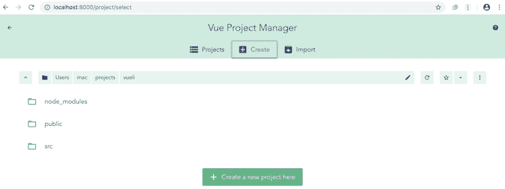
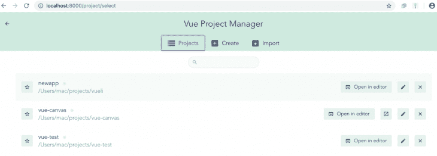
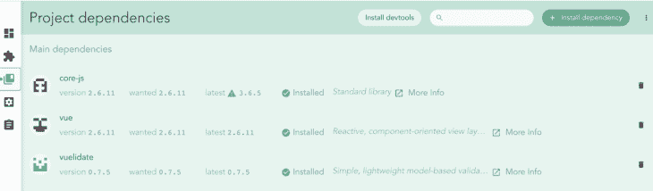
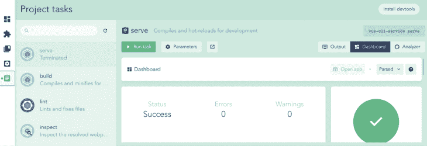
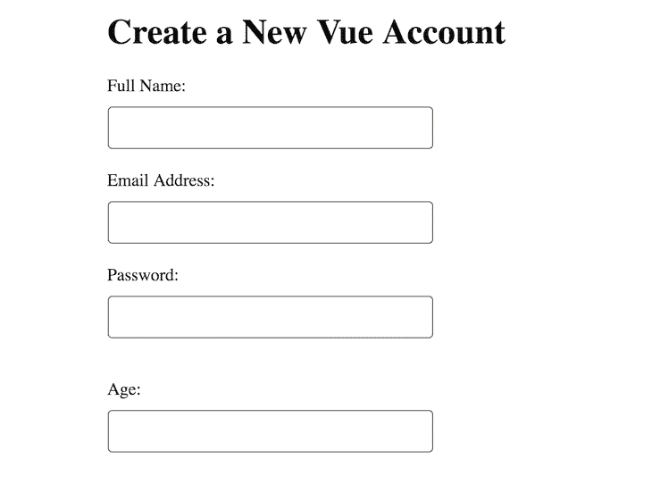
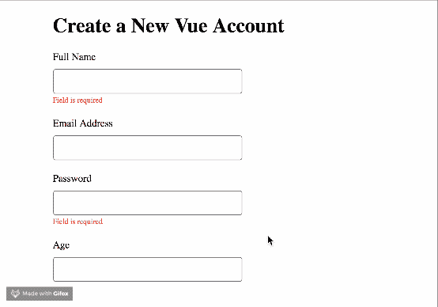

# 在 Vue 中使用 Vuelidate - LogRocket Blog 进行表单验证

> 原文：<https://blog.logrocket.com/form-validation-in-vue-with-vuelidate/>

在制作表单从客户那里收集数据时，验证输入字段是必不可少的。表单验证使您能够完全控制客户体验，并使您能够引导用户走上您希望他们走的道路。

为了保证质量，您应该在应用程序的客户端和服务器端进行验证。在本教程中，我们将介绍如何在 Vue.js 中进行简单的表单验证。

## 开始之前

您可以像使用 HTML5 一样在 Vue 应用程序中创建表单。这意味着用普通 HTML 在任何组件的 Vue 模板部分构建表单几乎不需要额外的技能。本教程适合所有阶段的开发者，包括初学者。下面是你在阅读本教程之前应该已经具备的一些东西。

*   Node.js 版本 10.x 及以上版本已安装(您可以通过在终端/命令提示符下运行以下命令来验证您是否安装了该版本:

    ```
    node -v
    ```

*   一个代码编辑器，比如 [Visual Studio 代码](https://code.visualstudio.com/)
*   Vue 的最新版本全球安装在您的机器上
*   安装在您机器上的 Vue CLI 3.0。
*   为此，首先卸载旧的 CLI 版本

    ```
    npm uninstall -g vue-cli
    ```

*   然后，安装新的

    ```
    npm install -g @vue/cli
    ```

*   下载一个 [Vue starter 项目](https://github.com/viclotana/vue-canvas)
*   解压缩下载的项目
*   导航到解压后的文件，运行下面的命令，使所有的依赖项保持最新

    ```
    npm install
    ```

## 什么是 Vuelidate？

Vuelidate 是一个简单、轻量级、基于模型的 Vue 应用验证库。验证规则被添加到定义给定组件的验证对象中(而不是直接在 DOM 中)。

Vuelidate 与 Moment 和 VueX 等其他库配合得很好，可以在 Vue CLI 上用`add`命令添加。它还支持集合验证、嵌套模型和函数组合。

## 使用 CLI 开始使用 Vuelidate

在您的终端中创建新的 Vue 应用程序。

```
Vue create newapp

```

选择默认设置。创建项目后，导航到新项目文件夹。

```
cd newapp

```

使用您选择的软件包管理器安装 Vuelidate。我使用 npm，所以我做了:

```
npm add vuelidate

```

这将为您的`newapp`项目安装库。下一步是将它注册为插件，这样你就可以在你的 Vue 应用中使用它。

转到`src`目录下的`main.js`文件并注册。您的`main.js`文件应该是这样的:

```
import Vue from 'vue'
import App from './App.vue'
import Vuelidate from "vuelidate";
Vue.use(Vuelidate);
Vue.config.productionTip = false
new Vue({
  render: h => h(App),
}).$mount('#app')

```

## Vue GUI

Vue 还附带了一个图形用户界面，您可以使用它来管理 Vue.js 应用程序。要访问它，请转到您的终端并运行以下命令。

```
vue ui

```

这将引导您进入如下所示的浏览器界面:



您可以使用这个 GUI 创建一个新的 Vue 项目或导入一个项目。因为我们已经创建了`newapp`项目，所以让我们导入它。点击“导入”打开您的文件管理器并找到您的`newapp`文件夹。项目被弹出到 GUI 中。



GUI 仪表板有五个选项卡。第三个标签是“项目相关性”，在这里您可以找到 Vuelidate(我们之前添加的)。



您可以直接从 GUI 仪表板添加或删除依赖关系。要运行该应用程序，请使用第五个选项卡(“项目任务”)。选择“serve”任务并点击“Run task ”,查看您的应用程序在 localhost 中的服务情况。



## 创建表单

既然我们已经引入了 Vuelidate 库并将其注册为插件，那么让我们构建一个简单的表单来看看它的运行情况。打开`app.vue`文件，用下面的代码块替换内容。

```
<template>
  <div id="visa">
    <h1>Create a New Vue Account</h1>
    <form>
      <label for="full name">Full Name:</label>
      <input type="text">
      <br>
      <label for="email">Email Address:</label>
      <input type="text"> <br>
      <span></span>
<label for="password">Password:</label>
      <input type="text"><br>
      <span></span>
      <br>
      <label for="age">Age:</label>
      <input type="text">

    </form>
</div>
</template>
<script>
export default {
  name: 'app'
}
</script>

```

这将显示一个简单的联系人表单，如下所示:



## 添加验证规则

要设置字符数的验证规则，您需要出现在名称和密码字段中。一旦 Vuelidate 注册为插件，就可以使用验证选项。

在`app.vue`文件的脚本部分，添加下面的代码块。

```
<script>
import { required, minLength, between } from 'vuelidate/lib/validators'
export default {
  name: 'app',
  data() {
    return {
      name: '',
      password: '',
      age: ''
    }
  },
  validations: {
    name: {
      required,
      minLength: minLength(4)
    },
    password: {
      required,
      minLength: minLength(4)
    }, 
    age: {
      required,
      between: between(18,45)
    }
  }
}
</script>

```

首先，我们导入了以下内置验证器。

*   `minLength`，指给定必填输入字段的最小字符数
*   `required`，它指向在提交之前必须填写的必填输入字段
*   `between`，指向要输入的数字范围

在`app.vue`文件的模板部分，用下面的代码块替换当前内容。

```
<template>
  <div id="visa">
    <h1>Create a New Vue Account</h1>
    <form>
 <div>
    <!-- Full name validation -->
  <div class="form-group" :class="{ 'form-group--error': $v.name.$error }">
    <label class="form__label">Full Name</label>
    <input class="form__input" v-model.trim="$v.name.$model"/>
  </div>
  <span class="error" v-if="!$v.name.required">Field is required</span>
  <span class="error" v-if="!$v.name.minLength">Name must have at least {{$v.name.$params.minLength.min}} letters.</span>
  <tree-view :data="$v.name" :options="{rootObjectKey: '$v.name', maxDepth: 2}"></tree-view>
      <!-- Email Address-->
  <label for="email">Email Address</label>
      <input type="text"> <br>
      <span></span>
      <!-- Password validation-->
  <div class="form-group" :class="{ 'form-group--error': $v.password.$error }">
    <label class="form__label">Password</label>
    <input class="form__input" v-model.trim="$v.password.$model"/>
  </div>
  <span class="error" v-if="!$v.password.required">Field is required</span>
  <span class="error" v-if="!$v.password.minLength">Name must have at least {{$v.password.$params.minLength.min}} letters.</span>
  <tree-view :data="$v.password" :options="{rootObjectKey: '$v.password', maxDepth: 2}"></tree-view>
      <!-- Age validation-->
  <div class="form-group" :class="{ 'form-group--error': $v.age.$error }">
    <label class="form__label">Age</label>
    <input class="form__input" v-model.trim="$v.age.$model"/>
  </div>
  <span class="error" v-if="!$v.age.between">Must be between {{$v.age.$params.between.min}} and {{$v.age.$params.between.max}}</span>
  <tree-view :data="$v.age" :options="{rootObjectKey: '$v.age', maxDepth: 2}"></tree-view>
</div>

    </form>
</div>
</template>

```

对于每个选项，我们使用了`v-model`指令来绑定输入数据，并在 spans 中指定规则以及如何标记它们。添加了 Vuelidate 之后，现在可以使用的`$v`选择器使得围绕模型构建逻辑变得容易。

表单看起来和以前一模一样，除了它现在可以根据我们设置的规则显示验证器。



## 结论

这就是使用 Vuelidate 库通过`v-model`指令处理验证是多么容易。这个项目的完整代码可以在 [GitHub](https://github.com/viclotana/vuelidateIntro) 上获得。

在本教程中，我们讨论了如何使用 Vuelidate 库处理基本的表单输入验证。我们还展示了如何使用 Vue GUI，并快速浏览了它的工作原理。

在以后的文章中，我们将更深入地研究 Vuelidate，并探索如何使用它来处理提交和密码。

## 像用户一样体验您的 Vue 应用

调试 Vue.js 应用程序可能会很困难，尤其是当用户会话期间有几十个(如果不是几百个)突变时。如果您对监视和跟踪生产中所有用户的 Vue 突变感兴趣，

[try LogRocket](https://lp.logrocket.com/blg/vue-signup)

.

[](https://lp.logrocket.com/blg/vue-signup)[https://logrocket.com/signup/](https://lp.logrocket.com/blg/vue-signup)

LogRocket 就像是网络和移动应用程序的 DVR，记录你的 Vue 应用程序中发生的一切，包括网络请求、JavaScript 错误、性能问题等等。您可以汇总并报告问题发生时应用程序的状态，而不是猜测问题发生的原因。

LogRocket Vuex 插件将 Vuex 突变记录到 LogRocket 控制台，为您提供导致错误的环境，以及出现问题时应用程序的状态。

现代化您调试 Vue 应用的方式- [开始免费监控](https://lp.logrocket.com/blg/vue-signup)。