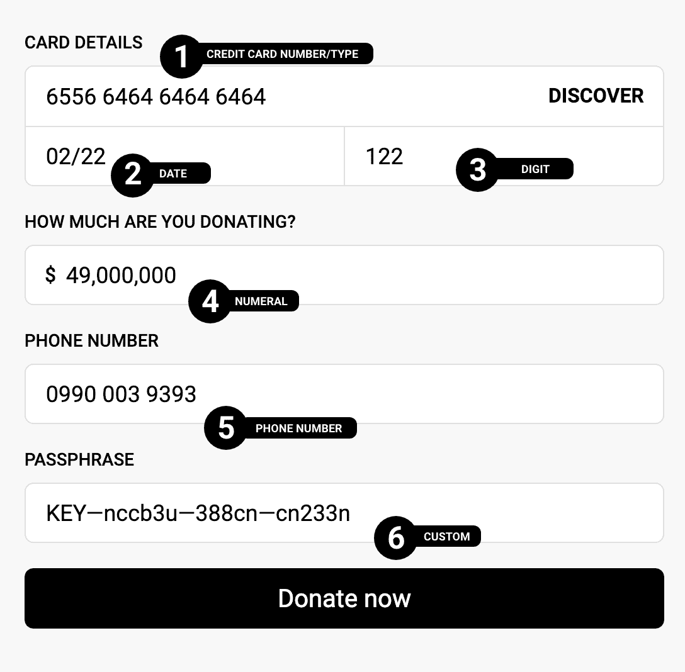
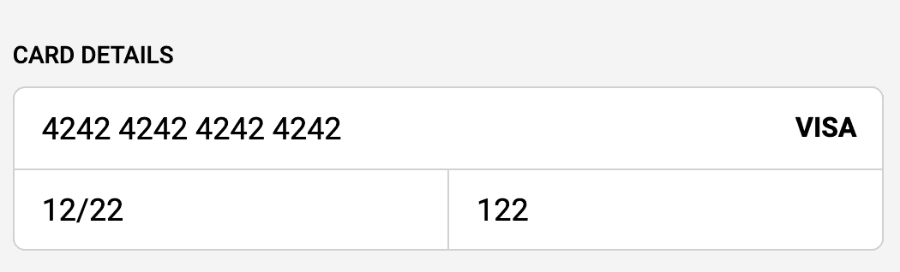
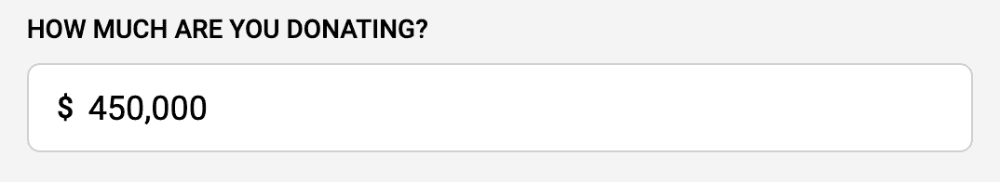
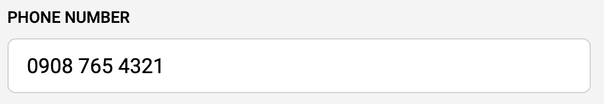
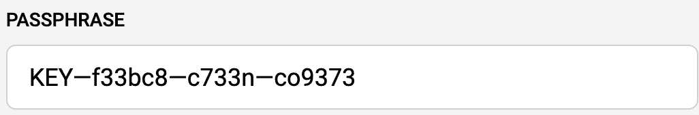
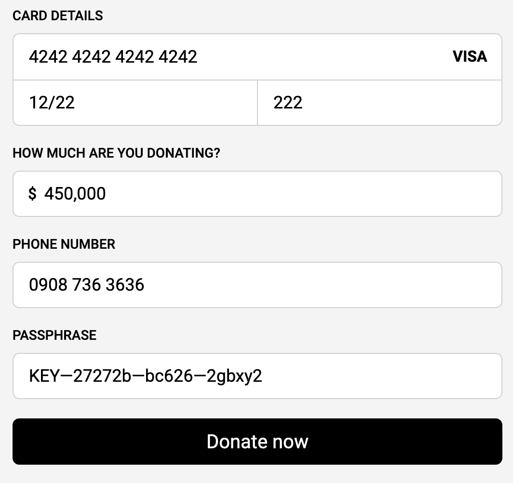

# 用 Cleave.js 和 React - LogRocket Blog 格式化表单输入

> 原文：<https://blog.logrocket.com/formatting-form-inputs-with-cleave-js-and-react/>

在网上进行有意义的对话需要多种形式。

虽然大部分的注意力已经合理地放在了某些方面，比如验证，但是改进最接近用户的表单——它的设计——还是相对容易的。

这样做不仅会让我们(作为开发人员)的生活更轻松，也会让我们的用户更轻松。这是双赢。实现这一点的一种方法是实时格式化表单输入，以模拟其现实生活中的等价形式。使我们能够做到这一点的一个工具是 Cleave.js。

## 什么是 Cleave.js？

套用一句话， [Cleave.js](https://nosir.github.io/cleave.js/) 帮助你在键入时格式化你的`<input/>`值。就是这样。

> 本教程是关于如何使用 React 的 Cleave.js 库。你也可以查看 [GitHub 页面](https://github.com/nosir/cleave.js)，看看如何在其他方面使用它。

### 你能格式化什么？

Cleave.js 允许你做 6 种类型的格式化:

*   信用卡号码
*   电话号码
*   日期格式
*   时间格式
*   数字格式
*   自定义格式(前缀、块、分隔符等)

## 使用带 react 的切割刀

我没有向您展示所有格式类型如何独立工作，而是构建了一个简单的临时捐赠表单:



如前所述，我们将涉及:
1 →信用卡号码/类型格式 2 →日期格式 3 →数字格式 4 →数字格式 5 →电话号码格式 6 →自定义格式(带有前缀、块和分隔符)。

首先，我创建了一个 CodeSandbox 并安装了 Cleave.js 包。

第一步是导入 Cleave.js:

```
import Cleave from "cleave.js/react";
```

然后，我们用它来代替`<input/>`:

```
<Cleave placeholder="Enter credit card number" className="form-field" />
```

`<Cleave/>`组件返回一个具有适当类型的`<input/>`表单元素(我们不需要指定或担心它返回什么类型)。对于它的配置，它需要一个`options`道具，这是一个可以完成不同类型格式化的配置。

### 信用卡格式

```
const [creditCardNo, setCreditCardNo] = useState("");

function onCreditCardChange(e) {
  setCreditCardNo(e.target.rawValue);
}

<Cleave
  placeholder="Enter credit card number"
  options={{
    creditCard: true,
  }}
  onChange={e => onCreditCardChange(e)}
  className="form-field"
/>
```

用`creditCard`属性给`true`和一个`onChange`事件处理程序。通过使用`e.target.rawValue`访问格式化的输入值来更新`creditCardNo`状态。

仅这一点就可以在用户键入时格式化输入。

然而，有趣的是积极主动地向他们展示这些数字所对应的信用卡提供商的类型。

为此，我们将`onCreditCardTypeChanged`事件处理程序传递给`options`属性。

```
const [creditCardNo, setCreditCardNo] = useState("");
const [creditCardType, setCreditCardType] = useState("");

function onCreditCardTypeChanged(type) {
   setCreditCardType(type);
}

function onCreditCardChange(e) {
  setCreditCardNo(e.target.rawValue);
}

<Cleave
  placeholder="Enter credit card number"
  options={{
    creditCard: true,
    onCreditCardTypeChanged
  }}
  onChange={e => onCreditCardChange(e)}
  className="form-field"
/>
```

> 与`<Cleave/>`组件上的`onChange`属性不同，`onCreditCardTypeChanged`事件处理程序是作为`options`的属性添加的，通过`type`来访问(`type`只是一个名称，你可以随意命名)。

### 日期格式

```
const [creditCardExpiryDate, setCreditCardExpiryDate] = useState("");

function onCreditCardExpiryChange(e) {
  setCreditCardExpiryDate(e.target.rawValue);
}

<Cleave
  placeholder="MM/YY"
  options={{ date: true, datePattern: ["m", "d"] }}
  onChange={onCreditCardExpiryChange}
  className="form-field"
/>
```

我们已经切换了`options`属性，将`date`的类型设置为 true，并且我们正在用类似于信用卡的`datePattern`进行格式化，只显示月和日。

### 块格式

虽然有其他方法来强制 cvv 的三位数上限，但 cleave 也提供了一种间接的方法来实现这一点。使用块，您可以预定义输入的最大长度，以及有多少个块。这在数组中表示。

例如，`[2]`块将确保用户只能键入两个字符。利用这一知识，我们可以将 CVV 输入分解为:

```
const [cvv, setCVV] = useState("");

function onCVVChange(e) {
  setCVV(e.target.rawValue);
}

<Cleave
  placeholder="CVV"
  options={{
    blocks: [3],
    numericOnly: true
  }}
  onChange={onCVVChange}
  className="form-field"
/>
```

这允许单个字符块最多有三个数字，我们通过将`numericOnly`设置为`true`来实现这一点。

我们的信用卡详细信息格式应该给出这样的结果:



### 数字格式

```
const [donationAmount, setDonationAmount] = useState("");

function onDonationAmountChange(e) {
  setDonationAmount(e.target.rawValue);
}

<Cleave
  placeholder="0.00"
  options={{
    numeral: true,
    numeralThousandsGroupStyle: "thousand"
  }}
  onChange={onDonationAmountChange}
  className="form-field"
/>
```

为了格式化我们的捐赠金额，我们将`numeral`属性设置为`true`，并且用`numeralThousandsGroupStyle:` `"thousand"`将数字格式设置为千。

> 请记住，这是格式化“货币”的一种间接方式，因为格式化[货币依赖于区域设置](https://en.wikipedia.org/wiki/Template:Currency)。Cleave 格式化数字而不是货币。



Phone number Formatting

这个和其他的有点不同。首先，在使用它之前，您需要导入地区/国家，在本例中是尼日利亚。

```
import "cleave.js/dist/addons/cleave-phone.ng";

const [phoneNumber, setPhoneNumber] = useState("");

function onPhoneChange(e) {
  setPhoneRawValue(e.target.rawValue);
}

<Cleave
  placeholder="0908 765 4321"
  options={{ phone: true, phoneRegionCode: "NG" }}
  onChange={onPhoneChange}
  className="form-field"
/>
```

这里，`phone`属性设置为 true，`phoneRegionCode`设置为“NG”。

> 如果你发现电话号码的格式与你想要的有一点不同，Cleave 还提供了一个自定义格式——检查下一个格式。



### 自定义格式

假设您要求您的用户输入加密的 2FA 密码。Cleave 可以帮助定制格式:

```
const [customValue, setCustomValue] = useState("");

function onCustomValueChange(e) {
  setCustomRawValue(e.target.rawValue);
}

<Cleave
  placeholder="KEY-2DJDH2-3I37X-2MXHGX"
  options={{
    prefix: "KEY",
    blocks: [3, 6, 5, 6],
    delimiter: "—",
    numericOnly: false
  }}
  onChange={onCustomValueChange}
  className="form-field"
/>
```

您可以在这里传递的一些选项有`prefix`、`blocks`、`delimiter`(对于积木)、`numericOnly`等。

这将确保格式为 3、6、5 和 6 位数，用分隔符值分隔，第一个块项目将用于前缀:



### 表单提交

务必记住 Cleave.js 是用于格式化而不是验证的，所以它定制而不是强制输入值。提交之前，请确保验证您的表单。

当您尝试提交表单时，您不需要担心`state`中的内容或值是如何转换的，因为 Cleave.js 去掉了所有格式，并给出了原始值。如果我尝试提交此表单:



我得到了我的`state`中的值:

```
creditCardNo: "4242424242424242"
phoneRawValue: "09087363636"
dateRawValue: "1222"
donationAmount: "450000"
customRawValue: "KEY27272bbc6262gbxy2"
cvv: "222"
```

## 结论

让用户以这种方式填写表单无疑是一种有趣且可信的方式，会让我们领先一步。

查看以下链接了解更多信息。
1。 [Codesandbox 链接到完整示例](https://codesandbox.io/s/cleavejs-demo-c3j27)
2。 [CleaveJS 官网](https://nosir.github.io/cleave.js/)
3。 [CleaveJS GitHub 项目](https://github.com/nosir/cleave.js)

## 使用 LogRocket 消除传统反应错误报告的噪音

[LogRocket](https://lp.logrocket.com/blg/react-signup-issue-free)

是一款 React analytics 解决方案，可保护您免受数百个误报错误警报的影响，只针对少数真正重要的项目。LogRocket 告诉您 React 应用程序中实际影响用户的最具影响力的 bug 和 UX 问题。

[ ](https://lp.logrocket.com/blg/react-signup-general) [  ](https://lp.logrocket.com/blg/react-signup-general) [LogRocket](https://lp.logrocket.com/blg/react-signup-issue-free)

自动聚合客户端错误、反应错误边界、还原状态、缓慢的组件加载时间、JS 异常、前端性能指标和用户交互。然后，LogRocket 使用机器学习来通知您影响大多数用户的最具影响力的问题，并提供您修复它所需的上下文。

关注重要的 React bug—[今天就试试 LogRocket】。](https://lp.logrocket.com/blg/react-signup-issue-free)