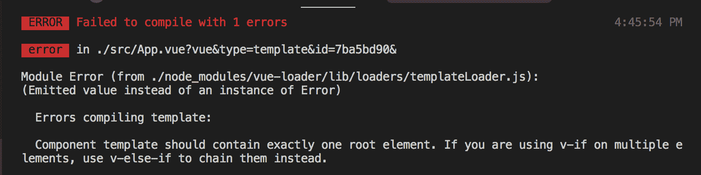
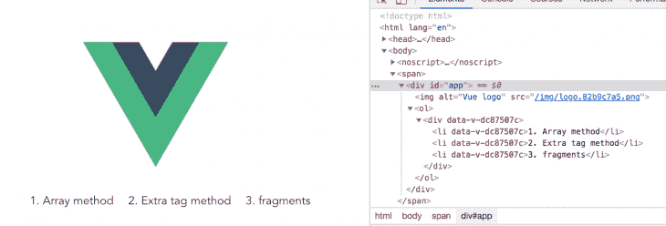
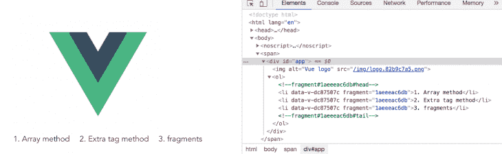

# Vue.js 中的片段

> 原文：<https://blog.logrocket.com/fragments-in-vue-js/>

Vue.js 是由尤雨溪和 250 多名社区爱好者创建的。

对于构建用户界面来说，这是一个非常进步的框架。它包括一个易于接近的核心库，只关注视图层，以及一个支持库的生态系统，帮助您处理大型单页面应用程序中的复杂性。

在这篇文章中，你将被介绍给观察者——这是一个令人兴奋的概念，将帮助你掌握 Vue.js。

### 在 Vue 中实现可访问性

为了实现网页的可访问性，你需要设计每个人都可以使用的网页、工具和技术。

这里的“每个人”包括有听觉、认知、神经、身体、语言和视觉障碍的人。

辅助功能支持是允许辅助技术(如屏幕阅读器)解释网页和应用程序所必需的。为了让这些技术发挥作用，开发人员需要从可访问性的角度进行考虑，并构建可访问的应用程序。

### 开始之前

这篇文章面向所有使用 Vue.js 的前端开发人员，所以不需要熟悉初学者概念和安装过程就能理解这些概念。

在通过本文开始使用 Vue CLI 3 之前，您应该已经具备了一些先决条件。

您将需要:

*   已安装 Node.js 10.x 及以上版本。您可以通过在终端/命令提示符下运行 node -v 来验证是否如此。
*   还安装了节点程序包管理器 6.7 或更高版本(NPM)。
*   代码编辑器:强烈推荐使用 Visual Studio 代码。[原因如下](https://blog.bitsrc.io/a-convincing-case-for-visual-studio-code-c5bcc18e1693?source=your_stories_page---------------------------))
*   Vue 的最新版本全球安装在您的机器上。
*   安装在您机器上的 Vue CLI 3.0。为此，请先卸载旧版本的 CLI:

```
npm uninstall -g vue-cli
```

然后安装新的:

```
npm install -g @vue/cli
```

运筹学

*   在此下载一个 [Vue starter 项目](https://github.com/viclotana/vue-canvas)
*   解压缩下载的项目
*   导航到解压缩后的文件，并运行命令以保持所有依赖项最新:

```
npm install
```

### 问题:多个根节点

在 Vue 组件的 template 部分中构建演示文稿时，您可能会注意到在 template 标记中只能有一个根 HTML 标记。

在这个根 HTML 标记中，您可以拥有任意数量的子节点，因此在一个 Vue 组件中不可能有多个根节点。

如果您在 VS 代码中打开项目，导航到 src 文件夹，然后是 components 文件夹，然后打开`app.js`文件。您的`app.js`文件应该如下所示:

```
<template>
  <div id="app">
    
    <Test msg="Welcome to Your Vue.js App"/>
  </div>
</template>
<script>
import Test from './components/Test.vue'
export default {
  name: 'app',
  components: {
    Test
  }
}
</script>
<style>
#app {
  font-family: 'Avenir', Helvetica, Arial, sans-serif;
  -webkit-font-smoothing: antialiased;
  -moz-osx-font-smoothing: grayscale;
  text-align: center;
  color: #2c3e50;
  margin-top: 60px;
}
</style>
```

您可以看到 div 是模板中唯一的根节点。如果您尝试像这样添加一个额外的根节点:

```
<template>
<span>
  <div id="app">
    
    <Test msg="Welcome to Your Vue.js App"/>
  </div>
  <div>
    <h1>Header inside root node 2</h1>
  </div>
</span>
</template>
<script>
import Test from './components/Test.vue'
export default {
  name: 'app',
  components: {
    Test
  }
}
</script>
<style>
#app {
  font-family: 'Avenir', Helvetica, Arial, sans-serif;
  -webkit-font-smoothing: antialiased;
  -moz-osx-font-smoothing: grayscale;
  text-align: center;
  color: #2c3e50;
  margin-top: 60px;
}
</style>
```

你会看到当你保存它的时候，Vue 编译器会标记出一个关于拥有多个根节点的错误。



### 额外包装节点技术

为了找到解决这个问题的方法，Vue 开发人员通常会创建一个额外的(大部分是不必要的)根包装节点，他们可以在其中创建子节点来适应他们的线框。

该标签可以是 span 或 div 标签。大多数 Vue 开发人员大量使用 div 标签来确保 return 语句的代码块不会导致破坏应用程序的错误。

这些额外的标签除了防止错误之外什么也不做。

```
<template>
<span>
  <div id="app">
    
    <Test msg="Welcome to Your Vue.js App"/>
  </div>
  <div>
    <h1>Header inside root node 2</h1>
  </div>
</span>
</template>
<script>
import Test from './components/Test.vue'
export default {
  name: 'app',
  components: {
    Test
  }
}
</script>
<style>
#app {
  font-family: 'Avenir', Helvetica, Arial, sans-serif;
  -webkit-font-smoothing: antialiased;
  -moz-osx-font-smoothing: grayscale;
  text-align: center;
  color: #2c3e50;
  margin-top: 60px;
}
</style>
```

这种方法的问题是它不可访问。

现在，根据 HTML 指南，像列表项这样的语义标签应该用有序或无序的列表标签包装。类似地，表项应该由表标签包装，作为它们的父标签。

* * *

### 更多来自 LogRocket 的精彩文章:

* * *

### 演示

让我们使用`App.vue`组件来呈现我们将在`Test.vue`组件中创建的列表。

打开您的`App.vue`文件，并在模板部分复制以下代码行:

```
<template>
<span>
  <div id="app">
    
    <ol>
      <Test />
    </ol>

  </div>
</span>
</template>
```

然后，在`Test.vue`组件中，将列表项放入模板部分，如下所示:

```
<template>
<div>
   <li>1\. Array method</li>
   <li>2\. Extra tag method</li>
   <li>3\. fragments</li>
  </div>
</template>
```

上面的代码块不会被编译器返回错误。它实际上会被传递给`App.vue`组件来正确地呈现列表。

但是如果你检查你的开发工具的元素，你会发现它没有返回语义 HTML



如果不遵循这种语义，你的 HTML 代码可能会正常工作，但它不会被屏幕阅读器或广播员等辅助设备拾取。

这就是为什么这种方法(被广泛使用)现在不被认可的原因。一般来说，有一种编写易访问代码的冲动。

### 解决方案:碎片

这个概念始于 React 团队发布版本 16。这是对开发人员行为造成的可访问性差距的解决方案。

该团队找到了一种方法来创建一个不会被 DOM 读取为节点的 HTML 标签，并将其称为片段。

这与 div 或 span 标签的工作方式完全一样，但它不会改变代码的整体结构，因此保持了 DOM 树的语义。

### 反应片段语法

```
render() {
    return ( 
       <React.fragment >
         <ChildA / >
         <ChildB / >
         <ChildC / >
       </React.fragment>
    );
}
```

这在 DOM 中显示如下:

```
<ChildA / >
<ChildB / >
<ChildC / >
```

片段是不可见的包装标签，不影响 DOM 的节点结构，从而实现可访问性。

### Vue 中的片段

Vue 团队还没有构建官方的片段功能，但是有一个由 Vue 社区成员 Julien Barbay 构建的很棒的插件。

这个插件就像一个包装器。然后，在 Vue compile 上，它在 DOM 上被注释掉。

这是在 Vue 2.x 中使用片段的一种非常有效的方式

语法如下所示:

```
<Fragment >
  <ChildA / >
  <ChildB / >
  <ChildC / >
 </Fragment>
```

在 DOM 中，它呈现如下:

```
<!--Fragment-->
  <ChildA / >
  <ChildB / >
  <ChildC / >
 <!--Fragment-->
```

您可以看到这两行都被注释掉了，所以 DOM 是语义化的，代码是可访问的。要使用，首先在您的 Vue 项目中安装插件:

```
npm install -s vue-fragment
```

然后导入它，您就可以像这样在您的`Test.vue`文件中使用它了:

```
<template>
<fragment>
   <li>1\. Array method</li>
   <li>2\. Extra tag method</li>
   <li>3\. fragments</li>
</fragment>
</template>
<script>
import { Fragment } from 'vue-fragment'
export default {
  name: 'Test',
  components: { Fragment },
  props: {
    msg: String
  }
}
</script>
```

您可以看到 div 标记被片段替换了。现在，整个演示变得容易理解了。



### 结论

在这篇文章中，你已经学会了如何在 Vue 中使用片段，并且明白了为什么在编写代码时要考虑可访问性是非常重要的。

Vue 团队已经承诺在即将发布的 Vue 第 3 版中引入片段特性。

Julien 的插件非常有用，你今天可以使用它。

黑客快乐！

## 像用户一样体验您的 Vue 应用

调试 Vue.js 应用程序可能会很困难，尤其是当用户会话期间有几十个(如果不是几百个)突变时。如果您对监视和跟踪生产中所有用户的 Vue 突变感兴趣，

[try LogRocket](https://lp.logrocket.com/blg/vue-signup)

.

[](https://lp.logrocket.com/blg/vue-signup)[https://logrocket.com/signup/](https://lp.logrocket.com/blg/vue-signup)

LogRocket 就像是网络和移动应用程序的 DVR，记录你的 Vue 应用程序中发生的一切，包括网络请求、JavaScript 错误、性能问题等等。您可以汇总并报告问题发生时应用程序的状态，而不是猜测问题发生的原因。

LogRocket Vuex 插件将 Vuex 突变记录到 LogRocket 控制台，为您提供导致错误的环境，以及出现问题时应用程序的状态。

现代化您调试 Vue 应用的方式- [开始免费监控](https://lp.logrocket.com/blg/vue-signup)。