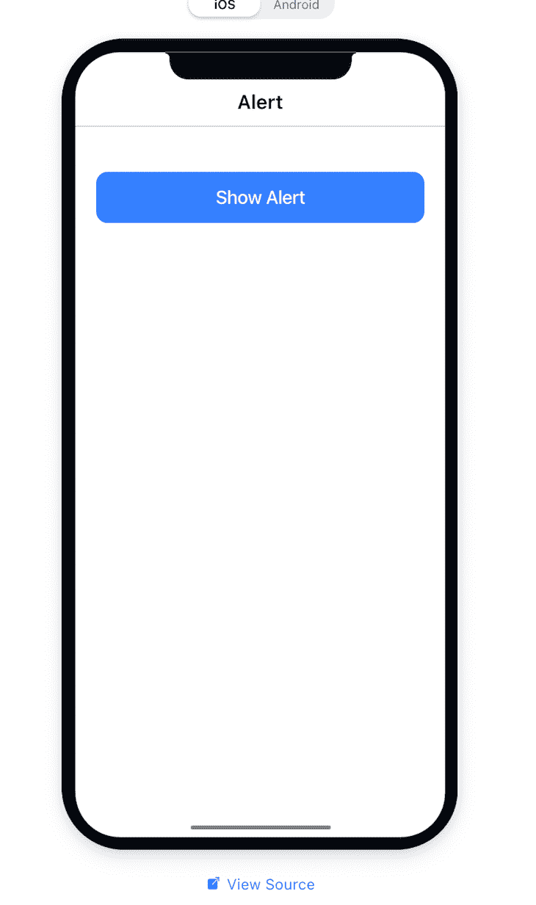

# Framework7 与 Ionic:比较 Cordova 框架

> 原文：<https://blog.logrocket.com/framework7-vs-ionic-comparing-cordova-frameworks/>

公司在设计移动应用时面临的最大挑战之一是成本。Angular 和 Vue.js 等框架使得用 JavaScript 构建混合移动应用变得可行。构建混合应用程序节省了大量的时间和资源，因为您只需编写一个代码库来部署 iOS 和 Android。

在本指南中，我们将比较两个最流行的移动框架:Framework7 和 Ionic。我们将向您介绍 Ionic 和 Framework7，描述一些关键特性，并比较使用 Framework7 和 Ionic 的优缺点。

我们将从回顾以下内容开始:

然后，我们将比较 [Framework7 和 Ionic](#whichisbetter) ，重点关注以下类别:

## 什么是 Framework7？

Framework7 是一个免费的开源框架，用于构建具有本机外观的移动、工作区和 web 应用程序。通过一些额外的配置，您还可以[在 Framework7 应用](https://github.com/framework7io/framework7-cli/issues/75)中集成电容器。

由俄罗斯工作室 [iDangero.us](https://idangero.us/) 在 2014 年创建的 Framework7 的代码库表明，它很可能
是一个开发者的作品，可能有其他用户的一些小贡献。

## 什么是爱奥尼亚？

Ionic 由 Drifty 公司于 2013 年创建。当时是靠[角度](https://angular.io/)的。如今，Ionic 是企业用来构建混合移动应用的领先 [HTML5 和 JavaScript 框架](https://blog.logrocket.com/top-6-javascript-and-html5-game-engines/)之一。

Ionic 是一个开源的 SDK 框架，设计于 Apache Cordova 和 Angular 之上。Ionic 还可以与 Capacitor 集成，这是一个跨平台的应用程序运行时，用于构建在 iOS、Android、electronic 和 web 上本地运行的 web 应用程序。

## Framework7 与 Ionic:主要特性

在我们深入比较 Framework7 和 Ionic 之前，先来概述一下每个框架的相关特性。

### 框架 7

*   **更快的开发**:使用像[鲍尔](https://bower.io/)这样的工具，一个用于 web 的包管理器，在使用 Framework7 的时候促进了更快的开发
*   Framework7 CLI : Framework7 自带命令行界面，可用于搭建新的 Framework7 项目。基本上，[框架 7 CLI](https://framework7.io/cli/) 帮助你构建、运行和准备一个应用程序用于生产
*   **JavaScript** **框架支持** : Framework7 还支持与其他 JavaScript 框架的集成，如 Vue.js、Angular、 [Svelt](https://blog.logrocket.com/should-you-use-svelte-in-production/) [e](https://blog.logrocket.com/should-you-use-svelte-in-production/) ，可以加快开发时间
*   **Cordova** **插件** : Framework7 自带对 Cordova 的全面支持，这些 API 是本地设备使用 JavaScript 功能所必需的。Framework7 也支持电容器，但是您必须编写额外的配置

### 离子的

*   简单性:一旦你熟悉了任何支持的 JavaScript 框架，使用和部署任何 Ionic 项目都很容易。该框架在构建时考虑了简单性，易于学习，所有技能水平的开发人员都可以使用
*   web 标准:Ionic 建立在标准的 web 技术上，如 HTML、CSS 和 JavaScript，并使用其他现代的基于 Web 的 API，如 Shadow DOM
*   Ionic CLI:Ionic 框架带有一个迷人的命令行界面。它的命令可以用来启动、构建、运行和模拟一个 Ionic 应用程序
*   Angular:Ionic 的流行很大程度上要归功于 Angular，它是集成的主要框架。 [Ionic Angular 包](https://ionicframework.com/docs/angular/overview)包括 Angular 开发者期望的所有功能，并与 Angular 核心库集成
*   Cordova 插件 : Cordova 提供了使用 JavaScript 代码实现本地设备功能所需的 API
*   **Capacitor** **支持** : Ionic 使用 Capacitor，这是一个跨平台的应用程序运行时，用于构建在 iOS、Android、Electron 和 web 上本地运行的 web 应用程序

## 安装和脚手架

### 安装离子

使用 npm 在本地计算机上全局安装 ionic:

```
npm install -g @ionic/cli

```

安装完成后，使用以下命令搭建一个新的 Ionic 项目:

```
ionic start <name of app> blank

```

创建新的 Ionic 应用程序后，进入项目目录并运行应用程序:

```
cd <name of app>
$ ionic serve

```

Ionic 有一个很酷的功能，叫做 [Ionic Lab](https://www.npmjs.com/package/@ionic/lab) ，可以帮助你在 Android 和 iOS 中预览你的应用。要安装 Ionic Lab，请运行:

```
npm i --save-dev @ionic/lab

```

要运行您的应用程序，添加`--lab`标志:

```
ionic serve --lab

```

### 安装框架 7

有多种方法可以设置 Framework7 应用程序。一种选择是从 [Framework7 GitHub 库](https://github.com/framework7io/framework7/releases)下载其源代码。你所要做的就是选择你所选择的定制版本。您还可以使用 Framework7 CLI 来建立一个新项目。

首先，全球安装 Cordova。这是 Framework7 的运行时。

```
npm install -g cordova

```

接下来，全局安装 Framework7 CLI:

```
npm install -g framework7-cli

```

安装完成后，通过在终端上运行以下命令来启动一个新的应用程序:

```
framework7 create

```

这个命令会提示你一些关于框架和模板的问题，以及一些关于应用的基本信息。

## Framework7 与 Ionic:哪个更好？

Framework7 和 Ionic 是最流行的跨平台移动开发工具。两者都是免费和开源的，有很好的文档记录，并提供了高水平的性能。

让我们从社区支持、文档、性能和原生功能方面比较一下 Ionic 和 Framework7。

Ionic 对 Angular 和 React 等 JavaScript 框架的支持更好，延长了它的寿命，扩大了它的生态系统。Ionic 社区每天都在进行改进，以优化和简化开发 Ionic 应用程序的流程。数百名用户为 Ionic 的代码库做出了贡献，新的问题也在不断产生。最近的一个改进是能够将 [Ionic 与 Vue.js](https://ionicframework.com/docs/vue/quickstart) 和 [TypeScript](https://ionicframework.com/blog/ionic-and-typescript-part-1/) 一起使用。

如果你使用 Ionic 和 Angular 作为前端框架，你会发现更多的支持。另一方面，Framework7 的社区并不活跃，因为很明显，主要是一个开发者在这个项目上工作，其他用户也有一些其他的贡献。

### 证明文件

Ionic 和 Framework7 都有清晰的、结构良好的文档和大量的例子。两组文档都显示了所有框架组件的列表，并演示了如何按照最佳实践使用它们。

Ionic 有一个额外的功能，你可以在 GitHub 中获得组件演示的源代码。Framework7 文档没有提供这个特性。



### 表演

性能就是让用户尽可能快速高效地使用你的应用做他们需要做的事情。Ionic 和 Framework7 在这方面都很出色。

Framework7 和 Ionic 都使用了一种叫做[惰性加载](https://blog.logrocket.com/understanding-lazy-loading-in-javascript/)的技术。惰性加载将较大的 JavaScript 包分解成较小的块，并根据需要将它们提交给浏览器。这极大地提高了应用程序的性能。Framework7 和 Ionic 都支持图片、事件、路径和页面的延迟加载..

以下是如何在 framework7 中延迟加载背景图片:

```
<div data-background="path/to/image.jpg" class="lazy">
      ...
  </div>

```

你所要做的就是添加懒惰类。

在 ionic 中，一旦组件在视图中，使用`ion-img`组件延迟加载您的图像:

```
<ion-thumbnail slot="start">
      <ion-img src="path/to/image.jpg"></ion-img>
</ion-thumbnail>

```

### 本机功能

Ionic 的主要支柱是 Cordova，它使您能够使用原生移动功能并创建完全原生的应用程序。这包括本机功能，如访问相机设备、使用闪光灯功能等。

Ionic 团队还开发了一种称为电容器的科尔多瓦替代品，旨在改善科尔多瓦的基础。Capacitor 为 web 引入了跨平台本地运行时的概念。它使开发人员能够利用最新的 web APIs，并提供了与本机平台 SDK 的更深入的集成。

Framework7 主要在科尔多瓦上运行。大多数 Cordova 插件都是默认提供的，这使得 Framework7 使用起来更快。电容器也可以集成到 Framework7 项目中，但是在构建时需要额外的配置来提高性能。

## 结论

如你所见，Framework7 和 Ionic 都是移动开发的好工具。只要您遵循最佳实践来提高应用程序的性能，这两种框架都不会出错。

也就是说，如果你必须做出选择，Ionic 比 Framework7 略胜一筹，因为它有活跃的社区和频繁的更新。

## 使用 [LogRocket](https://lp.logrocket.com/blg/signup) 消除传统错误报告的干扰

[](https://lp.logrocket.com/blg/signup)

[LogRocket](https://lp.logrocket.com/blg/signup) 是一个数字体验分析解决方案，它可以保护您免受数百个假阳性错误警报的影响，只针对几个真正重要的项目。LogRocket 会告诉您应用程序中实际影响用户的最具影响力的 bug 和 UX 问题。

然后，使用具有深层技术遥测的会话重放来确切地查看用户看到了什么以及是什么导致了问题，就像你在他们身后看一样。

LogRocket 自动聚合客户端错误、JS 异常、前端性能指标和用户交互。然后 LogRocket 使用机器学习来告诉你哪些问题正在影响大多数用户，并提供你需要修复它的上下文。

关注重要的 bug—[今天就试试 LogRocket】。](https://lp.logrocket.com/blg/signup-issue-free)