# 从前端开发人员到开发人员:CI/CD 简介

> 原文：<https://blog.logrocket.com/from-front-end-developer-to-a-devops-an-intro-to-ci-cd-7a8a8713fb34/>


## 介绍

对于所有有抱负的前端开发人员来说，2019 年是一个真正令人惊叹的时刻。

有大量的教育材料、课程和教程。每天都有层出不穷的博文和文章像雨后春笋般冒出来。任何想成为本土专业人士的人都可以获得他们需要的一切——通常是免费的。

许多人抓住这个机会，成功地自学了前端开发的古怪技巧。他们中的许多人有机会参与全面的项目，然后很快开始编写功能，修复错误，并以适当的方式构建他们的代码。

一段时间后，幸运的人有机会在现场看到他们自己的功能，在互联网上的某个地方部署代码作为 web 应用程序、门户或只是一个普通的网站——这是一个真正辉煌的时刻，特别是对初级前端开发人员来说。令人惊讶的是，他们中很少有人提出一个非常重要的问题:*我们开发人员创建了应用程序，但是什么魔力把它放到了互联网上？*

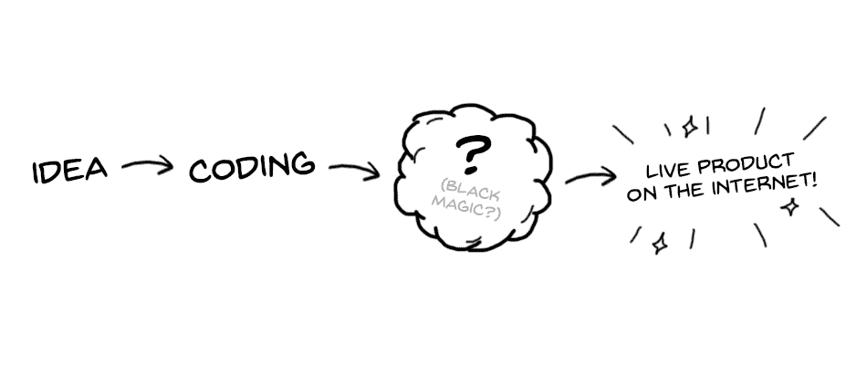

普遍的想法是，它也是由开发人员完成的，只是更“高级”一些。你们中的一些人可能听说过 DevOps、operators、cloud managers、sysadmins，以及其他一些比凡人更接近魔法世界的人。

嗯，在某种程度上的确如此。编码和成功测试之后发生的一切通常与脚本、Linux 命令和容器式的魔法联系在一起。有一条不成文的法律规定，只有给定组织中最有经验和最受信任的开发人员/管理员才负责成功的交付定稿。

应该是这样吗？这当然是有意义的——毕竟，这是一项复杂且非常关键的任务。但这是否意味着这是只保留给某些精英阶层的知识呢？绝对不行。

作为前端开发人员，我们可以幸福地忽略这一点，继续相信其他魔术师会做所有的事情——但我们不应该这样做。IT 世界中的能力正在快速变化，很快，无论您是在前端还是后端，关于每个堆栈元素的知识都将使您作为开发人员变得更有价值。

如果你想在你的职业发展中进步更快，并在你的同龄人中脱颖而出，你迟早会需要这些知识。让我来告诉你为什么。

## 为什么所有的开发人员都应该尝试自动化他们的工作

正如我们已经提到的，编写代码只是软件生产大计划中的一部分。让我们试着列出运送任何产品(不一定是软件)所需的步骤:

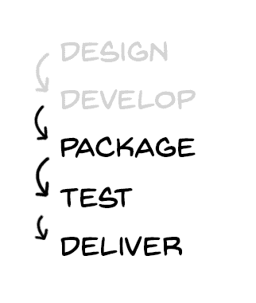

我们在这里讨论的与编码本身没有严格的联系；我们试图关注的是主要开发阶段之后会发生什么。为什么重要？因为它可能很复杂——解决方案越严重，这部分就越复杂。

想象一个基于 web 的应用程序，它具有一定数量的特性。让我们假设版本发布周期是以这样一种方式设计的，应用程序将被周期性地部署到 web 上，一个功能接一个功能。我们可以考虑一个前提条件，即在交付生产之前，每个功能都要经过测试。

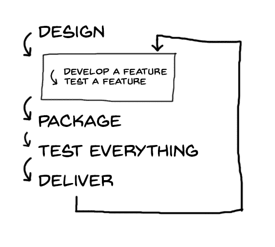

问题是，我们可能不会只雇佣一个程序员来做这项工作；功能将由一个团队编码。这些假设还意味着——除了每个开发人员的本地编码环境和最终稳定的生产环境之外——最好有一个“暂存”服务器来推进这些特性。在这里，测试人员/客户可以在将它们投入生产之前评估它们的质量。

现在我们越来越接近这样的模式:

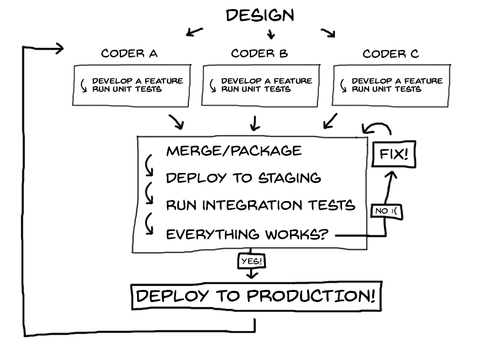

正如您所看到的，事情正在迅速变得复杂(相信我，我们在这里谈论的是一个非常简单的例子)。但是我们在这里不讨论产品管理生命周期的主题。让我们把重点放在技术方面。

假设一个前端开发者需要几分钟来构建一个应用。如果我们关心代码质量，他们将需要运行林挺、单元测试、集成测试，以及可能的其他检查，然后将他们的部分标记为完成。这需要时间。

最后，将完成的包放到服务器上还需要几分钟。如果我们在谈论将所有这些任务分配给一个程序员，请记住，我们甚至没有考虑转换他们的上下文所需的时间(例如，更改代码分支，重新调整他们的工作重点，等等)。).

现在，谁想负责手动部署每一个特性呢？如果每天测试三个新功能会怎么样？如果有 15 个呢？根据规模，处理上述任务肯定需要一名以上的全职员工。

这就是为什么我们应该在这里应用产生整个计算思想的同一原则:我们应该让一台机器为我们做这件事。

## 持续集成和持续部署的优势

在我们谈论将为我们构建、测试和部署代码的特定软件解决方案之前，让我们熟悉一下描述这个过程的两个术语。你可能已经听说过它们:


(N.B., often, the CD part stands for continuous delivery, which is a [slightly different concept](https://en.wikipedia.org/wiki/Continuous_delivery) we won’t cover in this post. This confusion-prone abbreviation is often a foundation for many academic discussions. There is a [great article from Atlassian](https://www.atlassian.com/continuous-delivery/principles/continuous-integration-vs-delivery-vs-deployment) that explains the differences.)

为什么有两个独立的短语，它们到底是什么意思？不要担心——为了避免混淆，让我们把这一个清除掉，并描述两者背后的总体思想。

CI/CD 的 ***持续集成*** 部分是一个涵盖了我们的应用程序完整性的重复测试的想法。从技术的角度来看，这意味着我们需要不断地执行林挺，运行单元/E2E 测试，检查初步的代码质量，等等。连续地，这意味着这必须在新代码推送期间完成——这意味着它应该自动完成。

* * *

### 更多来自 LogRocket 的精彩文章:

* * *

例如，CI 流程可以定义一批单元测试，这些测试将作为拉请求的一部分与代码一起运行。在这种情况下，每当新代码试图出现在例如开发分支上时，一些机器检查它是否满足标准并且不包含错误。

***持续部署***CI/CD 通常涵盖与构建和将应用程序移动到可用环境的过程相关的所有内容——也是自动的。例如，它可以从指定的分支(例如`master`)获取我们的应用程序代码，使用适当的工具(例如 webpack)构建它，并将其部署到正确的环境(例如托管服务)。

它并不严格局限于生产环境；例如，我们可以建立一个管道来构建一个应用程序的“暂存”版本，并将其放入适当的主机插槽中进行测试。

这两个术语是独立的概念，在软件管理生命周期理论中有不同的来源，但在实践中，它们通常是生活在一个大管道中的互补过程。为什么它们关系如此密切？通常，CI 和 CD 的某些部分可能会重叠。

例如，我们可能有一个项目，其中 E2E 测试和部署都需要用 webpack 构建前端代码。然而，在大多数“严肃”的生产项目中，都有许多 CI 和 CD 流程。

现在让我们回到我们想象中的具有众多特性的项目。CI/CD 在这里可以提供什么帮助？

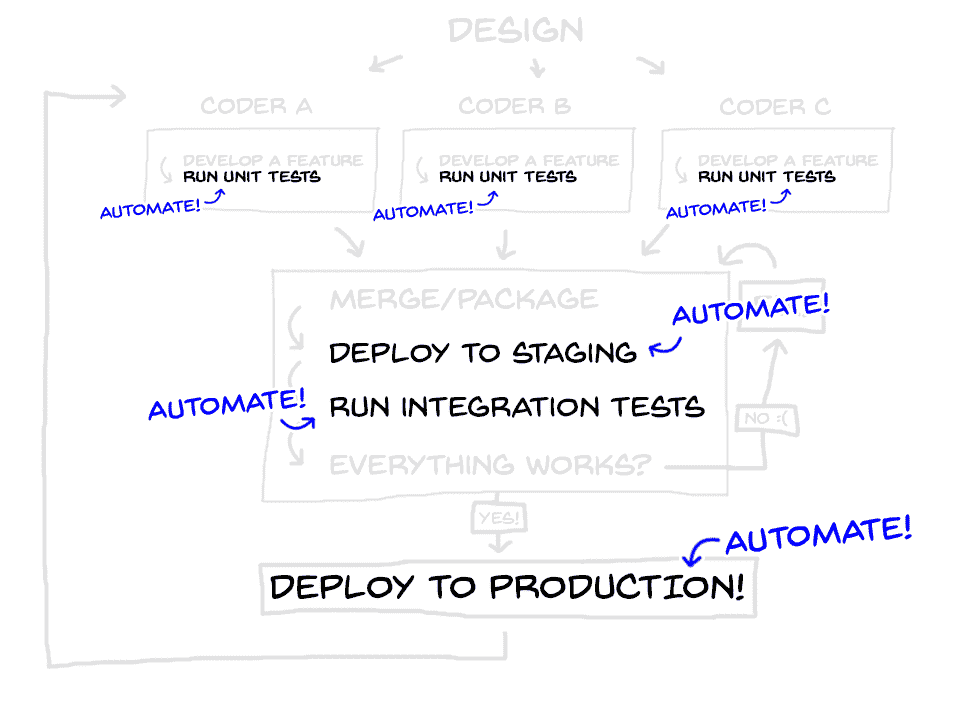

(I know that the more we get into the subject, the more complicated those flowcharts get — but hey, at least you can act cool while using the whiteboard during project meetings!)

现在想想我们能从上面的流程中得到什么。让我们从因果的角度来看。有可能提取特定的场景，形成我们假设的工作流程。例如:

> ***当*** *一个开发者试图将他们的代码推送到公共代码库的时候，* ***那么*** *一组单元测试需要通过。*

这样，我们就有了一个清晰的开头和一个动作——我们可以通过使用脚本或其他机制来实现自动化。在您未来的 CI/CD 冒险中，您可以将这些场景命名为*管道*。

注意上面加粗的单词:时的**和**然后是**。每个反应首先需要一个行动。为了运行一个特定的管道，我们需要某种 kickstart——或者一个*触发器* —来启动。这些可能是:**

*   一个定时器触发器(*“每天下午 6:00 构建一个应用程序的分期版本”。*)
*   代码库触发器(*)“每次发布新的拉请求时运行单元测试。”*)
*   手动触发器(*“项目经理启动应用程序构建流程并部署到生产中。”*)

也可以从其他管道调用特定的管道，特别是当我们需要集成一个由许多单独构建的子部分组成的复杂应用程序时。

好了，我们已经基本上涵盖了这个理论。现在让我们来谈谈为我们设计的软件。

## CI/CD 流程中使用的软件

在基本层面上，每一个 CI/CD 软件本质上都是某种任务运行器，当某些动作被触发时，它运行作业。我们在这里的角色是通过向它提供关于什么工作需要完成以及何时完成的正确信息来配置它。

尽管有这些基本的描述，CI/CD 软件还是有许多形状、大小和风格——其中一些非常复杂，需要数百个手册页。无论如何，不要害怕:在这篇文章结束之前，你会熟悉其中的一个。

首先，我们可以将 CI/CD 软件分为两类:

*   **可安装软件:**您可以在自己的电脑或其他远程机器上安装的应用或服务(如 Jenkins、TeamCity)
*   **SaaS:** 由外部公司(如 CircleCI、Azure DevOps)提供的带有 web 界面的应用或服务

很难讨论这两者的明显优势；正如这个话题经常出现的情况一样，它归结为应用程序的要求、组织的预算和政策以及其他因素。

值得一提的是，一些流行的存储库提供商(例如 BitBucket)维护着他们自己的 CI/CD web 服务，这些服务与他们的源代码控制系统紧密相关，目的是简化配置过程。此外，一些云托管的 CI/CD 服务是免费的，并向公众开放——只要应用程序是开源的。

免费层服务的一个流行例子是 [CircleCI](https://circleci.com/) 。我们将利用这一点，为我们的示例前端应用程序配置一个全功能的 CI/CD 管道——只需几个步骤！

## 先决条件和计划

CircleCI 是一个基于云的 CI/CD 服务，能够与 GitHub 集成，从中可以轻松获取源代码。这个服务中有一个有趣的原则:管道是从源代码内部定义的。这意味着你所有的动作和反应都是通过在你的源代码中设置一个特殊的文件来配置的；在本例中，它是名为`.circleci`的文件夹中名为`config.yml`的文件。

出于本教程的目的，我们将执行以下操作:

*   建立一个简单的前端应用程序，并在 GitHub 上公开其源代码
*   创建并推送包含管道流程定义的`config.yml`文件
*   创建一个 CircleCI 帐户，并将其与我们的 GitHub 帐户绑定
*   找一个地方部署应用程序(为此，我们将使用亚马逊 S3 作为托管服务)
*   最后，运行我们的自动化构建管道

整个过程应该不超过 30 分钟。如果你还和我在一起，让我们开始准备清单。你需要:

## 第一步:环境设置

您可以从将前面提到的[库](https://github.com/hzub/demo-ci-cd)分支并克隆到您的本地计算机开始。首先，让我们来看看它是做什么的。成功提取后，您可以导航到目标目录并调用以下命令:

```
npm install
npm start
```

现在打开浏览器，导航到[http://localhost:8080](http://localhost:8080)URL。您应该会看到类似这样的内容:

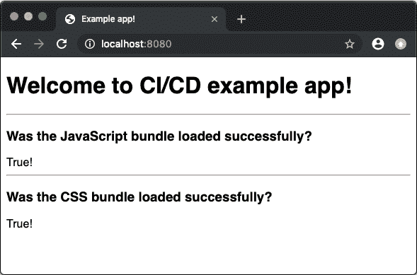

这是一个非常简单的前端应用程序，指示成功加载各自区域的`.js`和`.css`文件。您可以查看源代码，发现这是一个非常简单的机制。

当然，您可以在使用自己的应用程序时继续学习本教程；如果有必要，您只需要更改构建脚本命令。只要它是由 npm 之类的节点工具集构建的非常标准的应用程序，就应该可以使用。

在我们尝试自动化这个过程并设置我们的连续魔术之前，让我们构建应用程序并手动将其放入 S3。这样，我们将确保我们的目标环境设置正确。

我们将从本地构建应用捆绑包开始。如果您正在使用我们提供的示例应用程序，您可以通过调用`npm run build`命令来实现它。您应该会在项目的根目录中看到一个名为`dist`的文件夹:

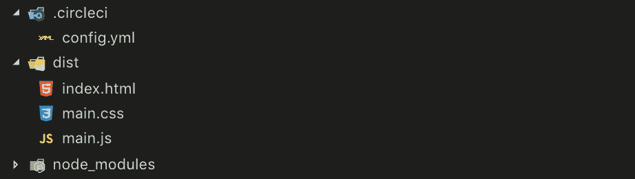

干净利落。我们的应用程序已经构建好了，包也准备好了。您可以通过调用`npx serve -s dist`命令来检查它在模拟服务器环境中的行为。这个将运行一个`serve`包，这是一个微型 HTTP 服务器，它将分发`dist`目录的内容。

运行该命令后，您可以在浏览器中导航到`[http://localhost:5000](http://localhost:5000)`。您应该会看到与开发服务器模式下相同的视图。

好了，现在让我们把应用程序放在互联网上的某个地方。为此，我们将开始与 S3 合作。

亚马逊 S3 是 AWS 生态系统的一部分，是一个非常简单的概念:它给你一个桶，你可以上传任何类型的文件(包括静态 HTML、CSS 和 JavaScript 资产)，并允许一个简单的 HTTP 服务器分发它们。最棒的是(在某些情况下)它是免费的！

首先，从登录控制台开始:


AWS login step 1: Providing an e-mail address for login

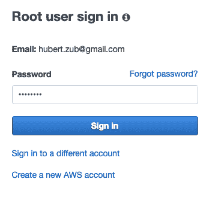

AWS login step 2: Providing a password

接下来，点击**服务**并选择**存储**下的 **S3** ，导航至 S3 控制面板。

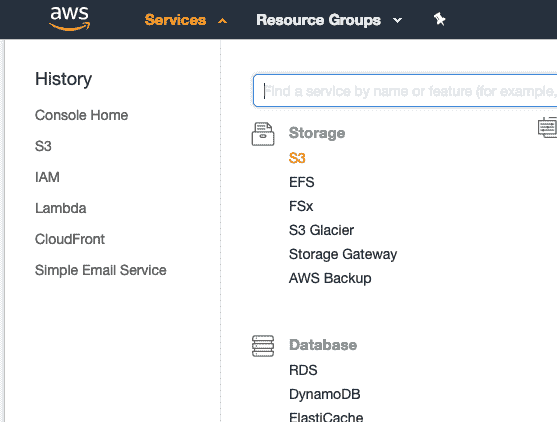

现在，我们将创建一个新的存储桶来托管我们的 web 应用程序。输入名称，仅由字母数字字符和连字符组成。接下来，为桶选择合适的区域，并记下这两个值——我们稍后会用到它们。

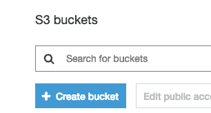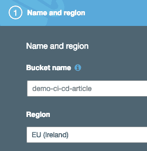

设置适当的权限很重要，这样文件才会是公开的。为此，点击下一个的**，直到到达**设置权限**。在那里，取消选中前三个框以启用文件的公共托管:**

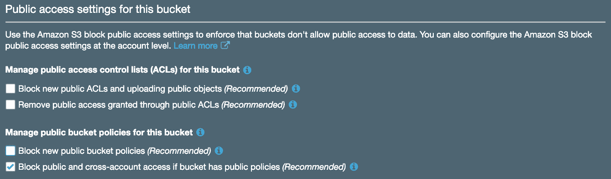

这样，HTTP 服务器将能够将上传的文件作为网站公开。完成存储桶后，您可以访问它并查看空文件列表:

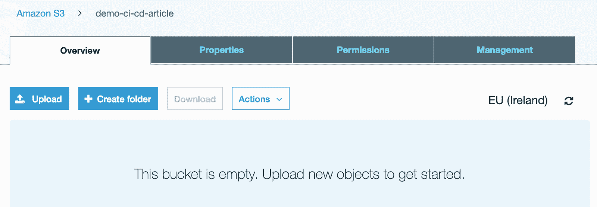

点击**上传**，系统会提示您选择想要上传的文件。您可以从`dist`文件夹中选择三个包文件并放在这里。同样，导航到**设置权限**并选择**管理公共权限**框下的**授予对该对象的公共读取权限**选项是非常重要的。

瞧啊。文件在那里。我们还需要做最后一件事来启用我们在 S3 的主机。导航到桶视图上的**属性**选项卡，找到**静态网站托管**选项，并启用它:

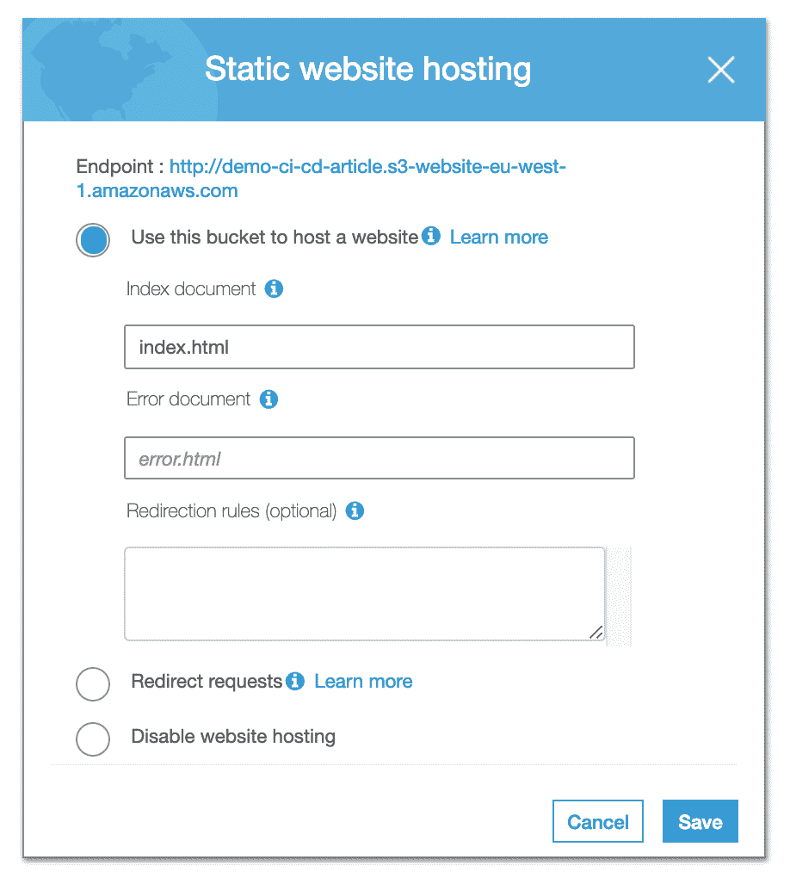

您需要将`index.html`添加为您的**索引文档**；这将是我们应用程序的入口。现在，它似乎准备好了。指向新生成站点的链接位于该对话框的顶部。点按它以查看您新部署的应用程序:

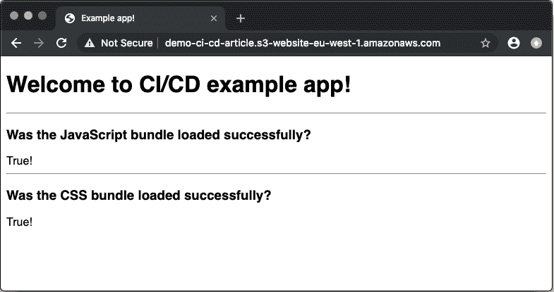

太好了，我们让网站正常工作了，但不幸的是，这不是我们的目标。这里没有什么是自动化的。你不会想经历这样的过程:每次有变化时，登录 S3 控制台，上传一堆文件；这是机器人的工作。

让我们建立一个持续的部署流程！

## 第二步:准备 CircleCI 配置

如果您仔细查看我们的示例存储库中的代码，您会发现我们在那里放了一个示例 CD 过程定义。打开`.circleci/config.yml`文件。

```
version: 2.1
orbs:
  aws-s3: circleci/[email protected]
jobs:
  build:
    docker:
      - image: circleci/python:2.7-node
    environment:
      AWS_REGION: us-east-1
    steps:
      - checkout
      - run: npm install
      - run: npm run build
      - aws-s3/sync:
          from: dist
          to: 's3://demo-ci-cd-article/'
          arguments: |
            --acl public-read 
            --cache-control "max-age=86400" 
          overwrite: true
workflows:
  version: 2.1
  build:
    jobs:
      - build:
          filters:
            branches:
              only: master

```

如前所述，`config.yml`是一个由 CircleCI 识别的文件，包含在 CD 过程中将被调用的管道的定义。在这种情况下，这 26 行包含有关以下内容的完整信息:

*   构建应用程序需要什么工具
*   在应用程序构建过程中使用了哪些命令
*   应用程序应该部署在哪里以及如何部署

如果你不熟悉 YAML 格式，你肯定会注意到它大量使用制表。这就是这些文件的结构和组织方式:每个部分都可以有子部分，而层次结构由一个由两个空格组成的选项卡表示。

现在，让我们一节一节地剖析这个文件:

```
version: 2.1
orbs:
  aws-s3: circleci/[email protected]
```

上面几行包含了关于所使用的解释器版本的信息，并定义了部署过程中必需的附加包(CircleCI 术语中的“orbs”)。在这种情况下，我们需要导入一个名为`aws-s3`的 orb，它包含将文件发送到 S3 桶所需的工具。

```
jobs:
  build:
    docker:
      - image: circleci/python:2.7-node
    environment:
      AWS_REGION: us-east-1
    steps:
      - checkout
      - run: npm install
      - run: npm run build
      - aws-s3/sync:
          from: dist
          to: 's3://demo-ci-cd-article/'
          arguments: |
            --acl public-read 
            --cache-control "max-age=86400" 
          overwrite: true
```

上面几行携带了关于作业定义的信息——我们管道的核心。

首先，请注意，我们已经将我们的作业命名为`build`，您可以在本节的第二行中看到。稍后我们将在 CircleCI 控制台报告中看到相同的名称。

在接下来的几行中，通过使用`docker`指令，我们定义将使用哪个容器(实际上是哪个虚拟机)来构建应用程序。如果您还不熟悉容器化和/或 docker 主题，您可以放心地将这一步想象为选择一台将被用来执行构建任务的虚拟机。

在这种情况下，它是一个 linux VM，带有 Python 和 Node.js 我们需要 Python 来运行 AWS S3 工具集，需要 Node 来构建我们的前端应用程序。

`environment`和`AWS_REGION`是 AWS 需要运行的环境变量。确切的值无关紧要；S3 无论如何都会工作。

下一部分应该更加自我描述。实际上，它是为完成所描述的工作而逐个调用的阶段的列表。此示例中定义的步骤是:

*   `checkout`:从存储库中抓取源代码
*   非常简单。这将安装节点依赖项
*   我们管道的核心。这一步调用我们代码的构建
*   `aws-s3/sync`:另一个重要的阶段，在给定的 S3 桶中部署(同步)目录`dist`的内容。**请注意**这个例子使用`demo-ci-cd-article`作为桶名；如果您正在学习本教程，您应该更改您的 bucket 名称以匹配这个示例

## 解剖圆环构型

基本上，您可以将单个作业想象成您通常在本地计算机上运行的一组操作。这样，您只需一步一步地告诉虚拟机该做什么。同样，您可以认为它是一个有点不寻常的 shell 脚本，具有一些额外的功能。

关于工作有一个重要的原则:每一步都应该以成功告终。如果任何一个命令失败，作业的剩余部分将立即停止，并且管道的当前运行将被标记为`FAILED`。稍后将在 CI/CD 控制台中指示作业失败，并显示相关错误，这是对错误的提示。

失败的原因多种多样。例如，在一个旨在执行自动测试的管道中，它可能只是表明一个单元测试失败了，某个开发人员需要修改他们的代码。也可能是工具配置不正确，导致无法成功构建和部署。不管原因是什么，CI/CD 流程通常会通过电子邮件通知管理员(或罪魁祸首)管道故障，以便进行适当的补救。

这就是为什么用相对安全的方式定义我们的工作很重要；如果某一步发生了不好的事情，我们需要确保之前的步骤不会产生任何永久性的副作用。

我们已经接近尾声了。最后一节是`workflows`:

```
workflows:
  version: 2.1
  perform_build:
    jobs:
      - build:
          filters:
            branches:
              only: master
```

在 CircleCI 中，“工作流”是一组一起启动的作业。因为我们在这里只定义了一个任务(`build`)，所以我们可以省略这个任务。然而，通过定义工作流，我们可以使用一个重要的特性:分支过滤。

如果您仔细查看配置文件的最后两行，您会看到一个`filters`部分。在这个例子中，它包含了`branches: only: master`。这意味着，根据定义，构建作业应该只在主分支上的代码发生更改时运行。

通过这种方式，我们可以筛选出我们希望 CI/CD 流程“关注”的分支。例如，我们可以在不同的分支上调用不同的工作流(不同的任务)，构建不同的版本，或者只在特定的环境下运行测试。

## 最后一步:我们的 CircleCI 在行动

如果您还没有这样做，请通过选择**使用 GitHub** 登录，将您的 GitHub 帐户与 [CircleCI](https://circleci.com/vcs-authorize/) 连接。

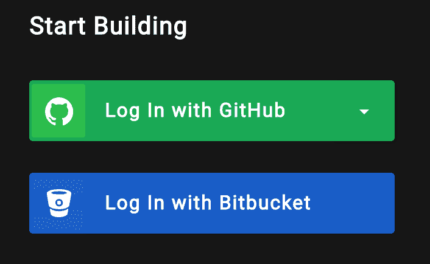

登录 GitHub 并授权 CircleCI 集成后，您应该会看到一个侧边栏，其中有一个选项可以选择**添加项目**。点击它查看您的活动 GitHub 资源库列表:

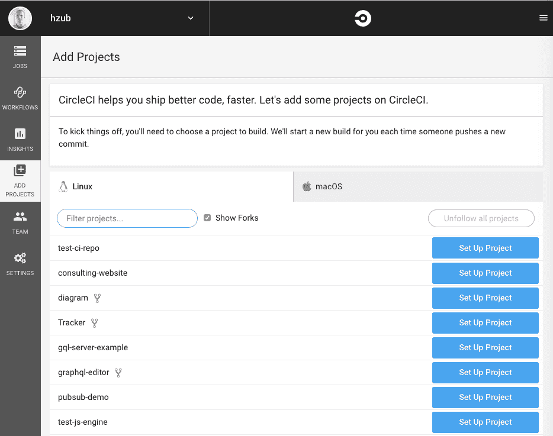

我们将假设您已经有了一个从示例中克隆的或者为自己准备的存储库(还记得正确的`.circleci/config.yml`文件)。

在列表中找到该项目，点击其旁边的**设置项目**。您应该会看到一个描述 CircleCI 原理的信息屏幕:

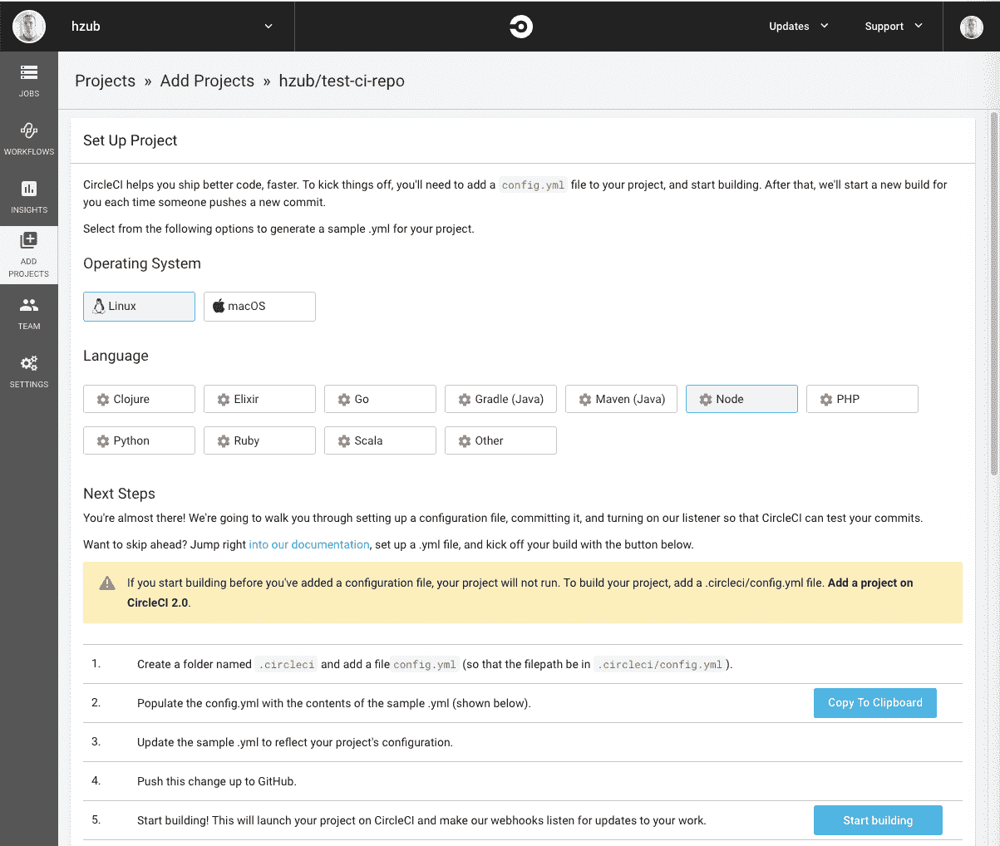

看到底部的**开始建造**按钮了吗？是的，就是它——点击它，启用我们的自动化流程，让这台机器为我们工作。

点击这个之后，你会看到…一个错误。

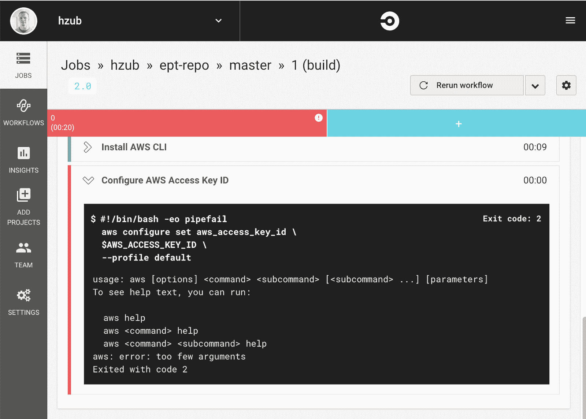

真扫兴。

还有一件事我们还需要配置:让 CircleCI API 授权给 AWS 的机制。到目前为止，我们还没有把我们的 AWS 密码放在 code、GitHub 或 CircleCI 的任何地方。AWS 无法知道是我们要求把东西放在 S3，因此出现了错误。

我们可以通过在 CircleCI 面板中更改项目设置来修复它。要进入，点击右上角的**齿轮图标**，然后在左侧窗格找到 **AWS 权限**标签。您应该会看到类似这样的内容:

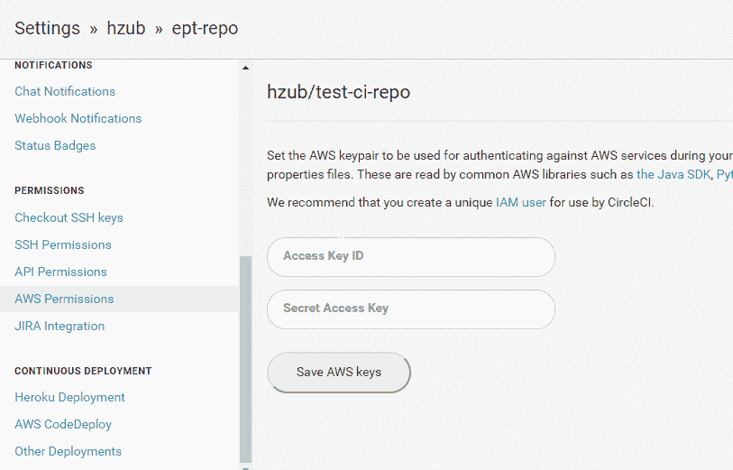

**访问密钥 ID** 和**秘密访问密钥**是特殊的 AWS 授权值，允许 CircleCI 等第三方服务为您做一些事情——例如，将文件上传到 S3 桶。最初，这些密钥将拥有与它们被分配到的用户相同的权限。

您可以在 AWS 控制台的 [IAM 部分](https://console.aws.amazon.com/iam/home#/security_credentials)中生成这些。在那里，展开**访问密钥(访问密钥 ID 和秘密访问密钥)**窗格。点击**创建新的访问密钥**并生成一个可以复制到 CircleCI 中的密钥对:

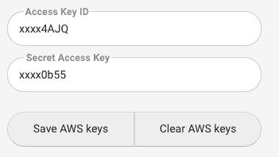

点击**保存 AWS 键**，我们应该可以开始了。您可以尝试重新初始化 CircleCI 上的存储库，或者使用更快捷的方法:转到失败尝试报告，找到**重新运行工作流**按钮，然后单击它。


现在应该没有未解决的问题了，构建应该会无缝地完成。


耶！您可以登录到 S3 控制台并检查文件修改时间。它应该表明文件是新上传的。但这还不是结束——让我们看看“持续”部分是如何工作的。我将返回代码编辑器，介绍应用程序(`index.html`)源代码的一个小变化:

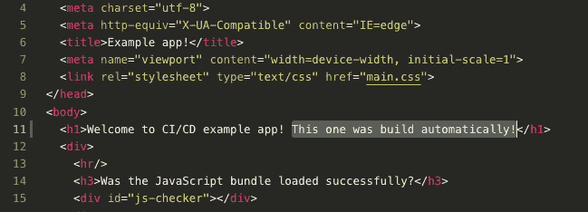

现在，让我们将代码推送到存储库:

```
git add .
git commit -m “A small update!”
git push origin master
```

你可以在 CircleCI 面板上看到奇迹。眨眼之间，就在成功推送之后，您应该看到 CircleCI 消耗了更新的代码并开始自动构建它:

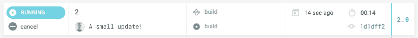

几秒钟后，您应该会看到一条`SUCCESS`消息。现在，您可以导航到 S3 托管的网页并刷新它，以查看所应用的更改:

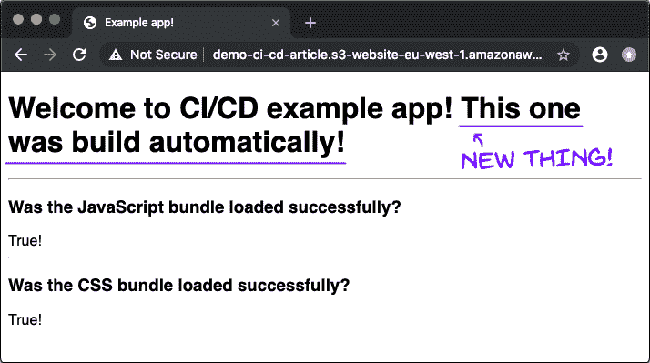

就是这样！这一切都是自动发生的:您推送代码，互联网上的某个机器人为您构建代码，并将其部署到生产环境中。

## 下一步是什么？

当然，这只是一个小例子。现在我们有一个很好的机会来回顾一个更复杂的用例——例如，部署到多个环境并基于此改变应用程序的行为。

如果你回到我们的示例源代码，你会注意到在`package.json`中有两个独立的构建脚本:一个用于`production`，一个用于`staging`。由于它只是一个示例项目，所以没有引入任何重大的变化；这里，它只是以不同的 JavaScript 控制台消息结束。

运行使用`staging`变体构建的应用程序并打开浏览器后，您应该会在 JavaScript 控制台中看到相关的日志条目:

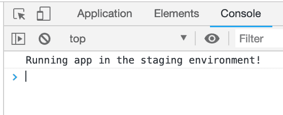

现在，我们可以利用这种机制来扩展我们的构建管道。考虑以下代码:

```
version: 2.1
orbs:
  aws-s3: circleci/[email protected]
jobs:
  build:
    docker:
      - image: circleci/python:2.7-node
    environment:
      AWS_REGION: us-east-1
    steps:
      - checkout
      - run: npm install
      - run: npm run build
      - aws-s3/sync:
          from: dist
          to: 's3://demo-ci-cd-article/'
          arguments: |
            --acl public-read 
            --cache-control "max-age=86400" 
          overwrite: true
  build-staging:
    docker:
      - image: circleci/python:2.7-node
    environment:
      AWS_REGION: us-east-1
    steps:
      - checkout
      - run: npm install
      - run: npm run build:staging
      - aws-s3/sync:
          from: dist
          to: 's3://demo-ci-cd-article/'
          arguments: |
            --acl public-read 
            --cache-control "max-age=86400" 
          overwrite: true
workflows:
  version: 2.1
  build:
    jobs:
      - build:
          filters:
            branches:
              only: master
  build-staging:
    jobs:
      - build-staging:
          filters:
            branches:
              only: develop
```

请注意，我们已经添加了一个名为`build-staging`的新作业和新工作流。有两个不同之处:新的作业调用前面提到的`npm run build:staging`方法，相应的工作流由`develop`分支过滤。

这意味着所有被推送到`develop`的变更都将调用“暂存”构建，而`master`分支上的所有变更都将保留其原始行为并触发“生产”构建。在这种情况下，两者都在同一个 S3 桶中结束，但是我们总是可以改变这种情况，并拥有单独的目标环境。

试试看:基于`master`创建一个新的`develop`分支，推送到回购。在您的 CircleCI 控制台中，您应该看到已经调用了不同的工作流:

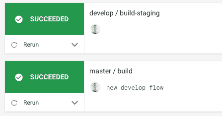

相应的变更被推送到 S3 存储桶，但是这一次，它是一个源自`develop`分支的阶段性构建。您的多版本构建工作得非常好。很好——我们正在接近文章前一部分的原始工作流！

## 持续集成部分

我们已经处理了持续部署部分，但是持续集成呢？正如我们已经讨论过的，这一点与执行代码质量的常规检查有关，即运行测试。

如果您仔细观察示例存储库，您会发现其中添加了一个示例单元测试。您可以通过运行`npm run test`命令来调用它。它做不了多少；它只是通过断言将一个伪函数结果与某个模式进行比较:

```
function getMessage() {
  return 'True!';
}

// ...

module.exports = getMessage;

const getMessage = require('./jsChecker');

const assert = require('assert');

assert.equal(getMessage(), 'True!');
```

我们可以在我们的管道中包含这个测试，然后建立我们的存储库，在每个创建的拉请求上执行它。为了实现这一目标，我们将首先在`config.yml`中创建一个新任务和新工作流:

```
version: 2.1
orbs:
  aws-s3: circleci/[email protected]
jobs:
  build:
    # ...
  build-staging:
    # ...
  test:
    docker:
      - image: circleci/python:2.7-node
    steps:
      - checkout
      - run: npm install
      - run: npm run test
workflows:
  version: 2.1
  build:
    # ...
  build-staging:
    # ...
  test:
    jobs:
      - test
```

我们已经定义了一个名为`test`的新作业和新工作流。它的唯一目的是为我们调用`npm run test`脚本。您可以将该文件推送到存储库，并在 CircleCI 控制台中检查发生了什么:

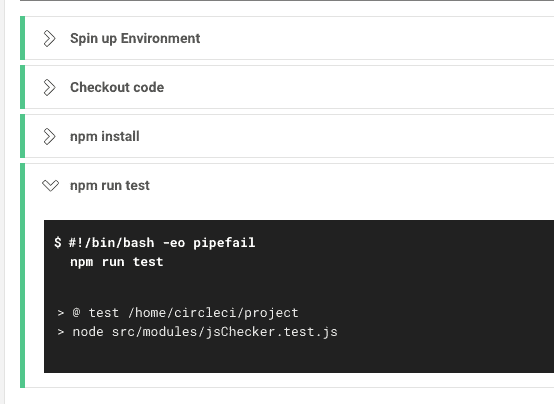

新的工作流被自动调用，这导致了成功的测试运行。现在，让我们将它与我们的 GitHub 库连接起来。可以集成这个作业，以便在每次创建新的对特定分支的拉请求时运行。为此，您需要打开 GitHub 项目页面并导航到**设置**视图。在那里，选择**分支**选项卡:

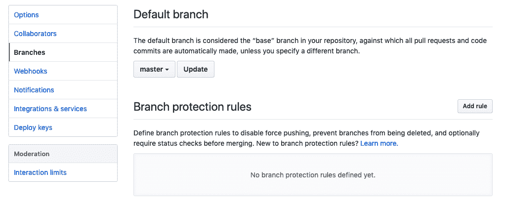

通过点击 **Add rule** ，您可以添加一个新的策略，该策略将在允许合并一个 pull 请求之前强制执行某些检查。可用的检查之一是调用 CircleCI 工作流，如下所示:

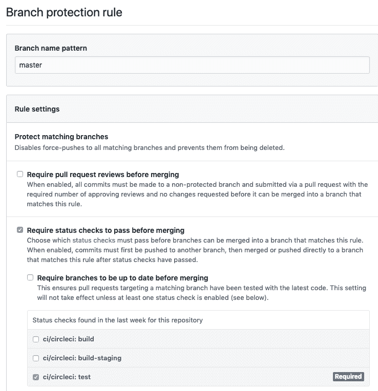

通过选中**要求在合并**前通过状态检查框并选择下面的`ci/circleci: test`，我们刚刚设置了运行此工作流的规则，作为拉动请求有效的先决条件。

您可以通过尝试创建一个新的 pull 请求并展开 **Checks** 窗格来测试此行为:

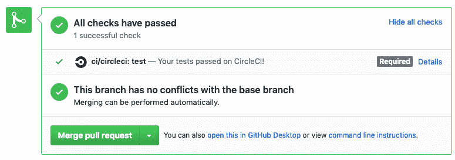

当然，我们可以打破它。您可以尝试创建一个导致测试失败的提交，将其放在一个新的分支上，并创建一个拉请求:

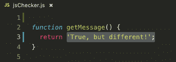

我们中断了成功的测试—断言将失败，并显示以下输入:

```
assert.equal(getMessage(), 'True!');
-->
> node src/modules/jsChecker.test.js
assert.js:42
  throw new errors.AssertionError({
  ^
AssertionError [ERR_ASSERTION]: 'True, but different!' == 'True!'
    at Object.<anonymous>
```

现在，pull 请求将不可用于合并，因为它试图引入导致测试失败的代码:

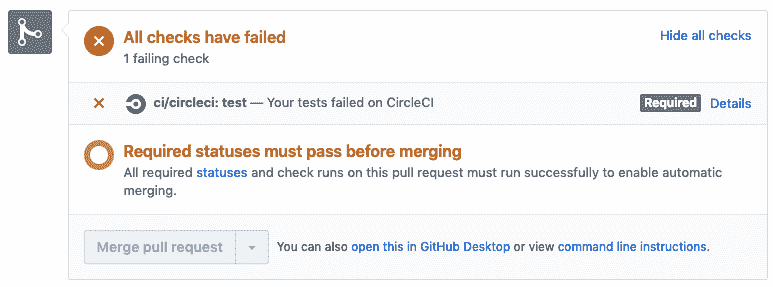

整洁！我们的示例项目被持续测试很好地覆盖了，只要测试用例被正确地编写，没有人会成功地将糟糕的代码引入生产分支。同样的机制可以用于执行代码林挺、静态代码分析、E2E 测试和其他自动检查。

好了，就这样吧！尽管我们的示例项目非常简单，但是它与真实的、有效的 CI/CD 过程纠缠在一起。集成和部署都由生活在云中的机器人来协调，因此您可以将所有的注意力转移到编码上。

不管参与的人数有多少，你的机器将不知疲倦地为你工作，并检查一切是否到位。当然，设置一切也需要一些时间；但是从长远来看，委派所有世俗工作的好处是无价的。

当然，这不是一个永远免费的天堂:迟早，这里会涉及到额外的成本。例如，CircleCI 每月免费提供 1000 分钟的构建时间。对于较小的团队和简单的开源项目来说，这应该足够了，但是任何较大的企业项目肯定会超过这个限额。

## 进一步阅读

我们已经回顾了基础知识，但是还有很多其他重要的主题没有被这篇文章触及。

一是利用环境变量。通常，您不希望将密码、API 密钥和其他敏感信息直接保存在源代码中。在涉及 CI/CD 自动化的场景中，您需要首先为机器输入适当的变量——就像我们在本例中对 AWS secret 密码所做的那样。

除此之外，环境变量用于控制建筑的流程，例如，在特定版本中应该建造哪个目标或应该启用应用程序的哪些功能。你可能想了解更多关于它们在 CircleCI 中的用法。

另一个主题:许多 CI/CD 过程引入了工件管理的思想。工件是特定构建过程产生的代码的通称。例如，一个打包的包或一个生成的包含特定版本的应用程序的容器映像可能是一个工件。

在某些组织中，由于各种各样的需求，版本化的工件的适当管理是重要的；例如，出于回滚或法律目的，可能会对它们进行编目和归档。

另一个重要的主题是角色、权限和安全性的广阔世界。这篇文章与定义管道和工作流的基本技术方面有关，但是在大型的实际项目中，有必要考虑组织的过程和策略。例如，我们希望某些管道只由公司结构中的某个人调用或批准。

另一个例子是对特定管道设置或虚拟机配置的细粒度访问。但同样，这完全取决于所使用的软件和特定的项目/公司需求；一个好的自动化过程没有单一的模式，就像一个好的 IT 项目没有单一的配方一样。

## 结论

咻。我们到了。

看了这篇文章，你有什么收获？最重要的是，您现在对“严肃”项目幕后发生的事情有了大致的了解。不管使用什么方法和软件，原则总是相似的:有任务、管道和代理来完成工作。希望这个又大又可怕的概念不再那么可怕。最后，您有机会创建自己的工作 CI/CD 管道，并使用自动化将应用程序部署到云中。

接下来你能做什么？

当然是扩大知识面，努力做到更好。如果你正在为一家公司做一个项目，你可以试着玩代码，在下班后发明你自己的测试/部署管道。您可以(甚至应该)在您的下一个开源项目中引入自动测试和/或打包过程。你也可以熟悉更多的 CI/CD 软件样本:Travis、Jenkins 或 Azure DevOps。

此外，您可以在我的个人资料中查看[其他与前端开发相关的帖子](https://medium.com/@hubert.zub)。祝你旅途好运！

## 使用 [LogRocket](https://lp.logrocket.com/blg/signup) 消除传统错误报告的干扰

[](https://lp.logrocket.com/blg/signup)

[LogRocket](https://lp.logrocket.com/blg/signup) 是一个数字体验分析解决方案，它可以保护您免受数百个假阳性错误警报的影响，只针对几个真正重要的项目。LogRocket 会告诉您应用程序中实际影响用户的最具影响力的 bug 和 UX 问题。

然后，使用具有深层技术遥测的会话重放来确切地查看用户看到了什么以及是什么导致了问题，就像你在他们身后看一样。

LogRocket 自动聚合客户端错误、JS 异常、前端性能指标和用户交互。然后 LogRocket 使用机器学习来告诉你哪些问题正在影响大多数用户，并提供你需要修复它的上下文。

关注重要的 bug—[今天就试试 LogRocket】。](https://lp.logrocket.com/blg/signup-issue-free)