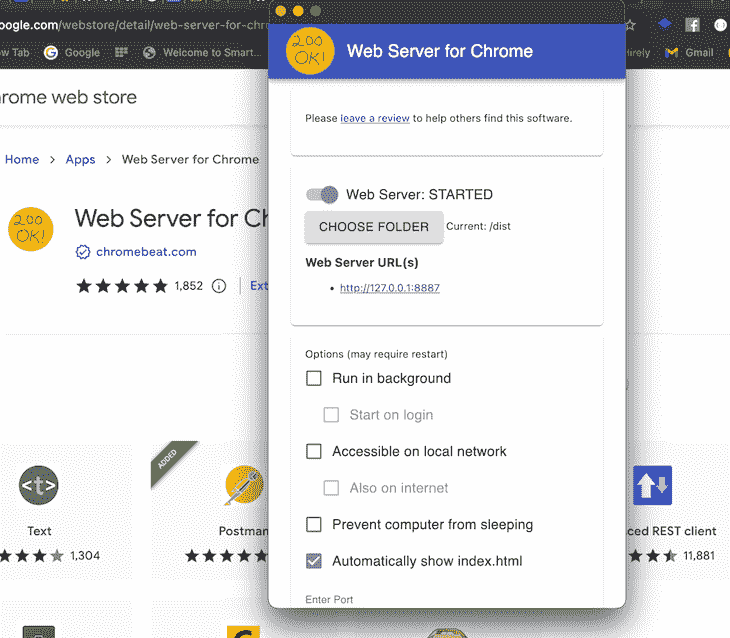
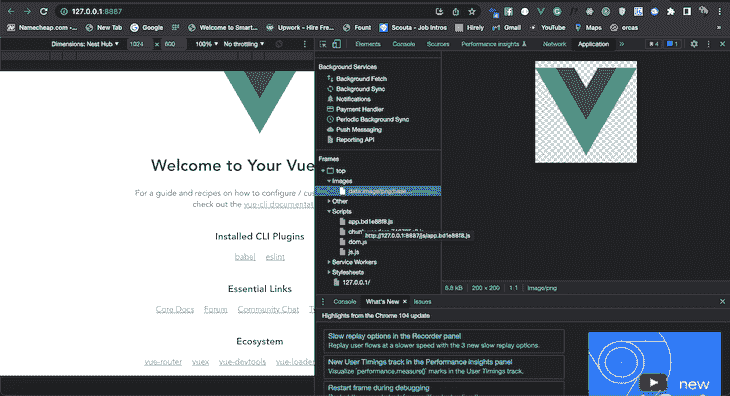

# Vue 中的前端缓存与 Workbox 服务工作者

> 原文：<https://blog.logrocket.com/frontend-caching-in-vue-with-workbox-service-workers/>

缓存是指将经常需要的信息存储在缓存中以便可以快速访问内容的过程。缓存是硬件或软件，用于临时存储经常使用的数据，从而改善其内存访问时间。

我们可以使用各种方法和工具来为前端和后端应用程序执行缓存。如果您是阅读本文的全栈开发人员，您应该已经熟悉使用 Redis 的[缓存，Redis 是一个开源的内存中的](https://blog.logrocket.com/add-redis-cache-nestjs-app/)数据存储。

在本教程中，我们将重点介绍如何使用 Vue 和 Workbox 设置前端缓存。要阅读本文，您需要熟悉以下内容:

*   基本的 HTML、CSS 和 JavaScript
*   Vue 和 Node.js

我们将讨论以下内容:

## 什么是前端缓存，为什么它很重要？

客户端缓存是一项非常强大的技术，可以优化您的应用程序并改善您的用户体验。将 web 应用程序的数据缓存在浏览器中的想法源于这样一种认识，即从本地缓存或浏览器存储 API 获取数据比网络请求更具成本效益。

## 什么是工作箱维修人员？

Workbox 部署了一组模块和工具，[通过处理路由和缓存来简化与服务人员](https://blog.logrocket.com/pwa-create-react-app-service-workers/#what-service-worker)的交互。Workbox 旨在简化服务人员的开发，同时为复杂的应用程序需求腾出空间。工具箱中的每个[独立模块为维修工人提供特定的功能。](https://developer.chrome.com/docs/workbox/modules/)

渐进式 web 应用程序使用服务工作者来提供离线功能并提高 web 应用程序的页面性能。一个典型的 web 应用程序依赖多个数据源向最终用户显示大量内容，它需要一种介质来缓存和呈现信息，即使应用程序处于脱机状态。

[服务工作器 API](https://developer.mozilla.org/en-US/docs/Web/API/Service_Worker_API) 有许多复杂的交互，处理网络请求、缓存、缓存管理、预缓存等等。

[Workbox](https://developer.chrome.com/docs/workbox/) 是服务工作者 API 的抽象。它是一组 JavaScript 模块，每个模块处理服务工作者 API 的特定部分:

这些模块以声明的方式组成服务工作者，这使得它们比直接与服务工作者 API 交互更容易阅读和维护。

## 什么时候需要缓存？

只要性能仍然是软件应用程序用户非常关心的问题，缓存就会继续发展，并且会出现更多的解决方案和策略。以下是一些需要缓存的应用程序:

*   具有大量静态资产的单页应用程序
*   针对移动用户优化的 Web 应用
*   新的在线平台

## 服务人员策略

服务工作者策略是服务工作者的`fetch`事件与其缓存接口之间的通信。软件开发人员经常利用五种流行的服务工作者策略来提高应用程序的性能:

*   高速缓存优先:向服务工作高速缓存发送请求。如果找到响应，它将服务于该响应。否则，它会退回到网络
*   网络优先:向网络发送请求。如果找到响应，它将服务于该响应。否则，它会退回到服务工作者的缓存中
*   仅缓存:将当前网页上的所有请求转发到工作缓存上与之匹配的响应
*   仅网络:通过服务工作线程将所有请求发送到网络，而不与缓存进行任何交互
*   失效时失效:第一个请求被发送到网络并存储在缓存中。当网络请求在后台运行并更新缓存(如果有新的更新)时，后续请求被发送到服务工作者的缓存

## 使用 Vue 进行工具箱缓存

首先，让我们在全球范围内安装 Vue:

```
npm install -g @vue/cli
# OR
yarn global add @vue/cli

```

安装完成后，运行以下代码以确认 Vue 版本:

```
vue --version

```

然后，创建一个新的 Vue 项目:

```
vue create vue workbox

```

导航到新创建的`workbox`文件夹，用下面的命令启动项目:

```
cd vue
yarn serve

```

## 使用 Workbox CLI 为 Vue 应用程序生成服务人员

使用以下命令添加 Vue 的工具箱插件:

```
vue add pwa

```

上面的命令将安装 Workbox 以及在 CDN mood 中与 Workbox 通信所需的所有依赖项。

## 配置

接下来，用下面的代码更新您的`vue.config.js`文件:

```
const { defineConfig } = require('@vue/cli-service')
module.exports = defineConfig({
  transpileDependencies: true,
   pwa: {
    name: "workbox",
    themeColor: "#fff3e0",
    msTileColor: "#fff3e0",
    appleMobileWbeAppCapable: "yes",
    appleMobileWebAppStatusBarStyle: "#fff3e0",
    workboxPluginMode: "InjectManifest",
    workboxOptions: {
      swSrc: "./service-worker.js",
      exclude: [/_redirect/, /\.map$/, /_headers/],
    },
    manifestOptions: {
      background_color: "#ffe24a",
    }
  }
})

```

[`workbox-webpack-plugin`](https://developers.google.com/web/tools/workbox/modules/workbox-webpack-plugin) 支持两种模式。在上面的配置中，我们将`workboxPluginMode`设置为`InjectManifest`。 [`InjectManifest`](https://developer.chrome.com/docs/workbox/reference/workbox-webpack-plugin/#type-InjectManifest) 情绪要求您在`workBoxOptions`对象中指定您的`service-worker`路径`swSrc`。另一个选项`GenerateSW`不需要服务。

请注意，我们用下面的代码为服务人员指定了目录:

```
swSrc: 'src/service-worker.js',

```

如果您打算自己编写您的`service-worker`文件，您可以跳到使用`InjectManifest` 的[部分。否则，请遵循以下步骤。](#using-inject-manifest-mood)

## 使用`GenerateSW`语气

首先，用下面的代码设置`workboxPluginMode`:

```
workboxPluginMode: "GenerateSW"
// swSrc: "./service-worker.js" comment out this line of code,

```

然后，构建应用程序的生产版本，如下所示:

```
yarn build

```

## 测试应用程序

一旦构建完成，您应该将`manifest.json`和`service-worker.js`添加到`/dist`目录中。要在生产服务器中测试应用程序，下载并安装 Chrome 的 [Web 服务器](https://chrome.google.com/webstore/detail/web-server-for-chrome/ofhbbkphhbklhfoeikjpcbhemlocgigb/related?hl=en-GB&utm_source=chrome-ntp-launcher)，并将文件夹设置为应用程序的`./dist`，如下图所示:



要查看您的应用程序，请单击 web 服务器提供的 URL。检查网页并导航至应用程序。在框架部分，你应该已经看到了`images`、`script`和`stylesheet`文件夹。这表明所有 web 应用程序的静态资产都已被预缓存，即使在脱机模式下也仍然可以工作:



## 使用`InjectManifest`语气

打开`service-worker.js`并添加以下代码:

```
const { precacheAndRoute } = workbox.precaching;
const { registerRoute } = workbox.routing;
const { CacheFirst, StaleWhileRevalidate } = workbox.strategies;
const { Plugin: ExpirationPlugin } = workbox.expiration;
const { Plugin: CacheableResponsePlugin } = workbox.cacheableResponse;

```

由于 Workbox CDN v4.3.1 中的 Workbox 功能，Vue 3 会自动添加 CDN。上面的代码注册了应用程序执行缓存所依赖的一些工作箱端点:

```
workbox.core.setCacheNameDetails({ prefix: "appname" });

self.addEventListener("message", (event) => {
  if (event.data && event.data.type === "SKIP_WAITING") {
    self.skipWaiting();
  }
});

/**
 * The workboxSW.precacheAndRoute() method efficiently caches and responds to
 * requests for URLs in the manifest.
 */
self.__precacheManifest = [].concat(self.__precacheManifest || []);
precacheAndRoute(self.__precacheManifest, {});

// cache image and render from the cache if it exists or go t the network
registerRoute(
  ({ request }) => request.destination === "image",
  new CacheFirst({
    cacheName: "images",
    plugins: [
      new CacheableResponsePlugin({
        statuses: [0, 200],
      }),
      new ExpirationPlugin({
        maxEntries: 60,
        maxAgeSeconds: 2 * 24 * 60 * 60, // cache the images for only 2 Days
      }),
    ],
  })
);

```

上面的代码从 Vue `/dist`文件夹中取出图像，并缓存两天。
要从工具箱 API 获得响应，请在`service-worker.js`中的`registerRoute`后添加以下代码:

```
registerRoute(
  ({ url }) => url.pathname.startsWith("https://dog.ceo/api/"),
  new StaleWhileRevalidate()
);

```

我们使用`StaleWhileRevalidate`函数来缓存 API 响应，如果它存在或进入网络，就从缓存中提供它。一旦您对服务人员感到满意，您就可以按照前面的说明来测试应用程序。

请记住，这是一个示例`service-worker`文件。您的`service-worker`文件可以只包含适用于您的用例的逻辑。

## 缓存面临的挑战

缓存 web 应用程序资产可以改善整体用户体验，但是，当出现故障并且旧的 web 应用程序源代码而不是最新的缓存版本提供给用户时，它也会破坏用户体验。虽然这种情况很少发生，但我建议您在部署之前始终确认您的缓存和回退逻辑是正确的，以避免这种情况。

## 结论

缓存提高了我们网站或应用程序的整体性能。一旦所有的资源都被下载到用户的机器上，即使在糟糕的网络环境下，向用户显示网站内容的预缓存版本也变得非常方便。

在本文中，我们探索了在应用程序中使用带有 Vue 的 Workbox service workers 来处理路由和缓存。我们讨论了什么是服务工作者，什么时候需要缓存，最后，缓存可能带来的一些潜在问题。

我希望你喜欢这篇文章，如果你有任何问题，一定要留下评论。

## 像用户一样体验您的 Vue 应用

调试 Vue.js 应用程序可能会很困难，尤其是当用户会话期间有几十个(如果不是几百个)突变时。如果您对监视和跟踪生产中所有用户的 Vue 突变感兴趣，

[try LogRocket](https://lp.logrocket.com/blg/vue-signup)

.

[](https://lp.logrocket.com/blg/vue-signup)[https://logrocket.com/signup/](https://lp.logrocket.com/blg/vue-signup)

LogRocket 就像是网络和移动应用程序的 DVR，记录你的 Vue 应用程序中发生的一切，包括网络请求、JavaScript 错误、性能问题等等。您可以汇总并报告问题发生时应用程序的状态，而不是猜测问题发生的原因。

LogRocket Vuex 插件将 Vuex 突变记录到 LogRocket 控制台，为您提供导致错误的环境，以及出现问题时应用程序的状态。

现代化您调试 Vue 应用的方式- [开始免费监控](https://lp.logrocket.com/blg/vue-signup)。