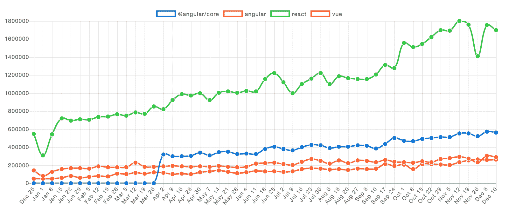
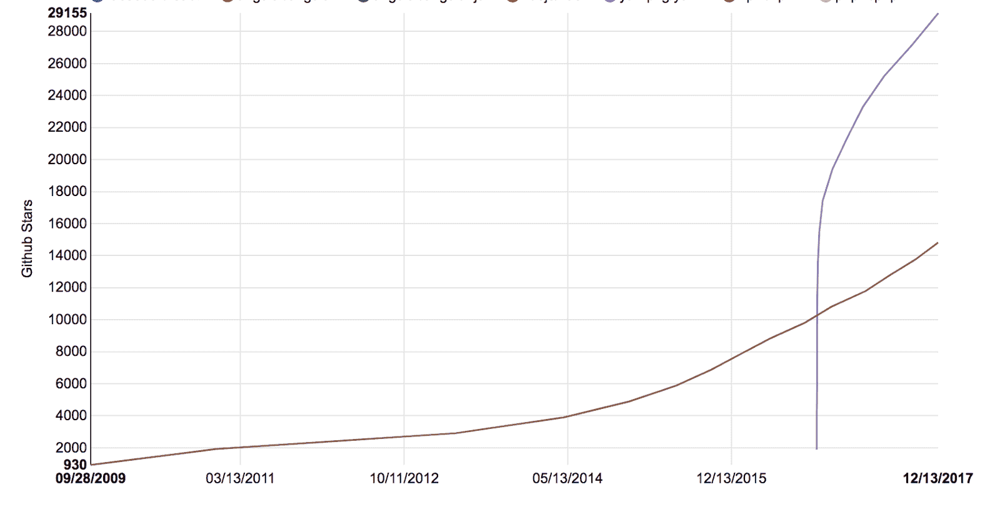
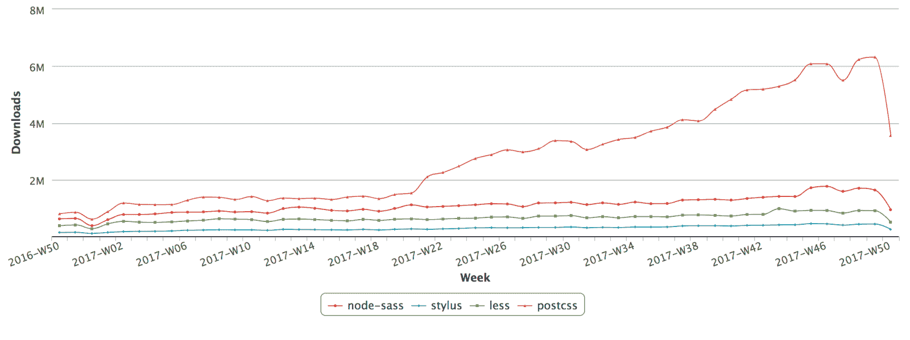
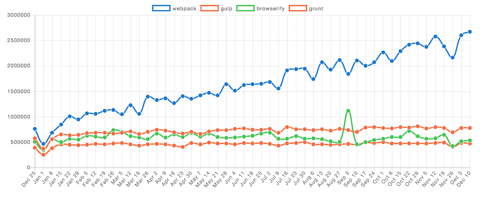
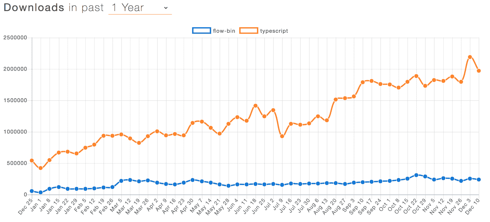
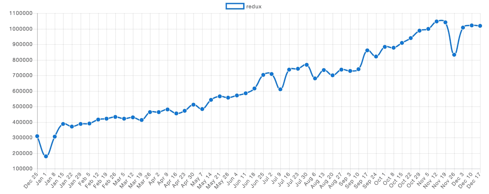

# 2017 年前端:重要部分

> 原文：<https://blog.logrocket.com/frontend-in-2017-the-important-parts-4548d085977f/>

### 结构

#### 反应

React 16 于 9 月发布，带来了内部核心架构的完全重写，没有任何重大的 API 变化。新版本提供了改进的错误处理，引入了[错误边界](https://reactjs.org/blog/2017/07/26/error-handling-in-react-16.html)，并支持将渲染树的一部分渲染到另一个 DOM 节点上。

React 团队选择重写核心架构，以便在未来的版本中支持异步渲染，这在以前的架构中是不可能的。通过异步渲染，React 可以避免在渲染繁重的应用程序时阻塞主线程。计划是在 React 16 的未来次要版本中将其作为一个可选功能提供，因此您可以在 2018 年的某个时候期待它。

在对之前的 BSD 许可证进行了一段时间的争论后，React】也转换到了 MIT 许可证。人们普遍认为专利条款限制性太强，导致许多团队考虑切换到另一个 Javascript 视图框架。然而，有人认为争议是[没有根据的](https://blog.cloudboost.io/3-points-to-consider-before-migrating-away-from-react-because-of-facebooks-bsd-patent-license-b4a32562d268)，新专利实际上让 React 用户受到的保护比以前更少。

#### 有角的

经过八个测试版和六个候选版本，Angular 4 于 3 月份发布。此版本的关键特性是提前编译—视图现在在构建时编译，而不是在渲染时编译。这意味着 Angular 应用程序不再需要为应用程序视图提供编译器，从而显著减小了包的大小。这个版本还改进了对服务器端渲染的支持，并为 Angular 模板语言增加了许多小的“生活质量”改进。

在 2017 年的过程中，与 React 相比，Angular 继续失利。尽管 Angular 4 的发布一直很受欢迎，但现在它距离榜首的位置甚至比年初还要远。

*Angular、React 和 Vue
的 NPM 下载量*来源:npmtrends.com

#### view . js-检视. js

2017 年对 Vue 来说是伟大的一年，这使它能够与 React 和 Angular 一起成为首要的前端视图框架。它之所以流行，是因为它简单的 API 和全面的配套框架套件。因为它有一个类似 Angular 的模板语言和 React 的组件哲学，Vue 经常被看作是占据了两个选项之间的“中间地带”。

去年，Vue 出现了爆炸式增长。这已经产生了大量的媒体和几十个流行的 UI 库和样板项目。大公司已经开始采用 Vue——Expedia、任天堂、GitLab [以及其他许多公司](https://madewithvuejs.com/)。

今年年初，Vue 在 Github 上有 37k 颗星星，在 NPM 上每周有 52k 次下载。到 12 月中旬，它在 Github 上有 76k 颗星星，每周有 266k 次下载，是星星的两倍，下载量的五倍。

这与 React 相比仍然相形见绌，根据 NPM 统计，React 在 12 月中旬每周有 160 万次下载。人们可以期待 Vue 继续快速增长，也许会成为 2018 年的两大框架之一。

**TL；反应现在赢了，但是角度还在踢。与此同时，Vue 越来越受欢迎。**

### ECMAScript

Javascript 基础的 ECMAScript 规范的 2017 年版于 6 月发布，此前[详尽的提案流程](https://github.com/tc39/ecma262)得出了几个突破性的特性，如异步函数、共享内存和原子操作。

异步函数允许编写清晰简洁的异步 Javascript 代码。现在所有主流浏览器都支持它们。NodeJS 在升级到 2016 年末发布的 V8 5.5 之后，在 v7.6.0 中添加了支持，并且还带来了显著的性能和内存改进。

共享内存和原子操作是一个非常重要的特性，但是还没有引起太多的注意。共享内存是使用 *SharedArrayBuffer* 构造实现的，它允许 web workers 访问内存中类型化数组的相同字节。工作线程(和主线程)使用新的*原子*全局提供的原子操作来跨不同的执行上下文安全地访问这个内存。与消息发送或可传输对象相比，SharedArrayBuffer 提供了一种更快的工人间通信方法。

共享内存的采用在未来几年将会非常重要。JavaScript 应用程序和游戏近乎原生的性能意味着网络成为一个更具竞争力的平台。应用程序可以变得更复杂，并在浏览器中执行更昂贵的操作，而不会牺牲性能或将任务卸载给服务器。对于任何试图用 WebGL 和 web workers 创建游戏的人来说，一个真正的共享内存并行架构是一个巨大的资产。

截至 2017 年 12 月，所有主流浏览器都支持它们，从 v16 开始支持 Edge。Node 目前不支持 web workers，所以他们没有支持共享内存的计划。然而，他们目前正在[重新考虑他们的工人支持](https://github.com/nodejs/node/issues/13143)，所以它有可能在未来找到进入 Node 的方法。

**TL；DR:** 共享内存将使 JavaScript *中的高性能并行计算变得更容易操作，效率也更高。*

### web 程序集

WebAssembly(或 WASM)提供了一种将其他语言编写的代码编译成可在浏览器中执行的形式的方法。这段代码是一种低级的类似汇编的语言，旨在以接近本机的性能运行。JavaScript 可以使用新的 API 加载和执行 WebAssembly 模块。

该 API 还提供了一个[内存构造函数](https://developer.mozilla.org/en-US/docs/Web/JavaScript/Reference/Global_objects/WebAssembly/Memory)，它为 JavaScript 提供了一种直接读取和操作 WebAssembly 模块实例所访问的内存的方法，允许与 JavaScript 应用程序进行更高程度的集成。

[所有主流浏览器](https://caniuse.com/#feat=wasm)现在都支持 WebAssembly，Chrome 支持在 5 月份到来，Firefox 在 3 月，Edge 在 10 月。Safari 在其第 11 个版本中支持它，该版本随 MacOS High Sierra 提供，并且有一个更新可用于 Sierra 和 El Capitan 版本。Android 和 Safari Mobile 的 Chrome 也支持 WebAssembly。

您可以使用 [emscripten](http://kripken.github.io/emscripten-site/index.html) 编译器和[将 C/C++代码编译成 WebAssembly，并将其配置为目标 WebAssembly](https://developer.mozilla.org/en-US/docs/WebAssembly/C_to_wasm) 。你也可以[把 Rust 编译成 WebAssembly](https://hackernoon.com/compiling-rust-to-webassembly-guide-411066a69fde) ，还有 [OCaml](https://github.com/sebmarkbage/ocamlrun-wasm) 。有多种方法可以将 JavaScript(或类似的东西)编译成 WebAssembly。其中一些，如 [Speedy.js](https://github.com/MichaReiser/speedy.js) 和 [AssemblyScript](https://github.com/AssemblyScript/prototype) 利用 TypeScript 进行类型检查，但增加了低级类型和基本内存管理。

这些项目都不是生产就绪的，它们的 API 经常变化。考虑到将 JS 编译成 WebAssembly 的需求，可以预期这些项目会随着 WebAssembly 变得更加流行而获得动力。

已经有很多[真正有趣的 WebAssembly 项目](https://github.com/mbasso/awesome-wasm)。有一个针对 C++的[虚拟 DOM 实现](https://github.com/mbasso/asm-dom)，允许用 C++创建一个完整的前端应用程序。如果你的项目使用 Webpack，有一个 [wasm-loader](https://github.com/ballercat/wasm-loader) 可以消除手动获取和解析的需要。wasm 文件直接。WABT 提供了一套工具，允许你在二进制和文本 WebAssembly 格式之间转换，打印关于 WASM 二进制文件的信息，以及合并。wasm 文件。

随着更多工具的开发和 JavaScript 社区意识到它的可能性，预计 WebAssembly 将在未来一年变得更加流行。它目前处于“实验”阶段，浏览器最近才开始支持它。它将成为加速图像处理和 3D 渲染等 CPU 密集型任务的利基工具。最终，随着它的成熟，我怀疑它会在更多的日常应用中找到用例。

**TL；DR:** WebAssembly 最终会改变一切，但它仍然很新。

### 包管理器

2017 年对于 JavaScript 包管理来说是很棒的一年。鲍尔继续它的衰落和被 NPM 取代。它的最后一次发布是在 2016 年 11 月，它的维护者现在[正式推荐](https://github.com/bower/bower/pull/2458)用户使用 NPM 进行前端项目。

Yarn 于 2016 年 10 月推出，为 JavaScript 包管理带来了创新。尽管 Yarn 使用与 NPM 相同的公共包存储库，但它提供了更快的依赖项下载和安装时间，以及更加用户友好的 API。

Yarn 引入了锁文件，允许在不同的机器上进行可复制的构建，以及允许用户在没有互联网连接的情况下重新安装软件包的离线模式。结果，它的受欢迎程度激增，成千上万的项目开始使用它。

*GitHub stars for Yarn (purple) vs NPM (brown).* Source: GitHub Star History

作为回应，NPM 发布了大规模的 v5 版本，显著提高了性能，并对 API 进行了彻底修改。Yarn 的回应是引入了 [Yarn Workspaces](https://yarnpkg.com/blog/2017/08/02/introducing-workspaces/) ，允许对 monorepo 包管理的一流支持，类似于流行的 [Lerna](https://github.com/lerna/lerna) 工具。

NPM 客户现在有了更多的选择，而不仅仅是纱线和 NPM。PNPM 是另一个流行的选择，宣称自己是“快速、磁盘空间高效的包管理器”。与 Yarn 和 NPM 不同的是，它保存了一个全局缓存，其中包含所有已安装的软件包版本，并将其符号链接到软件包的 node_modules 文件夹中。

**TL；博士:** NPM 很快适应了纱线的流行，现在两者都很流行。

### 样式表

#### 最近的创新

在过去的几年里，像 SASS、Less 和 Stylus 这样的 CSS 预处理程序变得流行起来。2014 年引入的 PostCSS 在 2017 年真正起飞，成为迄今为止最受欢迎的 CSS 预处理器。与其他预处理程序不同，PostCSS 采用模块化插件方法，类似于 Babel 为 JavaScript 所做的。除了转换样式表之外，它还提供了 linters 和其他工具。

*NPM downloads for PostCSS, SASS, Stylus, and Less in 2017* Source: NPM Stats accessed on December 15, 2017

人们一直希望用 CSS 解决一些底层问题，这些问题使得它很难与基于组件的开发协同使用。特别是，全局命名空间使得创建隔离在单个组件中的样式变得困难。将 CSS 保存在与组件代码不同的文件中意味着较小的组件会占用较大的空间，并且需要打开两个文件才能进行开发。

CSS 模块通过添加可用于隔离组件样式的名称空间来扩充普通的 CSS 文件。这是通过为每个“本地”类生成唯一的类名来实现的。随着 Webpack 等前端构建系统的广泛采用，这已经成为一个可行的解决方案，web pack 通过其 [css 加载器](https://github.com/webpack-contrib/css-loader)支持 CSS 模块。PostCSS 有一个[插件](https://github.com/css-modules/postcss-modules)来提供同样的功能。然而，在这个解决方案中，CSS 与组件代码保持在一个独立的文件中。

#### 其他解决方案

“JS 中的 CSS”是 React 开发团队的脸书工程师 Christopher“vje UX”chede au 在 2014 年末的一次著名演讲中提出的一个想法。这催生了几个有影响力的库，使得创建组件化的风格变得更加容易。到目前为止，最流行的解决方案是[风格组件](https://github.com/styled-components/styled-components)，它使用 ES6 [标记的模板文字](https://developer.mozilla.org/en-US/docs/Web/JavaScript/Reference/Template_literals)从 CSS 字符串创建 React 组件。

另一个流行的解决方案是 [Aphrodite](https://github.com/Khan/aphrodite) ，它使用 JavaScript 对象文字来创建与框架无关的内联样式。在 JavaScript 2017 年的[状态调查中，34%的开发者表示他们使用过 CSS-in-JS。](https://stateofjs.com/2017/css/results/)

**TL；DR:** PostCSS 是首选的 CSS 预处理器，但是许多人正在转向 CSS-in-JS 解决方案。

### 模块捆扎机

#### 网络包

2017 年，Webpack as 巩固了其领先于上一代 JavaScript 捆绑工具的优势:

*NPM downloads of Webpack, Gulp, Browserify, Grunt* Source: npmtrends.com

Webpack 2 于今年 2 月发布。它带来了一些重要的特性，比如 ES6 模块(不再需要 Babel 来传输导入语句)和树抖动(从您的包中删除未使用的代码)。在那之后不久，V3 发布了，带来了一个名为“范围提升”的特性，将所有的 webpack 模块放在一个 JavaScript 包中，显著地减小了它的大小。

7 月，Webpack 团队[收到了来自 Mozilla 开源支持项目的资助，目的是为 WebAssembly 开发一流的支持。计划是最终提供与 WebAssembly 和 JavaScript 模块系统的深度集成。](https://medium.com/webpack/webpack-awarded-125-000-from-moss-program-f63eeaaf4e15)

在与 Webpack 无关的模块捆绑器领域有所创新。虽然它仍然很受欢迎，但开发人员抱怨说，正确配置它很困难，而且在大型项目中要获得可接受的性能需要大量插件。

#### 包裹

[Parcel](https://github.com/parcel-bundler/parcel) 是一个有趣的项目，在 12 月初获得了关注(仅 10 天就在 Github 上获得了 10000 颗星星！).它标榜自己是“速度极快、零配置的 web 应用捆绑器”。它主要通过利用多个 CPU 内核和高效的文件系统缓存来实现这一点。它还对抽象语法树进行操作，而不是像 Webpack 那样对字符串进行操作。像 Webpack 一样，Parcel 也处理图像和样式表等非 JavaScript 资产。

module bundler 空间展示了 JavaScript 社区中的一个常见模式:在“包含电池”(也称为集中式)和“配置一切”(也称为分散式)方法之间不断地来回转换。

我们从 Angular 到 React / Redux 以及从 SASS 到 PostCSS 的转变中看到了这一点。Webpack 以及之前的捆绑器和任务运行器都是带有许多插件的分散式解决方案。

事实上，Webpack 和 React 在 2017 年因为几乎相同的原因分享了类似的投诉。人们也希望捆绑销售“包含电池”的解决方案，这是完全有道理的。

#### 到达

在 2016 年 Webpack 2 发布之前，Rollup 通过引入一个被称为*树摇动*的流行功能引起了相当大的关注，这只是一种对*死代码消除*的花哨说法。Webpack 在第二版中用[支持](https://webpack.js.org/guides/tree-shaking/)来回应 Rollup 的签名功能。Rollup [捆绑模块的方式](https://stackoverflow.com/questions/43219030/what-is-flat-bundling-and-why-is-rollup-better-at-this-than-webpack)不同于 Webpack，使得整个捆绑包的大小更小，但同时防止了代码分割等重要功能，Rollup [不支持](https://github.com/rollup/rollup/issues/372)。

4 月，React 团队[将](https://github.com/facebook/react/pull/9327)从 Gulp 切换到 Rollup，促使许多人问他们为什么选择 Rollup 而不是 Webpack。Webpack 团队回应了这种困惑，实际上[推荐](https://medium.com/webpack/webpack-and-rollup-the-same-but-different-a41ad427058c) Rollup 用于库开发，Webpack 用于应用程序开发。

**TL；DR:** Webpack 仍然是目前最受欢迎的模块捆绑器，但它可能不会永远如此。

### 以打字打的文件

2017 年[流量](https://github.com/facebook/flow)输给[打字稿](https://github.com/Microsoft/TypeScript):

*Flow vs TypeScript NPM downloads in 2017* Source: NPM Trends

尽管这一趋势在过去几年一直存在，但在 2017 年加快了步伐。根据 2017 年 Stack Overflow 开发者调查，TypeScript 现在是[第三受欢迎的语言](https://insights.stackoverflow.com/survey/2017#technology)(Flow 甚至没有被提及)。

TypeScript 获胜的原因通常包括:高级工具(尤其是像 Visual Studio Code 这样的编辑器)、林挺支持( [tslint](https://github.com/palantir/tslint) 已经变得非常流行)、更大的社区、更大的第三方库类型定义数据库、更好的文档以及更容易的配置。早期，TypeScript 由于是 Angular 项目的首选语言而自动流行起来，但在 2017 年，它在整个社区中的使用更加巩固。根据[谷歌趋势](https://trends.google.com/trends/explore?date=2015-12-15%202017-12-15&q=%2Fm%2F0n50hxv)的数据，TypeScript 的受欢迎程度在这一年中翻了一番。

TypeScript 采用了一个[快速发布计划](https://github.com/Microsoft/TypeScript/wiki/Roadmap),这使得它能够跟上 JavaScript 语言开发的步伐，同时还能微调类型系统。它现在支持 ECMAScript 特性，如迭代器、生成器、异步生成器和动态导入。您现在可以使用 TypeScript[对 JavaScript](https://www.typescriptlang.org/docs/handbook/type-checking-javascript-files.html) 进行类型检查，这是通过类型推断和 JSDoc 注释实现的。如果您使用 Visual Studio 代码，TypeScript 现在支持编辑器中强大的转换工具，允许您重命名变量并自动导入模块。

**TL；博士:** TypeScript 正在战胜心流。

### 状态管理

Redux 仍然是 React 项目的首选状态管理解决方案，2017 年 NPM 下载量增长了 5 倍:

*NPM downloads for Redux in 2017* Source: NPM Trends

对于客户端状态管理，Mobx 是 Redux 的一个有趣的竞争对手。与 Redux 不同，MobX 使用可观察的状态对象和一个受[函数式反应式编程](https://github.com/lucamezzalira/awesome-reactive-programming)概念启发的 API。相比之下，Redux 深受经典函数式编程的影响，偏爱纯函数。Redux 可以被认为是一个“手动的”状态管理器，因为 actions 和 reducers 显式地描述了状态变化；相比之下，MobX 是一个“自动的”状态管理器，因为 observable 模式在幕后为您完成所有这些工作。

MobX 对如何组织数据、存储什么类型的数据或者它是否是 JSON 可序列化的做了很少的假设。以上原因使得新手开始使用 MobX 非常容易。

与 Redux 不同，MobX 不是事务性和确定性的，这意味着您不会自动获得 Redux 在调试和日志记录方面享有的所有好处。你不能轻易地获得 MobX 应用程序的整个状态的快照，这意味着像 [LogRocket](https://logrocket.com/) 这样的调试工具必须手动观察你的每一个观察对象。

它被美国银行、IBM 和 Lyft 等几家知名公司使用。还有一个由插件、样板文件和教程组成的不断增长的社区。它的增长速度也非常快:从年初的 5 万 NPM 下载量到 10 月份的 25 万 NPM 下载量的峰值。

由于上述限制，MobX 团队一直在努力工作，在一个名为 [mobx-state-tree](https://github.com/mobxjs/mobx-state-tree) (或 MST)的项目中结合 Redux 和 MobX 的优点。它本质上是一个状态容器，在幕后使用 MobX 来提供一种处理不可变数据的方法，就像处理可变数据一样简单。基本上，您的状态仍然是可变的，但是您使用的是这个状态的不可变副本，称为*快照*。

已经有很多开发工具可以帮助调试和检查你的状态树——[wire tap](https://wiretap.debuggable.io/)和 [mobx-devtools](https://github.com/andykog/mobx-devtools) 都是很好的选择。因为它们以相似的方式操作，你甚至可以将 Redux devtools 与 mobx-state-tree 一起使用。

**TL；DR:** Redux 依然是王者，但是要当心 MobX 和 mobx-state-tree。

### GraphQL

GraphQL 是一种用于 API 的查询语言和运行时，它为推理数据源提供了更具描述性且易于使用的语法。GraphQL 没有构建 REST 端点，而是提供了一种类型化的查询语法，允许 JavaScript 客户机只请求它们需要的数据。这可能是最近几年 API 开发中最重要的创新。

尽管 GraphQL 语言规范自 2016 年 10 月[日](http://facebook.github.io/graphql/October2016/)以来没有改变，但人们对它的兴趣仍在持续攀升。在过去的一年里，Google Trends 的 GraphQL 搜索量增长了[4 倍](https://trends.google.com/trends/explore?q=GraphQL)，NPM 的 GraphQL 客户端的 JavaScript 参考下载量增长了[13 倍](http://www.npmtrends.com/graphql)。

现在有许多客户端和服务器实现可供选择。 [Apollo](https://www.apollographql.com/) 是一个流行的客户端和服务器选择，增加了全面的缓存控制，并与许多流行的视图库(如 React 和 Vue)集成。[的意思是](https://github.com/linnovate/mean)是一个流行的全栈框架，使用 GraphQL 作为 API 层。

在过去的一年里，GraphQL 背后的[社区也有了巨大的发展。它已经创建了 20 多种语言的服务器实现和数以千计的教程和初学者项目。有一个很流行的“](https://github.com/chentsulin/awesome-graphql)[牛逼榜](https://github.com/chentsulin/awesome-graphql)”。

最流行的 React 样板项目 React-starter-kit 也使用 GraphQL。

**TL；DR:** GraphQL 正在蓄势待发。

### 同样值得一提的是…

#### 纳帕伊斯

微软新的多线程 JavaScript 运行时建立在 V8 之上。NapaJS 提供了一种在节点环境中使用多线程的方法，允许执行昂贵的 CPU 密集型任务，否则使用现有的节点架构会很慢。它为 Node 的多处理模型提供了一个线程替代方案，作为一个模块实现，像其他库一样在 NPM 可用。

虽然可以通过使用 [node-webworker-threads](https://github.com/audreyt/node-webworker-threads) 包和与低级语言的接口在 Node 中使用线程，但 Napa 通过添加从工作线程内部使用节点模块系统的能力，使其与节点生态系统的其余部分无缝连接。它还包括一个全面的 API，用于在工作人员之间共享数据，类似于新发布的共享内存标准。

该项目是微软为节点生态系统带来高性能架构的努力。它目前被 Bing 搜索引擎用作其后端堆栈的一部分。

鉴于它有像微软这样的大公司的支持，你可以期待长期的稳定性。看看节点社区在多线程方面走了多远将会很有趣。

#### 较美丽

近年来的趋势是构建工具的重要性和复杂性日益增加。随着更漂亮的的首次亮相，代码格式化现在是前端构建管道中一个受欢迎的附加功能。它标榜自己是一个“固执己见”的代码格式化程序，旨在通过解析和重印代码来强制执行一致的编码风格。

虽然像 [ESLint](https://eslint.org/) 这样的林挺工具早就能够[自动执行林挺规则](https://eslint.org/docs/user-guide/command-line-interface#--fix)，但 prettier 是功能最丰富的解决方案。与 ESLint 不同，appellite 还支持 JSON、CSS、SASS，甚至 GraphQL 和 Markdown。它还提供了与 ESLint 和许多[流行编辑器](https://prettier.io/docs/en/editors.html)的深度[集成。如果我们能在分号上达成一致，那就好了。](https://prettier.io/docs/en/eslint.html)

## 使用 LogRocket 消除传统反应错误报告的噪音

[LogRocket](https://lp.logrocket.com/blg/react-signup-issue-free)

是一款 React analytics 解决方案，可保护您免受数百个误报错误警报的影响，只针对少数真正重要的项目。LogRocket 告诉您 React 应用程序中实际影响用户的最具影响力的 bug 和 UX 问题。

  [LogRocket](https://lp.logrocket.com/blg/react-signup-issue-free)

自动聚合客户端错误、反应错误边界、还原状态、缓慢的组件加载时间、JS 异常、前端性能指标和用户交互。然后，LogRocket 使用机器学习来通知您影响大多数用户的最具影响力的问题，并提供您修复它所需的上下文。

关注重要的 React bug—[今天就试试 LogRocket】。](https://lp.logrocket.com/blg/react-signup-issue-free)

## 像用户一样体验您的 Vue 应用

调试 Vue.js 应用程序可能会很困难，尤其是当用户会话期间有几十个(如果不是几百个)突变时。如果您对监视和跟踪生产中所有用户的 Vue 突变感兴趣，

[try LogRocket](https://lp.logrocket.com/blg/vue-signup)

.

[https://logrocket.com/signup/](https://lp.logrocket.com/blg/vue-signup)

LogRocket 就像是网络和移动应用程序的 DVR，记录你的 Vue 应用程序中发生的一切，包括网络请求、JavaScript 错误、性能问题等等。您可以汇总并报告问题发生时应用程序的状态，而不是猜测问题发生的原因。

LogRocket Vuex 插件将 Vuex 突变记录到 LogRocket 控制台，为您提供导致错误的环境，以及出现问题时应用程序的状态。

现代化您调试 Vue 应用的方式- [开始免费监控](https://lp.logrocket.com/blg/vue-signup)。

## [LogRocket](https://lp.logrocket.com/blg/typescript-signup) :全面了解您的网络和移动应用

LogRocket 是一个前端应用程序监控解决方案，可以让您回放问题，就像问题发生在您自己的浏览器中一样。LogRocket 不需要猜测错误发生的原因，也不需要向用户询问截图和日志转储，而是让您重放会话以快速了解哪里出错了。它可以与任何应用程序完美配合，不管是什么框架，并且有插件可以记录来自 Redux、Vuex 和@ngrx/store 的额外上下文。

除了记录 Redux 操作和状态，LogRocket 还记录控制台日志、JavaScript 错误、堆栈跟踪、带有头+正文的网络请求/响应、浏览器元数据和自定义日志。它还使用 DOM 来记录页面上的 HTML 和 CSS，甚至为最复杂的单页面和移动应用程序重新创建像素级完美视频。

[Try it for free](https://lp.logrocket.com/blg/typescript-signup)

.