# 使用 TypeScript、Ionic、React 和 MobX - LogRocket Blog 构建完整的移动应用程序

> 原文：<https://blog.logrocket.com/full-mobile-app-typescript-ionic-react-mobx/>

## 介绍

在这篇文章中，我将带你用 TypeScript、Ionic、React 和 MobX 构建一个情绪跟踪器应用程序。然后，我们将通过在 Netlify 上部署该应用程序来公开访问它。

我用 Ionic 开发应用程序已经有四年了，我仍然认为它是一个非常令人印象深刻的工具。它闪亮、前沿、功能丰富、对开发人员友好，老实说，这样的例子不胜枚举。

我发现 Ionic 团队在四年后仍然保持势头，并发布功能和工具来增强其用户群，这令人惊讶。React integration 就是这样一个特性，我相信它会让开发社区的很多人转向 Ionic 及其生态系统。

Ionic 在历史上一直是基于 Angular/TypeScript 的，虽然其核心仍然是用 Angular 开发的，但该团队最近花费了大量的时间和资源来集成 React 和 Vue 等框架，以降低各种口味的开发人员的入门门槛。

我个人并不反对 Angular，但如果我说我不喜欢 React，那我就是在撒谎。因此，很自然地，当 Ionic 宣布 React 集成时，我立即投入其中并开始使用它。到目前为止，易用性和过多的组件似乎好得难以置信。

如果你熟悉我的博客风格，你就会知道我是“边建设边学习”方法的坚定信徒。我喜欢弄脏自己的手，犯错误，自己解决问题，而不是在使用新工具之前记忆文档。如果这听起来对你来说是个好方法，那么请继续读下去。

## 给病人的

没有人有时间去阅读一篇大约 7000 字的博客文章，而不知道他们正在进入什么。所以，对于那些没有耐心的人(比如我):

*   这里是包含整个应用程序的 GitHub repo
*   [这是应用程序本身](https://moodular.netlify.com)供你快速浏览。我建议使用移动设备来访问它，因为它只针对移动观看进行了优化。然而，它应该也能在你的桌面浏览器上工作
*   下面是最终产品的快速浏览:

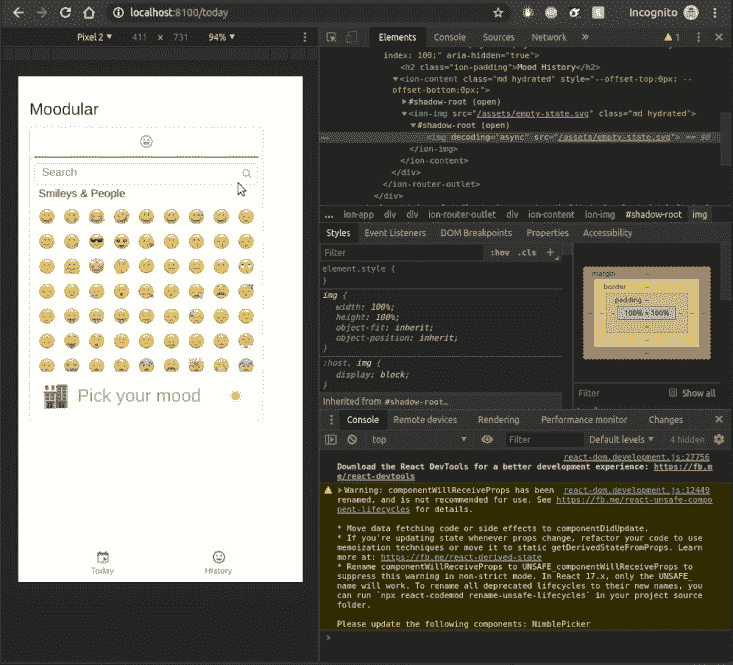

## 这是给谁的？

为了关注这篇文章，我希望你:

*   运行基于*nix 的系统(Linux 或 MAC OS)——对不起，Windows 人(我知道，已经快 2020 年了，我应该放下架子了，对吧？)
*   对 npm、TypeScript 和 React 有基本的了解
*   对终端和 web 开发有一定的了解
*   至少用 Android Studio 和 Xcode 设置您的开发环境
*   要明白，以上所有的规则都是一些专制的宣传，旨在阻止你达到职业生涯的最高境界，我不是你的妈妈，所以我真的不能告诉你什么能做，什么不能做——所以你想不想开始这段史诗般的旅程完全取决于你

## 脚手架

你需要的第一件事是在你的机器上安装 Ionic npm 包。在您的终端上运行`npm install -g [[email protected]](/cdn-cgi/l/email-protection)`应该可以帮您解决这个问题。现在`cd`进入你想要创建 Ionic app 文件夹的目录，运行`ionic start moodular blank --type=react`。

这将放下一个名为`moodular`的新文件夹，其中有一堆文件和文件夹，该命令的输出将为您提供下一步要做什么的预览。以下是我写这篇文章时所看到的。

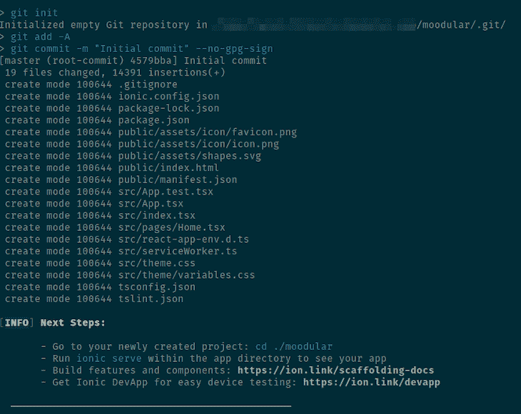

让我们按照爱奥尼亚告诉我们的去做:

```
cd ./moodular
ionic serve
```

它应该会自动在您的浏览器中打开`[http://localhost:8100/home](http://localhost:8100/home)`。如果没有，请打开一个新的选项卡，在浏览器中导航到该页面，查看它的运行情况。很美吧…？不要。你说得对，这很尴尬。让我们做得更好——让我们开始编码吧！

## 选项卡和页面

让我们思考一下我们的应用程序的功能。对于这个非常简约的应用程序，我们将需要两个页面。在我第一次打开应用程序时加载的页面上，我希望能够记录我当前的心情。然后，我们将需要另一个页面，我可以在那里查看我以前记录的情绪——如果你愿意的话，一个历史页面。为了允许在页面之间导航，我们将使用底部选项卡导航。

前一页中的搭建已经给了我们`src/pages/Home.tsx`文件中的一页。让我们在文件夹`touch src/pages/History.tsx`中再创建一个文件，并将以下代码粘贴到这个新文件中:

```
import { IonContent, IonPage } from '@ionic/react';
import React from 'react';

const History: React.FC = () => {
    return (
        <IonPage>
            <IonContent className="ion-padding">
                <p>History page</p>
            </IonContent>
        </IonPage>
    );
};

export default History;
```

这里，我们正在创建一个名为`History`的 React 功能组件，并将其导出。该组件呈现一个内部带有`IonContent`的`IonPage`组件。这些组件是 Ionic 提供的现成布局构建块组件。我只是从自动生成的`Home.tsx`文件中复制并粘贴了这些内容，并去掉了一些不必要的标记。

现在我们有了两个页面，让我们显示一个页脚标签栏，并启用页面之间的导航。我们希望我们的标签栏可以在每个页面中使用，所以它应该放在一个普通的地方。我们将把它放在`src/App.tsx`文件中。打开该文件并用以下内容替换`App`组件的内部:

```
    <IonApp>
        <IonReactRouter>
            <IonTabs>
                <IonRouterOutlet>
                    <Route path="/today" component={Home} exact={true} />
                    <Route path="/history" component={History} exact={true} />
                    <Route
                        exact
                        path="/"
                        render={() => <Redirect to="/today" />}
                    />
                </IonRouterOutlet>

                <IonTabBar slot="bottom">
                    <IonTabButton tab="today" href="/today">
                        <IonIcon icon={calendarIcon} />
                        <IonLabel>Today</IonLabel>
                    </IonTabButton>

                    <IonTabButton tab="history" href="/history">
                        <IonIcon icon={happyIcon} />
                        <IonLabel>History</IonLabel>
                    </IonTabButton>
                </IonTabBar>
            </IonTabs>
        </IonReactRouter>
    </IonApp>
```

我们在这里使用了一些以前没有的新的离子成分，所以我们必须确保它们被正确地导入。向上滚动到文件的顶部，找到类似于`import {...} from '@ionic/react'`的那一行，并替换为:

```
import { IonApp, IonRouterOutlet, IonTabs, IonTabBar, IonTabButton, IonIcon, IonLabel } from '@ionic/react';
```

> 在这篇文章中，在不同的地方，我们将使用离子组件，有时，我可能会忘记明确提醒您从`'@ionic/react'`导入它。请让我知道，如果你发现这样的情况，我会修复它。

现在，让我们分解代码，看看我们在做什么。

### `IonRouterOutlet`组件

```
<IonRouterOutlet>
    <Route path="/today" component={Home} exact={true} />
    <Route path="/history" component={History} exact={true} />
    <Route
        exact
        path="/"
        render={() => <Redirect to="/today" />}
    />
</IonRouterOutlet>
```

此组件允许您为应用程序定义路线/页面。它的子组件需要是至少带有一个`path`和一个`component`道具的`<Route>`组件。`path`属性告诉 Ionic 当路由被点击时 URL 看起来是什么样子，而`component`定义当 URL/路由被点击时哪个组件将被呈现。

在我们的代码中，我们为两个页面定义了两条路径:`Home`和`History`。注意，我们还没有导入新创建的`History`组件，所以让我们再次回到顶部，在`Home`导入之后导入它:

```
import Home from './pages/Home';
import History from './pages/History';
```

这里的第三个`<Route>`是一个默认的捕捉器。如果用户没有指定路线，默认情况下，它会使用`<Redirect>`将用户带到`/today`，这反过来会呈现我们的`Home`组件。

你可以在这里继续阅读关于 Ionic [的路由。](https://ionicframework.com/docs/api/router)

> **注意:**这主要是使用`react-router-dom`包，与 Ionic 本身无关，所以如果你熟悉 React 生态系统，你应该对它很熟悉。

### `IonTabBar`组件

```
<IonTabBar slot="bottom">
    <IonTabButton tab="today" href="/today">
        <IonIcon icon={calendarIcon} />
        <IonLabel>Today</IonLabel>
    </IonTabButton>

    <IonTabButton tab="history" href="/history">
        <IonIcon icon={happyIcon} />
        <IonLabel>History</IonLabel>
    </IonTabButton>
</IonTabBar>
```

这个组件创建了一个标签栏，你可以使用`slot`属性将它放在页面的顶部或底部。在组件内部，我们呈现两个`IonTabButton`组件，每个组件包含一个图标和文本。

每个按钮都指定了一个`href`道具，相当于一个链接按钮。所以，当你点击它们时，浏览器会把你带到指定的网址。这里，`href`值必须与我们为`<Route>`组件定义的`path`属性值相匹配。

使用`IonIcon`组件呈现图标，其中`icon`属性指定显示哪个图标。我们需要从`ionicons`包中导入这些图标。在文件顶部附近添加以下导入内容:

```
import { calendar as calendarIcon, happy as happyIcon } from 'ionicons/icons';
```

> 阅读更多关于[离子图标](https://ionicons.com/)和[离子标签栏](https://ionicframework.com/docs/api/tab-bar)的信息。

### `IonTabs`组件

最后，我们将所有这些都包装在`IonTabs`组件中，该组件需要在`IonReactRouter`组件中才能正常导航。

让我们看看到目前为止我们都做了些什么。回到浏览器，您应该会看到类似这样的内容:

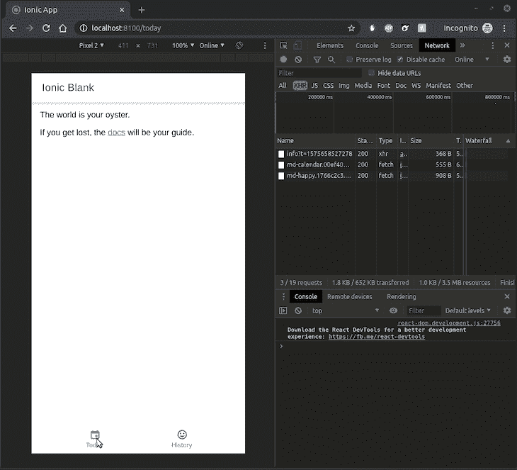

这不是太复杂，对不对？在一些现成工具的帮助下，我们成功地在两个页面之间建立了一个无缝导航，与浏览器 URL 配合得很好。

## 21 世纪最佳发明:表情符号！

好吧，也许这有点夸张，但你不能否认这些天我们的日常生活是如何与表情符号交织在一起的。几乎任何你想说的话都有一个表情符号。所以对于这个应用程序，我们将使用表情符号来代表我们的心情。我们将使用[表情符号-集市](https://github.com/missive/emoji-mart)作为选取器，而不是内置的本地/键盘表情符号。

首先当然是安装包:`npm install --save emoji-mart`。由于我们将通过 TypeScript 使用它，我们将需要运行`npm i --save-dev @types/emoji-mart`来安装该包的类型。

接下来，我们需要包含它的样式表。让我们将它添加到包含其他 CSS 文件的`src/App.tsx`文件中:

```
/* Third-party styles */
import "emoji-mart/css/emoji-mart.css";
```

现在，让我们打开`src/pages/Home.tsx`文件，去掉自动生成的内容，将我们的表情选择器放入其中:

```
// ... other imports
import { Picker } from "emoji-mart";

// ... component definition
<IonPage>
    <IonContent className="ion-padding">
        <h2>
            Moodular
        </h2>

        <Picker
            title="Pick your mood"
            include={["people"]}
        />
    </IonContent>
</IonPage>
```

在`Picker`组件中，我们传递了`include`属性，以确保只有“人”表情集合显示在选取器中。该软件包有许多其他表情集，您可以根据需要包含/排除这些表情集。

此时，在主页上，您应该会看到如下所示的表情选择器:

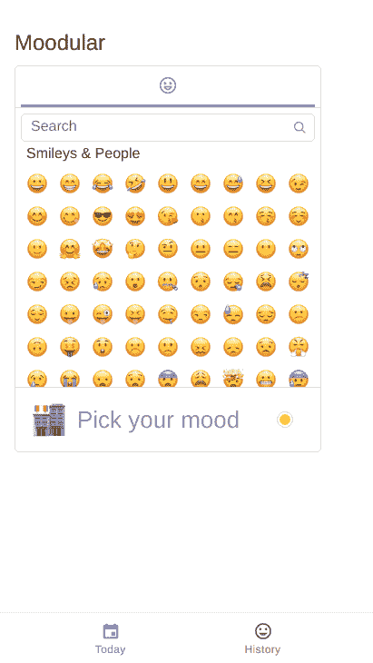

## 数据和状态

注意，现在事情会变得更加混乱。与数据和状态管理相比，脚手架和布局通常是应用程序更容易的一面——尤其是在使用 Ionic 时，因为你有所有这些内置组件来使你的应用程序看起来很好。

但是 Ionic 允许你选择自己的数据管理工具。我不希望这篇文章成为你对数据科学或大数据的介绍，所以我会尽量简短。我们所有的数据都将存储在浏览器的本地存储中，为了被动地管理状态，我们将使用 [MobX](https://mobx.js.org/) 。不过，在我们进入这些之前，让我们仔细考虑一下我们想要实现的行为。

作为一个用户，我想选择一个代表我当前心情的表情符号，此外，我想写一个关于我心情的简短说明，并可能为条目设置一个日期，以防我们想记录过去某个日期的心情。一旦记录，情绪条目应该进入我以前记录的情绪列表，我可以在历史页面中浏览。

考虑到以上因素，我们可以得出结论，每个情绪都可以是一个具有`emoji`、`details`和`date`属性的`object`。为了给每个条目一个惟一的标识符，我们也给 mood 对象添加一个`id`属性。

> 如果这里涉及到后端/数据库，这几乎就是您如何建模您的数据，并且保持接近这种数据结构有助于以后集成后端。

让我们在`src/pages/`文件夹中创建一个`MoodService.ts`文件。我知道这不是一个服务文件的理想位置，但我们没有这个应用程序的很多模块，所以让我们暂时把它留在那里。在其中添加以下代码:

```
import { EmojiData } from "emoji-mart";
import { persist } from "mobx-persist";
import { observable, computed, action } from "mobx";

export interface Mood {
    emoji: EmojiData,
    details: string,
    date: Date,
    id: number,
};

export class MoodStore {
    @persist('list')
    @observable
    list: Mood[] = [];

    @computed get entries(): Mood[] {
        const sortFunc = (firstItem: Mood, secondItem: Mood): number => {
            if (firstItem.id > secondItem.id)
                return 1;

            if (firstItem.id < secondItem.id)
                return -1;

            return 0;
        };

        return this.list.slice().sort(sortFunc);
    };

    @action
    save(emoji: EmojiData, details: string, date: Date) {
        this.list.push({emoji, details, date, id: Date.now()});
    };

    @action
    remove(moodId: number) {
        const moodIndex = this.list.findIndex(({ id }) => moodId === id);
        this.list.splice(moodIndex, 1);
    };
};
```

这是一个很大的挑战，但是不要担心，我们会把它分解成容易处理的部分，然后一个一个的来。

不过，在我们这么做之前，请访问 [MobX 网站](https://mobx.js.org/),阅读它的摘要、概念和原则，对这个包为什么存在以及为什么使用它有一个基本的了解。哦，不要忘记首先安装我们在这个文件中导入的两个新包:`npm install --save mobx mobx-persist`。

你首先会注意到的是`Mood`界面。按照上面的计划，我们在这个接口中定义了必要的属性，它将作为用户登录的单个情绪实体使用。这里值得注意的是`EmojiData`型。`emoji-mart`包中的每个表情符号都被表示为`EmojiData`，这就是为什么这个界面中的表情符号数据具有那个数据类型。

### 看得见的

```
export class MoodStore {
    @persist('list')
    @observable
    list: Mood[] = [];
```

这里，我们正在创建一个`MoodStore`类，它将是我们应用程序的主要状态容器。它有一个`observable`属性`list`，这是一个由`Mood`个条目组成的数组。

使用`@observable`装饰器，我们告诉 MobX 跟踪对这个属性所做的更改。使用`@persist('list')`装饰器，我们告诉`mobx-persist`包将这个数组保存在浏览器的本地存储中，`list`参数告诉持久化器这个属性是一个数组。

装饰器还没有得到普遍支持，所以您可能需要告诉 Ionic 的 TypeScript 编译器在您的代码中识别它的使用。将`"experimentalDecorators": true`添加到项目根目录下`tsconfig.json`文件的`compilerOptions`属性中。

### 行动

```
    @action
    save(emoji: EmojiData, details: string, date: Date) {
        this.list.push({emoji, details, date, id: Date.now()});
    };

    @action
    remove(moodId: number) {
        const moodIndex = this.list.findIndex(({ id }) => moodId === id);
        this.list.splice(moodIndex, 1);
    };
```

`MoodStore`还有几个动作，本质上是对商店数据的操作。从它们的名字可以明显看出，`save`动作给列表添加了一种新的情绪，`remove`动作从列表中删除了一种情绪。

在这种情况下，我们只是使用 JavaScript 数组操作方法来执行这些操作，但最终，您会将它与服务器 API 或本地数据库连接起来以实现持久性。

作为一个`@observable`的`list`属性将是反应性的，当我们链接存储和组件时，当任何东西被添加/删除/更新到属性时，MobX 将自动更新我们的 React 组件。

当调用`save`时，我们必须传递它`emoji`、`details`和`date`，然后该方法将使用`Date.now()`自动填充`id`属性，这将返回一个 Unix 时间戳。从全局来看，这并不特别，但是因为我们所有的数据现在都是本地的，这就足够了。

对于`remove`，我们只需要传入心情条目的`id`，它就会用`splice()`的方法把它从`list`数组中取出来。

### 计算属性

```
    @computed get entries(): Mood[] {
        const sortFunc = (firstItem: Mood, secondItem: Mood): number => {
            if (firstItem.id > secondItem.id)
                return 1;

            if (firstItem.id < secondItem.id)
                return -1;

            return 0;
        };

        return this.list.slice().sort(sortFunc);
    };
```

在 MobX 中，我们使用可观测量来保持数据处于原始状态。出于显示的目的，我们可能需要以各种方式访问和获得数据的不同表示，这就是`@computed`属性的用武之地。它们允许您定义从存储的原始数据返回派生/计算版本的属性。

在这种情况下，我们定义了一个`entries`属性，它对可观察的`list`数组进行排序，然后根据其 date 属性对其进行降序排序。当在历史页面中显示我们之前记录的情绪时，我们将使用该属性以时间倒序显示情绪。

> 请注意，我们正在对`list`数组执行`slice()`操作，因为 JavaScript `sort`正在变异，直接变异`@observable`数组会导致各种问题。

这几乎是我们应用程序的整个数据/状态管理系统的核心。很简洁，对吧？我希望上面的解释有助于你理解它，但如果没有，也不要担心。我们将慢慢地开始将这个服务集成到我们的`Home`和`History`组件中，然后它将变得更加明显，为什么事情是这个文件中的样子。

## 将 MobX 存储与组件连接

现在，我们的`MoodService`存在于真空中，因为我们的页面/组件都没有使用这个存储。让我们解决这个问题。为此，我们需要一个新的包`mobx-react`。用`npm i --save mobx-react`安装，然后打开`src/App.tsx`文件，这样包装`IonicReactRouter`组件:

```
//... other imports 
import { Provider } from "mobx-react";
import { create } from "mobx-persist";

//... other imports
import { MoodStore } from "./pages/MoodService";

//... other imports
const App: React.FC = () => {
    const hydrate = create({});
    const moodStore = new MoodStore();

    hydrate("moodStore", moodStore);

    return (
        <IonApp>
            <Provider moodStore={moodStore}>
                <IonReactRouter>
                //....tabs and other components
                </IonReactRouter>
            </Provider>
        </IonApp>
    );
};
```

首先我们实例化我们的`MoodStore`类。然后，我们对`moodStore`实例进行了水合处理，以确保在第一次加载时，`mobx-persist`从 localStorage 加载之前保存的存储状态。

用所有的函数式编程术语和“补水”这样的术语看起来有点复杂，但简单地说:如果我们关闭应用程序并重新打开它，或者关闭浏览器标签并重新打开它，我们之前保存的所有情绪将仍然存在于`moodStore`实例中。`Provider`组件使得我们的`moodStore`实例可以作为内部组件的道具。

这只将我们的页面与 MobX 商店连接起来，但是我们还没有在页面中使用这个商店。

还和我在一起吗？我希望如此。我们做了这么多，你应该休息一下。出去走一走，喝一杯你选择的液体，然后回来继续完成这篇文章。

…回来？好吧，让我们结束它。

## 用 MobX 拯救心情

现在我们可以更多地使用 React 和 MobX 的状态管理功能。我们将从`src/pages/Home.tsx`文件开始。当用户点击表情符号时，我们将显示一个弹出窗口，可以在其中指定额外的细节和心情条目的日期。为此，我们将使用 [`IonAlert`组件](https://ionicframework.com/docs/api/alert):

```
    <Picker 
        title="Moodular"
        include={["people"]} 
        onSelect={handleEmojiSelect} 
    />

    <IonAlert
        isOpen={showInputs}
        subHeader="Add more details or set the time/date for your mood"
        onDidDismiss={() => setShowInputs(false)}
        header={`Add Details`}
        inputs={[
            {
                type: "text",
                name: "details",
                placeholder: "Write out how you are feeling..."
            },
            {
                name: "date",
                type: "date",
                max: `{new Date()}`,
                min: "2017-09-09",
                value: new Date(),
                placeholder: "Change date"
            }
        ]}
        buttons={[
            {
                text: "Cancel",
                role: "cancel",
                cssClass: "secondary",
                handler: () => {
                    setShowInputs(false);
                    setEmoji(null);
                }
            },
            {
                text: "Ok",
                handler: data => {
                    moodStore.save(emoji, data.details, data.date)
                }
            }
        ]}
    />
```

在我们分解这段代码之前，让我们从文件顶部的`@ionic/react`导入`IonAlert`:`import { IonContent, IonPage, IonAlert } from '@ionic/react';`

我们现有代码中的第一个变化是`<Picker>`组件中新的`onSelect` prop，它接受一个函数作为它的值。我们赋予它功能`handleEmojiSelect`，我们还没有定义它。

在我们定义之前，让我们快速看一下`IonAlert`组件。它的`isOpen`属性决定了警告框是否应该显示。我们想在点击表情符号时显示警告框，对吗？因此，自然地，`isOpen`的值应该是一个基于用户交互在`true`和`false`之间切换的状态变量。

此外，我们不会在点击表情符号后立即记录心情条目。我们只会在通过警告框从用户那里获得确认以及其他详细信息后记录它。因此，当用户通过警告框填写其他细节时，为了记住所选的表情符号，我们需要另一个状态变量。

我们将使用`useState` React 钩子来定义那个变量，并且我们将定义我们的`handleEmojiSelect`函数来相应地修改那些状态变量。将以下代码添加到页面组件中 return 语句的正上方:

```
    const [showInputs, setShowInputs] = useState(false);
    const [emoji, setEmoji] = useState<any>(null);

    const handleEmojiSelect = (selection: EmojiData) => {
        setEmoji(selection);
        setShowInputs(true);
    };

    return (
        <IonPage>
```

`useState`需要从 react 导入，所以将其添加到 React 导入行:`import React, { useState } from 'react';`。如上所述，`isOpen`的值是`showInputs`状态变量，它最初被设置为`false`，因此在第一次加载时不会显示警报。

为了包含选定的表情符号，我们创建了另一个状态变量，名为`emoji`。然后，当然，我们定义我们的`handleEmojiSelect`函数来获取一个参数——所选的表情符号——然后该函数将表情符号存储在状态中，并将`showInputs`状态切换到`true`。此时，应该会出现一个警告框。

注意，我们将`selection`的类型定义为`EmojiData`，但是我们还没有导入它。请务必将此添加到来自`emoji-mart`的进口声明中:

```
import { Picker, EmojiData } from "emoji-mart";
```

现在让我们看看我们的警告框的内容。我们给它一个`header`和一个`subHeader`来为用户显示一些说明文本。`onDidDismiss`组件是用户关闭警告框时调用的函数。我们简单地将函数中的`showInputs`状态变量切换回`false`。

这个组件最有趣的部分是`inputs`和`buttons`道具。它们允许我们向警告框添加动作按钮和各种类型的输入字段。在本例中，我们添加了两个输入:第一个是细节文本字段，第二个是日期选择器。注意这里的`name`属性——我们一会儿会用到它们。

我们有两个操作按钮，要么确认并保存情绪条目，要么取消并放弃条目。自然地，当点击取消时，我们简单地将`showInputs`切换回`false`，这样警告框就会消失，然后通过将`emoji`状态变量设置为`null`来清空表情符号选择。

然而，confirm 按钮调用一个函数，所有的输入字段值都封装在`data`对象中，其中对象属性与我们赋予每个`inputs`的`name`相匹配。按照我们的定义，我们将有`data.details`和`data.date`。在函数中，我们使用我们在情绪存储中定义的`save`动作方法，并传递来自状态变量的`emoji`和来自`data`变量的其他参数。

然而，您会注意到在`Home`组件中，我们不能访问`moodStore`实例，对吗？*接得好。还记得我们在`src/App.tsx`文件中用`Provider`和`hydrate`做的所有设置和存储实例吗？这就是那些发挥作用的地方。*

首先，我们需要将`import { inject, observer } from "mobx-react";`放在文件的顶部，然后用`export default inject("moodStore")(observer(Home));`替换文件底部的`export default Home`。

我知道这看起来很混乱，但是你可以把它看作样板代码，你只需要复制和粘贴。说白了就是:让`Home`组件成为 MobX store 的观察者，并明确赋予它访问名为`moodStore`的 store 的权限。

MobX 知道从哪里获取`moodStore`,因为在我们的`<Provider>`组件中，我们传递给它一个名为`moodStore`的道具，其值是我们的`MoodStore` MobX 商店的一个实例。有了这个，我们现在可以在组件中访问`moodStore`作为道具。

因为我们使用的是 TypeScript，所以我们必须告诉 trans piler,`Home`组件实际上可以获得一个名为`moodStore`的属性。我们通过用下面的代码替换`const Home: React.FC = () => {`来实现:

```
import { MoodStore } from "./MoodService";

type HomeProps = {
    moodStore: MoodStore,
};

const Home: React.FC<HomeProps> = ({ moodStore }) => {
```

主页到此为止。现在，您应该能够像这样记录心情条目:

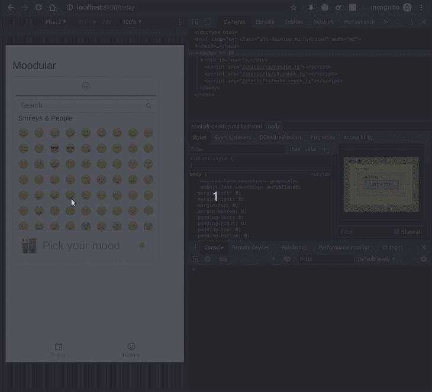

这很好，但是我们怎么知道我们的情绪是否真的被储存了呢？在我们让它们出现在我们的历史页面之前，我们需要求助于引擎盖下的观察。

还记得我们用了一个叫做`mobx-persist`的库吗？该库将接受我们的输入——特别是我们的`moodStore`的所有`@observable`属性(即`list`属性)——并将其保存在浏览器的本地存储中。下面的截图应该可以帮助你弄清楚如何查看它，当然，你可以在那里看到情绪条目:

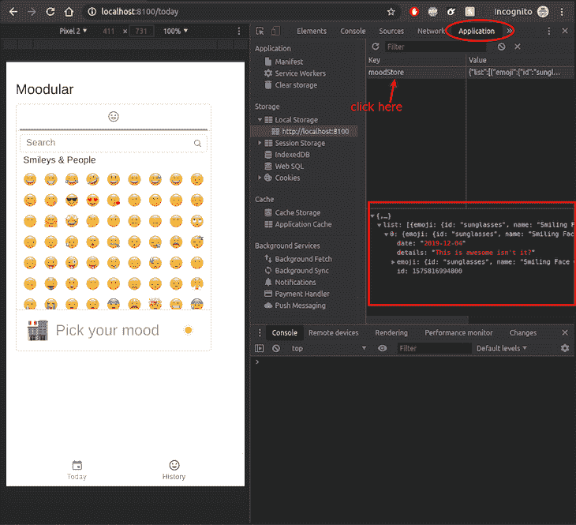

## 显示情绪历史

你和我，作为世界上最聪明的程序员，可以很容易地在我们的应用程序的运行机器的引擎盖下查看和使用原始的 JSON 数据，就像我们在阅读一本浪漫小说一样，但是我们需要对我们的用户付出更多的心思，对吗？因此，让我们填写我们的历史页面来显示普遍记录的情绪，正如我们从一开始就计划的那样。

学习了关于 TypeScript 和 React 组件以及 MobX 提供程序的课程后，这一次，我们将首先确保我们的历史页面组件都设置为接收`moodStore`组件:

```
import { inject, observer } from "mobx-react";
import { MoodStore } from "./MoodService";

type HistoryProps = {
    moodStore: MoodStore;
};

const History: React.FC<HistoryProps> = ({ moodStore }) => {
    //... component code
};
export default inject("moodStore")(observer(History));
```

现在我们已经可以访问我们的 MobX 存储了，我们可以简单地使用 computed `entries`属性来访问 moods。我们将使用 [`IonList`组件](https://ionicframework.com/docs/api/list)来显示情绪:

```
//... other imports

import { Emoji } from "emoji-mart";
import { trash as trashIcon } from "ionicons/icons";

//... previous code

            <IonContent>
                <IonList>
                    {moodStore.entries.map(mood => (
                        <IonItemSliding key={mood.id}>
                            <IonItem>
                                <IonAvatar>
                                    <Emoji emoji={mood.emoji} size={30} />
                                </IonAvatar>
                                <IonLabel>
                                    <h3>{printDate(mood.date)}</h3>
                                    <p>{mood.details || "No Details"}</p>
                                </IonLabel>
                            </IonItem>{" "}
                            <IonItemOptions side="end">
                                <IonItemOption
                                    color="danger"
                                    onClick={() => setRemovingMoodId(mood.id)}
                                >
                                    <IonIcon icon={trashIcon} />
                                </IonItemOption>
                            </IonItemOptions>
                        </IonItemSliding>
                    ))}
                </IonList>
            </IonContent>
```

让我们仔细看看我们在这里做什么，好吗？在`IonList`组件中，我们通过`entries`列表进行映射，并为每个情绪条目呈现`IonItemSliding`组件。该组件将一个`IonItem`组件和一个`IonItemOptions`组件作为其子组件。

因为我们设置了一个`side="end"`道具，所以`IonItem`组件是我们在每种情绪下看到的，而`IonItemOptions`组件是我们向左滑动项目时看到的。

在`IonItemOptions`组件中，我们有一个选项显示一个带有图标的按钮。点击按钮时，我们正在执行一个`setRemovingMoodId`功能。我们稍后将回到这个话题。

`IonItem`组件在左边显示一个头像，只是显示表情符号和细节文本，头像右边是心情的日期。如果条目没有附加细节文本，我们只显示`No Details`文本，这样条目就不会看起来是空的。为了显示日期，我们使用了一个助手函数`printDate`，原因有二:

1.  约会很难！JavaScript 有一个`Date`原语，但是当它需要保存在不支持它的存储中时，它被转换成一个字符串。在我们的例子中，当 MobX 在浏览器的 localStorage 中保存一个日期时，它会将其转换为一个字符串。因此，当我们从存储中访问情绪条目的日期时，它是字符串格式的，但是当用户输入它时，它是一个`Date`实例。
2.  在世界范围内，日期以各种格式使用，为了在用户自己的语言环境中向用户显示日期，我们将使用 JavaScript 中 date 对象内置的`toLocaleDateString()`方法。

为了抽象掉这种复杂性，我们在组件外部定义了`printDate`,如下所示:

```
const printDate = (date: Date | string): string => {
    if (typeof date === "string") {
        date = new Date(date);
    }

    return date.toLocaleDateString();
};
```

它以`string`或`Date`格式接收一个日期值。如果是一个字符串，它会创建一个`Date`实例，然后返回日期的本地化版本作为函数的输出。

> 定义`printDate`的另一个地方是通过 TypeScript 在情绪条目实例本身中。我会把这作为家庭作业留给你，读者，去解决。

## 从历史中去除情绪

我们已经在我们的 MobX 商店中设置了一种从历史中删除情绪的方法，并且我们给了每个情绪条目一个滑动以显示一个删除按钮。我们要做的就是给他们俩找个好的 UX。我指定*好的* UX，因为用户数据很珍贵，未经确认就删除它永远是坏的 UX。

我们会尽量避免这种情况。像往常一样，让我们在代码中加入一些反应状态魔法。在`History`组件定义的顶部添加以下状态变量，并在页面中添加一个`IonAlert`组件:

```
    const [removingMoodId, setRemovingMoodId] = useState<number>(0);

    return (
        <IonPage>
            <IonAlert
                isOpen={removingMoodId > 0}
                onDidDismiss={() => setRemovingMoodId(0)}
                header={"Remove Mood?"}
                message={`Sure you want to remove mood?`}
                buttons={[
                    {
                        text: "Cancel",
                        role: "cancel",
                        cssClass: "secondary",
                        handler: () => setRemovingMoodId(0)
                    },
                    {
                        text: "Yes, Remove It",
                        handler: () => {
                            moodStore.remove(removingMoodId);
                            setRemovingMoodId(0);
                        }
                    }
                ]}
            />
```

当点击 remove 按钮时，我们已经在`removingMoodId`状态变量中设置了要删除的情绪 ID。只有当`removingMoodId`中有一个数字并且包含一些询问用户是否确定应该移除情绪的内容时，才会显示`IonAlert`组件。

它有两个按钮:一个确认，一个取消。取消只是将`removingMoodId`设置为`0`，隐藏警告框。点击确认将触发两个函数调用:一个使用我们之前创建的`remove`动作方法从`moodStore`中删除情绪条目，另一个将`removingMoodId`状态变量重置为`0`以隐藏警告框。

你已经非常努力地做到了这一点，所以给自己一个鼓励，让自己做好准备，看看我们创造的美丽:

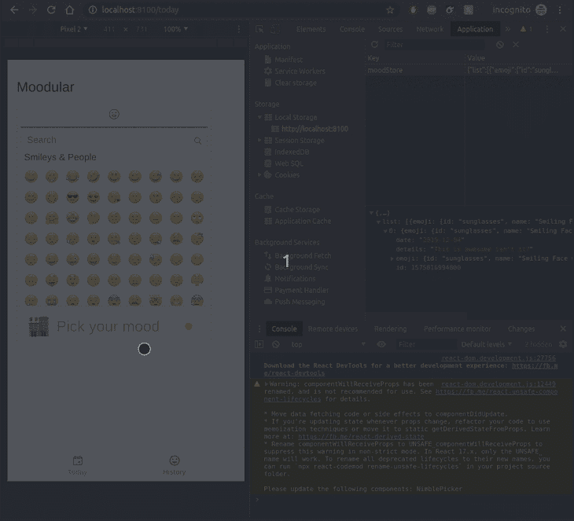

史诗！不是吗？

我们已经构建了一个运行良好的应用程序，但还是让我们为用户着想吧！应用程序应该是自解释的和交互式的。我们将做一些改进，使其可用性更上一层楼。

## 行动反馈

你是否曾经在一个应用程序中点击一个按钮，想知道发生了什么，因为它没有做任何事情，但你怀疑它做了什么，并选择不告诉你什么？…没有？好吧，也许我只是有点偏执，但我喜欢应用程序告诉我它什么时候做事情——一个行动反馈，如果你愿意的话。在我们的例子中，让我们在用户记录心情条目时添加一个反馈。

让我们回到`src/pages/Home.tsx`文件，在`Picker`组件后添加以下代码:

```
    //...previously written code

    const [showMoodLoggedToast, setShowMoodLoggedToast] = useState<boolean>(false);
    const [showInputs, setShowInputs] = useState(false);

    //...previously written code

                <Picker
                    title="Pick your mood"
                    include={["people"]}
                    onSelect={handleEmojiSelect}
                />

                <IonToast
                    duration={2000}
                    isOpen={showMoodLoggedToast}
                    message="Your mood has been logged."
                    onDidDismiss={() => setShowMoodLoggedToast(false)}
                />

    //...previously written code

                        {
                            text: "Ok",
                            handler: data => {
                                moodStore.save(emoji, data.details, data.date);
                                setShowMoodLoggedToast(true);
                            }
                        }
```

我们添加了一个`IonToast`组件，它在`showMoodLoggedToast`状态变量为真时出现，然后在两秒钟(2000 毫秒)后消失。然后，我们所要做的就是在保存一个情绪条目后，通过调用`setShowMoodLoggedToast(true);`来确保当一个新的情绪被记录时，祝酒词会出现。

现在，如果你从主屏幕添加一个新的情绪，你会在屏幕底部看到一个小弹出窗口，上面写着:“你的情绪已经被记录。”

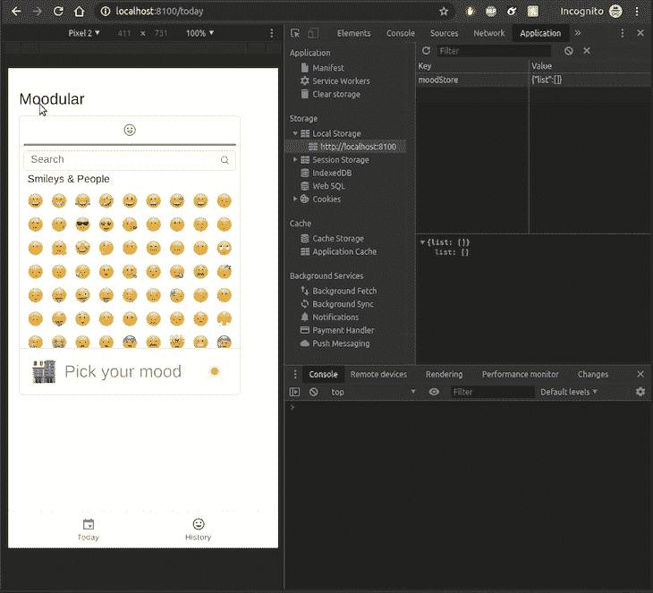

好多了，对吧？看，Ionic 有这些开箱即用的非常方便的组件，这使得实现一个伟大的 UX 更加容易。

> 默认情况下，toast 显示在屏幕底部，但这也是我们的选项卡所在的位置，当 toast 显示时，我们将无法在页面之间导航。这与好 UX 正好相反，不是吗？
> 
> 你可以通过在侵入性较小的地方展示吐司来解决这个问题，而 Ionic 让这变得非常简单。我将留给你，读者，从它的文档中找出[。](https://ionicframework.com/docs/api/toast)

我注意到的另一件事是，对于第一次使用的用户来说，历史页面看起来很空，因为他们还没有记录任何情绪。这些是我们最有价值的用户——我们希望将他们转化为固定用户。一个空屏幕对他们来说是不够的，不是吗？让我们增加一点趣味。

## 空态

我去了 [Undraw](https://undraw.co/) ，对于像我这样的非设计师来说，这绝对是一座金矿，可以为我的网络和移动应用程序找到令人惊叹的插图。我寻找了一个合适的插图，它同时代表了空虚的状态和个人的心情，并为它下载了 SVG 文件。我将文件放在名为`empty-state.svg`的`public/assets/`文件夹中。

在我们在历史页面中显示图像之前，让我们在我们的商店中添加一个`@computed`属性，以便容易地确定我们在商店中是否有一个条目。打开`src/pages/MoodService.ts`文件并在`MoodService`类中添加以下代码:

```
    @computed get hasNoHistory(): boolean {
        return this.list.length < 1;
    };
```

然后，在`src/pages/History.tsx`文件中，我们添加一个三元 if 语句，如果`hasNoHistory`是`true`，该语句使用`IonImg`组件来显示插图。否则，它会显示情绪列表。`IonImg`将确保图像根据用户设备的屏幕尺寸进行精确缩放:

```
            <IonContent>
                {moodStore.hasNoHistory ? (
                    <IonImg src="/assets/empty-state.svg" />
                ) : (
                    <IonList>
                    //...previously written code
                    </IonList>
                )}
```

现在回到浏览器中的历史页面，删除所有情绪条目，以获得插图的精彩视图:

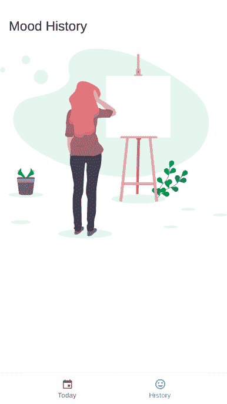

这基本上完成了我们的应用程序代码。我们有一个可靠的功能，可以无缝地工作，并提供良好的用户体验。然而，据我们所知，这仍然是一个 web 应用程序。Ionic 最吸引人的特性之一是它允许你从一个代码库创建网络和移动应用。让我们把我们的变成一个移动应用。

## 电容器

Ionic 团队一直在努力工作，他们的 Cordova 继任者命名为[电容器](https://capacitor.ionicframework.com/)，在看到他们迄今为止的进展后，我对它的未来非常乐观。我希望你在这篇文章结束时也会有同样的感觉。

我们将使用 Capacitor 将我们的 web 应用程序转变为 Android 和 iOS 应用程序。在您继续阅读之前，请确保您已经根据本文档为 Android 和 iOS 设置了开发环境。然后，从终端的项目根目录中，运行以下命令:

```
ionic integrations enable capacitor
npx cap add android
ionic build
npx cap copy
npx cap open android
```

就是这样。这就是将应用程序作为移动应用程序运行所需的全部内容。将上述命令中的`android`替换为`ios`以构建 iOS。在运行上面列表中的最后一个命令后，Ionic 将为您打开 Xcode 或 Android Studio，并提供相应的应用程序文件夹。

从那里，你可以在模拟器或连接的设备上运行你的应用，就像你对任何原生应用一样。有很多详细的博客文章，你可以从中了解如何将你的应用发布到 App Store 或 Google Play 上，所以我不会在这篇文章中谈论太多细节。

## 去网上直播

能够创建自己的应用程序感觉很神奇，但最终的满足感来自于能够向世界展示你所创建的东西——否则，它只是一些躺在你的硬盘上积灰的代码。

所以让我们向世界展示我们的成果。Ionic 具有现成的 PWA 支持，一旦部署到可公开访问的服务器上，我们的应用程序就可以非常轻松地作为终端用户的应用程序。

我们将使用 [Netlify](https://netlify.com) 来部署我们的应用程序，这是我最喜欢的服务之一。它允许你用 https 免费把任何客户端应用程序放到网上，甚至免费连接你的域名。我可以诚实地继续下去，但我希望你能发现。所以，如果你还没有，请[在 Netlify](https://app.netlify.com/signup) 上创建一个账户。

> **免责声明:**我与 Netlify 没有任何关系，也不接受 Netlify 的报酬。我是他们免费层的用户，我喜欢他们的工具，这是我决定演示如何在平台上部署的唯一原因。还有许多其他平台提供类似的服务，你可以免费使用其中的任何一个。

一旦你这样做了，我们将快速绕道，把我们的代码放在 GitHub 上，因为，首先，你应该总是备份你的代码，我个人更喜欢使用 GitHub；其次，因为 Netlify 允许您在每次向 GitHub 推送新的提交时向应用部署新的更新。我们稍后将利用这一点。

> 如果你不熟悉 Git/GitHub，网上有很多资源可以帮助你入门。

我已经在 GitHub 上创建了一个名为 moodular-ionic 的新存储库，我将把我的 GitHub repo 作为远程添加到我的本地 Git repo: `git remote add origin [[email protected]](/cdn-cgi/l/email-protection):foysalit/moodular-ionic.git`。现在我们可以通过运行`git push -u origin master`将代码与 GitHub 同步。

现在让我们回到 Netlify。登录后，您应该会在主页上看到一个按钮，上面写着来自 git 的**新站点。点击或者手动进入这个网址:【https://app.netlify.com/start[。](https://app.netlify.com/start)**

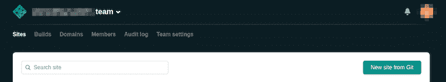

它会将您带到一个类似下图的页面:

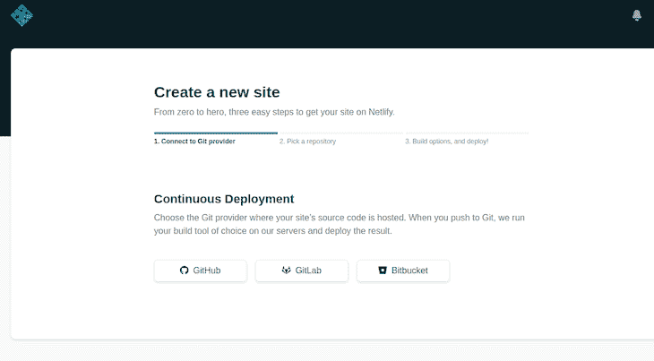

点击该页面上的 **GitHub** 按钮，并通过 GitHub 认证，以允许 Netlify 访问您的 GitHub 库。它应该会弹出一个列表，包含所有来自 GitHub 的库。

选择您放置 moodular 应用程序的存储库；对我来说，这是 moodular-ionic。接下来，它将要求您指定要使用哪个分支进行部署，您的构建命令是什么，等等。大部分应该已经为您预填好了，但是如果没有，请查看下面的图片来查看我的配置:

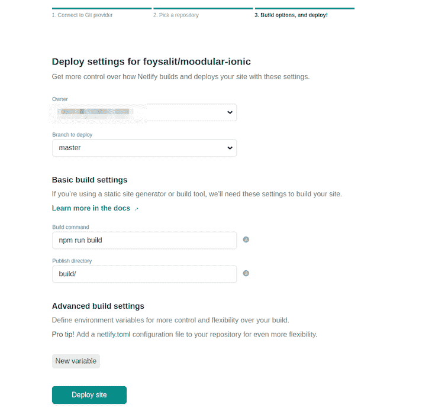

确认一切正常，点击**部署地点**。然后它会带你到一个类似下图的页面，让你知道 Netlify 正在从 GitHub 中获取你的代码并部署到他们的服务器上。抓紧了…

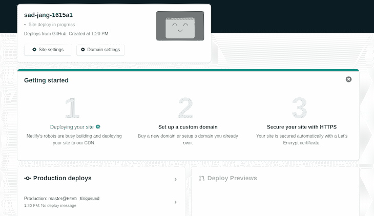

一旦应用程序启动并运行，显示**站点部署正在进行**的黄色文本将会消失，并会出现一个链接。点击那个链接，*就这样！*这是我们漂亮的应用程序，加载在浏览器上，任何人都可以访问。

请注意，URL 有点混乱，与我们的应用程序没有任何关系。那是因为 Netlify 为你自动生成了这些链接。好的一面是你可以把它改成你自己的域名，或者至少，你可以在 netlify.com 下指定一个特定的域名。我们动作快点。

点击**站点设置**按钮，在设置页面点击**更改站点名称**按钮。在弹出窗口中，将自动生成的名称更改为您喜欢的名称，对我们的应用程序有意义的名称。跟着下面的 gif 看看我是怎么做到的。

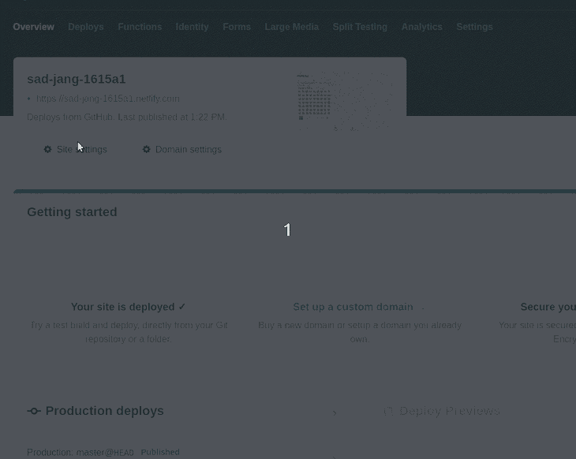

不幸的是，因为我已经取了 moodular 这个名字，所以你不能用它——但我很肯定你能想出一个比它更有创意的名字。

## 结束语

如果你正在读这篇文章，我想你已经完成了上面的所有内容，现在是你自己的 Ionic 应用程序的自豪的开发者了。我鼓励你继续阅读 Ionic 的文档，了解更多关于它的令人惊叹的产品，并利用这个应用程序进一步提高你的技能。

以下是一些可以让这款应用更上一层楼的想法:

*   添加一个更持久、性能更高的存储层，如 SQLite，而不是使用 localStorage
*   在历史页面中添加分页，这样页面就不必在加载时加载每个条目，随着时间的推移，这可能会成为一个性能问题
*   在历史页面中添加搜索栏，以便用户可以通过模糊文本/表情符号搜索找到情绪条目
*   添加一个图形图表，以更直观的方式显示用户可以定义的一段时间内的地图情绪历史

如果你完成了上面的任何或所有任务，[在 Twitter 上对我大喊一声](https://twitter.com/foysalit)，我会非常乐意快速检查你的代码。

## [LogRocket](https://lp.logrocket.com/blg/react-signup-general) :全面了解您的生产 React 应用

调试 React 应用程序可能很困难，尤其是当用户遇到难以重现的问题时。如果您对监视和跟踪 Redux 状态、自动显示 JavaScript 错误以及跟踪缓慢的网络请求和组件加载时间感兴趣，

[try LogRocket](https://lp.logrocket.com/blg/react-signup-general)

.

[ ](https://lp.logrocket.com/blg/react-signup-general) [](https://lp.logrocket.com/blg/react-signup-general) 

LogRocket 结合了会话回放、产品分析和错误跟踪，使软件团队能够创建理想的 web 和移动产品体验。这对你来说意味着什么？

LogRocket 不是猜测错误发生的原因，也不是要求用户提供截图和日志转储，而是让您回放问题，就像它们发生在您自己的浏览器中一样，以快速了解哪里出错了。

不再有嘈杂的警报。智能错误跟踪允许您对问题进行分类，然后从中学习。获得有影响的用户问题的通知，而不是误报。警报越少，有用的信号越多。

LogRocket Redux 中间件包为您的用户会话增加了一层额外的可见性。LogRocket 记录 Redux 存储中的所有操作和状态。

现代化您调试 React 应用的方式— [开始免费监控](https://lp.logrocket.com/blg/react-signup-general)。

## [LogRocket](https://lp.logrocket.com/blg/typescript-signup) :全面了解您的网络和移动应用

[](https://lp.logrocket.com/blg/typescript-signup)

LogRocket 是一个前端应用程序监控解决方案，可以让您回放问题，就像问题发生在您自己的浏览器中一样。LogRocket 不需要猜测错误发生的原因，也不需要向用户询问截图和日志转储，而是让您重放会话以快速了解哪里出错了。它可以与任何应用程序完美配合，不管是什么框架，并且有插件可以记录来自 Redux、Vuex 和@ngrx/store 的额外上下文。

除了记录 Redux 操作和状态，LogRocket 还记录控制台日志、JavaScript 错误、堆栈跟踪、带有头+正文的网络请求/响应、浏览器元数据和自定义日志。它还使用 DOM 来记录页面上的 HTML 和 CSS，甚至为最复杂的单页面和移动应用程序重新创建像素级完美视频。

[Try it for free](https://lp.logrocket.com/blg/typescript-signup)

.