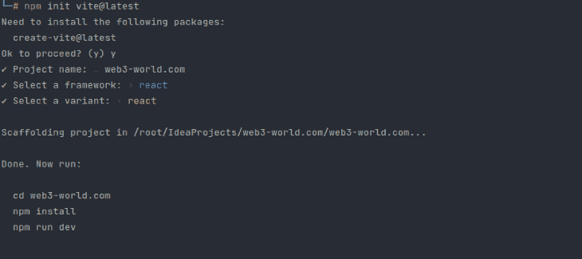
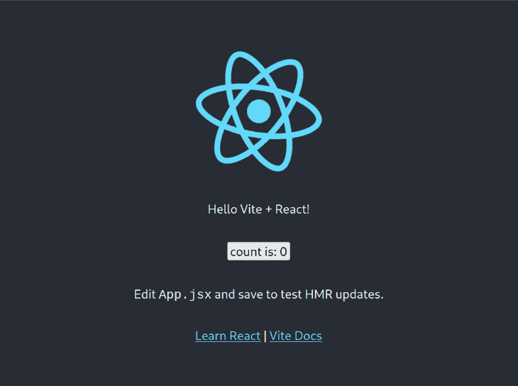
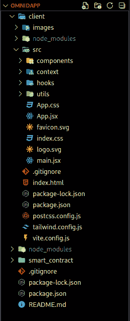
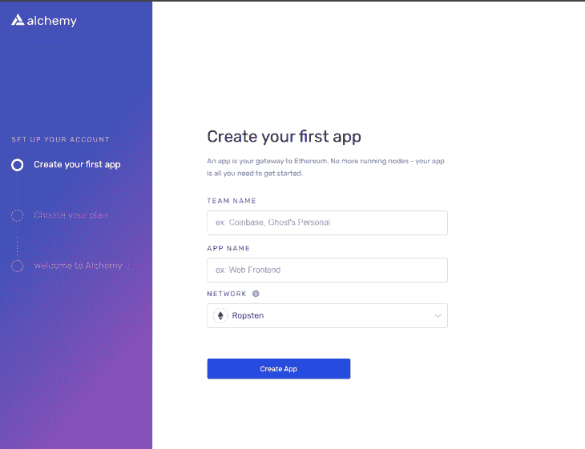

# 带有 Vite + React、Tailwind CSS 和 Solidity 的全栈 DApp 教程

> 原文：<https://blog.logrocket.com/full-stack-dapp-tutorial-vite-react-tailwind-css-solidity/>

在本教程中，我们将演示如何构建一个全栈 DApp，在 Ropsten testnet 上测试它，并使用 Alchemy Web3 开发平台部署它。我们将使用 Vite、React 和 Tailwind CSS 来构建 DApp 前端，使用 Solidity 来创建后端。

*向前跳转:*

## 先决条件

要跟随本文的演示，您需要以下内容:

*   使用 React 和 CSS 构建前端 ui 的工作知识
*   熟悉顺风 CSS、Vite、VS 代码和 npm
*   对 Solidity 语言语法的基本理解
*   熟悉以太坊生态系统

此外，拥有以下 VS 代码扩展也很有帮助:

## 入门指南

我们将首先创建一个以我们的目标项目命名的文件夹。然后，我们将在 VS 代码中打开该文件夹。您可以使用自己选择的代码编辑器。

现在，我们将创建两个文件夹，`client`和`smart_contract`，然后在终端上导航到`client`文件夹。

## 搭建项目

我们将使用 [Vite](https://vitejs.dev) 为 React 应用程序创建一个支架。这个名副其实的构建工具(Vite 是法语中 quick 的意思)帮助开发人员快速、轻松地搭建 web 项目。

用 npm 安装 Vite，就像这样:

```
$ npm create [email protected]

```

接下来，运行以下命令来初始化项目的脚手架，并允许安装`[[email protected]](/cdn-cgi/l/email-protection)`:

```
$ npm init [email protected]

```

当脚手架创建完成时，您将在终端中看到请求项目细节的输出。

选择一个项目名，然后选择一个包名。这个演示使用`web3-world.com`作为项目和包的名称。

接下来，为框架和变体选择`React`。

您应该会在屏幕上看到以下内容:



这将为项目创建以下文件:

*   `index.html`
*   `package.json`
*   `src`文件夹
*   `vite.config.js`

接下来，运行以下命令:

```
$ npm install
$ npm run dev

```

这段代码将把项目部署为可在指定的本地网络上访问的 React 应用程序。如果我们导航到 [localhost](http://localhost) 上的端口，我们应该看到以下内容:



我们可以用`Ctrl + C`命令阻止终端托管服务器。

接下来，我们将导航到`smart_contract`目录并运行以下命令:

```
$ npm init -y

```

这为我们的`smart_contract`文件夹创建了一个`package.json`文件。

现在，我们将使用 npm 来安装 Tailwind CSS。我们将使用 create-react-app 将 Tailwind 添加到 React 项目中。为此，我们只需遵循[顺风文档](https://tailwindcss.com/docs/guides/create-react-app)中概述的四个步骤。

然后，我们将在`client`文件夹中安装 Tailwind，就像这样:

```
$ npm install -D tailwindcss postcss autoprefixer
$ npx tailwindcss init -p

```

运行这些命令后，我们可以确认两个文件被添加到了我们的项目文件夹中:一个 Tailwind CSS 配置文件和一个 PostCSS 配置文件。

现在，我们将删除项目的`tailwind.config.js`文件的内容，并用文档页面上的`tailwind.config`文件的内容替换它们:

```
module.exports = {

 content: [

   "./src/**/*.{js,jsx,ts,tsx}",

 ],

 theme: {

   extend: {},

 },

 plugins: [],

}

```

接下来，我们将用文档页面上显示的指令替换项目的`index.css`文件副本的内容:

```
@tailwind base;
@tailwind components;
@tailwind utilities;

```

## 构建 DApp 用户界面

现在，让我们开始构建应用程序的前端。

我们首先在`src`文件夹中创建一个名为 components 的新文件夹。在那里，我们将为我们的项目创建仪表板组件:

*   `Navigation_bar.jsx`
*   `Footer.jsx`
*   `Loader.jsx`
*   `Services.jsx`
*   `Welcome.jsx`
*   `Transactions.jsx`

这些组件将分别包含以下代码，用各自的名称替换`Component_name`:

```
const Component_name = () => {
    return (
    <h1>Component_name</h1>
    );
}

export default Component_name;

```

我们将使用以下代码创建一个`index.js`文件来导出所有这些组件:

```
export { default as Loader } from './Loader';
export { default as Navbar } from './Navbar';
export { default as Footer } from './Footer';
export { default as Welcome } from './Welcome';
export { default as Services } from './Services';
export { default as Transactions } from './Transactions';

```

接下来，我们将重点关注客户端 UI。我们现在主要处理这三个文件和文件夹:

*   包含我们想要的前端样式
*   文件夹:它位于客户端文件夹下，包含我们想要的图像
*   文件夹:包含我们的仪表板元素，就像上面列出的那些

现在，我们将安装`react-icons`和`ethers`包。`ethers`包将使我们有可能与智能合同互动。

```
$ npm install react-icons ethers

```

如果我们在安装之后运行应用程序，我们应该会看到新的变化。

## 使用 Hardhat 构建智能合同

[Hardhat](https://hardhat.org) 是一个以太坊开发环境，用来在本地运行 Solidity 代码。

在 smart_contracts 文件夹中运行以下命令，在本地计算机上安装 Hardhat:

```
npm install --save-dev hardhat @nomiclabs/hardhat-waffle ethereum-waffle chai @nomiclabs/hardhat-ethers ethers

```

该命令安装使用 Hardhat 开发生态系统所需的依赖项。您会注意到代码库中有新的文件夹和文件。要测试这些功能是否正常工作，请运行以下命令:

```
npx hardhat test

```

这将编译 Solidity 源文件，该文件现在位于主项目目录的`contracts`文件夹中。它将部署 Solidity 文件并测试它是否成功运行。

为了构建我们的 DApp 的后端，我们将把我们的 Solidity 代码添加到`contracts`文件夹中，并删除`Greeter.sol`文件。

接下来，我们将创建一个 Transactions.sol 文件，并输入以下代码:

```
// SPDX-License-Identifier: UNLICENSED
pragma solidity ^0.8.0;

// contract name is conventionally the same as file name
contract Transactions {
    //transactionCounter holds the number of our transactions
    uint256 transactionCounter;
    // we  will call the event later on
    event Transfer(address from, address receiver, uint amount, string message, uint256 timestamp, string keyword);

    // struct will hold all above object properties
    struct TransferStructure {
        address sender;
        address receiver;
        uint amount;
        string message;
        uint256 timestamp;
        string keyword;
    }

    // create an array to store transactions with above objects as fields
    TransferStructure[] transactions;

    function addToBlockchain(address payable receiver, uint amount, string memory message, string memory keyword) public {
        transactionCounter += 1;
        transactions.push(TransferStructure(msg.sender, receiver, amount, message, block.timestamp, keyword));

        emit Transfer(msg.sender, receiver, amount, message, block.timestamp, keyword);
    }

    function getAllTransactions() public view returns (TransferStructure[] memory) {
        return transactions;
    }

    function getTransactionCount() public view returns (uint256) {
        return transactionCounter;
    }
}

```

至此，整个后端就完成了！

现在，我们可以继续测试，然后部署。在`scripts`文件夹中，有一个`sample-script.js`，我们可以将它转换成一个`deploy-script.js`脚本。

我们将使用以下内容作为`deploy-script.js`脚本的内容:

```
const main = async () => {

  // We get the contract to deploy
  const Transactions = await hre.ethers.getContractFactory("Transactions");
  const transactions = await Transactions.deploy();

  await transactions.deployed();

  console.log("Transactions deployed to:", transactions.address);
}

const runMain = async () => {
  try {
    await main();
    process.exit(0);
  } catch (error) {
    console.error(error);
    process.exit(1);
  }
}

runMain(); 

```

您应该有一个类似如下的项目结构:



## 使用 Ropsten testnet 测试智能合约

项目构建现在已经完成，部署脚本已经准备好执行了。然而，在以太坊区块链上部署智能合约需要使用一种叫做 gas 的计算资源。汽油必须和乙醚一起购买，价格会有波动。根据智能合约的能力，价格可能低一点，也可能高很多。

幸运的是，以太坊允许使用可用于在测试网络上测试智能合约的测试以太(假以太)。为了利用这一点，我们将创建一个带有[元掩码](https://metamask.io)的以太坊钱包。然后，我们会为我们的部署申请测试乙醚。

在 metamask.io 上创建或登录您的以太坊钱包后，进入设置下的**显示测试网络**并选择 Ropsten 帐户。接下来，复制 Ropsten 地址并导航到 faucet.egorfine.com 的以获得 [testnet 水龙头](https://blog.logrocket.com/top-4-ethereum-testnets-testing-smart-contracts/#ropsten)。

一旦你收到寄到你地址的测试结果，我们就开始部署。

## 炼金术部署

我们将使用 [Alchemy](https://www.alchemy.com) Web3 开发平台部署我们的智能合约。

在 alchemy.com，我们将点击**免费开始**并注册一个帐户。接下来，我们将选择**以太坊+ L2** 选项，然后点击**开始**。

这将把我们带到一个控制面板，我们可以在其中指定请求的凭据:



从仪表板网络下拉菜单中，我们将选择 **Ropsten** 。如果您愿意，可以选择 Kovan 或 Rinkeby 网络；两者都允许测试 eth 的请求。

接下来，我们将被要求选择一个部署计划。因为这是一个演示，我们将选择 0 美元的永久免费计划，**暂时跳过**了解支付详情，选择**容量上限**了解扩展策略。接下来，点击**继续**。

在仪表板中，我们将单击**+创建应用程序**按钮。然后，我们将添加应用程序的描述。我们现在部署在 Ropsten 测试网络上，但是我们可以稍后在 Mainnet(使用 main eth)上部署相同的合同。

点击**查看键**按钮，复制 HTTP 键。现在，我们将回到我们的编码环境，并将密钥粘贴到代码库的`smart_contract`文件夹中的`hardhat.config.js`文件中。

我们将格式化该文件以包含以下代码:

```
require("@nomiclabs/hardhat-waffle");

module.exports = {
  solidity: "0.8.0",
  networks: {
    ropsten: {
      url: 'https://eth-ropsten.alchemyapi.io/v2/HwDxJjZs10sSafsRoYKKqQ0Db1Yaexhv',
      accounts: '0xPrivateKeyToYourAccount' // replace with your private key
    }
  }
};

```

为了部署整个合同，我们将导航到终端中的`smart_contract`文件夹，并运行以下命令:

```
npx hardhat run scripts/deploy.js --network ropsten

```

这将编译代码并将其部署到合同地址。该合同地址将在终端中指定，并将在`contracts`文件夹中创建一个新的`Transactions.json`文件。

接下来，我们将创建一个`utils`文件夹，然后在其中创建以下文件:

*   `constants.js`
*   `Transactions.json`，包含合同文件夹中`Transactions.json`的内容
*   随机 JavaScript 文件中的虚拟数据(例如`dummyData.js,`

我们将应用程序二进制接口(ABI)从`Transactions.json`文件导入到`constants.js`文件，如下所示:

```
import abi from "./Transactions.json";

export const contractAddress = "0xTheGeneratedContractAddress";
export const contractABI = abi.abi;

```

需要将`client/src`目录中的`context`文件夹连接到区块链。在该文件夹中，我们将编写一个`TransactionContext.jsx`文件，该文件将导入以下内容:

```
import React, { useEffect, useState } from "react";
import { ethers } from "ethers";
import { contractABI, contractAddress } from "../utils/constants";

export const TransactionContext = React.createContext();

```

它还将包含以太坊窗口对象，允许我们管理与以太坊区块链的连接。：

```
const { ethereum } = window;

```

就是这样！我们已经构建、测试并部署了我们的 DApp！

## 结论

在本教程中，我们一步一步地演示了构建全栈 DApp 的过程，该全栈可以用作 NFT 市场或以太坊交易平台。我们展示了如何构建全栈 DApp 项目，并详细说明了构建、测试和部署 Solidity smart 契约的要求和流程。

我希望你喜欢这个教程。为了进一步提高您的 Web3 开发技能，尝试使用本文作为指南，自己构建这个项目。

## 使用 LogRocket 消除传统反应错误报告的噪音

[LogRocket](https://lp.logrocket.com/blg/react-signup-issue-free)

是一款 React analytics 解决方案，可保护您免受数百个误报错误警报的影响，只针对少数真正重要的项目。LogRocket 告诉您 React 应用程序中实际影响用户的最具影响力的 bug 和 UX 问题。

[ ](https://lp.logrocket.com/blg/react-signup-general) [  ](https://lp.logrocket.com/blg/react-signup-general) [LogRocket](https://lp.logrocket.com/blg/react-signup-issue-free)

自动聚合客户端错误、反应错误边界、还原状态、缓慢的组件加载时间、JS 异常、前端性能指标和用户交互。然后，LogRocket 使用机器学习来通知您影响大多数用户的最具影响力的问题，并提供您修复它所需的上下文。

关注重要的 React bug—[今天就试试 LogRocket】。](https://lp.logrocket.com/blg/react-signup-issue-free)

## 加入像 Bitso 和 Coinsquare 这样的组织，他们使用 LogRocket 主动监控他们的 Web3 应用

影响用户在您的应用中激活和交易的能力的客户端问题会极大地影响您的底线。如果您对监控 UX 问题、自动显示 JavaScript 错误、跟踪缓慢的网络请求和组件加载时间感兴趣，

[try LogRocket](https://lp.logrocket.com/blg/web3-signup)

.

[](https://lp.logrocket.com/blg/web3-signup)[https://logrocket.com/signup/](https://lp.logrocket.com/blg/web3-signup)

LogRocket 就像是网络和移动应用的 DVR，记录你的网络应用或网站上发生的一切。您可以汇总和报告关键的前端性能指标，重放用户会话和应用程序状态，记录网络请求，并自动显示所有错误，而不是猜测问题发生的原因。

现代化您调试 web 和移动应用的方式— [开始免费监控](https://lp.logrocket.com/blg/web3-signup)。