# 统一 2D 对撞机的基础

> 原文：<https://blog.logrocket.com/fundamentals-unity-2d-colliders/>

在 Unity 的最初几年，引擎内部没有对 2D 游戏开发的坚实支持——多年来，正确的说法是“Unity 3D”。虽然在没有官方引擎支持的情况下，用 Unity 开发 2D 游戏是可能的，但这并不是一个像现在这样顺利的过程。

大约在 2013 年，Unity 开始支持内置组件的 2D 游戏开发，如 2D 物理引擎——collider 2d、Rigidbody2D、Vector2、Sprite、Tilemap 等。

在本帖中，我们将介绍 2D 碰撞器的常见属性和行为，哪些消息被发送到它们的游戏对象，我们如何在脚本中使用它们，以及每个碰撞器设置如何与其他碰撞器交互。

这些是教程部分:

### 先决条件

本教程需要满足以下先决条件:

*   统一的基本知识
*   以前在 Unity 中编写 C#脚本的经验

## 设置我们的 Unity 项目

首先，我们需要创建我们的 Unity 项目。对于本教程，我们将使用版本 2021.3.4f1，在我写这篇文章的时候，这是最新的 LTS Unity 版本。

在项目模板列表中，选择 **2D(核心)**，为其命名，并点击**创建项目**按钮。我们称我们的为`SampleScene`。

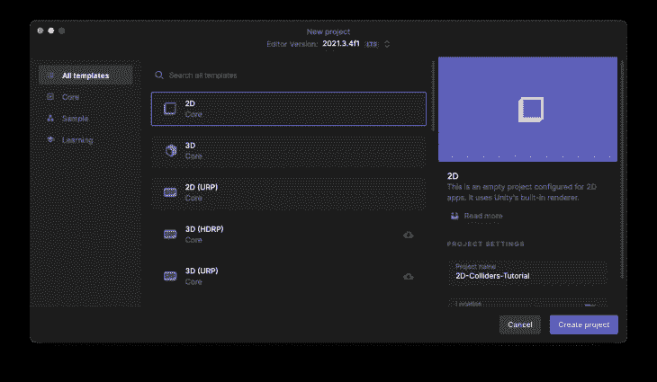

项目启动后，在`Assets`文件夹中创建两个文件夹`Scripts`和`Physic Materials`。在教程中，我们将使用它们来保持我们的项目有条理。
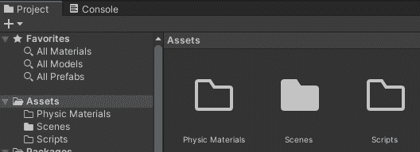

## 什么是对撞机？

在我们开始使用 Unity 项目之前，我们需要深入了解一下对撞机的基本概念。

碰撞器是 Unity(以及大多数可用的游戏引擎，如果不是全部的话)管理游戏对象之间碰撞的方式。为了这个教程，我们只使用 2D 碰撞器，但是下面提到的很多规则也适用于 3D 碰撞器。

在 Unity 中，2D 碰撞器是一个允许我们定义形状的组件，每当另一个游戏对象(带有另一个碰撞器)与第一个碰撞器发生碰撞时，我们希望在游戏对象的脚本中接收通知。

> Unity 文档提示:碰撞器是不可见的，不需要和游戏对象的网格形状完全一样。在游戏中，网格的粗略近似通常更有效且更难区分。

现在，Unity 有八种内置的 2D 对撞机:

1.  `BoxCollider2D`
2.  `CapsuleCollider2D`
3.  `CircleCollider2D`
4.  `CompositeCollider2D`
5.  `CustomCollider2D`
6.  `EdgeCollider2D`
7.  `PolygonCollider2D`
8.  `TilemapCollider2D`

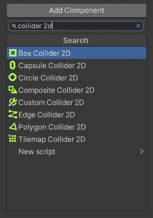

## 碰撞器的常见属性和行为

Unity 中的每台 2D 对撞机都继承了一个名为`Collider2D`的公共类。因此，它们具有共同的属性。下面列出了最著名和最广泛使用的方法:

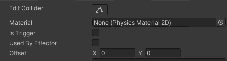

*   形状(编辑碰撞器)——每种 2D 碰撞器都有不同的形状，但是大多数允许我们改变它们形状的一些属性，比如顶点的比例和距离
*   材质——定义碰撞器可以使用的`PhysicsMaterial2D`,以定义摩擦和弹性等事物
*   is trigger——如果选中，碰撞器将作为一个触发器。当一个碰撞器没有被标记为触发器时，物理引擎会生成一个碰撞；当碰撞器撞击另一个碰撞器时，它会根据碰撞器的设置产生预期的行为，比如将它们移动到相反的方向或停止它们。然而，当一个碰撞器被标记为触发器时，物理引擎将简单地检测它何时进入另一个碰撞器的空间，并且不会产生碰撞
*   由效应器使用——决定碰撞器是否会被游戏对象附带的`Effector2D`使用

> [Unity doc 提示](https://docs.unity3d.com/Manual/Effectors2D.html) : Effector2D 组件用于在碰撞体相互接触时控制力的方向

*   偏移——由于碰撞器将被附加到游戏对象上，我们可以使用这个属性来定义相对于游戏对象的偏移位置

## 给游戏对象添加 2D 碰撞器

在我们的 Unity 项目中，为打开的场景(`SampleScene`)添加一个`Sprite (Square)`:

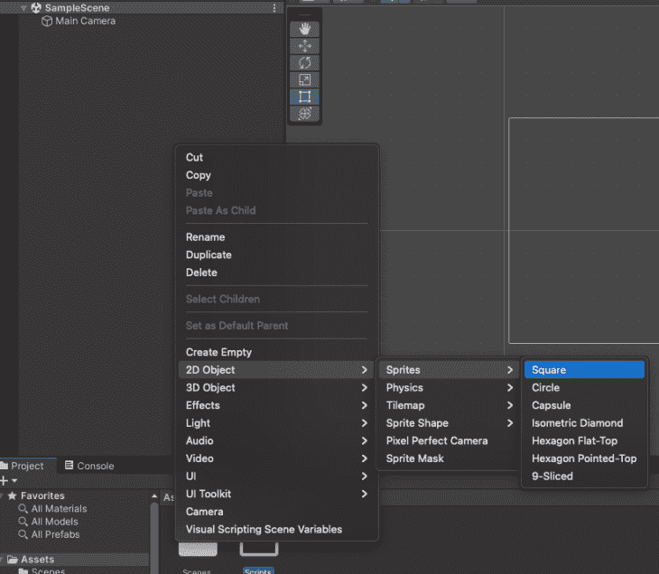

选择`Sprite (Square)`游戏对象并添加一个名为`BoxCollider2D`的组件:

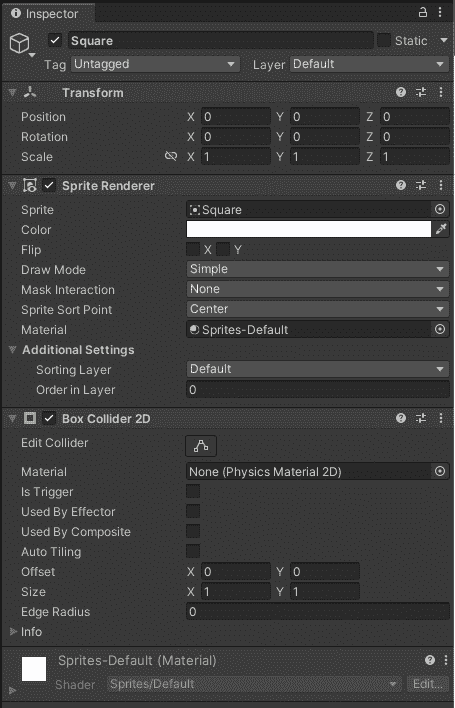

现在重复这个过程，但是添加一个`Sprite (Circle)`到场景中，并添加一个`CircleCollider2D`组件到场景中。

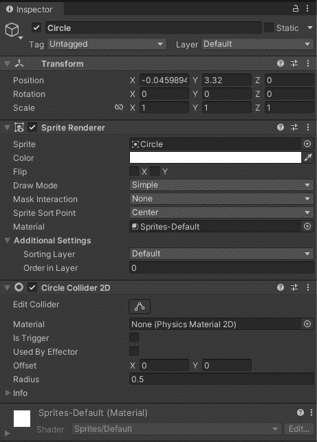

将 `Circle GameObject`移至`Square GameObject`上方一点:

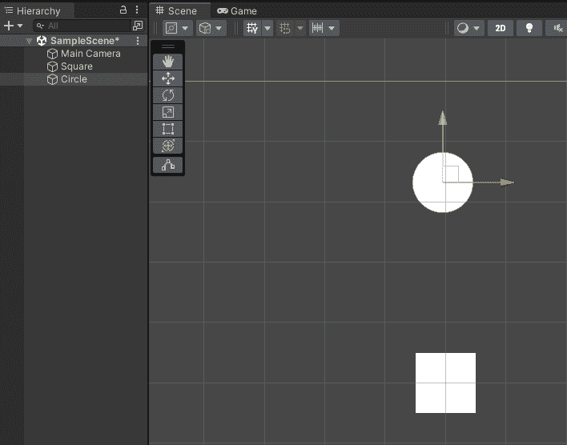

如果我们现在点击 **Play** 按钮，什么都不会发生，即使我们在编辑器中移动游戏对象。不会发生碰撞。

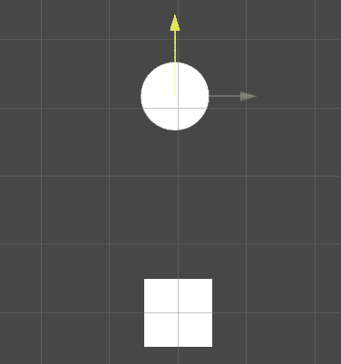

为什么什么都没发生？嗯，我们需要谈谈`Rigidbody2D`组件。

## 什么是 Rigidbody2D 组件？

Rigidbody2D 是一个组件，用来告诉 Unity 应该将游戏对象置于物理引擎的控制之下。换句话说，对于物理引擎来说，没有刚体的游戏对象是不存在的。

如果我们只是添加一个 2D 对撞机到我们的游戏对象，什么都不会发生，因为物理引擎不知道它。如果我们想让物理引擎控制我们的游戏对象，我们需要给它添加一个`Rigidbody2D`组件。

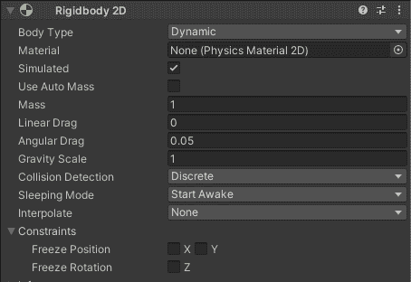

这意味着现在我们的游戏对象通过`Gravity Scale`属性受到重力的影响，并且可以通过脚本使用力来控制。

我们只需要给我们已经创建的每个游戏对象添加一个`Rigidbody2D`，然后点击**播放**按钮:

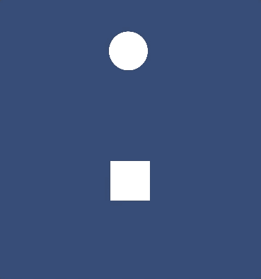

随着`Rigidbody2D`组件被添加到我们的游戏对象中，物理引擎意识到了它们，并开始进行重力动作。

## 使用 PhysicsMaterial2D 添加效果

在我们的例子中，两个游戏物体正在下落，但是如果我们想让 `Square GameObject`停留在它的位置上，而`Circle GameObject`击中它，然后像球一样弹起，会怎么样呢？

实现这一点的简单方法是使用`PhysicsMaterial2D`。

让我们将球效果添加到我们的示例场景中。首先，在`Square GameObjec` t 上，将其`Rigidbody2D`的属性`Body Type`改为`Static`:

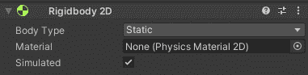新建一个 `PhysicsMaterial2D` ，命名为 `Ball physics material` ，放入我们的 `Physics Materials` 文件夹:

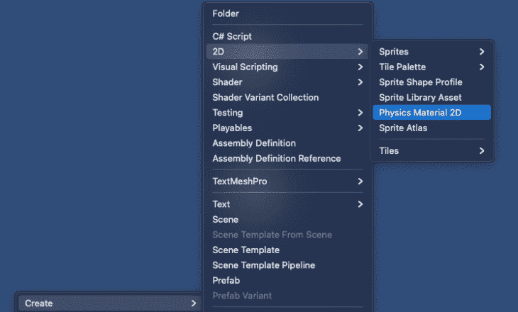

将其`Bounciness`属性更改为`1`:

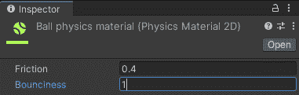

在 `Circle GameObject's Rigidbody2D`上，更改`Material`属性以使用我们刚刚创建的 `Ball physics material`:

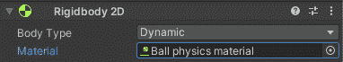点击 **再点击** 按钮。现在我们应该看到这种情况发生:

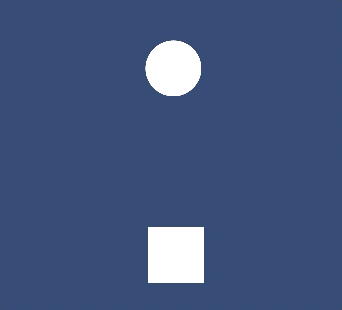

## 碰撞回调

当一个碰撞器与另一个碰撞器交互时，Unity 会发送一些消息(例如，调用任何附加到`GameObject`的`MonoBehavior`上的方法)。在 2D 对撞机的情况下，有六种可用的信息:

*   未勾选`IsTrigger`时:
    *   `OnCollisionEnter2D`:碰撞开始时在第一帧调用
    *   `OnCollisionStay2D`:碰撞发生时，在每一帧中调用
    *   `OnCollsionExit2D`:碰撞结束时，在第一帧调用
*   勾选`IsTrigger`时:
    *   `OnTriggerEnter2D`:碰撞开始时在第一帧调用
    *   `OnTriggerStay2D`:碰撞发生时，在每一帧中调用
    *   `OnTriggerExit2D`:碰撞结束时，在第一帧调用

每一帧都调用`OnCollisionStay2D`和`OnTriggerStay2D`，直到它们到达睡眠时间(如果游戏对象不再移动)。

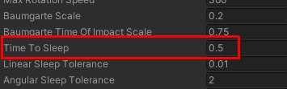

We can change this setting on Project Settings / Physics 2D

## 在脚本上使用冲突回调

是时候写点代码了。让我们创建一个脚本来记录每次我们的`Circle GameObject`点击控制台窗口的`Square GameObject` ( `OnCollisionEnter2D`)时的情况。我们将记录它们保持接触的帧数(`OnCollisionStay2D`)，以及它们停止相互撞击的时间(`OnCollsionExit2D`)。我们还将展示有无触发会发生什么。

### 没有触发器

在我们的`Scripts`文件夹中，创建一个名为`CollisionLogger`的脚本，并将其添加到`Circle GameObject`:


在 VS 代码中打开`CollisionLogger`脚本，并在其中键入这些方法:

```
using System.Runtime.CompilerServices;
using UnityEngine;

public class CollisionLogger : MonoBehaviour
{
    void OnCollisionEnter2D(Collision2D collision) => Log(collision);
    void OnCollisionStay2D(Collision2D collision) => Log(collision);
    void OnCollisionExit2D(Collision2D collision) => Log(collision);

    void Log(Collision2D collision, [CallerMemberName] string message = null)
    {
        Debug.Log($"{message} called on {name} because a collision with {collision.collider.name}");
    }
}
```

点击**播放**按钮，我们应该在控制台窗口中看到类似这样的内容:

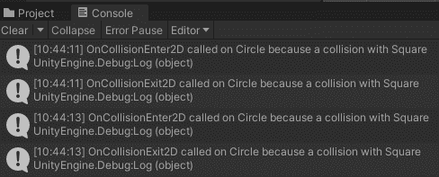

正如我们所见，当`Circle GameObject`命中`Square GameObject`时，`OnCollisionEnter2D`被调用。`OnCollsionExit2D`在他们不再互相攻击时被调用，`OnCollisionStay2D`没有被调用是因为两个游戏对象没有保持联系。要查看正在发送的`OnCollisionStay2D`，只需从`Circle GameObject's Rigidbody2D`上取下`Ball physics material` :


再次点击**播放**按钮，我们控制台窗口中的输出应该是:


现在我们有一个`OnCollisionEnter2D`和许多`OnCollisionStay2D`将被调用，直到两个游戏对象保持联系或者直到到达睡眠时间。

现在，重新启用 `Circle GameObject's Rigidbody2D`上的`Ball physics material`，并将`CollisionLogger`也添加到`Square GameObjects`中。

点击**播放**，控制台窗口应该是这样的:

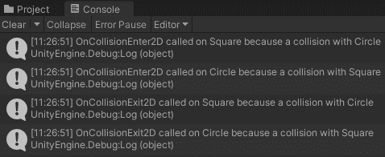

不出所料，碰撞中涉及的所有游戏对象都会调用这些消息。

### 带扳机的

那`OnTrigger`法呢？现在，我们的对撞机都没有被标记为触发器(`IsTrigger`)，这就是为什么只有`OnCollision`被调用。

当我们需要检测一个给定的游戏对象已经到达一个点或另一个游戏对象时，触发器是有用的。假设我们希望在每次`Circle GameObjec` t 经过它的时候在`Square GameObject`得到通知。我们可以添加一个选中了`IsTrigger`的碰撞器，当物理引擎调用`OnTriggerEnter2D`方法时，我们会收到通知。

要查看正在运行的触发器，将`Square GameObject's collider`标记为触发器:

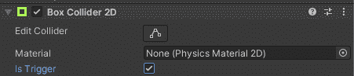

播放场景，我们会看到`Circle GameObject`正在穿过`Square GameObject`:

发生这种情况是因为 `Square GameObject` 现在是一个触发器。当两个对象碰撞时，物理引擎不会生成预期的行为，而是将 `OnTrigger` 方法发送给相关的游戏对象。

如果我们查看控制台窗口，您会注意到它是空的，因为没有调用`OnCollision`方法。要记录`OnTrigger`方法，打开我们的`CollisionLogger`脚本并添加这些新方法:

```
void OnTriggerEnter2D(Collider2D collision) => Log(collision);
void OnTriggerStay2D(Collider2D collision) => Log(collision);
void OnTriggerExit2D(Collider2D collision) => Log(collision);

void Log(Collider2D collision, [CallerMemberName] string message = null)
{
    Debug.Log($"{message} called on {name} because a collision with {collision.gameObject.name}");
}

```

运行场景，我们可以在控制台窗口中看到该日志:

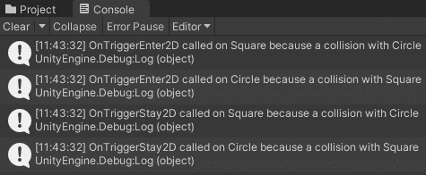


现在只调用了`OnTrigger`方法，因为冲突中涉及到了一个触发器。

需要注意的重要一点是，所有的`OnCollision`和`OnTrigger`方法都接收参数`Collision2D/Collider2D`。该参数可以保存有关碰撞本身的信息，例如:

*   哪个游戏对象与当前游戏对象冲突
*   碰撞中涉及哪些接触点
*   两个碰撞物体的相对线速度

如果我们不需要在脚本中使用这些信息，我们可以声明没有日志参数的`OnCollision` / `OnTrigger`方法。

## 对撞机相互作用

你可能在上一节中注意到，物理引擎在碰撞中调用的游戏对象的`OnCollision`和`OnTrigger`方法是相同的。知道每一种交互何时在所涉及的游戏对象中引发每一种消息/方法可能有点棘手；尽管有这种明显的相似性，不同的碰撞器设置之间的交互可能性还是有一些规则的。

一个碰撞器可以有六种不同的设置，这将不同地影响它如何与其他碰撞器交互。这些设置可以通过结合附加到同一游戏对象的`Collider2D`的属性`IsTrigger`和`Rigidbody2D`的属性`Body Type` 来完成。以下是类似设置的列表:

*   静态对撞机
    *   IsTrigger: `false`
    *   身体类型:静态
*   刚体碰撞器
    *   IsTrigger: `false`
    *   身体类型:动态
*   运动学刚体碰撞器
    *   IsTrigger: `false`
    *   身体类型:运动学
*   静态触发碰撞器
    *   IsTrigger: `true`
    *   身体类型:静态
*   刚体触发碰撞器
    *   IsTrigger: `true`
    *   身体类型:动态
*   运动学刚体触发碰撞器
    *   IsTrigger: `true`
    *   身体类型:运动学

### 这些设置如何影响碰撞器的相互作用？

这个问题的答案就在下表中，这是我从 [Unity 文档网站](https://docs.unity3d.com/Manual/CollidersOverview.html)上获得的。它向我们展示了冲突何时发生以及冲突回调(`OnCollision`和`OnTrigger`方法)何时被调用。

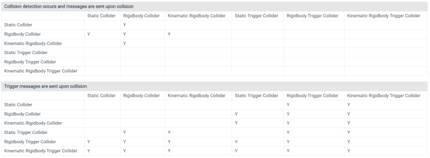来源: [Unity docs](https://docs.unity3d.com/Manual/CollidersOverview.html)

看着这张表，我们可以算出这样的事情:

*   静态碰撞器只与刚体碰撞器相互作用
*   刚体碰撞器可以与静态碰撞器、刚体碰撞器和运动刚体碰撞器交互

这些表格在游戏开发过程中非常有用，当我们遇到某种我们期望发生但没有发生的碰撞器交互时。

为了帮助我们更好地理解碰撞器的交互，现在以及当我们面临上述问题时，我创建了一个示例，我们可以在六个可能的交互设置中的每一个中移动游戏对象，查看它们如何相互交互，以及发送了哪些回调消息。

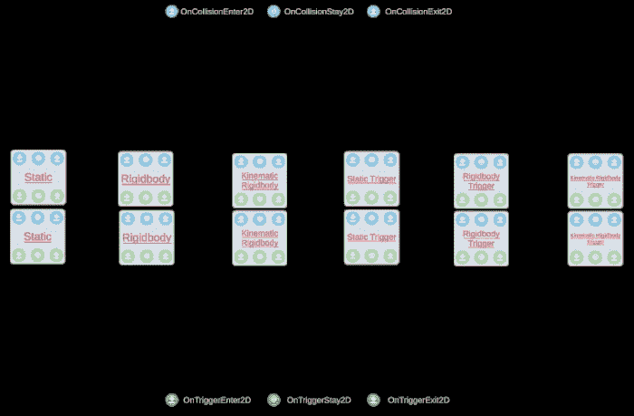

尝试在线示例[这里](https://diegogiacomelli.com.br/apps/collider-interactions)并移动每个碰撞器设置，以更好地理解每个交互发送什么消息。

## 物理 2D 设置

对于本教程的最后一部分，我想提一下 Physics2D 设置。

这些设置不在本教程的讨论范围之内——讨论其中的一些可能会占满另一整个教程——但是我认为知道它们的存在、它们的默认值是什么以及我们可以根据项目的需要调整它们是很重要的。

您可以通过“项目设置”>“物理 2D”来访问这些设置。

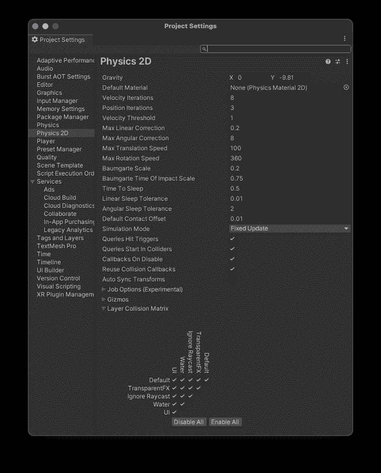

像`Gravity`这样的设置非常简单，但是像`Velocity Iterations`和`Position Iterations`这样的东西可能有点晦涩难懂，并且会对游戏行为产生很大影响。

当我们需要实现某种非常规的物理行为或性能改进时，这些设置中的大部分都会改变，但你应该知道，每次改变这些设置后，你都需要重新测试游戏，以确保你没有破坏任何东西。

底线是:确保只在研究和理解了它们的影响之后才改变这些设置。

## 源代码和示例

## 结论

在本教程中，我们已经解释了 Unity 2D 碰撞器的基本原理:它们是什么，它们的共同属性和行为是什么，如何将`BoxCollider2D`和`CircleCollider2D`添加到游戏对象，什么是`Rigidbody2D`以及如何使用`PhysicsMaterial2D`，什么是碰撞回调以及如何在我们的脚本中使用它们，最后，碰撞器设置的种类以及它们如何交互。

## 使用 [LogRocket](https://lp.logrocket.com/blg/signup) 消除传统错误报告的干扰

[](https://lp.logrocket.com/blg/signup)

[LogRocket](https://lp.logrocket.com/blg/signup) 是一个数字体验分析解决方案，它可以保护您免受数百个假阳性错误警报的影响，只针对几个真正重要的项目。LogRocket 会告诉您应用程序中实际影响用户的最具影响力的 bug 和 UX 问题。

然后，使用具有深层技术遥测的会话重放来确切地查看用户看到了什么以及是什么导致了问题，就像你在他们身后看一样。

LogRocket 自动聚合客户端错误、JS 异常、前端性能指标和用户交互。然后 LogRocket 使用机器学习来告诉你哪些问题正在影响大多数用户，并提供你需要修复它的上下文。

关注重要的 bug—[今天就试试 LogRocket】。](https://lp.logrocket.com/blg/signup-issue-free)