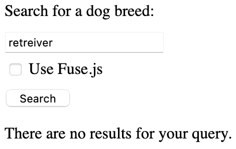
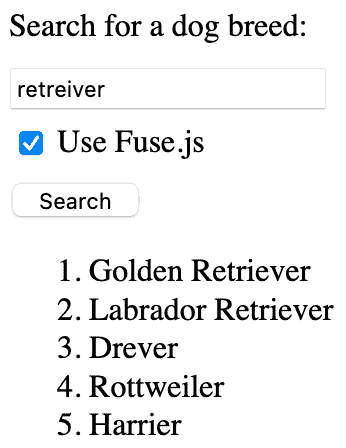

# 使用 Fuse.js 向 React app 添加动态搜索

> 原文：<https://blog.logrocket.com/fuse-js-dynamic-search-react-app/>

[Fuse.js](https://fusejs.io/) 是一个轻量级的搜索引擎，可以在用户浏览器的客户端运行。让我们看看如何使用它来轻松地向 React 应用程序添加搜索功能。

## 何时使用 Fuse.js

搜索功能对许多类型的网站都很有用，允许用户有效地找到他们正在寻找的内容。但是为什么我们会特意选择使用 Fuse.js 呢？

支持搜索有很多选择，最简单的可能是使用现有的数据库。例如，Postgres 有一个[全文搜索功能](https://www.postgresql.org/docs/current/textsearch.html)。MySQL [也有](https://dev.mysql.com/doc/refman/8.0/en/fulltext-search.html)，Redis 有一个[再搜索模块](https://oss.redislabs.com/redisearch/)。

还有专门的搜索引擎，其中 [Elasticsearch](https://blog.logrocket.com/elasticsearch-query-body-builder-node-js/) 和 Solr 最受欢迎。这些需要更复杂的设置，但是它们具有您的用例可能需要的高级功能。

最后，你可以使用搜索即服务平台，如 [Algolia](https://www.algolia.com/) 或 [Swiftype](https://swiftype.com/) 。这些服务运行自己的搜索基础设施。您只需通过 API 提供数据、配置和查询。

您可能不需要这些解决方案所提供的功能，但是，这可能需要大量的工作来实现，更不用说成本了。如果您没有太多的数据需要搜索，Fuse.js 只需要很少的设置，就可以提供比您自己想出来的更好的搜索体验。

对于 Fuse.js 来说，多少数据太多了，考虑 Fuse.js 需要访问整个数据集，因此您需要在客户端加载所有数据。如果数据集的大小是 100MB，那就超出了发送给客户端的合理范围。但是如果只有几千字节，它可能是 Fuse.js 的一个很好的候选者。

## 构建 Fuse.js + React 演示应用程序

让我们制作一个基本的 React 应用程序，它使用 Fuse.js 来允许用户搜索狗的品种。你可以在这里查看最终结果[，源代码可在](https://dannyguo.com/react-with-fuse-demo/) [GitHub](https://github.com/dguo/react-with-fuse-demo) 上获得。

我们将从搭建一些脚手架开始。从新的 Node.js 项目开始，我们将安装 React 和 Fuse.js:

```
npm install --save react react-dom fuse.js
//or
yarn add react react-dom fuse.js

```

我们还将安装[包](https://github.com/parcel-bundler/parcel)作为开发依赖项:

```
npm install --save-dev [email protected]
//or
yarn add --dev [email protected]

```

我们将在一个`package.json`启动脚本中使用它来编译应用程序:

```
{  
  "scripts": {
    "start": "parcel serve ./index.html --open"
  }
}

```

接下来，我们将创建一个准系统`index.html`，它包含一个空的`div`供 React 渲染，以及一个`noscript`消息，以避免在用户禁用 JavaScript 的情况下出现空白页面。

```
<!DOCTYPE html>
<html lang="en">
  <body>
    <div id="app"></div>
    <noscript>
      <p>Please enable JavaScript to view this page.</p>
    </noscript>
    <script src="./index.js"></script>
  </body>
</html>

```

我们将让我们的`index.js`开始变得简单。我们将呈现一个包含搜索查询输入的表单，尽管我们还没有真正处理搜索。

```
import React, { useState } from "react";
import ReactDom from "react-dom";

function Search() {
  return (
    <form>
      <label htmlFor="query">Search for a dog breed:</label>
      <input type="search" id="query" />
      <button>Search</button>
    </form>
  );
}

ReactDom.render(<Search />, document.getElementById("app"));

```

此时，如果您运行`npm run start`或`yarn run start`，Parcel 应该会在您的浏览器中打开网站，您应该会看到表单。

### 实施搜索

我们现在开始搜索吧。我们将从显示搜索结果的组件开始。我们需要处理三种情况:

1.  当用户还没有执行搜索时
2.  当查询没有结果时(因为我们不想让用户认为有什么东西坏了)
3.  当有结果显示时

我们将在一个[有序列表](https://developer.mozilla.org/en-US/docs/Web/HTML/Element/ol)中显示任何结果。

```
function SearchResults(props) {
  if (!props.results) {
    return null;
  }

  if (!props.results.length) {
    return <p>There are no results for your query.</p>;
  }

  return (
    <ol>
      {props.results.map((result) => (
        <li key={result}>{result}</li>
      ))}
    </ol>
  );
}

```

让我们也写自己的搜索函数。稍后，我们将能够比较我们简单方法的结果和 Fuse.js 的结果。

我们的方法很简单。我们将遍历狗的品种数组(从[到这个 JSON 列表](https://github.com/dariusk/corpora/blob/master/data/animals/dogs.json)，并返回包含整个搜索查询的任何品种。我们还将使所有内容都小写，以使搜索不区分大小写。

```
const dogs = [
  "Affenpinscher",
  "Afghan Hound",
  "Aidi",
  "Airedale Terrier",
  "Akbash Dog",
  "Akita",
  // More breeds..
];

function searchWithBasicApproach(query) {
  if (!query) {
    return [];
  }

  return dogs.filter((dog) => dog.toLowerCase().includes(query.toLowerCase()));
}

```

接下来，让我们通过从表单提交中获取搜索查询、执行搜索并显示结果，将所有这些联系起来。

```
function Search() {
  const [searchResults, setSearchResults] = useState(null);

  return (
    <>
      <form
        onSubmit={(event) => {
          event.preventDefault();
          const query = event.target.elements.query.value;
          const results = searchWithBasicApproach(query);
          setSearchResults(results);
        }}
      >
        <label htmlFor="query">Search for a dog breed:</label>
        <input type="search" id="query" />
        <button>Search</button>
      </form>

      <SearchResults results={searchResults} />
    </>
  );
}

```

### 添加 Fuse.js

使用 Fuse.js 很简单。我们需要导入它，让它使用`new Fuse()`索引数据，然后使用索引的搜索功能。搜索返回一些元数据，所以我们将只取出实际的项目进行显示。

```
import Fuse from "fuse.js";

const fuse = new Fuse(dogs);

function searchWithFuse(query) {
  if (!query) {
    return [];
  }

  return fuse.search(query).map((result) => result.item);
}

```

元数据包括一个`refIndex`整数，它让我们可以引用原始数据集中的相应项目。如果我们用`new Fuse(dogs, {includeScore: true})`初始化索引，我们也将得到匹配分数:一个介于 0 和 1 之间的值，其中 0 是完美匹配。“哈士奇”的搜索结果将如下所示:

```
[
  {
    item: "Siberian Husky",
    refIndex: 386,
    score: 0.18224241177399383
  }
]

```

我们将在`Search`组件的表单中添加一个复选框，让用户选择是否使用 Fuse.js 来代替基本的搜索功能。

```
<form
  onSubmit={(event) => {
    event.preventDefault();
    const query = event.target.elements.query.value;
    const useFuse = event.target.elements.fuse.checked;
    setSearchResults(
      useFuse ? searchWithFuse(query) : searchWithBasicApproach(query)
    );
  }}
>
  <label htmlFor="query">Search for a dog breed: </label>
  <input type="search" id="query" />
  <input type="checkbox" name="fuse" />
  <label htmlFor="fuse"> Use Fuse.js</label>
  <button>Search</button>
</form>

```

现在可以用 Fuse.js 搜索了！我们可以使用复选框来比较使用它和不使用它。最大的区别是 Fuse.js 允许输入错误(通过[近似字符串匹配](https://en.wikipedia.org/wiki/Approximate_string_matching))，而我们的基本搜索要求精确匹配。如果我们将“retriever”误拼为“retriever”，请查看基本搜索结果:



下面是同一个查询更有用的 Fuse.js 结果:



### 搜索多个字段

如果我们关心多个字段，我们的搜索可能会更复杂。例如，假设我们想通过品种和原产国进行搜索。Fuse.js 支持这个用例。当我们创建索引时，我们可以指定要索引的对象键。

```
const dogs = [
  {breed: "Affenpinscher", origin: "Germany"},
  {breed: "Afghan Hound", origin: "Afghanistan"},
  // More breeds..
];

const fuse = new Fuse(dogs, {keys: ["breed", "origin"]});

```

现在，Fuse.js 将搜索`breed`和`origin`字段。

## 结论

有时我们不想花费资源来建立一个成熟的 Elasticsearch 实例。当我们有简单的需求时，Fuse.js 可以提供相应简单的解决方案。正如我们已经看到的，将它与 React 一起使用也很简单。

即使我们需要更高级的功能，Fuse.js 也允许给[不同的字段赋予不同的权重](https://fusejs.io/examples.html#weighted-search)，添加`AND``OR`[逻辑](https://fusejs.io/api/query.html)，[调整模糊匹配逻辑](https://fusejs.io/api/options.html#fuzzy-matching-options)，等等。下次您需要向应用程序添加搜索时，请考虑使用它。

## 使用 LogRocket 消除传统反应错误报告的噪音

[LogRocket](https://lp.logrocket.com/blg/react-signup-issue-free)

是一款 React analytics 解决方案，可保护您免受数百个误报错误警报的影响，只针对少数真正重要的项目。LogRocket 告诉您 React 应用程序中实际影响用户的最具影响力的 bug 和 UX 问题。

[ ](https://lp.logrocket.com/blg/react-signup-general) [  ](https://lp.logrocket.com/blg/react-signup-general) [LogRocket](https://lp.logrocket.com/blg/react-signup-issue-free)

自动聚合客户端错误、反应错误边界、还原状态、缓慢的组件加载时间、JS 异常、前端性能指标和用户交互。然后，LogRocket 使用机器学习来通知您影响大多数用户的最具影响力的问题，并提供您修复它所需的上下文。

关注重要的 React bug—[今天就试试 LogRocket】。](https://lp.logrocket.com/blg/react-signup-issue-free)