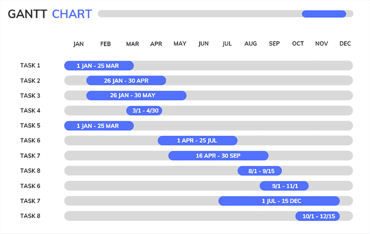

# 甘特图:现代团队的分步指南

> 原文：<https://blog.logrocket.com/product-management/gantt-charts-step-by-step-guide-modern-teams/>

甘特图——没人喜欢但人人都用的工具。作为瀑布时代结束后幸存下来的众多事物之一，甘特图经常被认为是提供交付可见性的必要工具。

产品社区倾向于批评推广甘特图的人，但我认为这有点不公平。正如好的工具不能造就好的专业人员一样，好的专业人员可以利用“坏”的工具来完成好的工作。

我想深入探讨甘特是什么，以及不管你的公司在产品管理方面有多成熟，你如何利用它。

* * *

## 目录

* * *

## 什么是甘特图？

甘特图以其创建者 Henry Gantt 的名字命名，它在项目管理中的首次使用可以追溯到第一次世界大战，当时美国需要一种工具来组织其军队后勤。从那时起，这张图表被用来管理任何事情，从建造房屋到组织苏联内部的第一个五年计划。

概括地说，甘特图是一个电子表格，x 轴是日期里程碑，y 轴是任务。在任务的开始日期和结束日期之间，这些任务占据了它们各自行的所有单元格。当你计划好一切，你会得到这样的结果:

Source: Canva.

没什么特别不好的，对吧？那么，为什么它被说得这么难听呢？

## 为什么甘特图上的仇恨？

甘特图对现代产品工具集并不像有些人看起来的那样有害。就像任何其他管理工具一样，它的有效性取决于它的环境和谁在使用它。

在更传统的项目中，有些事情不能在关键路径之外完成。你不能在顶层开始建造一栋建筑，即使你的建筑师说那是最有价值的部分。你需要从横梁开始，然后是地板，然后是墙壁，只有这样你才能到达顶层公寓。

甘特图在绘制关键路径方面表现惊人。

它的坏名声大部分来自于过去它对大型科技公司，如 IBM 或 Intel 内部产品开发的适应。在所谓的“提供可见性”和“跟踪工作”的动机背后，早期的技术项目经理使用该工具来支持他们缺乏灵活性和创造性，同时致力于臭名昭著的瀑布框架。

在敏捷宣言之后，甘特图与瀑布紧密相连，你无法将它们分开。随着瀑布的枯萎和死亡，甘特图在科技公司中的受欢迎程度和可用性也随之下降。

但有些东西运作得如此之好，以至于它们不会消亡……所以它们得到了一个更名。

## 甘特图是路线图吗？

路线图，作为一个概念，远远大于一个工具。"[机会解决方案树](https://blog.logrocket.com/product-management/opportunity-solution-trees-definition-examples-how-to/)、" "现在、下一个、以后"--这些是一些路线图框架，可以而且应该根据具体情况来使用。

但是直截了当地说…是的，他们是！

谈论甘特图是不受欢迎的，但是每个利益相关者都希望看到时间承诺。你是怎么做到的？没有足够的工具，如何让客户和合作伙伴放心？

调用甘特图路线图！

仅仅因为现在事情可以并行，我们不再像过去那样拘泥于日期，并不意味着你的路线图就不再是甘特图。如果你在 x 轴上有一个时间表，在 y 轴上有一个要做的工作的列表，那就是甘特图。

不过，这并没有错，只要你记住甘特图和路线图不是一回事。前者包含在后者中，您将拥有一个非常强大的工具。

## 何时使用甘特图

既然我们已经驱散了围绕这个话题的仇恨迷雾，让我们试着以正确的方式运用它。在我们开始构建甘特图之前，我们必须评估这是否是要使用的正确路线图工具。我们可以从一些简单的问题开始:

### 我的利益相关者强大吗？

[谁是你的利益相关者](https://blog.logrocket.com/product-management/what-stakeholder-management-tools-techniques/)？他们是企业客户、个人用户，还是你公司内部的其他团队？简而言之，你的利益相关者对你有多大的 T2 权力？

如果一个利益相关者没有什么权力，想想一个拥有数百万日活跃用户的应用程序的个人用户——更容易与松散的日期打交道。除了等待，他们别无选择。

* * *

订阅我们的产品管理简讯
将此类文章发送到您的收件箱

* * *

然而，如果你不遵守最后期限的承诺，一个强大的利益相关者，如投资者或重要客户，可能会背弃你。没有这个特定的利益相关者，就没有产品，所以你最好关注交付时间表。

### 完成一件事需要做多少工作？

你能用最少的努力创造多少价值？您是否领先于一个能够在每次冲刺中交付价值的产品团队，或者您是否致力于一个至少需要一个月来部署最简单特性的庞然大物？

[精益理念的普及](https://blog.logrocket.com/product-management/what-is-lean-product-management-how-to-apply/)让我们大多数人相信，如果你不能以闪电般的速度交付，你的产品就是错的。这不是真的。

有些产品需要更多的开发时间才能体现价值。想象一个银行平台，一个销售软件，或者一个正在构思中的产品。所有这些都需要大量的技术努力，才能提供任何被认为有用的东西。

### 关键路径存在吗？

不是所有的产品都有线性的价值交付过程，但是有些产品有高度的相互依赖性，尤其是在它们的第一次迭代中。还记得顶层公寓的例子吗？一个有很多依赖项的产品就像一个建筑:如果你，比方说，在建立与你的电子商务库存的集成之前提交了列表页面，你可能在不久的将来会有很多返工。

同样，下面没有建筑的顶层公寓只是一所房子，没有库存链接的列表页面只是一个屏幕。如果不尊重关键路径，有时你做的工作会一事无成。

如果你对这三个问题中的至少两个回答了“是”，那么恭喜你！构建甘特图是展示路线图的最佳方式。

## 如何建立成功的甘特图

概括地说，如果我们的利益相关者很强大，如果交付每个迭代需要很多工作(因此，需要很多时间),和/或如果我们的产品在交付之间有很高的相互依赖性，我们就使用甘特图。

到目前为止，一切都太简单了，但是如何避免将您的甘特图转换成瀑布陷阱呢？也许比知道何时使用它更重要的是知道如何使用它。这是将你与 40 年前的 PMBOK 时代区分开来的一件事。

### 有一个可靠的团队

甘特图是关于时间承诺的。它们的存在仅仅是为了预测和跟踪交货。然而，要让他们工作，你需要一个像时钟一样工作的团队。你必须事先知道你团队中的每个人平均需要多少时间来完成他们的工作:项目经理，设计师，工程师，质量保证人员…

如果你有一个不可靠的团队，你会让自己陷入一场噩梦。最后期限不会被遵守，利益相关者会生气，你的团队会沮丧，你很可能会为了让它适合你的时间而破坏交付的价值。产品就是这么死的。

如果你没有一个有效的交付框架，不管是 scrum、看板还是其他什么，你都不能承诺严格的日期。

### 在特性层面上交易，而不是在策略层面上

使用甘特图作为路线图的可互换概念是危险的，正是因为这两个工作领域之间的差异。你可以预测交付一个特性需要多长时间，但是几乎不可能预测在它交付价值之前，你会对一个策略投入多长时间。

常见的是看到季度或学期的路线图，使用甘特图来定义团队将致力于解决一些挑战的时间和时间。如果时间到了，而你还没到，会发生什么？你会放弃这个计划吗？但是挑战不是仍然值得追求吗？

在甘特图中画下太多的任务会产生类似于和不可靠的团队约会的结果:压力、低落的士气和糟糕的价值传递。

### 不要做得太长

甘特图几乎没有改变承诺的空间。该工具糟糕的公关部分正是源于它在不断变化的现代技术环境中缺乏灵活性。

知道这个限制(没有什么是完美的)，最基本的是你不要过度承诺。最多做一个季度的甘特图。一整年甚至更长时间建造一个，肯定会在短时间内被迫扔掉。

### 不要把它看得那么严重

过去，团队服务于甘特图，而不是相反。如果有什么东西晚了两周，这个项目就会被认为处于极度危险之中。

当我们将注意力从完成工作转移到交付价值时，我们打破了时间承诺的束缚。在约定的日期送垃圾不要紧，送点有用的东西就算有些晚也是好的。

过度承诺不利于产品文化。不可能每次都一针见血，即使你有一个可靠的团队和[精心绘制的功能路线图](https://blog.logrocket.com/product-management/how-to-build-product-roadmap-overview-examples/)。管理风险承担者对这些硬性日期的可能脆弱性，是与您的甘特图保持健康关系的基础

## 结论

无论你是产品经理还是项目经理，对一个工具有多少偏见都无关紧要。如果你明白如何使用它，何时使用它，你会得到令人敬畏的结果。

这绝不是一个教程，它更像是一个最被低估的路线图工具的赎回信。

不管你用的是吉拉、Excel、Canva 还是 Miro。只要你对如何做、为谁做、何时做有了基本的了解，你就可以构建你的甘特图，而不用担心伤害任何产品的神圣法则。

*精选图片来源:[icon scout](https://iconscout.com/icon/agile-prioritize-2310243)*

## [LogRocket](https://lp.logrocket.com/blg/pm-signup) 产生产品见解，从而导致有意义的行动

[LogRocket](https://lp.logrocket.com/blg/pm-signup) 确定用户体验中的摩擦点，以便您能够做出明智的产品和设计变更决策，从而实现您的目标。

使用 LogRocket，您可以[了解影响您产品的问题的范围](https://logrocket.com/for/analytics-for-web-applications)，并优先考虑需要做出的更改。LogRocket 简化了工作流程，允许工程和设计团队使用与您相同的[数据进行工作](https://logrocket.com/for/web-analytics-solutions)，消除了对需要做什么的困惑。

让你的团队步调一致——今天就试试 [LogRocket](https://lp.logrocket.com/blg/pm-signup) 。

[Antonio da Fonseca Neto Follow](https://blog.logrocket.com/author/antoniofonsecaneto/) Global PM managing products since 2018 | Sharp and witty takes on everyday topics regarding all things product management