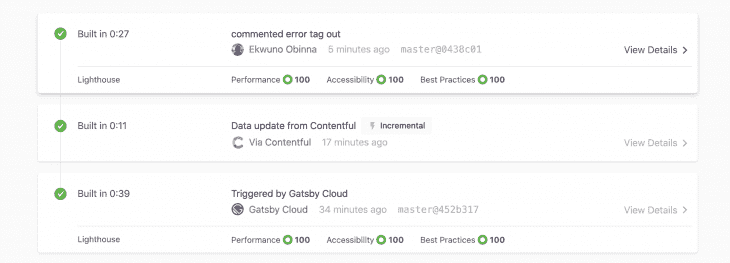
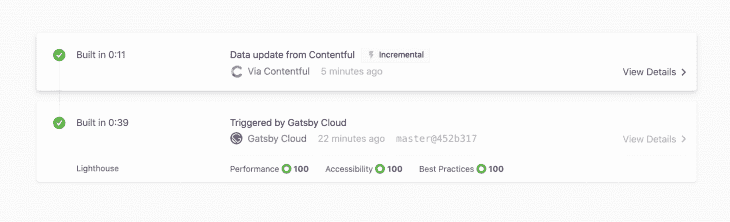
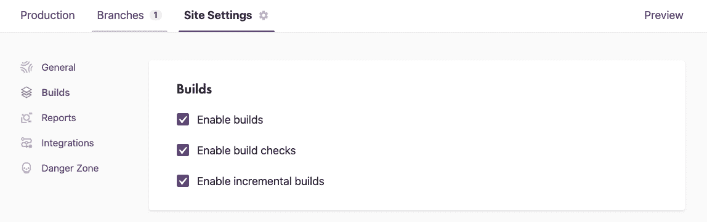
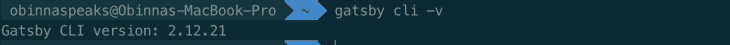

# Gatsby 增量构建指南

> 原文：<https://blog.logrocket.com/gatsby-incremental-builds/>

静态网站有很多固有的优势——速度、安全性、可扩展性。不过，从历史上看，它们也有一个很大的缺点——整体构建。每当静态站点的代码或数据发生变化时，整个平台都会重新构建。

当你处理一个只有几十篇博客文章的站点时，这可能不是问题(因为小站点意味着更短的构建时间)。然而，随着规模的扩大，这变成了一个 O(n)问题。这意味着构建时间随着站点的增长而增长。纠正一个错别字需要的时间和第一次重建网站的时间是一样的。

合乎逻辑的问题是，为什么我们不能只重建受新数据或更新数据影响的那部分网站，而保持其余部分不变呢？这种只重建静态站点中发生变化的部分的方式被称为增量构建。很长一段时间，人们试图找出一个好的方法来做到这一点，但没有人想出一个好的通用方法来使它特别是在平台级别上工作。

但是最近发生了一件非常令人兴奋的事情。Gatsby Cloud 引入了一个新的增量构建功能，用于对使用 [Gatsby 开源框架](https://github.com/gatsbyjs/gatsby)构建的任何网站或 web 应用程序进行内容和数据更改。现在可以在十秒钟内更改一个错别字并重新构建目标更改，而不是触发可能需要几分钟的完整重建！

## 一、盖茨比云是什么？

[盖茨比云](https://www.gatsbyjs.com/docs/)是一个运行你的盖茨比网站的平台。它经过精确优化，有助于进一步扩展 Gatsby 网站的速度和附加功能。随着用户继续使用 [Gatsby 开源框架](https://github.com/gatsbyjs/gatsby)构建令人惊叹的网站和网络应用，Gatsby Cloud 也作为一种解决方案被创建，以消除建立新项目的一些标准工作，并帮助用户轻松设置应用。

Gatsby 云平台适用于任何无头 CMS。然而，有几个合作伙伴 CMS 集成针对超快速设置进行了优化，用户只需点击一系列选项，即可授权云在 GitHub 上为您设置 CMS 模板和存储库。Gatsby Cloud 目前支持这种自动化设置，有 [Contentful](https://www.contentful.com/) 、 [Sanity](https://www.sanity.io/) 、 [DatoCMS](https://www.datocms.com/) 、 [CosmicJS](https://www.cosmicjs.com/) 、 [WordPress (alpha)](https://wordpress.com/) 和 [Drupal (alpha)](https://www.drupal.org/project/alpha) 。

## 静态网站构建的 0(n)问题

盖茨比网站可以在任何地方运行，而不仅仅是盖茨比云。就站点加载时间而言，它们在任何地方都很快，这是由于静态站点的一般性质，尤其是基于 Gatsby React 的框架的架构。但是静态站点第一次构建时间总是很长。如果你的网站不经常改变，你可能不介意——构建一次，然后永远快速交付。

但是，如果你经营着一家拥有数十名撰稿人和编辑的通讯社，并且你预计每天会有大约 20 篇新文章，那该怎么办呢？这二十篇文章将触发二十个新版本，对吗？嗯，不，这二十篇文章可能还包括调整和更正，更新和补充。每次内容改变时，它都会触发一个新的构建并实时部署。

每次进行编辑时，都会触发一次完整的构建！

这个问题只会越来越严重，因为构建时间会随着站点的增加而增加。五分钟变成了二十分钟，二十分钟变得更长。这就是 O(n)问题，随着时间的推移，你发表的文章越多，你的网站越大，构建时间就越长。

在盖茨比的时代，即使不到五分钟也不是很快，我们的目标是给人一种快速的体验。Gatsby 团队一直在设计框架，以提高我们构建每个页面的速度，但最终总会出现 O(n)问题。

然而，一旦 Gatsby 团队找到了提供增量构建的可持续方法，他们就开启了闪电般快速重建的现实。第一次建造需要多长时间就有多长时间，这是无法回避的。这是因为它被用作后续构建的基准，无论是第一次构建还是一天中的第 100 次打字错误纠正，它的工作方式基本上都是一样的，即在编译时生成 HTML，然后将其存储在 CDN(如 Netlify)上，以便尽可能快地进行检索。

不同的是，现在，在 Gatsby Cloud 上，我们能够为数据更改提供部分重新编译。我们可以只重建受内容变化影响的页面，而不需要重建整个网站。如果一个作者决定编辑一篇文章的标题来提高搜索引擎优化，只有那个页面会发生变化，而且变化发生得非常快。构建通常在十秒钟内完成！

所以静态站点 O(n)问题就变成了 O(1)情况。现在，你的网站有多少页面不再重要了，100 或 100，000，因为增量构建简单地留下所有没有改变的页面。

根据官方发布，为了使用增量构建，您的项目必须使用 Gatsby 2 . 20 . 4 或更高版本。

## 什么可以触发增量构建？

在 Gatsby Cloud 上，增量构建可以由 CMS 上的*内容*变化或任何类型的数据变化触发。当检测到内容更改时，将触发增量构建。

然而，对您实际代码库的更改仍然会触发一个完整的重建，例如，通过 [Git](https://git-scm.com/) 提交的任何更改。如果你看下面的图片，我已经通过更新 Contentful 上的内容触发了一个增量构建，更新只花了 0:11 秒，并通过更改一些代码触发了另一个完整构建，正如我的提交消息“注释错误标记”所指示的，你还会注意到构建时间显著减少(从 0:39 秒减少到 0:27 秒)。

Gatsby 团队正致力于在不久的将来支持基于代码变更的增量构建，但是由于这些发生的频率往往比数据变更(即内容编辑)低得多，所以他们决定首先处理内容问题。

*markdown 或 MDX 中的更改被视为代码更改，并将触发完整构建。*

值得注意的是，您的第一个增量构建与常规构建是相同的。Gatsby Cloud 需要创建一个基线构建，然后后续的增量构建才能与之进行比较，以确定发生了什么变化。这是真的，即使你之前已经在 Gatsby Cloud 上建立了你的站点。一旦您选择了增量构建特性，您将需要运行另一个构建来建立基线。但在那之后，事情几乎神奇地加快了速度！

例如，下图显示了一个内容变更，它触发了一个内容丰富的 CMS 集成的增量构建。您可以注意到构建时间从 0:39 秒减少到了 0:11 秒。初始构建被用作基线。

这些构建是在您将 CMS 和 GitHub 与 Gatsby Cloud 集成后自动触发的。

## 如何启用 Gatsby 的增量构建

*   前往 [Gatsby Cloud](https://gatsbyjs.com/) 立即尝试增量构建。在“构建”选项下的“站点”设置中，您可以启用增量构建:

*注意*:启用`"GATSBY_EXPERIMENTAL_PAGE_BUILD_ON_DATA_CHANGES=true gatsby build --log-pages"`作为构建选项不会触发 Gatsby 增量构建。它可以节省 HTML 生成步骤的时间，因为不需要为数据未改变的页面重新呈现 HTML。这还没有盖茨比云中真正的[增量构建](https://www.gatsbyjs.com/docs/incremental-builds/)快。在 [Gatsby 文档](https://www.gatsbyjs.org/docs/conditional-page-builds/)中了解更多信息:

*   增量构建现在在公开测试版中可用。因此，所有盖茨比云用户都可以免费试用 14 天！这为所有专业、商业和企业计划提供了全面的可用性
*   如果您有一个现有的 Gatsby 站点，您可能需要升级。增量构建使用 Gatsby 2.20.4 和更高版本来更新运行`npm install -g gatsby-cli`。您可以通过在终端中运行`gatsby cli -v`来验证您的 CLI 版本:

*   要体验最快的构建速度，请使用 Gatsby Cloud 一流 CMS 集成的内容更新您的网站。这些包括知足、理智、达图克斯和宇宙。WordPress 和 Drupal 支持在 alpha 中

## 结论

在这篇博文中，我们探讨了增量构建的概念，增量构建在静态预渲染网站构建时间中的重要性，以及它是如何成为 Gatsby Cloud 的一个主要突破性特性的。

在我看来，这表明 Gatsby 将继续寻找更多的方法来改善与 Gatsby 一起构建的开发者体验。当面对谁最适合处理您的 Gatsby 站点的 CI/CD 的选择时，我认为 Gatsby Cloud 及其不到 10 秒的构建应该是最佳选择。请记住，Gatsby 的开源框架将永远是免费的，并且将永远有一个用于个人和社区项目的 Gatsby Cloud 免费层！

## 使用 [LogRocket](https://lp.logrocket.com/blg/signup) 消除传统错误报告的干扰

[LogRocket](https://lp.logrocket.com/blg/signup) 是一个数字体验分析解决方案，它可以保护您免受数百个假阳性错误警报的影响，只针对几个真正重要的项目。LogRocket 会告诉您应用程序中实际影响用户的最具影响力的 bug 和 UX 问题。

然后，使用具有深层技术遥测的会话重放来确切地查看用户看到了什么以及是什么导致了问题，就像你在他们身后看一样。

LogRocket 自动聚合客户端错误、JS 异常、前端性能指标和用户交互。然后 LogRocket 使用机器学习来告诉你哪些问题正在影响大多数用户，并提供你需要修复它的上下文。

关注重要的 bug—[今天就试试 LogRocket】。](https://lp.logrocket.com/blg/signup-issue-free)