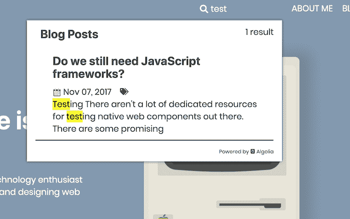

# 盖茨比:带示例的终极指南

> 原文：<https://blog.logrocket.com/gatsby-ultimate-guide-examples/>

***编者按:**本教程最后一次更新于 2022 年 6 月 9 日，包含更多关于盖茨比的最新信息，包括关于盖茨比 v4 的信息。*

在这个全面的 Gatsby 教程中，我们将告诉您关于流行的基于 React 的框架您需要知道的一切，包括它是什么，如何使用它，以及 Gatsby 与其他静态站点生成器的区别。

我们将详细介绍以下内容:

## 盖茨比是什么？

Gatsby 是一个免费、开源、基于 React 的框架，旨在帮助开发者构建高性能的网站和应用。简而言之，Gatsby 是一个利用 React 的静态站点生成器。

为什么在框架(或库)之上需要一个框架？React 不是应该帮助开发者建立网站和应用吗？这是讨论[盖茨比和 Next.js](https://blog.logrocket.com/next-js-vs-gatsbyjs-a-developers-perspective/) 时经常提出的一个合理的问题。

React 是一个库，旨在为开发人员提供一组核心功能。它旨在重量轻且应用广泛。另一方面，Gatsby 是一个静态渐进式 web 应用程序(PWA)生成器，它提供开箱即用的代码和数据拆分。

为了提高性能，Gatsby 只加载关键的 HTML、CSS、JavaScript 和其他数据。加载后，它会为您可能导航到的其他页面预取资源。通过这种方式，你的网站可以尽可能快地加载，用户交互也感觉无缝。

## 什么是静态站点？

静态网站已经存在很长时间了。事实上，它们很可能是原始网站:只是 HTML、CSS 和 JavaScript。它们不会在运行时呈现；没有服务器端代码，没有数据库等。

静态站点生成器是一个生成静态站点的工具。关于 JS 框架和库，它们通常在运行时在客户端生成 HTML 内容。静态站点生成器在构建时生成这些内容。然后，一旦加载完毕，React 就会接管，您就有了一个单页应用程序！

这与服务器端渲染有什么不同？这是一个很棒的问题。主要区别是没有服务器端代码。因此，与 Next.js 等工具不同，当发出请求时，Gatsby 不会在服务器上呈现任何内容。这些都是在应用程序构建时完成的。

静态网站的一些好处是:速度、搜索引擎优化和安全性。用 Gatsby 制作的网站不仅速度极快，而且由于没有数据库或服务器，它们具有隐含的安全性，而且与标准的 React 应用程序不同，它们使 SEO 变得容易得多，因为爬虫可以找到内容。

## 盖茨比的特别之处在哪里？

Gatsby 有一些很棒的特性，使它区别于其他静态站点生成器。首先也是最重要的，Gatsby 充分利用了 React，所以对于那些喜欢它的人来说，它是一个很好的选择。

Gatsby 与像 [Netlify](https://blog.logrocket.com/how-to-use-gatsby-netlify-cms/) 这样的平台结合得非常好，每次提交和推送 GitHub 时，你都可以轻松地配置你的站点来构建和部署。

Gatsby 还附带了一个巨大的插件生态系统，可以满足各种需求。这些插件可以帮助你从像 WordPress 或 Contentful 这样的 CMSs 中获取数据，帮助你集成像 Algolia 这样的工具，并通过延迟加载和优化来管理你的图像。

Gatsby 还提供了丰富的 API，使得静态站点的开发更加容易——例如，`createPage` API 使得在构建时使用模板将 markdown 文件转换成静态页面变得非常容易。

最后，Gatsby 有一堆很棒的组件，它们简化了路由、链接和处理图像等事情，这些都不包含在核心的 React 库中。

## 使用 Gatsby 需要了解 React 和 GraphQL 吗？

GraphQL 是一种流行且强大的查询语言和用于执行查询的服务器端运行时。它不与任何数据库或阶段引擎相关联；相反，GraphQL 由您现有的代码提供支持。通过定义类型和这些类型上的字段，然后为每个类型上的每个字段提供函数，您可以[创建一个 GraphQL 服务](https://graphql.org/learn/)。

Gatsby 使用 GraphQL 来管理整个应用程序中的数据。虽然没有 GraphQL 也可以使用 Gatsby，但是使用 GraphQL 确实让 app 开发更具有声明性和直观性。

## 盖茨比入门

要开始使用 Gatsby，请下载 Gatsby CLI: `npm i -g gatsby`。这个命令行工具使您能够生成、运行和构建一个 Gatsby 应用程序。

要快速启动并运行，您可以使用 [Gatsby 默认启动库](https://github.com/gatsbyjs/gatsby-starter-default)。克隆完成后(点击**使用模板**按钮创建你自己的副本，然后为你的新回购做一个`git clone`)，运行`npm install`然后`gatsby develop`。这将生成一个运行在`[http://localhost:3000](http://localhost:3000)`上的完全活跃的 Gatsby 应用程序。

如果您正在运行 Node v18，您可能会收到以下错误:

```
You must provide the URL of lib/mappings.wasm by calling SourceMapConsumer.initialize({
'lib/mappings.wasm': ... }) before using SourceMapConsumer

```

要处理此错误，您可以使用节点版本管理器降级到节点 v17 或 v16，或者在运行`gatsby develop` : `export NODE_OPTIONS=--no-experimental-fetch`之前运行以下命令。Gatsby 有自己的 fetch 实现，它与 Node v18 中引入的新的本机节点 Fetch API 相冲突。

为了确认页面已经被渲染，您可以访问任何页面并点击**查看源代码**。但是，请注意，您也可以单击链接，页面将在没有完全刷新的情况下更新，正如您对 PWA 的期望。

## 用盖茨比设计你的网站

设计一个外观和感觉确实是体验中最困难的部分。在某种程度上，我被各种可能性弄得不知所措。帮助我前进的一件事是查看 [获奖作品集网站](https://www.awwwards.com/websites/portfolio/) 的一页又一页，收集灵感，感受已经出现的 伟大设计 。

我致力于设计一些我自己的自定义动画和 SVG。这很有趣，我不能推荐 Figma 足够的努力。如果熟悉素描，使用起来会极其简单。


## 与 Gatsby 一起开发您的网站

为了起步，我使用了 [Gatsby starter 库](https://github.com/gatsbyjs/gatsby-starter-default/)。我把这个从 GitHub 分叉出来，重新命名为 repo。然后我克隆了它，用 Gatsby CLI 来构建。在很短的时间内，我就在 localhost 上运行了一个实时热重装应用程序。

代码的结构非常简单。在 src 目录中有三个文件夹:`components`、`images`和`pages`。`images`目录包含几个在站点中使用的 png 文件。`components`目录包含几个值得注意的组件。

首先是`layout.js`组件。它是一个包装器组件，旨在为整个应用程序提供样式和功能。这种模式在 React 中非常流行。

您会注意到在组件的中心有一个名为`{children}`的绑定:

```
/**
 * Layout component that queries for data
 * with Gatsby's useStaticQuery component
 *
 * See: https://www.gatsbyjs.com/docs/use-static-query/
 */
import * as React from "react"
import PropTypes from "prop-types"
import { useStaticQuery, graphql } from "gatsby"
import Header from "./header"
import "./layout.css"
const Layout = ({ children }) => {
  const data = useStaticQuery(graphql`
    query SiteTitleQuery {
      site {
        siteMetadata {
          title
        }
      }
    }
  `)
  return (
    <>
      <Header siteTitle={data.site.siteMetadata?.title || `Title`} />
      <div
        style={{
          margin: `0 auto`,
          maxWidth: `var(--size-content)`,
          padding: `var(--size-gutter)`,
        }}
      >
        <main>{children}</main>
        <footer
          style={{
            marginTop: `var(--space-5)`,
            fontSize: `var(--font-sm)`,
          }}
        >
          © {new Date().getFullYear()} &middot; Built with
          {` `}
          <a href="https://www.gatsbyjs.com">gatsbyjs</a>
        </footer>
      </div>
    </>
  )
}
Layout.propTypes = {
  children: PropTypes.node.isRequired,
}
export default Layout

```

这表示要在组件内部传递的内容。您可以在`pages`目录的`index.js`中看到这个组件正在工作:

```
import * as React from "react"
import { Link } from "gatsby"
import { StaticImage } from "gatsby-plugin-image"
import Layout from "../components/layout"
import Seo from "../components/seo"
import * as styles from "../components/index.module.css"
const links = [
  {
    text: "Tutorial",
    url: "https://www.gatsbyjs.com/docs/tutorial",
    description:
      "A great place to get started if you're new to web development. Designed to guide you through setting up your first Gatsby site.",
  },
  {
    text: "Examples",
    url: "https://github.com/gatsbyjs/gatsby/tree/master/examples",
    description:
      "A collection of websites ranging from very basic to complex/complete that illustrate how to accomplish specific tasks within your Gatsby sites.",
  },
  {
    text: "Plugin Library",
    url: "https://www.gatsbyjs.com/plugins",
    description:
      "Learn how to add functionality and customize your Gatsby site or app with thousands of plugins built by our amazing developer community.",
  },
  {
    text: "Build and Host",
    url: "https://www.gatsbyjs.com/cloud",
    description:
      "Now you’re ready to show the world! Give your Gatsby site superpowers: Build and host on Gatsby Cloud. Get started for free!",
  },
]
const samplePageLinks = [
  {
    text: "Page 2",
    url: "page-2",
    badge: false,
    description:
      "A simple example of linking to another page within a Gatsby site",
  },
  { text: "TypeScript", url: "using-typescript" },
  { text: "Server Side Rendering", url: "using-ssr" },
  { text: "Deferred Static Generation", url: "using-dsg" },
]
const moreLinks = [
  { text: "Join us on Discord", url: "https://gatsby.dev/discord" },
  {
    text: "Documentation",
    url: "https://gatsbyjs.com/docs/",
  },
  {
    text: "Starters",
    url: "https://gatsbyjs.com/starters/",
  },
  {
    text: "Showcase",
    url: "https://gatsbyjs.com/showcase/",
  },
  {
    text: "Contributing",
    url: "https://www.gatsbyjs.com/contributing/",
  },
  { text: "Issues", url: "https://github.com/gatsbyjs/gatsby/issues" },
]
const utmParameters = `?utm_source=starter&utm_medium=start-page&utm_campaign=default-starter`
const IndexPage = () => (
  <Layout>
    <Seo title="Home" />
    <div className={styles.textCenter}>
      <StaticImage
        src="../images/example.png"
        loading="eager"
        width={64}
        quality={95}
        formats={["auto", "webp", "avif"]}
        alt=""
        style={{ marginBottom: `var(--space-3)` }}
      />
      <h1>
        Welcome to <b>Gatsby!</b>
      </h1>
      <p className={styles.intro}>
        <b>Example pages:</b>{" "}
        {samplePageLinks.map((link, i) => (
          <React.Fragment key={link.url}>
            <Link to={link.url}>{link.text}</Link>
            {i !== samplePageLinks.length - 1 && <> · </>}
          </React.Fragment>
        ))}
        <br />
        Edit src/pages/index.js to update this page. </p> </div> <ul className={styles.list}> {links.map(link => ( <li key={link.url} className={styles.listItem}> <a className={styles.listItemLink} href={`${link.url}${utmParameters}`} > {link.text} ↗ </a> <p className={styles.listItemDescription}>{link.description}</p> </li> ))} </ul> {moreLinks.map((link, i) => ( <React.Fragment key={link.url}> <a href={`${link.url}${utmParameters}`}>{link.text}</a> {i !== moreLinks.length - 1 && <> · </>} </React.Fragment> ))} </Layout> ) export default IndexPage
```

另一个值得注意的部分是`seo.js`:

```
/**
 * SEO component that queries for data with
 *  Gatsby's useStaticQuery React hook
 *
 * See: https://www.gatsbyjs.com/docs/use-static-query/
 */
import * as React from "react"
import PropTypes from "prop-types"
import { Helmet } from "react-helmet"
import { useStaticQuery, graphql } from "gatsby"
function Seo({ description, lang, meta, title }) {
  const { site } = useStaticQuery(
    graphql`
      query {
        site {
          siteMetadata {
            title
            description
            author
          }
        }
      }
    `
  )
  const metaDescription = description || site.siteMetadata.description
  const defaultTitle = site.siteMetadata?.title
  return (
    <Helmet
      htmlAttributes={{
        lang,
      }}
      title={title}
      titleTemplate={defaultTitle ? `%s / ${defaultTitle}` : null}
      meta={[
        {
          name: `description`,
          content: metaDescription,
        },
        {
          property: `og:title`,
          content: title,
        },
        {
          property: `og:description`,
          content: metaDescription,
        },
        {
          property: `og:type`,
          content: `website`,
        },
        {
          name: `twitter:card`,
          content: `summary`,
        },
        {
          name: `twitter:creator`,
          content: site.siteMetadata?.author || ``,
        },
        {
          name: `twitter:title`,
          content: title,
        },
        {
          name: `twitter:description`,
          content: metaDescription,
        },
      ].concat(meta)}
    />
  )
}
Seo.defaultProps = {
  lang: `en`,
  meta: [],
  description: ``,
}
Seo.propTypes = {
  description: PropTypes.string,
  lang: PropTypes.string,
  meta: PropTypes.arrayOf(PropTypes.object),
  title: PropTypes.string.isRequired,
}
export default Seo

```

这个组件显示了一些有趣的事情。首先，它让我们对 GraphQL 在 Gatsby 中的使用有了一点了解。组件第 10 行的`useStaticQuery`调用被设计成在构建时从`gatsby-config.js`获取 siteMetadata。然后，来自该查询的数据通过 props 传递给组件。

在`pages`下，你有主`index.js`，一个二级页面，和一个 404 页面。在`index.js`中，您可以看到布局组件是如何工作的，也可以看到如何使用 Gatsby 的`Link`组件链接到其他页面，如`page-2.js`。这个文件夹里的任何东西都会被 Gatsby 在构建时转换成静态页面。

这提供了许多你需要的现成的东西。您可以立即开始构建页面和组件。然而，如果你想动态地创建网页，比如说 markdown 文件，你可以在 Gatsby 的网站上[遵循这个简单的教程](https://www.gatsbyjs.org/docs/adding-markdown-pages/)。

## 搜索你的盖茨比网站

没有服务器的一个缺点是搜索你的网站并不简单。这可以通过使用类似于 [Algolia](https://www.algolia.com/) 的工具来规避。Gatsby 有一些关于使用 Algolia 或其他工具如 Lunr 和 ElasticSearch 实现这一功能的[伟大指南。](https://www.gatsbyjs.org/docs/adding-search-with-algolia/)



## 部署您的 Gatsby 站点

一旦你创建了一个网站，你需要考虑如何托管它。有两个很好的选择领先于其他选择:GitHub Pages 和 Netlify。

我选择了 Netlify，因为他们提供持续部署(Git 触发的构建)、全球 CDN、完整 DNS、自动化 HTTPS 等等。

他们的免费层包括“无限的个人和商业项目，HTTPS，从公共或私人回购的持续部署，等等。”我也可以很容易地通过 Netlify 购买我需要的域名。这基本上是一个一站式商店，提供我的网站上线所需的一切。

将你的站点添加到 Netlify 就像创建一个帐户，链接你的 GitHub，点击**从 git** 创建站点按钮一样简单。

## 盖茨比死了吗？

围绕着 Next.js 和 [Remix](https://blog.logrocket.com/remix-guide-newly-open-sourced-react-framework/) 的大肆宣传，有人可能会问，还有盖茨比的空间吗？答案是响亮的是。

查看 npm 上的[盖茨比图书馆页面](https://www.npmjs.com/package/gatsby)，核心图书馆仍然保持每周 40 万次的平均下载量，并且有了为盖茨比框架定制主机的[盖茨比云服务](https://www.gatsbyjs.com/products/cloud/)，你就有了工具和支持，将使盖茨比在可预见的未来保持强大。

## 该不该用盖茨比？

我应该用另一台发电机吗？我应该用 React 或 Next.js 建立一个站点吗？盖茨比有优点也有缺点。然而，通过某些用例，许多缺点被最小化了。对于创建个人网站来说，盖茨比是我的最佳选择。

工作流程非常简单:当我做出更改并将它们推送到 GitHub 时，我的站点被重新部署。我不需要太关心基础设施等。Netlify 为我处理所有的事情。

它在允许我编码和减少样板代码之间保持了很好的平衡。
我喜欢`gatsby-image`插件，使用 GraphQL 的能力确实简化了向我的组件传递数据。

我唯一不喜欢的是，像`gatsby-node.js`这样的文件中需要的一些配置对我来说似乎不那么直观。

总之，我真的会向那些寻找候选人来开发像作品集和个人博客这样的小型网站的人推荐盖茨比。它确实在这些用例中大放异彩。

Gatsby 具有静态网站的所有优点，例如速度、安全性和 SEO，对于那些喜欢做一些编码工作而不想只使用 WordPress 或 SquareSpace 的人来说，它尤其棒。

## 盖茨比 v4 有什么新功能？

自从本文最初撰写以来， [Gatsby 已经发布了一个新的主要版本](https://blog.logrocket.com/whats-new-in-gatsby-v4/)，为 Gatsby 平台带来了许多新的前沿特性，例如:

*   并行查询，将查询速度提高了 40%
*   延迟静态生成在第一次用户请求时静态生成页面，而不是在构建时生成
*   针对每个用户请求呈现的页面的服务器端呈现(非常适合包含大量动态内容的页面)

但是像任何主要版本一样，它带来的变化会打破 v3 的代码基础，而不遵循这个[迁移指南](https://www.gatsbyjs.com/docs/reference/release-notes/migrating-from-v3-to-v4/)。需要记住的一些突出变化如下:

*   `createFieldExtension`、`createTypes`和`addThirdPartySchema`已被弃用，取而代之的是新的`createSchemaCustomization`和`createResolvers`
*   `touchNode`和`deleteNote`方法的参数现在是节点本身

有了 DSG 和 SSR，Gatsby 现在是一个适用于所有情况的完整的 web 开发框架，与 Remix 和 Next.js 相当

## 使用 LogRocket 消除传统反应错误报告的噪音

[LogRocket](https://lp.logrocket.com/blg/react-signup-issue-free)

是一款 React analytics 解决方案，可保护您免受数百个误报错误警报的影响，只针对少数真正重要的项目。LogRocket 告诉您 React 应用程序中实际影响用户的最具影响力的 bug 和 UX 问题。

[ ](https://lp.logrocket.com/blg/react-signup-general) [  ](https://lp.logrocket.com/blg/react-signup-general) [LogRocket](https://lp.logrocket.com/blg/react-signup-issue-free)

自动聚合客户端错误、反应错误边界、还原状态、缓慢的组件加载时间、JS 异常、前端性能指标和用户交互。然后，LogRocket 使用机器学习来通知您影响大多数用户的最具影响力的问题，并提供您修复它所需的上下文。

关注重要的 React bug—[今天就试试 LogRocket】。](https://lp.logrocket.com/blg/react-signup-issue-free)