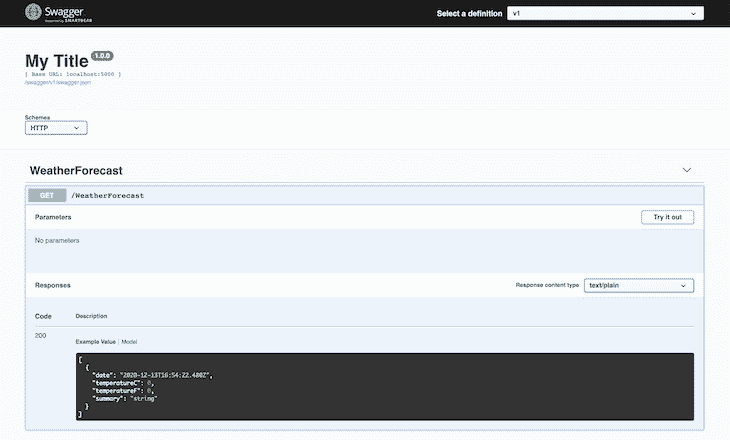
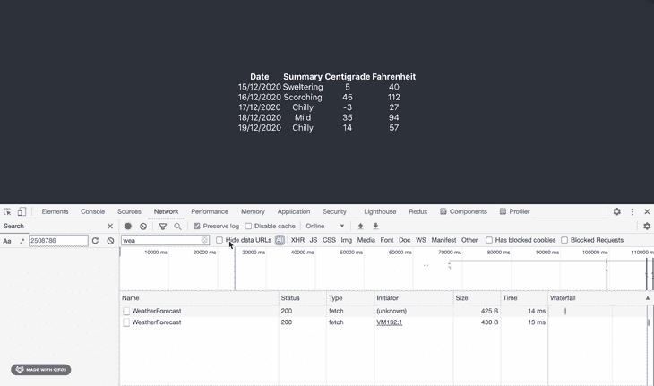

# 基于 API - LogRocket 博客使用 NSwag 生成 TypeScript 和 C#客户端

> 原文：<https://blog.logrocket.com/generate-typescript-csharp-clients-nswag-api/>

为 API 生成客户端是减少您在构建项目时必须做的工作量的一个巨大方法。当代码可以通过像 [NSwag](https://github.com/RicoSuter/NSwag) 这样的工具快速准确地自动生成时，为什么还要手写呢？引用文档:

> NSwag 项目提供了从现有的 ASP.NET Web API 控制器生成 OpenAPI 规范的工具，以及从这些 OpenAPI 规范生成客户端代码的工具。该项目在一个工具链中结合了 Swashbuckle (OpenAPI/Swagger 生成)和 AutoRest(客户端生成)的功能。

有一些很棒的帖子向您展示了如何使用直接来自. NET 项目的`nswag.json`文件用 NSwag 生成客户端。

但是，如果您想纯粹为了它的客户机生成功能而使用 NSwag，该怎么办呢？您可能有一个用另一种语言/平台编写的 API，它公开了一个 Swagger 端点，您只是希望为它创建一个客户端。你是怎么做到的？

此外，如果您想对正在生成的客户端进行一些特殊的定制，您可能会发现自己很难在`nswag.json`中进行配置。在这种情况下，可以用一个简单的。NET 控制台应用程序。

为了寻找上述问题的答案，本帖将:

*   创建一个公开 Swagger 端点的. NET API(或者，您可以使用任何其他的 Swagger 端点；[例如，Express API](https://blog.logrocket.com/documenting-your-express-api-with-swagger/)
*   创建一个可以从 Swagger 端点创建 TypeScript 和 C#客户端的. NET 控制台应用程序
*   创建一个脚本，该脚本在运行时创建一个 TypeScript 客户端
*   在简单的 TypeScript 应用程序中使用生成的客户端来使用 API

在继续之前，请注意，您将同时需要 [Node.js](https://nodejs.org/en/) 和[。NET SDK](https://dotnet.microsoft.com/download) 安装完毕。

## 创建一个 API

我们现在将创建一个 API 来公开一个 [Swagger/OpenAPI](https://swagger.io/resources/open-api/) 端点。在我们这样做的同时，我们将创建一个 TypeScript React 应用程序，供我们稍后使用。我们将转到命令行并输入以下命令，这些命令使用。NET SDK、节点和`create-react-app`包:

```
mkdir src
cd src
npx create-react-app client-app --template typescript
mkdir server-app
cd server-app
dotnet new api -o API
cd API
dotnet add package NSwag.AspNetCore
```

我们现在有了一个依赖于 NSwag 的. NET API。我们将开始使用它，用以下内容替换已经生成的`Startup.cs`:

```
using Microsoft.AspNetCore.Builder;
using Microsoft.AspNetCore.Hosting;
using Microsoft.Extensions.Configuration;
using Microsoft.Extensions.DependencyInjection;
using Microsoft.Extensions.Hosting;

namespace API
{
    public class Startup
    {
        const string ALLOW_DEVELOPMENT_CORS_ORIGINS_POLICY = "AllowDevelopmentSpecificOrigins";
        const string LOCAL_DEVELOPMENT_URL = "http://localhost:3000";

        public Startup(IConfiguration configuration)
        {
            Configuration = configuration;
        }

        public IConfiguration Configuration { get; }

        // This method gets called by the runtime. Use this method to add services to the container.
        public void ConfigureServices(IServiceCollection services)
        {

            services.AddControllers();

            services.AddCors(options => {
                options.AddPolicy(name: ALLOW_DEVELOPMENT_CORS_ORIGINS_POLICY,
                    builder => {
                        builder.WithOrigins(LOCAL_DEVELOPMENT_URL)
                            .AllowAnyMethod()
                            .AllowAnyHeader()
                            .AllowCredentials();
                    });
            });

            // Register the Swagger services
            services.AddSwaggerDocument();
        }

        // This method gets called by the runtime. Use this method to configure the HTTP request pipeline.
        public void Configure (IApplicationBuilder app, IWebHostEnvironment env)
        {
            if (env.IsDevelopment())
            {
                app.UseDeveloperExceptionPage();
            } 
            else
            {
                app.UseExceptionHandler("/Error");
                // The default HSTS value is 30 days. You may want to change this for production scenarios, see https://aka.ms/aspnetcore-hsts.
                app.UseHsts ();
                app.UseHttpsRedirection();
            }

            app.UseDefaultFiles();
            app.UseStaticFiles();

            app.UseRouting();

            app.UseAuthorization();

            // Register the Swagger generator and the Swagger UI middlewares
            app.UseOpenApi();
            app.UseSwaggerUi3();

            if (env.IsDevelopment())
                app.UseCors(ALLOW_DEVELOPMENT_CORS_ORIGINS_POLICY);

            app.UseEndpoints(endpoints =>
            {
                endpoints.MapControllers();
            });
        }
    }
}

```

上述`Startup.cs`中需要注意的重大变化有:

1.  用`UseOpenApi`和`UseSwaggerUi3`公开一个 Swagger 端点。NSwag 将在您的应用程序中为所有控制器自动创建 Swagger 端点。的。NET 模板附带了一个`WeatherForecastController`。
2.  允许[跨来源请求(CORS)](https://docs.microsoft.com/en-us/aspnet/core/security/cors) ，这在开发过程中很有用(并且将有助于以后的演示)。

回到我们项目的根目录，我们将初始化一个 npm 项目。我们将使用它来放置一些方便的 [`npm scripts`](https://docs.npmjs.com/cli/v6/using-npm/scripts) ，这将使我们的项目更容易工作。所以我们将`npm init`并接受所有的默认值。

现在我们要添加一些我们的脚本将会用到的依赖项:`npm install cpx cross-env npm-run-all start-server-and-test`

我们还会给自己的`package.json`加上一些`scripts`:

```
  "scripts": {
    "postinstall": "npm run install:client-app && npm run install:server-app",
    "install:client-app": "cd src/client-app && npm install",
    "install:server-app": "cd src/server-app/API && dotnet restore",
    "build": "npm run build:client-app && npm run build:server-app",
    "build:client-app": "cd src/client-app && npm run build",
    "postbuild:client-app": "cpx \"src/client-app/build/**/*.*\" \"src/server-app/API/wwwroot/\"",
    "build:server-app": "cd src/server-app/API && dotnet build --configuration release",
    "start": "run-p start:client-app start:server-app",
    "start:client-app": "cd src/client-app && npm start",
    "start:server-app": "cross-env ASPNETCORE_URLS=http://*:5000 ASPNETCORE_ENVIRONMENT=Development dotnet watch --project src/server-app/API run --no-launch-profile"
  }
```

让我们看看上面的脚本为我们提供了什么。在我们项目的根中运行`npm install`不仅会为我们的根`package.json`安装依赖项。感谢我们的`postinstall`、`install:client-app`和`install:server-app`脚本，它将安装 React 应用程序和。NET 应用程序依赖项。

运行`npm run build`将构建我们的客户端和服务器应用程序，运行`npm run start`将启动我们的 React 应用程序和我们的。NET app。我们的 React 应用程序将在`[http://localhost:3000](http://localhost:3000)`启动。我们的。NET app 将在`[http://localhost:5000](http://localhost:5000)`启动(一些环境变量用 [`cross-env`](https://github.com/kentcdodds/cross-env) 传递给它)。

一旦运行了`npm run start`，您将在`[http://localhost:5000/swagger](http://localhost:5000/swagger)`找到一个大摇大摆的端点:



## 客户端生成器项目

既然我们已经搭建了我们的大摇大摆的 API，我们想把控制台应用程序放在一起，它将生成我们的类型化客户端。

```
cd src/server-app
dotnet new console -o APIClientGenerator
cd APIClientGenerator
dotnet add package NSwag.CodeGeneration.CSharp
dotnet add package NSwag.CodeGeneration.TypeScript
dotnet add package NSwag.Core
```

我们现在有了一个控制台应用程序，它依赖于 NSwag 的代码生成部分。让我们改变一下`Program.cs`来利用这一点:

```
using System;
using System.IO;
using System.Threading.Tasks;
using NJsonSchema;
using NJsonSchema.CodeGeneration.TypeScript;
using NJsonSchema.Visitors;
using NSwag;
using NSwag.CodeGeneration.CSharp;
using NSwag.CodeGeneration.TypeScript;

namespace APIClientGenerator
{
    class Program
    {
        static async Task Main(string[] args)
        {
            if (args.Length != 3)
                throw new ArgumentException("Expecting 3 arguments: URL, generatePath, language");

            var url = args[0];
            var generatePath = Path.Combine(Directory.GetCurrentDirectory(), args[1]);
            var language = args[2];

            if (language != "TypeScript" && language != "CSharp")
                throw new ArgumentException("Invalid language parameter; valid values are TypeScript and CSharp");

            if (language == "TypeScript") 
                await GenerateTypeScriptClient(url, generatePath);
            else
                await GenerateCSharpClient(url, generatePath);
        }

        async static Task GenerateTypeScriptClient(string url, string generatePath) =>
            await GenerateClient(
                document: await OpenApiDocument.FromUrlAsync(url),
                generatePath: generatePath,
                generateCode: (OpenApiDocument document) =>
                {
                    var settings = new TypeScriptClientGeneratorSettings();

                    settings.TypeScriptGeneratorSettings.TypeStyle = TypeScriptTypeStyle.Interface;
                    settings.TypeScriptGeneratorSettings.TypeScriptVersion = 3.5M;
                    settings.TypeScriptGeneratorSettings.DateTimeType = TypeScriptDateTimeType.String;

                    var generator = new TypeScriptClientGenerator(document, settings);
                    var code = generator.GenerateFile();

                    return code;
                }
            );

        async static Task GenerateCSharpClient(string url, string generatePath) =>
            await GenerateClient(
                document: await OpenApiDocument.FromUrlAsync(url),
                generatePath: generatePath,
                generateCode: (OpenApiDocument document) =>
                {
                    var settings = new CSharpClientGeneratorSettings
                    {
                        UseBaseUrl = false
                    };

                    var generator = new CSharpClientGenerator(document, settings);
                    var code = generator.GenerateFile();
                    return code;
                }
            );

        private async static Task GenerateClient(OpenApiDocument document, string generatePath, Func<OpenApiDocument, string> generateCode)
        {
            Console.WriteLine($"Generating {generatePath}...");

            var code = generateCode(document);

            await System.IO.File.WriteAllTextAsync(generatePath, code);
        }
    }
}
```

我们为自己创造了一个简单的。NET 控制台应用程序，它为给定的 Swagger URL 创建 TypeScript 和 C#客户端。它需要三个参数:

*   `url`–为其生成客户端的`swagger.json`文件的 URL
*   `generatePath`–生成的客户端文件应放置的路径，相对于此项目
*   `language`–客户端生成的语言；有效值为“TypeScript”和“CSharp”

要用它创建一个 TypeScript 客户机，我们可以使用下面的命令:

```
dotnet run --project src/server-app/APIClientGenerator http://localhost:5000/swagger/v1/swagger.json src/client-app/src/clients.ts TypeScript
```

然而，为了成功运行，我们首先必须确保 API 正在运行。如果我们有一个可以运行的命令，那就太好了:

*   调出 API
*   生成客户端
*   关闭 API

让我们做那个。

## 构建“创建客户端”脚本

在项目的根目录中，我们将添加下面的`scripts`:

```
    "generate-client:server-app": "start-server-and-test generate-client:server-app:serve http-get://localhost:5000/swagger/v1/swagger.json generate-client:server-app:generate",
    "generate-client:server-app:serve": "cross-env ASPNETCORE_URLS=http://*:5000 ASPNETCORE_ENVIRONMENT=Development dotnet run --project src/server-app/API --no-launch-profile",
    "generate-client:server-app:generate": "dotnet run --project src/server-app/APIClientGenerator http://localhost:5000/swagger/v1/swagger.json src/client-app/src/clients.ts TypeScript",
```

让我们看看这里发生了什么。运行`npm run generate-client:server-app`将使用`[start-server-and-test](https://github.com/bahmutov/start-server-and-test)`包通过运行`generate-client:server-app:serve`脚本来加速我们的`server-app`。

`start-server-and-test`等待 Swagger 端点开始响应请求。当它开始响应时，`start-server-and-test`运行`generate-client:server-app:generate`脚本，该脚本运行我们的 APIClientGenerator 控制台应用程序，并向它提供可以找到我们的 Swagger 的 URL、要生成的文件的路径以及“类型脚本”的语言

如果你想生成一个 C#客户端——比方说，如果你正在[编写一个 Blazor 应用程序](https://blog.logrocket.com/js-free-frontends-blazor/)——那么你可以如下修改`generate-client:server-app:generate`脚本:

```
   "generate-client:server-app:generate": "dotnet run --project src/server-app/ApiClientGenerator http://localhost:5000/swagger/v1/swagger.json clients.cs CSharp",
```

## 消费我们生成的 API 客户端

让我们运行`npm run generate-client:server-app`命令。它创建了一个`clients.ts`文件，这个文件很好地放在我们的`client-app`中。我们一会儿会练习一下。

首先，让我们按照 [create-react-app 文档](https://create-react-app.dev/docs/proxying-api-requests-in-development/)中的说明启用从我们的`client-app`到我们的`server-app`的代理，并将以下内容添加到我们的`client-app/package.json`:

```
  "proxy": "http://localhost:5000"
```

现在让我们用`npm run start`启动我们的应用程序。然后我们将把`App.tsx`的内容替换为:

```
import React from "react";
import "./App.css";
import { WeatherForecast, WeatherForecastClient } from "./clients";

function App() {
  const [weather, setWeather] = React.useState<WeatherForecast[] | null>();
  React.useEffect(() => {
    async function loadWeather() {
      const weatherClient = new WeatherForecastClient(/* baseUrl */ "");
      const forecast = await weatherClient.get();
      setWeather(forecast);
    }
    loadWeather();
  }, [setWeather]);

  return (
    <div className="App">
      <header className="App-header">
        {weather ? (
          <table>
            <thead>
              <tr>
                <th>Date</th>
                <th>Summary</th>
                <th>Centigrade</th>
                <th>Fahrenheit</th>
              </tr>
            </thead>
            <tbody>
              {weather.map(({ date, summary, temperatureC, temperatureF }) => (
                <tr key={date}>
                  <td>{new Date(date).toLocaleDateString()}</td>
                  <td>{summary}</td>
                  <td>{temperatureC}</td>
                  <td>{temperatureF}</td>
                </tr>
              ))}
            </tbody>
          </table>
        ) : (
          <p>Loading weather...</p>
        )}
      </header>
    </div>
  );
}

export default App;
```

在上面的`React.useEffect`中，您可以看到我们创建了自动生成的`WeatherForecastClient`的一个新实例。然后我们调用`weatherClient.get()`，它向服务器发送`GET`请求以获取数据，并以强类型的方式提供数据(`get()`返回一个数组`WeatherForecast`)。页面上显示如下:



如您所见，我们正在使用自动生成的客户端从服务器加载数据。我们正在减少我们必须编写的代码量*和*我们正在减少出错的可能性。

## [LogRocket](https://lp.logrocket.com/blg/typescript-signup) :全面了解您的网络和移动应用

[](https://lp.logrocket.com/blg/typescript-signup)

LogRocket 是一个前端应用程序监控解决方案，可以让您回放问题，就像问题发生在您自己的浏览器中一样。LogRocket 不需要猜测错误发生的原因，也不需要向用户询问截图和日志转储，而是让您重放会话以快速了解哪里出错了。它可以与任何应用程序完美配合，不管是什么框架，并且有插件可以记录来自 Redux、Vuex 和@ngrx/store 的额外上下文。

除了记录 Redux 操作和状态，LogRocket 还记录控制台日志、JavaScript 错误、堆栈跟踪、带有头+正文的网络请求/响应、浏览器元数据和自定义日志。它还使用 DOM 来记录页面上的 HTML 和 CSS，甚至为最复杂的单页面和移动应用程序重新创建像素级完美视频。

[Try it for free](https://lp.logrocket.com/blg/typescript-signup)

.