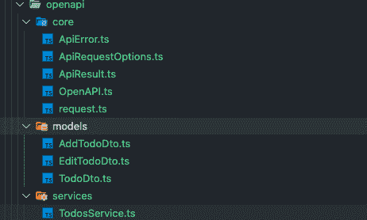
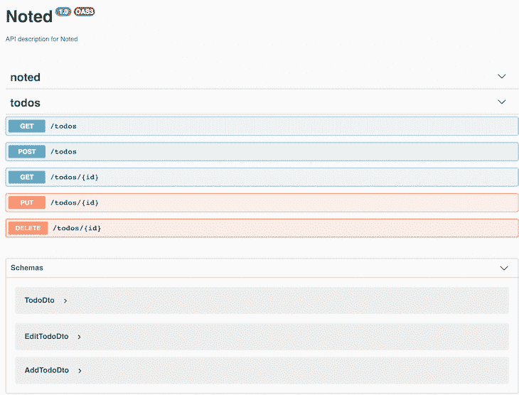

# 在 React app 中生成和集成 OpenAPI 服务

> 原文：<https://blog.logrocket.com/generating-integrating-openapi-services-react/>

从不同来源生产和消费 API 是每个现代 web 应用程序的基础。在客户端，它是我们与服务器通信并不断更新应用程序状态的方式。

HTTP 服务的 REST APIs 可以说是目前最常见的交换形式。它们以 JSON 格式提供了一种简单的交换形式。我们可以通过一个简单的`curl`或`fetch`很容易地与服务器通信。

我认为与服务器的集成和通信应该尽可能直观，然而，在使用 GraphQL 和 Apollo 之后，这一点变得尤为明显。准确地知道调用什么服务，如何调用，以及期望什么结果，极大地提高了我们前端工程师的效率和生产力。

在本教程中，我们将了解如何从服务器集成 OpenAPI 生成的服务，然后在 React 应用程序中使用该生成的服务。使用像 Django、Rails、Spring 或 NestJS 这样的 web 框架，我们可以通过我们的应用程序代码轻松地生成 OpenAPI 定义。

然而， [OpenAPI 规范](https://swagger.io/specification/)(以前的 Swagger 规范)是框架不可知的，可以用来生成关于路由、数据类型等的信息。OpenAPI 作为一种可靠的交换格式，帮助 API 元数据在不同语言之间进行转换。

### 本教程的目标

你应该从这篇文章中学到什么？给定一个 OpenAPI (JSON 或 YAML)端点，我们希望生成:

*   用于数据传输对象(DTO)的接口，即用于调用特定端点的接口
*   我们可以用来与 API 交互的服务

生成的服务应该包括所有公开的路由；通信所需的所有数据类型；所有必需/可选参数的详尽列表；重要的是，调用返回的数据类型。

我们将通过让服务器生成与端点通信的所有服务来做到这一点。这为前端工程师提供了三个关键优势:

*   消除了编写调用 API 所需的所有样板代码的需要
*   让客户端清楚地了解服务器可以处理的所有交互
*   透明性——当服务器发生变化时，客户端总是会知道

我们将通过建立一个简单的待办事项列表来亲眼目睹这一切。事不宜迟，让我们进入教程中更技术性的部分。以下是我们将涵盖的内容的概要:

## 什么是 OpenAPI 规范？

根据文件:

> OpenAPI 规范(OAS)为 RESTful APIs 定义了一个标准的、与语言无关的接口。正确定义后，消费者可以用最少的实现逻辑理解远程服务并与之交互。

OAS 使得可视化服务的能力变得容易。使用像 Swagger 这样的文档生成器，您可以生成一个 UI 来测试 API 调用。下面是我们将与之交互的`todo`服务器的一个例子。



Generated code from the codegen.

## 用 Swagger Codegen 为我们的 REST API 生成 Swagger 文档

在这个示例服务器中，我将 NestJS 与 Swagger 一起使用。服务器实现语言和细节无关紧要——只要我们实现了 OpenAPI 规范和 Swagger UI，我们最终会得到相同的结果。

让我们快速浏览一下服务器代码。我们把它保持在最低限度，因为这不是这里的要点。尽管如此，我们还是从服务器端来看服务，这样我们就可以很容易地获得接口、API 函数等。转移到客户端。完整代码可以在 [this GitHub repo](https://github.com/LogRocket-Tutorials/OpenAPI/tree/main/nestjs-noted) 中找到。

一些代码是特定于 NestJS 的，但是完全理解它们并不重要；对正在发生的事情有一个大概的了解就足够了。我将展示代码并遍历它—准备好了吗？提醒一下，这是创建、读取、更新和删除(CRUD)函数的待办事项:

```
import { TodoService } from './../services/todo/todo.service';
import { TodoDto, AddTodoDto, EditTodoDto } from './../dto';

import {
  Controller,
  Get,
  Param,
  Post,
  Put,
  Body,
  Delete,
} from '@nestjs/common';
import { ApiResponse, ApiTags } from '@nestjs/swagger';

@ApiTags('todos')
@Controller('todos')
export class TodoController {
  public constructor(private readonly todoService: TodoService) {}

  @Get()
  @ApiResponse({
    status: 200,
    description: 'Found todo',
    type: [TodoDto],
  })
  public findAll(): Promise<TodoDto[]> {
    return this.todoService.findAll();
  }

  @Get(':id')
  public findOne(@Param('id') id: number): Promise<TodoDto> {
    return this.todoService.findOne(id);
  }

  @Put(':id')
  public edit(
    @Param('id') id: number,
    @Body() todo: EditTodoDto,
  ): Promise<TodoDto> {
    return this.todoService.edit(id, todo);
  }

  @Post()
  public add(@Body() todo: AddTodoDto): Promise<TodoDto> {
    return this.todoService.add(todo);
  }

  @Delete(':id')
  public remove(@Param('id') id: number): Promise<TodoDto> {
    return this.todoService.remove(id);
  }
}
```

在上面的代码中，你会很快注意到一个模式——我们有一堆`public`方法。他们的名字都很清楚他们是做什么的。注意到其他特征了吗？

再来看`findAll`。显然，这找到了所有可用的`todos`；它不需要任何参数，只是调用`todoService.findAll()`。`todoService`的完整代码可以在[这里](https://github.com/LogRocket-Tutorials/OpenAPI/tree/main/nestjs-noted/src/todo/services)找到，但是我们再一次不关心实现细节，只关心它期望什么参数和它返回什么。

当我们查看`edit`时，我们可以看到它期望一个`id`和一个类型为`EditTodoDto`的`post body DTO`。有了这些，我们可以将端点映射到上面的 Swagger UI。

既然我们已经看到了服务器的样子，那么我们如何在前端生成模拟服务器中所有公共方法的服务呢？为了演示这一点，我们将用 TypeScript 为客户端创建一个简单的待办事项。

## 在我们的 React 前端生成 API 文档、数据类型和 CRUD 服务

### 创建 React 类型脚本应用程序

让我们创建我们的笔记应用程序——我们称之为笔记😉。这将生成所有带有用于状态管理的 Redux 工具包的样板文件。

```
npx create-react-app noted --template redux-typescript
//or
yarn create-react-app noted --template redux-typescript
```

在我们做任何事情之前，让我们从服务器端点生成服务。为此，我们将使用`openapi-typescript`和`openapi-typescript-codegen`。让我们先安装它们。

```
yarn add openapi-typescript openapi-typescript-codegen. --dev
// or
npm i  openapi-typescript openapi-typescript-codegen -D
```

但是我们如何让他们做任何工作呢？我们如何连接到服务器？为此我们需要一个正在运行的服务器，所以为了方便起见，运行我们之前用`yarn start`创建的 NestJS 服务器。

现在我们有了一个正在运行的服务器，我们将创建一个脚本来为服务器端点提取服务。我们也可以使用下载的 JSON 或 YAML。

您的服务器应该运行在端口`-3000`上。现在运行:

```
openapi -i http://localhost:3000/api-json -o src/services/openapi
```

我们将把它作为一个脚本添加到我们的`package.json`中，以便于参考，或者作为一个预提交钩子:

```
"types:openapi": "openapi -i http://localhost:3000/api-json -o src/services/openapi"
```

这些命令告诉生成器在`src/services/openapi`中生成`openApi`服务。所有其他标签和命令都可以在[文档](https://www.npmjs.com/package/openapi-typescript-codegen)中找到。

如果我们查看`src/services/openapi`内部，我们可以看到所有生成的代码:



todo-nestjs Swagger documentation.

特别感兴趣的是`models`，它提供与 API 接口所需的所有类型，以及`TodoService.ts`，它提供所有服务，就像我们在服务器中看到的那些。让我们看一眼。

```
import type { AddTodoDto } from "../models/AddTodoDto";
import type { EditTodoDto } from "../models/EditTodoDto";
import type { TodoDto } from "../models/TodoDto";
import { request as __request } from "../core/request";

export class TodosService {

  public static async findAll(): Promise<Array<TodoDto>> {
    const result = await __request({
      method: "GET",
      path: `/todos`,
    });
    return result.body;
  }

  public static async add(requestBody: AddTodoDto): Promise<any> {
    const result = await __request({
      method: "POST",
      path: `/todos`,
      body: requestBody,
    });
    return result.body;
  }

  public static async findOne(id: number): Promise<any> {
    const result = await __request({
      method: "GET",
      path: `/todos/${id}`,
    });
    return result.body;
  }

  public static async edit(id: number, requestBody: EditTodoDto): Promise<any> {
    const result = await __request({
      method: "PUT",
      path: `/todos/${id}`,
      body: requestBody,
    });
    return result.body;
  }

  public static async remove(id: number): Promise<any> {
    const result = await __request({
      method: "DELETE",
      path: `/todos/${id}`,
    });
    return result.body;
  }
}
```

正如我们所看到的，这些都与服务器中的服务相同，都不需要键入任何代码。是不是很牛逼？请注意，所有正确的参数类型以及返回类型都已被正确映射。我们可以查看`src/services/openapi/core.request.ts`来更好地理解 API 调用是如何形成的。

就这样——我们已经生成了进行 API 调用所需的代码。接下来，我们将介绍如何使用这些生成的代码服务。

### 在我们的应用程序中集成生成的服务和类型

> 为了简洁起见，我们将查看执行特定 API 调用的代码片段，而不是整个应用程序。待办事项的完整代码可以在[这里](https://github.com/LogRocket-Tutorials/OpenAPI)找到。

现在是有趣的部分。我们如何使用这些生成的服务？

我们有很多方法可以做到这一点:我们可以创建一个钩子来包装应用程序中的请求和调用；对于 Redux Toolkit，我们可以在 thunk 内部调用它们。让我们来探究这两个例子。

首先，我们将创建一个可重用的包装器；我们可以随便叫它什么。事情是这样的:

```
import {
  AddTodoDto,
  EditTodoDto,
  OpenAPI,
  TodoDto,
  TodosService,
} from '../openapi';

const { add, edit, findAll, findOne, remove } = TodosService;

OpenAPI.BASE = 'http://localhost:3000';

export const getTodos = async () => {
  try {
    const todos: TodoDto[] = await findAll();
    return todos;
  } catch (error) {
    throw new Error(error);
  }
};

export const getTodoById = async (id: number): Promise<TodoDto> => {
  try {
    return await findOne(id);
  } catch (error) {
    throw new Error(error);
  }
};

export const addTodo = async (newTodo: AddTodoDto): Promise<TodoDto> => {
  try {
    return await add(newTodo);
  } catch (error) {
    throw new Error(error);
  }
};

export const updateTodo = async (
  id: number,
  todo: EditTodoDto
): Promise<TodoDto> => {
  try {
    return await edit(id, todo);
  } catch (error) {
    throw new Error(error);
  }
};

export const deleteTodo = async (id: number) => {
  try {
    await remove(id);
  } catch (error) {
    throw new Error(error);
  }
};
```

在应用程序内部，我们可以调用`findAll()` —例如，在一个`useEffect`内部。稍后我们将看一个更具体的例子。但是首先，请注意我们这样做的那一行:

```
OpenAPI.BASE = 'http://localhost:3000';
```

我们在这里所做的是将生成的客户端的基本 URL 设置为`[http://localhost:3000](http://localhost:3000)`。这是微不足道的，但是让我们假设我们想要在我们的应用程序中设置一些默认值，比如授权头等。

### 为生成的 API 服务配置和设置默认值

我们可以为 OpenAPI 设置一些默认值。预期配置的完整界面如下所示:

```
type Resolver<T> = () => Promise<T>;
type Headers = Record<string, string>;

type Config = {
  BASE: string;
  VERSION: string;
  WITH_CREDENTIALS: boolean;
  TOKEN?: string | Resolver<string>;
  USERNAME?: string | Resolver<string>;
  PASSWORD?: string | Resolver<string>;
  HEADERS?: Headers | Resolver<Headers>;
};

export const OpenAPI: Config = {
  BASE: "",
  VERSION: "1.0",
  WITH_CREDENTIALS: false,
  TOKEN: undefined,
  USERNAME: undefined,
  PASSWORD: undefined,
  HEADERS: undefined,
};
```

假设我们的 API 是受密码保护的。我们可以告诉 codegen 在每次请求之前使用该密码:

```
OpenAPI.PASSWORD = 'my-super-secret-password'
```

或者假设您想要获取一个`token`并将其添加到请求头中。我们会有:

```
const getToken = async () => {
    // Some code that requests a token...
    return 'SOME_TOKEN';
}

OpenAPI.TOKEN = getToken;
// or
const myHeaderObject = {
   ...rest,
   Authorization: `Bearer ${getToken()}`
} 

OpenAPI.HEADERS = {myHeaderObject}
```

### 在我们的 React 应用中使用生成的服务

要使用任何服务，我们只需在应用程序内部调用它们(当然，考虑到我们如何管理状态)。我们待办事项中的一个例子看起来像这样:

```
import React, { useCallback, useEffect, useState } from 'react';
import {AddTodo , TodoItem }from './features/todo';
import { getTodos, addTodo, updateTodo, deleteTodo } from './services/api/todo';
import { AddTodoDto, ApiError, EditTodoDto, TodoDto } from './services/openapi';

import './App.css'

const App = () => {
  const [todos, setTodos] = useState<TodoDto[]>([]);
  const [error, setError] = useState<ApiError|null>();

const  handleSaveTodo=useCallback((e: React.FormEvent, formData: AddTodoDto) =>{
    e.preventDefault();
    addTodo(formData)
      .then((todo) => todo)
      .catch((err) => setError(err));
  },[])

  const handleUpdateTodo = useCallback((id: number, todo: EditTodoDto) => {
    updateTodo(id, todo)
      .then((updatedTodo) => updatedTodo)
      .catch((err) => setError(err));
  },[]);

  const handleDeleteTodo = useCallback((id: number) => {
    deleteTodo(id).catch((err) => setError(err));
  },[]);

  useEffect(() => {
    getTodos()
      .then((allTodos) => setTodos(allTodos))
      .catch((error) => setError(error));
  }, []);

  return (
    <main className='App'>
      <h1>My Todos</h1>
      <AddTodo saveTodo={handleSaveTodo} />
      {todos.map((todo: TodoDto) => (
        <TodoItem
          key={todo.id}
          updateTodo={handleUpdateTodo}
          deleteTodo={handleDeleteTodo}
          todo={todo}
          error={error}
        />
      ))}
    </main>
  );
};

export default App;
```

您可以看到我们只是简单地调用了应用程序内部的服务。我们甚至可以通过创建一个只调用一次的钩子来使我们的应用程序更加简洁，并且我们可以去掉所有在`App.tsx`中的 API 调用。由于这不是本文的重点，我就不详细介绍了，但这肯定有助于我们想象这是多么强大而具有可塑性:

```
import { useCallback, useState } from 'react'
import { ApiError, OpenAPI } from '../services/openapi'

export function useApi() {
  const [error, setError] = useState<ApiError | undefined>(undefined)
  const [isLoading, setIsloading] = useState<boolean>(true)

  OpenAPI.BASE = process.env.REACT_APP_API_ENDPOINT as string
  const handleRequest = useCallback(async function <T>(request: Promise<T>) {
    setIsloading(true)
    try {
      const response = await request
      setError(undefined)
      return response
    } catch (error) {
      setError(error)
    } finally {
      setIsloading(true)
    }
  }, [])

  function dismissError() {
    setError(undefined)
  }

  return { dismissError, error, isLoading, handleRequest }
}

export default useApi
```

同样，完整的代码实现可以在[这里](https://github.com/LogRocket-Tutorials/OpenAPI)找到。

## 结论

这就是我们要做的——从后端生成 OpenAPI 服务的详细演练。我们在这种情况下使用了 NestJS，但是这个过程是与框架无关的。

我们以 React 应用程序为例，探讨了如何在客户端生成相应的服务功能。我们看到了从服务器获得底层服务、类型和接口如何使前端工程师的工作变得更加容易。尤其是使用 TypeScript，我们能够获得提供可预测性和透明性的类型安全系统的好处。

## [LogRocket](https://lp.logrocket.com/blg/react-signup-general) :全面了解您的生产 React 应用

调试 React 应用程序可能很困难，尤其是当用户遇到难以重现的问题时。如果您对监视和跟踪 Redux 状态、自动显示 JavaScript 错误以及跟踪缓慢的网络请求和组件加载时间感兴趣，

[try LogRocket](https://lp.logrocket.com/blg/react-signup-general)

.

[ ](https://lp.logrocket.com/blg/react-signup-general) [](https://lp.logrocket.com/blg/react-signup-general) 

LogRocket 结合了会话回放、产品分析和错误跟踪，使软件团队能够创建理想的 web 和移动产品体验。这对你来说意味着什么？

LogRocket 不是猜测错误发生的原因，也不是要求用户提供截图和日志转储，而是让您回放问题，就像它们发生在您自己的浏览器中一样，以快速了解哪里出错了。

不再有嘈杂的警报。智能错误跟踪允许您对问题进行分类，然后从中学习。获得有影响的用户问题的通知，而不是误报。警报越少，有用的信号越多。

LogRocket Redux 中间件包为您的用户会话增加了一层额外的可见性。LogRocket 记录 Redux 存储中的所有操作和状态。

现代化您调试 React 应用的方式— [开始免费监控](https://lp.logrocket.com/blg/react-signup-general)。

## [LogRocket](https://lp.logrocket.com/blg/typescript-signup) :全面了解您的网络和移动应用

[](https://lp.logrocket.com/blg/typescript-signup)

LogRocket 是一个前端应用程序监控解决方案，可以让您回放问题，就像问题发生在您自己的浏览器中一样。LogRocket 不需要猜测错误发生的原因，也不需要向用户询问截图和日志转储，而是让您重放会话以快速了解哪里出错了。它可以与任何应用程序完美配合，不管是什么框架，并且有插件可以记录来自 Redux、Vuex 和@ngrx/store 的额外上下文。

除了记录 Redux 操作和状态，LogRocket 还记录控制台日志、JavaScript 错误、堆栈跟踪、带有头+正文的网络请求/响应、浏览器元数据和自定义日志。它还使用 DOM 来记录页面上的 HTML 和 CSS，甚至为最复杂的单页面和移动应用程序重新创建像素级完美视频。

[Try it for free](https://lp.logrocket.com/blg/typescript-signup)

.