# 使用 react-pdf - LogRocket 博客在 React 中生成 pdf

> 原文：<https://blog.logrocket.com/generating-pdfs-react/>

假设你拥有一家成功的在线企业。在这种情况下，您需要生成发票并通过电子邮件发送给客户。要为每个买方创建收据，您必须执行以下操作:

*   打开您的文字处理器，粘贴用户的个人信息
*   将用户的购买量写入表中并计算总额
*   下载此文件并将其转换为 PDF 格式
*   通过电子邮件将此文档发送给用户

当然，这可能有用。但考虑一下:如果在一天内获得数百个客户，情况会怎样？这将浪费大量的时间和精力，因为你要一遍又一遍地重复同样的过程。那么，我们该如何缓解这个问题呢？

解决这个问题的最好方法是通过使用 API 来自动化这个操作。这就是 [react-pdf](https://react-pdf.org/) 的用武之地。它是一个开源、易用的库，允许开发人员在 React 环境中生成 PDF 文档。

在本文中，您将学习到 [react-pdf](https://react-pdf.org/) 库的基础知识。我们将涵盖以下概念:

## 装置

要安装 react-pdf 包，请运行以下终端命令:

```
npm i @react-pdf/renderer

```

## 简单用法

以下代码块在浏览器中呈现一个基本的 PDF 文档:

```
import {
  Document,
  Page,
  Text,
  View,
  StyleSheet,
  PDFViewer,
} from "@react-pdf/renderer";
// Create styles
const styles = StyleSheet.create({
  page: {
    backgroundColor: "#d11fb6",
    color: "white",
  },
  section: {
    margin: 10,
    padding: 10,
  },
  viewer: {
    width: window.innerWidth, //the pdf viewer will take up all of the width and height
    height: window.innerHeight,
  },
});

// Create Document Component
function BasicDocument() {
  return (
    <PDFViewer style={styles.viewer}>
      {/* Start of the document*/}
      <Document>
        {/*render a single page*/}
        <Page size="A4" style={styles.page}>
          <View style={styles.section}>
            <Text>Hello</Text>
          </View>
          <View style={styles.section}>
            <Text>World</Text>
          </View>
        </Page>
      </Document>
    </PDFViewer>
  );
}
export default BasicDocument;

```

从这段代码中可以得出一些推论:

*   `StyleSheet`模块允许开发者在他们的 PDF 文档上应用 CSS 代码。这里，我们告诉 React 改变页面的背景颜色和字体颜色
*   此外，在`viewer`对象中，我们使用了`width`和`height`属性。因此，这将告诉 react-pdf 我们希望浏览器的 pdf 查看器占据页面上的所有空间
*   顾名思义，`PDFViewer`组件将在浏览器上呈现一个 PDF 查看器

让我们来测试一下！下一步，将`BasicDocument`组件呈现给 DOM，如下所示:

```
import BasicDocument from "./BasicDocument";
function App() {
  return (
    <div className="App">
      <BasicDocument />
    </div>
  );
}
export default App;

```

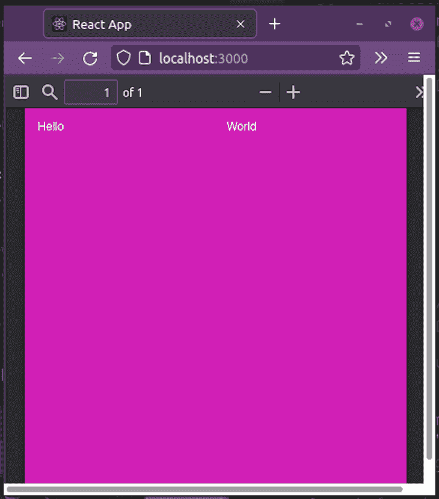

我们甚至可以减少观众的可用空间:

```
const styles = StyleSheet.create({
  viewer: {
    width: window.innerWidth / 3,
    height: window.innerHeight / 2,
  },
  //further code...
});

```

在这个代码片段中，我们限制了视口的`width`和`height`属性。这将减少它们在页面上的可用大小。

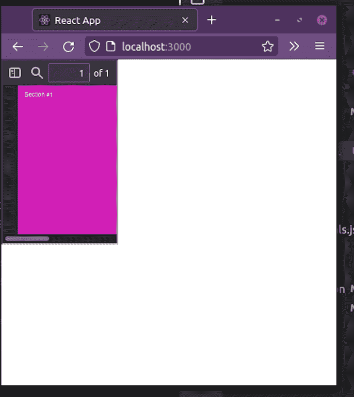

## 基本组件

### 嵌入链接

我们可以使用 [`L`组件](https://react-pdf.org/components#link)显示锚链接。这对于您想要将用户重定向到网站的情况非常方便:

```
import { Link } from "@react-pdf/renderer";
<Text>
  <Link src="www.facebook.com">Go to Facebook</Link>
</Text>

```

这里，我们将`src`道具分配给脸书的网站。当用户点击这段文字时，应用程序会将他们重定向到页面。

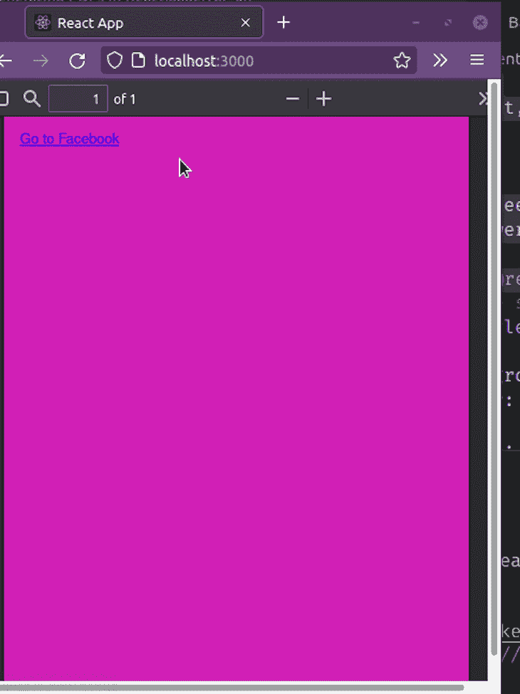

### 显示注释

要在文档中附加注释，请使用 [`Note`](https://react-pdf.org/components#note) 组件。这个元素的一个关键用例是当您需要在文件中显示注释时:

```
import { Note } from "@react-pdf/renderer";
<Note>This will take the user to Facebook</Note>

```

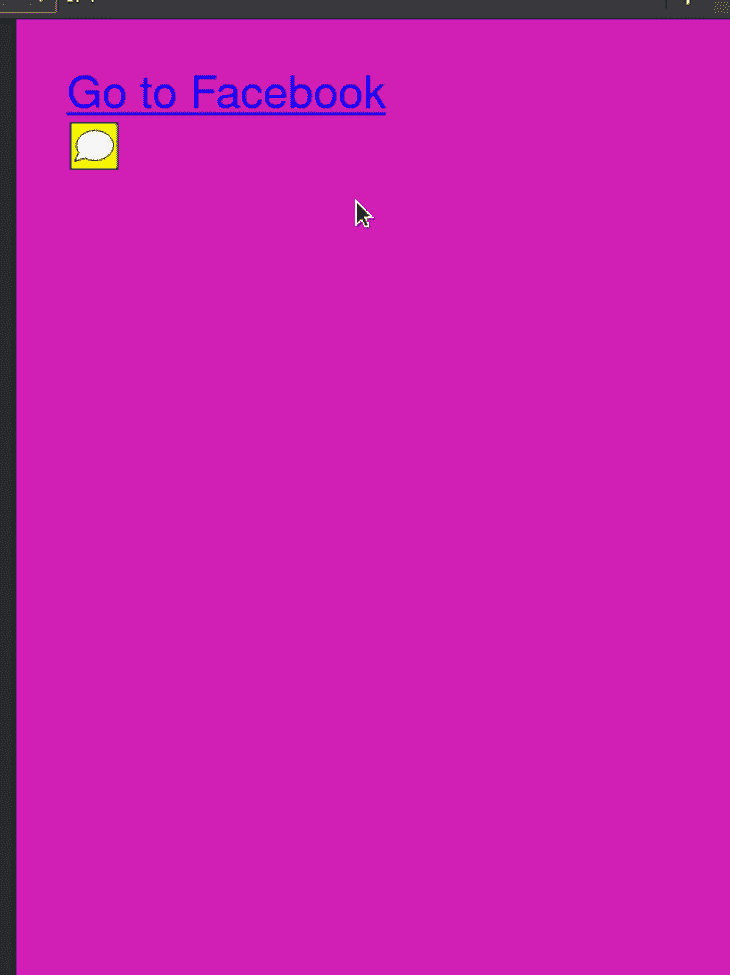

### 在`Canvas`中显示图形

[`Canvas`](https://react-pdf.org/components#canvas) 组件让用户在页面上绘制内容。这适用于显示 SVG 格式的简单图表和徽标。

以下代码片段在页面上呈现一个三角形:

```
import { Canvas } from "@react-pdf/renderer";
// Create styles
const styles = StyleSheet.create({
  canvas: {
    backgroundColor: "black",
    height: 500,
    width: 500,
  },
});
<Canvas
  style={styles.canvas}
  paint={
    (painterObject) =>
      painterObject
        .save()
        .moveTo(100, 100) //move to position 100,100
        .lineTo(300, 100) //draw a line till 300, 100
        .lineTo(300, 300) //draw another line till 300,300
        .fill("red") //when the diagram is drawn, set the background color to pink
  }
/>

```

在上面的代码片段中，我们使用了`Canvas`组件来显示一个图表。`paint`道具是一个回调函数。它的参数之一是一个`painterObject`参数，它让我们可以访问绘图方法。

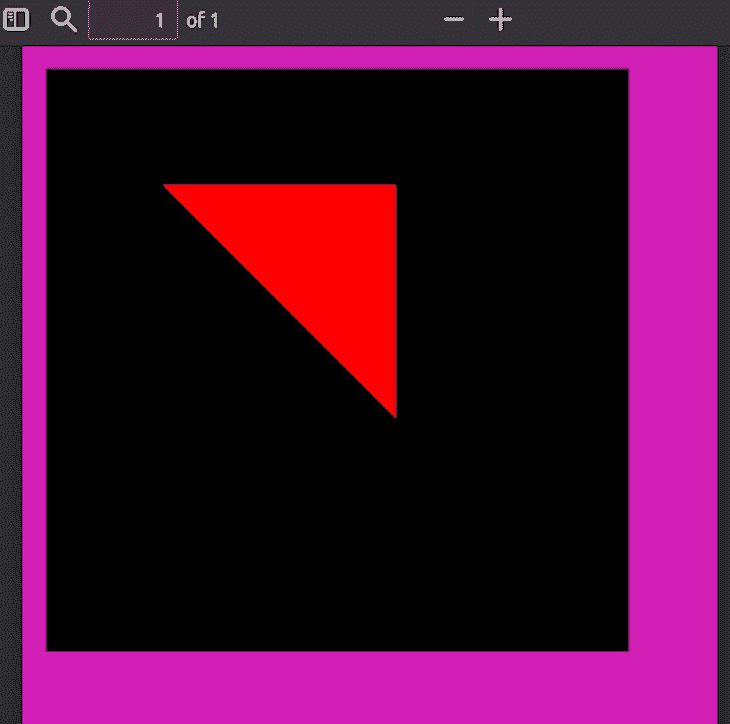

### 显示 SVG 图像

react-pdf 还捆绑了一个 [`SVG`组件](https://react-pdf.org/svg)来呈现 [SVG 图](https://blog.logrocket.com/how-to-use-svgs-in-react/)。就像`Canvas`一样，我们可以用这个来渲染简单的图。

这段代码在页面上呈现了一行:

```
import { Line, Svg } from "@react-pdf/renderer";
// Create styles
const styles = StyleSheet.create({
  line: {
    x1: "0", //starting coords are x1 and y1
    y1: "0",
    x2: "200", //ending coords:
    y2: "200",
    strokeWidth: 2,
    stroke: "rgb(255,255,255)", //stroke color
  },
});
<Svg width={"50%"} height={"50%"} style={{ backgroundColor: "blue" }}>
  <Line style={styles.line} />
</Svg>

```

这里，我们用 [`Line`](https://react-pdf.org/svg#line) 来渲染文档中的一行。注意`Line`是`Svg`组件的子组件。

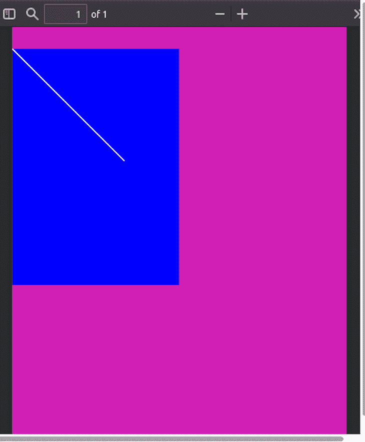

我们也可以使用 [`Polygon`](https://react-pdf.org/svg#polygon) 组件来渲染封闭的形状，如下所示:

```
<Svg width={"50%"} height={"50%"} style={{ backgroundColor: "blue" }}>
  <Polygon
    points="100,100 200,100 200,250 100,250"
    fill="white" //color of background
    stroke="black" //color of border
    strokeWidth={10} //border thickness
  />
</Svg>

```

属性接受一个坐标数据集。这将有助于应用程序渲染图形。

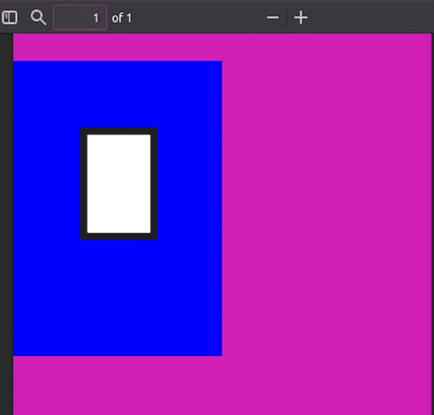

### 渲染 JPG 或 PNG 照片

[`Image`](https://react-pdf.org/components#image) 组件让我们能够通过网络或在本地磁盘上插入图像。这对于显示复杂的图表或截图非常有用。

这段代码在 PDF 上呈现一个 500 x 500 像素的图像:

```
import { Image } from "@react-pdf/renderer";
const styles = StyleSheet.create({
  image: {
    width: 500,
    height: 500,
  },
});
<Image
  style={styles.image}
  src="https://image.shutterstock.com/image-photo/tiny-floating-house-on-lake-600w-1980476267.jpg"
/> 

```

属性包含我们想要渲染的图像的源 URL。

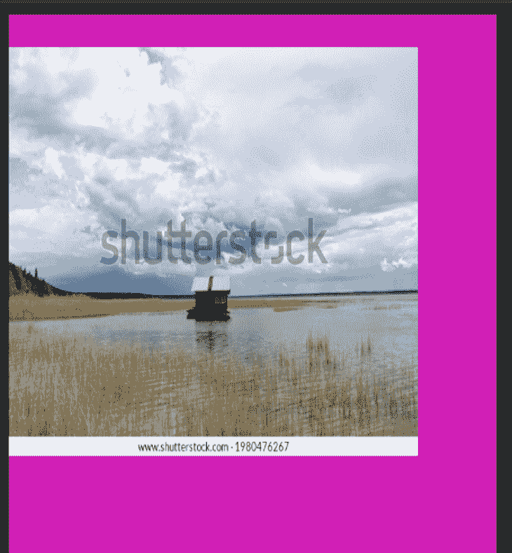

## 高级概念

### 使用伸缩盒

就像 CSS 一样，react-pdf 允许开发人员使用`flex`属性，这允许响应式设计。如果您希望根据设备的屏幕大小放大或缩小文档，这非常方便:

```
// Create styles. Notice that we have specified a flex direction.
const styles = StyleSheet.create({
  page: {
    flexDirection: "column",
  },
});
<Page size="A4" style={styles.page}>
  <View style={{ backgroundColor: "black", flex: 1 }}></View>
  <View style={(styles.section, { backgroundColor: "pink", flex: 1 })}></View>
</Page>

```

在这段代码中，我们在两个`View`组件上使用了`flex`属性。这意味着页面的一半背景颜色为黑色，另一半背景颜色为粉色。

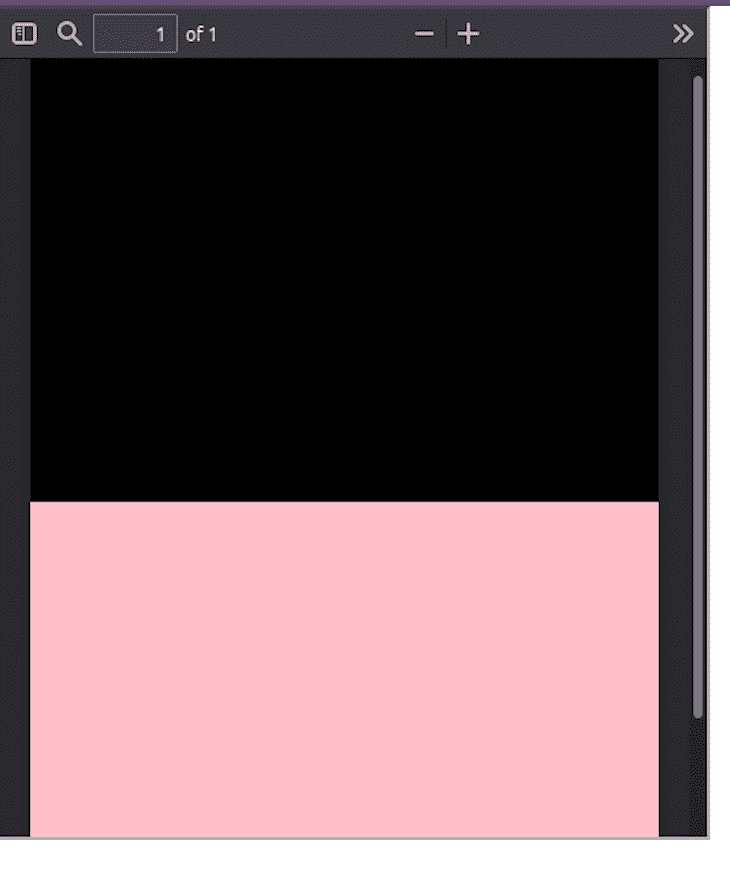

### 分页符

分页符对于确保某个元素总是显示在页面顶部很有用。

我们可以像这样通过`break`属性启用分页符:

```
// Create styles
const styles = StyleSheet.create({
  text: {
    fontSize: 40,
  },
});
// Create Document Component
<Page>
  <Text break style={styles.text}>
    First PDF break
  </Text>
  <Text break style={styles.text}>
    Second break
  </Text>
</Page>

```

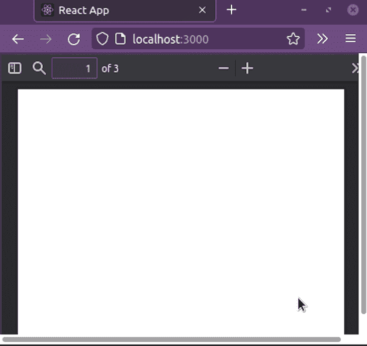

### 动态页面内容

使用 react-pdf，我们可以使用`Text`组件的`render`属性来呈现动态文本，如下所示:

```
<Document>
  <Page size="A4">
    <Text
      style={styles.text}
      render={({ pageNumber, totalPages }) =>
        `Page ${pageNumber} of ${totalPages}`
      }
      fixed
    />
  </Page>
  <Page>
    <Text> Hello, second page!</Text>
  </Page>
</Document>

```

这里，`render`属性有两个参数:`pageNumber`(页面的当前索引)，和`totalPages`(这个文档包含的总页数)。我们向客户展示了它们的价值。

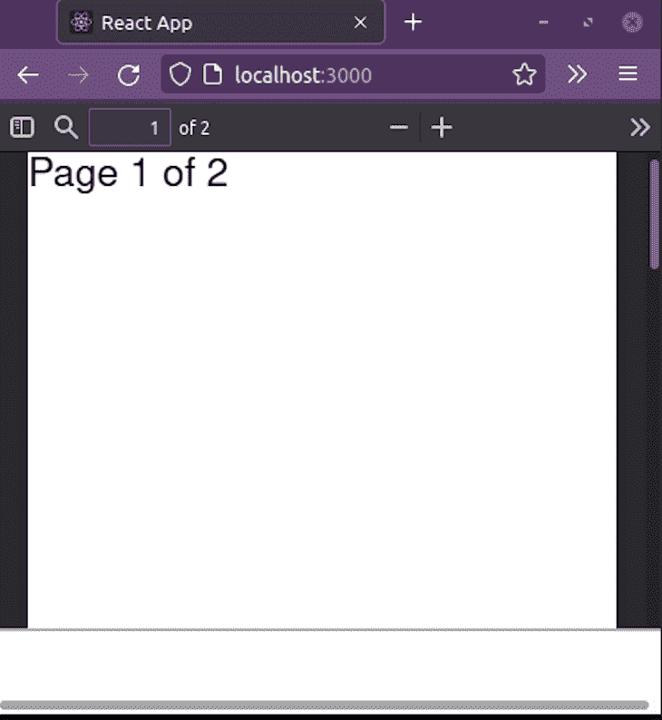

*注意，* `render` *函数对* `<Text />` *元素执行两次:一次用于页面换行过程中的布局，另一次在它知道* *文档将有多少页之后。* *因此，在 app 性能不成问题的情况下使用。*

我们也可以在我们的`View`元素上使用`render`道具:

```
<View render={({ pageNumber }) => (
    //detect if user is NOT on an even page:
        pageNumber % 2 === 0 && (
          <View style={{ background: 'red' }}>
            {/*If condition is fulfilled, display this component*/}
            <Text>I'm only visible in odd pages!</Text>
          </View>
        )
      )} />

```

## 结论

在本文中，我们介绍了 react-pdf 库的基础知识。它不仅安全可靠，而且重量很轻，从而提高了性能。

非常感谢您的阅读！编码快乐！

## 使用 LogRocket 消除传统反应错误报告的噪音

[LogRocket](https://lp.logrocket.com/blg/react-signup-issue-free)

是一款 React analytics 解决方案，可保护您免受数百个误报错误警报的影响，只针对少数真正重要的项目。LogRocket 告诉您 React 应用程序中实际影响用户的最具影响力的 bug 和 UX 问题。

[ ](https://lp.logrocket.com/blg/react-signup-general) [  ](https://lp.logrocket.com/blg/react-signup-general) [LogRocket](https://lp.logrocket.com/blg/react-signup-issue-free)

自动聚合客户端错误、反应错误边界、还原状态、缓慢的组件加载时间、JS 异常、前端性能指标和用户交互。然后，LogRocket 使用机器学习来通知您影响大多数用户的最具影响力的问题，并提供您修复它所需的上下文。

关注重要的 React bug—[今天就试试 LogRocket】。](https://lp.logrocket.com/blg/react-signup-issue-free)