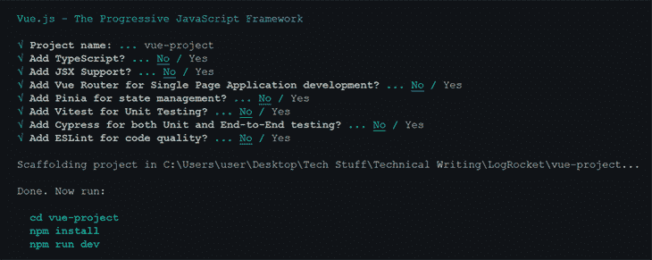
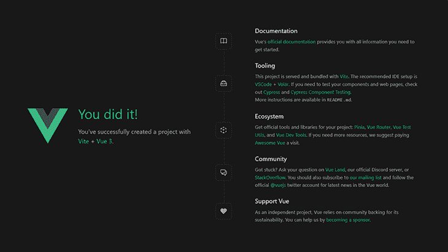
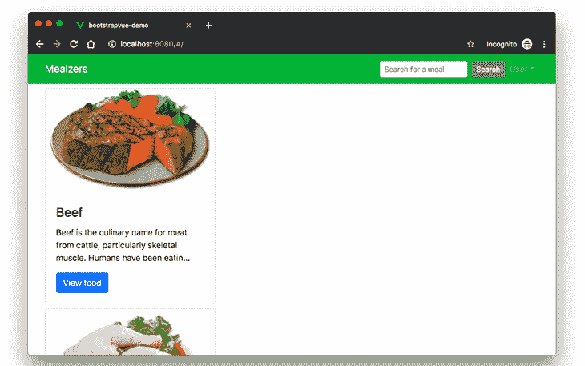
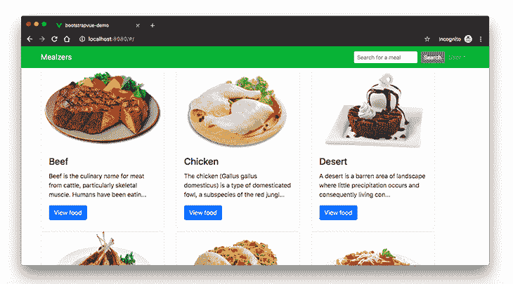

# BootstrapVue - LogRocket 博客入门

> 原文：<https://blog.logrocket.com/getting-started-bootstrapvue/>

***编者按**:这篇文章于 2022 年 9 月 2 日更新，包含了关于 BootstrapVue 的好处、BootstrapVue 和 Bootstrap 之间的区别的信息，并对代码进行了一般性更新。*

[Vue.js](https://vuejs.org/) 是一个流行的 JavaScript 库，用于在短时间内开发原型。这包括用户界面、前端应用程序、静态网页和本地移动应用程序。它以易于使用的语法和简单的数据绑定特性而闻名。

最近，在 Vue.js 生态系统中发布了一个新的包。它是流行的 [Bootstrap 框架](https://getbootstrap.com/docs/4.3/getting-started/introduction/)和 Vue.js 的集成，这个包被称为 [BootstrapVue](https://bootstrap-vue.org/) 。它允许我们动态地使用与 Bootstrap (v4)集成的定制组件。

还有呢？它支持定制的引导组件、网格系统，还支持 Vue.js 指令。

在本帖中，我们将介绍 BootstrapVue 的基础知识，解释一般概念，演示设置过程，并在此过程中构建一个 mini Vue.js 项目，为您提供更多实践经验。

## 为什么使用 BootstrapVue？

鉴于 Bootstrap 是可用的最流行的 CSS 框架(在我看来)，大多数已经或打算从 Vanilla JavaScript 这样的框架迁移到 Vue.js 的开发人员总是发现迁移有点困难，因为 [Bootstrap 严重依赖 jQuery](https://getbootstrap.com/docs/4.0/getting-started/introduction/#quick-start) 。

有了 BootstrapVue，任何开发人员都可以从 Vanilla.js 或 jQuery 切换到 Vue.js，而不必担心 Bootstrap 对 jQuery 的严重依赖，甚至也不用想办法绕过它。这就是 BootstrapVue 的救援方式。它有助于弥合这一差距，并允许新的 Vue 开发人员在他们的项目中轻松使用 Bootstrap。

## BootstrapVue 和 Bootstrap 是一回事吗？

Bootstrap 和 BootstrapVue 都是用于构建网站前端的开源工具。虽然它们听起来相似，但它们不是一回事。

首先，BootstrapVue 是一个围绕 Vue.js 构建的包装器库，因此开发人员可以轻松地将 BootstrapVue 集成到他们的应用程序中。

第二，BootstrapVue 是一个组件库，Bootstrap 是一个 CSS 框架。这意味着 BootstrapVue 带有像`b-alert`和`b-button`这样的 UI 组件，而 BootStrap 带有像`alert`和`btn`这样的实用程序类。

## 使用 BootstrapVue 的好处

BootstrapVue 有很多好处，包括:

*   它提供了预构建的引导组件，在创建用户界面时允许很大的灵活性
*   作为一个组件库，BootstrapVue 使得维护项目和修复 bug 变得更加容易，因为它不会用多个类来淹没标记
*   BootstrapVue 为处理表单提供了预构建的验证
*   我们可以很容易地传入定制和预构建的属性来修改 BootstrapVue 组件的行为。这增强了开发人员的体验，并使 BootstrapVue 成为一个很好的库
*   BootstrapVue 有免费和付费的主题，我们可以利用它们快速构建一个前端。
*   它有一个用于测试组件的在线互动平台

## 入门指南

使用 webpack、babel 等模块捆绑器时。，最好将包直接包含到您的项目中。出于演示的目的，并给你一个理解和使用 BootstrapVue 的实践方法，我们将使用 BootstrapVue 建立一个 Vue.js 项目，并将其构建成一个从外部 API 获取膳食的功能性 Vue.js 应用程序。

### 先决条件

*   Vue.js 的基础知识将有助于理解这个演示
*   在您的笔记本电脑上全球安装 Vue CLI 工具，跟进这篇文章。如果您目前没有安装，请遵循此安装指南[中的](https://cli.vuejs.org/guide/installation.html)

## 创建一个 Vue 项目

首先，我们必须创建一个 Vue.js 项目，我们可以用它来演示 BootstrapVue 组件的实现。首先，打开终端窗口并运行以下命令:

```
npm init [email protected]

```

上面的命令会抛出一个预设的选择对话框，如下所示:



接下来，导航到`vue-project`目录，用下面的命令启动开发服务器:

```
cd vue-project
npm install
npm run dev

```

这将为 localhost:8080 上的应用程序提供服务。导航到该 URL 后，我们会看到一个活动的应用程序:



## 如何将 Bootstrap 和 BootstrapVue 添加到项目

有两种主要的方法可以做到这一点，使用像 npm 和 yarn 这样的包管理器，或者使用 CDN 链接。

### 使用 npm 或 yarn

我们将使用 npm 或 yarn 安装前面提到的项目所需的所有软件包。为此，导航到项目的根目录，并根据您首选的包管理器运行以下命令之一:

```
# With npm
npm install bootstrap-vue bootstrap axios
OR
# With yarn
yarn add bootstrap-vue bootstrap axios

```

以上命令将安装 BootstrapVue 和 Bootstrap 包。BoostrapVue 包包含所有的 BootstrapVue 组件，常规引导包含 CSS 文件。我们还安装了 [Axios](https://www.axios.com/) 来帮助我们的应用从 [themealdb API](https://www.themealdb.com/api/json/v1/1/categories.php) 获取食物。

### 使用 CDN

我们已经看到了包管理器将 BootstrapVue 安装到我们的 Vue 项目中的方法，现在让我们来看看一种可能需要较少努力的不同方法。要通过 CDN 将 Bootstrap 和 BootstrapVue 添加到您的 Vue 项目中，请打开项目公共文件夹中的`index.html`文件，并将此代码添加到适当的位置:

```
<!-- Add Bootstrap and Bootstrap-Vue CSS to the <head> section -->
<link type="text/css" rel="stylesheet" href="https://unpkg.com/bootstrap/dist/css/bootstrap.min.css"/>
<link type="text/css" rel="stylesheet" href="https://unpkg.com/[email protected]/dist/bootstrap-vue.min.css"/>

<!-- Add Vue and BootstrapVue scripts just before the closing </body> tag -->
<script src="https://unpkg.com/vue/dist/vue.min.js"></script>
<script src="https://unpkg.com/[email protected]/dist/bootstrap-vue.min.js"></script>

```

这将把每个库的最小化和最新版本引入到我们的项目中，非常简单！然而，为了这个项目的目的，我们将坚持使用包管理器的第一个选项。因此，让我们继续设置 BootstrapVue 包。

## 设置 BootstrapVue

接下来，让我们设置刚刚安装的 BootstrapVue 包。转到您的`main.js`文件，将这行代码添加到顶部:

```
//src/main.js
import Vue, { createApp } from "vue";
import App from "./App.vue";
import { BootstrapVue, IconsPlugin } from "bootstrap-vue";
import "./assets/main.css";

// Import Bootstrap and BootstrapVue CSS files (order is important)
import "bootstrap/dist/css/bootstrap.css";
import "bootstrap-vue/dist/bootstrap-vue.css";

// Make BootstrapVue available throughout your project
Vue.use(BootstrapVue);

// Optionally install the BootstrapVue icon components plugin
Vue.use(IconsPlugin);
createApp(App).mount("#app");

```

这里，我们导入了`BoostrapVue`和`IconsPlugin`包，然后使用`Vue.use()`函数在应用程序中注册它们，以便我们的 Vue 应用程序可以识别它们。我们还将 Bootstrap 和 BootstrapVue CSS 文件导入到项目中。

## 创建引导组件

我们现在处于可以开始探索 BoostrapVue 组件的阶段。让我们从创建第一个组件开始。我们将创建的第一个组件是 navbar 组件。转到组件目录，创建一个名为`Navbar.vue`的文件，并用下面的代码更新它:

```
//src/components/Navbar.vue
<template>
    <div>
      <b-navbar toggleable="lg" type="dark" variant="success">
        <b-container>
            <b-navbar-brand href="#">Mealzers</b-navbar-brand>
            <b-navbar-toggle target="nav-collapse"></b-navbar-toggle>
            <b-collapse id="nav-collapse" is-nav>
              <!-- Right aligned nav items -->
              <b-navbar-nav class="ml-auto">
                <b-nav-form>
                  <b-form-input 
                    size="sm" 
                    class="mr-sm-2" 
                    placeholder="Search for a meal"
                    v-model="meal"
                    ></b-form-input>
                  <b-button 
                    size="sm" 
                    class="my-2 my-sm-0" 
                    type="submit" 
                    @click.prevent="getMeal"
                    >Search</b-button>
                </b-nav-form>
                <b-nav-item-dropdown right>
                  <!-- Using 'button-content' slot -->
                  <template slot="button-content"><em>User</em></template>
                  <b-dropdown-item href="#">Profile</b-dropdown-item>
                  <b-dropdown-item href="#">Sign Out</b-dropdown-item>
                </b-nav-item-dropdown>
              </b-navbar-nav>
            </b-collapse>
          </b-container>
      </b-navbar>
    </div>  
</template>

<script>
  export default {
      data() {
          return {
              meal: ''
          }
      },
    methods: {
      getMeal() {
        ...
      }
    }
  }    
</script>

```

navbar 组件包含几个 BootstrapVue 组件，其中一个是`b-navbar`。该组件是导航栏中所有其他组件的母组件。如果没有这个组件，navbar 中的所有其他组件都将无法正常呈现。

导航条上的文字颜色可以用`type`道具改变。导航条的`background-color`也可以用`variant`道具改变。这些颜色可以是任何正常的引导默认颜色— `info`、`primary`、`success`等。

另一个成分是`b-navbar-brand`。这里是可以渲染网站 logo 的地方。它还包含了`variant`和`type`道具，可以分别用来改变`background-color`和`text-color`。其他 BootstrapVue 组件包括:

*   `b-nav-form`
*   `b-nav-item-dropdown`
*   `b-dropdown-item`
*   `b-navbar-toggle`
*   `b-collapse`
*   `b-nav-item`(可通过“禁用”属性禁用)
*   `b-navbar-nav`
*   `b-nav-item`
*   [还有这么多更](https://bootstrap-vue.org/docs/components)

BootstrapVue 组件的一个优点是它们在默认情况下是有响应的。因此，我们不需要编写任何额外的代码或使用外部库来提高它们的响应能力。

我想让我们看看的另一个组件是`Card`组件。组件允许我们在卡片上显示图像、文本等等。它被写成`b-card`。为了演示它，让我们在组件目录中创建一个`Cards.vue`文件。然后用下面的代码更新它:

```
//src/components/Cards.vue
<template>
  <b-container>
    <div v-if="meals.length">
      <b-row>
        <div v-bind:key="data.index" v-for="data in meals">
            <b-card
              v-bind:title="data.strCategory"
              v-bind:img-src="data.strCategoryThumb"
              img-alt="Image"
              img-top
              tag="article"
              style="max-width: 20rem;"
              class="mb-2">
              <b-card-text>{{ `${data.strCategoryDescription.slice(0,100)}...` }}</b-card-text>
              <b-button href="#" variant="primary">View food</b-button>
            </b-card>
        </div>
      </b-row>
    </div>
    <div v-else>
      <h5>No meals available yet</h5>
    </div>
  </b-container>
</template>

<script>
import axios from "axios";
export default {
  data() {
    return {
      meals: []
    };
  },
  mounted() {
    axios
      .get("https://www.themealdb.com/api/json/v1/1/categories.php")
      .then(response => {
        this.meals = response.data.categories;
      })
      .catch(err => {
        console.log(err);
      });
  }
};
</script>

```

为了渲染我们刚刚创建的`Cards`组件，让我们修改`HelloWorld.vue`文件。打开它，并用下面的代码更新:

```
//src/components/HelloWorld.vue
<template>
  <div>
    <Cards />
  </div>
</template>

<script>
  import Cards from './Cards.vue'
</script>

```

我们在这里所做的是创建一个`Cards`组件并将其嵌套到`HelloWorld.vue`文件中。注意，在`Cards`组件中，我们有一个修改数据的生命周期挂钩。因此，在呈现给浏览器之前，数据被填充到`b-card`组件中。

接下来，让我们更新我们的`App.vue`文件来捕获我们最近的更改，并将正确的组件呈现给浏览器。打开它，用下面的代码片段更新它:

```
//App.vue
<template>
  <div id="app">
    <Navbar />
    <HelloWorld/>
  </div>
</template>
<script>
  import HelloWorld from './components/HelloWorld.vue';
  import Navbar from './components/Navbar.vue';  
</script>

```

此时，如果我们回到浏览器，我们将看到我们的餐饮店应用程序如下运行:



卡片没有被正确地放置，我们必须改正它。幸运的是，BootstrapVue 有一些内置的组件，我们可以使用它们将我们的卡放入网格中。它们是:

让我们修改`Cards.vue`文件中的代码，用上面提到的 BootstrapVue 组件在网格中呈现内容。打开`Cards.vue`文件，用下面的代码片段更新 HTML 标记:

```
//src/components/Cards.vue
<template>
  <b-container>
    <div v-if="meals.length">
      <b-row>
        <div v-bind:key="data.index" v-for="data in meals">
          <b-row>
            <b-col l="4">
              <b-card
                v-bind:title="data.strCategory"
                v-bind:img-src="data.strCategoryThumb"
                img-alt="Image"
                img-top
                tag="article"
                style="max-width: 20rem;"
                class="mb-2">
              <b-card-text>{{ `${data.strCategoryDescription.slice(0,100)}...` }}</b-card-text>
              <b-button href="#" variant="primary">View food</b-button>
              </b-card>
            </b-col>
          </b-row>
        </div>
      </b-row>
    </div>
    <div v-else>
      <h5>No meals available yet</h5>
    </div>
  </b-container>
</template>

```

这里，我们用`b-row`包装了`b-col`组件来创建网格布局。

现在，如果我们检查一下浏览器，我们应该会看到一个布局正确的卡片，在一个网格中呈现了内容。



我们有一个简洁的响应餐饮应用程序。我们只用了少量的 BootstrapVue 组件就完成了这一切。要了解关于 BootstrapVue 的更多信息以及您可以用它做的所有事情，请考虑查看官方的[文档](https://bootstrap-vue.org/docs)。

## 处理迁移

如果您想将现有项目从常规 Bootstrap4 迁移到 BootstrapVue，该怎么办？会有多简单？这将是一件轻而易举的事。你需要做的就是:

1.  从构建脚本中移除`bootstrap.js`文件
2.  从你的应用程序中移除`jQuery`, BootstrapVue 独立工作
3.  将您的标记从本机 Bootstrap 转换为 BootstrapVue 自定义组件标记

就是这样！通过三个清晰的步骤，您可以将现有项目从常规的 jQuery 相关引导迁移到更简单的独立 BootstrapVue 包，而无需破坏任何现有代码。

## 结论

在这篇文章中，我们通过例子演示了如何开始使用 BootstrapVue。我们从安装步骤到在 Vue 项目中设置它，最后使用它的定制组件来构建我们的 Mealzers 应用程序的一部分。正如我们所看到的，BootstrapVue 模块简单易用。如果您对常规的 Bootstrap 包有所了解，那么开始使用 BootstrapVue 将是轻而易举的事情。

## 像用户一样体验您的 Vue 应用

调试 Vue.js 应用程序可能会很困难，尤其是当用户会话期间有几十个(如果不是几百个)突变时。如果您对监视和跟踪生产中所有用户的 Vue 突变感兴趣，

[try LogRocket](https://lp.logrocket.com/blg/vue-signup)

.

[](https://lp.logrocket.com/blg/vue-signup)[https://logrocket.com/signup/](https://lp.logrocket.com/blg/vue-signup)

LogRocket 就像是网络和移动应用程序的 DVR，记录你的 Vue 应用程序中发生的一切，包括网络请求、JavaScript 错误、性能问题等等。您可以汇总并报告问题发生时应用程序的状态，而不是猜测问题发生的原因。

LogRocket Vuex 插件将 Vuex 突变记录到 LogRocket 控制台，为您提供导致错误的环境，以及出现问题时应用程序的状态。

现代化您调试 Vue 应用的方式- [开始免费监控](https://lp.logrocket.com/blg/vue-signup)。