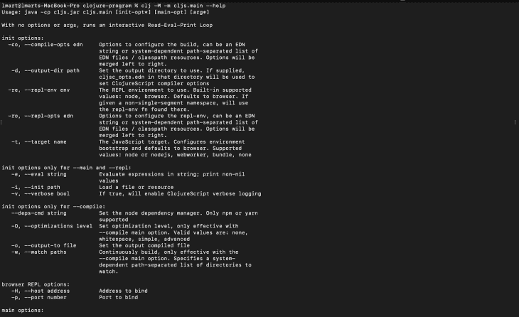
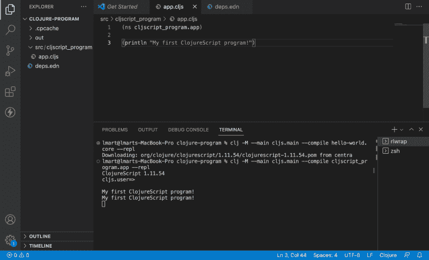
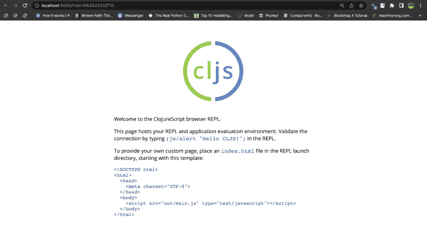

# 面向 JavaScript 开发人员的 ClojureScript 入门

> 原文：<https://blog.logrocket.com/getting-started-clojurescript-javascript-developers/>

在创建 web 应用程序时，开发人员可以使用函数式编程，它提供了数据不变性、并发性、稳定性和可伸缩性等好处。函数式编程最好由像 Clojure 这样的语言来支持，而不是由 T2 JavaScript 来支持。好消息是 [ClojureScript](https://clojurescript.org/) 将 Clojure 代码编译成 JavaScript，可以在浏览器或 [Node.js](https://nodejs.org/en/) 中执行。

在本文中，我们将了解 ClojureScript，它相对于普通 JavaScript 的优势，以及它与其他语言的区别。包含的代码示例将向您展示如何在本地机器上开始使用 ClojureScript 创建一个程序。

*向前跳转:*

## 先决条件

要跟随本教程，您需要:

## 什么是 ClojureScript？

ClojureScript 是 Clojure 的编译器，它编译成 JavaScript 并创建 web 应用程序。ClojureScript 和 Clojure 的区别在于 Clojure 面向基于 Java 的环境，而 ClojureScript 面向 JavaScript。

用 Clojure 编写的程序可以使用 ClojureScript 编译器编译成或发出 JavaScript 代码，ClojureScript 编译器也支持 JavaScript 库。本质上，ClojureScript 结合了 JavaScript 的互操作性和 Clojure 的巨大优势。因此，ClojureScript 编译成 JavaScript 代码并在浏览器或 Node.js 中运行。

ClojureScript 使用 [Google 闭包工具](https://clojurescript.org/about/closure#:~:text=Google's%20Closure%20Tools%20provide%20a,whitespace%2C%20removes%20comments%2C%20etc.)，该工具管理库和依赖项，并最小化代码大小。需要注意的是，在 ClojureScript 中，代码是作为数据存储的。在撰写本文时，最新版本是 [v1.11.60](https://github.com/clojure/clojurescript) 。

## ClojureScript 优于普通 JavaScript 的优势

与其他只使用 JavaScript 的应用程序相比，ClojureScript 提供了几个优势，包括:

*   简单:ClojureScript 属于 Lisp 语言家族。它的语法不那么冗长，外观更加以代码为中心。它的简单给了它力量和速度
*   REPL: ClojureScript 通过为许多 JavaScript 环境提供易于访问的 [REPLs](https://clojurescript.org/reference/repl) 来实现 REPL 驱动的开发。REPLs 允许您连续运行代码并立即获得反馈，而无需手动启动编译-构建-运行循环
*   Atoms: atoms 是 ClojureScript 中的一种数据类型，用于管理共享、同步和独立的状态。它们是不可变的值容器，只能容纳一个，但可以交换它们的值。因为这些原子，你仍然可以看到状态转换发生的时间。这对于处理随时间变化的状态很有用
*   互操作性:因为 ClojureScript 支持互操作性，所以使用现有的 JavaScript 库很简单

## ClojureScript 与编译成 JavaScript 的语言有何不同

虽然可以用 JavaScript 编译多种语言，但是 ClojureScript 与其他语言相比有一些主要的不同。让我们来看看:

### CoffeeScript vs. ClojureScript

CoffeeScript 类似于 Python 和 Ruby，有一个简单明了的语法来帮助开发。它的主要目标是通过减少冗长来提高生产率。然而，ClojureScript 提高了程序的整体速度，而 CoffeeScript 却没有。

### Dart vs. ClojureScript

Dart 是一种类型安全的语言，可以为多种平台开发应用程序，并编译成 JavaScript。它是由 Google 开发的，用来取代 JavaScript，语法冗长。然而，ClojureScript 支持代码作为数据哲学，它有一个明显更简单的语法，人和机器都可以理解。因此，它有一个强大的宏观系统。

### TypeScript 与 ClojureScript

虽然 [TypeScript](https://www.typescriptlang.org/) 和 JavaScript 与 ClojureScript 有相似的语法和语义，但它们彼此不同。本质上，TypeScript 是静态类型的 JavaScript，继承了 JavaScript 的几乎所有问题。不幸的是，对类型系统进行分层只能解决这些问题。虽然 JavaScript 背负着糟糕的语义和其他问题的包袱，但 ClojureScript 是一种优秀的语言，因为它产生了更多可重用的代码。

### PureScript 与 ClojureScript

类似于 TypeScript 如何编译成 JavaScript， [PureScript](https://www.purescript.org/) 具有严格的功能性和严格的类型。PureScript 是用 [Haskell](https://www.haskell.org/) 编写的，有一个类似 Haskell 的语法，但是创建它是为了使用 Node.js，而 ClojureScript 是用 Clojure 编写的。

## 使用 ClojureScript 设置演示项目

接下来，我们将开始为我们的项目配置 ClojureScript。确保您已经安装了必备组件。

### 为 ClojureScript 设置项目文件夹

根据您的操作系统，安装 ClojureScript 有不同的要求。要找到适用于您的操作系统的安装命令，请查阅官方的[文档](https://clojurescript.org/guides/quick-start)。对于简单的项目交互，ClojureScript 提供了 REPLs。

创建一个目录来托管您的项目，以使用 ClojureScript。然后，启动您的终端并输入:

```
mkdir clojure-program

```

### 创建命名空间和 ClojureScript 文件

通过名称空间允许和实现模块化，ClojureScript 使您能够在逻辑上安排函数和变量，供以后在程序中使用。如果您的项目遵循命名约定，那么在模块中声明命名空间和引用函数是很容易的。为此，我们将为此项目创建一个唯一的名称空间。

使用您喜欢的代码编辑器在目录中创建一个`src`文件夹来存储项目的源代码。然后，在您的`src`中，创建一个名为`cljscript_program`的新文件夹，它将保存您的`app.cljs` ClojureScript 文件。

然后，在`app.cljs`中，用`ns`关键字和产生以下消息的文件名创建一个名称空间:

```
(ns cljscript_program.app)

```

```
(println "My first ClojureScript program!")

```

### 为依赖项创建文件

接下来，在项目目录中创建一个`deps.edn`文件，列出您的项目拥有的每个依赖项。ClojureScript 是您将用于该程序的唯一依赖项。

```
{:deps {org.clojure/clojurescript {:mvn/version "1.11.54"}}}

```

### 运行 ClojureScript 程序

运行 ClojureScript 程序需要使用`cljs.main`名称空间。它包含多个用例的函数来启动一个交互式 REPL 会话。根据任务的不同，您可以使用`cljs.main`访问和指定许多参数和标志。

运行以下命令查看可用命令行参数的列表:

```
clj -M -m cljs.main --help

```

一旦运行该命令，参数将在您的终端中列出:



要为 ClojureScript 程序编译、运行和启动 REPL 会话，请在您的操作系统的项目目录中运行该命令。

对于 Windows 操作系统，运行以下命令:

```
java -cp "cljs.jar;src" cljs.main --compile hello-world.core --repl

```

对于 macOS 或 Linux OS:

```
clj -M --main cljs.main --compile cljscript_program.app --repl

```

让我们回顾一下我们指定的参数:

*   `--main`:指定并调用`cljs.main`，它包含运行程序所需的函数
*   `--repl`:启动一个 REPL 会话，允许你在程序执行时与它通信
*   构建你的程序

程序执行后，项目目录中将生成`.cpcache`和`out`，终端中将启动一个 REPL 会话。我们还应该将以下内容作为字符串`My first ClojureScript program!`写入提示符:



它将在 localhost:9000:



现在您的程序已经启动并运行，您可以编写代码并通过 REPL 与之交互。

### 创建 ClojureScript 函数

使用 [`defn`](https://clojuredocs.org/clojure.core/defn) 命名函数，在`app.cljs`中创建一个 ClojureScript 函数，该函数返回两个数的总和并绑定到变量`total`:

```
(defn total [x y]
   (+ x y)
)

```

您将需要以下子句来运行您的程序，并在您的 REPL 中与它通信:

*   `require`:让您定义要加载多少个名称空间
*   `:reload`:加载名称空间
*   `:as`:允许您指定一个较短的版本名，用作名称空间引用

ClojureScript 中有各种方法要求您的名称空间。在 REPL 提示符下运行以下命令:

```
(require '[cljscript_program.app :as cljscript] :reload)

```

这个命令需要并创建别名`cljscript`，然后重新加载您的名称空间。

之后，使用别名作为引用来调用您的名称空间中定义的函数。

```
(cljscript/total 20 40)

```

在提示符下选择**回车** **键**后，你会看到终端显示 60:


## 结论

在本文中，我们研究了 ClojureScript 及其相对于普通 JavaScript 的优势。我们讨论了 ClojureScript 与 CoffeeScript、Dart、TypeScript 和 PureScript 在编译成 JavaScript 方面的不同。我们还展示了如何安装和运行 ClojureScript 程序。

## 使用 [LogRocket](https://lp.logrocket.com/blg/signup) 消除传统错误报告的干扰

[](https://lp.logrocket.com/blg/signup)

[LogRocket](https://lp.logrocket.com/blg/signup) 是一个数字体验分析解决方案，它可以保护您免受数百个假阳性错误警报的影响，只针对几个真正重要的项目。LogRocket 会告诉您应用程序中实际影响用户的最具影响力的 bug 和 UX 问题。

然后，使用具有深层技术遥测的会话重放来确切地查看用户看到了什么以及是什么导致了问题，就像你在他们身后看一样。

LogRocket 自动聚合客户端错误、JS 异常、前端性能指标和用户交互。然后 LogRocket 使用机器学习来告诉你哪些问题正在影响大多数用户，并提供你需要修复它的上下文。

关注重要的 bug—[今天就试试 LogRocket】。](https://lp.logrocket.com/blg/signup-issue-free)