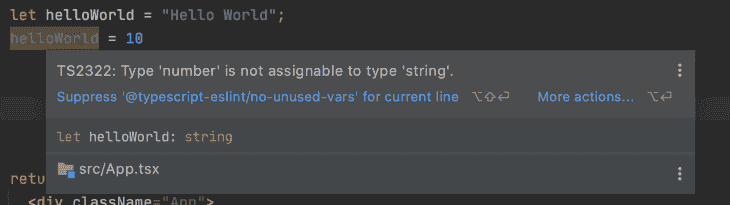

# 开始使用 Create React App 和 TypeScript 

> 原文：<https://blog.logrocket.com/getting-started-create-react-app-typescript/>

***编者按**:这篇文章最后一次验证准确性是在 2022 年 11 月 15 日*。

JavaScript 是一种奇妙的编程语言，它正在将其范围从浏览器扩展到 API、移动开发、桌面应用程序等等。然而，尽管 JavaScript 拥有强大的功能、持续的改进和不断增长的潜力，但它缺少一个有助于代码组织和效率的关键特性，即类型。

例如，考虑下面的代码:

```
let someText = "Hello World!";
someText = 123;
someText = [123, 'hello', { isThisCorrect: true }]

```

在大多数编程语言中，上面的代码不起作用，但是 JavaScript 允许这样做。我们可以创建一个字符串形式的变量，然后给它赋值一个数字，对象，甚至数组。但是，这样做有利也有弊。

随着应用程序的扩展，项目依赖性增加，系统变得更加复杂。开发人员可能很难理解变量、属性和方法的完整上下文，尤其是在使用框架和外部依赖项时。

如果在编程时，我们的 IDE 可以建议并自动完成一个对象的属性，即使这个对象是远程获取操作的结果，这不是很好吗？或者，我们可以检查一个变量，很容易地看到它的所有方法？

TypeScript 通过向变量添加类型来解决这个问题。在本文中，我们将通过涵盖以下内容来探索 React 中的类型:

## 使用 TypeScript 设置新项目

首先，让我们使用 Create React App 和以下命令在 TypeScript 和 preconfigure webpack、Babel 中设置我们的应用程序和我们的依赖项:

```
npx create-react-app my-app --template typescript

```

要启动项目，请运行:

```
cd my-app
npm start

```

请注意，该站点看起来类似于 JavaScript 版本。然而，当我们开始查看代码时，您会注意到一些不同之处。

## 类型脚本编译器

让我们仔细看看组件和测试，从`App.tsx`文件开始。你可能注意到的第一件事是它的文件扩展名。所有的组件文件现在都是`tsx`而不是`js`或`jsx`，同样，像`setupTests.js`这样的文件现在是`setupTests.ts`。但是为什么呢？

在撰写本文时，web 浏览器和 Node.js 还不提供对 TypeScript 的直接支持。他们只理解 JavaScript，因此，我们需要将我们的类型脚本文件转换成 JavaScript 文件。TypeScript 编译器负责执行这项任务。

编译器需要知道哪些文件是纯 JavaScript，哪些文件需要编译，因此，使用了上面提到的不同文件扩展名。

## 在 TypeScript 中键入变量

JavaScript 不是类型化的，这意味着您不能将数据类型赋给变量，但 JavaScript 仍然理解数字、字符串和对象之间的区别。在运行时，JavaScript 会尽最大努力根据变量包含的值来推断变量的类型。

让我们看看下面的例子:

```
let helloWorld = "Hello World";

```

因为包含在`helloWorld`变量中的值是一个字符串，所以该变量现在是类型`string`，并且您可以执行您通常会在字符串上执行的任何操作。但是，如果该变量在以后发生变化，该变量的类型也将发生变化。

TypeScript 采用同样的方法，在声明时根据变量的值为变量指定类型。因此，同一行代码将在 TypeScript 中工作。区别取决于当你想给变量赋一个不同类型的新值时会发生什么。

我们已经看到 JavaScript 允许您这样做，但是让我们看看如果我们用 TypeScript 做同样的事情会发生什么:

```
let helloWorld = "Hello World";
helloWorld = 10;

```

有趣的是，无论你使用的是 [VS Code](https://code.visualstudio.com/) 、 [WebStorm](https://www.jetbrains.com/webstorm/) 还是任何其他支持 TypeScript 的 IDE，你的 IDE 都已经检测到了一个问题，用红色突出显示了这个变量，并给出了相关信息:



WebStorm highlights errors in types when using TypeScript

此外，编译过程将导致错误，您将无法运行您的应用程序:


TypeScript prevents the app from building if there are errors in Types

到目前为止，我们已经让 TypeScript 决定了变量的数据类型，这是通过推理调用的[类型。然而，在其他情况下，我们可能希望手动为变量分配一个类型，这可能是因为我们仍然没有它的值，或者因为变量可能有多种类型。](https://blog.logrocket.com/type-flowing-rethinking-typescript-typing-system/)

让我们使用显式类型声明一个变量:

```
let helloWorld:string  = "Hello World";

```

很容易，我们可以在声明过程中在变量名后面传递类型。

## 使用 TypeScript 设置新的 React 应用程序

React 本身与 JavaScript 配合得很好，但是，使用 TypeScript 会让我们受益匪浅。TypeScript 减少了 bug 和错误，使代码库更加可预测，并提高了组件利用率。

让我们为 GitHub 开发一个简单的搜索应用程序，允许用户使用 [GitHub 的搜索 API](https://docs.github.com/en/rest/search?apiVersion=2022-11-28#search-repositories) 搜索存储库。下面的 gif 展示了我们将要创建的应用程序的一个例子:


你可以在 [GitHub](https://github.com/bajcmartinez/react-typescript-example) 上查看该应用的完整代码。

运行以下命令，使用 [Create React App](https://reactjs.org/docs/create-a-new-react-app.html) 启动一个新的兼容 TypeScript 的 React 应用程序:

```
npx create-react-app my-app --template typescript
or
yarn create-react-app my-app --template typescript

```

接下来，使用以下命令启动项目:

```
cd my-app
npm start

```

### 远程数据类型

我们需要从我们的 API 获取数据，所以我们需要一个对象来存储它，并且该对象必须映射到一个类型。让我们通过分析响应和构建自定义类型来定义我们的 API 数据类型。下面是一个示例响应供参考:

```
{
  "total_count": 40,
  "incomplete_results": false,
  "items": [
    {
      "id": 3081286,
      "node_id": "MDEwOlJlcG9zaXRvcnkzMDgxMjg2",
      "name": "Tetris",
      "full_name": "dtrupenn/Tetris",
      "owner": {
        "login": "dtrupenn",
        "id": 872147,
        "node_id": "MDQ6VXNlcjg3MjE0Nw==",
        "avatar_url": "https://secure.gravatar.com/avatar/e7956084e75f239de85d3a31bc172ace?d=https://a248.e.akamai.net/assets.github.com%2Fimages%2Fgravatars%2Fgravatar-user-420.png",
        "gravatar_id": "",
        "url": "https://api.github.com/users/dtrupenn",
        "received_events_url": "https://api.github.com/users/dtrupenn/received_events",
        "type": "User"
      },
      "private": false,
      "html_url": "https://github.com/dtrupenn/Tetris",
      "description": "A C implementation of Tetris using Pennsim through LC4",
      "fork": false,
      "url": "https://api.github.com/repos/dtrupenn/Tetris",
      "created_at": "2012-01-01T00:31:50Z",
      "updated_at": "2013-01-05T17:58:47Z",
      "pushed_at": "2012-01-01T00:37:02Z",
      "homepage": "",
      "size": 524,
      "stargazers_count": 1,
      "watchers_count": 1,
      "language": "Assembly",
      "forks_count": 0,
      "open_issues_count": 0,
      "master_branch": "master",
      "default_branch": "master",
      "score": 1.0
    }
  ]
}

```

我们的应用程序非常简单，所以我们不需要映射所有这些字段，但是让我们看看它是如何工作的。在`src`目录下创建一个`Types/GitHub.ts`文件。在这个文件中，我们将定义一个自定义数据类型来表示 JSON 响应。

TypeScript 有[两个定义类型的主要选项，接口](https://blog.logrocket.com/understanding-using-interfaces-typescript/)和类型。各有各的属性和规则。在本文中，我们不会对它们进行过多的讨论，但是如果你想了解更多，我建议你阅读一下 TypeScript 中的[类型与接口。一般来说，你会希望使用道具和类型的接口来表示对象。](https://blog.logrocket.com/types-vs-interfaces-in-typescript/)

在我们的例子中，我们表示一个对象，所以我们将使用`types`语法来声明我们的`GitHubSearchResultType`，它由找到的存储库的`total_number`、一个`incomplete_results`标志、返回的`true`或`false`以及一个项目或存储库列表组成。

前两个属性非常简单。每一个都对应于一个 [TypeScript 基本类型](https://www.typescriptlang.org/docs/handbook/basic-types.html)，所以我们可以立即引用它们:

```
export type GitHubSearchResultType = {
    total_count: number;
    incomplete_results: boolean;
}

```

然而，当涉及到`items`属性时，情况就有点复杂了。我们知道这是一个对象数组，所以我们可以使用 TypeScript 中的`any`关键字，它将变量默认为 JavaScript 行为，忽略类型。它看起来类似于下面的代码:

```
export type GitHubSearchResultType = {
    total_count: number;
    incomplete_results: boolean;
    Items: Array<any>;
}

```

注意，定义数组的语法有点不同，因为我们在一个定义中有两种类型，主类型`Array`和数组元素的类型，它们属于中间的`<>`。

虽然这样行得通，但并不理想。在大多数项目中，lint 规则禁止并监控`any`的使用。基本上，您会忽略开始使用 TypeScript 的原因。更好的方法是定义第二个自定义类型，并将数组映射到该类型，如下面的代码片段所示:

```
typescript
export type GitHubSearchResultType = {
    total_count: number;
    incomplete_results: boolean;
    items: Array<GitHubRepository>
}

```

很清楚什么是项目，每个项目有什么属性。现在，我们只缺少`GitHubRepository`的定义:

```
export type GitHubRepository = {
    id: string;
    full_name: string;
    html_url: string;
}

```

### 构建组件:列出存储库

现在，我们可以构建我们的组件了。我们将从一个非常简单的组件开始，它将接收一个存储库列表，并将它们绘制在屏幕上。我们将这个组件命名为`ListRepositories.tsx`，并将其存储在`src/Components`文件夹中。

基于 TypeScript 的 React 组件与 JavaScript React 组件有两个主要区别:

1.  类型检查不需要 [PropTypes，因为我们有 TypeScript](https://blog.logrocket.com/comparing-typescript-and-proptypes-in-react-applications/)
2.  组件声明略有不同

先来了解一下如何用 TypeScript 定义道具。我们的组件需要访问我们将通过 props 接收的存储库列表，所以让我们使用`interface`语法来定义它:

```
interface Props {
    repositories?: Array<GitHubRepository>;
}

```

与类型类似，接口在括号之间的主体中定义对象的属性，并且属性以相同的方式定义。

在我们的特定示例中，我们引入了一个称为可选属性的新概念，通过在属性名称后添加一个`?`来表示。这些可选属性可以是`undefined`、`null`或给定类型的值。

我们创造的`interface`叫做`Props`。不过，它可能是任何东西，比如`ListRepositoryProps`或`ListRepositoryPropsType`。

因此，当我们声明我们的组件时，我们必须告诉 React 类型的名称是什么。我们通过如下使用`React.FC`来实现:

```
const ListRepositories: React.FC<Props> = (props) => {

```

在一行中，我们创建了一个功能组件，并告诉 React 我们的道具是`Props`类型的。因为它是一个功能组件，我们可以做一些很酷的事情，比如对象析构。现在，我们修改后的声明如下所示:

```
const ListRepositories: React.FC<Props> = ({ repositories = [] }) => {

```

您可能想知道，如果我们总是需要一个值，为什么要将`repositories`属性设置为 optional。这个组件的父组件可能会传递一个`undefined`，如果是这样的话，我们可以假设一个空列表。

下面是该组件的完整代码:

```
import React from 'react';
import {GitHubRepository} from "../Types/GitHub";

interface Props {
    repositories?: Array<GitHubRepository>;
}

const ListRepositories: React.FC<Props> = ({ repositories = [] }) => {
    return (
        <ul>
            {repositories.map(repository => (
                <li key={repository.id}>
                   <a href={repository.html_url} target="_blank">{repository.full_name}</a>
                </li>
            ))}
        </ul>
    );
}

export default ListRepositories;

```

### 创建搜索表单

接下来，我们将构建一个新的组件，负责捕获用户输入并启动搜索操作。由于我们已经是 React 和 TypeScript 的专家，我将展示表单的完整代码，然后讨论下面的关键元素:

```
import React from 'react';

interface Props {
    search(query: string): void;
}

const SearchForm: React.FC<Props> = (props) => {
    function handleSubmit(e: React.FormEvent) {
        e.preventDefault();
        const formData = new FormData(e.target as HTMLFormElement);
        props.search((formData.get('query') || '') as string);
    }

    return (
        <form onSubmit={handleSubmit}>
            <label>
                Query:
                <br />
                <input type="text" name="query" />
            </label>
            <button>Search</button>
        </form>
    );
}

export default SearchForm;

```

像我们之前的组件一样，我们使用一个`interface`来定义我们的道具。然而，我们没有属性，而是有一个方法。

[TypeScript 允许我们定义函数类型](https://blog.logrocket.com/definitive-guide-typing-functions-typescript/)。我们可以通过指定函数名、参数、类型和返回类型来实现。它还支持函数表达式和箭头函数，如下面的代码所示:

```
//function expression
functionName(param1: type, …): type;

//arrow function
functionName: (param1: type, ...) => type;

```

示例:

```
interface Props {
    search(query: string): void;
}

interface Props {
    search: (query: string) => void;
}

```

在这种形式中，我们还有另一种特殊的类型转换用法:

```
props.search((formData.get('query') || '') as string);

```

为什么我们需要演员？`formData.get`函数是一个[联合类型](https://blog.logrocket.com/types-vs-interfaces-in-typescript/)，这意味着它可以是多种类型中的一种，在本例中是`string`、`File`或`undefined`。我们知道，对于我们的目的，唯一的选择是字符串，因此，我们将。

## API 获取并把它们放在一起

现在我们已经准备好了所有的部分，我们需要在`App.tsx`组件上组合它们，并添加从 GitHub API 获取远程数据的功能。

在我们揭示代码之前，重要的是澄清我们正在使用 [Axios](https://github.com/axios/axios) 从 API 获取数据。运行以下命令安装 Axios:

```
npm install axios

```

现在，我们将运行下面的代码:

```
import React from 'react';
import axios from 'axios';
import {GitHubRepository, GitHubSearchResultType} from "./Types/GitHub";
import SearchForm from "./Components/SearchForm";
import ListRepositories from "./Components/ListRepositories";

function App() {
    const [repositories, setRepositories] = React.useState<Array<GitHubRepository>>();

    // Performs the search
    async function search(query: string) {
         const result = await axios.get<GitHubSearchResultType>(`https://api.github.com/search/repositories?q=${query}`);
         setRepositories(result.data.items);
    }

    return (
        <div>
            <SearchForm search={search}/>
            <ListRepositories repositories={repositories}/>
        </div>
    );
}

export default App;

```

上面的代码几乎是标准的 React 代码，除了两个使用[类型脚本泛型](https://www.typescriptlang.org/docs/handbook/generics.html)的实例。

泛型允许定义具有空白类型，以便以后完成。React 中一个很好的例子是`React.useState`函数。`useState`将定义一个 getter 和 setter，我们可以在代码中使用它们来存储 React 状态中的信息。但是，React 如何知道这个 getter 和 setter 的类型呢？答案是泛型。基本上，像`useState`这样的函数应该声明如下:

```
function useState<S = undefined>(): [S | undefined, Dispatch<SetStateAction<S | undefined>>];

```

`S`可以是任意类型，在函数调用时指定如下:

```
const [repositories, setRepositories] = React.useState<Array<GitHubRepository>>();

```

或者，通过使用隐式类型指定:

```
const [someText, setSomeText] = React.useState('Hello World!');

```

使用泛型的第二个例子是当我们使用 Axios 时:

```
const result = await axios.get<GitHubSearchResultType>(`https://api.github.com/search/repositories?q=${query}`);
         setRepositories(result.data.items);

```

在这种情况下，`GET`函数将返回映射到给定类型的 JSON 响应数据。

## 结论

在本教程中，我们学习了如何利用 TypeScript 的强大功能来构建可伸缩和可维护的 React 应用程序。我希望你喜欢读这篇文章，就像我喜欢写它一样，正如我常说的，一旦你打字，你就再也不会回来了。感谢阅读！

## [LogRocket](https://lp.logrocket.com/blg/react-signup-general) :全面了解您的生产 React 应用

调试 React 应用程序可能很困难，尤其是当用户遇到难以重现的问题时。如果您对监视和跟踪 Redux 状态、自动显示 JavaScript 错误以及跟踪缓慢的网络请求和组件加载时间感兴趣，

[try LogRocket](https://lp.logrocket.com/blg/react-signup-general)

.

[ ](https://lp.logrocket.com/blg/react-signup-general) [](https://lp.logrocket.com/blg/react-signup-general) 

LogRocket 结合了会话回放、产品分析和错误跟踪，使软件团队能够创建理想的 web 和移动产品体验。这对你来说意味着什么？

LogRocket 不是猜测错误发生的原因，也不是要求用户提供截图和日志转储，而是让您回放问题，就像它们发生在您自己的浏览器中一样，以快速了解哪里出错了。

不再有嘈杂的警报。智能错误跟踪允许您对问题进行分类，然后从中学习。获得有影响的用户问题的通知，而不是误报。警报越少，有用的信号越多。

LogRocket Redux 中间件包为您的用户会话增加了一层额外的可见性。LogRocket 记录 Redux 存储中的所有操作和状态。

现代化您调试 React 应用的方式— [开始免费监控](https://lp.logrocket.com/blg/react-signup-general)。

## [LogRocket](https://lp.logrocket.com/blg/typescript-signup) :全面了解您的网络和移动应用

[](https://lp.logrocket.com/blg/typescript-signup)

LogRocket 是一个前端应用程序监控解决方案，可以让您回放问题，就像问题发生在您自己的浏览器中一样。LogRocket 不需要猜测错误发生的原因，也不需要向用户询问截图和日志转储，而是让您重放会话以快速了解哪里出错了。它可以与任何应用程序完美配合，不管是什么框架，并且有插件可以记录来自 Redux、Vuex 和@ngrx/store 的额外上下文。

除了记录 Redux 操作和状态，LogRocket 还记录控制台日志、JavaScript 错误、堆栈跟踪、带有头+正文的网络请求/响应、浏览器元数据和自定义日志。它还使用 DOM 来记录页面上的 HTML 和 CSS，甚至为最复杂的单页面和移动应用程序重新创建像素级完美视频。

[Try it for free](https://lp.logrocket.com/blg/typescript-signup)

.