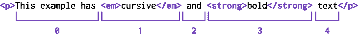
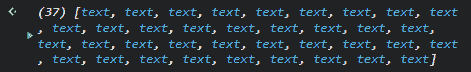
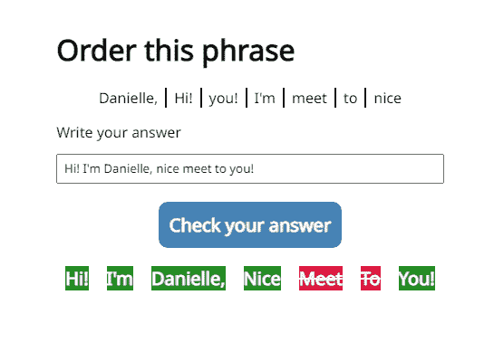

# CSS 自定义突出显示 API 入门

> 原文：<https://blog.logrocket.com/getting-started-css-custom-highlight-api/>

文本突出显示是一种可以在多个站点上检测到的功能，有多种用途。例如，浏览器会突出显示使用搜索功能找到的元素，而文本编辑器和工具(如 concept 或 Grammarly)会突出显示拼写和语法错误。

文本突出显示可以增强用户体验，但将这种功能添加到网站或应用程序可能会很困难。幸运的是，由于有了 [CSS 自定义高亮 API](https://www.w3.org/TR/css-highlight-api-1/) ，这将变得容易得多，它允许我们轻松地向文本范围添加样式。在撰写本文时，该特性仍在工作草案中，因此可能会有变化。

在本文中，我将概述 API 的特性以及在行为和可访问性方面需要考虑的事情。我还将分享几个例子来说明 CSS 自定义高亮 API 在各种用例中的使用。

*向前跳转:*

## 了解基础知识

使用 CSS 自定义突出显示 API 需要三个步骤:在样式表中创建样式，设置突出显示范围，然后将这些样式应用于该范围。

在进入这些步骤之前，我想重申 CSS 自定义高亮 API 仍然是一个工作草案，这意味着它仍然会发生变化。此外，这个特性目前还不能在 Firefox 上工作，所以如果 Firefox 对于您的项目是必需的，您现在不应该将它用于生产。

说了这么多，还是从第一步开始吧。

### 创建高亮显示样式

这个 CSS 自定义高亮 API 要求我们使用`::highlight()`伪元素来设置我们需要的样式。[W3C 工作草案](https://www.w3.org/TR/css-highlight-api-1/)将这个伪元素定义为“文档中包含或部分包含在所有注册的自定义高亮区域中的部分”。

我们需要为我们在花括号内创建的自定义高亮显示添加一个名称，因此自定义高亮显示的 CSS 声明应该如下所示:

```
::highlight(sample-highlight) {
  background-color: rebeccapurple;
  color: whitesmoke;
}

```

你可能想知道在样式规则中是否有限制你可以申请这个高光，答案是肯定的！我们可以使用的 CSS 规则非常有限。更准确地说，我们只能使用以下规则，因为它们适用于`::selection`伪元素:

*   `background-color`
*   `caret-color`
*   `color`
*   `cursor`
*   `fill`
*   `stroke`
*   `stroke-width`
*   `text-decoration`

选择这些规则是因为浏览器可以有效地应用它们，而无需重新创建站点的布局或插入新的 DOM 元素(即，我们可以通过用类似于`span`的内嵌 HTML 标签包装元素来重新创建这个功能)。

要比较 CSS 自定义高亮 API 和插入跨度的传统文本格式化方法之间的性能差异，请参见费尔南多·费奥里的[性能比较演示。](https://ffiori.github.io/highlight-api-demos/demo-performance.html)

### 设置范围

创建样式后，下一步是用 CSS 设置范围。首先，我们将使用构造函数`Range()`定义文本范围；这将允许我们选择文档的一个片段。这个片段可以包含节点或部分文本节点。

`Range()`构造函数可以选择的元素类型很重要，因为这意味着要获得我们想要使用的文本片段，我们需要使用返回这些元素类型之一的函数。

让我们考虑下面的文本示例:

```
<p>This example has <em>cursive</em> and <strong>bold</strong> text</p>

```

现在，让我们创建样式:

```
:root::highlight(example) {
  background-color: rebeccapurple;
  color: whitesmoke;
}

```

如果我们试图用`p`元素创建一个范围，那么每个节点或文本片段都将是一个新的范围。

我们可以使用`range.setStart`和`range.setEnd`方法来选择我们想要突出显示的文本部分。

对于这个示例文本，每个新元素都是一个新的范围，所以我们有如下内容:



This example sentence shows where each range starts. “This example has” is at position 0, everything inside of the <em> element is at position 1, “ and “ is at position 2, everything inside the <strong> element is at position 3, and “ text” is at position 4.

假设我们要突出上面句子中的文字“草书而强”。在这种情况下，`setStart`方法应该是`1`。你可能认为`setEnd`方法应该是`3`，但这并不完全正确！

如果我们将范围的开始设置为`1`，API 将从元素的最开始选择它，如果我们将结束范围设置为`3`，选择将在第三个元素的开始处结束。因此，要选择`strong`元素中的所有文本，本例中的属性`range.setEnd`应该是`4`。

`setStart`和`setEnd`方法接收两个参数:我们想要使用的 DOM 元素和位置。下面是它在我们的代码中的样子:

```
const paragraph = document.querySelector("p")

const exampleRange = new Range();
exampleRange.setStart(paragraph, 1);
exampleRange.setEnd(paragraph, 4);

```

### 应用高光

现在我们有了想要的产品系列，是时候突出它了！为此，我们需要创建一个新的`Highlight()`构造函数，它将接收我们的范围作为属性:

```
const highlight = new Highlight(exampleRange)

```

接下来，我们需要调用`CSS.highlight.set`方法。它接收两个属性:我们在样式表中创建的`highlight`类和我们之前创建的新的`highlight`。这是它在我们的代码中的样子:

```
CSS.highlights.set("example", highlight);

```

但是，如果您需要清除您创建的高光，该怎么办？

只需调用`CSS.highlights.clear()`方法，高光将被清除，没有问题。

## 创建和突出显示更复杂的范围

当我们想要选择一个完整的单词时，我们前面演示的创建突出显示范围的技术可以很好地工作，但是当我们只需要选择单词的一部分时会发生什么呢？让我们回到我们的例子，这次让我们试着只突出显示字母“old tex”。

首先，让我们为这个亮点创建我们的风格:

```
:root::highlight(partial) {
  background-color: goldenrod;
  color: black;
}

```

好了，现在我们如何避免选择整个片段？

我处理这个问题的方法是仔细观察这个元素(在本例中，是整个`p`元素)是如何构成的。首先，我使用控制台使用`[console.dir()](https://developer.mozilla.org/en-US/docs/Web/API/console/dir)`检查属性列表，对其进行了更详细的检查。然后我看了看`childNodes`房产，结果是这样的:


console.dir of the p element. The property returns an array of the elements inside the paragraph. In this case, the second and fourth elements appear as their respective element tags and the others appear as text.

我们想要突出显示的文本“old tex”在`strong`元素中。为了从这个文本开始我们的范围，我们可以使用`paragraph.childNodes[3]`，但是这样会选择整个元素。那么，我们如何选择元素的一部分呢？

正如我前面提到的，`Range`将选择一个元素节点或者一个文本节点。在我们的例子中，我们需要在这个元素中检查返回文本节点的内容。

让我们回到我们的`console.dir()`，因为它有一个我们可以使用的属性:`firstChild`:


console.dir of the strong element. The property in this element returns a text node that can be used in the constructor.

所以现在我们有了`paragraph.childNodes[3]`。`firstChild`将返回我们的字符串作为`Text`的原型。

要设置我们的起始位置，我们需要检查“old”中的“o”在哪里。在这个例子中，它是第二个字符，所以如果我们把它划分为一个数组，那么“o”就是位置`1`。因此，当我们为我们的范围设置`setStart`方法时，它将是这样的:

```
partialRange.setStart(paragraph.childNodes[3].firstChild, 1)

```

太好了！现在，让我们设置这个范围的结束。

我们想要突出显示的最后一个字符“tex”位于我们的`childNodes`的最后一个元素中。正如您在上面的`childNodes`属性列表中所注意到的，最后一个元素的类型是`text`，因此没有必要访问`firstChild`的属性。

接下来，我们需要检查在哪里结束我们的范围；我们将使用`setEnd`方法，就像这样:

```
partialRange.setEnd(paragraph.childNodes[4], 4)

```

现在，我们要做的就是创造亮点:

```
const partialHighlight = new Highlight(partialRange);

CSS.highlights.set("partial", partialHighlight)

```

以下是高光的外观:

请看 [CodePen](https://codepen.io) 上克里斯蒂安·迪亚斯([@ itcrisdiaz](https://codepen.io/ItsCrisDiaz))
的笔 [CSS 自定义高亮演示](https://codepen.io/ItsCrisDiaz/pen/MWXbMYe)。

我在同一个 CodePen 中展示这两个例子是有原因的——当多个样式应用于同一个字符串时，考虑浏览器将如何区分呈现内容的优先级是很重要的。

例如，“bold”中的字符串“old”具有这两种样式。哪种样式将被显示将取决于我们决定在哪里调用`CSS.highlights.set`方法。

在本例中，我首先调用添加`example`样式的方法，然后调用添加`partial`样式的方法。因为这是 JavaScript，所以以最后声明的方法为准。因此，在这种情况下,“旧”字符串将应用`partial`样式。

最后，如你所想，`Range()`方法可能很难完全理解。当你开始考虑规模的时候，这种方法可能会有所欠缺。在本文的后面，我们将会看到一些例子，这些例子使用其他方法来处理更复杂的用例。但是首先，我们需要考虑一个重要的因素:可访问性。

## 处理可访问性限制

CSS 自定义突出显示 API 非常灵活，但是当您需要向屏幕阅读器等辅助技术公开突出显示时会发生什么呢？这个 API 涵盖了这一点，但是现在，它仅限于少数几个用例。

让我们从基础开始。当你用`Highlight()`构造函数创建一个高光时，有一个属性叫做`type`。这个属性为高亮显示赋予了语义含义，并定义了它将如何向屏幕阅读器和其他辅助技术公开！

我们可以使用的类型仅限于这三种:

*   `highlight`:默认分配
*   `spelling-error`:用于高亮显示拼错的内容
*   `grammar-error`:用于高亮显示语法不正确的内容

如果您使用的突出显示有这些类型之一，您肯定应该添加类型。为此，只需像这样更改属性:

```
// Creating a highlight with a new range
const highlight = new Highlight(range)

// Changing the attribute type of this range
highlight.type = "spelling-error"

```

为什么只有这三种？根据 [W3C 规范](https://www.w3.org/TR/css-highlight-api-1/)，这是因为这些被认为是该 API 最常见的用例:

> 之所以选择这一组初始的类型，是因为它们有望成为 Highlight API 的流行用例，并且现在已经有了一些在平台可访问性 API 中表达它们的语义的支持。

该规范还提到“UAs(用户代理)应该为辅助技术提供定制的高亮显示”，现在大多数情况下都是这样。

在这里，我想再次强调，CSS 自定义高亮 API 仍然是一项正在进行中的工作。我用 NVDA 和 Chrome 做了一些测试，发现它会在文本突出显示之前识别拼写或语法错误，但当文本类型为`highlight`时，不会暴露这些错误。

为什么这很重要？好吧，如果这个亮点不仅仅是为了视觉目的，而是需要接触辅助技术，你可能需要考虑这份工作的另一个选择。我认为一个很好的解决方案是 [ProgrammingTT 在这个视频](https://www.youtube.com/watch?v=PkTvok9acNk)中演示的方案，其中突出显示的内容被包装在`<mark>`元素中。

在撰写本文时，只有两种类型的高光暴露于辅助技术，但添加更多高光类型的可能性是开放的，正如 W3C 提到的:

> 可访问性 API 目前没有任何方法来表达其他预期突出显示 API 用例的特定语义。随着可访问性 API 获得对表达高亮 API 的额外流行用例的支持，更多的类型可以随后被添加到`HighlightType`中。

现在，让我们来看看这个 API 的一些用例！

## CSS 自定义突出显示 API 示例

为了更好地理解这个 API 可以做什么，让我们来看看由 Microsoft Edge 的团队实现的这个 API 的一些实现，以及我构建的一个示例。这些用例还将让我们看到处理文本范围的不同方式。

### 选择并突出显示 web 文本

让我们从微软 Edge 视频“[使用 CSS 自定义高亮 API](https://youtu.be/1qldqyT324o) 高亮显示 web 上的文本”的例子开始。在这个项目中，您可以选择文本，突出显示它以将其存储在列表中，然后在以后检查它。存储的文本将使用 CSS 自定义高亮 API 高亮显示。

对于本例，Patrick Brosset 使用`document.getSelection()`方法创建一个包含以下选项的范围:

```
const selection = document.getSelection();
const range = selection.getRangeAt(0);

```

因为任何返回文本片段或节点片段的方法都是有效的，`document.getSelection()`可以做到这一点。接下来，Brosset 开始用`Highlight`方法添加范围，然后像我们之前演示的那样高亮显示它们。

由于没有这个视频的现场演示，我决定重新创建突出显示选择范围的功能。这与我们之前的例子非常相似，但是有一个关键的区别:这一次我们可能需要突出显示多个范围。为此，让我们首先创建一些全局变量:

```
let SELECTION_TEXTS = []
let selectionHighlighter = new Highlight()

```

第一个变量是一个数组，它将存储我们想要突出显示的每个范围，第二个变量创建一个`Highlight()`类的实例。

为什么我们要在全球范围内处理这个问题？因为我们将使用这个类的一个方法来添加我们的范围，而不是使用我们之前使用的语法。

现在，是时候创建我们的函数来突出显示这些文本范围了:

```
const textHighlight = () => {
  const selection = document.getSelection();
  const range = selection.getRangeAt(0)
  SELECTION_TEXTS.push(range)

  SELECTION_TEXTS.forEach((selection) => {
    selectionHighlighter.add(selection)
  })
  CSS.highlights.set("example", selectionHighlighter)
};

```

这与我们之前看到的有些不同。在向我们的`selectionHighlighter`添加任何东西之前，我们必须首先向我们的数组添加新的范围。然后，我们需要用`forEach`方法迭代它，开始用`Highlight. add()`方法向`selectionHighlighter`添加选择范围。接下来，我们只需要像以前一样调用`CSS.highlights.set()`方法。

但是，如果我们需要清除高光，会发生什么呢？为此，我们可以使用以下函数:

```
const clearHighlight = () => {
  selectionHighlighter.clear()
  SELECTION_TEXTS = []
  CSS.highlights.clear()
}

```

与`Highlight.add()`类似，我们可以使用`Highlight.clear()`删除全局变量中所有高亮显示的元素。然后，我们只需要清除用于数组的全局变量，然后使用我们之前演示过的`CSS.highlights.clear()`方法。

要了解这是如何工作的，请看这个演示:

见笔 [选择文字高亮](https://codepen.io/ItsCrisDiaz/pen/MWXobdL)由克里斯蒂安·迪亚斯([@ itcrisdiaz](https://codepen.io/ItsCrisDiaz))
于 [CodePen](https://codepen.io) 。

我选择这个例子是因为我想展示我们如何使用其他策略来选择所需的文本范围。在这种情况下，`document.getSelection()`起作用了，但是当你需要更大规模地创造一些东西的时候会发生什么呢？这就是我们第二个用例的用武之地！

### 在页面组件中搜索

下一个演示是关于[页面内搜索组件](https://microsoftedge.github.io/Demos/custom-highlight-api/)，也是由微软 Edge 团队制作的。它演示了如何使用一个`TreeWalker`在一个 DOM 元素(在本例中是`main`元素)中获取所有节点来创建更大规模的文本节点。至于 CSS 自定义高亮 API，我们需要所有的文本节点，所以我们将使用`NodeFilter.SHOW_TEXT`实例。

接下来，`TreeWalker`使用`TreeWalker.nextNode()`方法检查每个节点，并将它们存储在`allTextNodes`变量中，该变量给出以下结果:



Console screenshot of the variable allTextNodes; an array with 37 elements, all of which are type text.

这个过程给了我们一个文本元素数组；我们可以通过添加它们的名字作为`input`来检查它们。然后，只需添加文本节点的范围，找到那些结果，然后像我们之前用`CSS.highlights.set()`方法做的那样突出显示它们。这个方法说明了我们如何使用`TreeWalker`来帮助我们在更大范围内可靠地检查文本节点。

这个演示将大大受益于辅助技术亮点的附加语义。记住，这个 API 只有三种类型，高亮显示一个搜索结果不是其中之一！所以 W3C，如果你看到这个，包括这种类型的搜索结果的语义肯定会派上用场！

现在，让我们来看看我做的一个例子。它有效地利用了可用的语义！

### 订购此短语应用程序

我的项目想法是创建一个应用程序，用户收到一个混乱的短语，然后需要提供正确排序的短语作为答案。用户将通过高亮显示接收视觉反馈，这取决于提交中的单词是否处于正确的顺序。我选择这个例子是因为它可以利用高亮语义类型(在这个例子中是`grammar-error`)来提高应用程序的可访问性！



Example from the “Order this phrase” app. The phrase “Hi! I’m Danielle, nice to meet you!” is in the wrong order. There is an input field to provide the correct answer and a “Check your answer” button.

首先，我们需要创建我们的亮点类！如果我们仅仅依靠背景颜色来突出正确和错误的答案，那么对于色盲的用户来说，结果将很难区分。相反，我决定对不正确的答案使用删除线(或`line-through`):

```
:root::highlight(wrong-highlight) {
  background-color: crimson;
  color: whitesmoke;
  text-decoration-line: line-through;
  text-decoration-thickness: 2px;  
}

:root::highlight(right-highlight) {
  background-color: forestgreen;
  color: whitesmoke;
}

```

正如我之前提到的，创建语义的关键是将属性`type`添加到所需的高亮显示类中。在这种情况下，我只想强调那些以错误顺序出现的单词，因为它们会造成语法错误，所以这就是我在全局创建`Highlight()`实例时所做的。因为要突出显示多个范围，所以我必须声明空数组，所以我决定也全局添加这些数组:

```
let RIGHT_RANGES = [];
let WRONG_RANGES = [];

const rightHighlight = new Highlight();

const wrongHighlight = new Highlight();
wrongHighlight.type = "grammar-error";

```

在多次验证以检查添加的单词是否与答案中的一致后，是时候开始添加我们的范围了！我决定选择答案的容器(在本例中是`ol`)，然后检查它的每个子容器。由于每个内部`li`仅由该元素组成，因此该范围从`0`开始，到`1`结束。

记住这一点，下面是我使用的代码:

```
const answerListNodes = ANSWER_LIST.children;

// Selects the range of each <li> to start the highlighting process
answer.forEach((word, index) => {
  const wordRange = new Range();
  wordRange.setStart(answerListNodes[index], 0);
  wordRange.setEnd(answerListNodes[index], 1);

  if (word === RIGHT_ORDER[index]) {
    // If the answer is right
    RIGHT_RANGES.push(wordRange);
  } else {
    // If the answer is wrong
    WRONG_RANGES.push(wordRange);
  }
});

```

接下来，我们可以使用`RIGHT_RANGES`和`WRONG_RANGES`数组将选定的范围添加到我们的`Highlight()`实例中，然后使用`CSS.highlights.set()`方法在屏幕上高亮显示它们:

```
// Highlights the answers in the right position
RIGHT_RANGES.forEach((element) => {
  rightHighlight.add(element);
});

CSS.highlights.set("right-highlight", rightHighlight);

// Highlights the answers in the right position
WRONG_RANGES.forEach((element) => {
  wrongHighlight.add(element);
});

CSS.highlights.set("wrong-highlight", wrongHighlight);

```

如果你想知道它是如何工作的，看看这个代码笔:

请看 [CodePen](https://codepen.io) 上克里斯蒂安·迪亚斯([@ itcrisdiaz](https://codepen.io/ItsCrisDiaz))
用自定义高亮的 Pen [命令短语。](https://codepen.io/ItsCrisDiaz/pen/dyKyGYB)

同样，我使用这种方法是因为 CSS 自定义高亮 API 提供了一种语义类型，非常适合这个例子。

## 最后的想法

CSS 自定义高亮 API 是一个新特性，它为我们面临的一些与可用性和可访问性相关的问题提供了一些有趣的解决方案。与其他选项相比，它还提供了卓越的性能。当您考虑如何选择一个范围时，这个 API 可能有点棘手，但是一旦您搞清楚了这一点，这个工具就打开了一个全新的可能性集！

这个 API 仍在开发中，目前缺乏全球支持，但我认为它有很大的潜力。我希望将来这个 API 能够扩展它的浏览器支持，并且支持更多的语义类型，这些语义类型可以用于辅助技术。

## 你的前端是否占用了用户的 CPU？

随着 web 前端变得越来越复杂，资源贪婪的特性对浏览器的要求越来越高。如果您对监控和跟踪生产环境中所有用户的客户端 CPU 使用、内存使用等感兴趣，

[try LogRocket](https://lp.logrocket.com/blg/css-signup)

.

[](https://lp.logrocket.com/blg/css-signup)[https://logrocket.com/signup/](https://lp.logrocket.com/blg/css-signup)

LogRocket 就像是网络和移动应用的 DVR，记录你的网络应用或网站上发生的一切。您可以汇总和报告关键的前端性能指标，重放用户会话和应用程序状态，记录网络请求，并自动显示所有错误，而不是猜测问题发生的原因。

现代化您调试 web 和移动应用的方式— [开始免费监控](https://lp.logrocket.com/blg/css-signup)。