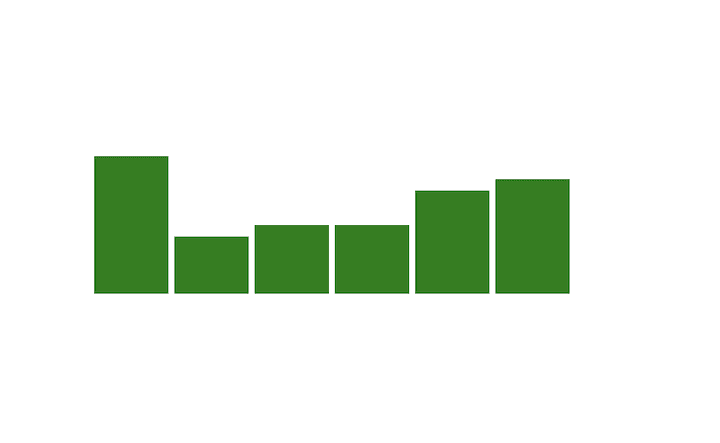
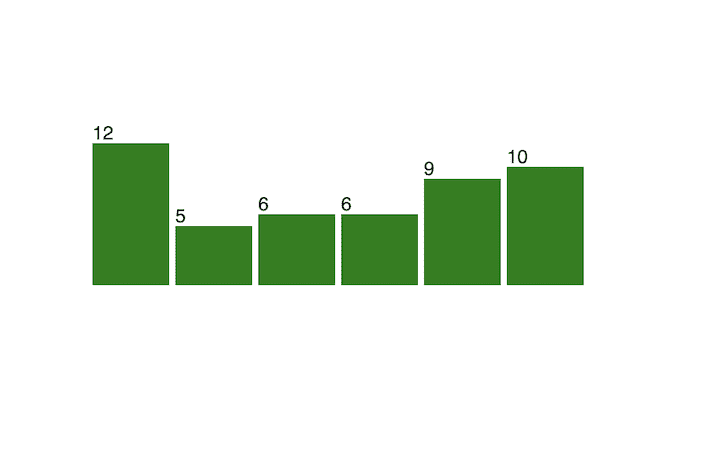

# D3.js 和 React 入门

> 原文：<https://blog.logrocket.com/getting-started-d3-js-react/>

***编者按:*** *本文最后更新于 2022 年 12 月 14 日，以反映 D3.js v7 中的更改。*

React 和 D3.js 都是 JavaScript 库，使开发人员能够创建引人入胜、可重用的数据可视化，如面积图、折线图、气泡图等。

尽管 React 和 D3 在前端开发人员中是非常受欢迎的一对，但这两个库在一起使用可能会很有挑战性。在本文中，我们将介绍如何在 React 中使用 D3，讨论为什么应该使用 D3，并演示如何在 React 中用 D3 创建图表。

我们将详细介绍以下内容:

## D3.js 和 React 是什么？

[D3.js](https://d3js.org/) 是一个 JavaScript 库，用于使用 HTML、CSS 和 SVG 创建[动态、交互式数据可视化](https://blog.logrocket.com/data-visualization-angular-d3-js/)。D3 将数据绑定到 DOM 及其元素，使您能够通过更改数据来操作可视化。在撰写本文时，最新的版本是 [D3.js v7.7](https://github.com/d3/d3/releases/tag/v7.7.0) 。

虽然 D3 对 web 标准的关注使您能够利用现代浏览器的全部功能，而不会将自己限制在专有框架中，但 D3.js 和 React 通常一起使用，以实现动态数据可视化。

React 是一个开源的前端 JavaScript 库，用于构建复杂的用户界面和 UI 组件。它是一个声明性的、高效的、灵活的框架，允许您构建由简单的、可重用的组件组成的复杂 ui。这些组件能够自己保持它们的状态。

要获得帮助您开始使用 React 和 D3.js 的可视化指南，请查看下面的视频教程:

 [https://www.youtube.com/embed/YKDIsXA4OAc?version=3&rel=1&showsearch=0&showinfo=1&iv_load_policy=1&fs=1&hl=en-US&autohide=2&wmode=transparent](https://www.youtube.com/embed/YKDIsXA4OAc?version=3&rel=1&showsearch=0&showinfo=1&iv_load_policy=1&fs=1&hl=en-US&autohide=2&wmode=transparent)

视频

## 为什么要用 D3.js？

数据可视化有助于您使用形状、线条和颜色清晰高效地交流信息。web 上有许多数据可视化工具，但 D3.js 赢得了无数前端开发人员的信任，使其成为 JavaScript 中数据可视化的事实上的选择。

[D3.js 速度极快，支持大型数据集](https://blog.logrocket.com/creating-visualizations-d3-typescript/)和动态行为，使您能够使用动画和其他引人注目的功能来促进用户交互。

## 如何在 React 中使用 D3.js

D3.js 和 React 一起使用可能很有挑战性，因为两个库都想处理 DOM。它们都控制 UI 元素，并且以不同的方式控制。

在本文中，我们将学习如何通过使用两个库构建一个简单的条形图来充分利用 React 和 D3 的独特优势。首先，我们需要安装 React 和 D3。你可以在 GitHub 上找到[完成的应用的完整代码。](https://github.com/rosdec/react-d3)

### 设置 React

为了设置 React，我们将使用 [Create React App](https://create-react-app.dev/) 样板文件。运行以下代码，将其全局安装到本地计算机上，以便可以重用:

```
npm install -g create-react-app

```

接下来，我们将使用`create-react-app`模板创建一个新的应用程序。务必使用 React 的[最新版本，在撰写本文时是版本 18](https://blog.logrocket.com/using-strict-mode-react-18-guide-new-behaviors/) 。请随意将`react-d3`更改为项目目录的不同名称:

```
create-react-app react-d3

```

在新创建的项目中更改目录:

```
cd react-d3

```

### 设置 D3.js

您可以使用 CDN 或通过 npm 安装将 D3.js 库添加到您的应用程序中，如下所示。正如所料，这将安装 D3.js 的最新稳定版本，在撰写本文时为 v7.7:

```
npm install d3

```

现在，我们可以开始使用 D3 在 React 中创建数据可视化。要在默认浏览器上预览刚刚创建的应用程序，请运行以下代码:

```
npm start

```

上面的命令还将启用 web 应用程序的热重新加载，这在修改代码时非常有用。

## 如何在 React 中用 D3.js 制作图表

用您喜欢的文本编辑器打开新创建的项目，并导航到`src/App.js`，这是当前在浏览器中呈现的组件。我们需要删除由`App()`方法返回的内容，这是您的 web 应用程序的主要入口点，以便我们可以用自己的内容替换它。

现在，让我们添加以下代码:

```
import BarChart from './BarChart'

const App = () => {
    return ( <BarChart /> )
}
export default App;

```

`<BarChart>`标签是收集条形图的组件，而`BartChart.js`是呈现条形图的地方。在`src`文件夹中，创建一个名为`BarChart.js`的新 JavaScript 文件。

## 用 D3.js 和 React 建立条形图

首先，将以下代码添加到`BarChart.js`文件中:

```
import React, {Component} from 'react';
import * as d3 from "d3";

class BarChart extends Component {

}

export default BarChart;

```

为了在 DOM 中挂载了`BarChart`组件时显示条形图，我们将使用 [`ComponentDidMount`生命周期方法](https://reactjs.org/docs/react-component.html)。

接下来，将以下代码添加到`BarChart`组件中:

```
class BarChart extends Component {

  componentDidMount() {
    this.drawChart();
  }
}

```

是我们将执行所有 D3.js 魔术的方法。通常，在不使用 React 的情况下使用 D3.js 时，您不必将 D3.js 代码放在方法中，但是在 React 中，这一步很重要，可以确保只有当组件已经安装在 DOM 上时，图表才会显示。

接下来，我们将如下创建`drawChart`方法:

```
drawChart() {

  const data = [12, 5, 6, 6, 9, 10];

  const svg = d3.select("body").append("svg").attr("width", 700).attr("height", 300);

}

```

首先，我们定义了`data`变量，它包含了我们想要可视化的数据。接下来，我们使用 D3.js 方法定义一个 SVG。我们使用 [SVG 是因为它是可扩展的](https://blog.logrocket.com/how-to-use-svgs-in-react/)，这意味着无论屏幕有多大，或者你放大多少来查看数据，它都不会出现像素化。

我们使用`d3.select()`从文档中选择一个 HTML 元素。它选择与传递的参数匹配的第一个元素，并为其创建一个节点。在本例中，我们传递了`body`元素，稍后我们将对其进行更改，以使组件更加可重用。

`append()`方法将一个 HTML 节点附加到选中的项目上，并返回该节点的句柄。我们使用`attr`方法向元素添加属性，这些属性可以是通常添加到 HTML 元素的任何属性，比如`class`、`height`、`width`或`fill`。

然后，我们用`width: 700`和`height: 300`将一个 SVG 元素附加到`body`元素上。在我们创建的 SVG 变量下，添加以下代码:

```
svg.selectAll("rect").data(data).enter().append("rect")

```

就像`select`方法一样，`selectAll()`选择与传递给它的参数相匹配的元素。因此，匹配参数的所有元素都会被选中，而不仅仅是第一个元素。

接下来，我们使用`data()`方法将作为参数传递的数据附加到所选的 HTML 元素。通常，这些元素是找不到的，因为大多数可视化处理的是动态数据，而且几乎不可能估计将要表示的数据量。

`enter()`方法将我们从瓶颈中解救出来，因为它与`append`方法一起使用来创建丢失的节点，并且仍然可视化数据。

### 可视化数据

到目前为止，我们已经为数组中的每个数据点创建了节点。剩下的就是让它可见。为此，我们需要为数据数组中的每个点创建一个条形，设置宽度，并动态更新每个条形的高度。

`attr`方法允许我们使用回调函数来处理动态数据:

```
selection.attr("property", (d, i) => {})

```

在上一行中，`d`代表数据点值，`i`是数组的数据点索引。

首先，我们需要在条形图的 x 轴和 y 轴上的特定点设置每个数据点。我们使用`x`和`y`属性来实现这一点，其中`x`表示横条沿 x 轴的位置，而`y`表示横条沿 y 轴的位置。

* * *

### 更多来自 LogRocket 的精彩文章:

* * *

我们还需要设置每个数据点的宽度和高度。每个数据点的宽度是恒定的，因为条形的宽度相同。另一方面，高度取决于每个数据点的值。要让条形图显示每个数据点的值，我们必须使用回调函数。

我们将修改我们的 SVG 变量如下:

```
svg.selectAll("rect")
  .data(data)
  .enter()
  .append("rect")
  .attr("x", (d, i) => i * 70)
  .attr("y", 0)
  .attr("width", 65)
  .attr("height", (d, i) => d)
  .attr("fill", "green");

```

对于`x`，数组中数据点的每个索引都乘以一个常量整数`70`，以将每个条形的位置移动 70°，而`y`有一个常量值，我们稍后会更改。

宽度也有一个常量值 65，它小于图表上每个元素的位置，在每个元素之间创建一个空间。条形的高度取决于数据集中每个条目的值。

### 用 D3.js 和 React 操作数据

现在，我们已经创建了一个条形图。然而，我们有两个问题。首先，图表中的条形很小，图表也是倒置的。

为了解决这些问题，我们将每个数据乘以一个常量值，比如说 10，以在不影响数据的情况下增加每个条形的大小:

```
.attr("height", (d, i) => d * 10)

```


D3.js and React bar chart magnified and inverted

接下来，我们需要解决酒吧被倒置的问题。但在此之前，我们先来了解一下为什么图表是倒置的。

SVG 的位置是从上到下的，所以使用`0`的`y`属性将每个条放在 SVG 元素的顶部边缘。

要解决这个问题，从 SVG 元素的高度中减去每个条的高度。请注意`10 * d`是我们之前计算得到的高度:

```
.attr("y", (d, i) => 300 - 10 * d)

```

将所有这些放在一起，`BarChart`组件如下所示:

```
import React, { Component } from 'react'
import * as d3 from 'd3'

class BarChart extends Component {
    componentDidMount() {
        this.drawChart();
    }
    drawChart() {
        const data = [12, 5, 6, 6, 9, 10];

        const svg = d3.select("body")
                    .append("svg")
                    .attr("width", 700)
                    .attr("height", 300);

        svg.selectAll("rect")
            .data(data)
            .enter()
            .append("rect")
            .attr("x", (d, i) => i * 70)
            .attr("y", (d, i) => 300 - 10 * d)
            .attr("width", 65)
            .attr("height", (d, i) => d * 10)
            .attr("fill", "green");
    }
    render() {
        return <div id={"#" + this.props.id}></div>
    }
}
export default BarChart;

```



D3.js and React bar chart

现在，我们有了一个基本的条形图。让我们更进一步，添加一些标签。

### 向条形图添加标签

要添加标签，请将以下代码添加到`drawChart`函数中:

```
        svg.selectAll("text")
            .data(data)
            .enter()
            .append("text")
            .text((d) => d)
            .attr("x", (d, i) => i * 70)
            .attr("y", (d, i) => 300 - (10 * d) - 3)

```

这类似于我们对条形所做的，但是这一次，`text`被追加。条形图现在应该如下所示:



D3.js and React bar chart with labels

## 如何使图表在 React 和 D3.js 中可重用

React 最重要的原则之一是制造可重用的组件。为此，我们需要使`BarChart`组件独立于数据，并使其成为一个参数。在这样做的时候，我们也将摆脱所有对常数的依赖，比如图形的高度和宽度。为此，我们将使用`props`机制。

现在，我们将修改`App.js`以将参数传递给`BarChart`组件:

```
import BarChart from './BarChart'

const App = () => {
    return (<BarChart 
        data={[12, 5, 6, 6, 9, 10]}
        width={700}
        height={300}/>)
}
export default App;

```

连贯地，我们修改了`BarChart`组件使用它们的方式。它们将在`BarChart.js`源文件的`props`对象中可用:

```
const data = this.props.data;

```

下面代码块的宽度和高度属性分别更改为:

```
const svg = d3.select("body").append("svg").attr("width", 700).attr("height", 300);

const svg = d3.select("body").append("svg")
  .attr("width", this.props.width)
  .attr("height", this.props.height);

```

这样，我们可以在 React 应用程序中的任何地方重用条形图。

## 结论

在本文中，我们探索了使用 D3.js 和 React 创建一个简单的条形图。然后，我们进一步定制了带标签的条形图。我们学习了如何解决在配对 D3.js 和 React 时可能出现的一些问题，比如间距问题和图表反转。

尽管 D3.js 和 React 都是流行的库，可以很好地协同工作，但是将它们配对可能会很棘手。希望这篇文章可以作为帮助你开始的指南。我希望你喜欢这篇文章，如果你有任何问题，一定要留下评论。编码快乐！

## 使用 LogRocket 消除传统反应错误报告的噪音

[LogRocket](https://lp.logrocket.com/blg/react-signup-issue-free)

是一款 React analytics 解决方案，可保护您免受数百个误报错误警报的影响，只针对少数真正重要的项目。LogRocket 告诉您 React 应用程序中实际影响用户的最具影响力的 bug 和 UX 问题。

[ ](https://lp.logrocket.com/blg/react-signup-general) [  ](https://lp.logrocket.com/blg/react-signup-general) [LogRocket](https://lp.logrocket.com/blg/react-signup-issue-free)

自动聚合客户端错误、反应错误边界、还原状态、缓慢的组件加载时间、JS 异常、前端性能指标和用户交互。然后，LogRocket 使用机器学习来通知您影响大多数用户的最具影响力的问题，并提供您修复它所需的上下文。

关注重要的 React bug—[今天就试试 LogRocket】。](https://lp.logrocket.com/blg/react-signup-issue-free)