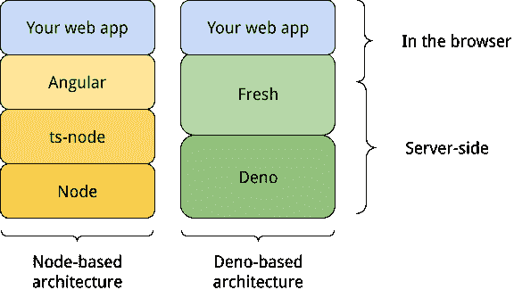
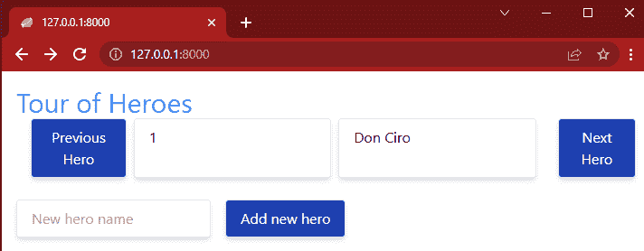
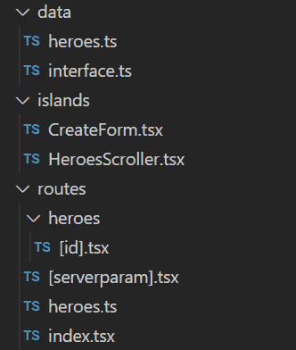
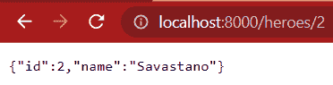
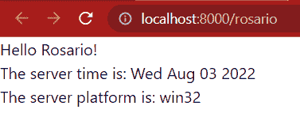
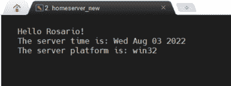

# Deno 和 Fresh 入门

> 原文：<https://blog.logrocket.com/getting-started-deno-fresh/>

时不时地，人们熟知的技术会出现新的竞争者。当然，Node.js 也会出现这种情况。最有希望的例子之一是 Deno，老实说，它似乎是正确的。

在本文中，我们将讨论 Deno 是什么，将其与 Node.js 进行比较，并使用 Deno 和 Fresh 构建一个示例 web 应用程序。web 应用程序将包含 REST API 和 web UI 的设计。我们将描述一些新鲜的机制和一个(穷人)的数据库解决方案，创建一个前端，并展示工作的应用程序。

这个演示示例在 GitHub 上可用[，其灵感来自于《英雄之旅](https://github.com/rosdec/deno_fresh_heroes)的角度[示例。](https://angular.io/tutorial)

## 什么是德诺？

Deno 是一个 TypeScript 和 WebAssembly 运行时，它为 Node 的一些老问题提供了革命性的方法。Deno 的开发特别开始克服 Node 的一些限制，这些限制是由其设计师 Ryan Dahl 确定的，并在他 2018 年的关于 Node.js 的 [10 件我后悔的事情中进行了描述。](https://youtu.be/M3BM9TB-8yA)

Ryan 使用 Rust (Node 是用 C++编写的)从零开始构建 Deno。Deno 使用谷歌的 V8 JavaScript 引擎，类似 Node。

### 比较 Deno 和 Node.js

[很明显，这两种产品有共同的词根和相似的名字](https://blog.logrocket.com/what-is-deno/)——你注意到“Deno”只是字母混在一起的“Node”吗？Deno 也可以表示“破坏节点”

由于 Deno 原生执行 TypeScript 代码，比较 Node 和 Deno 有点不公平。最好将使用 ts-node 模块的 Node 与 Deno 进行比较，以实现类似的功能。另一方面，node 和 ts-node 将需要更多时间来安装和传输模块(在 Node 中执行`.ts`到`.js`)。

Deno 模块被设计成没有外部依赖，打破了著名的[依赖地狱](https://npm.github.io/how-npm-works-docs/theory-and-design/dependency-hell.html)。作为一个例子，[这个工具](https://npm.anvaka.com/#/view/2d/%2540angular%252Fcli)帮助我们了解对于一个使用漂亮标准技术的项目，我们需要在我们的`node_modules`目录中下载多少包。

Node 和 Deno 的另一个显著区别是 Deno 不使用 npm 生态系统。在 Deno 中，依赖关系只是通过寻址存放我们希望包含在代码库中的类型脚本文件的存储库来处理。

这两个生态系统之间还有很多其他微妙的差异，你可以在这个堆栈溢出回答中读到[。](https://stackoverflow.com/questions/53428120/deno-vs-ts-node-whats-the-difference)

## 什么是新鲜？

Deno 提供的其他标准库中，我们有 [Fresh](https://fresh.deno.dev/) 。

Fresh 是一个全栈的现代 web 框架，旨在与其他广泛使用的 web 框架(如 Angular、Next.js 等)相媲美。它提供了基于文件系统的路由(类似于 Next.js ),并有一个模板引擎，允许我们快速组装 web 应用程序 ui。

根据我们需要的组件类型，Fresh 使用 [Preact](https://github.com/preactjs/preac) 在服务器和客户机上呈现页面。

网页是由互动的孤岛组成的。对于这些孤岛，渲染(及其背后的逻辑)是在浏览器中执行的。这实现了最大的交互性，而我们的 web 应用程序的其余组件都呈现在服务器上。只有最简单的 HTML 被传送到浏览器。

## 比较基于节点和基于 Deno 的架构



上图显示了 Node、Deno、ts-node、Angular 和 Fresh 之间的架构比较，以获得更好的上下文。请注意，这有更多的层次，甚至在浏览器上运行的代码和在服务器上运行的代码之间的区别也可能是模糊的。这纯粹是比较不同组件的简化版本。

## 使用 Fresh 构建简单的 web 应用程序

在接下来的几节中，我们将分析来自这个库的[代码。架构上，代码由三部分组成:一个 REST API，一些数据，前端(MVC 有人吗？).](https://github.com/rosdec/deno_fresh_heroes)

该项目以`deno task start`开始，我们可以导航到 [`http://localhost:8000`](http://localhost:8000) 来查看示例应用程序。



UI 其实并不重要，它只是足够好地解释 Deno 和 Fresh 中的一些有趣的点。用户界面也允许我们添加英雄到我们的列表中，并在列表中滚动。当新英雄加入时，列表会动态更新。



## 了解 REST API

如上所述，REST API 由两个文件提供(`/routes/heroes.ts`和`/routes/heroes/[id].tsx`)。我们可以比较下表中的功能差异:

| **功能描述** | **请求类型** | **实施地点** |
| 获取数据库中所有英雄的名单 | 得到 | `/routes/heroes.ts` |
| 创建一个新的英雄，名字在请求体中传递 | 邮政 |
| 获取特定英雄的详细信息 | 得到 | `/routes/heroes/[id].tsx` |
| 更新给定英雄的详细信息 | 放 |
| 删除给定的英雄 | 倒三角形 |

您可能会问，使用两个不同的文件来实现相似的功能是否有什么原因。有，有！

例如，这两个 get 可以接受也可以不接受查询参数。如果没有指定查询参数，调用该方法将返回整个英雄列表。通过为`id`参数指定一个值(即主角的`id`，GET 方法将只返回单个对象。

在同一个文件中可能有相同的逻辑。然而，为了清楚起见，我将它们分成两个文件，以显示 Fresh 中动态路由的机制。

文件名`/heroes/[id].tsx`看起来有点怪。这是因为它代表了不仅仅匹配单个静态路径，而是基于一个模式匹配一大堆不同路径的可能性。这是借用了 Next.js 的机制。

这样，我们就有了一个代码来服务所有匹配`[http://localhost:8000/heroes/:id](http://localhost:8000/heroes/:id)`模式的 URL。



当我们没有用 [`http://localhost:8000/heroes`](https://localhost:8000/heroes) 指定一个参数时，我们会得到当前存档中的英雄的完整列表。这个特定的 URL 在文件`/routes/heroes.ts`中被路由。

在存储库中，我们还可以找到包含所有请求的`deno.postman_collection.json`文件。每个请求中都有一个示例，用于测试 REST API，而不需要编写代码(该文件是 Postman 格式的，但是很容易理解)。

为了保持 UI 简单，并不是 REST API 的每个函数都绑定到一个按钮。在我们的例子中，我们希望有一个完整的 REST API 来提供完整的例子。

## 设置数据库

为了使这个项目尽可能简单，我们采用了最简单的方法来保存数据:用一个数组作为全局变量。

这意味着一旦重启应用程序，我们将丢失数据的状态。对象 hero 的接口和对象的全局数组在`/data`目录中。没有什么特别令人兴奋的讨论，但是一般来说，这应该是初始化到一个适当数据库的连接的地方。

## 创建我们的前端

我们项目最重要的部分是前端！它由文件`index.tsx`(将实际使用`islands`目录下的岛中的组件)和`[serverparam].tsx`实现。

首先，我们来讨论一下`[serverparam].tsx`文件。

从名字中，我们可以猜测它将提供一个动态路由。在 URL 的路径部分成为参数`serverparam`之后，所有的东西都被传递。

代码本身一点也不复杂——它只是打印一些字符串。代码在服务器上执行，只有最终的 HTML 返回给客户端:

```
  return (
    <div>
      Hello {capitalizeFirstLetter(props.params.serverparam)}!<br />
      The server time is: {new Date().toDateString()}<br/>
      The server platform is: {platform() }
    </div>
  );

```

要测试它，只需进入 [`http://localhost:8000/rosario`](http://localhost:8000/rosario) 并接收消息:



这个页面呈现在服务器上的证据是，通过从另一台装有另一个操作系统的计算机上导航到同一个页面，它将产生完全相同的字符串(特别是关于服务器操作系统的字符串)。



上图显示了我家庭网络中一台 Linux 机器的确切输出。

现在让我们把注意力集中在应用程序的主界面`index.tsx`文件上。它使用 REST API 和数据。正如所料，代码非常简单:

```
  export default function Home() {
    return (
      <div class={tw`p-4 mx-auto max-w-screen-md`}>
        <h1 class={tw`text(3xl blue-500)`}>Tour of Heroes</h1>
        <HeroesScroller start={1} />
        <br/>
        <Create></Create>
      </div>
    );
  }

```

源代码是`.tsx`，所以它将在需要的地方使用混合了 HTML 的 TypeScript 语法。

在上面的片段中，我们可以看到,`index.tsx`文件的主要结果是组合了一个标题和两个组件:`HeroesScroller`(它也接受一个参数)和另一个名为`Create`的组件。

在讨论岛屿的概念之前，请注意样式如何使用`twind`。当我们使用以下命令在 Fresh 中创建新项目时，这是默认使用的:

```
  > deno run -A -r https://fresh.deno.dev NameOfTheProject

```

现在该谈谈岛屿了。这是在浏览器上实际执行的代码。项目中有一个名为`/island`的特殊目录，该目录中的文件被不同地处理。我们可以通过运行项目看到这一点:

```
  > deno task start
  Task start deno run -A --watch=static/,routes/ dev.ts
  Watcher Process started.
  The manifest has been generated for 4 routes and 2 islands.
  Server listening on http://0.0.0.0:8000

```

我们可以看到，Fresh 已经扫描了根目录并找到了四个路径:`index`文件、我们上面讨论的 REST API 的两个文件和`[serverparam].tsx`文件。连同这些文件，它还发现了两个岛屿(`/islands`目录中的文件)。

选择“岛”这个名字是为了强调我们想要在浏览器中实现和运行的交互性实际上是如何被隔离在这些特定的文件中的。从技术的角度来说，我们写在`islands`目录下的一个文件中的 TypeScript，被当场 transpiled 成 JavaScript 在浏览器中执行。

在官方文档中，这被称为“在客户机上对岛进行再水化”。总的来说，它对发展有着巨大的影响。

## 结论

Deno 和 Fresh 的结合是开始享受中小型 web 应用程序项目开发的一个非常好的机会。

npm 及其(臃肿的)生态系统的缺乏，连同整个开发过程中的速度，是一个明显的证据。

另一个巨大的好处是选择性地将 TypeScript 转换成 JavaScript。在交互性这个岛上，这是一股清新的空气(你看到双关语了吧？)在开发生命周期中。

Deno 模块利用了开发人员社区的丰富经验。他们可以真正无所畏惧地使用它们。最后，新模块由 Deno 核心团队审查，这在某种程度上是质量的保证。

## 使用 [LogRocket](https://lp.logrocket.com/blg/signup) 消除传统错误报告的干扰

[](https://lp.logrocket.com/blg/signup)

[LogRocket](https://lp.logrocket.com/blg/signup) 是一个数字体验分析解决方案，它可以保护您免受数百个假阳性错误警报的影响，只针对几个真正重要的项目。LogRocket 会告诉您应用程序中实际影响用户的最具影响力的 bug 和 UX 问题。

然后，使用具有深层技术遥测的会话重放来确切地查看用户看到了什么以及是什么导致了问题，就像你在他们身后看一样。

LogRocket 自动聚合客户端错误、JS 异常、前端性能指标和用户交互。然后 LogRocket 使用机器学习来告诉你哪些问题正在影响大多数用户，并提供你需要修复它的上下文。

关注重要的 bug—[今天就试试 LogRocket】。](https://lp.logrocket.com/blg/signup-issue-free)