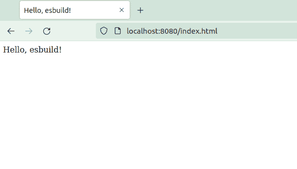
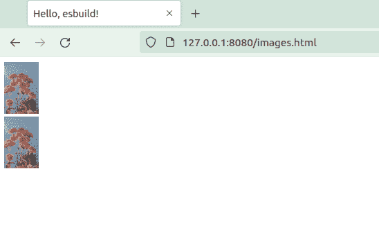
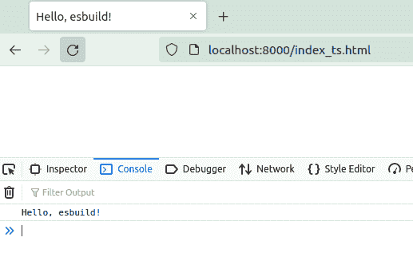
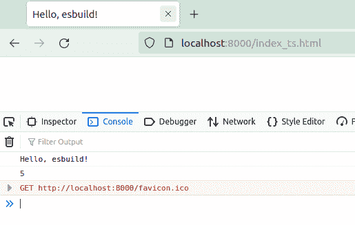

# esbuild 入门- LogRocket 博客

> 原文：<https://blog.logrocket.com/getting-started-esbuild/>

捆绑 JavaScript 应用程序需要时间，而且可能很复杂。一个单独的捆绑过程不会花费很多时间，但是在您的开发过程中，捆绑过程累积起来会大大延迟您的开发过程。

除此之外，捆绑 JavaScript 应用程序通常需要您编写一个配置文件。如果你用`webpack`捆绑一个 JavaScript 应用，你需要写`webpack.config.js`。这是很大的认知开销。

这就是 [esbuild](https://blog.logrocket.com/fast-javascript-bundling-with-esbuild/) 的用武之地。Esbuild 是一个用 Go 编写的快速简单的 JavaScript bundler。

在本文中，您将了解如何使用 esbuild 捆绑 JavaScript 应用程序。您将探索常见的用例，从捆绑 [TypeScript](https://blog.logrocket.com/whats-new-in-typescript-4-2/) 、React、图像文件和 CSS 文件到作为服务器服务于捆绑过程。

## 安装 esbuild

首先，使用 npm 安装捆扎机:

```
$ npm install -g esbuild

```

然后，您可以通过调用 esbuild 来验证安装:

```
$ esbuild --version
0.13.12

```

如果您不想全局安装 esbuild，也可以这样做:

```
$ npm install esbuild

```

但是您必须使用完整的路径来调用 esbuild:

```
$ ./node_modules/.bin/esbuild --version
0.13.12

```

## 将 TypeScript 与 esbuild 捆绑在一起

使用 esbuild 要完成的第一项任务是绑定一个 TypeScript 文件。创建一个名为`input_typescript.ts`的文件，并向其中添加以下代码:

```
    let message: string = "Hello, esbuild!";
console.log(message);

```

您可以通过 CLI 捆绑类型脚本代码:

```
$ esbuild input_typescript.ts --outfile=output.js --bundle --loader:.ts=ts

  output.js  99b 

⚡ Done in 7ms

```

然后，检查捆绑文件的内容，如下所示:

```
(() => {
  // input_typescript.ts
  var message = "Hello, esbuild!";
  console.log(message);
})();

```

esbuild 命令接受`input_typescript.ts`作为参数。我们将这个参数称为入口点，因为它是应用程序开始的地方。

然后，提供`outfile`选项来定义输出文件。如果不提供此选项，esbuild 会将结果发送到 stdout。`loader`选项是用于加载 TypeScript 文件扩展名的选项。但是，您可以省略此选项，因为 esbuild 可以根据文件扩展名决定使用哪个加载程序。

使用 bundle 选项，`esbuild`会将所有依赖项内联到输出文件中。让我们来看一个演示，看看有什么不同。

假设您有一个名为`main.ts`的文件，其内容如下:

```
import { SayHello } from "./library";

SayHello();

```

`main.ts`文件从`library.ts`导入`SayHello`，其内容如下:

```
export function SayHello() {
  console.log("Hello, esbuild!");
}

```

如果不使用`bundle`选项，esbuild 将只在结果中导入依赖项:

```
$ esbuild main.ts 
import { SayHello } from "./library";
SayHello();

```

但是如果您使用了`bundle`选项，esbuild 会在结果中内联库的内容:

```
$ esbuild main.ts --bundle
(() => {
  // library.ts
  function SayHello() {
    console.log("Hello, esbuild!");
  }

  // main.ts
  SayHello();
})();

```

使用`bundle`选项，您可以将所有代码打包到一个文件中。换句话说，两个文件变成一个文件。

## 捆绑与 esbuild 反应

将 React 库集成到您的项目中是一项复杂的任务。它甚至保证创建一个 [Create React App 项目](https://blog.logrocket.com/getting-started-with-create-react-app-d93147444a27/)。如果你想用 webpack 把 React 加入你的项目，你就得忍受[一个复杂的 webpack.config.js](https://blog.logrocket.com/versatile-webpack-configurations-react-application/) 的编写过程。

但是使用 esbuild，这是一个简单的过程。

首先，使用 npm 安装 React 库:

```
$ npm install react react-dom

```

然后创建一个名为`App.js`的 JavaScript 文件。将以下代码添加到文件中:

```
import React from "react";
import ReactDOM from "react-dom";

function App() {
  return (
    <div>Hello, esbuild!</div>
  );
}

ReactDOM.render(<App />, document.getElementById("root"));

```

创建一个名为`index.html`的 HTML 文件，这样 React 可以将您的应用程序呈现到带有 ID root 的 div 中。将以下代码添加到文件中:

```
<!DOCTYPE html>
<html>

<head>
  <meta charset="UTF-8" />
  <meta name="viewport" content="width=device-width, initial-scale=1, shrink-to-fit=no">
  <title>Hello, esbuild!</title>
</head>

<body>
  <div id="root"></div>
  <script src="AppBundle.js"></script>
</body>

</html

```

在 HTML 文件中，我们使用的是`AppBundle.js`。这是捆绑的 JavaScript 文件的名称。

现在，将`App.js`捆绑到`AppBundle.js`:

```
$ esbuild App.js --bundle --outfile=AppBundle.js --loader:.js=jsx

  AppBundle.js  890.8kb

⚡ Done in 46ms

```

您已经学习了上一节中的所有选项。您使用`bundle`选项，因为您想要捆绑 JavaScript 文件。然后，使用`outfile`选项给输出文件命名。

最后一个选项`loader`，实际上并不是可选的。告诉 esbuild 使用 JSX 加载器来加载带有。js 扩展名，因为 JSX 语法在`App.js`里面。如果不使用 JSX 加载器，esbuild 将抛出一个错误。如果输入文件的扩展名为，则可以省略 loader 选项。因此，如果您将 JavaScript 文件命名为`App.jsx`，那么您可以省略`loader`选项。

既然有了`AppBundle.js`，那我们就打开`index.html`来检查一下你的捆绑过程是否有效。您必须使用 http 协议打开`index.html`，而不是文件协议。

然后，您可以使用`http-server`提供 HTML 文件:

```
$ npx http-server

```

最后打开[http://localhost:8080/index . html](http://localhost:8080/index.html)。您应该会看到下面的屏幕:



## 使用构建 API

虽然您可以用 CLI 捆绑您的 JavaScript 文件，但是您也可以选择使用[构建 API](https://esbuild.github.io/api/#build-api) 。

假设你想把`input_typescript.ts`捆绑成`output.js`。这是您将使用的命令:

```
$ esbuild input_typescript.ts --outfile=output.js --bundle --loader:.ts=ts

```

让我们试试构建 API。编写一个名为`build.js`的 JavaScript 文件，并添加以下代码:

```
require("esbuild").build({
  entryPoints: ["input_typescript.ts"],
  outfile: "output.js",
  bundle: true,
  loader: {".ts": "ts"}
})
.then(() => console.log("⚡ Done"))
.catch(() => process.exit(1));

```

导入 esbuild 库并使用其中的`build`方法。该参数是一个对象，其键和值类似于 esbuild 命令中的选项。

然后，您可以使用 Node.js 执行绑定过程:

```
$ node build.js
⚡ Done

```

您可以将`build`文件视为配置文件。就像`webpack.config.js`一样，只是针对 esbuild。

## 将 CSS 与 esbuild 捆绑在一起

让我们尝试捆绑其他东西，比如 CSS 文件。创建一个名为`color.css`的 CSS 文件，并向其中添加以下代码:

```
.beautiful {
  color: rgb(0,0,255);
}

```

然后，创建另一个 CSS 文件来导入上面的 CSS 文件。将其命名为`style.css`，并向其中添加以下代码:

```
@import 'color.css';

p {
  font-weight: bold;
}

```

要捆绑这两个 CSS 文件，可以使用 esbuild，如下所示:

```
$ esbuild style.css --outfile=out.css --bundle

  out.css  100b 

⚡ Done in 7ms

```

`out.css`的内容将是两个 CSS 文件的组合:

```
/* color.css */
.beautiful {
  color: rgb(0, 0, 255);
}

/* style.css */
p {
  font-weight: bold;
}

```

现在，您可以在 HTML 文件中只包含这一个文件。

您也可以使用`minify`选项缩小 CSS 文件:

```
$ esbuild style.css --outfile=out.css --bundle --minify

  out.css  42b 

⚡ Done in 3ms

```

CSS 文件的内容将会很紧凑，如下所示:

```
.beautiful{color:#00f}p{font-weight:bold}

```

如你所见，捆绑器甚至改变了你指定颜色的方式。输入文件使用 rgb 语法，但是输出文件使用十六进制代码，这样更紧凑。

## 捆绑图像

您还可以将映像与 esbuild 捆绑在一起。捆绑图像有两种选择:第一种是将图像作为外部文件加载到 JavaScript 文件中，第二种是将图像作为 Base64 编码的数据 URL 嵌入到 JavaScript 文件中。

我们来看看区别。首先，将一个 JPG 文件和一个 PNG 文件放入项目目录。您需要两个具有不同扩展名的图像，因为您希望以不同的方式加载这两个图像。命名 PNG 图像`image.png`和 JPG 图像`image.jpg`。

创建一个名为`images.html`的 HTML 文件，并添加以下内容:

```
<!DOCTYPE html>
<html>

<head>
  <meta charset="UTF-8" />
  <meta name="viewport" content="width=device-width, initial-scale=1, shrink-to-fit=no">
  <title>Hello, esbuild!</title>
</head>

<body>
  <div id="root">
    <div>
      
    </div>
    <div>
      
    </div>
  </div>
  <script src="out_image.js"></script>
</body>

</html>

```

然后，您需要创建一个 JavaScript 文件。将其命名为`input_image.js`，并添加以下代码:

```
import png_url from './image.png'
const png_image = document.getElementById("image_png");
png_image.src = png_url;

import jpg_url from './image.jpg'
const jpg_image = document.getElementById("image_jpg");
jpg_image.src = jpg_url

```

接下来，使用 JavaScript 文件中的 import 语句加载图像。与绑定 CSS 文件不同，您不直接绑定图像，而是通过绑定引用图像的 JavaScript 文件来绑定图像。

现在，捆绑 JavaScript 文件:

```
$ esbuild input_image.js --bundle --loader:.png=dataurl --loader:.jpg=file --outfile=out_image.js

  out_image.js        20.1kb
  image-UKQOKISI.jpg  10.1kb

⚡ Done in 11ms

```

请注意，您使用了两台装载机。的。png 扩展使用`dataurl`加载器和。jpg 扩展使用了`file`加载器。你将得到一个不同的名字，而不是`image-UKQOKISI.jpg`。

如果你偷看`out_image.js`里面，你会看到以下内容:

```
(() => {
  // image.png
  var image_default = "data:image/png;base64,iVBORw0KGgoAAAANSU..."

  // image.jpg
  var image_default2 = "./image-UKQOKISI.jpg";

  // input_image.js
  var png_image = document.getElementById("image_png");
  png_image.src = image_default;
  var jpg_image = document.getElementById("image_jpg");
  jpg_image.src = image_default2;
})();

```

如您所见，第一幅图像使用了 Based64 编码的数据 URL 格式。第二个图像使用文件路径格式。对于第二个图像，您还有一个名为`image-UKQOKISI.jpg`的外部文件。

您可以通过打开`images.html`来检查图像:

```
$ npx http-server

```

打开[http://localhost:8080/images . html](http://localhost:8080/images.html)，你会看到下面的屏幕:



## 使用插件

Esbuild 不是完整的捆绑解决方案。它默认支持 React、CSS 和 images，但不支持 SASS。如果你想捆绑 SASS 文件，你需要安装一个 esbuild 插件。esbuild 插件的列表可以在[这里](https://github.com/esbuild/community-plugins)找到。

有几个插件捆绑了 SASS 文件。在本教程中，您将使用`esbuild-plugin-sass`。使用 npm 安装插件，如下所示:

```
$ npm install esbuild-plugin-sass

```

让我们创建一个名为`style.scss`的 SCSS 文件。添加以下内容:

```
$font: Roboto;
$color: rgb(0, 0, 255);

#root {
  font: 1.2em $font;
  color: $color;
}

```

要使用`esbuild-plugin-sass`插件，您需要使用构建 API。创建一个名为`sass_build.js`的文件，并添加以下内容:

```
const sassPlugin = require("esbuild-plugin-sass");

require("esbuild").build({
  entryPoints: ["style.scss"],
  outfile: "bundle.css",
  bundle: true,
  plugins: [sassPlugin()]
})
.then(() => console.log("⚡ Done"))
.catch(() => process.exit(1));

```

注意，您使用插件时使用了`plugins`键。该条目是 SCSS 文件，但是您也可以用 JavaScript 文件填充该条目，JavaScript 文件导入 SCSS 文件。输出是 CSS 文件。

执行此构建文件:

```
$ node sass_build.js
⚡ Done

```

您可以通过打开`bundle.css`文件来检查结果:

```
/* ../../../../../../tmp/tmp-234680-cl7EYSZ4C0qM/esbuild_demo/style.css */
#root {
  font: 1.2em Roboto;
  color: blue;
}

```

## 观看模式

每次修改输入文件时都执行捆绑过程并不好玩。应该有一种自动捆绑输入文件的方法。对于这种情况，esbuild 有`watch`模式。

创建一个名为`watch_build.js`的文件，并添加以下内容:

```
require("esbuild").build({
  entryPoints: ["input_typescript.ts"],
  outfile: "output.js",
  bundle: true,
  loader: {".ts": "ts"},
  watch: true
})
.then(() => console.log("⚡ Done"))
.catch(() => process.exit(1));

```

`input_typescript.ts`文件与前面的例子相同。这是文件的内容:

```
let message: string = "Hello, esbuild!";
console.log(message);

```

像这样执行构建文件:

```
$ node watch_build.js
⚡ Done

```

进程挂起。检查`output.js`的内容:

```
(() => {
  // input_typescript.ts
  var message = "Hello, esbuild!";
  console.log(message);
})();

```

当构建过程仍然有效时，将`input_typescript.ts`的内容更改为如下所示的内容:

```
let message: string = "Hello, esbuild!";
let x: number = 3;
console.log(message);
console.log(x);

```

最后，再次检查`output.js`的内容:

```
(() => {
  // input_typescript.ts
  var message = "Hello, esbuild!";
  var x = 3;
  console.log(message);
  console.log(x);
})();

```

输出文件会自动更新。`watch`监视文件系统，以便 esbuild 可以在检测到文件更改时捆绑输入文件。

## 服务模式

还有一种自动捆绑文件的方式叫做`serve`模式。这意味着您启动一个服务器来提供输出文件。如果有人从浏览器请求输出文件，如果文件被更改，服务器将自动捆绑输入文件。

让我们创建一个名为`index_ts.html`的 HTML 文件，并向其中添加以下代码:

```
<!DOCTYPE html>
<html>

<head>
  <meta charset="UTF-8" />
  <meta name="viewport" content="width=device-width, initial-scale=1, shrink-to-fit=no">
  <title>Hello, esbuild!</title>
</head>

<body>
  <script src="output.js"></script>
</body>

</html>

```

输出文件是`output.js`，用户通过访问`index_ts.html`间接请求。输入的文件和以前一样，`input_typescript.ts`。该文件的内容如下:

```
let message: string = "Hello, esbuild!";
console.log(message);

```

这就是使用`serve`模式捆绑文件的方法:

```
$ esbuild input_typescript.ts --outfile=output.js --bundle --loader:.ts=ts --serve=localhost:8000 --servedir=.

 > Local: http://127.0.0.1:8000/

```

`serve`选项用于定义服务器和端口。`servedir`选项定义了服务器服务的目录。

现在，打开[http://127 . 0 . 0 . 1/8000/index _ ts . html](http://127.0.0.1/8000/index_ts.html)查看控制台:



将`input_typescript.ts`修改成以下代码:

```
let message: string = "Hello, esbuild!";
let x: number = 5;
console.log(message);
console.log(x);

```

现在刷新浏览器或者再次打开[http://127 . 0 . 0 . 1/8000/index _ ts . html](http://127.0.0.1/8000/index_ts.html)。您将看到以下屏幕:



如您所见，捆绑过程是自动发生的。

## 结论

在本文中，您了解了如何使用 esbuild 捆绑 TypeScript、React、CSS、图像文件和 SCSS 文件。您通过 CLI 和构建 API 使用了 esbuild 工具。您根据自己的需要用不同的选项执行了 esbuild。

本文只是触及了 esbuild 的皮毛。esbuild 还有许多方面我们没有涉及，比如使用 sourcemap、注入函数和命名资产。请查看文档以了解更多信息。这篇文章的代码可以在[的 GitHub 库](https://github.com/arjunaskykok/esbuild-demo)上找到。

## 使用 [LogRocket](https://lp.logrocket.com/blg/signup) 消除传统错误报告的干扰

[](https://lp.logrocket.com/blg/signup)

[LogRocket](https://lp.logrocket.com/blg/signup) 是一个数字体验分析解决方案，它可以保护您免受数百个假阳性错误警报的影响，只针对几个真正重要的项目。LogRocket 会告诉您应用程序中实际影响用户的最具影响力的 bug 和 UX 问题。

然后，使用具有深层技术遥测的会话重放来确切地查看用户看到了什么以及是什么导致了问题，就像你在他们身后看一样。

LogRocket 自动聚合客户端错误、JS 异常、前端性能指标和用户交互。然后 LogRocket 使用机器学习来告诉你哪些问题正在影响大多数用户，并提供你需要修复它的上下文。

关注重要的 bug—[今天就试试 LogRocket】。](https://lp.logrocket.com/blg/signup-issue-free)