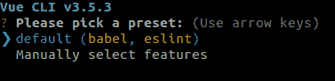
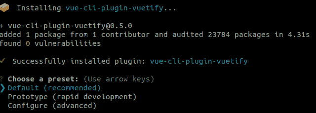
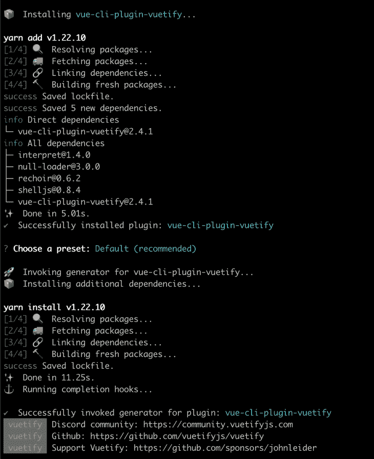
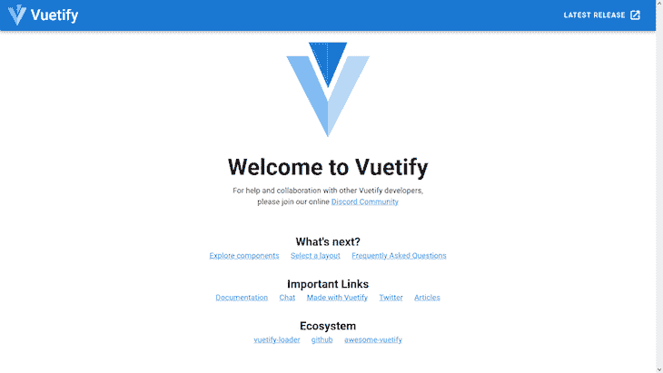
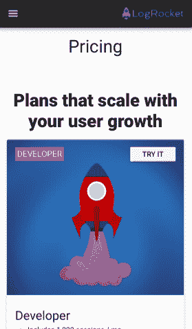
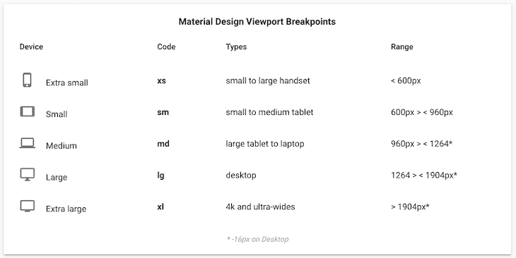

# Vuetify 入门:Vuetify 适合你吗？

> 原文：<https://blog.logrocket.com/getting-started-is-vuetify-right-for-you/>

***编者按:*** *本帖最后更新于 2022 年 8 月 17 日，以验证代码准确性并反映 Vuetify v2.x.* 中所做的更改

随着 web 应用程序中可视组件封装的新框架的引入，其他几个需求也得到了强调，包括路由、安全性、SPA 和 PWA 支持、国际化，当然还有 UI。

Vue 就是如此，它已被广泛用于开发 web 应用程序和混合移动应用程序。虽然 Vue 非常关注组件逻辑和应用程序整体，但是开发人员需要使用其他类型的 UI 库或框架来为页面添加样式和设计。

在众多处理定制和简化可视组件和屏幕设计的 UI 框架中，有几个框架采用了著名的[材质设计](https://material.io/design/)标准。社区已经广泛接受了这个选项，因为它包含了桌面和移动世界的响应性、灵活性和可扩展性。

既然大多数使用这两种范例的开发人员已经熟悉了它们的用法，为什么不将两者结合起来呢？于是，[Vue 化](https://vuetifyjs.com/en/)诞生，将 Vue 与[物化](https://materializecss.com/)趋势相结合。在本文中，我们将探索 Vuetify，学习如何设置、定制它，并探索它的特性。

您可以从 [my GitHub repo](https://github.com/nefejames/logrocket-vuetify-update) 获得本文的完整源代码。我们开始吧！

## 什么是 Vuetify？

Vuetify 符合材料设计规范，这意味着默认情况下 Vue 和材料的核心功能都是可用的，两个社区都可以对其进行改进。此外，Vuetify 还提供以下功能:

*   与 Vue CLI-3 和 RTL 的兼容性
*   各种框架的模板，如 Cordova、webpack 等。
*   国际化
*   SSR 和 PWA

使用 [Vuetify 意味着你必须接受材料设计](https://blog.logrocket.com/best-ui-frameworks-vue-3/#vuetify-3-titan)。因此，面向 iOS 领域的应用并不适合 Vuetify。同样，如果你需要一个整体风格的定制设计，Vuetify 可能也不适合你。和往常一样，你仍然需要对你的项目需求进行更深入的分析。

为了更好地理解 Vuetify 的工作原理，我们将从头开始创建一个简单、响应迅速、基于材料的页面，其中包含来自 [LogRocket 的定价页面](https://logrocket.com/pricing/)、**定价**菜单中的计划选项:

[](https://logrocket.com/signup)

注意，元素的布局非常直观，卡片的模板让人想起 Bootstrap 如何使用网格。

## 安装和设置 Vuetify

让我们先把这个项目需要的所有东西都摆出来。首先，你需要在你的机器上安装 npm 的[最新版本。在本教程中，我们使用 Node.js v14.17.4 和 npm v6.14.14。为了更好地管理您的 Node.js 版本，您可以使用](https://www.npmjs.com/get-npm) [nvm](https://github.com/nvm-sh/nvm) 。

要全局安装 Vue CLI，首先，您需要检查您是否已经安装了它的先前版本。包装名称从`vue-cli`更改为`@vue/cli`。尝试运行以下命令来全局卸载旧软件包:

```
npm uninstall -g vue-cli

```

然后，运行以下命令安装正确的软件包:

```
npm install -g @vue/cli

```

使用以下命令检查安装的版本:

```
vue --version

```

上面的命令应该打印如下版本:

```
@vue/cli 4.5.13

```

接下来，我们将搭建我们的应用程序，并使用一系列预置文件来简化我们的工作，比如`.vue`模板文件、`index.html`和`main.js`:

```
vue create vuetify-logrocket

```

安装指南将询问您想要使用哪些 JavaScript 和 lint 编译器预设:



让我们暂时保留默认选项，通过选择**输入**继续。等待安装完成，然后`cd`进入创建的应用程序的目录。运行以下命令将 Vuetify 添加到您的项目中:

```
cd vuetify-logrocket
vue add vuetify

```

等到安装程序将您带到下一个预设选项，这次是从 Vuetify:



保持预设不变，等待安装完成。下图显示了添加插件后的输出:



要启动应用程序，只需运行`npm run serve`命令。这样做将导致文件更改观察器启动并监听我们的编辑，自动更新页面:



## 自定义虚拟化页面

在继续本教程之前，我建议阅读一下官方文档中关于 Vuetify 的一些基本组件。

我们不会在`App.vue`中使用 Vuetify 生成的任何内容，所以您可以删除所有内容。我们将从构建屏幕的第一部分开始，包括导航、主体和页脚部分。

### 航行

导航将包括工具栏和菜单。当通过桌面查看时，我们的应用程序将遵循深度菜单显示模式，以及在智能手机上使用汉堡图标模板查看移动应用程序和网站时常见的`navigation drawer`。

下图显示了我们的网站将如何在 iPhone 上显示:



首先，在`/src/components/`文件夹中创建一个名为`navigation.vue`的新文件，并添加以下代码:

```
<template>
    <span>
        <v-navigation-drawer app v-model="drawer">
            <v-list>
                <template v-for="(menu, i) in menus">
                    <v-list-item :key="i">
                        <v-list-item-content>
                            {{menu.value}}
                        </v-list-item-content>
                    </v-list-item>
                    <v-divider :key="`divider-${i}`"></v-divider>
                </template>
            </v-list>
        </v-navigation-drawer>
        <v-app-bar app dark>
            <v-app-bar-nav-icon class="hidden-md-and-up" @click="drawer = !drawer"></v-app-bar-nav-icon>
            <v-spacer class="hidden-md-and-up"></v-spacer>
            <v-img src="https://assets.logrocket.io/img/logo.png" max-width="120px" max-height="25px"></v-img>
            <v-btn flat class="hidden-sm-and-down">Pricing</v-btn>
            <v-spacer class="hidden-sm-and-down"></v-spacer>
            <v-btn flat class="hidden-sm-and-down">Customers</v-btn>
            <v-btn flat class="hidden-sm-and-down">Docs</v-btn>
            <v-btn flat class="hidden-sm-and-down">Blog</v-btn>
            <v-btn flat class="hidden-sm-and-down">Login</v-btn>
            <v-btn color="purple darken-3" class="hidden-sm-and-down">Sign Up</v-btn>
        </v-app-bar>
    </span>
</template>

<script>
export default {
    name: 'RocketNavigation',
    data() {
        return {
            drawer: false,
            menus: [
                { value: 'Pricing' },
                { value: 'Customers' },
                { value: 'Docs' },
                { value: 'Blog' },
                { value: 'Login' },
                { value: 'Sign Up' }
            ]
        };
    }
};
</script>

<style scoped>
</style>
<template>
    <span>
        <v-navigation-drawer app v-model="drawer">
            <v-list>
                <template v-for="(menu, i) in menus">
                    <v-list-item :key="i">
                        <v-list-item-content>
                            {{menu.value}}
                        </v-list-item-content>
                    </v-list-item>
                    <v-divider :key="`divider-${i}`"></v-divider>
                </template>
            </v-list>
        </v-navigation-drawer>
        <v-app-bar app dark>
            <v-app-bar-nav-icon class="hidden-md-and-up" @click="drawer = !drawer"></v-app-bar-nav-icon>
            <v-spacer class="hidden-md-and-up"></v-spacer>
            <v-img src="https://assets.logrocket.io/img/logo.png" max-width="120px" max-height="25px"></v-img>
            <v-btn flat class="hidden-sm-and-down">Pricing</v-btn>
            <v-spacer class="hidden-sm-and-down"></v-spacer>
            <v-btn flat class="hidden-sm-and-down">Customers</v-btn>
            <v-btn flat class="hidden-sm-and-down">Docs</v-btn>
            <v-btn flat class="hidden-sm-and-down">Blog</v-btn>
            <v-btn flat class="hidden-sm-and-down">Login</v-btn>
            <v-btn color="purple darken-3" class="hidden-sm-and-down">Sign Up</v-btn>
        </v-app-bar>
    </span>
</template>

<script>
export default {
    name: 'RocketNavigation',
    data() {
        return {
            drawer: false,
            menus: [
                { value: 'Pricing' },
                { value: 'Customers' },
                { value: 'Docs' },
                { value: 'Blog' },
                { value: 'Login' },
                { value: 'Sign Up' }
            ]
        };
    }
};
</script>

```

第一个标签引用了在 Vue 中创建的模板的定义。此标记要求层次结构中只能添加一个子元素；否则，我们会收到一个错误。为了绕过这种检查，我们可以添加一个`<span>`或任何其他中立的 HTML 元素来封装其他元素。对于桌面可视化组件的共存，我们需要用于移动可视化的`<v-navigation-drawer>`和`<v-app-bar>`。

让我们回顾一下其他一些重要的注意事项。我们在两个组件中都使用了`app`指令，这样 Vuetify 就知道它们在更全局的层次上属于应用程序，也就是说，如何相对于父元素调整它们的大小和重新调整它们。

`v-model`定义我们正在使用的模型类型，在本例中是抽屉。这个元素很重要，这样菜单列表就不会看起来像是悬挂着的。为您的项目提供信息的 JavaScript 代码在清单的末尾。

内容的其余部分表示一个循环，它遍历菜单元素，这是在`menus`元素中预定义的。这里，我们使用 [`<v-list>`](https://vuetifyjs.com/en/components/lists/) 组件来迭代和组合标题子元素`<v-list-title>`和`<v-divider>`。

在`<v-app-bar>`元素中，我们为 Vuetify 的默认夜间风格导入使用了 dark 指令。组件代表我们的汉堡包图标。当然，它应该只在我们以移动模式查看应用程序时出现，这就是为什么工具栏的所有元素都接收了[材质设计视口断点](https://vuetifyjs.com/en/framework/breakpoints#breakpoints)的 CSS 类。

这是 Vuetify 基于当前视口控制元素显示的默认机制。请参见下面每个 Vuetify 前缀的官方尺寸:



这些条件遵循`[hidden-{breakpoint}-{condition}](https://vuetifyjs.com/en/framework/display)`格式。

在`hidden-md-and-up`类中，断点将中型设备的视口大小设置为`md`，条件应用基于`and-up`的类。换句话说，它隐藏了指定断点`md`和更大的`lg`到`xl`断点上的元素。工具栏的其余元素则相反。当设备视窗小`sm`或更小`down`时，它们将被隐藏。

对于颜色，Vuetify 提供了一个[预定义的调色板](https://vuetifyjs.com/en/framework/colors#colors)，你可以通过 CSS 类使用它。最后，`@click`属性定义了点击汉堡包图标将触发导航抽屉的激活。否则，点击不会生效。值得记住的是效果是一个开关。

### 身体

现在，让我们为定价计划创建第二个模板，即主体。为此，在同一目录中创建一个名为`plans.vue`的新文件，并添加以下代码:

```
<template>
    <v-container grid-list-lg>
        <v-row column>
            <v-col class="text-xs-center display-1 my-5">Pricing</v-col>
            <v-col class="text-xs-center display-1 font-weight-black">Plans that scale with your user growth</v-col>
        </v-row>
        <v-row row wrap>
            <v-col>
                <v-card>
                    <v-img :src="images.rocket1" height="300px">
                        <v-container fluid>
                            <v-row>
                                <v-col flexbox>
                                    <span class="subheading purple white--text px-1 py-1">DEVELOPER</span>
                                </v-col>
                                <v-btn small>Try it</v-btn>
                            </v-row>
                        </v-container>
                    </v-img>

                    <v-card-title primary-title>
                        <div>
                            <h3 class="headline">Developer</h3>
                            <ul>
                                <li>Includes 1,000 sessions / mo</li>
                                <li>14 day data retention</li>
                            </ul>
                        </div>
                    </v-card-title>
                </v-card>
            </v-col>

            <v-col>
                <v-card>
                    <v-img :src="images.rocket2" height="300px">
                        <v-container fluid>
                            <v-row fill-height>
                                <v-col flexbox>
                                    <span class="subheading purple white--text px-1 py-1">TEAM</span>
                                </v-col>
                                <v-btn small>Try it</v-btn>
                            </v-row>
                        </v-container>
                    </v-img>
                    <v-card-title primary-title>
                        <div>
                            <h3 class="headline">Team</h3>
                            <ul>
                                <li>Starting at 10,000 sessions / mo</li>
                                <li>Starting at 1 month retention</li>
                            </ul>
                        </div>
                    </v-card-title>
                </v-card>
            </v-col>

            <v-col>
                <v-card>
                    <v-img :src="images.rocket3" height="300px">
                        <v-container fluid>
                            <v-row fill-height>
                                <v-col flexbox>
                                    <span class="subheading purple white--text px-1 py-1">PROFESSIONAL</span>
                                </v-col>
                                <v-btn small>Try it</v-btn>
                            </v-row>
                        </v-container>
                    </v-img>
                    <v-card-title primary-title>
                        <div>
                            <h3 class="headline">Professional</h3>
                            <ul>
                                <li>Any volume of Sessions</li>
                                <li>Custom data retention</li>
                                <li>On-premise available</li>
                            </ul>
                        </div>
                    </v-card-title>
                </v-card>
            </v-col>
        </v-row>
    </v-container>
</template>

<script>
export default {
    name: 'RocketPlans',
     data() {
        return {
            images: {
                rocket1: require('../assets/rocket_1.jpg'),
                rocket2: require('../assets/rocket_2.jpg'),
                rocket3: require('../assets/rocket_3.jpg')
            }
        }
    }
};
</script>

```

Vuetify 附带了一个[强大的 12 点网格系统](https://vuetifyjs.com/en/components/grids/)，你可以用它来制作网络应用。网格系统构建在 CSS Flexbox 之上，它提供了五个媒体查询断点，您可以使用它们来针对特定的屏幕大小:

*   `XS`:小于 600 像素的屏幕尺寸
*   `sm`:屏幕尺寸在 600 像素和 960 像素之间
*   `md`:屏幕尺寸在 960 像素和 1264 像素之间
*   `lg`:屏幕尺寸在 1264 像素到 1904 像素之间
*   `xl`:屏幕尺寸大于 1264px

网格系统提供以下组件:

*   `v-container`:可用于页面内容居中
*   `v-row`:用于`v-col`的包装组件。它有一个 24px 的标准装订线，并使用 Flexbox 来控制其子列的布局
*   `v-col`:必须是`v-row`的直接子代的内容容器。`v-col`允许您指定跨越五个断点的列宽，当没有指定列宽时，它将呈现等宽的列
*   `v-spacer`:一个间隔组件，既可以用来填充可用空间，也可以在子组件之间留出空间

我们的容器是一个简单的、水平对齐的 CSS 网格。容器中的第一项是一个列，`<v-row>`。我迅速将页面中央的两个文本与以下道具对齐:

*   `text-cs-center`:将水平 x 轴上的文本居中对齐
*   `display-1` : [默认`<h4>`元素大小的字体](https://vuetifyjs.com/en/styles/text-and-typography/)
*   `my-5`:设置[的间距，使页边距](https://vuetifyjs.com/en/framework/spacing)有效。这里，`m`来自边距，`y`来自垂直的 y 轴。根据材料设计规范，范围从`0`到`5`
*   `font-weight-black` : [字体粗细](https://vuetifyjs.com/en/styles/text-and-typography/#font-weights)用于字体排版；将字体粗细设置为`900`

下一个布局是由三张卡片组成的一行。每张卡片由一个`<v-card>`表示，由两个主要元素组成，一个图像和一个标题。

在 Vuetify 中，一个图像`<v-img>`由组件组成，这些组件与`src`一起工作，并直接指向可能在外部托管的图像。

要在本地访问文件，就像在我们的例子中，您需要将每个文件公开为`data`属性，以及它们各自相对于`assets`文件夹的路径；请参见清单末尾的脚本。您可以在本文开头的 GitHub 项目链接中访问这些图像文件。

在每个图像中，我们用`fluid`属性创建另一个`container`，它扩展了容器的`width`,使其与父容器相同。每个容器将包含一个带有每张卡片标题的`span`文本和一个行动号召按钮。在这里，我们使用更多的道具用于`subheading`和对齐。`px-1`代表`5`中`1`的水平填充值。

`<v-card-title>`组件定义了卡片的内容，通常是标题和描述，但也可能包含按钮等其他元素。在移动模式下查看时，Vuetify 会垂直重新排列卡片。

要创建页脚，请转到项目的 components 目录并创建`footer.vue`文件。添加以下代码:

```
<template>
  <v-footer height="auto" dark>
    <v-row justify-center row wrap>
      <v-col lighten-2 py-3 text-xs-center white--text>
        &copy;2019 — <strong>LogRocket // Vuetify</strong>
      </v-col>
    </v-row>
  </v-footer>
</template>

<script>
  export default {
    name: 'RocketFooter'
  }
</script>

```

我们简单的页脚由我们之前讨论过的项目组成。对于每个`.vue`文件，我们需要定义每个模板的名称，也就是说，它们如何在外部被其他人识别。

## 主页

对于主页面，我们将使用已经创建的`App.vue`文件。向其中添加以下代码:

```
<template>
    <v-app>
        <rocket-navigation></rocket-navigation>
        <rocket-plans></rocket-plans>
        <rocket-footer></rocket-footer>
    </v-app>
</template>

<script>
import RocketNavigation from '@/components/navigation';
import RocketPlans from '@/components/plans';
import RocketFooter from '@/components/footer';
export default {
    name: 'LogRocketApp',
    components: {
        RocketNavigation,
        RocketPlans,
        RocketFooter
    }
};
</script>

```

Vue 需要`<v-app>`标签，它集中了组成其应用程序的其他元素。

实现的其余部分相对简单。我们所要做的就是通过`import x from y`指令导入其他组件文件，然后像往常一样导出它们。注意，在我们可以在模板中使用它之前，我们必须用连字符连接每个标签。因此，Vuetify 可以识别每个 camel case 是如何翻译的。

## 结论

当开始一个新的框架时，有许多因素需要考虑。Vue 化的好处是很多利弊已经被 Vue 本身吸收了。你必须分析你的项目的真正需求。正如我们之前提到的，如果你依赖于设计本身，Vuetify 可能不适合你的项目。但是如果这样做了，你就有了一个高效且极其强大的工具来创建令人惊叹的网页。

你用过 Vuetify 吗？如果是，体验如何？请在评论中留下您的反馈。你可能会帮助别人完成类似的项目。编码快乐！

## 像用户一样体验您的 Vue 应用

调试 Vue.js 应用程序可能会很困难，尤其是当用户会话期间有几十个(如果不是几百个)突变时。如果您对监视和跟踪生产中所有用户的 Vue 突变感兴趣，

[try LogRocket](https://lp.logrocket.com/blg/vue-signup)

.

[](https://lp.logrocket.com/blg/vue-signup)[https://logrocket.com/signup/](https://lp.logrocket.com/blg/vue-signup)

LogRocket 就像是网络和移动应用程序的 DVR，记录你的 Vue 应用程序中发生的一切，包括网络请求、JavaScript 错误、性能问题等等。您可以汇总并报告问题发生时应用程序的状态，而不是猜测问题发生的原因。

LogRocket Vuex 插件将 Vuex 突变记录到 LogRocket 控制台，为您提供导致错误的环境，以及出现问题时应用程序的状态。

现代化您调试 Vue 应用的方式- [开始免费监控](https://lp.logrocket.com/blg/vue-signup)。