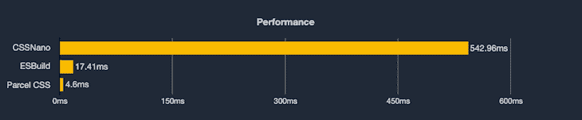

# 包 CSS 入门

> 原文：<https://blog.logrocket.com/getting-started-parcel-css/>

几乎所有的前端开发工作流都包括一个构建工具、bundler 或 transpiler，以确保代码语法符合现代 web 浏览器的标准。

设置这些配置并不总是容易的；它需要一些设计工作流的专业知识和熟悉程度。 [Parcel 是一个构建工具，由于它支持无配置代码捆绑，解决了前端开发人员在设计构建工作流时面临的一个至关重要的挑战，因此获得了指数级增长](https://blog.logrocket.com/what-you-need-to-know-about-parcel-2/)。

尽管 Parcel 很受欢迎，但它的维护者仍在不断改进，正如 CSS 解析器、编译器和迷你器 [Parcel CSS](https://parceljs.org/blog/parcel-css/) 的发布所证明的那样。在本教程中，我们将学习包 CSS 的基础知识，包括设置和编写在构建时自动缩小的 CSS。我们将探索是什么使 Parcel CSS 具有如此高的性能，将它的速度和缩小的输出与其竞争对手进行比较。

### 先决条件

要跟随本教程，您需要:

*   熟悉 CSS、HTML 和 JavaScript ES6
*   安装在您机器上的网络浏览器
*   安装在开发机器上的代码编辑器

## 包裹 CSS 的基础

[与其他现有的构建工具](https://blog.logrocket.com/purgecss-remove-unused-css-code/)相比，Parcel CSS 的设计考虑了性能，重点是在编译 CSS 代码时减少缩小的输出和大小。

通过它的 [JavaScript API](https://github.com/parcel-bundler/parcel-css#from-javascript) ，它的 [Rust 库](https://docs.rs/parcel_css/1.0.0-alpha.14/parcel_css/)，或者通过在你喜欢的构建工具中将它构建为一个插件，package 可以作为一个独立的包使用。它还具有特定于目标的配置支持，这意味着您可以指定您想要编译的目标浏览器。为 Safari v13.2 编译的 Parcel CSS 的基本配置如下所示:

```
const css = require('@parcel/css');

let {code, map} = css.transform({
  filename: 'style.css',
  code: Buffer.from('.foo { color: red }'),
  minify: true,
  sourceMap: true,
  targets: {
    // Semver versions are represented using a single 24-bit number, with one component per byte.
    // e.g. to represent 13.2.0, the following could be used.
    safari: (13 << 16) | (2 << 8)
  }
});

```

在上面的代码片段中:

*   `filename`(字符串):输出文件名的键
*   `code`(函数):实际的 CSS 代码
*   `minify`(布尔):决定是否缩小输出
*   `target` (object):目标浏览器，可以是支持的浏览器列表

我们的示例是一个非常基本的配置，用来演示使用包 CSS 为 CSS 文件建立工作流是多么简单和直接。在下一节中，我们将讨论一个更复杂的工作流程。

## 包裹 CSS 性能

正如我们前面提到的，包 CSS 是为性能优化而构建的。根据[发布说明](https://parceljs.org/blog/parcel-css/)，Parcel CSS 在缩小方面比它的对手 cssnano 快 100 倍。该版本还指出，该工具可以在一秒钟内在一个线程内缩小超过 270 万行 CSS 代码，使其成为编写时 CSS 代码缩小方面有史以来最快的工具。

这些承诺是否可持续，真的要由用户来决定。下面的截图是在缩小 Bootstrap 4 CSS 时，由 package CSS 的维护者执行的测试用例的结果:



请注意 CSS 缩小时间的基准，这意味着包 CSS 非常快。你可以把 Parcel CSS 的速度归因于它是用一种低级语言 Rust 编写的。然而，Parcel CSS 的开发人员透露，该工具从一开始就考虑到了性能，在不同的用例中提高了性能。

## 设置和初始化

现在我们已经意识到了使用包 CSS 的好处，让我们建立一个工作流程并实际尝试一下。在我们开始之前，回想一下在概述部分，我们提到有三种不同的方法来设置包 CSS。在本教程中，我们将使用包 CSS JavaScript API。

我们将使用 Node.js 创建我们的工作流，导航到我们的工作目录，并按照下面的说明进行设置。首先，在工作目录的根目录下创建一个新文件夹，并导航到该文件夹:

```
mkdir parcel-app && cd parcel-app

```

现在，我们将在`parcel-app`文件夹中创建一个`package.json`文件:

```
npm init -y

```

在您喜欢的代码编辑器中，打开新创建的`parcel-app`文件夹。在 Mac 终端或 Windows 命令提示符下，通过在`parcel-app`目录中运行以下命令来安装包 CSS:

```
npm i @parcel/css

```

创建一个名为`dist`的新文件夹，该文件夹将存放由包 CSS 编译和缩小后生成的 CSS。当您配置包 CSS 变换选项时，输出文件名完全由您决定。

## 用包 CSS 编写和编译 CSS

接下来，在`parcel-app`目录的根目录中，创建一个名为`index.js`的新文件，并添加以下代码:

```
const css = require("@parcel/css");
const fs = require('fs');

const enc = new TextEncoder();
const dec = new TextDecoder();
let { code, map } = css.transform({
  filename: "./dist/app.css",
  code: enc.encode(`
  *{
    border-radius: 0;
    height: 100%;
    box-sizing: border-box;
    width: 100%;
  }
  .foo { color: red }
  `),
  minify: true,
  sourceMap: true,
});
const compileCSS = (c) => {
  fs.writeFile("./dist/app.css", dec.decode(c), err => {
    if (err) throw new Error(`Error ${err}`);
    return;
  })
}
compileCSS(code);

```

在上面的代码片段中，我们使用包 CSS 包`const css = require("@parcel/css");`来缩小 CSS。我们使用 JavaScript 文本编码器和解码器类对 CSS 输入进行编码和解码。最后，我们利用 Node.js 内置文件系统包`fs`将输出写入`./dist/app.css`。

我们的例子是一个没有配置或构建工具的基本用例，允许我们关注包 CSS 是如何工作的。要查看不同用例的更复杂的设置，请随意阅读 [JavaScript API 文档](https://github.com/parcel-bundler/parcel-css)。

现在，在 Mac 终端或 Windows 命令提示符下使用下面的命令运行代码:

```
node index.js

```

您应该会看到一个名为`app.css`的新文件被添加到了`dist`文件夹中，该文件包含类似如下的代码:

```
*{height:100%;box-sizing:border-box;width:100%;border-radius:0}.foo{color:red}

```

请注意，CSS 会自动被 Parcel CSS 缩小。

## 结论

鉴于其性能和优化承诺，我预测包 CSS 解析器和 minifier 将是前端构建工作流设置中的一场革命。与作为构建工具的 Parcel 相结合，可以在几分钟内建立复杂且高性能的工作流。使用这个工具可以做很多事情，我强烈建议查看文档以了解更多信息。有问题一定要留下评论，编码愉快！

## 你的前端是否占用了用户的 CPU？

随着 web 前端变得越来越复杂，资源贪婪的特性对浏览器的要求越来越高。如果您对监控和跟踪生产环境中所有用户的客户端 CPU 使用、内存使用等感兴趣，

[try LogRocket](https://lp.logrocket.com/blg/css-signup)

.

[](https://lp.logrocket.com/blg/css-signup)[https://logrocket.com/signup/](https://lp.logrocket.com/blg/css-signup)

LogRocket 就像是网络和移动应用的 DVR，记录你的网络应用或网站上发生的一切。您可以汇总和报告关键的前端性能指标，重放用户会话和应用程序状态，记录网络请求，并自动显示所有错误，而不是猜测问题发生的原因。

现代化您调试 web 和移动应用的方式— [开始免费监控](https://lp.logrocket.com/blg/css-signup)。