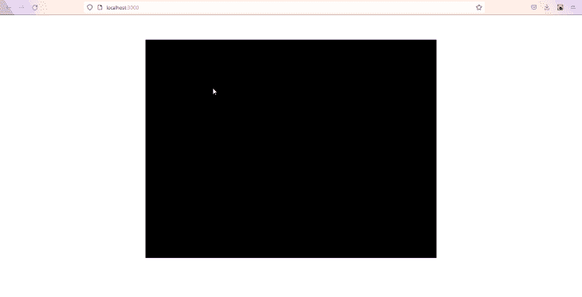
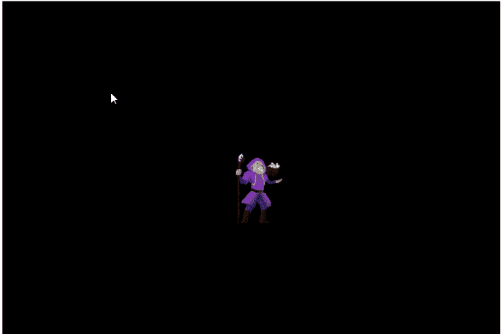
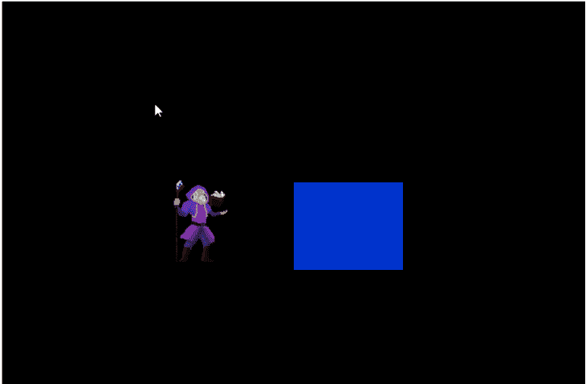
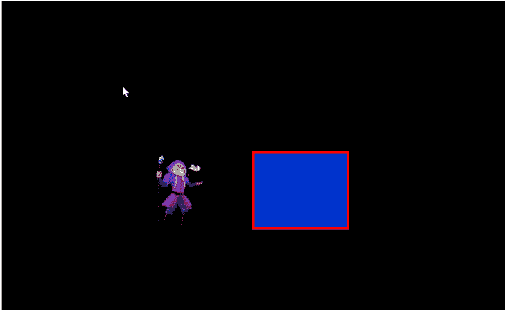
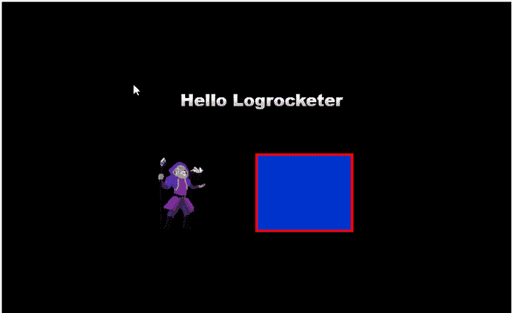
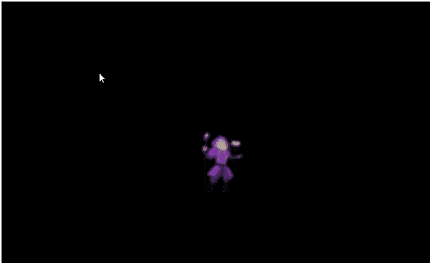
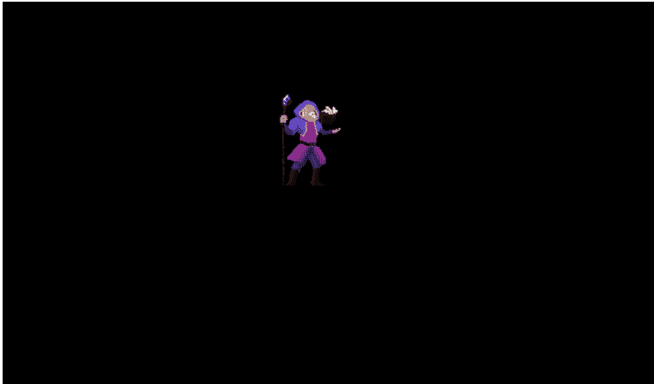

# PixiJS 和 React 入门:创建一个 canvas 

> 原文：<https://blog.logrocket.com/getting-started-pixijs-react-create-canvas/>

曾几何时，在网络上创建丰富的交互式图形体验只能通过现已废弃的 Adobe flash player 插件来实现。但是，WebGL 的出现改变了游戏规则。它带来了一个丰富的网络可视化时代。

WebGL 是一个 JavaScript 渲染 API，提供高性能 2D 和 3D 交互式图形功能以及 GPU 加速。与它的前身不同，这种 API 可以在任何没有插件的兼容网络浏览器中工作。然而，WebGL 有一个更陡峭的学习曲线，所以在 API 上构建了几个框架来减轻直接使用它的复杂性。

以下是基于 WebGL 构建的一些最流行的框架:

在本文中，我们将回顾开始使用 PixiJS 需要知道的一切，pix ijs 是一个用于通过 React 渲染 2D 图形的超快速 WebGL 框架。本文的演示部分将包括几个 PixiJS 动画示例。

*向前跳转:*

## 先决条件

要学习本教程，您应该具备以下条件:

*   React 及其概念的基础知识
*   对 PixiJS(通常称为 PIXI)的基本了解

## 在 React 中实现 PixiJS

PixiJS 被设计成开箱即用的 HTML5。在 React 这样的库中实现它需要一个助手库，比如 [ReactPixi](https://reactpixi.org) ，这将有助于 PixiJS 应用程序的集成和呈现。

ReactPixi 是一个开源库，用于在 React 中呈现高性能的 PixiJS 应用程序。该库提供了有用的组件，使得使用 React 的声明式风格编写 PixiJS 应用程序更加容易和快速。

让我们通过一个例子来看看如何在 react 中实现和呈现 PixiJS 应用程序。

## 建立一个 React 项目

作为第一步，我们需要建立一个样例 React 项目并安装所需的包。

让我们通过在终端中运行以下命令，用 [create-react-app](https://create-react-app.dev) 引导 React 应用程序:

```
npx create-react-app pixi-react-app

```

create-react-app 会在一个`pixi-react-app`文件夹里面安装 react 的最新版本。然而，在撰写本文时，ReactPixi 不支持 React v18。因此，在我们可以在我们的项目中使用这个库之前，我们需要将 React 降级到版本 17。

为此，首先，打开项目根文件夹中的`package.json`文件，并替换以下代码行:

```
"react": "^18.0.0"
"react-dom": "^18.0.0"

```

使用以下代码片段:

```
"react": "^17.0.2"
"react-dom": "^17.0.2"

```

接下来，转到`index.js`文件并替换以下代码:

```
import ReactDOM from 'react-dom/client'

```

使用此命令:

```
import ReactDOM from 'react-dom';

```

此外，替换以下代码:

```
const root = ReactDOM.createRoot(document.getElementById('root'));
root.render(
  <React.StrictMode>
    <App />
  </React.StrictMode>
);

```

使用以下代码片段:

```
ReactDOM.render(
  <React.StrictMode>
    <App />
  </React.StrictMode>,
  document.getElementById('root')
);

```

最后，删除项目根文件夹中的`node_modules`文件夹，并运行:

```
npm install

```

运行上述命令后，您的 React 项目将降级到 v17。现在您可以安装 PixiJS 和 ReactPixi 了:

```
npm install pixi.js @inlet/react-pixi

```

## 创建 PixiJS 画布

建立项目后，清理样板代码和文件。接下来，打开`App.js`文件，从 ReactPixi 导入`Stage`组件:

```
import Stage from "@inlet/react-pixi"

```

PIXI 不直接向 DOM 渲染对象。相反，它有一个渲染器，可以生成 HTML5 画布，作为浏览器中精灵和纹理等对象的显示区域。我们刚刚导入的`Stage`组件包含创建 PIXI 渲染器的底层代码。

该组件还作为一个根容器对象，在 PIXI 称为`Stage`。这个`Stage`对象是一个根容器，它保存了我们希望 PIXI 显示给渲染器的所有对象。

您可以将`Stage`组件添加到`App.js`组件，如下所示:

```
const App = () => {
  return(
  <Stage>
  </Stage>
)}

```

现在，通过在终端中运行`npm start`来启动开发服务器。您应该会在浏览器中看到一个类似下图的矩形画布元素。



呈现的黑色方块是 PIXI 将显示对象的显示区域。

`Stage`组件接受可用于配置画布的属性。例如，`width`和`height`道具被设置为确定画布的尺寸。

```
const App = () => {
  return(
  <Stage width={300} height={300}>
  </Stage>
)}

```

我们还可以使用`options`属性为`Stage`组件设置更多属性，比如抗锯齿(`antialias`)、`autoDensity`和`backgroundColor`。

```
const App = () => {
  return(
  <Stage 
  width={300} 
  height={300} 
  options={{ 
  backgroundColor: 0x012b30, 
  antialias: true 
  }}>

  </Stage>
)}

```

现在，让我们看看如何将对象渲染到画布上。

## 渲染精灵

精灵是精灵的组成部分。这些特殊的图像可以用代码操纵和控制。在属性的帮助下，小精灵对于制作交互式和动画图形非常有用，这些属性让我们可以控制它们的位置、大小和许多其他特性。

用 ReactPixi 渲染精灵相当简单。该库提供了一个`Sprite`组件，可用于将图像加载和渲染到浏览器中。该组件消除了在将 sprite 图像加载到渲染器之前将其转换为 WebGL 纹理的复杂性。

要使用`Sprite`组件，将其导入到`App.js`文件中，如下所示:

```
import { Stage, Sprite} from '@inlet/react-pixi'

```

`Sprite`组件提供了几个有用的属性，可以用来操作和控制精灵图像的外观和位置。一个例子是`image`属性，它接受要呈现到画布上的图像的相对或绝对 URL。

将 sprite 加载到画布上就像将`Sprite`组件嵌套在`Stage` JSX 标签中，并将指向图像源的 URL 传递给`image`道具一样简单:

```
...
import wizard from "./wizard.png";

const App = () => {
  return(
  <Stage ...>
      <Sprite image={wizard} />
  </Stage>
)} 

```

加载图像并保存项目后，您应该会在浏览器的画布中看到`Sprite`图像。



Thanks to [LuizMelo](https://luizmelo.itch.io/) for making this sprite free for us to use.

`Sprite`组件的一些可选道具包括`width`和`height`道具以及`x`和`y`道具。`width`和`height`属性用于操纵精灵的尺寸，而`x`和`y`属性用于定位精灵。`x`支柱将精灵定位在 x 轴上，而`y`支柱将其定位在 y 轴上。

```
<Sprite image={wizard} x={150} y={150}/>

```

## 渲染图形

我们可以用 ReactPixi 做更多的事情，而不仅仅是将图像加载到渲染器中。该库提供了一个`Graphics`组件，它利用 PIXI 的低级绘图工具，使我们能够绘制不同种类的形状和线条，并向渲染器添加纹理。

让我们使用`Graphics`组件向渲染器绘制一个矩形。

首先，从 ReactPixi 导入`Graphics`组件，并将其嵌套在`Stage`标记中:

```
import { Stage, Sprite, Graphics} from '@inlet/react-pixi'

```

接下来，用下面的代码创建一个函数，并将其作为一个值传递到`Graphics draw`属性中:

```
const App = () => {

    const draw = g => {
      g.beginFill(0x0033cc, 1) 
      g.drawRect(250, 150, 150, 120)
      g.endFill()
    };

  return(
  <Stage ...>
      <Sprite image={wizard} />
      <Graphics draw={draw}/>
  </Stage>
)} 

```

在 draw 函数中，我们将使用`beginFill`方法设置形状的填充颜色，然后使用`drawRect`方法绘制形状。`drawRect`的参数分别是`x`、`y`、`height`和`width`属性。

保存项目后，我们之前在画布中加载的`Sprite`图像旁边会出现一个蓝框。



我们可以通过在`draw`函数中添加一个`lineStyle`方法并赋予它以下属性来给形状一个轮廓:

```
  const draw = g => {
    ...
    g.lineStyle(4,0xff0000,1) 
    g.endFill()
  };

```



属性是一个回调函数，每次它的属性改变时都会被调用。所以一定要通过在 React 的`useCallback`钩子中声明`draw`函数来记住它:

```
  const draw = useCallback(g => {
    g.beginFill(0x0033cc, 1)
    g.lineStyle(4,0xff0000,1) 
    g.drawRect(250, 150, 150, 120)
    g.endFill()
  },[]);

```

## 呈现文本

ReactPixi 的`Text`组件利用 Pixi 的`Text`对象向渲染器显示文本。该组件有两个主要属性:`text`，它接受要显示的文本，以及`style`，它接受定义文本属性的对象。

```
<Text
    text="Hello World"
    style={
      new TextStyle({
        align: 'center',
        fill: ['#ffffff', '#00ff99'], // gradient
        stroke: '#01d27e',
        strokeThickness: 5,
        letterSpacing: 20,
  />        

```

要在项目中使用`Text`组件，首先从 ReactPixi 导入它:

```
import { Stage, Sprite, Graphics, Text } from '@inlet/react-pixi';

```

接下来，将其添加到`Stage`中，并向其传递一些`textStyle`道具:

```
const textStyle = new TextStyle({
  align: "center",
  fontWeight: "bold",
  fill: ["#26f7a3", "#01d27e"],
  stroke: "#eef1f5",
  strokeThickness: 1,
  letterSpacing: 5,
  wordWrap: false,
  wordWrapWidth: 350
})

const App = () => (
  <Stage ...>
     ….
     <Text text="Hello Logrocketer" style={textStyle}/>
     ….
  </Stage>
);

```

保存项目后，我们看到文本“Hello Logrocketer”呈现在画布上。



## 添加过滤器

ReactPixi 提供了一个`withFilters`函数，它简化了在渲染器中向对象添加过滤器的过程。该函数使用 PIXI 的全局对象来访问过滤器对象及其属性。

为了给我们的 sprite 添加滤镜，我们必须首先从 PixiJS 导入`withFilters`函数和`PIXI`全局对象，如下所示:

```
import { Stage, Sprite, Graphics, Text, withFilter } from '@inlet/react-pixi';
import * as PIXI from 'pixi.js';

```

`withFilters`函数接受两个参数，一个容器组件和一个对象配置。

```
const Filters = withFilters(Container, {
  blur: PIXI.filters.BlurFilter
});

```

`Container`参数赋予`withFilters`函数容器对象的特征。

如前所述，容器是一个用于对要在渲染器中显示的其他对象进行分组的对象。我们在`Container`上设置的过滤器将应用于嵌套在容器中的对象。

第二个参数是过滤器配置，包含过滤器的首选项。这是我们从`PIXI`全局对象访问`filter`对象并设置我们想要应用到容器的过滤器种类的地方。在本例中，我们使用`BlurFilter`对象属性应用了一个`blur`滤镜。

不要忘记从 ReactPixi 导入`Container`组件，如下所示:

```
import { Stage, Sprite, Graphics, Text, withFilter, Container } from '@inlet/react-pixi';

```

现在我们已经配置了一个过滤器容器，让我们将它应用到我们的`Sprite`中。将`Filters`容器添加到`Stage`中，并将`Sprite`组件嵌套在其中。然后，向容器传递一个`blur`道具，并赋予其以下属性:

```
const App = () => (
  <Stage>
     ….
    <Filters blur={{ blur: 5 }} >
      <Sprite image={wizard} .../>
    </Filters>
     ….
  </Stage>
);

```

这将在渲染器中给精灵添加一个模糊滤镜效果。您可以通过更改`blur`属性的值来调整模糊效果。



## 动画精灵

一个环，也称为游戏循环，是需要在 PIXI 动画对象。`gameLoop`函数每秒钟被调用 60 次，嵌套在函数中的每个代码都被同样频繁地调用。

例如，下面的代码将使向导精灵以每帧 1 个像素的速度向左移动:

```
function setup() {
  app.ticker.add((delta) => gameLoop(delta));
}
function gameLoop(delta) {
  wizard.x -= 1;
}

```

使用 PIXI 的 ticker 事件创建了一个 looper 函数；它相当于 JavaScript 的`requestAnimationFrame`方法。ReactPixi 提供了一个`useTick`钩子，将侦听器绑定到 ticker 事件。有了它，我们可以动画显示`Sprite`的位置和状态。

在我们开始制作动画之前，我们将首先分别从 ReactPixi 和 React 导入`useTick`和`useState`钩子:

```
import { useTick, ... } from '@inlet/react-pixi';
import {..., useState} from 'react'

```

接下来，让我们为向导`Sprite`创建一个新组件，并将其嵌套在`App.js`组件的容器中:

```
...
const Wizard = () =>{
  return(
    <Sprite
      image={wizard}
      x={x}
      y={y}
      anchor={0.5}
      scale={1.3}
    />
  )
}

const App = () => (
  <Stage ...>
    <Wizard />
     ….
  </Stage>
);

```

现在。在`Sprite`组件函数中添加以下代码:

```
import { Stage, Container, Sprite, Text, Graphics, withFilters,useTick } from '@inlet/react-pixi'
import { useState, useCallback} from "react";
import * as PIXI from "pixi.js"
import wizard from "./wizard.png";

let i = 0;

const Wizard = () =>{
  const [x, setX] = useState(0)
  const [y, setY] = useState(0)

  useTick(delta =>{
    i += 0.05 * delta;
    setX(Math.sin(i) * 100)
    setY(Math.sin(i/1.5) * 100)
   });

  return(
    <Sprite
      image={wizard}
      x={x}
      y={y}
      anchor={0.5}
      scale={1.3}
    />
  )
}
const App = () => (
  <Stage ...>
    <Wizard />
     ….
  </Stage>
);

```

在上面的代码块中，我们声明了一个变量`i`，并给它赋值`0`。接下来，我们使用`useState`钩子创建两个状态变量`x`和`y`，初始值为`0`。然后，我们调用`useTick`钩子并传递给它一个回调函数。

在回调函数中，我们将一个`delta`值赋给`i`变量，并将变量值乘以 100 的正弦结果设置给`x`和`y`状态变量。

最后，我们将`x`和`y`状态变量的值分别传递给`Sprite`的`x`和`y`道具。

保存代码后，您的 sprite 应该像下面的向导一样显示动画:



## 结论

在本文中，我们演示了如何创建 PIXI 画布，将精灵、文本和图形对象加载到渲染器中，为对象添加滤镜，以及制作对象动画。

本文的目的是让您了解如何在 React 中实现 PixiJS 应用程序。请访问 [ReactPixi](https://reactpixi.org) 和 [PixiJS](https://pixijs.com) 文档，了解关于该框架的更多信息，以及如何使用它在项目中创建复杂的交互。

## 使用 LogRocket 消除传统反应错误报告的噪音

[LogRocket](https://lp.logrocket.com/blg/react-signup-issue-free)

是一款 React analytics 解决方案，可保护您免受数百个误报错误警报的影响，只针对少数真正重要的项目。LogRocket 告诉您 React 应用程序中实际影响用户的最具影响力的 bug 和 UX 问题。

[ ](https://lp.logrocket.com/blg/react-signup-general) [  ](https://lp.logrocket.com/blg/react-signup-general) [LogRocket](https://lp.logrocket.com/blg/react-signup-issue-free)

自动聚合客户端错误、反应错误边界、还原状态、缓慢的组件加载时间、JS 异常、前端性能指标和用户交互。然后，LogRocket 使用机器学习来通知您影响大多数用户的最具影响力的问题，并提供您修复它所需的上下文。

关注重要的 React bug—[今天就试试 LogRocket】。](https://lp.logrocket.com/blg/react-signup-issue-free)