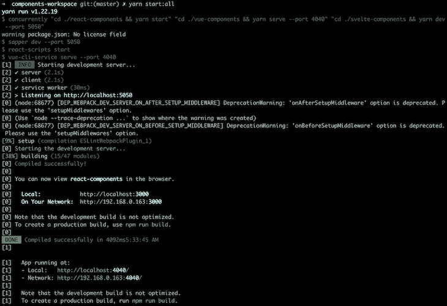
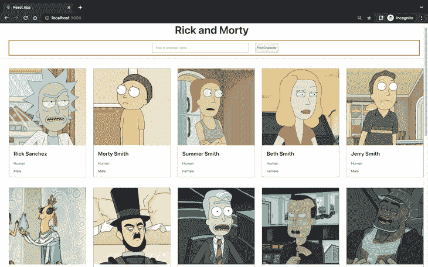
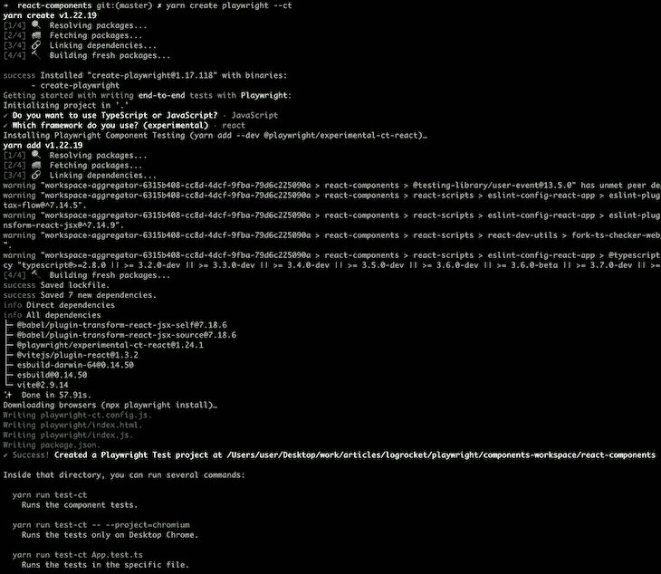
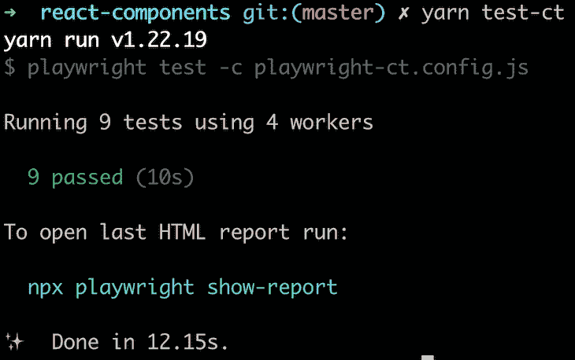
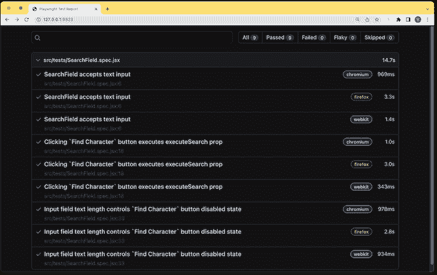
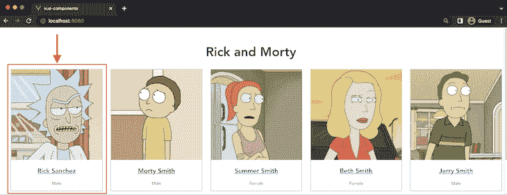
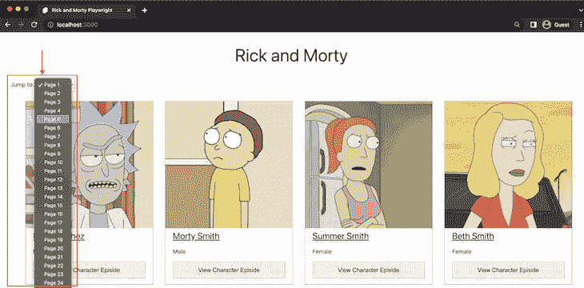
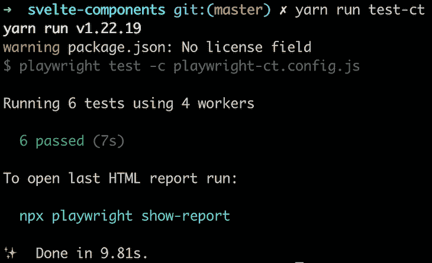

# 剧作家组件测试入门

> 原文：<https://blog.logrocket.com/getting-started-playwright-component-testing/>

随着 React 和 Vue 等 web 框架和库的广泛采用，web 应用程序的开发已经从每页一个 HTML 文件转变为使用小的可重用组件来呈现应用程序的特定部分。

类似地，测试实践也已经从只有页面的端到端(E2E)测试扩展到有几个单元测试，以及单独测试前端组件。

如果您一直在使用剧作家来实现您的应用程序的 E2E 测试，您可能会意识到剧作家现在提供了单独测试您的前端组件的能力。

本教程将带你完成使用剧作家最近发布的，目前处于实验阶段的组件测试特性，为你的 Svelte、Vue 和 React 组件编写单元测试的过程。我们将涵盖:

如果你想直接进入完成的测试用例，可以在 GitHub 上的`[playwright-frontend-e2e-tests](https://github.com/vickywane/playwright-frontend-e2e-tests)` [库的`playwright-ct`分支中找到代码。](https://github.com/vickywane/playwright-frontend-e2e-tests)

## 先决条件

本教程包含的实践步骤将指导您使用剧作家来测试用 React、Vue 和 Svelte 构建的组件。您将在单个 Yarn 工作空间中克隆一个包含 React、Vue 和 Svelte 组件的样板项目。

要遵循这些步骤，您需要以下内容:

*   安装在计算机上的 Node.js v16
*   安装在您计算机上的 Git CLI
*   基本熟悉 React、Vue 或 Svelte 框架

## 什么是剧作家？

剧作家是一个开源测试工具，主要支持 web 应用程序，并为移动应用程序提供额外的实验支持。

与手动测试应用程序的界面不同，剧作家为您提供了使用 JavaScript 或 TypeScript、Java 编写的可执行脚本来自动化测试的能力。NET 和 Python。

## 剧作家的组件测试特性介绍

实验性的剧作家测试组件测试特性允许你创建测试用例，在其中导入和测试你的前端组件，而不必通过编程导航到整个页面。

以前，已经在使用剧作家 E2E 测试的开发人员可能仍然需要单元测试。那些开发人员不得不采用其他测试库，比如 Jest T1，来直接测试他们的组件。

在 2022 年 5 月发布的 [v1.22.0 版本中，剧作家通过组件测试特性消除了这一限制。](https://github.com/microsoft/playwright/releases/tag/v1.22.0)

目前，组件测试功能仅支持 React、Vue 和 Svelte。剧作家提供了一个额外的包，该包包装了`[@playwright/test](https://www.npmjs.com/package/@playwright/test)`包，以提供其他方法，如用于安装单个组件的`mount`。

当您考虑使用剧作家进行前端单元测试时，请记住组件测试功能仍处于试验阶段。因此，API 将来可能会有变化。

## 使用剧作家测试你的组件

为了使您能够专注于使用剧作家，本教程使用了现有的 monorepo 项目，其中包含较小的 React、Vue 和 Svelte 应用程序。

monorepo 使用 [Yarn workspaces](https://classic.yarnpkg.com/lang/en/docs/workspaces/) 进行管理，React、Vue 和 Svelte 应用程序将呈现相同的页面，显示从 [Rick 和 Morty API](https://rickandmortyapi.com/documentation/#introduction) 获取的 JSON 数据，其中包含来自电视节目 Rick 和 Morty 的信息。

首先，启动您的终端，并使用 Git CLI 从 GitHub 存储库中克隆预构建的前端项目:

```
>git clone https://github.com/vickywane/playwright-frontend-e2e-tests.git
```

使用下面的下一个命令将目录更改为克隆的项目，安装项目依赖项，并运行前端应用程序。项目[使用](https://www.npmjs.com/package/concurrently)下面的 `[concurrently](https://www.npmjs.com/package/concurrently)` [包从一个终端运行 React、Vue 和 Svelte 应用程序。](https://www.npmjs.com/package/concurrently)

```
# change directory
cd playwright-frontend-e2e-tests

# install dependencies
yarn install 

# start all applications
yarn start:all
```

然后，您应该会看到类似下面的内容:



通过使用 monorepo 的 Yarn 工作空间，您只需要在根文件夹中安装一次项目依赖项，Yarn 就会自动将它们链接到其他项目。[了解更多关于 Yarn workspaces 和 monorepos 的信息](https://blog.logrocket.com/exploring-workspaces-other-advanced-package-manager-features/)。

项目中的每个前端应用程序显示从 Rick 和 Morty API 获取的 20 个字符，这些字符跨越了主组件中导入的三个子组件。在接下来的部分中，您将为每个子组件编写组件测试。

有了项目设置，让我们通过使用剧作家在单个应用程序中设置和编写 E2E 测试的过程。

### 为 React 组件设置剧作家组件测试

在开始编写 E2E 测试之前，使用浏览器导航到 [http://localhost:3000](http://localhost:3000) 来查看 React 应用程序。您将为下图中突出显示的`SearchField`组件编写组件测试:



执行下一个命令，将您的终端目录更改为`react-components`文件夹，并启动交互式的剧作家 CLI:

```
cd react-components

yarn create playwright --ct
```

上面命令中附加的`--ct`标志将指导剧作家 CLI 设置测试，尤其是测试组件。

在设置过程中，选择`JavaScript`作为编写 E2E 测试的编程语言，选择`React`作为前端框架选项。

剧作家生成的所有配置都将存储在一个`playwright-ct.config.js`文件中，如果您想更改默认配置，可以对该文件进行调整。



作为安装过程的一部分，剧作家将自动安装`@playwright/experimental-ct-react`包以使用组件测试特性。

此时，剧作家已经在`react-components`应用程序中设置好了。

使用您的代码编辑器打开整个`playwright-frontend-e2e-tests`项目，因为您将在接下来的部分中开始创建您的第一个测试用例。

### 为 React 编写剧作家组件测试

使用您的代码编辑器，在`react-components/src`目录中创建一个名为`tests`的目录。`tests`文件夹将包含你将为剧作家创建的所有测试文件。

接下来，在测试目录中创建一个`SearchField.spec.jsx`文件。该文件将包含`SearchField`组件的组件测试，用于搜索一个字符。

* * *

### 更多来自 LogRocket 的精彩文章:

* * *

剧作家将文件扩展名前面带有`.spec`的文件识别为测试文件。

将下面下一个代码块的内容添加到`SearchField.spec.jsx`文件中，以断言`SearchField`组件中的输入字段接受文本值。

[下面的测试用例使用](https://playwright.dev/docs/api/class-locator) `[locator](https://playwright.dev/docs/api/class-locator)` [方法](https://playwright.dev/docs/api/class-locator)找到带有`search-field` id 属性的 HTML 元素，用文本`Rick`填充，断言输入元素的值为“Rick”。

```
import { test, expect } from '@playwright/experimental-ct-react';
import App, { SearchField } from '../App';

test('SearchField accepts text input', async ({ mount }) => {
    const searchComponent = await mount(<SearchField /> );
    const searchField = searchComponent.locator('#search-field')

    await searchField.fill('Rick')

    await expect(searchField).toHaveValue('Rick')
});
```

接下来，将下面的代码添加到`SearchField.spec.jsx`文件中，以断言当组件中的按钮被单击时`executeSearch`属性被执行:

```
test('Click on `Find Character` button executes executeSearch prop', async ({ mount }) => {
    let isCalled = false
    const searchComponent = await mount(
        <SearchField
            executeSearch={() => isCalled = true}
        />
    );

    await searchComponent.locator('#search-field').fill('test character')
    await searchComponent.locator('#find').click()

    expect(isCalled).toBeTruthy()
});
```

作为良好用户体验的一部分，表单中的按钮应该被禁用，直到表单中的强制输入字段被填充。

添加下面的代码，当输入字段为空时，断言组件的按钮被禁用:

```
test('Input field text length controls `Find Character` button disabled state', async ({ mount }) => {
    const searchComponent = await mount( <SearchField /> );

    const btn = await searchComponent.locator('#find').isDisabled()
    expect(btn).toBeTruthy()

    await searchComponent.locator('#search-field').fill('test character')
      await expect(searchComponent.locator('#find')).toBeEnabled();
});
```

这个测试用例是必要的，以确保只有当用户输入文本时才触发搜索。

添加了上面的代码，现在在`SearchField.spec.jsx`文件中有三个测试用例。让我们开始执行吧！

使用下面的命令执行您为`SearchField`组件创建的测试用例:

```
yarn test-ct
```

然后，您应该会看到类似下图的内容:



默认情况下，组件测试将以无头模式执行，不需要打开 Chromium、Webkit 和 Firefox 浏览器。将`--headless`标志添加到`yarn test-ct`命令中，以启动三个浏览器并查看正在测试的组件。

剧作家有一个内置的特性，为每次测试运行生成并提供一个 HTML 报告。HTML 报告包含每个测试用例的测试名称、执行状态和持续时间。

使用剧作家的`show-report`命令为您的测试生成一个 HTML 报告:

```
npx playwright show-report
```

剧作家将在端口`9323`上为 HTML 报告启动一个本地服务器。使用您的浏览器，导航至`[http://localhost:9323](http://localhost:9323)`查看 HTML 报告:



至此，您已经看到了使用 React 构建的组件是如何直接使用剧作家进行测试的。让我们继续为项目中的`vue-components`应用程序设置剧作家。

### 为 Vue 组件设置剧作家组件测试

在上一节中，您在`react-components`应用程序中使用了剧作家来测试`SearchField`组件。

在本节中，您将以类似的方式在`vue-components`应用程序中使用剧作家来测试`Character`组件，该组件显示来自 Rick 和 Morty API 的单个角色的详细信息。

执行下一个命令，将您的终端目录更改为`vue-components`目录，并运行剧作家安装程序:

```
cd ../vue-components

yarn create playwright --ct
```

对于设置提示，确保选择 Vue 作为前端框架。选择 Vue 将导致剧作家 CLI 自动安装用于编写组件测试的`@playwright/experimental-ct-vue`包。

在下一步中，您将为`vue-components`应用程序中的`Character`组件编写两个测试。`Character`组件呈现在一个网格列表中，该列表使用从父组件接收的道具显示瑞克和莫蒂角色的图像和一些细节。

下图中突出显示的方框显示了`Character`组件的示例:



### 为 Vue 编写剧作家组件测试

在`vue-components/src`目录中创建一个名为`tests`的目录。正如您对`react-components`应用程序所做的那样，`vue-components`的测试文件也将存储在测试目录中。

在测试目录中创建一个`Character.spec.js`文件来存储`Character`组件的测试用例。

将下面代码块的内容添加到`Character.spec.js`文件中，以断言`Character`组件将传入组件的道具显示为角色的细节。

```
import { test, expect } from '@playwright/experimental-ct-vue';
import Character from '../components/Character.vue'

const SAMPLE_CHARACTER = {
    "name": "Toxic Rick",
    "gender": "Male",
    "specie": "Humanoid",
    "type": "Rick's Toxic Side",
    "link": "https://rickandmortyapi.com/api/location/64",
    "image": "https://rickandmortyapi.com/api/character/avatar/361.jpeg"
}

test('Component displays character details from props', async ({ mount }) => {
    const characterComponent = await mount(Character, {
        props: { ...SAMPLE_CHARACTER }
    });

       await expect(characterComponent.locator('#character-name')).toHaveText(SAMPLE_CHARACTER.name);

   await expect(characterComponent.locator('#character-gender')).toHaveText(SAMPLE_CHARACTER.gender);

   await expect(characterComponent.locator('#character-type')).toHaveText(SAMPLE_CHARACTER.type);

   await expect(characterComponent.locator('#character-specie')).toHaveText(SAMPLE_CHARACTER.specie);

});
```

上面的代码包含一个对象，该对象具有一个字符的样本字段，该字符类似于从对 Rick 和 Morty API 的实际请求中检索到的字符。

接下来，添加下面的第二个测试用例，断言`Character`组件显示角色的名字，并带有一个具有 href 属性的锚元素。

```
test('Character name renders anchor link to character', async ({ mount }) => {
    const characterComponent = await mount(Character, {
        props: { ...SAMPLE_CHARACTER }
    });

   await expect(characterComponent.locator('#character-name > a') ).toHaveAttribute("href")

});
```

现在，执行`test-ct`命令来运行您使用上面的两个代码块创建的两个剧作家测试用例:

```
yarn test-ct
```

如前一节所述，您应该能够看到您的测试结果，并为您的测试生成一个 HTML 报告。

### 为苗条组件设置剧作家组件测试

在本文的前几节中，您已经使用了带有 React 和 Vue 应用程序的剧作家，现在您正在使用带有苗条应用程序的剧作家。

首先，执行以下命令将您的终端目录更改为`svelte-components`目录，并运行剧作家安装程序。

```
cd ../svelte-components

yarn create playwright --ct
```

当你浏览设置提示时，确保选择 Svelte 作为前端框架。选择 Svelte 会导致剧作家自动安装`@playwright/experimental-ct-svelte`包。

在下一部分中，您将为`Paginator`组件编写两个测试用例，它将呈现一个页码下拉列表。当用户点击`Paginator`组件中列出的页面时，他们将被带到查看该页面上列出的字符，如下图所示:



### 为 Svelte 编写剧作家组件测试

在`svelte-components/src`目录中创建一个名为`tests`的目录来存储包含你的剧作家测试用例的文件。

接下来，在`tests`目录下创建一个`Paginator.spec.js`文件来存储`Paginator`组件的测试用例。

将下面代码块的内容添加到`Paginator.spec.js`文件中。这段代码将创建一个测试用例，断言`Paginator`组件将基于通过`pagesCount`属性传递的数字显示选项元素。

```
import { test, expect } from '@playwright/experimental-ct-svelte'
import Paginator from '../src/components/Paginator.svelte'

test('Displays pages option based on pagesCount prop', async ({ mount }) => {
    const component = await mount(Paginator, {
        props: {
            pagesCount: 42
        }
    })

   expect(await component.locator('#pages-option > option').count()).toBe(42)})
})
```

添加下面的第二个测试用例，以断言分页器组件的`handlePageSelect`属性在单击一个选项时返回一个数字，以便根据数字对 Rick 和 Morty 字符进行分页:

```
test('`handlePageSelect` prop returns the pages number when clicked', async ({ mount }) => {
    let pageClicked;
    const component = await mount(Paginator, {
        props: {
            handlePageSelect: number => pageClicked = number,
            pagesCount: 10,
        }
    })

    await component.locator('#pages-option > option').first().click()                                                        
    expect(pageClicked).toBe(1)
})
```

最后，为分页组件运行`test-ct`两个测试用例。

```
yarn test-ct
```



就是这样！

在通过了对 Svelte 应用程序的这些最后的剧作家组件测试之后，您已经成功地使用了剧作家的组件测试特性来测试这个示例项目中的 React、Vue 和 Svelte 应用程序。

## 关于剧作家组件测试的最后思考

在本教程的开始，您将学习如何使用剧作家测试您的前端组件。

本教程解释了什么是剧作家组件测试特性，并带您体验了使用包含 React、Vue 和 Svelte 组件的 monorepo 项目进行组件测试的实践。

如前所述，重要的是要记住，剧作家的组件测试功能相对较新，仍然被认为是实验性的。它还不支持 Angular，与其他已经存在多年的测试工具相比，你可能会发现有些断言对剧作家来说是不可用的。

如果您在尝试剧作家组件测试功能时遇到任何问题，[在 GitHub 知识库中提出适当的问题](https://github.com/microsoft/playwright/issues/new/choose)或[在 Slack 上与剧作家社区聊天](https://aka.ms/playwright-slack)。

## 像用户一样体验您的 Vue 应用

调试 Vue.js 应用程序可能会很困难，尤其是当用户会话期间有几十个(如果不是几百个)突变时。如果您对监视和跟踪生产中所有用户的 Vue 突变感兴趣，

[try LogRocket](https://lp.logrocket.com/blg/vue-signup)

.

[](https://lp.logrocket.com/blg/vue-signup)[https://logrocket.com/signup/](https://lp.logrocket.com/blg/vue-signup)

LogRocket 就像是网络和移动应用程序的 DVR，记录你的 Vue 应用程序中发生的一切，包括网络请求、JavaScript 错误、性能问题等等。您可以汇总并报告问题发生时应用程序的状态，而不是猜测问题发生的原因。

LogRocket Vuex 插件将 Vuex 突变记录到 LogRocket 控制台，为您提供导致错误的环境，以及出现问题时应用程序的状态。

现代化您调试 Vue 应用的方式- [开始免费监控](https://lp.logrocket.com/blg/vue-signup)。