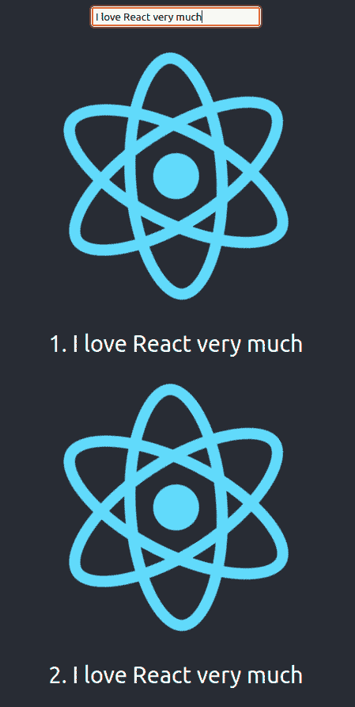
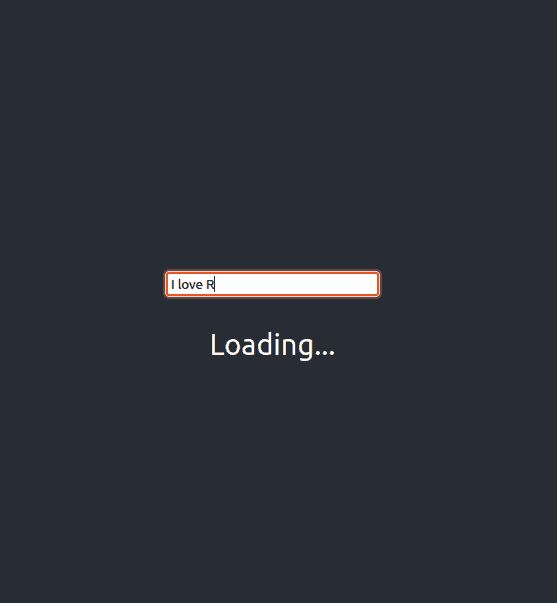

# React 18 中的 startTransition 入门

> 原文：<https://blog.logrocket.com/getting-started-react-18-starttransition/>

React 18 的实验性并发模式的一部分是一个名为`startTransition`的新功能，它可以防止一个昂贵的 UI 渲染立即执行。

要理解我们为什么需要这个特性，请记住，强制立即完成昂贵的 UI 渲染会阻止较轻和较紧急的 UI 渲染及时进行。这可能会让需要从紧急 UI 呈现中获得即时响应的用户感到沮丧。

紧急 UI 呈现的一个例子是在搜索栏中键入内容。当您键入时，您希望看到您的键入内容，并立即开始搜索。如果应用程序死机，搜索停止，你会感到沮丧。其他昂贵的 UI 渲染会使整个应用陷入困境，包括你的轻量级 UI 渲染应该很快(比如在你输入时看到搜索结果)。

在开发你的 React 应用时，你可以通过[去抖或者节流](https://blog.logrocket.com/how-and-when-to-debounce-or-throttle-in-react/)来避免这个问题。不幸的是，使用去抖动或节流仍然会导致应用程序无响应。

`startTransition`允许您将应用程序中的某些更新标记为非紧急更新，以便在优先处理更紧急的更新时暂停更新。这让你的应用程序感觉更快，并可以减少在你的应用程序中渲染不是严格必要的项目的负担。因此，无论你在渲染什么，你的应用程序仍然在响应用户的输入。

在本文中，我们将学习如何在 React 应用中使用`startTransition`来延迟非紧急的 UI 更新，以避免阻塞紧急的 UI 更新。有了这个功能，你可以立刻将反应缓慢的应用程序转换成反应灵敏的应用程序。

在我们开始之前，请注意 React 18 在撰写本文时仍处于 alpha 版本，因此`startTransition`还不是稳定版本的一部分。

## React 18 入门

开始本教程之前，请确保您具备以下条件:

*   React 的工作知识
*   安装在计算机上的 Node.js

让我们首先用 create-react-app 创建一个 React 项目:

```
$ npx create-react-app starttransition_demo

```

上面的命令使用 React 的最新稳定版本(版本 17)创建了一个 React 项目。我们需要使用 React 18。进入项目目录并删除`node_modules`目录:

```
$ cd starttransition_demo/

$ rm -rf node_modules

```

在 Windows 上，您必须使用不同的命令来删除目录。删除目录后，编辑`package.json`。找到这些线:

```
    "react": "^17.0.2",

    "react-dom": "^17.0.2",

```

然后，将 React 的版本从 17 更改为 alpha:

```
    "react": "alpha",

    "react-dom": "alpha",

```

最后，用`yarn`安装库:

```
$ yarn install

```

为了确保您已经安装了 React 18，您可以从`node_modules`目录中检查它，如下所示:

```
$ grep version node_modules/react/package.json

  "version": "18.0.0-alpha-6ecad79cc-20211006",

```

在 Windows 上，您可以直接打开文件。

运行服务器以确保您可以运行 React 18 应用程序:

```
yarn start

```

在浏览器中打开 [http://localhost:3000](http://localhost:3000) 。您应该看到带有旋转 React 徽标的 React 项目的熟悉的默认页面。

## 启用并发模式

默认情况下，我们的 React 项目不支持并发模式。我们需要通过以不同的方式呈现根 React 节点来启用它。

打开`src/index.js`。您可以看到，我们使用来自`ReactDOM`的`render`静态方法来呈现根节点:

```
ReactDOM.render(

  &lt;React.StrictMode>

    &lt;App />

  &lt;/React.StrictMode>,

  document.getElementById('root')

);

```

要启用并发模式，我们需要首先创建根节点，然后从该实例使用`render`方法。将上面的行改为下面的行:

```
const container = document.getElementById('root')

const root = ReactDOM.createRoot(container);

root.render(

  &lt;React.StrictMode>

    &lt;App />

  &lt;/React.StrictMode>

);

```

注意来自`ReactDOM`的`createRoot`方法。这将创建一个根节点。

## 设置测试环境

首先，让我们创建一个 React 应用程序，它有一个轻型 UI 渲染和一个昂贵的 UI 渲染。打开`src/App.js`。您可以看到`App`函数定义显示了一个 React 标志、一个`p`标签和一个链接。

用下面的代码替换`App`函数:

```
function App() {

  const [search_text, setSearchText] = useState("");

  const [search_result, setSearchResult] = useState();

  const handleChange = e => {

    setSearchText(e.target.value);

  };

  useEffect(() => {

    if (search_text==="") {

        setSearchResult(null);

    } else {

        const rows = Array.from(Array(5000), (_, index) => {

              return (

                      &lt;div key={index}>

                    &lt;img src={logo} className="App-logo" alt="logo" />

                    &lt;div>{index + 1}. {search_text}&lt;/div>

                      &lt;/div>

                );

        });

        const list = &lt;div>{rows}&lt;/div>;

        setSearchResult(list);

    }

  }, [search_text]);

  return (

    &lt;div className="App">

        &lt;header className="App-header">

            &lt;div className="SearchEngine">

                &lt;div className="SearchInput">

                    &lt;input type="text" value={search_text} onChange={handleChange} />

                &lt;/div>

                &lt;div className="SearchResult">

                    {search_result}

                &lt;/div>

            &lt;/div>

        &lt;/header>

    &lt;/div>

  );

}

```

你需要导入`useEffect`和`useState`。将这一行放在文件的顶部:

```
import {useState, useEffect } from 'react';

```

这里，我们创建了由两部分组成的应用程序 UI:搜索输入和搜索结果。

因为输入有回调，所以当您在输入上键入文本时，文本作为参数传递给`setSearchText`，以便使用`useState`钩子更新`search_text`的值。然后，搜索结果显示出来。对于这个演示，结果是 5，000 行，每行包含一个旋转的 React 徽标和相同的搜索查询文本。

我们的轻量级即时 UI 呈现是带有文本的搜索输入。当您在搜索输入中键入文本时，文本应该会立即出现。然而，显示 5000 个 React 徽标和搜索文本是一种昂贵的 UI 渲染。

我们来看一个例子；尝试在我们新的 React 应用程序中快速输入“我非常喜欢 React”。当你输入“我”时，应用程序会立即在搜索输入中显示文本“我”。然后它呈现 5000 行。这需要很长时间，这就暴露了我们的渲染问题。React 应用程序无法立即呈现全文。昂贵的 UI 渲染也使得轻量级 UI 渲染变得很慢。

可以在 [http://localhost:3000](http://localhost:3000) 的 app 上自己尝试一下。您将看到一个搜索输入。我也给[设置了一个演示应用](https://codepen.io/arjunaskykok/pen/XWarryy)。



我们想要的是昂贵的 UI 渲染在加载时不要把轻量级的 UI 渲染拖到烂泥里。应该把它们分开，这就是`startTransition`的用武之地。

## 使用`startTransition`

让我们看看导入`startTransition`时会发生什么。您的顶行导入应该是这样的:

```
import {useState, useEffect, startTransition} from 'react';

```

然后，在这个函数中包装昂贵的 UI 渲染。将`setSearchResult(list)`改为下面的代码:

```
      startTransition(() => {

          setSearchResult(list);

      });

```

现在，您可以再次测试该应用程序。当您在搜索输入中键入内容时，文本会立即呈现。在你停下来之后(或者过了几秒钟)，React 应用程序会呈现搜索结果。

如果您希望在等待昂贵的 UI 渲染完成时在搜索结果上显示一些内容，该怎么办？你可能想要显示一个进度条来给用户即时的反馈，这样他们就知道应用程序正在处理他们的请求。

为此，我们可以使用来自`useTransition`钩子的`isPending`变量。

首先，将文件顶部的导入行改为下面的代码:

```
import {useState, useEffect, useTransition} from 'react';

```

将`isPending`和`startTransition`从`useTransition`挂钩中拔出。将下面的代码放在`App`函数内的第一行:

```
  const [isPending, startTransition] = useTransition();

```

接下来，将`&lt;div className="SearchResult">`的内容改为下面的代码:

```
            {isPending && &lt;div>&lt;br />&lt;span>Loading...&lt;/span>&lt;/div>}

            {!isPending && search_result}

```

现在，当您在搜索输入上快速键入文本时，会首先显示加载指示器。



## 结论

有了`startTransition`，你可以通过分离即时 UI 渲染和非紧急 UI 渲染，让 React app 变得平滑而有反应。通过将所有非紧急的 UI 呈现放在`startTransition`方法中，您的应用程序使用起来会更令人满意。

我们还介绍了如何使用`isPending`变量来指示转换的状态，以防您想要向用户提供反馈。

你可以在这里获得 [`startTransition`演示应用](https://github.com/arjunaskykok/starttransition_demo)的完整代码。你也可以尽情体验应用程序的[演示。希望这些知识在您构建下一个 React 应用程序时会对您有用。确保应用程序将是流畅的！](https://codepen.io/arjunaskykok/pen/xxrvNMN)

## 使用 LogRocket 消除传统反应错误报告的噪音

[LogRocket](https://lp.logrocket.com/blg/react-signup-issue-free)

是一款 React analytics 解决方案，可保护您免受数百个误报错误警报的影响，只针对少数真正重要的项目。LogRocket 告诉您 React 应用程序中实际影响用户的最具影响力的 bug 和 UX 问题。

[ ](https://lp.logrocket.com/blg/react-signup-general) [  ](https://lp.logrocket.com/blg/react-signup-general) [LogRocket](https://lp.logrocket.com/blg/react-signup-issue-free)

自动聚合客户端错误、反应错误边界、还原状态、缓慢的组件加载时间、JS 异常、前端性能指标和用户交互。然后，LogRocket 使用机器学习来通知您影响大多数用户的最具影响力的问题，并提供您修复它所需的上下文。

关注重要的 React bug—[今天就试试 LogRocket】。](https://lp.logrocket.com/blg/react-signup-issue-free)