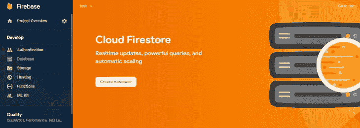
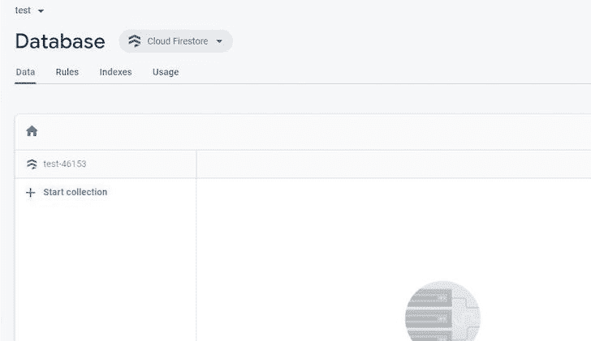
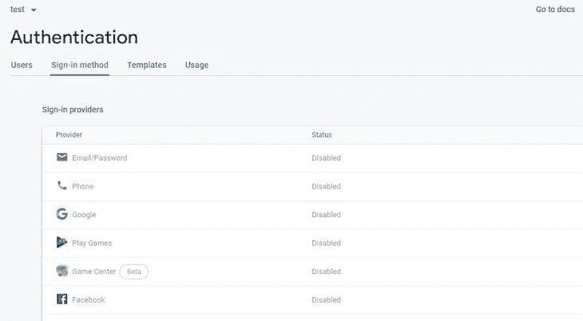
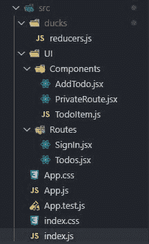

# react-redux-firebase - LogRocket 博客入门

> 原文：<https://blog.logrocket.com/getting-started-react-redux-firebase/>

***编者按:**本文于 2021 年 11 月 20 日更新，以包含 Redux Toolkit 的信息。*

Firebase 是一个流行的 BaaS(后端即服务)，它允许 web 和移动开发者实现常见的后端任务，如用户认证、存储和创建数据库。

另一方面，Redux 是 JavaScript 应用程序的可预测状态容器，用于更有效地管理应用程序状态。[它通常与 React](https://blog.logrocket.com/when-and-when-not-to-use-redux-41807f29a7fb/) 一起使用，React 是一个基于组件的 UI 库。

## 什么是 react-redux-firebase？

[react-redux-firebase](http://react-redux-firebase.com/) 是一个为 firebase 提供 redux 绑定的库，从而更容易地将 Firebase 与 Redux 和 react 一起使用。它还附带了一些钩子，使得实现一些 Firebase 功能变得更加容易。

在本文中，我们将学习如何使用 react-redux-firebase 通过 firebase 的云 Firestore 构建一个简单的待办事项应用程序，并且我们将在此过程中添加用户身份验证。

**注意:** Redux 现在推荐新项目使用 Redux Toolkit。为了您的方便，我们将在必要时添加 RTK 替代方案。

## 我们不只是写 Redux，我们也谈论它。现在听着:

或者以后订阅

### 先决条件

## 在阅读本文之前，您需要事先了解一些事情:

你必须懂得反应，最好是中级水平

*   你必须对 react-redux 或 redux-toolkit 有所了解
*   Firebase 的基本知识(Firestore 和身份验证)
*   React 路由器的基本知识
*   在 React 中设置

## 首先，创建一个新的 React 项目:

现在，安装以下依赖项:

```
npx create-react-app overcomplicated-todo-app
```

Redux

*   反应还原
*   重火力点
*   反应-还原-燃烧基
*   redux-firestore
*   反应-路由器-dom
*   redux-toolkit
*   在您的终端中运行以下命令来安装这些依赖项:

安装完依赖项后，我们需要设置 Firebase。

```
npm install --save react-redux-firebase firebase
npm install --save redux react-redux
npm install --save [email protected]
npm install react-router-dom
```

设置 Firebase

## 进入 [Firebase 网站](https://firebase.google.com/)，点击**开始**。您将被带到一个页面，在那里您可以创建一个新项目。完成后，您应该会看到一个类似下图的仪表板页面。


我们将在这个项目中使用两个 Firebase 服务:身份验证服务和云 Firestore 服务。我们先来设置一下云 Firestore。

从侧面菜单中选择**数据库**选项。您应该能够选择 Firebase 提供的两种数据库服务之一:云 Firestore 或实时数据库。在本文中，我们将使用云 Firestore。



现在创建一个云 Firestore 数据库。您应该会看到一个设置数据库安全规则的模型。选择**开始测试模式**。您应该准备好一个空数据库供使用。它应该是这样的:



现在我们已经准备好了数据库，让我们设置身份验证。从侧面菜单中，选择**认证**选项。现在，选择**登录方式**选项卡。你应该有这样的东西:



在这里，你可以为不同的提供商设置认证，包括谷歌、脸书和 GitHub。在我们的应用程序中，我们希望启用谷歌认证和电子邮件/密码认证。让我们先设置 Google 身份验证，然后单击 Google 选项。


您现在可以通过切换右上角的按钮来启用 Google 身份验证。您还需要提供一个项目支持电子邮件。

既然已经设置了云 Firestore 和身份验证，我们需要获取项目的配置细节。我们需要这个来把我们的代码和我们的 Firebase 项目联系起来。

要获取我们的 Firebase 配置详细信息，请返回到项目概述页面，并向 Firebase 项目添加一个 web 应用程序。注册应用程序后，您应该可以获得 JavaScript 对象形式的配置详细信息:

现在打开您的`index.js`文件，并在那里初始化您的 Firebase 项目。我们还需要初始化 Firestore:

```
const firebaseConfig = {
  apiKey: 'AIzaXXXXXXXXXXXXXXXXXXXXXXX',
  authDomain: 'test-XXXX.firebaseapp.com',
  databaseURL: 'https://test-XXXXXX.firebaseio.com',
  projectId: 'test-XXXX',
  storageBucket: 'test-XXXX.appspot.com',
  messagingSenderId: 'XXXXXXX',
  appId: "XXXXXXXXXXXXXXXXXXXXXXXXXXXXXXXXXXXX"
};
```

请注意，如果您正在创建一个依赖于 Firebase 的产品，将 Firebase 配置细节存储为环境变量通常更安全。

```
import firebase from "firebase/app";
import "firebase/auth";
import "firebase/firestore";

const firebaseConfig = {
  ...firebaseConfigurationDetails
};

firebase.initializeApp(firebaseConfig);
firebase.firestore();
```

进入代码

## 现在是编码的时候了。这是项目结构:



你可以选择你喜欢的任何方式来构建你的项目，但这是对我有用的。

如您所见，我们有一个名为`reducers.js`的减速器文件。在这里，我们将把我们的 reducer 合并成一个，并将其导出为 Redux 存储的根 reducer。

为了让我们的项目工作，除了我们自己创建的那些之外，我们还需要两个 reducers(在本例中，一个也没有)。这些是来自 react-redux-firebase 的`firebaseReducer`和来自 redux-firestore 的`firestoreReducer`。如果你使用和我一样的项目结构，你的`reducers.js`应该是这样的:

使用 Redux 工具包

```
import {combineReducers} from "redux";
import {firebaseReducer} from "react-redux-firebase";
import {firestoreReducer} from "redux-firestore";
export const rootReducer = combineReducers({
    firebase: firebaseReducer,
    firestore: firestoreReducer
});
```

### 对于使用 Redux Toolkit 的项目，我们将在`src/`目录中创建一个`store.js`文件，如下所示:

在项目中使用 react-redux-firebase

```
import { configureStore } from '@reduxjs/toolkit'
import {actionTypes, firebaseReducer} from "react-redux-firebase";
import {firestoreReducer} from "redux-firestore";

export const store = configureStore({
  reducer: {
    firebaseReducer,
    firestoreReducer,
  },
  middleware: (getDefaultMiddleware) => getDefaultMiddleware({
    serializableCheck: {
        ignoredActions: [actionTypes.LOGIN, actionTypes.AUTH_LINK_ERROR]
    }
  }),
})
```

## 现在，打开`index.js`文件，这样我们就可以完全设置 react-redux-firebase。首先，让我们写出 react-redux-firebase (RRF)的配置。为此，我们将创建一个名为`rrfConfig`的对象。RRF 将认证用户的数据存储在云 Firestore 或 Firebase 的实时数据库中，无论你选择使用哪个。

在`rrfConfig`中，我们可以决定存储这些数据的集合或对象的名称。姑且称我们的集合为`users`。

此外，因为我们希望使用 Cloud Firestore 来存储用户的数据，所以我们必须将`useFirestoreForProfile`属性设置为`true`。我们的`rrfConfig`现在应该是这样的:

像使用 Redux 的应用程序一样，我们必须创建一个 Redux 商店来保存我们的应用程序状态。该存储将根缩减器和初始状态作为参数。现在，我们必须分别从 contact-redux、contact-redux-fire base 和 contact-router-DOM 中导入`Provider`组件、`ReactReduxFirebaseProvider`组件和`BrowserRouter`组件。

```
const rrfConfig = {
  userProfile: "users",
  useFirestoreForProfile: true,
};
```

这些组件将包装`App`组件。我们现在必须定义`ReactReduxFirebaseProvider`的道具，我们将把它写成一个对象，稍后适当地展开。我们的`index.js`文件现在应该是这样的:

现在我们已经设置了 RRF，我想列出各种组件和路线，并定义它们的功能。

```
import React from "react";
import ReactDOM from "react-dom";
import firebase from "firebase/app";
import "firebase/auth";
import "firebase/firestore";
import { createStore } from "redux";
import { Provider } from "react-redux";
import { ReactReduxFirebaseProvider } from "react-redux-firebase";
import { createFirestoreInstance } from "redux-firestore";
import { rootReducer } from "./ducks/reducers";
import App from "./App";
import { BrowserRouter } from "react-router-dom";

const firebaseConfig = {
  ...firebaseConfigurationDetails
};

const rrfConfig = {
  userProfile: "users",
  useFirestoreForProfile: true,
};

firebase.initializeApp(firebaseConfig);
firebase.firestore();

const initialState = {};
const store = createStore(rootReducer, initialState);

const rrfProps = {
  firebase,
  config: rrfConfig,
  dispatch: store.dispatch,
  createFirestoreInstance, //since we are using Firestore
};

ReactDOM.render(
  <React.StrictMode>
    <Provider store={store}>
      <ReactReduxFirebaseProvider {...rrfProps}>
        <BrowserRouter>
          <App />
        </BrowserRouter>
      </ReactReduxFirebaseProvider>
    </Provider>
  </React.StrictMode>,
  document.getElementById("root")
);
```

`AddTodo`组件允许用户添加新的待办事项

*   `PrivateRoute`组件防止其子组件被未经认证的用户访问
*   `TodoItem`组件定义了每个待办事项的外观和功能
*   `SignIn`路线允许用户登录谷歌
*   `Todos`路线为认证用户显示待办事项列表
*   构建我们的组件和路线

## `SignIn`路线

### 正如我们上面讨论的，这是用户使用 Google 登录的地方。我们将使用`useFirebase`钩子，RRF 提供了一个`firebase`对象。这样，我们就可以实现一些基本的 Firebase 功能，比如推送到一个数据库并使用不同的身份验证提供者登录。

我们将使用这个对象的 login 方法来实现 Google 登录功能。此方法将接受一个对象作为参数，在该对象中将定义登录的提供者和方法。

在用户登录后，我们将使用 react-router 中的`useHistory`钩子以编程方式导航到`todos`路线。您的`SignIn`组件应该与此非常相似:

`PrivateRoute`组件

```
import React from "react";
import { useFirebase } from "react-redux-firebase";
import { useHistory } from "react-router-dom";
const SignIn = () => {
  const firebase = useFirebase();
  const history = useHistory();

  const signInWithGoogle = () => {
    firebase
      .login({
        provider: "google",
        type: "popup",
      })
      .then(() => {
        history.push("/todos");
      });
  };
  return (
    <div>
      <h1>Sign In</h1>
      <button
        onClick={(event) => {
          event.preventDefault();
          signInWithGoogle();
        }}
      >
        Sign In with Google
      </button>
    </div>
  );
};
export default SignIn;
```

### 只有当用户通过身份验证时，该路由才会呈现其组件，因此我们需要一种方法来确定用户是否已经登录。对此，RRF 有两个函数可供我们使用:`isLoaded`和`isEmpty`。

`isLoaded`检查 auth 是否已经加载，我们可以用`isEmpty`检查 auth 是否为空。`PrivateRoute`将呈现一个路由组件，如果用户已经登录，它将依次呈现其子组件，如果用户没有登录，将从 react-router 呈现一个重定向组件。

下面是`PrivateRoute`应该是什么样子:

注意，我们使用 react-redux 的`useSelector`钩子来获取`auth`对象。选择器只是一个函数，它接受 Redux 状态作为参数，并返回从该状态派生的数据。

```
import React from "react";
import { Route, Redirect } from "react-router-dom";
import { isLoaded, isEmpty } from "react-redux-firebase";
import { useSelector } from "react-redux";
const PrivateRoute = ({ children, ...remainingProps }) => {
  const auth = useSelector(state => state.firebase.auth);
  return (
    <Route
      {...remainingProps}
      render={({ location }) =>
        isLoaded(auth) && !isEmpty(auth) ? (
          children
        ) : (
          <Redirect
            to={{
              pathname: "/",
              state: { from: location },
            }}
          />
        )
      }
    />
  );
};
export default PrivateRoute;
```

`AddTodo`组件

### 因为 RRF 在一个`users`集合中为每个经过身份验证的用户创建了一个文档，所以我们将在每个用户文档中创建另一个名为`todos`的集合。在那里，每个待办事项都可以存储为一个具有自己唯一 ID 的文档。

更多来自 LogRocket 的精彩文章:

* * *

### 如果您不熟悉文档、收藏等。，在 Firestore 工作，可以查看 [Firebase docs](https://firebase.google.com/docs/firestore) 。我们将使用另一个名为`useFirestore`的 RRF 钩子，它返回一个我们可以用来执行 Firestore 操作的`firestore`对象。

* * *

每个待办事项将包含三个属性:

`isDone`:表示待办任务是否已经完成

*   `title`:待办事项的标题
*   `todoID`:用于标识每个待办事项的唯一 ID
*   因此，在添加了新的待办事项后，我们将获取 Firebase 分配给该项目的文档的 ID，并将其设置为待办事项的`todoID`属性值。下面是`AddTodo`应该是什么样子:

`TodoItem`组件

```
import React, { useState } from "react";
import { useFirestore } from "react-redux-firebase";
import { useSelector } from "react-redux";
const AddTodo = () => {
  const [presentToDo, setPresentToDo] = useState("");
  const firestore = useFirestore();
  const { uid } = useSelector((state) => state.firebase.auth);
  const handleChange = ({ currentTarget: { name, value } }) => {
    if (name === "addTodo") {
      setPresentToDo(value);
    }
  };
  const addNewTodo = (todo) => {
    firestore
      .collection("users")
      .doc(uid)
      .collection("todos")
      .add({
        title: todo,
        isDone: false,
      })
      .then((docRef) => {
        docRef.update({
          todoID: docRef.id,
        });
      });
    setPresentToDo("");
  };
  return (
    <div>
      <form action="">
        <input
          type="text"
          name="addTodo"
          value={presentToDo}
          onChange={handleChange}
        />
        <button
          onClick={(event) => {
            event.preventDefault();
            addNewTodo(presentToDo);
          }}
        >
          Add Todo
        </button>
      </form>
    </div>
  );
};
export default AddTodo;
```

### `TodoItem`组件由待办事项的标题和一个复选框组成，用于指示待办事项任务是否已经完成。当用户选中复选框时，`todoItem`会在 Cloud Firestore 中更新。您的`TodoItem`组件应该是这样的:

`Todos`路线

```
import React, { useState } from "react";
import { useFirestore } from "react-redux-firebase";
import { useSelector } from "react-redux";
const ToDoItem = ({ isDone, title, todoID }) => {
  const [isTodoItemDone, setTodoItemDone] = useState(isDone);
    const firestore = useFirestore();
    const {uid} = useSelector(state => state.firebase.auth);
  console.log(isTodoItemDone);
  const handleChange = (event) => {
    if (event.currentTarget.type === "checkbox") {
      setTodoItemDone(!isTodoItemDone);
      firestore.collection("users").doc(uid).collection("todos").doc(todoID).update({
          isDone: !isTodoItemDone
      })
    }
  };
  return (
    <div style={{
        textDecoration: isTodoItemDone && "line-through",
        opacity: isTodoItemDone ? 0.5 : 1,

    }}>
      <input
        type="checkbox"
        name=""
        id=""
        onChange={handleChange}
        checked={isTodoItemDone}
      />
      {title}
    </div>
  );
};
export default ToDoItem;
```

### `Todos`路线显示用户的姓名和所有待办事项的列表。为了获得所有的待办事项，我们将使用一个名为`useFirestoreConnect`的钩子，它将一个对象作为参数，监听/取消监听所提供的云 Firestore 路径，并使数据在我们的 Redux 状态下可用。然后我们可以用`useSelector`钩子从 Redux 状态访问这些数据。

因为我们正在监听一个子集合，所以我们必须使用传递给我们的`useFirestoreConnect`钩子的对象的`storeAs`属性。

该对象将有一个`collection`属性，其中的值是我们正在监听的集合的路径。`Todos`路线也将包含`AddTodo`部分。以下是`Todos`路线的代码:

现在，我们可以将所有组件和路线拼凑到我们的`App.js`文件中:

```
import React from "react";
import { useSelector } from "react-redux";
import AddTodo from "../Components/AddTodo";
import { useFirestoreConnect } from "react-redux-firebase";
import ToDoItem from "../Components/TodoItem";
const Todos = () => {
  const { displayName, uid } = useSelector((state) => state.firebase.auth);
  useFirestoreConnect({
    collection: `users/${uid}/todos`,
    storeAs: "todos",
  });
  const todos = useSelector((state) => state.firestore.data.todos);
  console.log(todos);
  return (
    <div>
      <h3>Hello {displayName}</h3>
      <h4>Todos</h4>
      <AddTodo />
      <ul
        style={{
          listStyleType: "none",
        }}
      >
        {todos &&
          Object.values(todos).map((todo) => (
            <li>
              <ToDoItem
                title={todo.title}
                isDone={todo.isDone}
                todoID={todo.todoID}
              />
            </li>
          ))}
      </ul>
    </div>
  );
};
export default Todos;
```

结论

```
import React from 'react';
import PrivateRoute from "./UI/Components/PrivateRoute";
import Todos from "./UI/Routes/Todos";
import SignIn from "./UI/Routes/SignIn";
import {Switch, Route} from "react-router-dom";
function App() {
  return (
    <div style = {{
      textAlign: "center"
    }}>
      <h1>Redux Todo App</h1>
      <Switch>
        <PrivateRoute path = "/todos">
          <Todos />
        </PrivateRoute>
        <Route path = "/">
        <SignIn />
        </Route>
      </Switch>

    </div>
  );
}
export default App;
```

## 就这样，我们结束了！用户应该能够登录添加待办事项，并在完成任务后检查这些待办事项。

注意，在实际应用中，你应该设置安全规则，以进一步确保用户数据的安全。如果你想进一步探索这个库，你可以查看文档。你可以在这里找到这个项目的资源库[，在这里](https://github.com/NodeJSs/react-redux-firebase-article)找到 Redux Toolkit fork [，在这里](https://github.com/zsajjad/react-redux-firebase-article/blob/master/src/App.js)找到 live 项目[。](https://react-redux-firebase-todo.netlify.com/)

使用 LogRocket 消除传统反应错误报告的噪音

## 是一款 React analytics 解决方案，可保护您免受数百个误报错误警报的影响，只针对少数真正重要的项目。LogRocket 告诉您 React 应用程序中实际影响用户的最具影响力的 bug 和 UX 问题。

[LogRocket](https://lp.logrocket.com/blg/react-signup-issue-free)

自动聚合客户端错误、反应错误边界、还原状态、缓慢的组件加载时间、JS 异常、前端性能指标和用户交互。然后，LogRocket 使用机器学习来通知您影响大多数用户的最具影响力的问题，并提供您修复它所需的上下文。

[ ](https://lp.logrocket.com/blg/react-signup-general) [  ](https://lp.logrocket.com/blg/react-signup-general) [LogRocket](https://lp.logrocket.com/blg/react-signup-issue-free)

关注重要的 React bug—[今天就试试 LogRocket】。](https://lp.logrocket.com/blg/react-signup-issue-free)

Focus on the React bugs that matter — [try LogRocket today](https://lp.logrocket.com/blg/react-signup-issue-free).