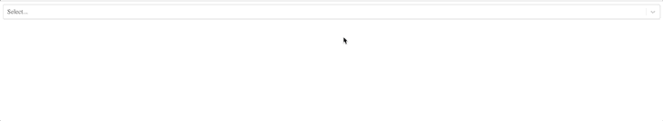
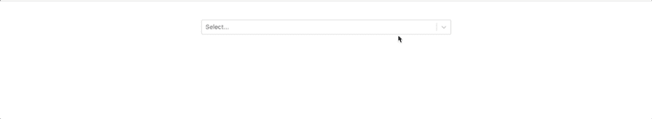
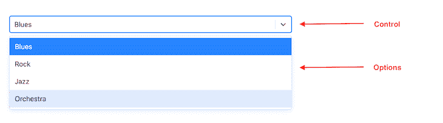
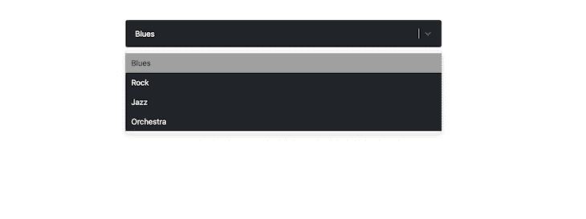
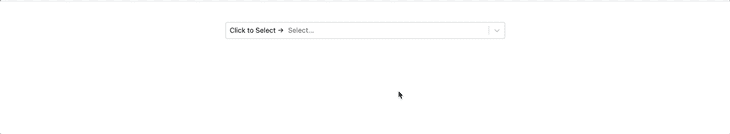
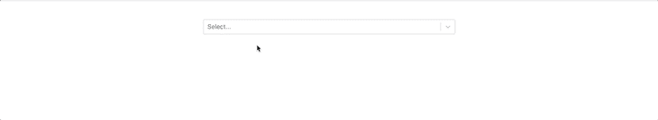

# React Select 入门

> 原文：<https://blog.logrocket.com/getting-started-react-select/>

***编者按**:本文最后一次更新于 2022 年 12 月 15 日，以反映 React Select v5 中所做的更改。*

三、四年前从事 web 项目时，选择元素曾经是最容易构建的东西之一。然而，现在，更多的东西被用于构建选择元素，尤其是当 UI 和 UX 是一个高优先级的时候。

例如，必须考虑聚焦、从远程数据源获取数据、样式化选择元素等特性。在从事 React 项目时，您可能希望在多元宇宙的某个地方存在一个可重用的组件。

幸运的是，[杰德·沃森](https://github.com/JedWatson)开始了他的公司 [Thinkmill](https://www.thinkmill.com.au/) 和[Atlassian](https://atlaskit.atlassian.com/)React Select 资助的开源项目。在本文中，我们将探索 React Select v5 中包含的一些令人惊叹的特性，然后通过一个简单的示例了解如何开始使用 React Select。您也可以[查看我们关于 React Select](https://www.youtube.com/watch?v=n02t9wvd6hs) 的视频教程。我们开始吧！

## 先决条件

要跟随本教程，您需要以下内容:

*   机器上安装的纱线或 npm
*   [创建 React 应用程序](https://create-react-app.dev/docs/getting-started)安装 CLI 工具
*   对 HTML、JavaScript ES6 和 CSS 有基本的了解
*   对 React 框架的基本理解
*   对命令行终端的基本了解

## 安装 React Select

有了这些需求，我们首先将 React Select 包添加到我们现有的 React 应用程序中。在本教程中，我们将使用 Create React App CLI 工具。

如果您还没有现有的项目，可以使用以下代码创建一个项目:

```
npx create-react-app my-app
# OR
yarn create react-app my-app

```

完成后，我们可以使用以下命令安装 React Select 包:

```
npm install react-select
# OR
yarn add react-select

```

现在，我们将看看如何在 React 应用程序中导入和使用 React Select 包。

## 反应选择的基本用法

要开始使用 React Select，我们只需要导入它的`Select`组件，并添加一个包含选项及其相应标签的对象数组:

```
// App.js

import Select from "react-select";

const App = () => {
  const options = [
    { value: "blues", label: "Blues" },
    { value: "rock", label: "Rock" },
    { value: "jazz", label: "Jazz" },
    { value: "orchestra", label: "Orchestra" },
  ];

  return (
    <div>
      <Select options={options} />
    </div>
  );
};

export default App;

```

在上面的代码片段中，我们将选择的选项作为音乐流派，并将其作为道具传递给`select`组件。当我们运行这个应用程序时，我们应该会看到一个`select`元素从屏幕的一端跨越到另一端:



在接下来的几节中，我们将看到如何设计`select`组件的样式来扩展它的功能并使它在视觉上更具吸引力。但是首先，我们将把 Bootstrap 添加到我们的应用程序中，以帮助构建和防止我们的`select`组件占据整个网页宽度。

## 添加引导

我们可以在项目中安装 Bootstrap，如下所示:

```
npm install bootstrap
# OR
yarn add boostrap

```

安装了 [Bootstrap 之后，我们将利用它的实用程序类](https://blog.logrocket.com/using-bootstrap-with-react-tutorial-with-examples/)来重构我们的应用程序:

```
//App.js
import Select from "react-select";

// Import Bootstarp CSS
import "bootstrap/dist/css/bootstrap.css";

const App = () => {
  const options = [
    { value: "blues", label: "Blues" },
    { value: "rock", label: "Rock" },
    { value: "jazz", label: "Jazz" },
    { value: "orchestra", label: "Orchestra" },
  ];
  return (
    <div className="container">
      <div className="mt-5 m-auto w-50">
        <Select options={options} />
      </div>
    </div>
  );
};

export default App;

```

上面的代码将给我们一个类似下图的`select`元素:



## 使用`onChange`和`autofocus`道具

从 React Select 组件获取值类似于我们用传统的 HTML 输入获取值；我们可以通过利用它的`onChange`事件以及 React `useState`钩子来实现这一点，如下所示:

```
import { useState } from "react";
import Select from "react-select";
import "bootstrap/dist/css/bootstrap.css";

const App = () => {
  const options = [
    { value: "blues", label: "Blues" },
    { value: "rock", label: "Rock" },
    { value: "jazz", label: "Jazz" },
    { value: "orchestra", label: "Orchestra" },
  ];

  const [selected, setSelected] = useState(null);

  const handleChange = (selectedOption) => {
    setSelected(selectedOption);
    console.log(`Option selected:`, selectedOption);
  };

  return (
    <div className="container">
      <div className="mt-5 m-auto w-50">
        <Select options={options} onChange={handleChange} autoFocus={true} />

        <div className="mt-4">
          {selected && <>You've selected {selected.value}</>}
        </div>
      </div>
    </div>
  );
};

export default App;

```

在上面的代码中，我们向`onChange`事件添加了一个`handleChange`函数，这样每当用户在`select`组件中更改他们的选项时，我们的状态就会更新为包含所选选项值和标签的对象。

因此，如果我们选择`rock`作为选项，我们的控制台将显示如下内容:

```
Option selected: {value:"rock", label: "Rock"}

```

当我们想要操作从 React Select 组件获得的数据时，这很有用。我们还有`autoFocus`属性，它接受一个`boolean`值，用于在页面加载时将`autoFocus`添加到`select`组件中。要了解更多可用的道具，你可以查看 React Select 的道具[文档](https://react-select.com/props)。

## 添加自定义样式以反应选择的组件

React Select 是完全可定制的，允许我们设计每个单元的样式，比如`control`、`options`、`placeholder`以及更多的`select`组件。我们可以通过传递一个额外的`styles`道具来完成这个任务，这个道具包含每个单元的新的首选样式:



在此过程中，我们还可以访问并选择为每个单元添加默认样式。我们还可以按需添加样式，这意味着我们指定如果一个选项被选中或聚焦，它应该具有什么样式，等等。

要尝试所有这些，将以下代码粘贴到`App.js`文件中:

```
import Select from "react-select";
import "bootstrap/dist/css/bootstrap.css";

const App = () => {
  const options = [
    { value: "blues", label: "Blues" },
    { value: "rock", label: "Rock" },
    { value: "jazz", label: "Jazz" },
    { value: "orchestra", label: "Orchestra" },
  ];
  const customStyles = {
    option: (defaultStyles, state) => ({
      ...defaultStyles,
      color: state.isSelected ? "#212529" : "#fff",
      backgroundColor: state.isSelected ? "#a0a0a0" : "#212529",
    }),

    control: (defaultStyles) => ({
      ...defaultStyles,
      backgroundColor: "#212529",
      padding: "10px",
      border: "none",
      boxShadow: "none",
    }),
    singleValue: (defaultStyles) => ({ ...defaultStyles, color: "#fff" }),
  };

  return (
    <div className="container">
      <div className="mt-5 m-auto w-50 text-light">
        <Select options={options} styles={customStyles} />
      </div>
    </div>
  );
};

export default App;

```

在上面的代码中，我们修改了`select`组件，为选择的`control`、通过`option`选择的选项以及通过`singleValue`选择的当前选项添加了自定义样式。我们做了一些改变，给我们的`select`组件一个黑暗模式的外观。当您运行您的应用程序时，您应该有类似于下面的输出:



## 定制组件

在样式和状态下，我们讨论了两个定制组件，`option`和`control`，我们用它们来扩展`select`样式。在这一节中，我们将看看另一个名为`Custom SingleValue`的定制组件。

这个定制组件做我们常规的`select`组件所做的，但是我们将增加一些技巧。在我们的`App.js`文件中，我们将用下面的代码从 React 和 React Select 导入`React`和`Select`包:

```
import Select, { components } from 'react-select';
. . .

```

当我们完成后，我们将有一个完成的下拉列表，看起来像下面这样:



在下面的代码块中，我们将自定义的`SingleValue`组件定义为扩展 React Select 包中基本组件的方法。在我们的`App`类中，我们有几个支持上图所示功能的道具和函数:

```
import { useState } from "react";
import "bootstrap/dist/css/bootstrap.css";
import Select, { components } from "react-select";

const Control = ({ children, ...props }) => (
  <components.Control {...props}>
    Click to Select → {children}
  </components.Control>
);

const App = () => {
  const options = [
    { value: "blue", label: "Blue" },
    { value: "green", label: "Green" },
    { value: "orange", label: "Orange" },
    { value: "purple", label: "Purple" },
  ];

  const customStyles = {
    singleValue: (base) => ({
      ...base,
      padding: "5px 10px",
      borderRadius: 5,
      background: selected,
      color: "white",
      display: "flex",
      width: "fit-content",
    }),
  };

  const [selected, setSelected] = useState("");
  var handleChange = (selected) => {
    setSelected(selected.value);
  };

  return (
    <div className="container">
      <div className="mt-5 m-auto w-50">
        <Select
          onChange={handleChange}
          styles={customStyles}
          components={{ Control }}
          options={options}
        />
      </div>
    </div>
  );
};
export default App;

```

## 多重选择

我们可以配置 React Select 来允许在单个`select`组件中选择多个选项。这是通过在我们的`select`组件中包含`isMulti`属性来实现的:

```
import { useState } from "react";
import "bootstrap/dist/css/bootstrap.css";
import Select from "react-select";

function App() {
  const options = [
    { value: "blue", label: "Blue" },
    { value: "green", label: "Green" },
    { value: "orange", label: "Orange" },
    { value: "purple", label: "Purple" },
  ];

  const [selectedOption, setSelectedOption] = useState("");

  var handleChange = (selectedOption) => {
    console.log(selectedOption);
    setSelectedOption(selectedOption.value);
  };

  return (
    <div className="container">
      <div className="mt-5 m-auto w-50">
        <Select isMulti onChange={handleChange} options={options} />
      </div>
    </div>
  );
}
export default App;

```

当我们运行代码时，我们将得到以下输出:



## 对 SSR 使用 React Select

当您尝试将 React Select 组件与 Next.js 等服务器端呈现(SSR)框架一起使用时，您可能会得到如下所示的引用错误:

```
ReferenceError: window is not defined

```

在组件完全挂载之前，浏览器的窗口对象在 SSR 中不可用。然而，React Select 依赖于浏览器`window`对象来起作用。因为我们是在组件挂载之前导入 React Select 库，所以我们会得到`reference is not defined`错误。

我们可以在 Next.js 中通过禁用`ssr`选项使用动态导入函数来修复这个错误，如下所示:

```
import dynamic from 'next/dynamic'
const Select = dynamic(() => import("react-select"), {
  ssr: false,
})

```

您也可以使用流行的包，比如在其他框架中实现的 [react-no-ssr](https://www.npmjs.com/package/react-no-ssr) 包。

## 异步和固定选项

关于使用 React Select 组件，还有一些其他的概念需要了解，其中之一是[异步组件](https://react-select.com/async)。当从 API 或数据库查询中请求您的`select`值或选项时，这个组件很方便。异步组件包括提供有用的道具，如:

*   `cacheOptions`:缓存提取的选项
*   `defaultOptions`:加载远程选项前设置默认选项

另一个可能派上用场的组件是[固定选项](https://react-select.com/home#fixed-options)组件，它使得拥有固定选项成为可能。

## 结论

在本文中，我们探索了 React Select 组件的一些常见用例。我们还学习了如何开始使用 React Select 并扩展它的一些预定义组件来满足我们的需求。

React Select 包中内置了大量的功能，其中一些功能将满足您的需求，而另一些功能您需要进行定制以适应您的使用情况。

为了让你的手变脏，我建议查看一下官方文档。如果您有问题或遇到困难，请随时发表评论。编码快乐！

## [LogRocket](https://lp.logrocket.com/blg/react-signup-general) :全面了解您的生产 React 应用

调试 React 应用程序可能很困难，尤其是当用户遇到难以重现的问题时。如果您对监视和跟踪 Redux 状态、自动显示 JavaScript 错误以及跟踪缓慢的网络请求和组件加载时间感兴趣，

[try LogRocket](https://lp.logrocket.com/blg/react-signup-general)

.

[ ](https://lp.logrocket.com/blg/react-signup-general) [](https://lp.logrocket.com/blg/react-signup-general) 

LogRocket 结合了会话回放、产品分析和错误跟踪，使软件团队能够创建理想的 web 和移动产品体验。这对你来说意味着什么？

LogRocket 不是猜测错误发生的原因，也不是要求用户提供截图和日志转储，而是让您回放问题，就像它们发生在您自己的浏览器中一样，以快速了解哪里出错了。

不再有嘈杂的警报。智能错误跟踪允许您对问题进行分类，然后从中学习。获得有影响的用户问题的通知，而不是误报。警报越少，有用的信号越多。

LogRocket Redux 中间件包为您的用户会话增加了一层额外的可见性。LogRocket 记录 Redux 存储中的所有操作和状态。

现代化您调试 React 应用的方式— [开始免费监控](https://lp.logrocket.com/blg/react-signup-general)。