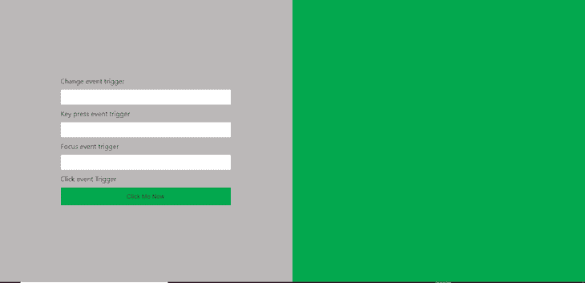
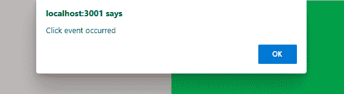

# React 合成事件日志入门博客

> 原文：<https://blog.logrocket.com/getting-started-react-synthetic-event/>

在 JavaScript 中，不同浏览器中的事件命名约定很少统一，这意味着开发人员经常被迫为特定的浏览器定制版本。然而，React [`SyntheticEvent`](https://reactjs.org/docs/events.html) 会在不同的浏览器中注册一个事件的名称，这样你就不必这么做了。作为围绕浏览器本机事件的统一跨浏览器包装器，React `SyntheticEvent`提供了统一的 API，防止浏览器不一致，并确保事件跨多个平台工作。

在本教程中，我们将[探究 React 的`SyntheticEvent`](https://blog.logrocket.com/creating-hover-events-synthetic-event-react-hover/) 的内部工作原理。我们将介绍普通 JavaScript 事件和 React 合成事件的基础知识，并指出它们的相似之处和不同之处。之后，我们将在不同的上下文中查看一些 React 合成事件的示例。我们开始吧！

## JavaScript 事件

JavaScript 事件本质上允许用户与 web 应用程序进行交互并实现操作，比如在浏览器中触发时注册单击、聚焦、鼠标悬停和按键动作。

每个 JavaScript 事件都有一个与事件监听器协同工作的事件处理程序。事件侦听器侦听应该发生的特定事件，而事件处理程序是一个包含代码块的函数，这些代码块将在事件注册或触发后执行。

## 对合成事件和本地事件作出反应

### 类似

React 合成事件与本机事件非常相似，但是，对于合成事件，相同的 API 接口跨多个浏览器实现。

合成事件和本地事件都可以实现`preventDefault`和`stopPropagation`方法。然而，合成事件和原生事件并不完全是一回事。例如，`SyntheticEvent`会指向`onMouseLeave`事件的`mouseout`。

如果需要直接访问，您总是可以使用`nativeEvent`属性来访问本地事件。其他的`SyntheticEvent`属性包括`DOMEventTarget`、`currentTarget`、`boolean defaultPrevented`和`string type`等等。

### 差异

此时，我们完全意识到用 React 元素处理事件与用原生 DOM 元素处理事件非常相似。然而，重大差异依然存在。

首先，使用 React，我们必须使用 camelCase 符号来命名事件。例如，在普通 JavaScript 中，`click`事件被定义为`onclick()`，而在 React 中，我们使用`onClick()`来访问同一个事件

此外，在 React 中使用 JSX 时，我们必须将函数作为事件处理程序传递，而不是作为字符串传递。让我们进一步演示如何在不同的上下文中使用`SyntheticEvent`。

### `SyntheticEvent`例子

假设我们正在构建一个包含书籍列表的应用程序。我们想添加一个搜索功能，允许用户根据作者的名字过滤列表。让我们用这两种事件类型来实现这个功能。

### 普通 JavaScript

首先，用 JSX 定义`input`字段，如下所示:

```
// src/App.js/

class App extends Component {

  // Some piece of codes...

  render() {
    return (
      <div className="App">
        <form>
          <input type="text" />
        </form>
        { this.state.list.map(item =>
          // Some piece of codes 
        )}
      </div>
    );
  }
}

```

在这个事件系统中，用户将在`input`字段中键入内容，临时过滤列表。要过滤图书列表并更新状态，您需要访问`input`字段的值。

### React `SyntheticEvent`实现

使用 React `SyntheticEvent`，我们可以访问事件负载。在`input`字段中，我们定义了一个`onChange`回调函数，如下所示:

```
// src/App.js/

class App extends Component {

  // Some piece of codes...

  render() {
    return (
      <div className="App">
        <form>
          <input 
            type="text" 
            onChange={this.onSearchChange}
          />
        </form>
        // Some piece of codes...
      </div>
    );
  }
}

```

接下来，我们将绑定并定义方法；该函数绑定到组件，并且是一个类方法:

```
// src/App.js/

class App extends Component {

  constructor(props) {
    super(props);

    this.state = [
      list,
    ];

    this.onSearchChange = this.onSearchChange.bind(this); 
    this.onDismiss = this.onDismiss.bind(this);
  }

  onSearchChange(){
    // Some piece of codes
  }

  // Some piece of codes...
}

```

有了方法参数，我们现在可以访问合成的 React 事件。事件现在有了`input`字段的值和事件有效载荷。本质上，`e`是一个合成事件，让我们有能力操纵`searchName`的状态，如下所示:

```
// src/App.js/

class App extends Component {
  // Some piece of codes

  onSearchChange(e){
    this.setState({ searchName: e.target.value });
  }

  // Some piece of codes...
}

```

我们需要在构造函数中给`searchName`一个初始状态，如下所示:

```
// src/App.js/

class App extends Component {

  constructor(props) {
    super(props);

    this.state = [
      list,
      searchName: '',
    ];

    this.onSearchChange = this.onSearchChange.bind(this); 
    this.onDismiss = this.onDismiss.bind(this);
  }

  // Some piece of codes...
}

```

## 构建我们的 React `SyntheticEvent`项目



现在我们已经熟悉了 React `SyntheticEvent`的好处，让我们来做一个使用合成事件的项目。

> 请记住，与不同的合成事件交互与处理普通的 JavaScript 事件非常相似。React 的目标是让合成事件与正常的本地事件保持相当的相似，例如，通过使用相同的属性。

让我们使用 React CLI 为这个演示创建 React 项目。如果您没有安装 React CLI，请在终端中运行以下命令:

```
npm install -g create-react-app

```

现在，创建项目，并使用下面的命令为其命名:

```
create-react-app <app-name>

```

上面的命令创建了一个模板来开始构建我们的应用程序。您可以通过切换到您的新目录并启动开发服务器来查看这个模板:

```
cd <app-name> && npm start

```

在您的浏览器中，前往`[http://localhost:3000](http://localhost:3000)`。我们将在`app.js`文件中工作，该文件是在您运行`create-react-app`命令时自动创建的。继续删除它的内容，使页面成为空白，然后将下面的代码块粘贴到空的`app.js`文件中:

```
import './style.css';

function App() {
  return (
     <div className="main">
      <div className="main__left">
         <div className="form__container">
           <form className="form" onSubmit={(e) => e.preventDefault()}>
           {/* typing event */}
           <label for="input__change">Change event trigger</label>
           <input onChange={(e) => alert(` Change event occurred, value is ${e.target.value}`)} className="" name="input__change" className="input__change" type="text"></input>
           {/* key typed event */}
           <label for="input__keycode">Key press event trigger</label>
           <input onKeyPress={(e) => alert(`KeyPress event occurred, key code is ${e.keyCode}`)} className="" className="input__keycode" type="text"></input>
           {/* focus event */}
           <label for="input__focus">Focus event trigger</label>
           <input onFocus={() => alert(`Focus event occurred`)} className="input__focus" id="input__focus" name="input__focus" type="text"></input>
           {/* Click event */}
           <label for="input__click">Click event Trigger</label>
           <button onClick={() => alert(`Click event occurred`)} className="input__click" id="input__click">Click Me Now</button>
           </form>
         </div>
      </div>
      <div className="main__right">
      </div>
     </div>
  );
}

export default App;

```

上面的每个输入字段与按钮一起工作来跟踪不同的事件，其中一些是我们之前建立的。这些事件包括一个`onSubmit`事件，一个`keyPress`事件，一个`click`事件，最后是一个`focus`事件。

`onSubmit`使用常规的`preventDefault`属性来防止表单提交时的默认动作。`preventDefault`属性与本地事件中的属性相同。

在上面的代码块中，我们在不同的事件被触发时提醒用户。例如，点击上面的按钮将触发一个`onClick`事件，该事件将向用户显示以下消息:



我们还为样式表的`keyPress`事件使用了`keyCode`属性，如下所示:

```
:root{
    --color__primary : #03a84e ;
    --color__secondary : rgb(187, 184, 184);
}
.main{
    background:red;
    display:grid;
    grid-template-columns:1fr 1fr;
    height:100vh;
}
.main__right{
    background:var(--color__primary); 
}
.main__left{
    background:var(--color__secondary);
    width:100%;
    display:grid;
    place-content:center;
}
form{
    width:400px;  
}
input{
    width:calc(100% - 23px);
    padding:10px;
    display:block;
    margin:auto;
    margin:10px 0;
    border:None;
    outline:none;  
}
button{
    display:block;
    outline:none;
    border:none;
    background:var(--color__primary);
    padding:.8rem;
    font-size:.9rem;
    margin-top:10px;
    width:calc(100% - 3px);
    cursor:pointer;
}
@media (max-width: 800px){
    .main{
        grid-template-columns:1fr;
    }
    .main__right{
        display:none;
    }
}

```

最后，让我们给每个事件添加一个`Capture`后缀，这样我们就可以快速捕获我们的事件，而不用让它经历冒泡阶段:

```
import './style.css';

function App() {
  return (
     <div className="main">
      <div className="main__left">
         <div className="form__container">
           <form className="form" onSubmitCapture={(e) => e.preventDefault()}>
           {/* typing event */}
           <label for="input__change">Change event trigger</label>
           <input onChangeCapture={(e) => alert(` Change event occurred, value is ${e.target.value}`)} className="" name="input__change" className="input__change" type="text"></input>
           {/* key typed event */}
           <label for="input__keycode">Key press event trigger</label>
           <input onKeyPressCapture={(e) => alert(`KeyPress event occurred, key code is ${e.keyCode}`)} className="" className="input__keycode" type="text"></input>
           {/* focus event */}
           <label for="input__focus">Focus event trigger</label>
           <input onFocusCapture={() => alert(`Focus event occurred`)} className="input__focus" id="input__focus" name="input__focus" type="text"></input>
           {/* Click event */}
           <label for="input__click">Click event Trigger</label>
           <button onClickCapture={() => alert(`Click event occurred`)} className="input__click" id="input__click">Click Me Now</button>
           </form>
         </div>
      </div>
      <div className="main__right">
      </div>
     </div>
  );
}

export default App;

```

现在，我们的事件在触发后立即被捕获。

## 结论

`SyntheticEvent`允许 React 中的事件轻松适应不同的浏览器，解决了给开发者带来不必要挫折的问题。

在本教程中，我们详细研究了 React `SyntheticEvent`，将其与普通的 JavaScript 事件进行了比较，并运行了几个示例。然后，我们使用合成事件和 JavaScript 事件构建了自己的应用程序。现在，您应该对如何使用合成事件来改善您的开发人员体验有了更好的理解。我希望你喜欢这个教程！

## [LogRocket](https://lp.logrocket.com/blg/react-signup-general) :全面了解您的生产 React 应用

调试 React 应用程序可能很困难，尤其是当用户遇到难以重现的问题时。如果您对监视和跟踪 Redux 状态、自动显示 JavaScript 错误以及跟踪缓慢的网络请求和组件加载时间感兴趣，

[try LogRocket](https://lp.logrocket.com/blg/react-signup-general)

.

[ ](https://lp.logrocket.com/blg/react-signup-general) [](https://lp.logrocket.com/blg/react-signup-general) 

LogRocket 结合了会话回放、产品分析和错误跟踪，使软件团队能够创建理想的 web 和移动产品体验。这对你来说意味着什么？

LogRocket 不是猜测错误发生的原因，也不是要求用户提供截图和日志转储，而是让您回放问题，就像它们发生在您自己的浏览器中一样，以快速了解哪里出错了。

不再有嘈杂的警报。智能错误跟踪允许您对问题进行分类，然后从中学习。获得有影响的用户问题的通知，而不是误报。警报越少，有用的信号越多。

LogRocket Redux 中间件包为您的用户会话增加了一层额外的可见性。LogRocket 记录 Redux 存储中的所有操作和状态。

现代化您调试 React 应用的方式— [开始免费监控](https://lp.logrocket.com/blg/react-signup-general)。