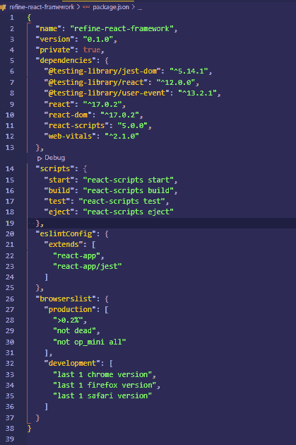
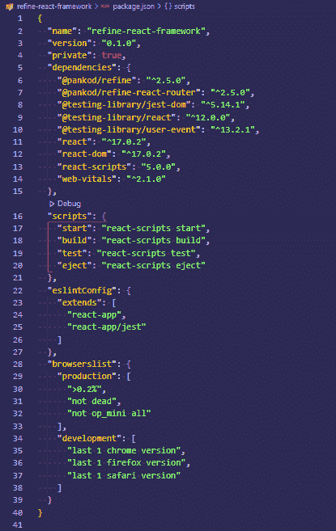
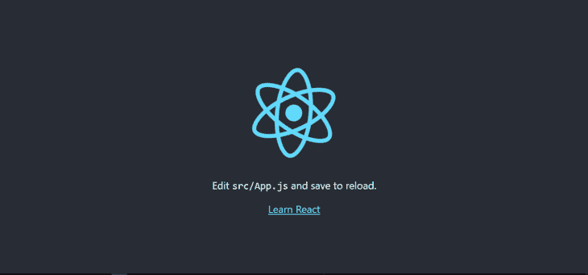
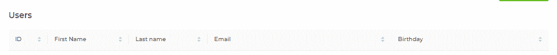
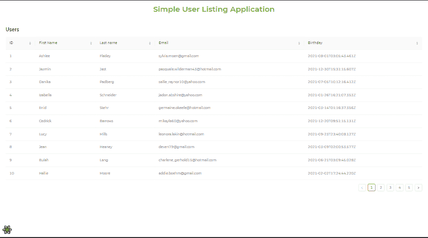
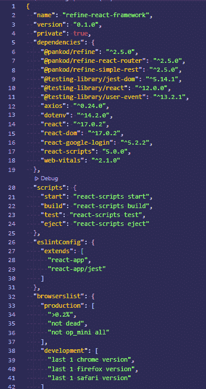
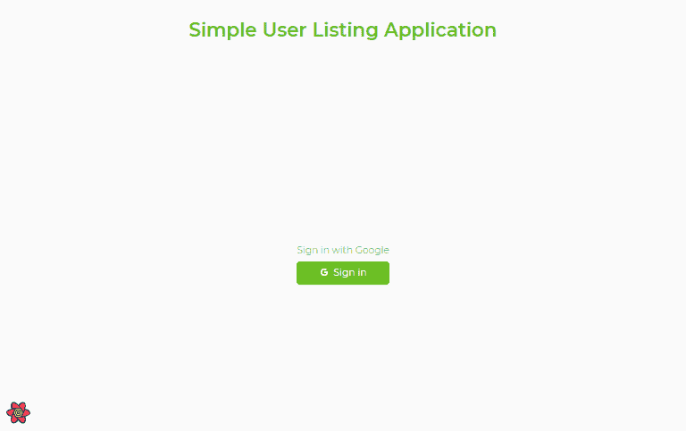
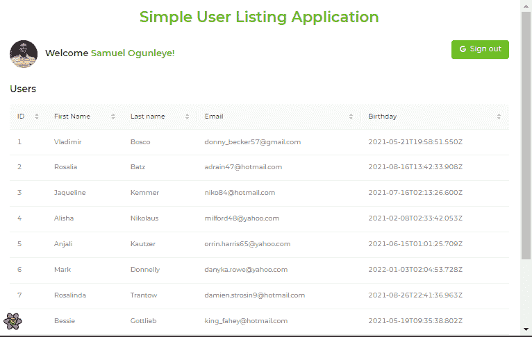

# Refine 入门，基于 React 的框架

> 原文：<https://blog.logrocket.com/getting-started-refine-react-based-framework/>

在前端技术世界中学习多种框架不仅仅是有趣的，它也可以是一个聪明的职业发展和未来项目的良好实践。万一你再次遇到新的框架，你就准备好了。

Refine 是另一个很棒的框架，它的发布是为了减轻开发者在路由、认证和状态管理方面的压力。

在本文中，我们将了解基于 React 的框架 Refine 如何通过创建一个演示用户认证和路由的简单 web 应用程序来帮助开发人员使用其内置特性。

## 什么是精炼？

Refine 是一个基于 React 的框架，用于快速开发数据密集型应用。它使用了 [Ant Design](https://blog.logrocket.com/introduction-to-ant-design/) 系统，这是一个面向业务的用户界面工具包。

Refine 附带了许多预构建的功能，可以帮助您快速入门，而不会失去可定制性。路由、联网、认证、状态管理和国际化都是这种功能的例子。

Refine 的超能力是完全控制用户界面。它非常适合需要处理大量数据的应用程序，如管理面板和仪表板，并且它为 REST 和 GraphQL 提供了数据库支持，包括 Strapi 和 NestJS CRUD。

## 先决条件

要理解本教程，您需要:

*   React v16 或更新版本
*   React 的工作知识
*   Node.js 的工作知识
*   文本编辑器

## 使用精炼钩

在我们开始构建我们的示例应用程序之前，让我们回顾一下 Refine 最好的特性之一:钩子。对于开发者来说，Refine 的钩子使得与 web 应用程序的集成变得更加容易。最棒的是，除了它们所基于的原生 React 钩子之外，Refine 的钩子还包括一些额外的特性。

数据挂钩包括`useCreate`、`useUpdate`、`useDelete`、`useCustom`和`useApiUrl`，是 Refine 提供的一些附加功能。它们类似于您可以在 [React 查询](https://blog.logrocket.com/whats-new-in-react-query-3/)中找到的钩子——查看[文档](https://refine.dev/docs/api-references/hooks/data/useCreate/)以了解更多关于 Refine 的数据钩子的信息。

在本文中，我们将主要关注授权挂钩，因为我们将在稍后构建示例应用程序时实现它们。

### Refine 的授权挂钩

这些钩子有助于 web 应用程序的身份验证。它们授予我们超能力，例如在访问受保护的路由之前验证用户登录、注销或验证现有用户是否满足特定标准的能力。它采用以下功能:

首先，`useLogin`调用一个`authProvider`登录方法，如果登录方法成功，它将验证应用程序，如果失败，它将显示一个错误通知。成功认证后，它会将用户返回到基本应用程序:

```
import { useLogin, Form } from "@pankod/refine";

export const LoginPage = () => {
    const { mutate: login } = useLogin()

    const onSubmit = (values) => {
        login(values);
    };

    return (
        <Form onFinish={onSubmit}>
            // rest of the login form
        </Form>
    )
}

```

接下来，`useLogout`调用`authProvider`的 logout 方法。如果`authProvider`的注销方法成功，它将验证应用程序；如果失败，身份验证状态保持不变。

请看下面的一小段，看看这个钩子是如何工作的:

```
import { useLogout, Button } from "@pankod/refine";

export const LogoutButton = () => {
    const { mutate: logout } = useLogout();

    return (
        <Button onClick={() => logout()}>
            Logout
        </Button>
    )
}

```

`useCheckError`调用`authProvider`的`checkError`功能。如果`checkError`返回一个被拒绝的承诺，则`useCheckError`运行`authProvider`的注销方法，并且该应用未经认证:

```
import { useCheckError } from "@pankod/refine";

const { mutate: checkError } = useCheckError();

fetch("https://api.fake-rest.refine.dev/users)
    .then(() => console.log("Success"))
    .catch((error) => checkError(error));

```

最后，`useAuthenticated`调用`authProvider`的`checkAuth`方法，该方法检查任何特定的和受保护的动作。

### 桌子挂钩

通过使用`useTable()`钩子，您可以访问与 Ant Design 的`Table`组件兼容的属性。这个钩子提供了几个功能，比如排序、过滤和分页:

```
import React from "react";
import { List, Table, useTable } from "@pankod/refine";

export const Sample = () => {
  const { tableProps } = useTable();

  return (
    <div>
      <List>
        <Table {...tableProps} rowKey="id">
          <Table.Column dataIndex="id" title="ID"    />
           </Table>
      </List>
    </div>
  );
};

export default Sample;

```

## 开始使用 Refine

在本教程中，我们将构建一个列出用户的简单应用程序。首先，我们将为 Refine 生成一个默认模板。

有两种方法可以做到这一点；第一种技术是使用 [superplate](https://pankod.github.io/superplate/) ，第二种是使用 Create React App。我们将基于本教程使用创建 React 应用程序的方法，因为我们都是 React 的粉丝😊。

在您的终端中，创建一个新的 React 应用程序并运行以下命令:

```
yarn create react-app refine-react-framework

```

这将生成一个启动模板并创建一个`refine-react-framework`文件夹。您的`package.json`文件应该是这样的:



但是我们还没有完成。在构建了默认的 React 模板之后，我们需要运行下面的命令来安装 Refine 包:

```
yarn add @pankod/refine @pankod/refine-react-router

```

这将把 Refine 模块安装到我们上面创建的 React 应用程序中。这是您的`package.json`文件现在应该看起来的样子:



Refine 模块已经成功安装，如第六行和第七行所示。现在，让我们使用下面的命令运行应用程序:

```
yarn start

```

您的输出应该是这样的:



让我们在上面创建的项目内部做一些清理工作，因为有一些我们不会使用的不必要的文件。

打开`src`文件夹，从项目中删除`setupTests.js`、`reportWebVitals.js`、`logo.svg`、`App.css`和`toApp.test.js`。这只是为了减少项目文件的大小，因为我们不会使用它们。

打开`App.js`，将代码替换为:

```
const App = () => {
  return (
    <div>
      Hello World
    </div>
  );
}

export default App;

```

上面的代码只是从模板中删除了以前的内容，这样我们就可以在一个干净的环境中工作。

另外需要注意的是，我们的应用程序被破坏了，因为我们删除了一些链接到`index.js`内部的文件。让我们通过用下面的代码更新文件来解决这个问题:

```
import React from "react";
import ReactDOM from "react-dom";
import "./index.css";
import App from "./App";

ReactDOM.render(
 <React.StrictMode>
   <App />
 </React.StrictMode>,

 document.getElementById("root")
);

```

最后，进入你的`index.css`文件并清除它，这样它就不包含任何代码了。

你会注意到我们的应用中没有包含任何第三方 UI 库。为什么？这是因为 Refine 自带了一个名为 Ant Design 的内置 UI 库系统。

其他 UI 库系统(如[查克拉 UI](https://blog.logrocket.com/advanced-techniques-chakra-ui/) 、引导、材料 UI)也受 Refine 支持。在本文中，我们将使用默认的 Ant 设计系统。

## 用 Refine 构建简单的 web 应用程序

现在让我们动手看看 Refine 在一个简单的用户列表应用程序中是如何工作的。该应用程序将从端点检索一些随机数据，并以带有分页功能的表格形式提供给用户。

我们将使用 JSON Server 提供的一些虚构的 REST API 数据，这是一个生成假 REST API 的工具。在使用 API 之前，您应该阅读位于[https://api.fake-rest.refine.dev/](https://api.fake-rest.refine.dev/)的文档。

让我们对上一节开始的项目做一些更改。在`src`文件夹中创建一个`pages`文件夹、`component`文件夹和`queries`文件夹。这些文件夹将有助于关注点的分离，从而产生良好的代码组织。

在 components 文件夹中创建一个名为`users`的子文件夹，并在其中创建一个名为`User.jsx`的文件。然后，复制并粘贴以下代码:

```
import React from "react";
import { List, Table, useTable } from "@pankod/refine";

export const Users = () => {
  const { tableProps } = useTable({
    initialSorter: [
      {
        field: "title",
        order: "asc",
      },
    ],
  });

  return (
    <div>
      <List>
        <Table {...tableProps} rowKey="id">
          <Table.Column dataIndex="id" title="ID" sorter />
          <Table.Column dataIndex="firstName" title="First Name" sorter />
          <Table.Column dataIndex="lastName" title="Last name" sorter />
          <Table.Column dataIndex="email" title="Email" sorter />
          <Table.Column dataIndex="birthday" title="Birthday" sorter />
        </Table>
      </List>
    </div>
  );
};

export default Users;

```

这是真正的骗局发生的地方！在这个场景中，一些组件是用一个`useTable`钩子导入的。

请记住，这里使用了所有的 Ant 设计组件，它们创建了一个惟一的表集合，将用于在项目期间填充特定的数据。让我们仔细看看上面的代码。

* * *

### 更多来自 LogRocket 的精彩文章:

* * *

钩子是 Refine 的一个重要组成部分，正如我们前面所学的,`useTable()`是一个重要的部分。在这里，`useTable()`钩子从一个 API 中检索数据，并将它包装在组件的各种助手钩子中。通过这一行代码，排序、过滤和分页等数据交互任务将可以动态完成。

`initialSorter`参数允许您选择哪个字段将从哪个排序状态开始(`"asc"`或`"desc"`)。它决定了数据是按升序还是降序显示。它通过表的`sorter`属性工作。

`List`是细化成分。它充当其他元素的包装。

`Table.Column`用于显示数据行和收集结构化数据。它还能够排序、搜索、分页和过滤。

`rowKey`是用于高效迭代的独一无二的标识符键。

`dataIndex`属性充当每个表格行和列的唯一标识符。它将该字段映射到来自 API 响应的匹配键。

让我们启动终端，在您喜欢的浏览器中查看输出；它看起来应该是这样的:



## 正在为应用程序检索数据

现在让我们使用假的 REST API 来获取一些有用的信息。导航到`queries`文件夹，并在其中创建一个名为`GetData.jsx`的文件。将以下代码复制并粘贴到您的编辑器中:

```
import { Refine } from "@pankod/refine";
import routerProvider from "@pankod/refine-react-router";
import dataProvider from "@pankod/refine-simple-rest";

import { Users } from "components/users/Users";

export const GetData = () => {
  const API_URL = "https://api.fake-rest.refine.dev";

  return (
    <Refine
      routerProvider={routerProvider}
      dataProvider={dataProvider(API_URL)}
      resources={[{ name: "users", list: Users }]}
      Layout={({ children }) => (
        <div style={{ display: "flex", flexDirection: "column" }}>
          {children}
        </div>
      )}
    />
  );
};
export default GetData;

```

`routerProvider`、`dataProvider`、`resources`和`Layout`是这里要寻找的最重要的东西。这些都是已传递给“细化”组件的属性。虚拟数据将在`API_URL`生成。

一些路由器特性，如资源页面、导航等，是作为`routerProvider`的结果而创建的。它给你选择使用任何你想要的路由器库。

定制应用程序和 API 之间的接口称为数据提供者，如上面的`dataProvider`所示。它充当了一个精炼集成器，使得开发人员利用各种 API 和数据服务变得简单。它使用已建立的方法发送 HTTP 请求并接收数据作为回报。

`resources` Refine 属性表示 API 端点。它将`name` prop 连接到一个特定的端点，并自动生成一个将附加到该端点的 URL 在这种情况下，附加的 URL 是“/users”

`Layout`是一个定制组件，允许你设计一个新的模板和样式，而不必使用默认模板。它需要一个子参数来使将来在它内部提供的组件更容易处理。

一个命名导入被用来从之前用`Table.Column`技术创建的`User`组件中引入一个`User`组件。然后将它添加到 resource 属性中，这将自动创建一个用于路由的 URL 路径。

现在，让我们通过添加一些额外的标签来改进应用程序的物理布局，从而对我们的`User.jsx`文件进行一些修改。

复制并粘贴以下代码:

```
import React from "react";
import {
  Button,
  Icons,
  List,
  Table,
  useTable,
  Typography,
} from "@pankod/refine";

export const Users = () => {
  const { Title } = Typography;
  const { tableProps } = useTable({
    initialSorter: [
      {
        field: "title",
        order: "asc",
      },
    ],
  });

  return (
    <div>
      <Title
        style={{
          textAlign: "center",
          fontSize: "2rem",
          fontWeight: 600,
          padding: "1rem",
          color: "#67be23",
        }}
      >
        Simple User Listing Application
      </Title>
      <List>
        <Table {...tableProps} rowKey="id">
          <Table.Column dataIndex="id" title="ID" sorter />
          <Table.Column dataIndex="firstName" title="First Name" sorter />
          <Table.Column dataIndex="lastName" title="Last name" sorter />
          <Table.Column dataIndex="email" title="Email" sorter />
          <Table.Column dataIndex="birthday" title="Birthday" sorter />
        </Table>
      </List>
    </div>
  );
};

export default Users;

```

在上面的代码中，来自`"@pankod/refine"`的组件被导入，它们将被用来为表生成用户。

为了改善用户体验，引入了一些标记，并且这些标记通过内联样式得到了增强。

让我们重新启动终端，检查浏览器的新输出:



耶！甚至分页也能很好地与我们用来生成数据的表一起工作，该表包含一个用户列表。

注意，当使用`useTable`钩子时，缺省情况下包含分页。

## 创建动态登录页面

我们能够创建一个简单的应用程序来显示随机人员的列表以及更多的信息。我们可以通过创建一个动态登录页面来增加应用程序的趣味性，该页面可以防止用户在通过身份验证之前访问所创建的用户列表。

在这个场景中，我们将使用第三方库，比如 [Google Authenticator](https://github.com/google/google-authenticator) 、 [Axios](https://blog.logrocket.com/understanding-axios-post-requests/) 和 [dotenv](https://www.npmjs.com/package/dotenv) 。用户将能够使用 Google 认证自己，使用 Axios 向 REST 端点发送请求，使用 dotenv 保存秘密的 API 密钥。

将以下命令复制并粘贴到您的终端中:

```
yarn add react-google-login axios dotenv

```

这将安装 Google Authenticator 依赖项，以及用于发起请求的 Axios 和用于保护密钥安全的 dotenv。您的`package.json`文件应该看起来像这样:



让我们从 Google Authenticator 的特性开始吧！

转到`pages` 文件夹，在其中创建一个名为`Login.jsx`的新文件。这是登录过程发生的地方。将以下代码复制并粘贴到您的浏览器中:

```
import { Button, Icons, useLogin, Typography } from "@pankod/refine";
import { useGoogleLogin } from "react-google-login";
const { GoogleOutlined } = Icons;
const clientId = `${process.env.REACT_APP_CLIENT_ID}`;

export const Login = () => {
  const { Title } = Typography;
  const { mutate: login, isLoading } = useLogin();

  const { signIn } = useGoogleLogin({
    onSuccess: (response) => login(response),
    clientId,
    isSignedIn: true,
    cookiePolicy: "single_host_origin",
  });

  return (
    <div>
      <div
        style={{
          background: "#fafafa",
          height: "100vh",
          display: "flex",
          flexDirection: "column",
        }}
      >
        <div>
          <Title
            style={{
              textAlign: "center",
              fontSize: "2rem",
              fontWeight: 600,
              padding: "2rem",
              color: "#67be23",
            }}
          >
            Simple User Listing Application
          </Title>
        </div>
        <div style={{  margin: "auto" }}>
          <Title
            style={{
              textAlign: "center",
              fontSize: "1rem",
              fontWeight: 300,
              padding: "3rem 0 0 0",
              color: "#67be23",
            }}
          >
            Sign in with Google
          </Title>
          <Button
            type="primary"
            size="large"
            block
            icon={<GoogleOutlined />}
            loading={isLoading}
            onClick={() => signIn()}
          >
            Sign in
          </Button>
        </div>
      </div>
    </div>
  );
};

```

让我们更详细地看看上面的代码，看看发生了什么。

我们需要为我们的登录页面导入几个组件和钩子，所以我们这样做了。

`Button`、`Icon`、`Typography`为组件，`useLogin`、`useGoogleLogin`为挂钩。

`Button`执行与标准 HTML 按钮标签相同的功能，允许在点击按钮时执行动作。它包括`Icon`组件、加载状态和一个`onClick`方法，这些都作为道具提供。

`Typography`支持文本特性，允许向`Title`组件添加额外的标题文本。

`useGoogleLogin`允许您访问`signIn`参数。这个参数然后被提供给`Button`组件，当用户点击它时，它触发一个动作。

`useGoogleLogin`调用`onSuccess`函数，每当发出登录请求时都会调用该函数。无论何时运行，它都会检查与`onSuccess`相关的属性是否正确，然后对用户进行身份验证。属性包括`ClientId`、`isSignedIn`和`cookiePolicy`。

复制客户端 ID 密钥，并将其放入将在应用程序的根文件夹中创建的`.env`文件中。`Process.env`用于将客户端 ID 密钥与使用它的应用程序同步。

现在，让我们创建一个`services`文件夹，它将在我们开始应用程序之前处理所有的用户操作。在文件夹中创建一个`authProvider.js`文件，并添加以下代码:

```
import axios from "axios";

export const authProvider = {
    login({ tokenId, profileObj, tokenObj }) {
      axios.defaults.headers.common = {
        Authorization: `Bearer ${tokenId}`,
      };

      localStorage.setItem(
        "user",
        JSON.stringify({ ...profileObj, avatar: profileObj.imageUrl }),
      );
      localStorage.setItem("expiresAt", tokenObj.expires_at.toString());

      return Promise.resolve();
    },
    logout() {
      localStorage.removeItem("user");
      localStorage.removeItem("expiresAt");
      return Promise.resolve();
    },
    checkError() {
      return Promise.resolve();
    },
    checkAuth() {
      const expiresAt = localStorage.getItem("expiresAt");

      if (expiresAt) {
        return new Date().getTime() / 1000 < +expiresAt
          ? Promise.resolve()
          : Promise.reject();
      }
      return Promise.reject();
    },
    getUserIdentity() {
      const user = localStorage.getItem("user");
      if (user) {
        return Promise.resolve(JSON.parse(user));
      }
    },
  };

```

在这种情况下，开发了`authProvider`来处理认证操作。它接受在执行一个动作时执行的一些方法。

`login`方法接受一些输入(`tokenId`、`profileObj`、`tokenObj`)，这些输入是从 Google 获得的，将在应用程序的未来使用。这些响应被暂时保存到`localStorage`中，然后在需要的时候被调用。

`logout` 方法实质上删除了已经设置或保存到`localStorage`的任何内容。

验证是通过`checkAuth`方法处理的。它会检查用户会话是否仍处于活动状态，是否尚未用完；如果没有，它会将用户弹回主页。

成功登录后，`getUserIdentity`功能有助于获取保存的数据。以前为将来保存的数据将在这里被访问和使用。

现在让我们更新之前创建的`GetData.jsx`文件。复制并粘贴以下代码:

```
import { Refine } from "@pankod/refine";
import routerProvider from "@pankod/refine-react-router";
import dataProvider from "@pankod/refine-simple-rest";
import {authProvider} from "services/authProvider"
import axios from "axios";

import { Users } from "components/users/Users";
import { Login } from "pages/Login";

export const GetData = () => {
  const API_URL = "https://api.fake-rest.refine.dev";

  return (
    <Refine
      authProvider={authProvider}
      routerProvider={routerProvider}
      dataProvider={dataProvider(API_URL, axios)}
      resources={[{ name: "users", list: Users }]}
      LoginPage={Login}
      reactQueryDevtoolConfig={{
        initialIsOpen: false,
        position: "none",
      }}
      Layout={({ children }) => (
        <div style={{ display: "flex", flexDirection: "column" }}>
          {children}
        </div>
      )}
    />
  );
};

export default GetData;

```

先前创建的`authProvider` 被导入并作为属性传递给 Refine 组件。

因为它是一个定制的`Login.jsx`组件，所以在 Refine 组件中也提供了`LoginPage`属性。

`Axios`作为参数与`API_URL`一起传递，因为它对于发送请求是必不可少的。

让我们看看浏览器中的结果。输出应该如下所示:



当用户选择 **Sign in** 按钮时，系统对用户进行身份验证，并将他们重定向到我们之前创建的用户页面。

## 创建注销按钮

到目前为止，我们已经创建了用户列表页面和登录页面。让我们通过添加一个退出按钮并从`localStorage`生成一些动态数据来结束我们的应用程序。

复制下面的代码并粘贴到`Users.jsx`文件中:

```
import React from "react";
import {
  Button,
  Icons,
  List,
  Table,
  useTable,
  useLogout,
  Typography,
} from "@pankod/refine";
import { useGoogleLogout } from "react-google-login";
import { useGetIdentity } from "@pankod/refine";

export const Users = () => {
  const { data: identity } = useGetIdentity()
  const { Title } = Typography;
  const { tableProps } = useTable({
    initialSorter: [
      {
        field: "title",
        order: "asc",
      },
    ],
  });

  const { mutate: logout, isLoading } = useLogout();
  const { GoogleOutlined } = Icons;
  const clientId = `${process.env.REACT_APP_CLIENT_ID}`;

  const { signOut } = useGoogleLogout({
    onLogoutSuccess: (response) => logout(response),
    clientId,
    isSignedIn: false,
    cookiePolicy: "single_host_origin",
  });

  return (
    <div>
      <Title
        style={{
          textAlign: "center",
          fontSize: "2rem",
          fontWeight: 600,
          padding: "1rem",
          color: "#67be23",
        }}
      >
        Simple User Listing Application
      </Title>
      <div
        style={{
          display: "flex",
          justifyContent: "space-between",
          padding: "0 1.5rem",
        }}
      >
        <Title
          style={{
            fontSize: "1.2rem",
          }}
        >
          
          Welcome <span style={{ color: "#67be23" }}> {identity?.name}!</span>
        </Title>
        <Button
          type="primary"
          size="large"
          htmlType="submit"
          icon={<GoogleOutlined />}
          loading={isLoading}
          onClick={() => signOut()}
        >
          Sign out
        </Button>
      </div>
      <List>
        <Table {...tableProps} rowKey="id">
          <Table.Column dataIndex="id" title="ID" sorter />
          <Table.Column dataIndex="firstName" title="First Name" sorter />
          <Table.Column dataIndex="lastName" title="Last name" sorter />
          <Table.Column dataIndex="email" title="Email" sorter />
          <Table.Column dataIndex="birthday" title="Birthday" sorter />
        </Table>
      </List>
    </div>
  );
};

export default Users;

```

在这种情况下，我们使用了`useGoogleLogout()`和`useGetIdentity()`钩子。

在`authProvider`文件中，声明了`useGetIdentity()`钩子。它提供了对`identity` 参数的访问，该参数将被用来获得一些`localStorage`数据。

`useGoogleLogout()`钩子类似于`useGoogleLogin()`钩子，因为它通过允许你使用`signOut`参数来实现相反的功能。当用户点击按钮时，这个参数被传递给`Button`组件，它执行一个动作。

每当`useGoogleLogin()`发出注销请求时，就会执行`onLogoutSuccess`方法。

`identity.name`从`localStorage`读取用户名。

图像 URL 通过`identity.imageUrl`从`localStorage`获得。



耶！我们的申请现在正式完成。我相信我们已经学习了很多关于 Refine 的东西，并且掌握了一些 Refine 的变通方法，比如授权钩子的使用。

## 结论

到本文结束时，您应该已经很好地理解了 Refine 是如何工作的，为什么它在 web 应用程序中如此重要，以及如何构建一个基本的 Refine web 应用程序。

这是一个具有各种功能的简单项目。你可以在 GitHub 上查看[代码，或者查看](https://github.com/Sproff/refine-react-framework)[实时视图](https://refine-react-framework.vercel.app)进行更多练习。

我希望你和我一样觉得这篇教程很有用。

编码快乐！

## [LogRocket](https://lp.logrocket.com/blg/react-signup-general) :全面了解您的生产 React 应用

调试 React 应用程序可能很困难，尤其是当用户遇到难以重现的问题时。如果您对监视和跟踪 Redux 状态、自动显示 JavaScript 错误以及跟踪缓慢的网络请求和组件加载时间感兴趣，

[try LogRocket](https://lp.logrocket.com/blg/react-signup-general)

.

[ ](https://lp.logrocket.com/blg/react-signup-general) [](https://lp.logrocket.com/blg/react-signup-general) 

LogRocket 结合了会话回放、产品分析和错误跟踪，使软件团队能够创建理想的 web 和移动产品体验。这对你来说意味着什么？

LogRocket 不是猜测错误发生的原因，也不是要求用户提供截图和日志转储，而是让您回放问题，就像它们发生在您自己的浏览器中一样，以快速了解哪里出错了。

不再有嘈杂的警报。智能错误跟踪允许您对问题进行分类，然后从中学习。获得有影响的用户问题的通知，而不是误报。警报越少，有用的信号越多。

LogRocket Redux 中间件包为您的用户会话增加了一层额外的可见性。LogRocket 记录 Redux 存储中的所有操作和状态。

现代化您调试 React 应用的方式— [开始免费监控](https://lp.logrocket.com/blg/react-signup-general)。