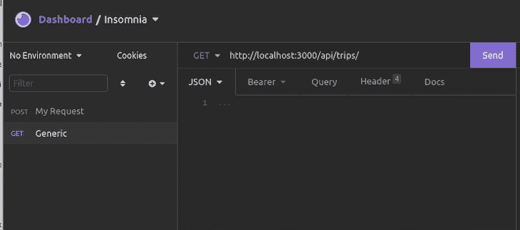
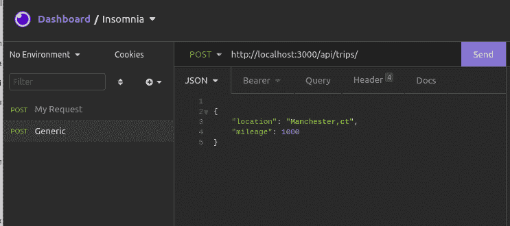

# SolidStart 入门:SolidJS 框架

> 原文：<https://blog.logrocket.com/getting-started-solidstart-solid-js-framework/>

前端框架之间的创新竞赛已经发展了一段时间。React 创新了像 [JSX 这样的特性，使得表达 UI 逻辑更具声明性](https://blog.logrocket.com/million-js-build-apps-jsx-faster-react-preact/)，而 Svelte 引入了编译来减少客户端包的大小。另一方面，SolidJS 结合了这些思想，以及对可组合原语和可观察对象的巧妙使用。

与这些框架的创新并行的是建立在它们之上的元框架的发展，如 React 的 Next.js，Svelte 的 SvelteKit，以及最近 SolidJS 的 T2 solid start。在本文中，我们将探索 SolidStart，考虑它的特性和用例，并最终构建一个简单的应用程序。为了跟进，你可以在 GitHub 上访问教程的[完整代码。我们开始吧！](https://github.com/AlexMercedCoder/lockrocket-solidjs-trips)

## 目录

## SolidStart 功能

SolidJS 提供了许多你期望从元框架中得到的特性，包括基于文件的路由、API 端点以及对服务器端、客户端和静态渲染的支持。

SolidStart 还配备了一些令人惊叹的独特功能，比如能够[使用表单触发服务器动作，类似于 RemixJS](https://blog.logrocket.com/guide-to-remix-react-framework/) ，以及能够使用其`$server`函数轻松定义 RPC 函数。

需要注意的是，在撰写本文时，SolidStart 仍处于实验状态，许多功能可能会缺失或不完整。建议使用 SolidStart，风险自担。尽管如此，我们仍然可以使用 SolidStart 来设置一个简单的应用程序。

## 设置我们的 SolidStart 应用程序

在本教程中，我们将构建一个简单的应用程序来存储商务旅行的数据，包括里程和位置。首先，您的计算机上应该已经安装了 Node.js。

首先，打开代码编辑器，打开一个空文件夹。如果您还没有安装 pnpm，运行`npm install -g pnpm`。然后，运行`pnpm create solid`。

当提示添加服务器端渲染时，选择**是**。为打字稿选择**否**，然后选择一个裸模板。app 生成后，运行`pnpm install`。

## 文件夹结构

当使用 SolidStart 时，您将使用的代码将保存在`/src`文件夹中，它本身包含一些您应该熟悉的文件和文件夹。

*   `/components`:将非页面的所有组件存储在`/components`文件夹中
*   `/routes`:存储`/routes`中页面的组件。页面将是该文件的默认导出
*   存储处理应用程序启动的文件，我们不需要接触这些文件

创建一个`/lib`文件夹，您将使用它来创建支持文件，例如，许多我们的 API 实现细节、支持函数等等。

## 定义我们的商务旅行数据

我们将使用数组来更简单地演示如何使用我们的数据模型，而不是使用数据库。如果你更愿意使用 MongoDB，你可以看看这篇文章。

创建一个名为`src/lib/trips.js`的文件:

```
// The Trips Array
const trips = [
  {
    location: "Miami, FL",
    mileage: 80,
  },
  {
    location: "Savannah, GA",
    mileage: 120,
  },
];

// functions for working with trips we can then convert into API routes or RPC calls
export function getTrips(){
    return trips
}

export function createTrip(newTrip){
    trips.push(newTrip)
    return trips
}

export function updateTrip(id, updatedTrip){
    trips[id] = updatedTrip
    return trips
}

export function deleteTrip(id){
    trips.splice(id, 1)
    return trips
}

```

在这个文件中，我们创建了一个`trip`数组来保存我们的数据，以及处理数组的函数:

*   `getTrips`:返回行程数组，类似于 SQL 中的`SELECT * FROM table`
*   `createTrip`:接受一个对象，并通过将它推入一个数组来创建一个新的旅程，模拟数据库中的一个`INSERT INTO table VALUES (…)`查询
*   `updateTrip`:更新数组中的行程，类似于`UPDATE table WHERE conditions SET updates`查询
*   `deleteTrip`:删除数组中的一个行程，类似于`DELETE FROM table WHERE conditions`查询

这些函数本质上将模拟拥有来自数据库 ORM 的数据模型。

现在，我们可以通过两种方式使这些函数可用于我们的应用程序。首先，我们可以编写使用这些函数的 API 路由。或者，在相关组件中，我们可以使用这些函数和`$server`函数来定义 RPC 调用。请记住，远程过程调用 RPC 指的是从客户端的函数调用中调用服务器上运行的函数。

## 通过 SolidStart 使用 API 路线

任何路由都可以是 API 端点。路由文件只需要导出一个异步`GET` / `POST` / `PUT` / `DELETE`函数来处理该路由的请求类型。如果路由通过导出默认组件来呈现页面，那么您不能为该路由定义一个额外的`GET`。

为了展示这个例子，我们将创建一个名为`src/routes/api/trips/(trips).js`的文件。请注意，文件名周围有括号。这是 SolidStart 的一个功能，允许您在路径的文件夹中表示主文件。因此，这个文件将处理`/api/trips` URL。通常情况下，我们会将文件命名为`index.jsx`。过了一段时间，有这么多同名文件会让人感到困惑。

将以下代码放在`index.jsx`文件中:

```
// json function for sending json responses
import { json } from "solid-start";
import { getTrips, createTrip } from "~/lib/trips";
export async function GET(){
    // return the array of trips
    return json(getTrips())
}
export async function POST({request}){
    // get the request body
    const body = await new Response(request.body).json()
    // create new trip
    createTrip(body)
    // return all trips
    return json(getTrips())
}

```

现在，用`npm run dev`启动您的服务器，您应该能够使用类似 Postman 或失眠症这样的工具来测试路线。

向`[http://localhost:3000/api/trips/](http://localhost:3000/api/trips/)`发出一个`GET`请求，你应该可以得到你所有的旅行:



使用如下所示的 JSON 主体向`[http://localhost:3000/api/trips/](http://localhost:3000/api/trips/)`发出一个`POST`请求，您应该会看到行程被添加:

```
{
    "location": "Manchester,ct",
    "mileage": 1000
}

```



太棒了，我们现在有了可以工作的 API 端点，多简单啊！

## 将行程数据引入路线

在 SolidStart 中，我们可以预取可用于`page`路线和所有子组件的路线数据。

我们导出`routeData`，它的返回值通过`useRouteData`钩子对页面和子组件可用。

让我们设置我们的主页`src/routes/index.jsx`来创建路由数据，作为对我们的 API 路由的 API 调用的结果:

```
import { createRouteData } from "solid-start";

// define our route data, server provided data to frontend
export function routeData() {
return createRouteData(async () => {
  // fetch data from api endpoint
  const response = await fetch("http://localhost:3000/api/trips")
  const data = await response.json()
  return data
});
}

export default function Home() {
  return (
    <main>

    </main>
  );
}

```

注意，我们使用了`createRouteData`函数。这个函数的工作方式很像 React Query，我们可以用以下好处包装异步操作:

*   每当路由操作发生时，异步函数将再次运行，更新我们的数据
*   如果我们在多个路径中使用相同的数据，可以给数据一个唯一的名称来帮助缓存

我们将在`trip`组件中看到如何使用动作和路由数据。

## `Trips`组件

现在，我们将创建一个文件，将所有这些放在`src/components/Trips.jsx`中:

```
import { createRouteAction, useRouteData} from "solid-start";
import { createTrip } from "~/lib/trips";
import server$ from "solid-start/server";
export default function Trips() {
  // bring the route data into our component
  const trips = useRouteData();
  // Define an RPC call of what we want to run on the server
  const makeTrip = server$(async (trip) => createTrip(trip))
  // define a form for creating a trip using solid-states action system
  const [_, { Form }] = createRouteAction(async (formData) => {
    // create the new trip object
    const trip = {
        location: formData.get("location"),
        mileage: formData.get("mileage")
    }
    // pass object RPC call to create new trip on server
    makeTrip(trip)
  });
  return (
    <div>
      <ul>
        {trips()?.map((trip) => (
          <li>{trip.location} - mileage: {trip.mileage}</li>
        ))}
      </ul>
      <Form>
          <input type="input" name="location" placeholder="location"/>
          <input type="number" name="mileage" placeholder="mileage"/>
          <input type="submit"/>
      </Form>
    </div>
  );
}

```

在这个组件中，我们使用了许多 SolidStart 特性；首先，我们使用`useRouteData`来获得在`page`组件中定义的`routeData`。`server$`定义一个只在服务器上运行的功能。在这种情况下，我们希望创建`Trips`的函数只在服务器上运行，因为它不能在客户端运行。

最后，`createRouteAction`创建一个函数和相应的`Form`组件。`Form`组件调用作为动作的函数，触发`routeData`的重取。

* * *

### 更多来自 LogRocket 的精彩文章:

* * *

## 显示`Trips`组件

如下编辑您的`src/routes/index.jsx`:

```
import { createRouteData } from "solid-start";
import Trips from "~/components/Trips";

// define our route data, server provided data to frontend
export function routeData() {
return createRouteData(async () => {
  // fetch data from api endpoint
  const response = await fetch("http://localhost:3000/api/trips")
  const data = await response.json()
  return data
});
}

export default function Home() {
  return (
    <main>
      <Trips/>
    </main>
  );
}

```

使用`useRouteData`钩子，我们导出`routeData()`函数，它允许我们预取页面及其子组件使用的数据。

`createRouteData`创建了一个资源，每当我们的表单在`submit`上触发的动作发生时，这个资源就会重新提取。最后，`<Trips/>`组件显示我们的旅行和表单。

## 结论

希望您已经了解了 SolidStart 框架的强大之处。虽然在撰写本文时它仍处于试验阶段，但 SolidStart 有着光明的未来。如果您想了解 SolidStart 的其他功能，请查看以下版本:

## 您是否添加了新的 JS 库来提高性能或构建新特性？如果他们反其道而行之呢？

毫无疑问，前端变得越来越复杂。当您向应用程序添加新的 JavaScript 库和其他依赖项时，您将需要更多的可见性，以确保您的用户不会遇到未知的问题。

LogRocket 是一个前端应用程序监控解决方案，可以让您回放 JavaScript 错误，就像它们发生在您自己的浏览器中一样，这样您就可以更有效地对错误做出反应。

[](https://lp.logrocket.com/blg/javascript-signup)[https://logrocket.com/signup/](https://lp.logrocket.com/blg/javascript-signup)

[LogRocket](https://lp.logrocket.com/blg/javascript-signup) 可以与任何应用程序完美配合，不管是什么框架，并且有插件可以记录来自 Redux、Vuex 和@ngrx/store 的额外上下文。您可以汇总并报告问题发生时应用程序的状态，而不是猜测问题发生的原因。LogRocket 还可以监控应用的性能，报告客户端 CPU 负载、客户端内存使用等指标。

自信地构建— [开始免费监控](https://lp.logrocket.com/blg/javascript-signup)。