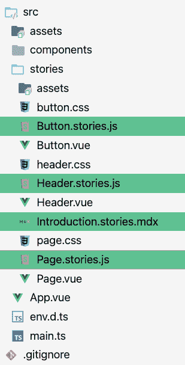
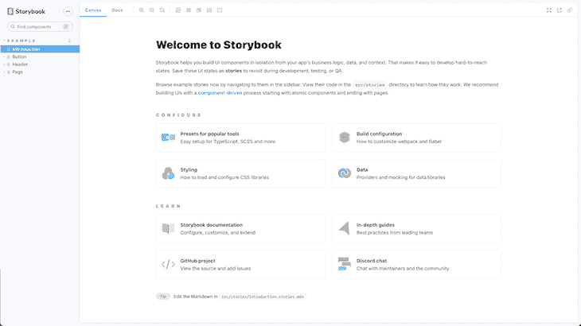
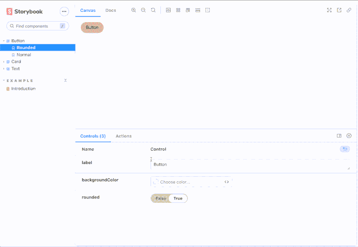
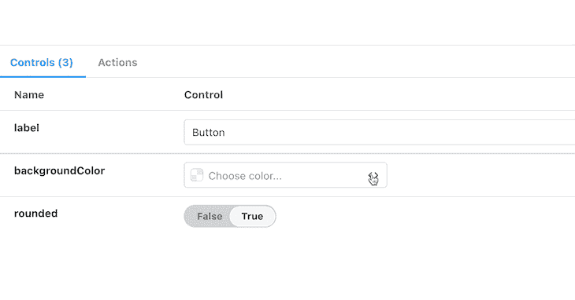

# Vue 3 中的故事书入门

> 原文：<https://blog.logrocket.com/getting-started-storybook-vue-3/>

在使用现代 JavaScript 框架时，您会很快意识到用户界面正在变成组件驱动的。将接口拆分成组件提供了更好的代码重用，有利于干软件原则，并改善了具有类似需求的项目中的代码共享。

框架带来的这种方法现在是前端开发的主干，使 web 开发总体上更容易接近，更容易控制。现在我们有了强大的框架，如 [Vue.js](https://blog.logrocket.com/tag/vue/) 、React、Svelte 和 SolidJS，所有这些都极大地改善了开发体验，为开发人员构建这些组件提供了许多有用的工具。

像 Vue 这样的框架让我们能够在 SFC(单个文件组件)中编写可重用的代码，并有机会通过 props、events 和代码注释对其进行文档化。然而，在开发过程中，我们可能仍然觉得缺少一种更容易获得的方法来为我们的组件提供可靠的文档。

这就是故事书的用武之地。Storybook 提出了一个关于可视化测试和组件隔离的可靠方法。当处理大量复杂的组件或者处理可能与用户界面有更多交互的大型团队时，它可能会派上用场。

在本帖中，我们将得到一本实用的故事书介绍。我们将讨论它如何与 Vue 交互，浏览我们在用 Storybook 建立 Vue 项目时可能遇到的瓶颈，并学习如何克服它们。

# 什么是故事书？

Storybook 是一个开源工具，它可以帮助您隔离组件，同时允许您“玩”它们。

在构建界面组件时，您可能需要用沙箱保护它们，以简化测试、预览和文档编制。Storybook 将通过使您的组件看起来像独立的实体，准备好与其他组件进行测试和集成，来提高您的整体代码可维护性。

此外，您的沙盒组件可以通过您的托管故事书实例与团队中的任何人共享，这有助于与参与构建界面的其他参与者进行更顺畅的交流。

# 用 Vue 3 设置故事书

我们将创建一个具有几个组件的基本单页应用程序，然后在 Storybook 上设置我们的故事来与它们一起工作。

故事捕获 UI 组件的呈现状态。实际上，故事只是一个环境中隔离组件的文档形式，带有预览面板和动作按钮，这将帮助您调整和可视化组件的状态。

在启动 Storybook 之前，您需要运行 Vue 应用程序。对于本教程，我使用的是 [Vite](https://blog.logrocket.com/getting-started-with-vite) ，一个为你的 web 应用提供更好开发体验的构建工具。

运行以下命令来运行您的 Vue 项目:

```
npm init [email protected]

```

现在您已经有了一个现有的 Vue 应用程序(Storybook 更容易安装在现有的应用程序中，因为它具有自动项目检测功能)，一旦您运行以下命令，初始化 Storybook 将基于您的项目文件创建示例文件:

```
npx sb init

```

上面的命令将安装 Storybook 及其依赖项，配置 Storybook 的实例，并添加一些样板代码来指导您。



在您的`src/stories`目录中，您会发现 Storybook 添加的代码。故事是扩展名为`xxx.stories.js`的文件；其他文件是项目文件的示例。它们将被删除，因为它们不是你的应用的组件。Storybook 提供了一种方法来指导如何为你的 Vue 组件编写故事。

既然您已经熟悉了 Storybook 的初始化阶段，那么您可以启动您的应用程序来确保一切正常运行:

```
npm run storybook

```

它应该为 Storybook 启动一个本地开发服务器，并在一个新的浏览器选项卡中自动打开。



这是运行上述命令时打开的介绍页面，它对应的是 Storybook 创建的`introduction.stories.mdx`文件。这个文件是用 MDX 编写的，MDX 是一种理解 JSX 的标记语言。

MDX 中的文件被视为文档故事，因为它们没有隔离组件进行测试，也没有提供一个平台。相反，它们可以用于文档页面、介绍页面或关于页面。

# 在 Vue.js 应用程序中使用故事书

现在，我们有了一个工作应用程序和一个运行的 Storybook 实例，我们将创建一个简单的应用程序，带有一些基本的按钮、卡片和文本，然后我们将创建他们的故事，调整他们的状态并设置基本的自动化视觉测试。

我已经创建了一些组件，你可以把它们添加到你的 Vue 项目中的`src/components`下。

第一个是按钮组件:

```
// Button.vue
<script setup lang="ts">
import Card from './components/Card.vue'
import Button from './components/Button.vue'
</script>
<template>
  <Card title="Hello"></Card>
  <Button label="Hello"></Button>
</template>
<style>
#app {
  font-family: Avenir, Helvetica, Arial, sans-serif;
  -webkit-font-smoothing: antialiased;
  -moz-osx-font-smoothing: grayscale;
  text-align: center;
  color: #2c3e50;
  margin-top: 60px;
}
</style>

```

第二个是卡组件:

```
// Card.vue
<template>
  <div class="card" @click="onClick" :disabled="disabled" :style="style">
    {{ title }}
  </div>
</template>
<script lang="ts">
import { reactive, computed } from 'vue';
export default {
  name: 'card',
  props: {
    title: {
      type: String,
      default: 'Button',
      required: true,
    },
    disabled: {
      type: Boolean,
      default: false,
    },
    rounded: {
      type: Boolean,
      default: false,
    },
    backgroundColor: {
      type: String,
      default: '#efcccf',
    },
  },
  emits: ['click'],
  setup(props: any, { emit }: any) {
    props = reactive(props);
    return {
      style: computed(() => ({
        backgroundColor: props.backgroundColor,
        borderRadius: props.rounded ? '3em' : '0px',
      })),
      onClick() {
        emit('clicked');
      }
    }
  },
};
</script>
<style scoped>
.card {
  font-family: Helvetica, Arial, sans-serif;
  border: 0;
  text-align: left;
  padding: 15px;
  width: 200px;
  height: 100px;
  box-shadow: rgba(50, 50, 93, 0.25) 0px 50px 100px -20px, rgba(0, 0, 0, 0.3) 0px 30px 60px -30px;
}
</style>

```

最后，第三个是文本组件:

```
// Text.vue
<template>
  <p :style="style">
    {{ label }}
  </p>
</template>
<script lang="ts">
import { reactive, computed } from 'vue';
export default {
  name: 'txt',
  props: {
    label: {
      type: String,
      default: 'Button',
      required: true,
    },
    size: {
      type: Number,
      default: 14,
    },
  },
  setup(props: any) {
    props = reactive(props);
    return {
      style: computed(() => ({
        fontSize: `${props.size}px`,
      }))
    }
  },
};
</script>

```

## 创建组件的故事

我们已经创建了三个组件；现在让我们创造他们各自的故事，看看会发生什么。



我们通过编写与组件相对应的不同故事来创建上面的预览。为了使这篇文章不那么繁琐，我将只展示按钮故事的代码:

```
// button.stories.js

import Button from '../components/Button.vue';
export default {
  title: 'Button',
  component: {Button},
  argTypes: {
    label: 'String',
    backgroundColor: { control: 'color' },
  },
};

const Template = (args) => ({
  // Components used in your story `template` are defined in the `components` object
  components: { Button },
  // The story's `args` need to be mapped into the template through the `setup()` method
  setup() {
    return { args };
  },
  // And then the `args` are bound to your component with `v-bind="args"`
  template: '<Button label="hello" v-bind="args" />',
});

export const Rounded = Template.bind({});
Rounded.args = {
  label: 'Button',
  rounded: true,
};
export const Normal = Template.bind({});
Normal.args = {
  label: 'Button',
};

```

> 如果你想看其他两个组件的代码，这里是我的 GitHub 上的完整源代码。

你的大部分故事都会有上面的配置。它们被称为[组件故事格式(CSF)](https://storybook.js.org/docs/react/api/csf) 。组件故事格式是基于 JavaScript ES6 模块的组件示例的开放标准。这实现了开发、测试和设计工具之间的互操作。在 UXPin 和 WebComponents 中也可以看到。

在 Storybook 中，我们可以将一个故事的代码分成默认的导出部分、模板部分和名称导出。

### 默认导出

默认导出包含表示组件元数据的所有内容，包括组件本身。标题应该是唯一的，并接受类似路径的字符串，以防你想在文件夹中组织你的故事(例如`base/button`)。

您可以包含[参数类型](https://storybook.js.org/docs/react/api/argtypes) ( `argTypes`)和参数，以改善用户在调整状态时的体验。它们说明了故事预览底部的动作按钮。例如，在我们创建的按钮故事中，我们将`backgroundColor`关联到一个颜色选择器。我们没有为 Vue 组件中的其他道具添加`argTypes`,因为 Storybook 能够理解原始类型并自动创建相应的动作工具。

下面是 Storybook 在阅读故事中的默认导出后呈现的内容。它能够从您的组件(`rounded: Boolean`和`label: String`)获得道具，并为它们创建适当的控制输入。然后，您可以指定一个自定义参数类型，就像我们为背景色添加颜色选择器输入一样。



### 模板部分

模板部分帮助 Storybook 使用必要的道具和绑定调用您的 Vue 组件。然后，这些绑定被共享到命名导出，以创建不同的故事设置，如上所示。

### 指定出口

命名导出是应用程序的不同故事。它们对应于使用特定配置呈现应用程序的一种方式。

您可以依赖参数，并且仍然能够用沙箱保护和测试您的组件，但是，命名导出方法可以帮助您为要在故事中显示的组件创建一个特定的设置。

你可以在[官方文档](https://storybook.js.org/docs/react/writing-stories/introduction)中找到更多关于如何写故事的信息。

## 额外提示

### 插件

Storybook 为现代前端开发提供了一种特定的方法。由于它的灵活性，我们有能力使我们的故事书实例适合我们的用例，甚至使我们的项目更易于维护。Storybook 展示了一整套“插件”,可以帮助您实现高度个性化的故事设置。

如果您需要在 Vue 中为依赖于路由器状态的组件路由故事，您可能会受益于 [Vue 3 故事书路由器插件](https://storybook.js.org/addons/storybook-vue3-router)。

### 用故事书测试

[storyshots 插件](https://storybook.js.org/addons/@storybook/addon-storyshots)将帮助你用 Jest 自动创建代码快照。这些快照可以帮助您测试每个组件的可视化回归。它们甚至可以集成到您的 CICD 过程中，在项目升级之间为您提供防错代码。

测试插件可以帮助你为你的故事编写单元测试(用 Jest ),而不用离开故事书。这些测试为您的组件提供了双重的健壮性，因为它们是在 Storybook 的沙箱中测试的。

### 还有更多…

Storybook 可以模仿数据，将设计洞察力与 Figma 或 Zeplin 等工具集成，用工具栏和控件可视化调试代码，以及测试国际化。

## 警告

尽管故事书很有帮助，但让它完全按照你想要的那样运行也可能很麻烦。以下列出了您可能会遇到的常见障碍，以及克服这些障碍的技巧。

### 我的 CSS 不适用

如果你使用的是基本的 CSS，你应该检查它是否有作用域。Vue 中的作用域样式只应用于声明和作用域它们的组件。

因为 Storybook 隔离了您的组件，所以您不应该期望将全局样式添加到这些组件中。

限定 CSS 的范围(推荐)或者通过导入`'../styles/globals.css'`来导入`.storybook/preview.js`文件中的全局样式。

如果你正在使用 SASS 或任何 CSS 预处理器，你需要更新你的`.storybook/main.js`文件，通过扩展一个 WebPack 加载器来处理你的样式，从而帮助它处理 SCSS。

有时您的字体没有导入；这些也需要加载。你必须创建一个`.storybook/preview-head.html`文件，然后[调用你的字体，就像你在 HTML 文件](https://stackoverflow.com/a/107951/5268119)中做的那样。

### 我不能在我的故事中使用特定的框架

如果你正在使用 Vuetify，Naive UI，Chakra，或者任何其他的 Vue UI 框架，你可能会看到它们没有应用在你的组件上。这是因为 Storybook 本身被认为是另一个实例，它只通过沙箱中的组件连接到您的应用程序。

为了解决这个问题，你需要用框架的包装器(如果有的话)来装饰你的故事，或者像你通常在应用程序中做的那样导入它来使它工作。

Storybook 是一款流行且维护良好的软件。如果您查看他们的文档或讨论板，您在使用您的应用程序时可能遇到的大多数限制都已得到解决，或者有一个现有的变通解决方案。

# 结论

像 Vue 这样伟大的框架总是有一个坚实的生态系统作为后盾，帮助你快速获得完美的代码。Storybook 作为这个生态系统的重要组成部分，为开发者提供了不可替代的文档和测试工具。

如果您感兴趣，可以在 [this CodeSandbox](https://codesandbox.io/s/hopeful-edison-1ipx4) 中找到本文的代码。

## 像用户一样体验您的 Vue 应用

调试 Vue.js 应用程序可能会很困难，尤其是当用户会话期间有几十个(如果不是几百个)突变时。如果您对监视和跟踪生产中所有用户的 Vue 突变感兴趣，

[try LogRocket](https://lp.logrocket.com/blg/vue-signup)

.

[](https://lp.logrocket.com/blg/vue-signup)[https://logrocket.com/signup/](https://lp.logrocket.com/blg/vue-signup)

LogRocket 就像是网络和移动应用程序的 DVR，记录你的 Vue 应用程序中发生的一切，包括网络请求、JavaScript 错误、性能问题等等。您可以汇总并报告问题发生时应用程序的状态，而不是猜测问题发生的原因。

LogRocket Vuex 插件将 Vuex 突变记录到 LogRocket 控制台，为您提供导致错误的环境，以及出现问题时应用程序的状态。

现代化您调试 Vue 应用的方式- [开始免费监控](https://lp.logrocket.com/blg/vue-signup)。