# Unity 着色器图形节点入门

> 原文：<https://blog.logrocket.com/getting-started-unity-shader-graph-nodes/>

在这篇文章中，我将看看什么是着色器图形；使用着色器图形；着色器图形的特征；如何用着色器图形创建一个简单的着色器；一些有用的节点和例子；以及在查看使用旧版本着色器图形创建的着色器时需要注意的一些事项。有了这些信息，你应该准备好创建一些基本的着色器图形节点效果！

我将为您留下一些额外的资源，您可以查看一下——这些资源可以帮助您创建和定制您自己想要的视觉效果，这些效果不在本文的讨论范围之内。

以下是你将学到的东西:

## 着色器及其重要性

在我进入着色器图形之前，我们需要知道着色器是什么以及它们如何影响我们。

着色器是运行在 GPU 上的迷你程序，用于纹理映射、照明或给对象着色。屏幕上显示的所有东西(计算机程序或游戏，包括游戏控制台)在显示之前都要经过某种着色器。

对于大多数程序来说，这是在后台自动内置的。在 3D 建模中，软件通常在最终渲染之前添加到模型中。电影工作室用它们来渲染电影的效果，游戏用它们来显示一切。

如果你使用 Unity，你甚至没有意识到:所有显示的东西都有某种使用着色器的材质。

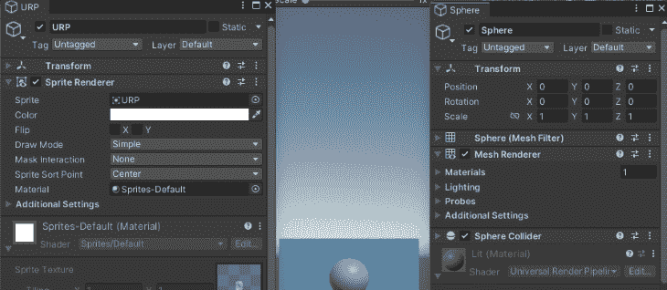

此图像展示了 Unity 中默认可用的一些不同类型的着色器。

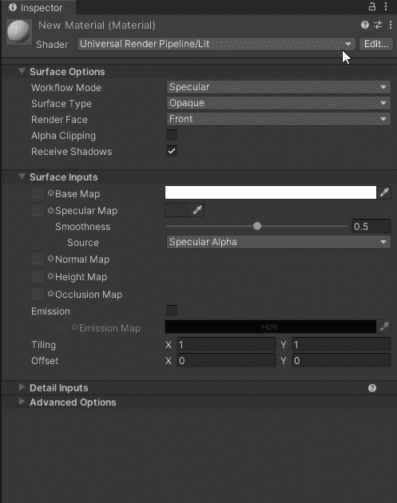

现在你可能会问自己，如果 Unity 已经提供了可以使用的着色器，我们为什么还要关心着色器呢？简单的答案是，默认提供的是平淡无奇的，没有添加任何特殊的使用，像水，全息，鬼，发光，或溶解效果，仅举几例。

我们可以通过改变设置来获得一些效果，如**表面类型** ( **不透明**或**透明**)，指定**金属**或**镜面**，**平滑度**，或添加**发射**。问题是它们都是静态的。我们想要的是一些动态效果或自定义设置，我们可以使用它们来为我们的游戏或应用程序的外观和感觉添加一些润色。

### 我们可以通过着色器获得不同的效果

让我们来看看一些不同的着色器效果。这些只是可能性的一小部分。图片来自“着色器图形统一效果”的互联网图片搜索:

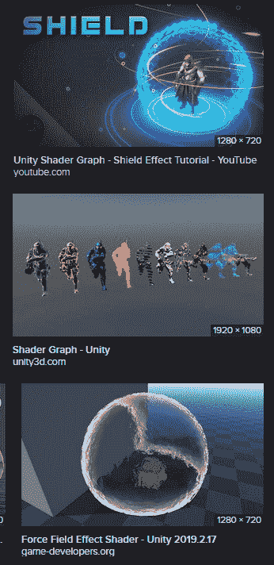

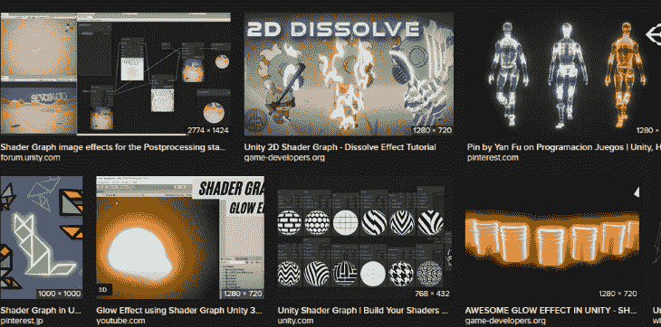

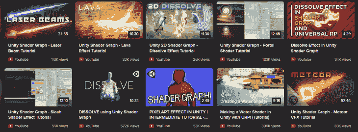

来自热门的 YouTube 节目频道:

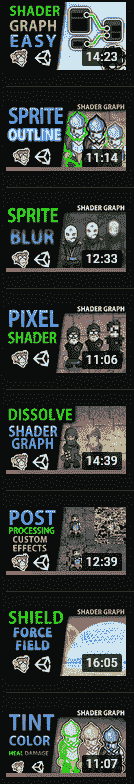

来自 [Unity 博客](https://blog.unity.com/technology/introducing-shader-graphs-new-master-stack):

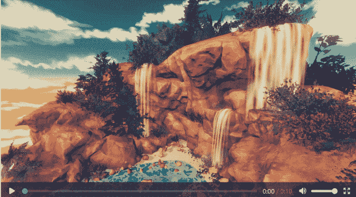

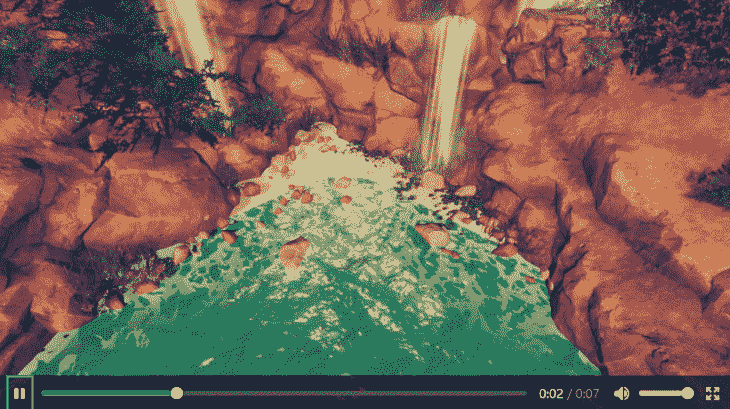

## 什么是着色器图形？

现在我们知道了什么是着色器，并且看到了我们可以从着色器中获得的一些不同的可能效果，让我们看看如何创建这些着色器。

着色器过去是通过代码创建的；多年来，不同的软件公司一直在添加允许通过基于可视节点的系统创建着色器的工具。统一没有什么不同；他们给了我们着色图。

请参考 [Unity 的着色器图形特性](https://unity.com/features/shader-graph)了解亮点:“着色器图形使您能够可视化地构建着色器。您不用编写代码，而是在一个图形框架中创建和连接节点。Shader Graph 提供反映您的更改的即时反馈，对于初次接触着色器创建的用户来说非常简单。”

着色器图形是为艺术家设计的，但不是着色器程序员的程序员也可以使用它来轻松创建着色器。嘿，不是所有的人都和 AAA 工作室合作，他们有预算雇佣一个专门的着色器程序员/艺术家团队。此外，着色器可能需要大量复杂的数学和算法知识来手工编码。

例如，在 Unity 中创建的新着色器的快照使用颜色纹理对模型进行基本照明。这是 1685 行代码中的第 1571 到 1580 行:

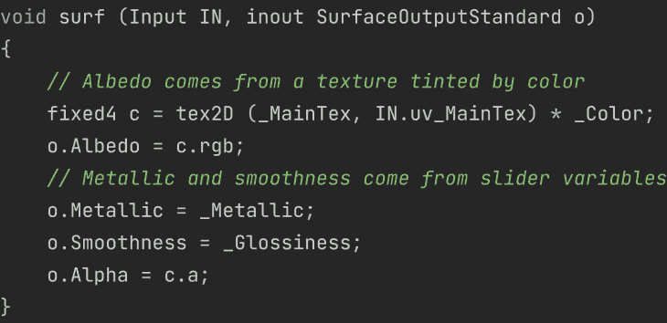

### 使用着色器图形需要什么？

Unity 注意到使用着色器图形的这些[要求:](https://docs.unity3d.com/Packages/com.unity.shadergraph@12.1/manual/Getting-Started.html)

> 将着色器图形与 Unity 2018.1 版及更高版本中提供的任一可脚本化渲染管道(SRP)一起使用:
> 
> 从 Unity 2021.2 版开始，你也可以使用带有[内置渲染管道](https://docs.unity3d.com/Documentation/Manual/built-in-render-pipeline.html)的着色器图形。

这意味着只要我们使用 SRP 之一，我们就可以开箱即用着色器图形。

尽管我们可以用软件包管理器安装它，并将其与内置的渲染管道一起使用， [Unity 继续声明，](https://docs.unity3d.com/Packages/com.unity.shadergraph@12.1/manual/Getting-Started.html)“建议将着色器图形与可脚本化的渲染管道一起使用。”

第一步是在 Unity Hub 中使用 URP 或 HDRP 模板创建一个新项目(或将一个 SRP 安装到现有项目中)。

使用 URP 或 HDRP 模板创建项目。

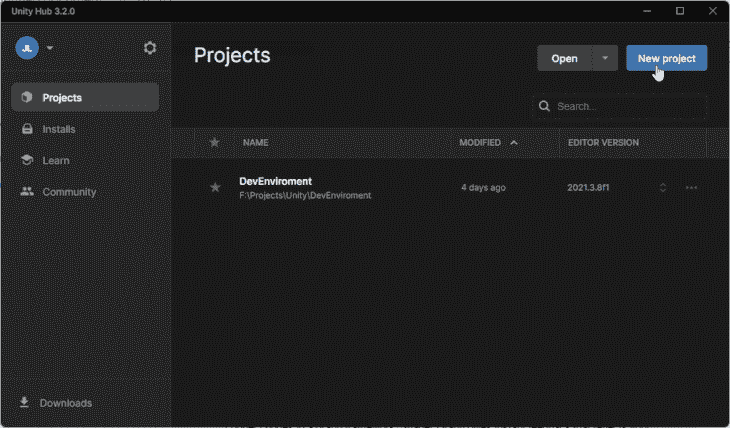

一旦场景加载，我添加一个胶囊到我的场景，我可以用它来显示我的效果(随意使用任何你想要的 3D 对象，包括你自己的模型)。我还创建了一个可以应用自定义着色器的材质，并将其添加到我的胶囊中。

## 使用着色器图形

现在我们有了一个非常基本的测试场景，让我们创建一个新的着色器图形。右键点击**创建** > **着色器图形** > SRP 你想要使用>类型的着色器。

在我的例子中，我将使用 **URP** > **点燃着色器图形**。

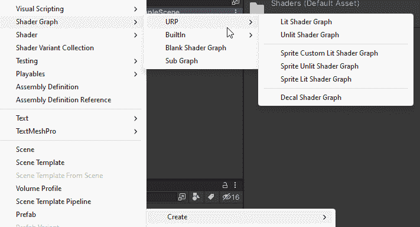

着色器图形菜单将始终包含**空白着色器图形**(一个完全空白的着色器图形，没有选择任何目标，也没有将任何块添加到主堆栈)和**子图形**(一个空白子图形资产，可以在其他图形中使用的可重用图形)选项。

每个包含模板堆栈的已安装渲染管道都应该有一个子菜单。就我而言，我有 URP 和内置子菜单。该模板创建一个新的着色器图形，该图形包含带有默认块和选定目标的主堆栈。您可以随时在以后更改着色器图形窗口中的设置。

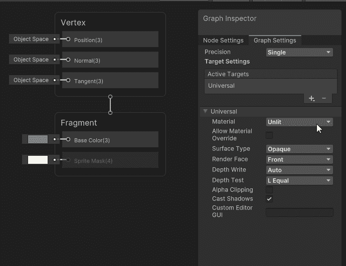

现在我们已经创建了一个着色器图形，让我们来设置我们用于这个着色器的材质。

有两种方法可以做到这一点:

1.  在**检查器窗口中**为材质(所有着色器图形都在着色器图形子菜单中)
    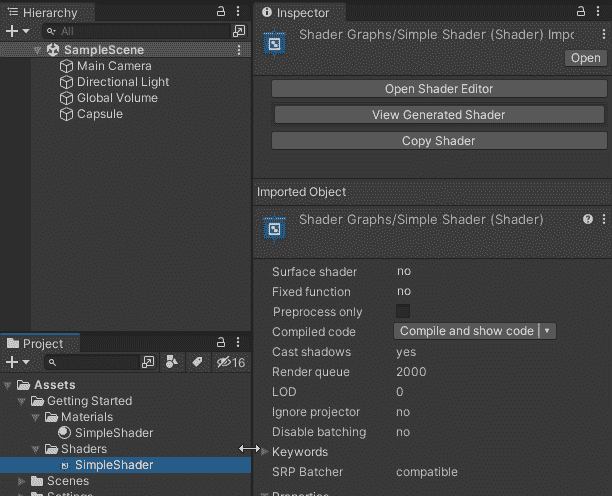
2.  将着色器拖放到材质
    上

### 基本着色器图形定义和术语

现在是停下来复习一些有用术语的好时机，其中一些我已经用过了；即主堆栈、块、目标。

*   空间—节点期望它们的输入或输出是什么
*   对象空间—对象顶点相对于对象中心/轴心点的位置
*   世界空间—对象顶点的位置相对于世界上的一个点。该位置相对于摄影机的位置(相对于摄影机的渲染)，不包括摄影机的旋转。在 HDRP，有一个额外的位置叫做绝对世界空间，它是世界中的一个点。在 URP，世界空间和绝对世界空间是相同的
*   相切空间-相对于顶点及其法线
*   视图/眼睛空间-相对于相机的前进方向，考虑相机的旋转
*   裁剪空间-相对于屏幕，一旦视图空间被投影

让我们深入探讨一些更复杂的术语。

#### 图表目标(目标)

这是着色器图形的渲染管道；您必须在项目中安装渲染管道，才能在列表中使用它。并非所有块都与所有目标兼容。

您可以有多个目标:这允许轻松创建着色器图形，可以在所有渲染管道中使用，而不必做重复的工作。这可以在 **[图中改变](https://docs.unity3d.com/Packages/com.unity.shadergraph@12.1/manual/Graph-Target.html)** 。

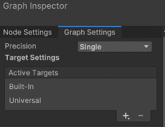

#### 属性和关键字

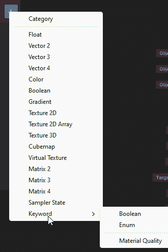

##### 性能

这些是我们可以用来在着色器编译后修改其值的变量。

有关属性的更多信息，请参见 [Unity 文档](https://docs.unity3d.com/Packages/com.unity.shadergraph@12.1/manual/Property-Types.html)。

所有属性都有以下设置。根据数据类型，其他设置也可用:

*   名称—为属性显示的名称；即，在着色器图形中
*   引用—着色器内部使用的名称。这必须以一个 **`_`** 开头。它被自动设置为**显示名称**；空格转换成`_`。你可以改变它。该名称用于通过 C#脚本使用`Material.Set`和`Material.Get`方法访问属性
*   精度—有关详细信息，请参见[精度模式|着色器图形| 12.1.7](https://docs.unity3d.com/Packages/com.unity.shadergraph@12.1/manual/Precision-Modes.html)
*   暴露——如果`true`，该属性将在**材料检查器**中暴露
*   覆盖属性声明—如果启用，覆盖属性声明允许着色器声明枚举
*   默认值—用作属性默认值的值。该值取决于属性的数据类型

##### 关键词

关键字用于为着色器图形创建不同的变体(着色器的行为因关键字的值而异)。

关键字是一个高级特性，超出了本文的范围。在写这篇文章的时候，材质是唯一一个不能改变设置的类型。

如果你想在业余时间寻找更多关于关键词的信息，Unity docs 是一个很好的起点。

##### 块节点

块节点是主堆栈的一部分，也是着色器节点的输出所连接的部分。不同的着色器阶段(**顶点**或**片段**)具有不同的块节点。

###### 顶点阶段

顶点的法线和切线位置。

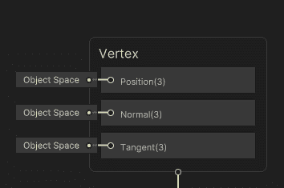

*   位置—顶点被着色器移动后的位置
*   法线-顶点指向的方向
*   相切(tangent )-通常垂直于顶点法线；如果更改顶点法线，建议更改此值

###### 碎片阶段

片段阶段在顶点阶段之后对像素进行操作。这是颜色和灯光。

哪些块可用取决于目标**添加材料**设置。

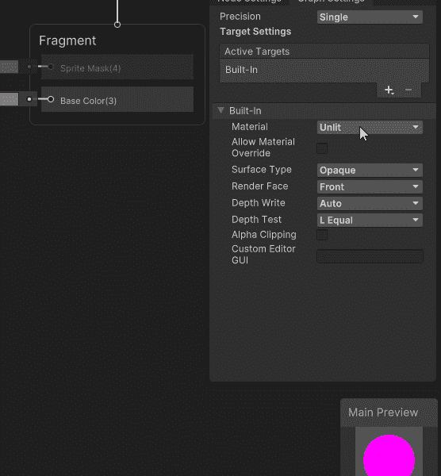

*   基色(反照率)—不受光照影响的对象颜色。这是矢量 3 颜色，意味着只有红色、蓝色和绿色值
*   正常-这用于 Unity 的内置照明计算
*   发射——对象发出的光
*   金属性-仅在使用金属性工作流时，获取对象金属性的 0–1 浮动值
*   镜面反射-仅当使用镜面反射工作流程时，使用颜色来影响镜面反射高光
*   平滑度-0–1 表示对象的平滑程度。**粗糙的** > **抛光的镜子**
*   环境光阻挡-0–1 像素被其他光线阻挡的程度。**未遮挡** > **完全遮挡**(灯光被人为减弱)
*   alpha-0–1 像素的透明度。在精灵中，这通常是精灵纹理中颜色的 alpha
*   Alpha 裁剪阈值—低于此阈值的像素会被剔除
*   精灵遮罩—文档中未定义。除了 Sprite 灯光类型之外，所有材质都是灰色的

##### 节点类别

着色器图形有超过 200 个不同的节点，可用于创建着色器；有关所有节点的详细信息，请参考 Unity 的节点库。

在**创建节点**菜单中，节点按类别组织:

*   艺术节点:颜色、颜色通道和纹理操作
*   通道:向量中每个分量的阶和值
*   输入:基本的基本类型，采样纹理，获取网格信息
*   数学:数学运算
*   程序性:像噪音一样的程序性操作
*   工具:工具节点，如预览、自定义着色器功能和逻辑
*   UV:变换用于采样纹理的 UV
*   块:主堆栈的节点；表示用于最终着色器输出的表面的一部分。 [Unity 文档](https://docs.unity3d.com/Packages/com.unity.shadergraph@12.1/manual/Built-In-Blocks.html)有更多信息

要访问**创建节点**菜单，您可以在着色器图形视图中右键单击并选择**创建节点**或按空格键。可以通过查看子菜单或在搜索栏中键入来找到节点。

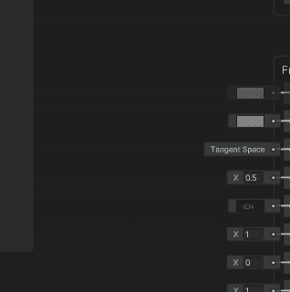

节点有输入端口和输出端口。不同的端口根据节点接受不同的数据类型。并非所有节点都有输入端口。例如，块节点没有输出端口。

Unity 试图让着色器图形非常用户友好——这也有助于调试你的效果。他们试图让你尽可能多地看到一个效果的结果。您不必等到最后的输出被连接，就可以看到事情是如何变化的。

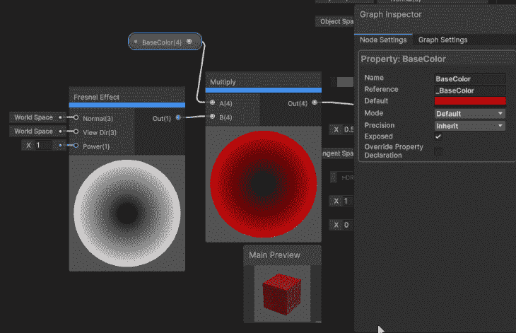

## 着色器图形窗口的七个组件

着色器图形有七个主要组件。让我们复习一下，这样你就可以熟悉这些窗口了。

### 主窗口

这是着色器图形窗口本身。它包含(按视图优先级顺序列出)工具栏、黑板、图形检查器、主预览、主堆栈和节点。

您可以使用滚轮放大和缩小，使用鼠标中键平移，使用鼠标左键拖动选择和移动项目。要打开这个窗口，我们所要做的就是双击项目视图中的**着色器图形资产**。

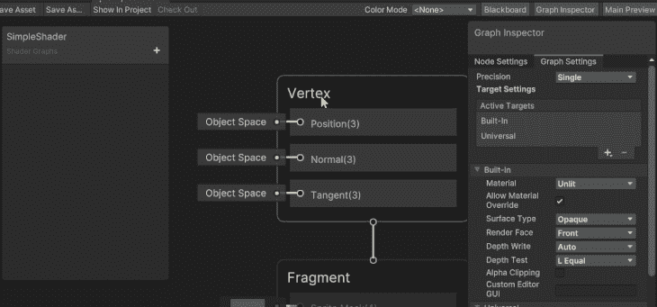

### 黑板

这是我们可以添加属性和关键字的地方。黑板可以移动到主视图中的任何地方，并且以一种我们永远不会丢失它的方式设置。它可以打开和关闭。

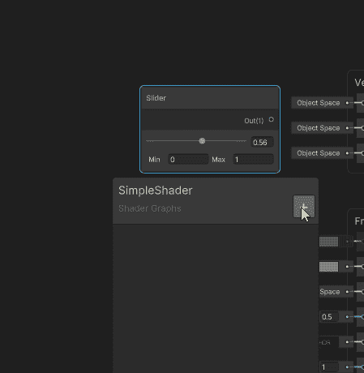

### 主预览

这是着色器最终输出的预览。主预览可以在主视图中的任何地方移动，并以我们永远不会失去它的方式设置。它可以打开和关闭。您可以选择一个内置网格来使用或使用自定义网格(项目中的任何网格对象)。

### 节点

图中的节点。该窗口可以在主视图中的任何位置移动、放大和缩小、添加和删除。

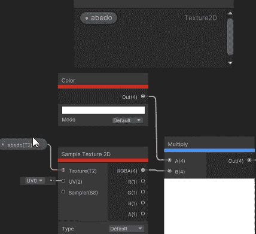

### 主堆栈

这个节点和所有其他节点的区别在于我们不能添加或删除它。它将始终显示在所有其他节点的上方。

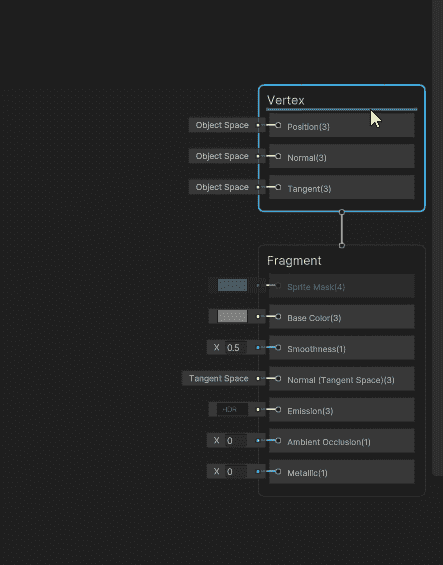

### 图表检查器

**图形检查器**包含**图形设置**和**节点设置**选项卡。**节点设置**选项卡根据我们选择的节点/块/参数/关键字而变化。

这个窗口可以被移动到主视图中的任何地方，并且以一种我们永远不会丢失它的方式被设置。它可以打开和关闭。

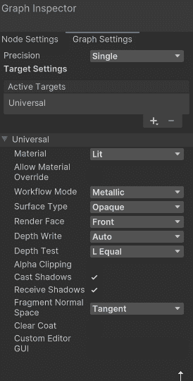

### 工具栏

永久在窗口顶部，工具栏包含左边的**文件**按钮和**颜色模式**选择。

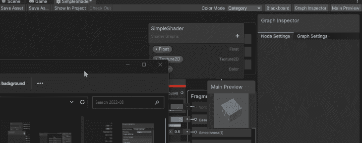

## 有用的内置着色器图形功能

着色器图形充满了有用的功能。这些是少数你会经常使用的；让我们看看如何利用它们。

### 访问文档

一个有用的特性是能够直接从一个节点访问文档。选中节点后，按键盘上的 **F1** 。

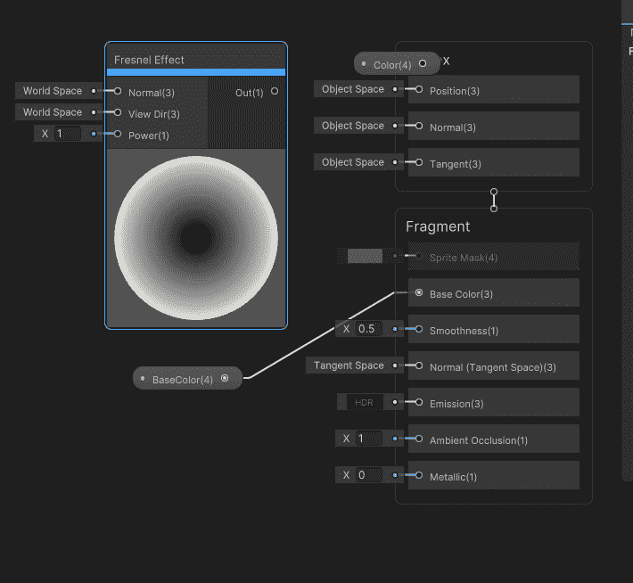

请注意，即使窗口中的其他一些选项也有相同的选项，但它并不总是连接。如果遇到这个问题，删除地址栏中 **/manual/** 后的内容，在**过滤内容**中，寻找其中一个关键词。

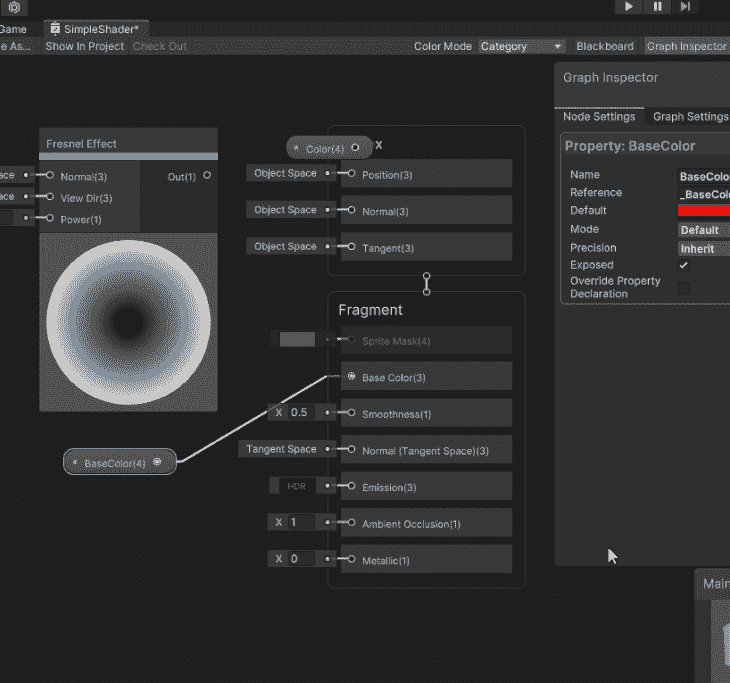

### 智能连接

不允许在不兼容的类型之间建立节点之间的连接。当您尝试建立连接时，它将打开 **Create Node** 窗口，该窗口显示所有节点，这些节点具有您正在用作输出的类型的输入和您正在尝试用于输入的类型的输出。

例如，我有一个**纹理资产**，我想用于**基色**块。 **Texture2D 资产**具有输出 Texture2D，但是**基色**采用 Vector3 的输入。当我试图将 **Texture2D Asset** 的输出连接到 **Base Color** 块的输入时，我得到了一个 **Create Node** 菜单，其中包含所有具有 Texture2D 输入和与 Vector3 兼容的输出的节点。

当我选择**输入** > **纹理** > **样本纹理 2D** 时，我得到一个新的样本纹理 2D 节点，该节点与纹理 2D 资产节点相连接。现在我需要做的就是选择我想要使用的示例 Texture2D 的输出(我将使用 RPGA，它是一个 Vector4)。

**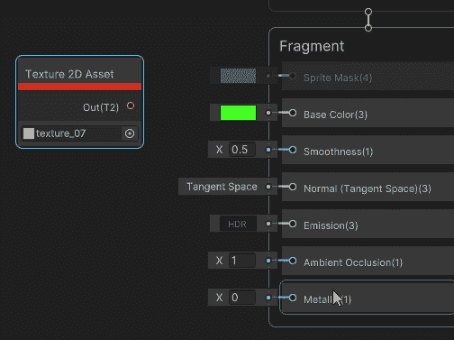**

### 分组

通过单击并拖动鼠标来选择一个组，可以将节点组合在一起。

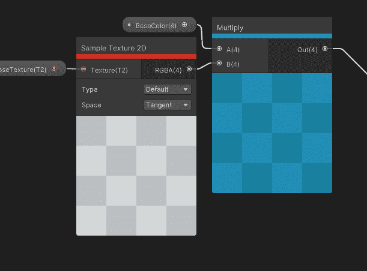

### 便笺条

可用于添加细节、待办事项、注释等的注释。

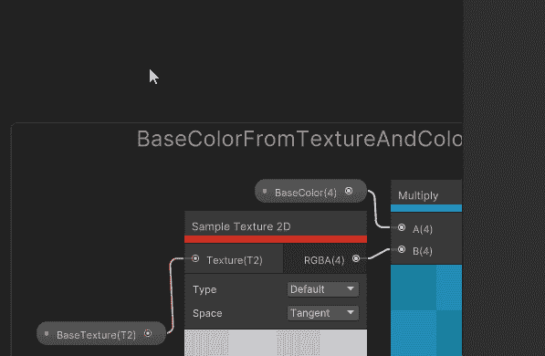

### 子图

取一组执行特定功能的节点，并将它们转换为子图。这些子图可以像任何其他节点一样在其他图中重用。发现自己在多个着色器中反复重复相同的步骤？把它变成子图。

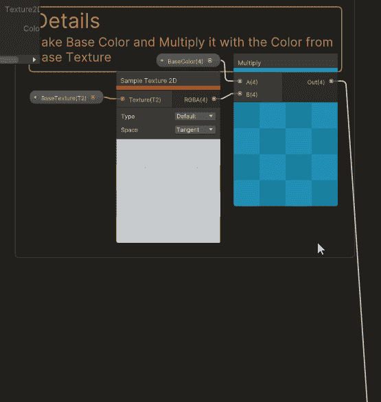

注意它是如何将属性留在主图中的。双击子图，在新的子图窗口中打开它。属性被复制了，但是默认值又变回了 Unity 默认值。

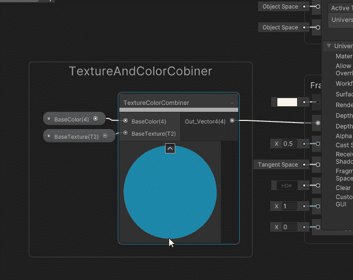

### 多重着色器图形

您可以一次打开多个整形器图形。每个着色器图形或子图形将在其自己的着色器图形窗口中打开。这些窗口可以像 Unity 中的其他窗口一样移动。您甚至可以将节点从一个着色器图形复制到另一个着色器图形。

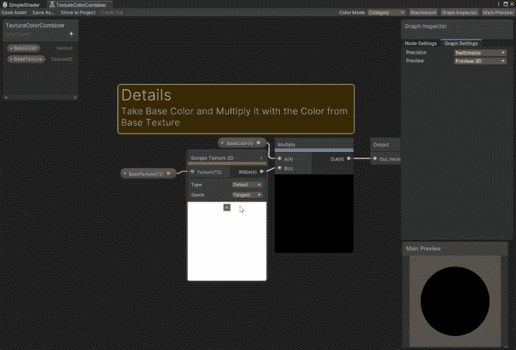

### 查看节点的代码

除了节点的节点库文档，您还可以为每个节点生成代码，并选择**显示生成的代码**。这将在代码编辑器中打开该节点的代码。

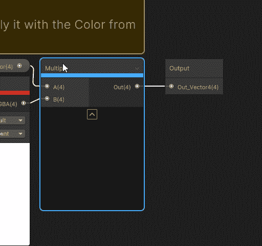

也可以通过在“项目”视图中选择整个着色器并选择其中一个“查看/显示代码”按钮来查看其代码。

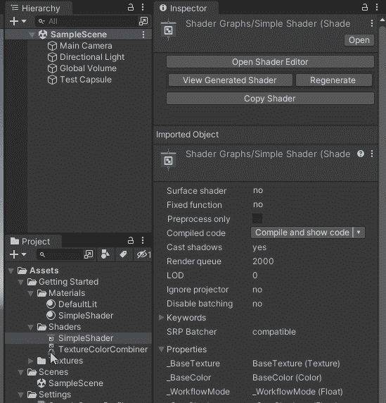

## 创建您的第一个着色器

现在我们有了创建一个简单着色器所需的一切。让我们制作一个可以在内置和 URP 中使用的光照着色器，它的颜色可以在检查器中设置。如果你想，包括 HDRP 只是确保你有 HDRP 添加到您的项目。

### 项目设置

首先，创建一个着色器图形资源，并在着色器图形窗口中打开它。我已经创建了一个光照着色器图形，所以我只需双击它打开它。如果你还没有创建一个，右键点击**创建** > **着色器图形** > SRP 你想要使用>类型的着色器。

在我的例子中，我将使用 **URP** > **点燃着色器图形**。

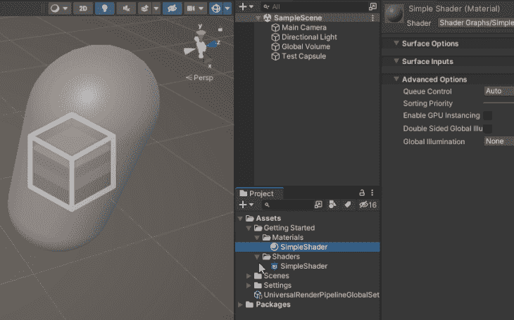

在**图形设置中，**确保着色器图形列出了所有目标。在我的例子中，我使用**内置**和**通用**(随意使用一个，例如**通用**)。然后确保它们每个都设置为**亮**。

接下来，创建一个新节点。我希望能够改变颜色，所以我需要一个颜色节点。

### 连接节点并设置输出

现在，颜色节点需要连接到主堆栈。为此，我单击了颜色节点的输出，并将其拖动到基色的输入。请注意，连接更新了主预览。

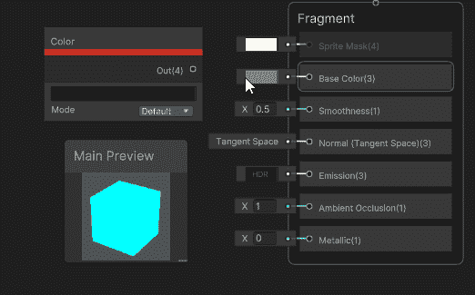

接下来，我将颜色节点的输出颜色改为蓝色。请注意，这在主预览中也被更新了。

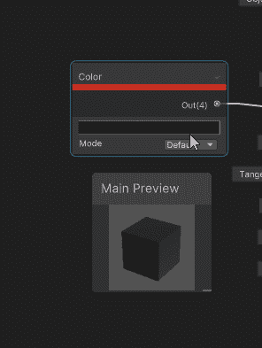

请注意，我可以一步完成节点的创建并将其连接到基色块。为此，单击基色块的输出，并拖动到着色器图形主窗口中的空白区域。

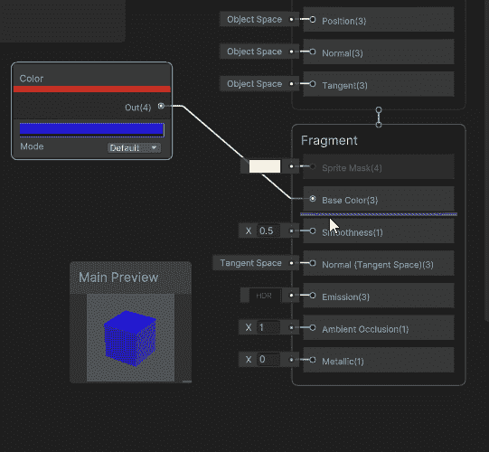

### 保存图表

为了在我的场景中使用，我必须确保保存图形。

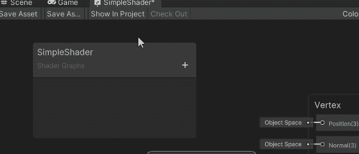

当然，如果它没有出现在场景中的我的对象上，那么第一步是确保游戏对象的渲染组件使用的是使用着色器的材质。

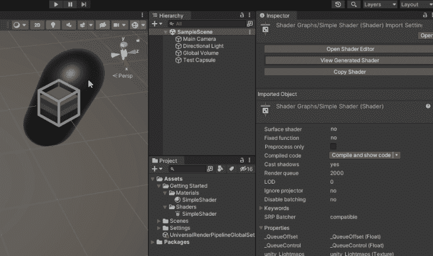

### 将颜色转换为属性

最后一个要求是在检查器中设置颜色。为此，我需要一个属性。

我可以在黑板上创建一个属性，并添加一个新的颜色属性。

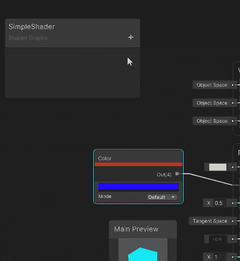

然后拖放它或者使用**创建节点**菜单并在**属性**子菜单中选择它。

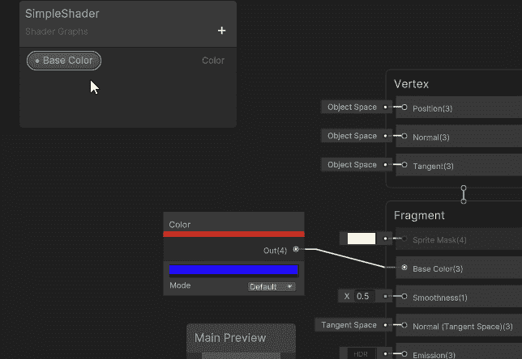

我还可以简化这一步，将图形中已经存在的颜色节点转换为属性。

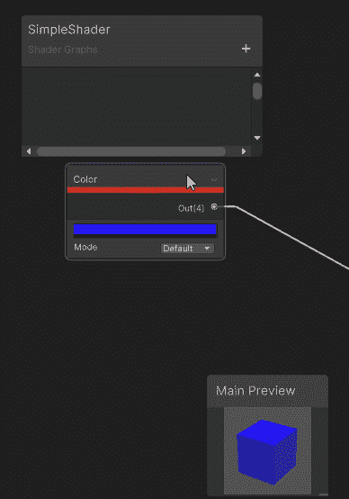

最需要注意的是属性的**节点设置**。为了让它在检查器中曝光，我们需要确保设置了**曝光**设置。我们需要注意的另一个设置是**参考**设置；这是在 C#脚本中使用的名称。

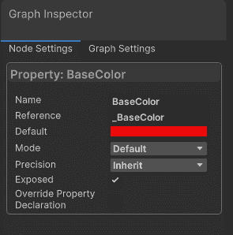

不要忘记保存资产。

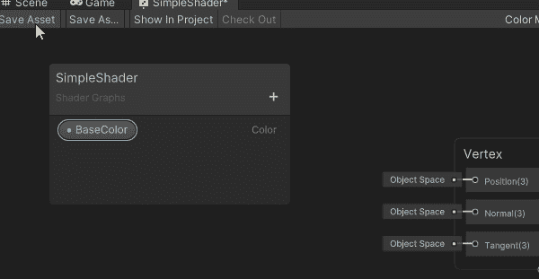

### 着色器已完成

现在我们可以在材质的**检查器**中改变颜色。

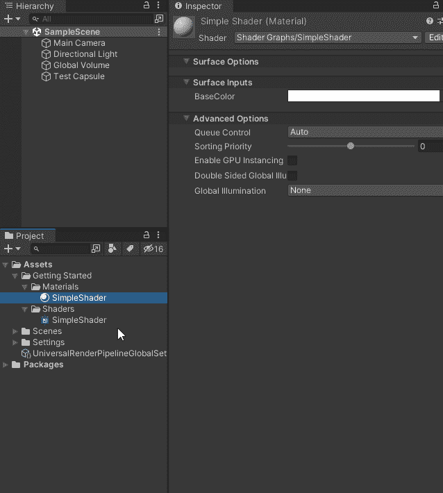

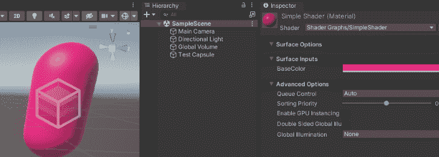

这是一个非常简单的着色器，所以让我们来看看代码的并排比较。

使用着色器图形肯定更容易和更快。从技术上讲，我有两个着色器，因为它在两个不同的渲染管道上工作。

## 如何使用一些流行的节点(有例子)

在本节中，我将尝试展示着色器的一些常见用途以及用于制作着色器的节点。我将在每个示例中显示不同的节点，但我无法遍历所有 200 多个可用的节点。

如果你想知道我没有在这里展示的另一个节点做什么，我建议查看文档，将它添加到你的着色器图形中，看看它是如何工作的。请记住:大多数节点都有自己的预览，所以您不必将其连接到任何东西来查看其效果。

这些节点中的大多数都是可重用的，可以连接在一起，所以我将它们转换为子图形，并且可以将效果添加到任何其他着色器图形中。每个示例都将使用属性节点(可能不止一个)。属性节点与其基本类型节点的工作方式相同，不同之处在于可以从 C#脚本和材质的检查器中轻松访问属性节点。

### 纹理和颜色效果

你想要实现的最基本的事情之一就是拥有一个与你的模型相关联的纹理，并把它渲染成一种颜色。通常，基础纹理与颜色相结合，然后应用于最终输出。纹理和颜色通常都可以在**检查器**中设置。

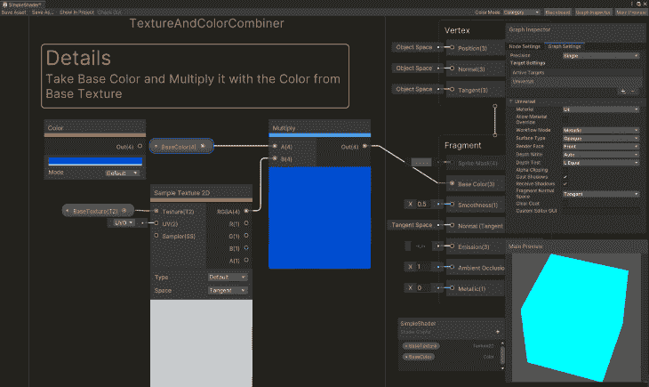

#### 你将学习颜色和纹理效果的新节点

##### 颜色节点

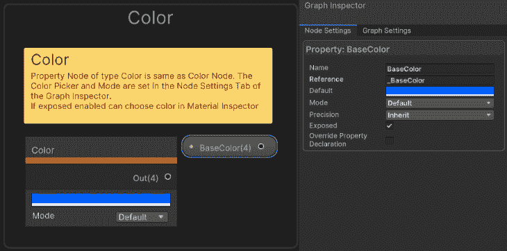

Color 输出代表 RPGA 值的 Vector4。**模式**为**默认**或 **HDR** 。

##### 纹理 2D 资源节点

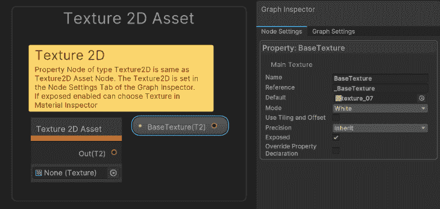

允许您从项目资源中选择一个 Texture2D。与示例 Texture2D [LOD]节点类型结合使用。允许 Texture2D 加载一次并多次采样。

Texture2D 属性提供了 Texture2D 资源模式中不可用的两个附加设置:

如果没有设置纹理，那么它输出一个空白纹理。

您可以选择白色、黑色、灰色、法线贴图、线性灰色或红色。

要使用平铺和偏移，请设置为 **false** 以便单独操作缩放和偏移，从其他纹理属性中使用，如在[分割纹理变换节点|着色器图形| 12.1.7](https://docs.unity3d.com/Packages/com.unity.shadergraph@12.1/manual/Split-Texture-Transform-Node.html) 中。

##### 示例 Texture2D 节点

示例 Texture2D 采用 Texture2D 并返回 Vector4 颜色(RGBA)。这只能在片段着色器阶段使用。对于顶点着色器阶段，请使用示例纹理 2D LOD 节点。

设置**节点设置** > **使用全局 mip 偏差**启用运行时施加的自动全局 Mip 偏差(在某些算法期间设置以改善细节重建)。

**节点设置** > **预览** : **继承**，**预览 2D** ，**预览 3D** 为预览区域的类型。

纹理类型为**类型** : **默认**或**法线**，法线的空间可以是**切线**或**物体**。(类型必须=正常)。

这些是 Texture2D 的输入示例:

*   **纹理**:纹理 2D 到样品
*   **UV** : (UV) Vector2 表示 UV 坐标。u[0–3]或提供您自己的
*   **采样器**:(默认采样器状态)要使用的采样器。有关更多详细信息，请参见[采样器状态节点|着色器图形| 12.1.7](https://docs.unity3d.com/Packages/com.unity.shadergraph@12.1/manual/Sampler-State-Node.html)

及其输出:

*   **RGBA** :矢量 4 色
*   **R**:RGBA 浮红(x)
*   **B**:RGBA 飘蓝(x)
*   **G**:RGBA 飘绿(x)
*   **A**:RGBA 的浮点 alpha (x)

预览是 **(RBGA)** 中输出内容的可视化表示。

##### 示例纹理 2D LOD 节点

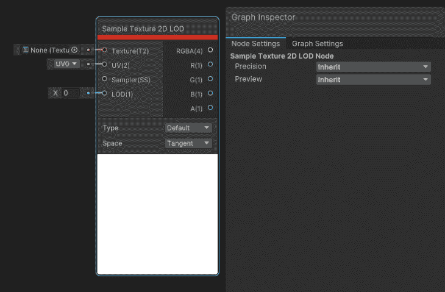

示例 Texture2D LOD 采用 Texture2D 并返回 Vector4 颜色(RGBA)。这只对顶点着色器阶段有用。一些平台(不支持)可能会返回不透明的黑色。

需要记住的一些设置:

*   **节点设置** > **使用全局 mip 偏差**:启用运行时施加的自动全局 Mip 偏差(在某些算法期间设置，以改善细节重建)
*   **节点设置** > **预览** : **继承**、**预览 2D** 、**预览 3D** —预览区域的类型
*   **类型** : **默认**，**正常** —纹理类型
*   **空间** : **切线**，**物体** —法线的空间(类型必须=法线)

样本纹理 2D 细节层次的输入:

*   **纹理**:纹理 2D 到样品
*   **UV** : (UV) Vector2 表示 UV 坐标。u[0–3]或提供您自己的
*   **采样器**:(默认采样器状态)要使用的采样器。有关更多详细信息，请参见[采样器状态节点|着色器图形| 12.1.7](https://docs.unity3d.com/Packages/com.unity.shadergraph@12.1/manual/Sampler-State-Node.html)
*   **LOD** :采样的详细程度

样本纹理 2D LOD 输出:

1.  **RGBA** :矢量 4 色
2.  **R**:RGBA 浮红(x)
3.  **B**:RGBA 飘蓝(x)
4.  **G**:RGBA 飘绿(x)
5.  **A**:RGBA 的浮点 alpha (x)

##### 乘法节点

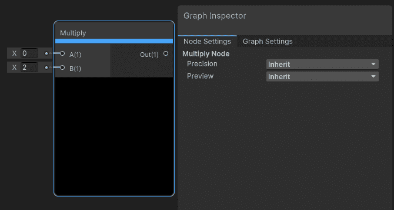

顾名思义，乘法节点将输入 A 乘以输入 b。

*   **节点设置** > **预览** : **继承**、**预览 2D** 、**预览 3D** —预览区域的类型

乘法输入:

*   **A** :向量或矩阵
*   **B** :向量或矩阵

乘法输出:

*   **向量**或**矩阵**(取决于输入 A 和 B 的类型)

### 边缘灯光效果

为此，我们将建立一个边缘灯，它的颜色和能量暴露在检查器中。

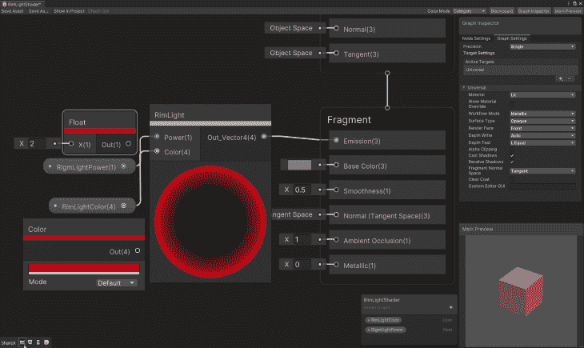

#### 你将为边缘灯光效果学习的新节点

##### 菲涅耳效应

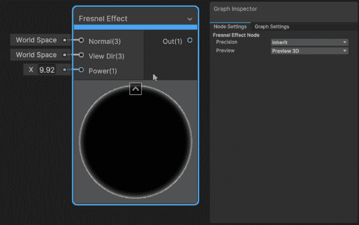

该节点通过计算曲面法线和视图方向之间的角度来近似菲涅耳效果。这通常用于实现边缘照明，常见于许多艺术风格。

*   **节点设置** > **预览** : **继承**、**预览 2D** 、**预览 3D** —预览区域的类型

输入:

*   **法线**:向量 3——用于法线的空间
*   **视图方向**:矢量 3——要使用的视图方向
*   **幂**:幂计算的指数

产出:

*   **浮动**，代表菲涅尔效应

### 溶解效果

这是一个一直在使用的非常酷的效果。一些例子是把一个游戏对象带入/带出一个场景，破坏着火的东西，或者在一个角色编辑器中改变角色(你去掉旧角色，加入一个新角色)。

你可以在减少**溶解量**的同时增加**溶解比例**，你会得到一个有趣的效果。

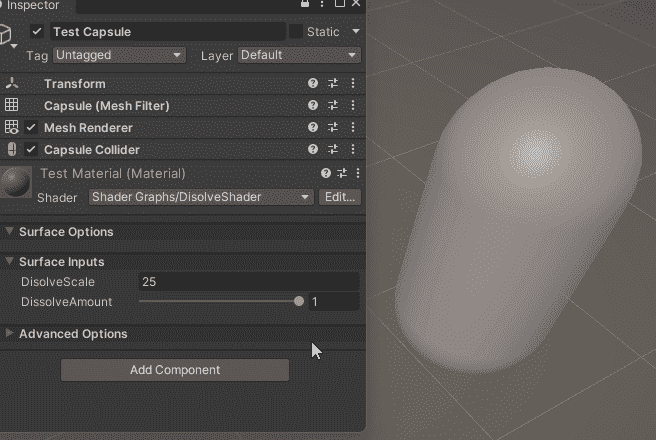

务必在**图形设置**中启用 **Alpha 削波**，并将 **Alpha 块**设置为 **0.5** 。

如果要渲染模型内部，将**渲染面**设置为**两面**，否则设置为**正面**。

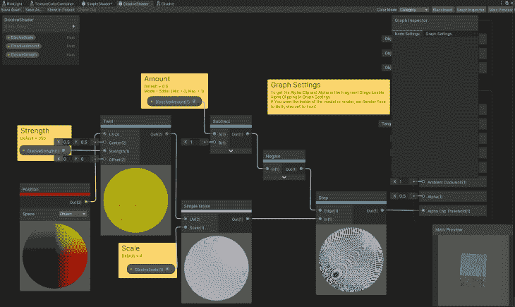

#### 您将通过“溶解”效果了解到的新节点

##### 简单噪声节点

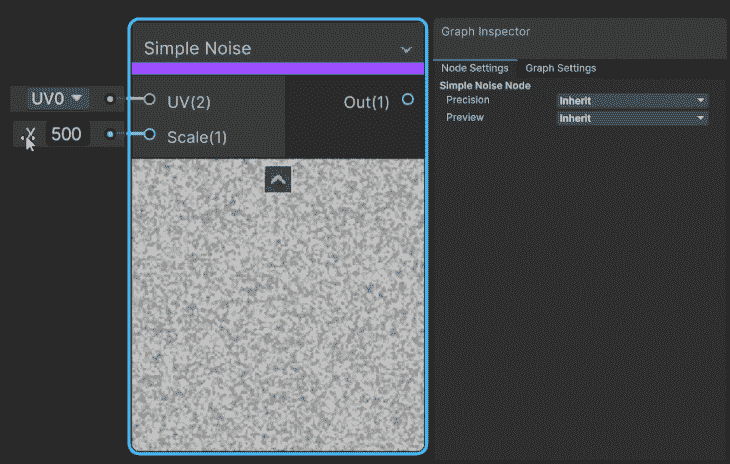

简单噪波基于由缩放输入缩放的 UV 输入生成一个值节点。根据您想要的噪波类型，可以使用几个其他噪波节点(例如，[渐变噪波节点](https://docs.unity3d.com/Packages/com.unity.shadergraph@12.1/manual/Gradient-Noise-Node.html)生成柏林噪波，而 [Voronoi 节点](https://docs.unity3d.com/Packages/com.unity.shadergraph@12.1/manual/Voronoi-Node.html)生成沃利噪波)。

输入:

*   **UV** : (UV)矢量 2 UV 值
*   **Scale** :浮动量，缩放输入 UV

产出:

*   **浮动**，代表噪音

##### 步进节点

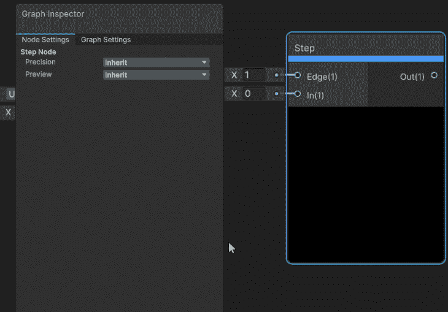

如果输入值大于或等于输入**边沿**的值，Step 返回 1(真，白色)或 0(假，黑色)。

*   **节点设置** > **预览** : **继承**、**预览 2D** 、**预览 3D** —预览区域的类型

步进节点输入:

*   **Edge** :表示步长值的动态向量
*   中的**:表示输入值的动态向量**

步进节点输出:

*   如果输入值(中的**)大于或等于步长值(**边沿**)，则动态矢量(0 或 1)**

##### 位置节点

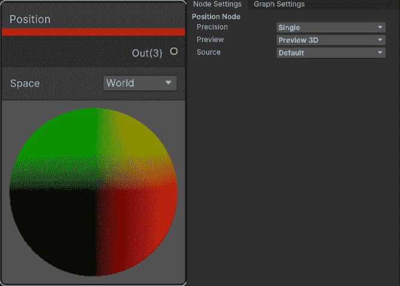

位置节点提供对网格顶点位置的访问；该位置相对于选定的空间。

*   **节点设置** > **预览** : **继承**、**预览 2D** 、**预览 3D** —预览区域的类型
*   **空格**:这是坐标的空格。可以是**对象**、**视图**、**世界**、**切线**，也可以是**绝对世界**

例如，当“位置”节点连接到“融合”着色器中简单噪波节点的 UV 输入时，会发生以下情况。

这是如果**空间** = **世界**的结果:

而这是如果**空间** = **视野**的结果:

##### 旋转节点

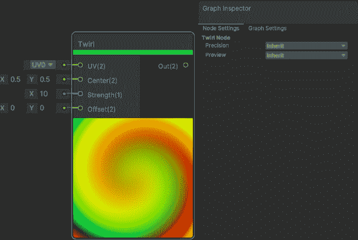

Twirl 节点对输入 **UV** 的值应用类似黑洞的扭曲效果。

**节点设置** > **预览** : **继承**、**预览 2D** 、**预览 3D** —预览区域的类型

输入:

*   **UV** : (UV) Vector2，输入 UV 值
*   **中心**:矢量 2，中心的参考点
*   **强度**:浮动，效果有多强
*   **偏移**:输入的 UV 值

产出:

*   向量 2，新的 UV 值

预览:输出内容的可视化表示。

##### 棋盘节点

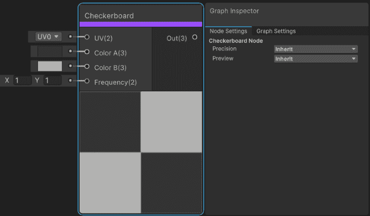

这将生成一个带有所提供颜色的棋盘；标度由**频率**定义。该节点用于将棋盘纹理应用于网格，也可用于在着色器图形中直观显示将 UV 更改某个值的效果。

*   **节点设置** > **预览** : **继承**、**预览 2D** 、**预览 3D** —预览区域的类型

输入:

*   **UV** : (UV) Vector2，UV 值
*   **颜色 A** :矢量 3，第一个格子的颜色
*   **颜色 B** :矢量 3，第二个格子的颜色
*   **频率**:每个 UV 轴的刻度

产出:

*   **Out** :矢量 2，UV 值

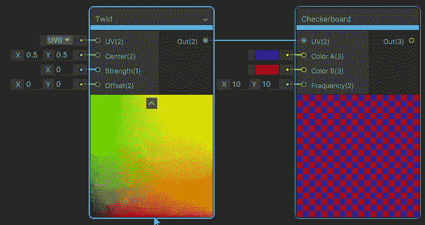

##### 减去节点

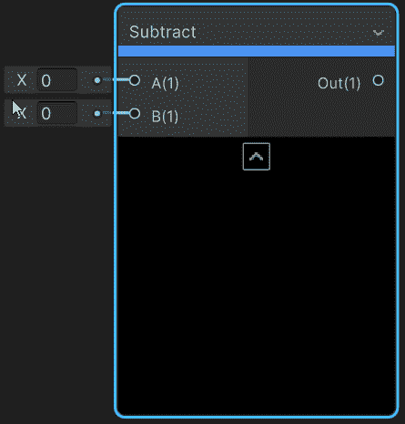

该节点从输入 A 中减去输入 B

*   **节点设置** > **预览** : **继承**、**预览 2D** 、**预览 3D** —预览区域的类型

输入:

*   **A** :动态向量，第一个输入值
*   **B** :动态向量，第二输入值

产出:

*   **Out** :动态向量，结果

预览:

*   黑色结果<=0 to white result > = 1

##### 求反节点

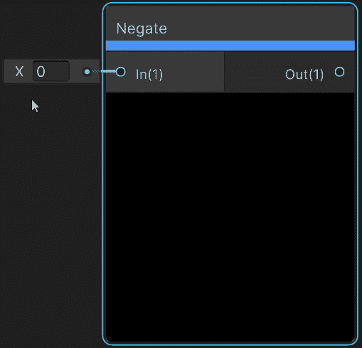

取反翻转中**的符号值。正值现在是负值，负值现在是正值。**

*   **节点设置** > **预览** : **继承**、**预览 2D** 、**预览 3D** —预览区域的类型

输入:

*   中的**:动态向量，要翻转的值**

产出:

*   **Out** :动态向量，翻转符号的结果

预览:

*   黑色结果<=0 to white result > = 1

### 使用发射效果溶解

再添加一个节点，我们就可以让溶解效果发光了。

为了帮助保持整洁和易读，我做了一个溶解效果的子图。我输出了步骤节点(这是我们附加到 Alpha 阈值上的)和发射(我们将需要它用于发射块)。

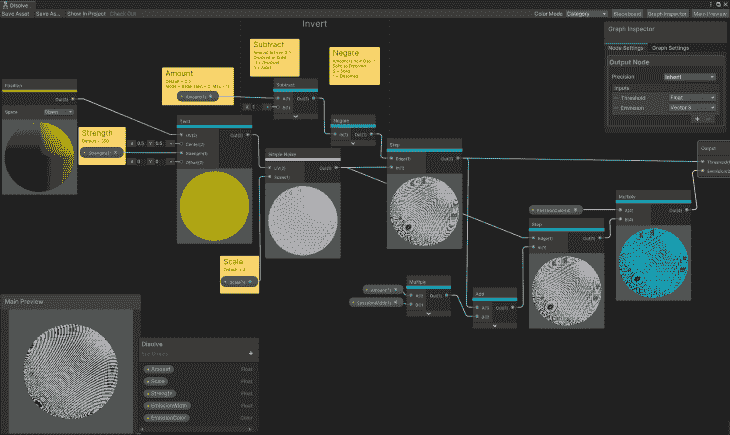

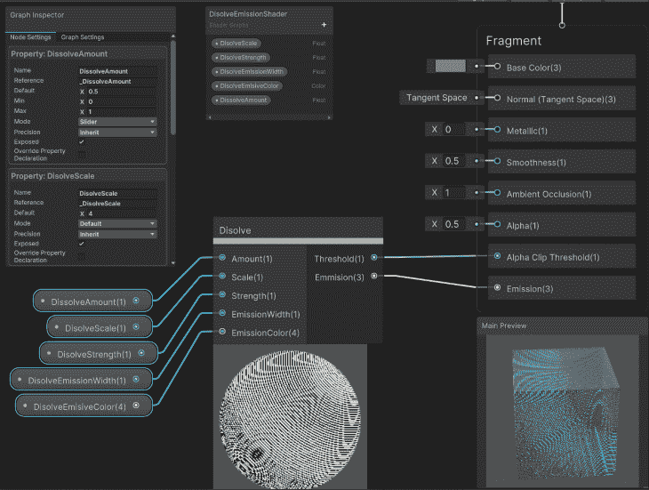

#### 使用发射节点溶解

##### 添加节点

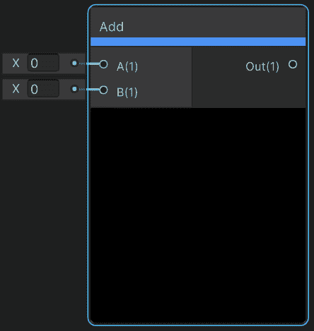

将两个输入相加。

*   **节点设置** > **预览** : **继承**、**预览 2D** 、**预览 3D** —预览区域的类型

输入:

*   **A** :动态向量，第一个输入值
*   **B** :动态向量，第二输入值

产出:

*   **Out** :动态向量，结果

预览:

*   黑色结果<=0 to white result > = 1

##### 子图

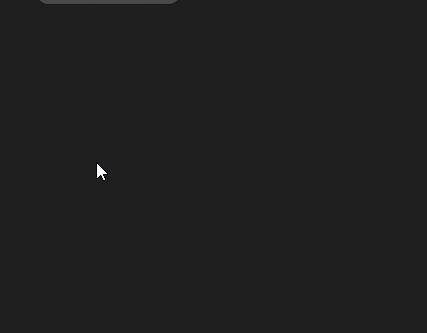

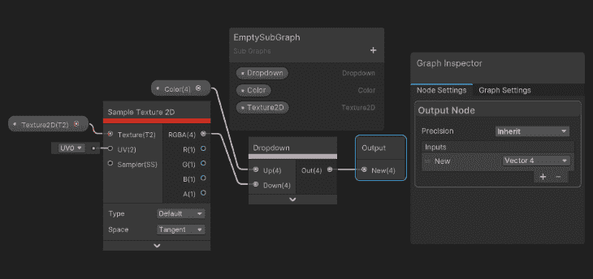

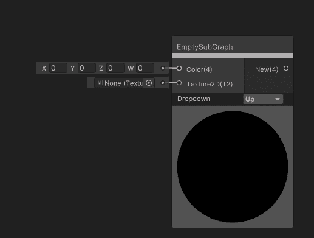

这允许您添加任何自定义创建的子图。

*   **节点设置** > **预览** : **继承**、**预览 2D** 、**预览 3D** —预览区域的类型

您可以包含黑板上定义的任何下拉属性。更多信息，参见文档中的[子图下拉列表。](https://docs.unity3d.com/Packages/com.unity.shadergraph@12.1/manual/Sub-Graph-Dropdown-Node.html#create-node-menu-category)

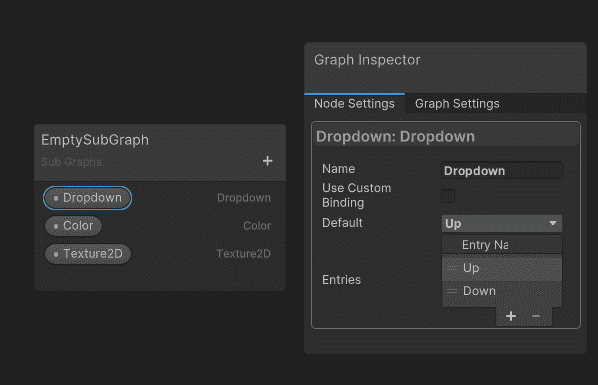

输入:

*   你在黑板上定义的属性。
    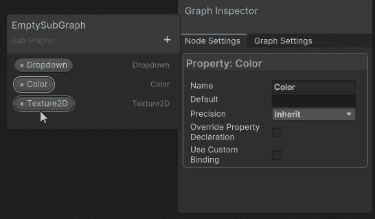

产出:

*   您在子图形输出节点中定义的内容。必须至少有一个输出
    

### 将它们结合在一起

现在是时候将所有这些合并到一个着色器图形中了。

以下是之前每个效果的子图:

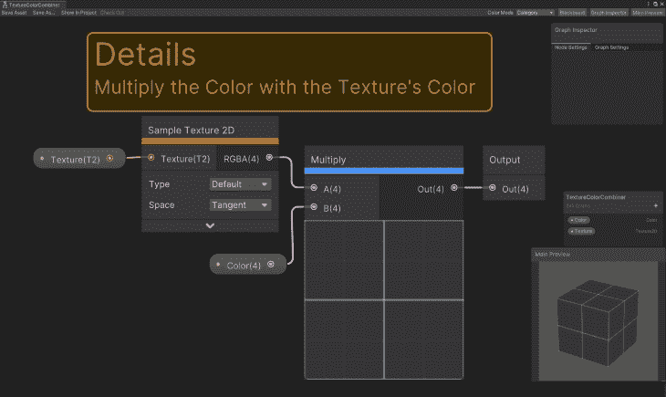

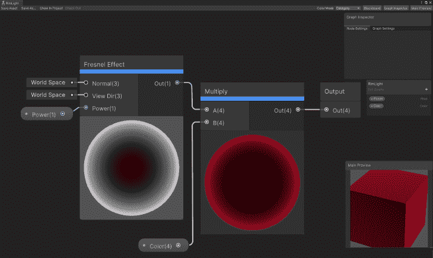

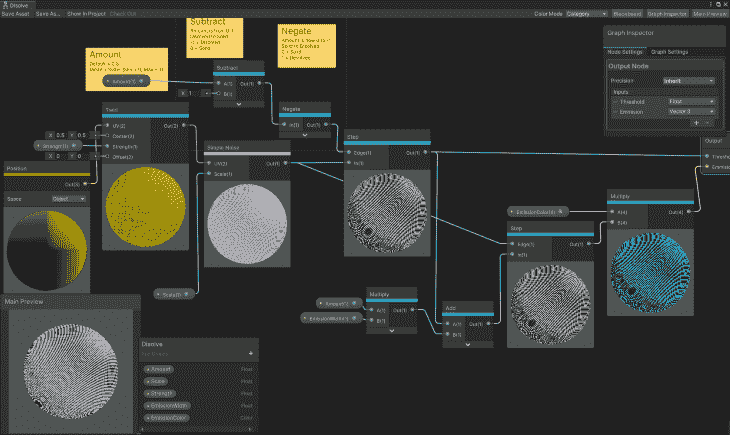

和着色器图形，一起使用它们:

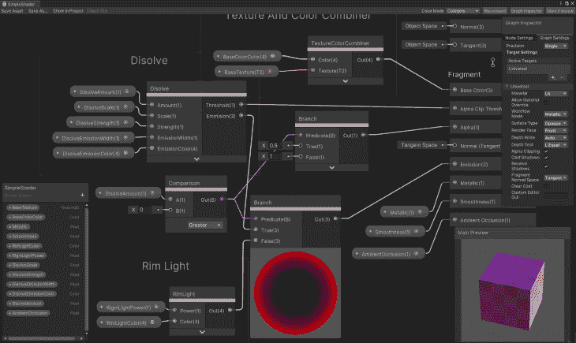

#### 将所有这些结合在一起的节点

##### 比较节点

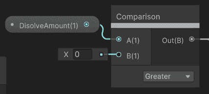

该节点将两个值与一个条件进行比较。这是许多可用的逻辑测试节点之一；其他是所有，和，任何，是前面，是无限，是 NaN Nand，Not，and Or。

*   **节点设置** > **预览** : **继承**、**预览 2D** 、**预览 3D** —预览区域的类型
*   下拉菜单:等于、不等于、小于、小于等于、大于等于、大于等于-用于比较的条件

输入:

*   **A** :浮点比较
*   **B** :浮点比较

产出:

**Out** :布尔比较结果

预览是输出内容的可视化表示。

##### 分支节点

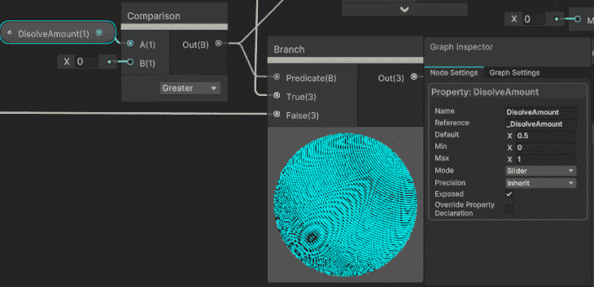

分支节点根据真/假条件返回值。另一个分支节点是 BranchOnInputConnection。

*   **节点设置** > **预览** : **继承**、**预览 2D** 、**预览 3D** —预览区域的类型

输入:

*   **谓词**:布尔型，决定使用哪个输入
*   **True** :动态向量，谓词为真时使用的值
*   **False** :动态向量，谓词为假时使用的值

产出:

*   **Out** :真或假输入

预览是输出内容的可视化表示。

## 新旧着色器图形版本之间的差异

在比 10.0.x 版本更早的着色器图形版本中，有一些事情需要注意，无论您是从旧版本升级，还是遇到某人如何创建着色器并想要复制它。

最大的区别是使用主栈而不是主节点。主堆栈中可用的块取决于图形设置。使用多个主节点需要特别注意。如果您正在升级，请参见 [Unity 的升级指南](https://docs.unity3d.com/Packages/com.unity.shadergraph@12.1/manual/Upgrade-Guide-10-0-x.html)。

两者之间的另一个重大区别是:所有的设置现在都可以在图形检查器中找到。**图形设置**选项卡包含所有图形范围的设置，而**节点设置**选项卡包含所有属性设置和每个节点的设置。

**图设置**有一些小改动，像**两边**不是复选框，你用的是**渲染面**枚举(**前**、**后**、**两边**)。

最后一个区别是片段堆栈的色块的输入。这个小技巧其实来自[码猴的视频](https://www.youtube.com/watch?v=azGMuP9ks8U&list=PLzDRvYVwl53tpvp6CP6e-Mrl6dmxs9uhx&index=1)。

片段堆栈将包含一个颜色块，它采用 Vector4 值，即 RPGA。新创建的着色器图形将有一个采用 Vector3 值的颜色块，这只是 RPG 颜色，并且它有一个单独的 alpha 块。

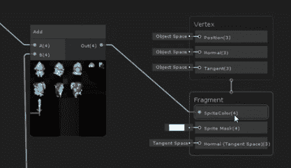

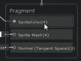

要获得 alpha，只需添加一个 Split 节点，并将 alpha 输出作为 Alpha 块输入。他指出，特别是对于精灵，通常在处理着色器时，如果您使用颜色的 alpha，您需要明确 alpha 值代表什么。而对于精灵，期望颜色的 alpha 控制透明度。

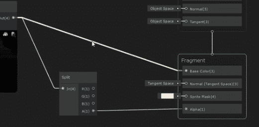

## 额外资源

如果你想继续学习，Unity 还有更多资源:

## 使用 [LogRocket](https://lp.logrocket.com/blg/signup) 消除传统错误报告的干扰

[LogRocket](https://lp.logrocket.com/blg/signup) 是一个数字体验分析解决方案，它可以保护您免受数百个假阳性错误警报的影响，只针对几个真正重要的项目。LogRocket 会告诉您应用程序中实际影响用户的最具影响力的 bug 和 UX 问题。

然后，使用具有深层技术遥测的会话重放来确切地查看用户看到了什么以及是什么导致了问题，就像你在他们身后看一样。

LogRocket 自动聚合客户端错误、JS 异常、前端性能指标和用户交互。然后 LogRocket 使用机器学习来告诉你哪些问题正在影响大多数用户，并提供你需要修复它的上下文。

关注重要的 bug—[今天就试试 LogRocket】。](https://lp.logrocket.com/blg/signup-issue-free)