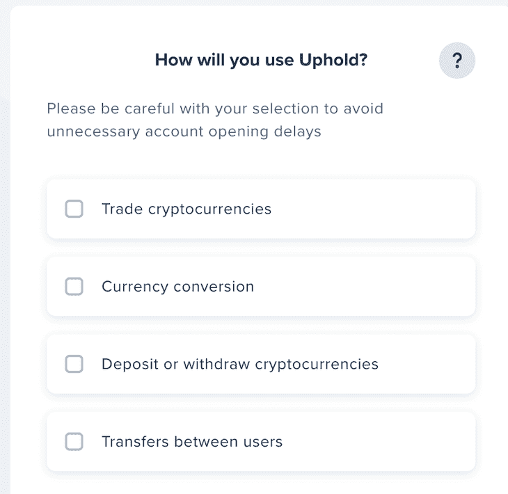
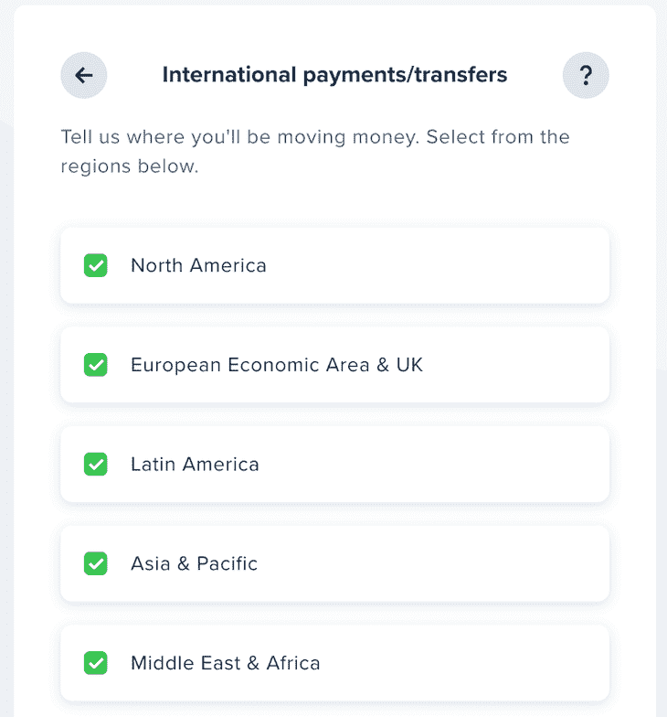
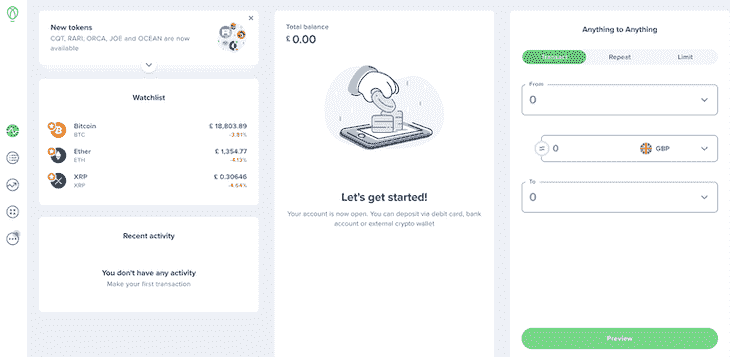
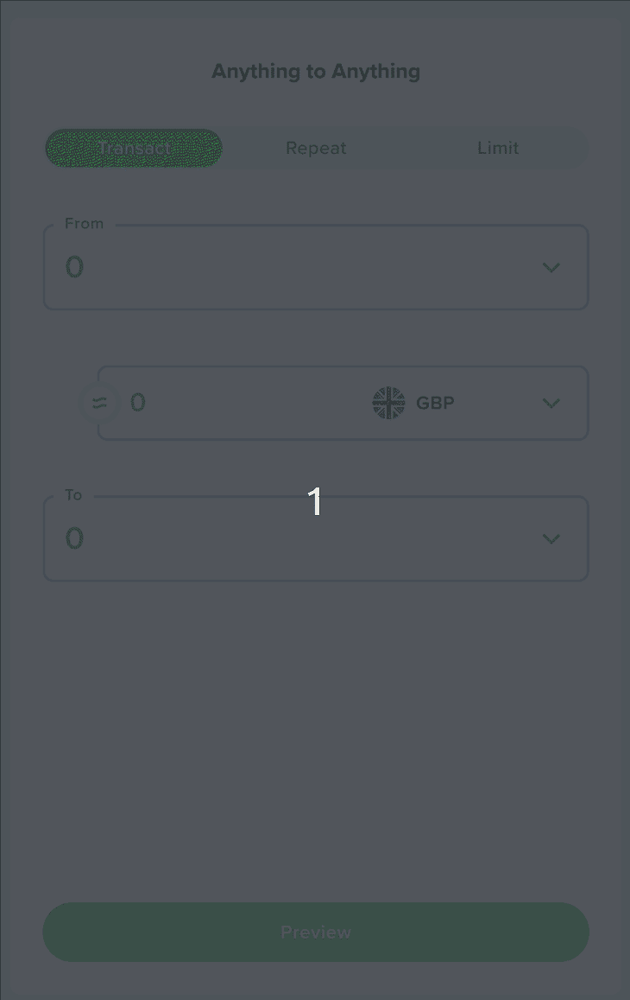
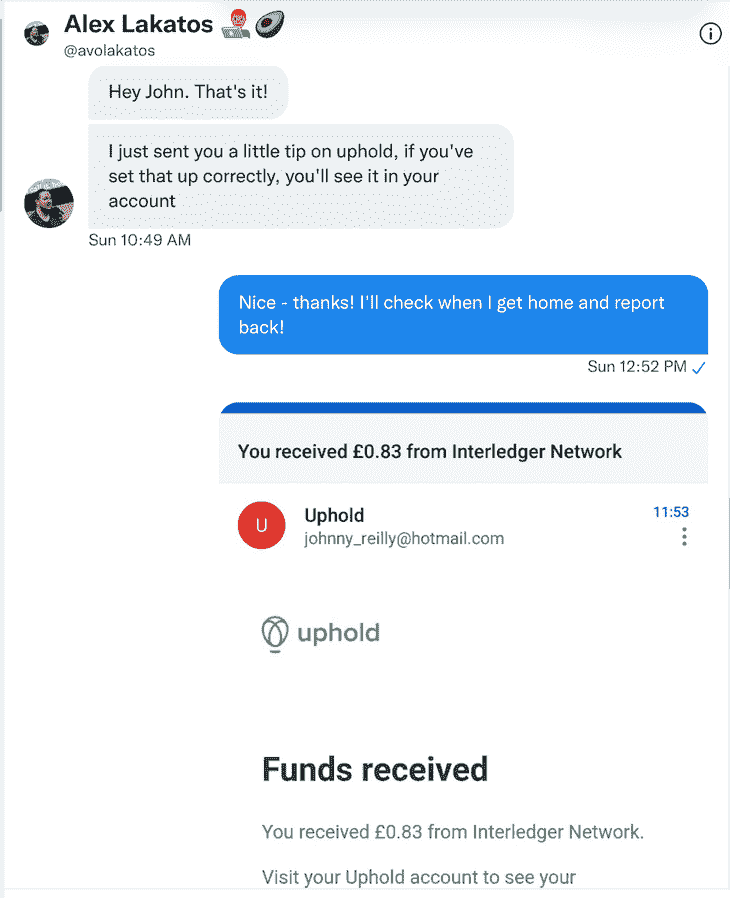
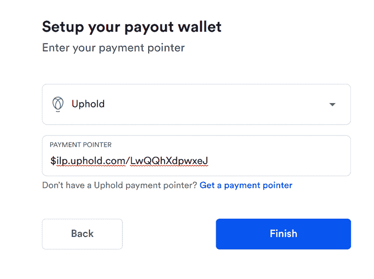
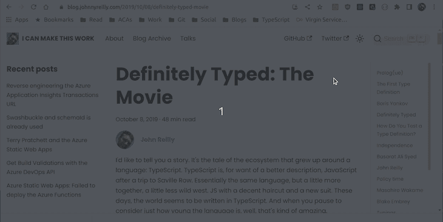
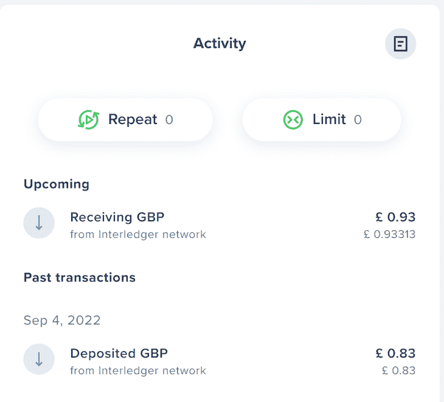

# 开始使用 Web 货币化 API 

> 原文：<https://blog.logrocket.com/getting-started-web-monetization-api/>

Web 货币化 API 是一个 JavaScript 浏览器 API，允许创建从用户代理到网站的支付流。在这篇文章中，我将带你开始把它添加到一个站点。

*向前跳转:*

## 什么是 Web 货币化 API？

今年夏天，我参加了在海滩举行的 HalfStack 会议，听了来自 T2 的 Alex Lakatos 关于网络货币化 API 的演讲。我以前没有听说过这个 API 事实证明，这是一种新的网站盈利方式。

我自己的博客已经有了一个[给我买杯咖啡](https://www.buymeacoffee.com/qUBm0Wh)的链接，如果慷慨的人发现我写的东西有用，他们可以给我寄一点钱。网络货币化 API 在这方面看起来是相似的，不同之处在于它内置于浏览器中，并在[网络平台孵化器社区组织](https://discourse.wicg.io/t/proposal-web-monetization-a-new-revenue-model-for-the-web/3785)中被提议为 W3C 标准。

我对网络货币化 API 很感兴趣。Alex 好心地与我分享了一些链接，我决定尝试一下——尝试使用它并记录下发现。

这篇文章正是如此。这是从一个不知道网络货币化 API 的人的角度写的，除了他们在一次演讲中听到的。

在这篇文章的过程中，我会试着更好地了解它，并试着把它整合到我的博客中。当我这样做的时候，我会分享我正在做的事情和我是如何发现这些事情的，并且通常会尝试提供一个有用的资源(和一些反馈)来说明采用是什么样的。

我将从网络货币化官方网站开始，在那里我找到了一个[快速启动](https://webmonetization.org/docs/getting-started)指南，我决定通过它来工作。

## 选择和设置钱包

如果你想采用网络货币化，首先要做的是[建立一个钱包](https://webmonetization.org/docs/getting-started#1-set-up-a-web-monetized-wallet)。这允许你从人们那里收钱——它本质上是一个支持网络货币化集成的银行账户。

对此似乎有两种选择:

1.  [拥护](https://wallet.uphold.com/)
2.  [GateHub](https://gatehub.net/)

现在，[support 提供了更多的功能](https://webmonetization.org/docs/ilp-wallets/#digital-wallets)，所以我决定用它们来创建一个钱包。

### 用 support 打造钱包

尽管注册过程非常简单，但当看到这个提示时，我还是有点困惑:



我不完全确定我需要什么。Web 货币化 API 似乎最有可能是关于用户之间的转移，所以我选择了它。

然后，它问了这个问题:



我选择接受所有地区。在通常的注册过程之后，我能够看到我的新(空)帐户:



## 获取支付指针

我们需要做的下一件事是获取我们的支付指针。这是一个有点棘手的跟踪，最终，亚历克斯告诉我去哪里。在仪表板的右侧，有一个“任何对任何”部分:



点击“复制”按钮，将支付指针复制到剪贴板。我以后会需要这个。我的情况就是:`$ilp.uphold.com/LwQQhXdpwxeJ`。

你可能会看着支付指针，心想，“这看起来有点 URL-y…”你可能是对的！因为`$ilp.uphold.com/LwQQhXdpwxeJ`相当于这个 URL: `[https://ilp.uphold.com/LwQQhXdpwxeJ](https://ilp.uphold.com/LwQQhXdpwxeJ)`。我们只是把`$`换成了`https://`。

## 制作货币化标签

接下来要做的是使用支付指针制作一个`link`标签。这个标签将告诉浏览器这个页面支持网络货币化。这个标签应该出现在我们网站的每一页。

标签看起来像这样:

```
<link rel="monetization" href="https://ilp.uphold.com/LwQQhXdpwxeJ" />

```

可以看到，`href`属性是我们刚刚获取的支付指针；以它的“https”形式。

## 添加 Docusaurus `link`标签

这里的最后一步是将这个`link`标签添加到我们站点提供的页面上。在我的例子中，我使用 [Docusaurus](https://blog.logrocket.com/easy-documentation-with-docusaurus/) 来驱动我的博客。要用 Docusaurus 添加一个额外的`link`标签，我们需要将它添加到 [`docusaurus.config.js`](https://docusaurus.io/docs/next/seo#global-metadata) 文件中。

在头部添加额外的`link`标签的语法以迷你插件的形式出现:

```
module.exports = {
  // ...
  plugins: [
    // ...
    function extraHeadTagsPlugin(context, options) {
      return {
        name: 'extra-head-tags-plugin',
        injectHtmlTags({ content }) {
          return {
            headTags: [
              {
                tagName: 'link',
                attributes: {
                  rel: 'monetization',
                  href: 'https://ilp.uphold.com/LwQQhXdpwxeJ',
                },
                // This will become <link rel="monetization" href="https://ilp.uphold.com/LwQQhXdpwxeJ" /> in the generated HTML
              },
            ],
          };
        },
      };
    },
    // ...
  ],
};

```

如果这个拉请求到达，添加一个`link`标签所需的代码可能会变得更简单[。在那之前，我们需要使用一个插件。](https://github.com/facebook/docusaurus/pull/8077)

同样值得一提的是，从历史上看，网络货币化 API 使用了一个`meta`标签而不是一个`link`标签——并且这个标签使用了`$`前缀而不是`https://`。标签看起来像这样:

```
<meta name="monetization" content="$ilp.uphold.com/LwQQhXdpwxeJ" />

```

但是`link`标签是当前的标准，这是你应该考虑采用的。

## 你好，Web 货币化 API？

这样做，我的网站是网络赚钱！或者至少…我认为是…那是什么意思？嗯，我不太确定。我再次联系亚历克斯，给他看了我的网站，问道:“这有用吗？”他说:



果然，我发现亚历克斯确实给我寄来了 83 便士(1 美元)的巨款……它起作用了！

## 用线圈分机寄钱

原来是 Alex 用一个叫 [Coil](https://coil.com/) 的浏览器扩展给我汇的钱。这是一个浏览器扩展，允许你向支持网络货币化的网站汇款。这有点像基于浏览器的 Patreon 或给我买杯咖啡，但略有不同。[引用他们的文件](https://help.coil.com/docs/general-info/intro-to-coil/index.html#how-is-coil-different-from-other-membership-services-like-patreon-and-flattr):

> 有了像 Patreon 这样的服务，你可以选择支持哪些创作者，然后根据他们提供的会员计划，分别向每个创作者付费。Coil 会将付款实时传送到您访问的任何网络盈利网站。

因此，人们可以使用 Coil 明确地给网站小费，或者他们可以只使用 Coil 浏览网页，网站将从 Coil 获得少量资金。多年来，我一直听到“微支付是网络中缺失的一块”——这似乎解决了这个问题，我对此很感兴趣。

我已经建立了一个账户，这样我就可以从其他人那里收到钱。线圈就像它的另一面:它可以让我给其他人寄钱。你需要钱从某个地方来。事实证明，我可以使用我刚刚创建的维护帐户设置一个线圈帐户:



所以，我就是这么做的。我在 Coil 中输入了我的支付指针，现在我可以向其他支持网络货币化的网站汇款了。但是那看起来像什么？嗯，我决定在我自己的网站上试试。我安装了[线圈浏览器扩展](https://coil.com/)，然后去我的网站试了试:



我去了我的博客，果然，我可以给自己发一条提示。当我翻到我的账户时，我看到钱已经在路上了！



就像亚历克斯能在 9 月 4 日给我寄 1 美元一样，我也能在 9 月 10 日给自己寄 1 美元！

顺便提一下，交易金额从 83 便士到 93 便士的变化纯粹是由于英镑和美元之间价值汇率的变化。目前，英镑对美元正在贬值，所以当我给自己 1 美元小费时，我收到的英镑金额比亚历克斯多。

## 结论

在这篇文章中，我们已经了解了网络货币化 API，我们用它来货币化我们自己的网站，我们用它来提示自己。我们也看到了 Coil 是如何工作的，以及它如何被用来提示其他人的站点。我很期待看到事情的发展。感觉这是一种支持人们在网上制作我们关心的东西的方式。

非常感谢亚历克斯·拉卡托斯首先告诉我这件事，并回答了我所有的问题！

## 通过理解上下文，更容易地调试 JavaScript 错误

调试代码总是一项单调乏味的任务。但是你越了解自己的错误，就越容易改正。

LogRocket 让你以新的独特的方式理解这些错误。我们的前端监控解决方案跟踪用户与您的 JavaScript 前端的互动，让您能够准确找出导致错误的用户行为。

[](https://lp.logrocket.com/blg/javascript-signup)

LogRocket 记录控制台日志、页面加载时间、堆栈跟踪、慢速网络请求/响应(带有标题+正文)、浏览器元数据和自定义日志。理解您的 JavaScript 代码的影响从来没有这么简单过！

[Try it for free](https://lp.logrocket.com/blg/javascript-signup)

.