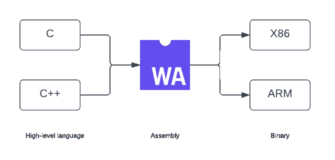
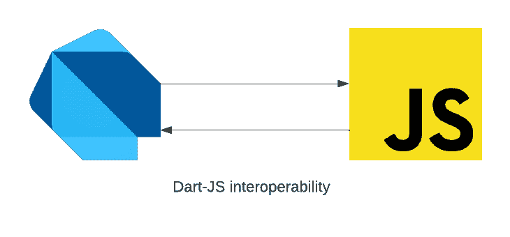
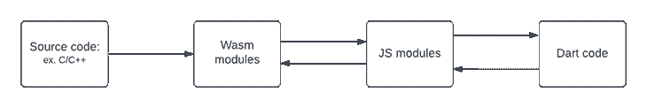
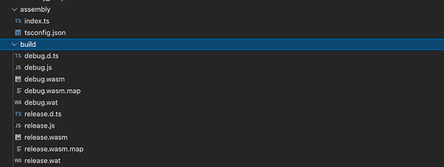
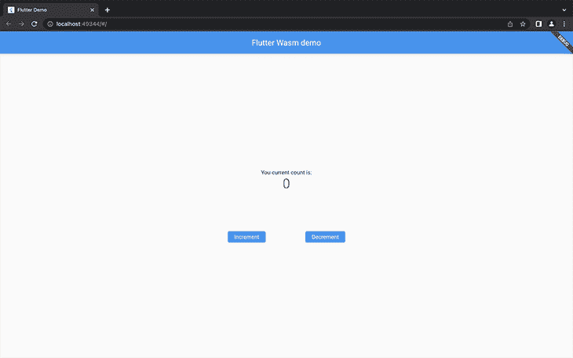

# 在 Flutter Web 中开始使用 WebAssembly

> 原文：<https://blog.logrocket.com/getting-started-webassembly-flutter-web/>

Flutter 是用 Skia 构建的，Skia 是一个用 C++编写的 2D 图形库。Flutter 的 Skia 引擎使其能够创建跨各种平台(包括 web)的可移植的高性能应用程序。

大多数 web 浏览器都理解 JavaScript 语言；但是，Skia C++ API 可以通过 WebAssembly 在 web 浏览器上运行。WebAssembly 通过将本机代码编译成浏览器能够理解的语言，允许它在浏览器中运行。

在本教程中，我们将介绍 WebAssembly 并了解它的好处。我们还将了解 Flutter 代码如何与 WebAssembly 绑定交互。

## 什么是 WebAssembly？

WebAssembly (Wasm)是一种运行性能接近本机的低级语言。它是一个虚拟堆栈机器，具有紧凑的二进制格式，是高级语言的编译目标。

WebAssembly 使工程师能够用 C、C++、Rust 和其他运行在浏览器中的高级语言编写代码。Wasm 将高级语言编写的代码编译成 WebAssembly 模块。然后它们被加载到一个 web 应用程序中，用 JavaScript 调用。

浏览器可以快速将 WebAssembly 模块转换成任何机器的指令。



## 为什么要使用 WebAssembly？

JavaScript 一直是浏览器理解的主要语言。然而，当运行像 3D 游戏这样的资源密集型应用程序时，JavaScript 往往会很慢。对于这样的应用，需要接近本地的体验。这就是 Wasm 的用武之地。

WebAssembly 与 JavaScript 协同工作，为我们的应用程序提供了近乎原生的速度。由于模块尺寸小，Wasm 加载和执行速度更快，能够在网络上运行高性能的应用程序。

Wasm 使我们能够构建快速、高性能、可移植和内存安全的应用程序。这是一个开放的标准，旨在运行于其他平台，而不仅仅是网络。许多流行语言至少对 WebAssembly 有一些支持。

## Dart 和 WebAssembly 互操作性

Dart web 平台使 Dart 代码能够在 JavaScript 支持的平台上编译和运行。我们还可以在 Dart 代码中调用现有的 JavaScript 代码，这是由 [`js`](https://pub.dev/packages/js) 包提供的 JavaScript 绑定实现的。

从 Dart 代码调用 JavaScript 代码和从 JavaScript 代码调用 Dart 代码的能力被称为“Dart-JavaScript 互操作性”



`js`包提供了注释和函数，让我们指定 Dart 代码如何与 JavaScript 代码连接。JavaScript API 具有`WebAssembly`对象，这是所有 WebAssembly 相关函数的名称空间，允许加载 WebAssembly 模块、创建新的内存和表实例，以及处理 WebAssembly 错误。

WebAssembly 有两种文件格式:

*   `.wasm`:包含二进制汇编代码，是可执行文件
*   `.wat`:包含一个人可读的文本格式的`.wasm`文件，编译成`.wasm`。它仅用于编辑或调试

编写 WebAssembly 代码可能会很痛苦。大多数语言支持从我们的源代码生成 Wasm 模块，然后我们可以使用提供的绑定来加载和调用这些模块。

我们可以使用`js`绑定，通过 Dart-web 代码中的 JavaScript WebAssembly 对象来使用 WebAssembly。



为了在我们的 Dart 代码中使用`js`绑定，用`@JS`注释该方法，并向其添加`external`关键字:

```
@JS('WebAssembly.instantiate')
external Object instantiate(Object bytesOrBuffer, Object import);

```

## 在 Flutter web 应用程序中使用 WebAssembly

我们可以使用各种语言来创建 Wasm 模块，并将其加载到我们的 Flutter 应用程序中。在本文中，我们将使用 [AssemblyScript，一种用于 WebAssembly](https://blog.logrocket.com/the-introductory-guide-to-assemblyscript/) 的类类型脚本语言，来生成 Wasm 模块。

### 使用 AssemblyScript 生成 WebAssembly 模块

要开始，我们需要安装 Node.js。您可以从 [Node 的官方网站](https://nodejs.org/en/)下载 Node。

接下来，使用下面的命令安装 npm 包运行程序`npx`:

```
npm i -g npx

```

创建一个新目录和一个`package.json`文件。然后使用以下命令安装`assemblyscript`和`assemblyscript/loader`:

```
mkdir wasm && cd wasm
npm init
npm i --save-dev assemblyscript
npm i --save @assemblyscript/loader

```

接下来，运行下面的命令来搭建一个新项目:

```
npx asinit .

```

该命令将生成`assembly`和`build`文件夹。我们将在`index.ts`文件中编写我们的 AssemblyScript 模块，并将生成的 Wasm 代码放在`build`文件夹中。


接下来，将下面的方法添加到`index.ts`文件中。`plusOne`函数将计数器加 1，而`minusOne`函数将计数器减 1。

```
// The entry file of your WebAssembly module.
export function plusOne(n: i32): i32 {
  return n+1;
}
export function minusOne(n:i32):i32{
  return n - 1;
}

```

在根目录下运行`npm run asbuild`生成 WebAssembly 模块。该命令在`build`文件夹中生成`.wasm`和`.wat`文件。我们将在我们的 Flutter 应用程序中使用`release.wasm`文件。



### 在 Flutter 应用程序中使用 WebAssembly 模块

为了使用生成的 Wasm 模块，我们将把`release.wasm`文件作为资产添加到我们的 Flutter 应用程序中。我们还将使用 [wasm_interop](https://pub.dev/packages/wasm_interop) 包，它为我们处理 JavaScript WebAssembly 绑定，并使我们能够通过调用公开的方法与 WebAssembly 进行交互。

首先，使用`flutter create .`命令在`wasm`文件夹中创建一个新的 Flutter 应用程序。然后，创建一个新的`assets/wasm`文件夹，并添加生成的`release.wasm`文件。更新`pubspec.yaml`文件以包含资产文件夹和`wasm_interop`包:

```
dependencies:
  wasm_interop: ^2.0.1
flutter:
  assets:
    - assets/wasm/

```

运行`flutter pub get`来添加依赖项。

更新`main.dart`文件中的`MyHomePage`小部件，如下所示:

```
class MyHomePage extends StatefulWidget {
  const MyHomePage({Key? key, required this.title}) : super(key: key);
  final String title;
  @override
  State<MyHomePage> createState() => _MyHomePageState();
}
class _MyHomePageState extends State<MyHomePage> {
  int _counter = 0;
  void _incrementCounter() {
  }
  void _decrementCounter() {
  }
  @override
  Widget build(BuildContext context) {
    return Scaffold(
      appBar: AppBar(
        title: Text(widget.title),
      ),
      body: Center(
        child: Column(
          mainAxisAlignment: MainAxisAlignment.center,
          children: <Widget>[
            const Text(
              'You current count is:',
            ),
            Text(
              '$_counter',
              style: Theme.of(context).textTheme.headline4,
            ),
            const SizedBox(
              height: 100,
            ),
            Wrap(
              spacing: 100,
              children: [
                ElevatedButton(
                    onPressed: _incrementCounter,
                    child: const Text('Increment')),
                ElevatedButton(
                    onPressed: _decrementCounter,
                    child: const Text('Decrement'))
              ],
            )
          ],
        ),
      ),
    );
  }
}

```

在根目录下运行`flutter run -d chrome`在 Chrome 上服务 app。我们的应用程序有**递增**和**递减**按钮，它们将与我们的 Wasm 函数挂钩。



创建一个新的`wasm_loader.dart`文件并添加`WasmLoader`类。`WasmLoader`类包含了我们的 Dart 到 Wasm 的互操作性逻辑。

```
import 'package:flutter/services.dart' show rootBundle;
import 'package:wasm_interop/wasm_interop.dart';

class WasmLoader {
  WasmLoader({required this.path});
  late Instance? _wasmInstance;
  final String path;
  Future<bool> initialized() async {
    try {
      final bytes = await rootBundle.load(path);
      _wasmInstance = await Instance.fromBufferAsync(bytes.buffer);
      return isLoaded;
    } catch (exc) {
      // ignore: avoid_print
      print('Error on wasm init ${exc.toString()}');
    }
    return false;
  }
  bool get isLoaded => _wasmInstance != null;
  Object callfunction(String name, int input) {
    final func = _wasmInstance?.functions[name];
    return func?.call(input);
  }
}

```

上面的代码片段执行以下操作:

*   在类构造函数中需要 Wasm 模块路径
*   在`initialized`方法中加载 Wasm 模块文件
*   使用异步`Instance.fromBufferAsync`方法编译和实例化 Wasm 代码。这个方法利用了`[WebAssembly.instantiate()](https://developer.mozilla.org/en-US/docs/Web/JavaScript/Reference/Global_Objects/WebAssembly/instantiate)` JavaScript API
*   如果 Wasm 代码成功初始化，则返回`initialized`方法中的`isLoaded`状态
*   添加一个需要函数名和参数的`callfunction`方法，然后调用该函数

最后，更新`main.dart`文件中的`MyHomePage`小部件，以使用`WasmLoader`:

```
  late WasmLoader loader;
  int _counter = 0;

  @override
  void initState() {
    super.initState();
    _init();
  }

  Future<void> _init() async {
    loader = WasmLoader(path: 'assets/wasm/release.wasm');
    final isLoaded = await loader.initialized();
    if (isLoaded) {
      setState(() {});
    }
  }

  void _incrementCounter() {
    _counter = loader.callfunction('plusOne', _counter) as int;
    setState(() {});
  }

  void _decrementCounter() {
    _counter = loader.callfunction('minusOne', _counter) as int;
    setState(() {});
  }

```

上面的代码片段执行以下操作:

*   用我们的`.wasm`文件的路径创建一个`WasmLoader`的实例
*   初始化`WasmLoader`并在初始化后更新应用程序的状态
*   用调用 Wasm 模块中的`plusOne`和`minusOne`函数的结果更新`_counter`属性

重新运行应用程序，点击**增量**和**德**增量按钮——计数器相应更新。你成功地在你的 Flutter 应用中使用了 WebAssembly 代码！

## 结论

在本教程中，我们讨论了 WebAssembly，并研究了它在提高应用程序性能方面的一些好处。我们还研究了 Flutter 如何与 JavaScript 绑定交互。最后，我们使用 AssemblyScript 来生成 WebAssembly 模块，并将其连接到我们的 Flutter web 应用程序中。

这样，您现在可以在您的 Flutter Web 应用程序中使用 WebAssembly 并增强它们的性能。本文中的所有代码都可以在 [GitHub](https://github.com/Ivy-Walobwa/flutter-web-wasm) 上获得。

我希望你喜欢这个教程！

## 使用 [LogRocket](https://lp.logrocket.com/blg/signup) 消除传统错误报告的干扰

[](https://lp.logrocket.com/blg/signup)

[LogRocket](https://lp.logrocket.com/blg/signup) 是一个数字体验分析解决方案，它可以保护您免受数百个假阳性错误警报的影响，只针对几个真正重要的项目。LogRocket 会告诉您应用程序中实际影响用户的最具影响力的 bug 和 UX 问题。

然后，使用具有深层技术遥测的会话重放来确切地查看用户看到了什么以及是什么导致了问题，就像你在他们身后看一样。

LogRocket 自动聚合客户端错误、JS 异常、前端性能指标和用户交互。然后 LogRocket 使用机器学习来告诉你哪些问题正在影响大多数用户，并提供你需要修复它的上下文。

关注重要的 bug—[今天就试试 LogRocket】。](https://lp.logrocket.com/blg/signup-issue-free)