# Budibase 入门

> 原文：<https://blog.logrocket.com/getting-started-with-budibase/>

许多初创公司、企业和有抱负的企业家都面临着推广产品的挑战，尤其是当他们需要通过创建 web 应用程序或移动应用程序来推广产品时，这可能既昂贵又耗时，尤其是如果他们不是开发人员的话。

但是，就我个人而言，我成功地用[一个叫做](https://en.wikipedia.org/wiki/Low-code_development_platform) [Budibase](https://www.budibase.com/) 的低代码开发平台实现了这一点。Budibase 等低代码开发平台有助于在不编码的情况下创建 web 和移动应用程序，而是依赖于图形用户界面和配置。

但是 Budibase 到底是什么，怎么用？让我们开始吃吧。

## 什么是 Budibase？

Budibase 是一个低代码开发平台，可以帮助您在几分钟内构建一个商业软件应用程序，比开发快 50 倍！

这是一个完全开源的项目，你可以写一些代码来改进和构建一个更好的网络应用。

此外，它是免费的，虽然，你可能要支付托管和工作流程，这取决于你的使用。你可以在这里查看价格[。](https://www.budibase.com/self-host)

Budibase 有很棒的文档和努力工作的 T2 社区。

以下是它的一些最佳特性:

*   您可以使用开发人员友好的内部工具以及出色的响应设计和可用性来构建和发布单页面应用程序(spa)
*   Budibase 是开源的
*   您可以从外部数据库(MongoDB、CouchDB、PostgreSQL、mySQL、Airtable、Google Sheets、S3、DyanmoDB 或 REST API)连接或导入数据。此外，您可以在 Budibase GUI 中操作数据
*   您可以使用强大的组件生成或开发令人惊叹的屏幕
*   您可以[自动化流程，或者为 Budibase 项目实现后端逻辑](https://docs.budibase.com/automate/introduction-to-automate)。例如，如果您需要知道某人何时更新数据或删除数据库中的记录，Budibase 会在事情发生时发送电子邮件
*   你可以简单地将你的应用程序部署在 Budibase 云上，或者你自己的 Docker 或 Digital Ocean 上

Budibase 是一个强大的平台，适用于从初创企业到大型企业的各种业务。您可以将它用于:

*   信息技术和工程
*   咨询公司
*   运输和物流
*   教育
*   零售和市场
*   金融

现在，让我们一起创建一个简单的 Budibase 项目。

## 创建您的第一个 Budibase 应用程序

首先，我们应该在 [Budibase](https://portal.budi.live/signup) 上创建一个帐户，并回答几个问题。注册成功后，您将导航至 [Budibase 托管门户](https://portal.budi.live):

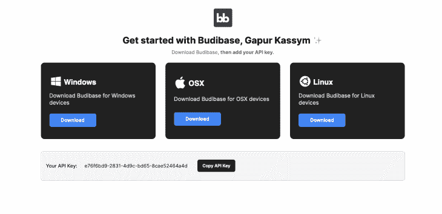

让我们为您的操作系统下载一个特定的构建器，并复制`API Key`来部署您的应用程序。

接下来，打开构建器，通过点击右上角的按钮**创建新的 Web 应用程序**来创建一个新的 Budibase 应用程序。让我们创建一个简单的技术商店 web 应用程序。

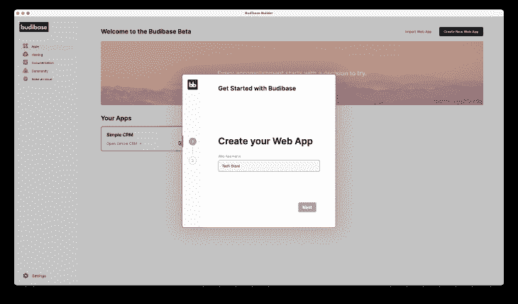

最后，我们将为我们的 web 应用程序创建第一个用户。如果我们不添加用户，我们就无法登录到我们的系统，所以添加一个电子邮件为“[【受电子邮件保护】](/cdn-cgi/l/email-protection)”且角色为“admin”的用户

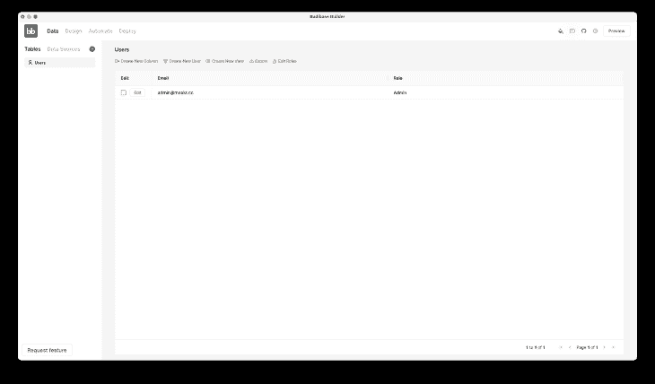

上面，当我们向系统添加一个新用户时，我们已经创建了一个 **Users** 表。Budibase 会在这里存储所有用户的数据。

## 管理 Budibase 数据

在 Budibase builder 的顶部，您会看到使用 web 应用程序的四个主要部分:

*   Data: section 来操作数据库。这部分通常称为后端
*   设计:部分来构建您的用户界面。这部分通常被称为前端
*   自动化:您可以自动化流程或工作流部分
*   Deploy:用于在 Budibase 上部署 web 应用程序的部分

在开发用户界面之前，我们应该创建一个数据库结构。我们的技术商店将储存和展示技术产品。

首先，创建一个包含列的`Products`表:

*   名称:数据类型为`Text`的产品名称
*   价格:数据类型为`Number`的产品价格
*   品牌:数据类型为`Options`的公司名称。这是令人难以置信的字符串/文本选择类型
*   图像:静态文件的数据类型为`Attachment`的产品图像
*   可用:`Boolean`类型为商店中可用
*   描述:科技产品描述

让我们点击**创建表格**按钮:

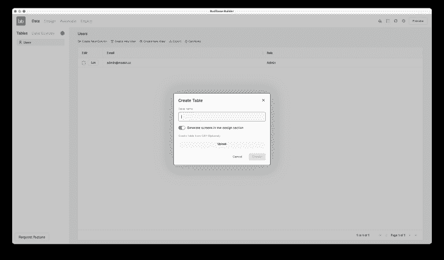

## 使用 Budibase 设计您的应用程序

Budibase builder 有左、中和右面板部分。

左侧面板包含您的屏幕和布局，而屏幕包含我们所有的屏幕。当我们创建 Products 表时，Budibase 为我们生成四个屏幕:

*   `home`:主屏幕
*   `products/:id`:编辑产品行画面
*   `products/new/row`:创建新产品屏幕
*   `products`:所有产品列表画面
    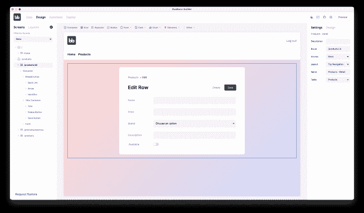

布局是一个主模板，您的内容在整个应用程序中保持一致。

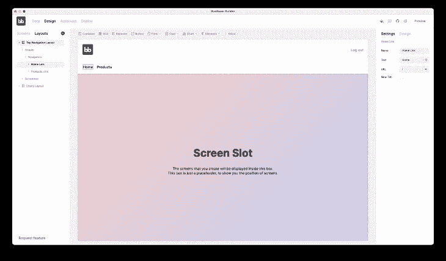

Budibase 的设计有公共和私人的一面。私人面是你登录后工作的页面。公共端是每个人都可以访问的屏幕。例如，我们的应用程序有一个登录页面。

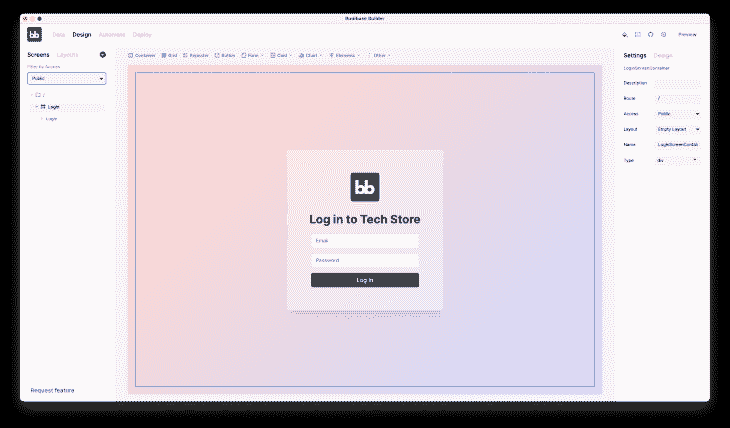

中间的面板显示带有组件的页面，而右边的面板管理页面和组件的样式和设置。

让我们点击右上角的**预览**按钮，通过我们的 web 应用程序向数据库添加几个产品。

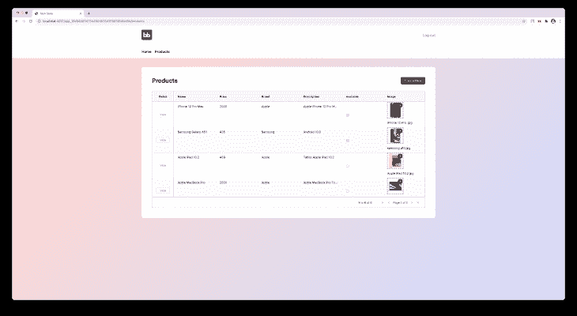

接下来，让我们更改主屏幕，删除`Video Container`组件并显示所有可用的产品。那么我们如何做到这一点呢？幸运的是，Budibase 有`View`虚拟表。我们可以在不改变数据库数据的情况下获取数据。Budibase 通过以下方式处理数据:

*   过滤器:用特定条件过滤数据
*   组:按列对数据进行分组
*   计算:用公式计算数据

第一次看起来可能很复杂，但是如果你阅读[文档](https://docs.budibase.com/data/views)并练习，它会变得更容易。

现在，让我们用过滤器`Available equal true`创建`Availables`视图。

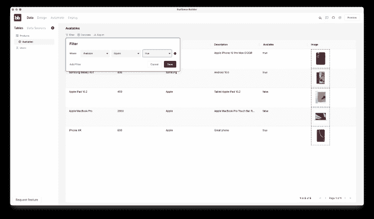

当`Availables`视图准备好时，添加带有`Stacked List`的`Repeater`组件。

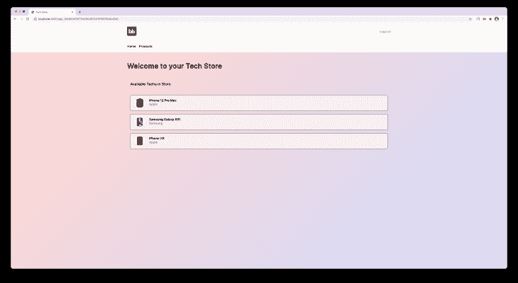

上面，我们已经更新了堆叠列表的边框、填充和背景属性。很简单。你可以通过强大的工具和设置制作不同的风格。随意玩，相信你的想象力！

## 在 Budibase 中部署应用程序

太好了！我们已经完成了我们的第一个 Budibase 网络应用程序。现在，我们需要部署 web 应用程序。当我们部署它时，Budibase 在 AWS 上托管它。使用 Budibase 进行部署很简单。

首先，打开一个[托管门户](https://portal.budi.live)，并为您的部署复制`API Key`。然后点击右上角的**设置**图标和过去键，打开设置模式窗口。

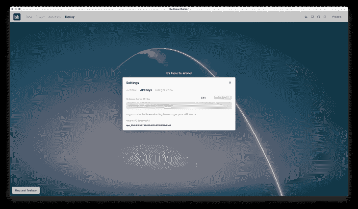

接下来，点击**部署应用**按钮。就是这样。

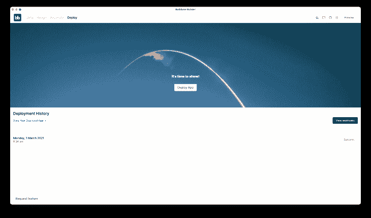

恭喜你！您的第一个 Budibase web 应用程序现已上线。

## 结论

如果您需要在没有软件开发知识的情况下在几分钟内构建一个 web 应用程序，Budibase 是您的最佳选择。这是一个不可思议的构建 web 应用程序的低代码开源平台。

感谢阅读。我希望这篇文章对你有用。编码快乐！

## 使用 [LogRocket](https://lp.logrocket.com/blg/signup) 消除传统错误报告的干扰

[LogRocket](https://lp.logrocket.com/blg/signup) 是一个数字体验分析解决方案，它可以保护您免受数百个假阳性错误警报的影响，只针对几个真正重要的项目。LogRocket 会告诉您应用程序中实际影响用户的最具影响力的 bug 和 UX 问题。

然后，使用具有深层技术遥测的会话重放来确切地查看用户看到了什么以及是什么导致了问题，就像你在他们身后看一样。

LogRocket 自动聚合客户端错误、JS 异常、前端性能指标和用户交互。然后 LogRocket 使用机器学习来告诉你哪些问题正在影响大多数用户，并提供你需要修复它的上下文。

关注重要的 bug—[今天就试试 LogRocket】。](https://lp.logrocket.com/blg/signup-issue-free)