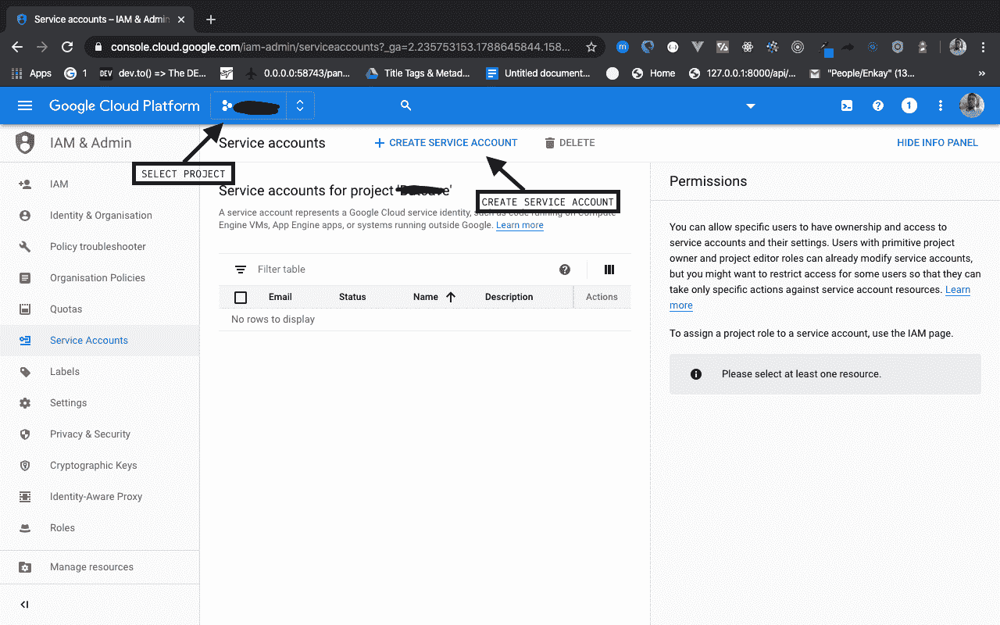
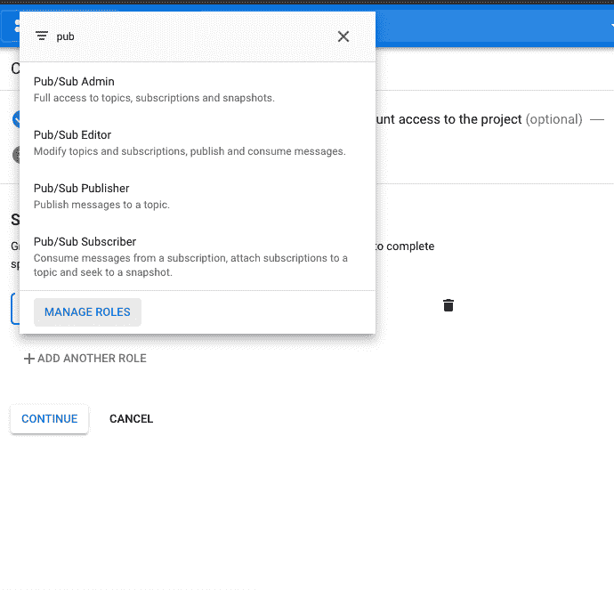
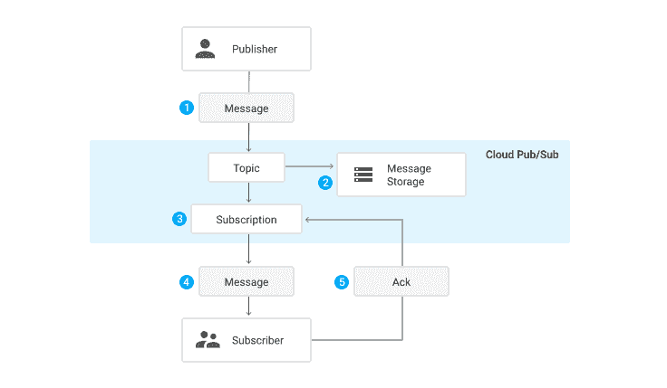
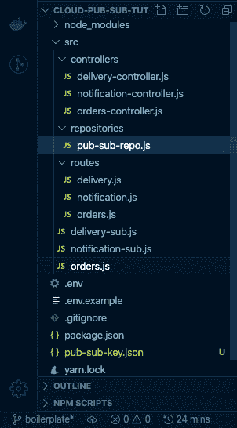
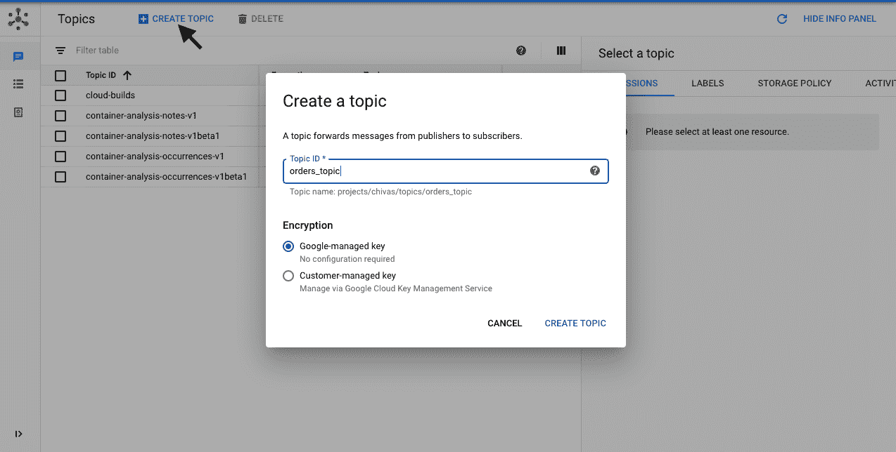
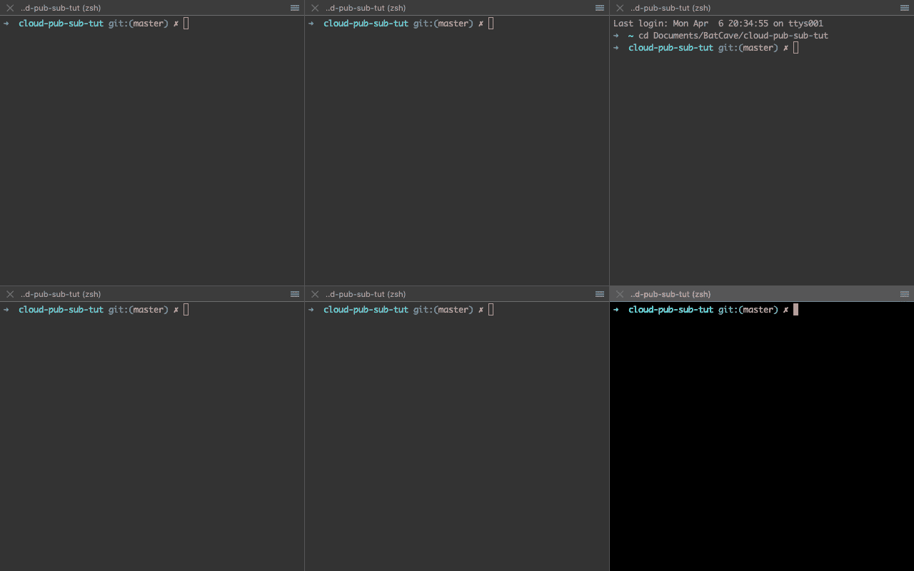
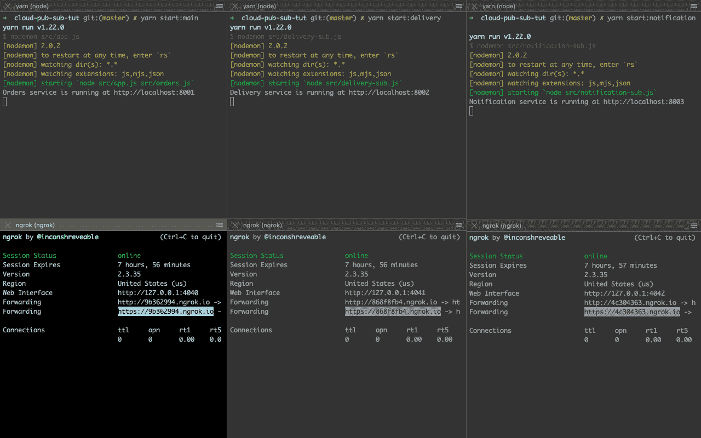
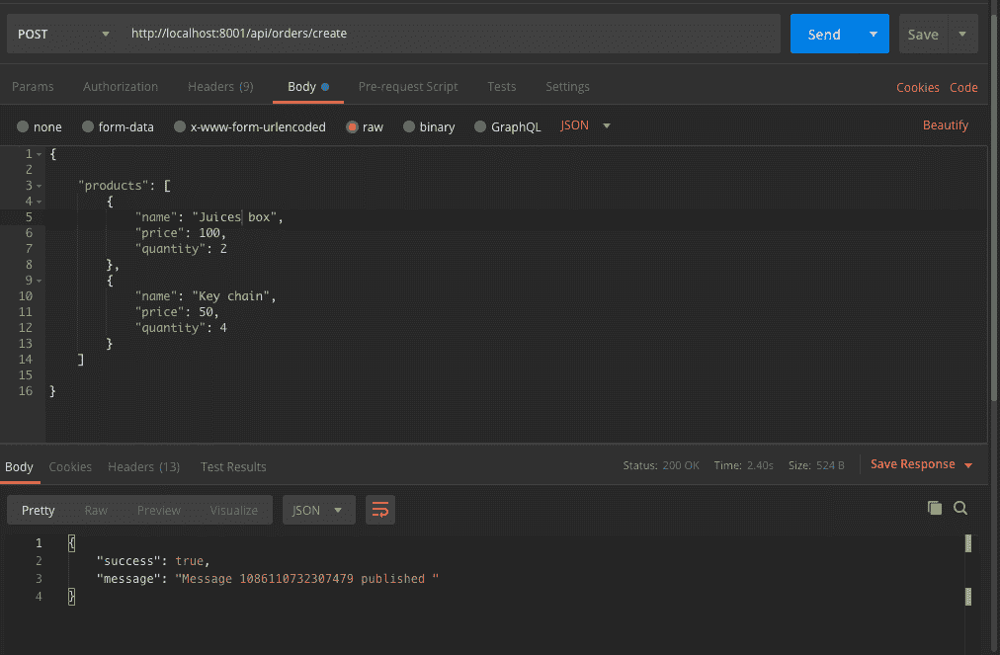

# Node - LogRocket 博客中的云发布/订阅入门

> 原文：<https://blog.logrocket.com/getting-started-with-cloud-pub-sub-in-node/>

## 介绍

近年来，由于微服务的流行，EDA(事件驱动架构)正在兴起。微服务由独立部署的小型独立单元组成，这些单元相互独立通信，构成一个成熟的应用程序。由于这些服务的独特性和模块化，维护与它们的弹性通信可能是一件麻烦的事情。这就是为什么需要消息代理。

简单地说，消息代理是一个中介软件，它将消息从一个或多个服务中继到其他服务。这种软件的一个例子是[云发布/订阅](https://cloud.google.com/pubsub/docs)。

Cloud Pub/Sub 是一个由 Google 完全管理的消息代理，它使用发布者-订阅者模型将信息从一个服务传递到其他订阅服务。发布/订阅使团队可以轻松地在服务之间建立通信通道，而不必担心单个服务的正常运行时间、重试策略和等幂性。

在本文中，我们将了解如何在 Node.js 中使用 Cloud Pub/Sub 实现服务间通信。

## 先决条件

本教程使用以下内容:

1.  Node.js 的基础知识
2.  [安装纱线](https://yarnpkg.com/lang/en/docs/install/)或 [NPM](https://www.npmjs.com/) (我们将使用纱线)
3.  安装了 Git
4.  安装了 Ngrok
5.  一个谷歌账户
6.  配置为运行 Node.js 的开发计算机

## 装置

在选择的任何终端中运行以下命令来初始化项目目录:

```
$ git clone -b boilerplate http://github.com/enkaypeter/cloud-pub-sub-tut/
$ cd cloud-pub-sub-tut && yarn
```

已安装的软件包:

*   [express](http://expressjs.com/)——一个用于旋转 RESTful APIs 的轻量级 Node.js web 框架。我们将使用它来处理后端应用编程接口中的路由
*   当我们修改/编辑代码时，这个包将帮助我们自动重启我们的开发服务器
*   [body-parser](https://www.npmjs.com/package/body-parser)——一个中间件，用于将输入的请求输入解析到我们的`req.body`对象中
*   用于 Node.js 的 HTTP 请求记录器中间件。这将帮助我们在开发过程中调试我们的 API
*   [头盔](https://helmetjs.github.io/docs/)——这是一个中间件的集合，我们的基于 express 的服务器通过设置符合[最佳安全实践](https://expressjs.com/en/advanced/best-practice-security.html)的 HTTP 头
*   这个包将有助于在我们的服务器上实现跨源资源共享
*   [dotenv](https://www.npmjs.com/package/dotenv) —这个包将使我们能够通过`process.env`对象从我们的节点应用程序访问在`.env`文件中定义的环境
*   google-cloud/pubsub —这是 Cloud Pub/Sub 的 Node.js 客户端。我们将使用它来发布消息和订阅我们的发布/订阅控制台中定义的主题

## 为 GCP 上的 Pub/Sub 设置服务帐户

为了在我们的节点应用程序中初始化发布/订阅，我们需要在我们的 GCP(谷歌云平台)控制台上获得一个配置有发布/订阅访问的服务帐户。我们将通过以下步骤实现这一点:

*   登录[谷歌云控制台](https://console.cloud.google.com/?_ga=2.203312849.1788645844.1586151143-601160769.1581123822&_gac=1.61200094.1585461690.Cj0KCQjw6_vzBRCIARIsAOs54z5QL5ch9JGZ6Mrq2ARpWOOrAJS626LQzThM_Craor-AP4qMgrxP_7saAvdAEALw_wcB)并选择一个项目，或者按照提示创建一个项目(如果您是第一次)
*   导航到[发布/订阅部分](https://console.cloud.google.com/cloudpubsub?_ga=2.173884899.1788645844.1586151143-601160769.1581123822&_gac=1.15587396.1585461690.Cj0KCQjw6_vzBRCIARIsAOs54z5QL5ch9JGZ6Mrq2ARpWOOrAJS626LQzThM_Craor-AP4qMgrxP_7saAvdAEALw_wcB)为您的项目启用 API
*   转到[服务帐户](https://console.cloud.google.com/iam-admin/serviceaccounts?_ga=2.173884899.1788645844.1586151143-601160769.1581123822&_gac=1.15587396.1585461690.Cj0KCQjw6_vzBRCIARIsAOs54z5QL5ch9JGZ6Mrq2ARpWOOrAJS626LQzThM_Craor-AP4qMgrxP_7saAvdAEALw_wcB)的部分，选择一个项目并创建一个服务帐户，如下所示:



输入服务帐户名称，例如 pub-sub-key，然后单击 create。

*   向服务帐户授予访问发布/订阅管理权限，如下所示:



Click on Continue to give grant access to the service account

*   单击 Create Key，选择 JSON 选项，并下载 JSON 对象。我们将需要节点项目目录中的这个文件来验证发布/订阅客户端

## 术语的定义

在这一节中，我们将定义贯穿本文的几个术语。我们还将看看从发布者到订阅者的典型消息流。

*   消息—这是转发给特定主题上的订阅服务的数据实体
*   主题——和每一次谈话一样，都有一个交流的主题。主题是表示消息提要的主题
*   订阅——这是订阅者实体的联盟，接收关于特定主题的发布消息
*   订户—这是一个实体，它被设置为通过推或拉的方式接收和确认来自特定主题的消息
*   发布者——这是一个实体，它创建消息并将其广播给主题上的订阅服务

为了正确理解消息是如何从发布者传递到订阅者的，我们来看看流程图[发布/订阅文档](https://cloud.google.com/pubsub/docs/overview):



1.  发布者应用程序(如订单服务)向主题(订单主题)发送消息(订单对象)
2.  发布/订阅确保消息保留在存储器中，直到订阅所述主题(orders_topic)的服务确认消息接收
3.  Pub/Sub 然后[将消息扇出](https://en.wikipedia.org/wiki/Fan-out_(software))到 orders_topic 中的所有订阅实体
4.  然后，订户从发布/订阅接收消息。这可以通过推送到订户配置的端点来完成，也可以通过订户从 Pub/Sub 拉所述消息来完成
5.  订阅者对收到的每条消息向发布/订阅发送确认，然后从消息队列中删除确认的消息

## 问题域和建议的解决方案

在这一部分中，我们将陈述我们的问题领域和建议的解决方案(概念验证),随着我们的深入，我们将共同构建这些问题领域和建议的解决方案。

### 问题域

比如说一个具有多种服务的电子商务软件/解决方案。订单服务、交付服务和通知服务。订单服务接收用户的订单，对其进行处理，然后将其发送给交付服务进行处理。交付服务商随后将对其进行处理，并不时地向用户通知(通知服务)包裹的交付状态。

通过在这些服务之间进行定期 HTTP 调用来实现这种软件体系结构，将会在出现边缘情况(如服务停机、添加更多服务等)时导致异常的系统行为。被介绍。

### 拟议解决方案

作为消息代理的 Google Pub/Sub 可以接收来自订单服务的消息，并充当订单服务和其他服务(交付、通知)之间的中继。发布/订阅具有消息重试策略，有助于抑制由于服务停机/故障而导致的订单丢失。它还使团队能够向应用程序堆栈添加更多的服务，并通过使新的和现有的服务能够订阅一个或多个主题来保持整个系统的节奏。

## 构建发布者和订阅者

在本节中，我们将构建发布者和订阅者(推和拉)逻辑，它将包含三个入口点文件— orders.js(发布者)、delivery-sub.js(订阅者 A)和 notification-sub.js(订阅者 B)。这三个文件表示我们微服务架构中的三个服务。每个服务都有各自的路由和控制器，但是共享同一个发布-订阅库。发布-订阅存储库包含可重用的发布-订阅功能，用于发布消息和接收发布的消息。下面是[样板文件分支](https://github.com/enkaypeter/cloud-pub-sub-tut/tree/boilerplate/src)的图示:



### 发布/子存储库

这是我们定义所有功能的地方，这些功能将使我们能够执行所有与发布/订阅相关的任务，例如发布消息和监听推送或请求订阅:

```
// src/repositories/pub-sub-repo.js

module.exports = {
    publishMessage: async (pubSubClient, topicName, payload) => {
        const dataBuffer = Buffer.from(JSON.stringify(payload));
        const messageId = await pubSubClient.topic(topicName).publish(dataBuffer);
        console.log(`Message ${messageId} published.`);
        return messageId;
    }
 ...
};
```

上面的代码片段显示了接受三个参数的`publishMessage`函数，即`pubSubClient`、`topicName`和`payload`。此函数将 JSON 有效负载序列化到缓冲区中(这是发布/订阅所需的消息格式)，然后在执行时将其发布到指定的主题:

```
// src/repositories/pub-sub-repo.js

module.exports = {
  ...

  listenForPullMessages: (pubSubClient, subscriptionName,  timeout) => {
      const subscription = pubSubClient.subscription(subscriptionName);
      let messageCount = 0;
      const messageHandler = message => {
          console.log(`Received message ${message.id}:`);
          console.log(`\tData: ${message.data}`);
          console.log(`\tAttributes: ${message.attributes}`);
          messageCount += 1;
          message.ack();
      };
      subscription.on('message', messageHandler);
      setTimeout(() => {
          subscription.removeListener('message', messageHandler);
          console.log(`${messageCount} message(s) received.`);
      }, timeout * 1000);
  }

  ...

};
```

上面的代码片段显示了一个订阅者函数，它将消息广播到与主题相关的订阅。在执行时，此函数在 t * 1000ms 毫秒内侦听从发布者扇出的消息(如果 t = 60 收听者将收听 60 秒，相当于 1 分钟):

```
// src/repositories/pub-sub-repo.js

module.exports = {
  ...

  listenForPushMessages: (payload) => {
    const message = Buffer.from(payload, 'base64').toString(
        'utf-8'
    );
    let parsedMessage = JSON.parse(message);
    console.log(parsedMessage);
    return parsedMessage;
  }

  ...

}
```

上面的代码片段接受来自已配置的订户端点的消息，并将缓冲区解析为 JSON 格式，供各个订户使用。

## 构建发布者

我们的 publisher 的基本逻辑位于`src/controllers/orders-controllers.js`文件中。它充当订单服务，接受来自用户的订单，处理订单，然后向相关服务(交付和通知)发送消息，通知它们有新订单:

```
// src/controllers/orders-controller.js

const { PubSub } = require("@google-cloud/pubsub");
const pubsubRepository = require("../repositories/pub-sub-repo");

const pubSubClient = new PubSub();
const topicName = "orders_topic";
const { publishMessage } = pubsubRepository;

module.exports = {
    ...

    createOrders: async (req, res) => {
        let ordersObj = req.body;
        let messageId = await publishMessage(pubSubClient, topicName, ordersObj);
        return res.status(200).json({
            success: true,
            message: `Message ${messageId} published :)`
        })
    }

};
```

上面的代码片段显示了接受订单请求主体并将对象发布到 orders_topic 的`createOrders`方法。

### 建立订户

有两个订户代表两个独立的服务——传递和通知。我们将在本节中单独构建交付服务，因为可以为通知服务重新创建相同的步骤:

```
// src/controllers/delivery-controller.js

const { PubSub  } = require("@google-cloud/pubsub");
const pubSubClient = new PubSub();
const subscriptionName = "delivery_sub";
const timeout = 60;
const pubsubRepository = require("../repositories/pub-sub-repo");
const { listenForPullMessages, listenForPushMessages } = pubsubRepository;
module.exports = {
    ...

    pullDelivery: (req, res) => {
        try {
            listenForPullMessages(pubSubClient, subscriptionName, timeout);            
        } catch (error) {
            return res.status(500).json({
                success: false,
                message: "Couldn't receive orders object :(",
                data: error
            })                        
        }

    },
    pushDelivery: async (req, res) => {
        try {
            let messageResponse = await listenForPushMessages(req.body.message.data);
            return res.status(200).json({
                success: true,
                message: "Message received successfully :)",
                data: messageResponse
            })

        } catch (error) {
            return res.status(500).json({
                success: false,
                message: "Couldn't receive orders object :(",
                data: error
            })                        
        }
    }
};
```

`pullDelivery`函数从接受三个参数的`pubsubRepository`中执行`listenForPushMessages`函数；`pubSubClient`，订阅的名称(通知服务将被称为 notifications_sub)，以及 60 秒的超时。

由于是一个 webhook，`pushDelivery`函数接受从 pub/sub 获得的消息作为参数传递给`listenForPushMessages`函数，以便反序列化到 JSON 中。

## 将这些点连接起来

在这一部分，我们将前往我们的谷歌云控制台，创建一个主题和订户。我们还将学习如何分别运行我们的三项服务来验证概念。

为了创建主题，我们将导航到云控制台上的[发布/订阅部分](https://console.cloud.google.com/cloudpubsub?_ga=2.261965389.1788645844.1586151143-601160769.1581123822&_gac=1.187161818.1585461690.Cj0KCQjw6_vzBRCIARIsAOs54z5QL5ch9JGZ6Mrq2ARpWOOrAJS626LQzThM_Craor-AP4qMgrxP_7saAvdAEALw_wcB),并创建 orders_topic，如下所示:



单击“创建主题”后，您将转到新创建的 orders_topic 页面，在这里您将创建一个订阅，如下所示:


HTTPS URL 代表托管我们递送服务的主机 URL。发布/订阅要求所有推送端点都部署在 HTTPS 上。对于我们的通知服务，我们将重复上面的步骤，用“notification_sub”替换订阅 ID，用`{{HTTPS_URL}}/api/delivery/push`替换端点 URL。

> 为了获取{{HTTPS 网址}}，我们将在下一部分使用 [ngrok](https://ngrok.com/) 部署我们的订户

### 运行我们的服务

为了演示三个微服务，我们在项目目录中创建了三个入口点(orders.js、notifications-sub.js 和 delivery-sub.js ),而不是只有 app.js 文件。

这些文件已经在我们的[项目存储库](https://github.com/enkaypeter/cloud-pub-sub-tut/tree/boilerplate/src)中被创建和引导。以下是我们订单服务的定义:

```
// src/orders.js

const express = require('express');
const morgan = require('morgan');
const bodyParser = require('body-parser');
require('dotenv').config();
const app = express();
const ordersRoute = require('./routes/orders');
const helmet = require('helmet');
const cors = require('cors');
app.use(bodyParser.urlencoded({ extended: false }));
app.use(bodyParser.json());
const { MAIN_PORT, NODE_ENV } = process.env;
NODE_ENV !== "production" ? app.use(morgan('dev')) : app.use(morgan('combined'));
app.use(helmet());
app.use(cors());
app.use('/api/orders', ordersRoute);

app.listen(MAIN_PORT);
if (NODE_ENV !== "production" ) {
    console.log(`Orders service is running at http://localhost:${MAIN_PORT}`);
}
```

> 如果您仍然在样板分支中，请通过运行下面的命令切换到主分支

```
$ git fetch origin master && git checkout master
```

在运行我们的应用程序之前，我们需要创建我们的`.env`文件，并将我们的服务帐户密钥复制到我们的项目目录中。`.env`文件应该是这样的:

```
MAIN_PORT=8001
PORT_1=8002
PORT_2=8003

GCP_PROJ_ID=PROJECT_ID
GOOGLE_APPLICATION_CREDENTIALS=FILENAME.json
```

> 其中，项目 ID = GCP 项目 ID，文件名=服务帐户文件名，两者都是在“服务帐户设置”部分创建的。

既然已经解决了这个问题，让我们设置六个终端来同时运行我们的三个服务。在使用 iTerm2 的 Mac 计算机上，您可以通过使用 CMD+SHIFT+D 将单个窗口分成水平的两半来创建六个终端。然后通过在每个水平的两半上使用 CMD+D 两次，将每个水平的两半垂直地分成三个位置。如果一切顺利，您的终端应该如下图所示:



接下来，我们将在终端的上半部分本地运行我们的服务，在每个部分运行以下命令，如下所示:

```
//upper terminal 1 (order service)
$ yarn start:main
//upper terminal 2 (delivery service)
$ yarn start:delivery
//upper terminal 3 (notification service)
$ yarn start:notification
```

然后在下半部分，我们将使用 ngrok 为本地主机服务器提供公共 URL，在每个部分运行以下命令，如下所示:

```
//upper terminal 1 (order service)
$ ngrok http 8001
//upper terminal 2 (delivery service)
$ ngrok http 8002
//upper terminal 3 (notification service)
$ ngrok http 8003
```

运行上面代码片段中的命令应该会得到如下图所示的终端:


下图显示了订单服务上的订单请求和响应示例:



## 结论

在本教程中，我们学习了什么是云发布/订阅，以及如何构建一个简单的案例来演示它在面向服务/微服务架构中的用法。如果你想获得更多关于 Cloud Pub/Sub 的信息，你可以访问官方文档。更多的发布/订阅相关内容，你可以查看 YouTube 上的[发布/订阅简易版](https://www.youtube.com/watch?v=cvu53CnZmGI&list=PLIivdWyY5sqKwVLe4BLJ-vlh9r9zCdOse)系列。

本教程的源代码也可以在 GitHub 上找到。你可以随意复制它，叉它，或者提交一个问题。

## 200 只显示器出现故障，生产中网络请求缓慢

部署基于节点的 web 应用程序或网站是容易的部分。确保您的节点实例继续为您的应用程序提供资源是事情变得更加困难的地方。如果您对确保对后端或第三方服务的请求成功感兴趣，

[try LogRocket](https://lp.logrocket.com/blg/node-signup)

.

[](https://lp.logrocket.com/blg/node-signup)[https://logrocket.com/signup/](https://lp.logrocket.com/blg/node-signup)

LogRocket 就像是网络和移动应用程序的 DVR，记录下用户与你的应用程序交互时发生的一切。您可以汇总并报告有问题的网络请求，以快速了解根本原因，而不是猜测问题发生的原因。

LogRocket 检测您的应用程序以记录基线性能计时，如页面加载时间、到达第一个字节的时间、慢速网络请求，还记录 Redux、NgRx 和 Vuex 操作/状态。

[Start monitoring for free](https://lp.logrocket.com/blg/node-signup)

.