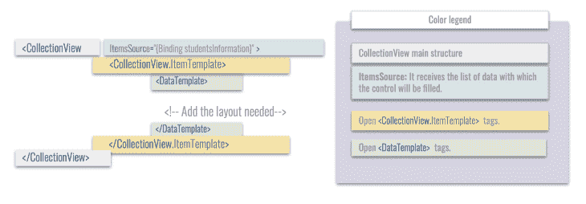
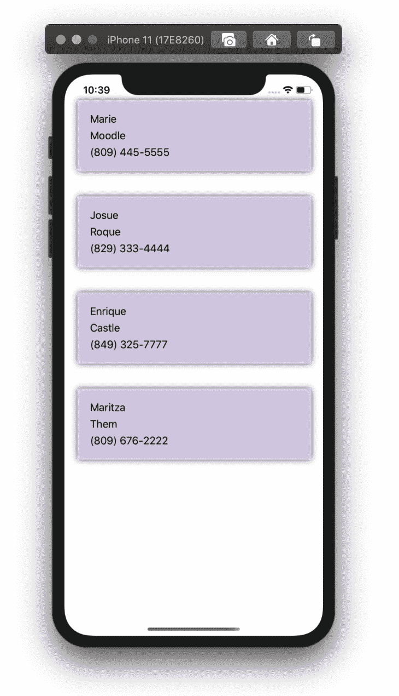
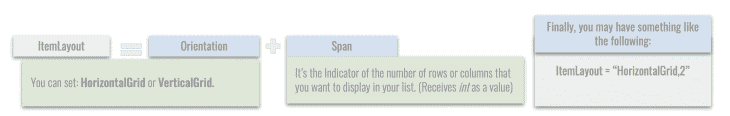

# Xamarin 中的 CollectionView 入门。表单

> 原文：<https://blog.logrocket.com/getting-started-with-collectionview-in-xamarin-forms/>

你好，感谢来到这里！🧡

是时候了解一下 [Xamarin](https://dotnet.microsoft.com/apps/xamarin) 了，在这种情况下，我们将在 [Xamarin 中了解`CollectionView`。表格](https://dotnet.microsoft.com/apps/xamarin/xamarin-forms)。如果你刚开始使用 Xamarin。表单，您可能会问自己类似这样的问题，“我如何为我的应用程序创建列表？”🧐

如果是这样的话，那么你就找对了地方，你将学习如何一步一步地实现这一点。

以下是我们将要介绍的内容:

1.  [什么是`CollectionView`？](#what-is-collectionview)
2.  [`CollectionView`](#basic-structure)的基本结构
3.  [准备数据显示在`CollectionView`](#preparing-data) 中
4.  [学习关于`CollectionView`](#great-properties) 的一些伟大性质

准备好了吗？开始吧！

## 什么是`CollectionView`？

一个图形控件，允许我们呈现数据列表。它的前身是`[ListView](https://docs.microsoft.com/en-us/xamarin/xamarin-forms/user-interface/listview/)`，但是`CollectionView`在我们的应用程序中显示数据的性能和灵活性方面提供了显著的改进。

## `CollectionView`的基本结构

下面是我们如何使用 CollectionView 和组成它的每个元素的图形结构。



## 准备要在`CollectionView`中显示的数据

现在让我们创建一个例子，其中呈现了一个数据场景来显示`CollectionView`中的数据。下面我们来分析一下这个案例。

它需要呈现拉丁美洲大学(UNLA)学生的数据集。必须提供以下数据:姓名和电话号码。

让我们从创建 student 类并添加上面指出的属性开始:

```
public class Students
    {
        public string Name      { get; set; }
        public string LastName  { get; set; }
        public string Telephone { get; set; }
    }
```

现在，我们将创建学生`ViewModel`，我们将使用模型数据填充它，以便稍后能够在我们的`CollectionView`中呈现它。

```
public class StudentsViewModel
{
    public ObservableCollection<Students> students { get; set; }

    public StudentsViewModel()
    {
        students = new ObservableCollection<Students>
        {
            new Students { Name="Marie" , LastName="Moodle" , Telephone="(809) 445-5555" },
            new Students { Name="Josue" , LastName="Roque"  , Telephone="(829) 333-4444" },
            new Students { Name="Enrique" , LastName="Castle" , Telephone="(849) 325-7777" },
            new Students { Name="Maritza" , LastName="Them" , Telephone="(809) 676-2222" }
        };
    }
}

```

最后，我们将创建一个`CollectionView`，在这里我们将反映在前面步骤中处理的数据结构。将`BindingContext`与上面的`ViewModel`相加:

```
BindingContext = new ViewModels.StudentsViewModel();
```

现在，我们将在 XAML 建造`CollectionView`。

```
<CollectionView ItemsSource="{Binding students}" 
                HeightRequest="200">
    <CollectionView.ItemTemplate>
          <DataTemplate>
            <Grid RowDefinitions="Auto,Auto,Auto">
                <Label Grid.Row="0" Text="{Binding Name}"/>
                <Label Grid.Row="0" Text="{Binding LastName}"/>
                <Label Grid.Row="0" Text="{Binding Telephone}"/>
            </Grid>
          </DataTemplate>
    </CollectionView.ItemTemplate>
</CollectionView>                         

```

结果是:



## 了解关于`CollectionView`的一些重要性质

除了上面的演示之外，我们还有许多属性可以让我们使用这个控件变得更容易，比如 pull-to-refresh、`EmptyView`和`ItemsLayout`。

### 拉至刷新

让用户了解我们的信息发生了什么是很重要的。正因如此，我爱`IsRefreshing`房产。它允许处理一个 bool 值，向下滚动时，它会显示一个图形指示器，表示在其列表中加载了一个进程。

作为对该属性的更好补充，您可以传递一个`Command`,当触发拉至刷新时，您可以用它来准确地指示所需的动作。

```
<RefreshView IsRefreshing="{Binding IsRefreshing}"
             Command="{Binding RefreshCommand}">
    <CollectionView ItemsSource="{Binding Students}">
         <!-- Add the layout needed-->
    </CollectionView>
</RefreshView>
```

### `EmptyView`

继续强调让用户了解信息的重要性，不要忘记在信息无法显示时让他们知道。我们可以用`EmptyView`属性来实现这一点。它接受字符串作为值。您可以发送一条短信，如“没有可用的学生。”

```
<CollectionView ItemsSource="{Binding EmptyMonkeys}"
                EmptyView="No items to display" />
```

### 设置`ItemsLayout`

与`ListView`的一个主要区别是`CollectionView`可以处理我们希望列表拥有的方向。在这种情况下，默认情况下，我们得到`Vertical`，但是我们也可以选择将方向更改为`Horizontal`。

我们来看看怎么做！

有两种方法可以做到这一点，所以你必须考虑两个因素:方向和数据量，我们希望我们的列表显示行或列。

1.  在您的`CollectionView`中，添加属性`ItemsLayout`，后跟上面指出的数字。



代码实现:

```
<CollectionView ItemsSource="{Binding Monkeys}"
                ItemsLayout="VerticalList">
   <!-- Add the layout needed-->
</CollectionView>
```

1.  或者，您可以使用以下结构的`GridItemsLayout`添加上述属性:


下面是代码实现:

```
<CollectionView ItemsSource="{Binding Students}">
    <CollectionView.ItemsLayout>
        <GridItemsLayout Orientation="Vertical"  Span="2" />
    </CollectionView.ItemsLayout>
      <CollectionView.ItemTemplate>
     <!-- Add the structure explained above-->
      </CollectionView.ItemTemplate>
</CollectionView>
```

非常感谢您阅读我的文章。希望你喜欢，觉得超级有用！你会看到这个超级控件管理列表是多么神奇。下次见！🙋‍♀️

## 使用 [LogRocket](https://lp.logrocket.com/blg/signup) 消除传统错误报告的干扰

[](https://lp.logrocket.com/blg/signup)

[LogRocket](https://lp.logrocket.com/blg/signup) 是一个数字体验分析解决方案，它可以保护您免受数百个假阳性错误警报的影响，只针对几个真正重要的项目。LogRocket 会告诉您应用程序中实际影响用户的最具影响力的 bug 和 UX 问题。

然后，使用具有深层技术遥测的会话重放来确切地查看用户看到了什么以及是什么导致了问题，就像你在他们身后看一样。

LogRocket 自动聚合客户端错误、JS 异常、前端性能指标和用户交互。然后 LogRocket 使用机器学习来告诉你哪些问题正在影响大多数用户，并提供你需要修复它的上下文。

关注重要的 bug—[今天就试试 LogRocket】。](https://lp.logrocket.com/blg/signup-issue-free)