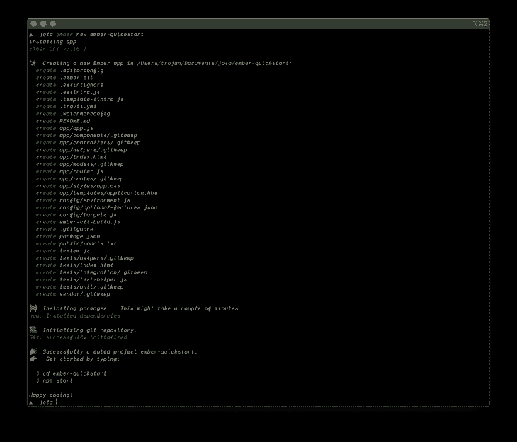

# 2020 年 Ember.js 入门- LogRocket 博客

> 原文：<https://blog.logrocket.com/getting-started-with-ember-js-in-2020/>

JavaScript 是推动网络发展的核心技术之一，已经发展了多年。最初它只是一种客户端脚本语言，现在它已经发展成为一种成熟的语言，随着它的发展，我们已经见证了许多库和框架的兴衰。

在本文中，我们将看看 JavaScript 最古老的前端框架之一 Ember.js。我们将探索其核心概念，并了解如何开始使用它。

## 什么是灰烬？

Ember.js 由耶胡达·卡茨和 T2·汤姆·戴尔于 2011 年创建，是一个开源的 JavaScript 框架，它以构建雄心勃勃的应用程序而闻名，并因其紧密的社区而被称为“together framework”。这是一个最适合构建大规模客户端应用程序的框架。

其官方[网站](https://emberjs.com/)将 Ember 描述为:

> 一个用于构建现代 web 应用程序的经过实战检验的高效 JavaScript 框架。它包含了构建可以在任何设备上工作的丰富 ui 所需的一切。

## 先决条件

本教程假设读者具备以下条件:

## 基本用法

安装 ember-cli 工具，这个工具包是为 ember.js 准备的，可以帮助你快速启动 Ember 项目。

使用以下命令安装 CLI 工具:

```
npm install -g ember-cli
```

全局安装 Ember CLI 包使我们能够在终端中访问`ember`命令，`ember new`命令帮助我们创建一个新的应用程序。

接下来，用`new`命令创建一个 ember 项目:

```
ember new ember-quickstart
```

这个命令将创建一个名为`ember-quickstart`的新目录，并设置一个新的 Ember 应用程序，其中包含引导项目所需的所有文件和配置。



将目录更改为应用程序目录:

```
cd ember-quickstart
```

启动开发服务器:

```
ember serve
```

在运行了`ember serve`命令之后，您应该会在`[http://localhost:4200](http://localhost:8080/)`上看到类似这样的内容。


## 了解 Ember 目录结构和体系结构

### 核心概念

Ember.js 是一个基于 MVC 的框架，它遵循一个单向数据流模式，即众所周知的 Data Down Actions Up (DDAU ),该模式受到了由[脸书](https://facebook.github.io/flux/)创建的 [Flux 架构模式](https://facebook.github.io/flux/docs/in-depth-overview/)的影响，并使用 [Glimmer VM](https://github.com/glimmerjs/glimmer-vm) 来渲染和更新 DOM，Glimmer 是一个**虚拟机**,它将车把模板代码编译成字节码，从而提供更快的体验。，它解析字节码并将视图呈现给用户。

理解 Ember 中的以下概念非常重要。

### 模型

模型是用于存储和维护我们的应用程序中使用的数据的对象，数据可以通过 [Ember Data](https://guides.emberjs.com/release/models/) 来检索，这是一个用于健壮地管理应用程序中的数据的库。默认情况下，Ember 数据库包含在我们的 Ember CLI 框架中。

### 控制器

控制器是模型的包装器，它们充当视图和模型之间的中介。它们用于检索、更新和修改模型中的数据。控制器执行对模型的数据请求。

### 模板

模板代表 MVC 中的视图层，它们是用来向用户呈现数据的接口。模板是用 handlebars 模板语言构建的。

### 按指定路线发送

路由由 Router 文件管理，它将路由映射到存储在`/routes`文件夹中的路由处理程序，路由器负责将使用模板创建的内容呈现给用户。

### 成分

组件是包含标记、逻辑和样式的 UI 元素的可重用集合。它们是应用程序的构造块。

### 目录结构

一个新的 Ember 项目的结构与此类似:

```
├── app
│   ├── app.js
│   ├── components
│   ├── controllers
│   ├── helpers
│   ├── index.html
│   ├── models
│   ├── router.js
│   ├── routes
│   ├── styles
│   │   └── app.css
│   └── templates
│       └── application.hbs
├── config
│   ├── environment.js
│   ├── optional-features.json
│   └── targets.js
├── ember-cli-build.js
├── package.json
├── package-lock.json
├── public
│   └── robots.txt
├── README.md
├── testem.js
├── tests
│   ├── helpers
│   ├── index.html
│   ├── integration
│   ├── test-helper.js
│   └── unit
└── vendor
```

### 文件和目录

让我们花点时间来理解文件和文件夹代表什么，以及如何使用它们。

*   `package.json` —包含有关项目的信息，如项目中安装了哪些依赖项以及可以运行的脚本
*   `/app` —该文件夹存放您的应用程序的核心代码。它包含应用程序的关键部分，如组件、模板、模型、路线和样式。您将主要处理这个目录中的文件
    *   `app.js` —这是主应用程序文件。这是应用程序的入口点
    *   `/templates` —该文件夹包含车把模板，这些模板在构建期间被编译到`/dist`文件夹中
    *   `/controllers` —该文件夹包含您的控制器，控制器是您定义绑定到模板变量的数据的地方
    *   `/helpers` —此文件夹包含车把模板中使用的辅助功能。助手函数是 JavaScript 函数，除了 Ember 中现成的功能之外，还可以为模板添加额外的功能
    *   `/index.html`—`app/index.html`文件为 Ember 应用程序奠定了基础。这是布置基本 DOM 结构、设置 title 属性和完成样式表/JavaScript 包含的地方
    *   `/models` —该目录是创建模型的地方，模型是表示应用程序中底层数据的对象。它们用于存储和维护我们的应用程序中使用的数据
    *   `/router.js` —该文件包含应用程序路由配置。此处定义的路线对应于`/routes`文件夹中的路线
    *   `/routes` —该文件夹包含路由处理程序文件，该文件设置加载路由时应该发生的事情
*   这个文件描述了 Ember CLI 应该如何构建我们的应用程序
*   `testem.js` — Ember CLI 的测试运行器 [Testem](https://github.com/testem/testem) 配置在`testem.js`中
*   `/public` —在构建期间，该目录将被复制到`dist`目录，用于没有构建步骤的资产，如图像或字体
*   `/vendor` —此目录是不受 npm 管理的前端依赖项(如 JavaScript 或 CSS)所在的位置
*   `/tests`—`tests`目录包含您的自动化测试，以及加载和运行测试的各种助手。QUnit 是 Ember 的默认测试框架
*   `/config`—`config`目录包含应用程序的配置文件、环境和浏览器构建设置

## 为什么开发者喜欢 Ember

Ember.js 受到使用它的开发人员的喜爱，原因有几个，其中包括:

*   约定优先于配置 —开发人员喜欢 Ember 的原因之一是它将约定优先于配置。[约定优于配置](https://en.wikipedia.org/wiki/Convention_over_configuration)，由[David Heinemeier Hansson](https://en.wikipedia.org/wiki/David_Heinemeier_Hansson)(Rails 框架的创建者)倡导，是一种软件设计范例，试图在不损失灵活性的情况下，减少使用框架的开发人员需要做出的决策数量。这意味着当框架做出这些决定时，开发人员不必担心做正确的事情或正确的架构
*   紧密团结的社区,—Ember 社区也是对拥有 2000 多个插件的许多人有吸引力的事物之一，该社区也优先考虑提出一种标准的做事方法，而不是让人们以不同的方式做事
*   **这是一把瑞士军刀** —它预配置了启动和运行应用程序所需的几乎所有功能
*   **稳定无停滞** —具有向后兼容性
*   **早期采用** —采用最新的 web 标准和最新的 JavaScript 语言特性

## 使用 Ember 的利与弊

### 赞成的意见

*   社区
*   一切都从盒子里出来了
*   详细的文档和资源
*   JavaScript 语言特性的早期采用
*   Glimmer VM 让编译快得离谱

### 骗局

*   尺寸——相当大
*   学习曲线——学习曲线很陡
*   僵化——没有探索的余地
*   许多教程已经过时了

## 结论

在本文中，我们已经了解了 Ember.js 是什么，我们已经了解了它的核心概念以及如何开始使用它。

Ember.js 框架已经走过了漫长的道路，有大量的指南和教程来帮助新用户使用该框架，请查看为来自其他框架的人制作的这个[教程](https://www.notion.so/Coming-From-Another-Framework-742653afa2844a1c852476e69b28e728)(它包括 [Vue](https://www.notion.so/Ember-for-Vue-Developers-12570a04b02a453da73a6b8d14736c5e) 和[React](https://www.notion.so/Ember-For-React-Developers-556a5d343cfb4f8dab1f4d631c05c95b))[文档](https://guides.emberjs.com/release/)也非常强大，并且深入解释了概念。Ember 最棒的部分是社区——他们有一个 [discord group](https://discordapp.com/invite/emberjs) ，他们的[讨论论坛](https://discuss.emberjs.com/)非常有用，而 [Dev.to feed](https://dev.to/t/ember) 相当足智多谋。

## 值得学习吗？

除了工作上特别需要的，我认为没有必要学习它，因为它的学习曲线很陡，除非你只是出于好奇。

低技能需求率也表明，使用更新更好的库/框架，如 React、Vue 或 Svelte，可能会更好。

## 您是否添加了新的 JS 库来提高性能或构建新特性？如果他们反其道而行之呢？

毫无疑问，前端变得越来越复杂。当您向应用程序添加新的 JavaScript 库和其他依赖项时，您将需要更多的可见性，以确保您的用户不会遇到未知的问题。

LogRocket 是一个前端应用程序监控解决方案，可以让您回放 JavaScript 错误，就像它们发生在您自己的浏览器中一样，这样您就可以更有效地对错误做出反应。

[](https://lp.logrocket.com/blg/javascript-signup)[https://logrocket.com/signup/](https://lp.logrocket.com/blg/javascript-signup)

[LogRocket](https://lp.logrocket.com/blg/javascript-signup) 可以与任何应用程序完美配合，不管是什么框架，并且有插件可以记录来自 Redux、Vuex 和@ngrx/store 的额外上下文。您可以汇总并报告问题发生时应用程序的状态，而不是猜测问题发生的原因。LogRocket 还可以监控应用的性能，报告客户端 CPU 负载、客户端内存使用等指标。

自信地构建— [开始免费监控](https://lp.logrocket.com/blg/javascript-signup)。