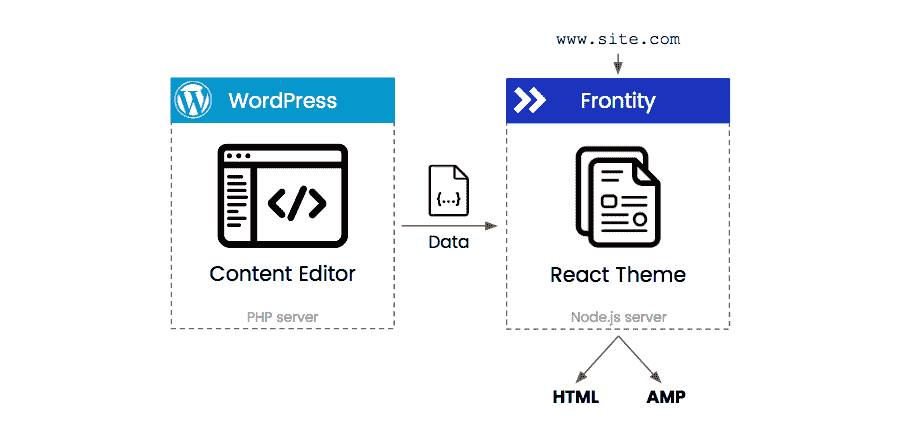

# Frontity - LogRocket 博客入门

> 原文：<https://blog.logrocket.com/getting-started-with-frontity/>

正如其登陆页面所描述的， [Frontity](https://frontity.org/) 是 WordPress 的一个开源 React 框架。本质上，它是一个无头 WordPress 站点和博客的动态框架。

Frontity 提供了 WP 的 REST API 和你的 React app 之间的无缝连接。如果没有 Frontity，此连接的配置会复杂得多。

## 奔跑前沿

对于本教程，我们将假设您已经安装了 [Node.js](https://nodejs.org/en/download/) 。

要开始 Frontity 项目，您只需运行以下命令:

```
npx frontity create my-app
```

按照提示进行操作，并等待安装依赖项。一旦这个完成，你就可以用`cd my-app`进入你的 app，然后用`npx frontity dev`启动服务器。

Frontity 帮助您设置从捆绑到服务器渲染所需的一切。现在，您就可以开始连接、设计和部署了。

### 安装

Frontity 的魔力发生在`frontity.settings.js`文件中。只需改变`state.source.api`属性，我们就能在你的通用 WP 网站上找到所有可用的帖子。

在这里，您可以编辑大多数可用的配置:菜单、路由器模块、多个站点、组件、包、head 标签等等。

文档中的[此处](https://docs.frontity.org/learning-frontity/setting)提供了您可以在该文件中使用的配置的完整概述。这就像处理一个小的 JSON 文件一样简单。

## 它是如何工作的

从文件结构来看，Frontity 项目看起来不像常规的 React 应用程序。这是一个自以为是的设计选择，它做得很好。你的应用程序的代码被分组到包中，就像在`node_modules`文件夹中一样，Frontity 让它们进行交互。

Frontity 提供两种类型的包:

**核心包**包括`frontity`和`@frontity/core`这些包包含了 Frontity 的核心，需要安装在任何 Frontity 项目中。

**境外套餐**，包括`@frontity/wp-source`、`@frontity/tiny-router`或`@frontity/my-theme`。这些需要在设置文件中声明。它们类似于 WordPress 的主题和插件。如果需要，您可以更改它们、添加更多或创建新的。

安装应用程序时，会自动安装核心软件包。

### 文件结构

```
/my-frontity-project
|__ frontity.settings.js
|__ package.json
|__ /node_modules
|__ /packages
    |__ /my-theme
    |__ /my-custom-extension-1
    |__ /my-custom-extension-2
```

如前所述，这种文件结构在 React 中是非正统的，可能会导致一些混乱。然而，一旦你把它分解开来，就不难理解了。

*   (我们已经在上面讨论过了)
*   `node_modules`–安装依赖项的位置(不打算修改)
*   `package.json`–用于 Node.js 配置
*   `packages/`–保存您的本地包，包括您的主题、自定义包，可能还有 Frontity 中您需要编辑的一些核心包

### 本地包

在上面的步骤中运行了`npx frontity create my-app`之后，你会在`packages`文件夹中找到选中的主题。在这里，您可以自由创建任何符合您口味的前端。

如果您打开一个包文件夹，您会发现常见的 React 项目结构带有一个包含 JavaScript 代码的`src`文件夹。默认情况下，您唯一需要的文件是`index.js`，它帮助 Frontity 与您的本地包进行通信。通过此文件，您可以导出以下任何元素:

*   **根** : React 将包含在应用程序中的组件
*   **Fills** :将包含在 app 中的 React 组件，但是在根之后注入
*   **State** :一个 JavaScript 对象，包含你的包暴露的所有状态
*   **Actions** :您的包需要工作或向其他包公开的一组动作
*   **库**:你的包为其他包公开的任何附加工具

你可以在文档的这里了解更多关于这些[的信息。](https://docs.frontity.org/learning-frontity/)

### 使用

本地包开发实践都是基于 React 的。有了 React 的基础知识，只要理解它的[基本架构](https://docs.frontity.org/architectur)就可以轻松与 Frontity 相处。

### 式样

如果你想让你的网站更加个性化，你可能会这样做，你可以在 JS 中使用 CSS。虽然这是 React 生态系统中的一种流行方法，但对于来自 WordPress 的开发者来说，这可能并不直观。你不应该担心，因为它仍然只是 CSS。

让我们先介绍一下 Frontity 的一些造型工具。

Frontity 是一个“固执己见的框架”，我们可以从它的目录结构和设计选择中看出这一点。它也有自己的状态管理器和造型工具。

**带造型的造型**

```
import { styled } from "frontity";

const StyledDiv = styled.div`
    width: 100%;
    text-align: center;
    color: white;
`;
```

**CSS 道具**

```
import { css } from "frontity";

const Component = () => (
    <div css={css`background: pink`}>
        Styling my theme
    </div>
);
```

**React 的风格道具**

注意:不建议这样做，因为它不会经过 Frontity 的优化过程。

```
const Page = () => (
  <div style={{
      margin: '40px',
      border: '5px solid pink'
  }}>
    NOT RECOMMENDED :(
  </div>
);
```

与其使用 React 的 style prop，不如使用上面列出的前两种方法。

* * *

### 更多来自 LogRocket 的精彩文章:

* * *

**T2`<Global>`**

您可能需要添加全局样式，如`h1`、`h2`或`body`标签。这可以通过`Global`组件来完成。

```
import { Global, css } from "frontity";

const Page = () => (
    <>
        <Global
          styles={css`
            body {
                margin: 0;
                font-family: "Roboto";
            }
          `}
        />
        <OtherContent />
    </>
);
```

> 建议仅对本机 HTML 标签使用 Global，因为这些样式也不会被 Frontity 优化。

有些人可能已经注意到，Frontity 在幕后使用了情感。如果您想了解更高级的配置，可以查看它的文档。

## 更大的

### 以打字打的文件

尽管 TypeScript 在 **Frontity** 中是可选的，但是框架确实为它提供了很好的支持。

当您试图修改对象的结构时，TypeScript 变得非常复杂。为了使它尽可能简单，最好创建与以后要消费的对象具有相同结构的对象。

### 搜索引擎优化

搜索引擎优化(SEO)在 Frontity 上实现得非常好。默认情况下，Frontity 提供一个格式良好的 HTML 文件，这对索引、性能和 SEO 至关重要。定制这些特性的能力也非常重要。使用 Frontity，您可以自定义以下内容:

Frontity 允许您在项目的根目录中添加一个 robots.txt 文件。

### 部署和托管

一旦准备好部署，就可以用`npx frontity build`创建一个生产版本。

这将创建一个优化的可服务应用程序，可以部署在任何 Node.js 服务器上。

现在，我们来谈谈主机。



为了适应 Frontity 中的部署和托管，您需要首先了解 [Frontity 的架构](https://docs.frontity.org/architecture)。

你需要一个 PHP 服务器来服务你的 WP API (BlueHost，Ionos，Siteground 等)和一个 NodeJS 服务器，它可以是无服务器的。这将使它负担得起。可扩展选项包括:Netlify、Firebase、Vercel、Lambda 等。

他们制作了一个关于如何用 Vercel 部署 Frontity 的指南[。](https://docs.frontity.org/deployment/deploy-using-vercel)

Frontity 建议您拥有两个域，或者一个单独的子域:一个用于 WP 仪表板，一个主域用于 Frontity 前端。例如，wp.logrocket.com 负责 API，logrocket.com 负责 Frontity 实例。

### WP 插件

Frontity 兼容所有与 REST API 兼容的插件。他们中的许多人只是将他们的输出添加到内容中，这在默认情况下是可行的。

对于与 REST API 不兼容的插件，您有两种选择。首先，您可以修改 Frontity 项目中的逻辑。你的其他选择是使用 PHP 在你的 WordPress 主题的`functions.php`文件中或者在一个自定义插件中扩展这个不合作的插件。

## 结论

结合流行的 CMS WordPress 的力量来创建一个静态网站是对 web 开发的巨大改进。不仅 Frontity 是盖茨比、Gridsome 等的好竞争对手。，但它也是自己的合作伙伴 WordPress 的竞争对手。

## [LogRocket](https://lp.logrocket.com/blg/react-signup-general) :全面了解您的生产 React 应用

调试 React 应用程序可能很困难，尤其是当用户遇到难以重现的问题时。如果您对监视和跟踪 Redux 状态、自动显示 JavaScript 错误以及跟踪缓慢的网络请求和组件加载时间感兴趣，

[try LogRocket](https://lp.logrocket.com/blg/react-signup-general)

.

[ ](https://lp.logrocket.com/blg/react-signup-general) [](https://lp.logrocket.com/blg/react-signup-general) 

LogRocket 结合了会话回放、产品分析和错误跟踪，使软件团队能够创建理想的 web 和移动产品体验。这对你来说意味着什么？

LogRocket 不是猜测错误发生的原因，也不是要求用户提供截图和日志转储，而是让您回放问题，就像它们发生在您自己的浏览器中一样，以快速了解哪里出错了。

不再有嘈杂的警报。智能错误跟踪允许您对问题进行分类，然后从中学习。获得有影响的用户问题的通知，而不是误报。警报越少，有用的信号越多。

LogRocket Redux 中间件包为您的用户会话增加了一层额外的可见性。LogRocket 记录 Redux 存储中的所有操作和状态。

现代化您调试 React 应用的方式— [开始免费监控](https://lp.logrocket.com/blg/react-signup-general)。